.. vim: syntax=rst

Git教程
------------------

Git是一个功能十分强大的分布式版本控制系统，主要用于有效、高速地对各种各样的项目进行版本管理。

Git的诞生，起源于linux社区的一位大牛Andrew(samba之父)写了可连接BitKeeper仓库的外挂，
这引起了BitMover 公司的震怒，收回了对linux社区免费使用BitKeeper的授权。于是Linux之父，
Torvalds，花了十天时间为Linux社区开发了新的版本工具--Git。

Git的特点
~~~~~~~~~~~~~~~~~~

相较于其他版本管理工具，Git有以下几个优点:

- 快照记录。git和其他版本管理工具重要差别在于存储数据的方式。
  其他版本工具通常将它们保存的信息看作是一种原始数据+文件修改的记录。
  而Git在储存时是生成快照来记录全部文件（快照不是所有文件的单纯拷贝，而是一种对全体文件的索引）。

- 分布式。每一位项目开发人员的电脑里，都有项目的完成备份，避免造成资料受损无法挽回的后果。
  同时，本地的项目备份使得所有的版本管理操作都在毫秒级别内完成。
  这与SVN、CVS等集中式版本工具时常要等待中央服务器响应相比,用户体验显得非常好。

- 开源。这与linux内核一样，开放源码保证了Git的可靠性和安全性，也有利于Git的功能越来越强大。

Git的学习层次
~~~~~~~~~~~~~~~~~~~~~~~~~~

每一个Git的学习者，在遇上Git复杂繁多的命令时，都难免心里发怵。客观来说，Git确实不及SVN那么简单好用，
新手要用Git好不容易。但是换个角度看，若是我们能熟练掌握Git，体验到其中的奥妙，
会发现自己再也不愿意回到SVN的怀抱了。

王国维在<<人间词话>>里说:欢古今之成大事业、大学问者，必经过三种之境界:"昨夜西风凋碧树。
独上高楼，望尽天涯路。“此第一境也。”衣带渐宽终不悔，为伊消得人憔悴。"此第二镜也。
“众里寻他千百度，那人却在灯火阑珊处。”此第三镜也。

Git的学习同样也可以分为三个层次，用户可以根据自己实际情况进行学习。

- 第一层，Git的基础使用，这一阶段适合小白用户学习，主要是学习利用Git来下载一些开源项目，学会对项目进行增删改查。

- 第二层，Git的分支、标签、版本管理等相关用法，这一阶段适合在工作中频繁使用Git来进行开发的用户，学会进行版本追溯和各种冲突解决。

- 第三次，Git的版本库分析，这一阶段适合对Git原理感兴趣的开发者学习，深入了解Git在命令行的背后，对版本库进行了什么样的操作。

可能很多人觉得对于Git，学习基本使用就够了。但是实际上，随着项目开发越来越复杂，会遇到很多需要使用Git复杂指令的场合。
靠死记硬背很容易忘记它，也很难用好。这个时候去了解它的一些背后原理，对加深Git的理解大有脾益，复杂命令将不再复杂。

Git的安装
~~~~~~~~~~~~~~~~~

Windows系统

到Git官网下载安装包,直接安装即可。

https://gitforwindows.org

Linux系统

根据不同发行版，使用相关包管理工具安装即可。

比如Ubantu：在终端执行“sudo apt-get install git -y”即可。

Git的基础使用
~~~~~~~~~~~~~~~~~~~~

Git里面有很多比较晦涩的专业术语，如果不熟悉这一套术语，常常会在Git出现各种提示信息的时候摸不着头脑。
这里中文翻译了Git中比较重要的部分术语。先对这些专业术语有初步的印象，后面的教程再逐步讲解它的含义。

.. csv-table:: Frozen Delights!
    :widths: 10, 10, 10 ,10 ,10 ,10

    "respository","仓库/版本库","commit","提交","snapshot","快照"
    "SSH","安全传输协议","fetch","获取代码","SHA1","哈希值"
    "HEAD","当前分支","checkout","检出分支","Gerrit","代码审核"
    "pull","拉取代码","rebase","分支衍合","stash","储存" 
    "push","推送代码","tag","标签","index","索引" 
    "merge","分支合并","master","主分支","cherry-pick","条件分支"
    "add","添加改动","origin","远程分支","revert","反转提交"

Git本地仓库操作
^^^^^^^^^^^^^^^^^^^^^

1、Git安装完成后，新建一个文件夹“Git_demo”。右键点击，选择“Git Bash Here”选项打开,
输入“git init”命令。该指令会在当前目录下生成一个隐藏文件“.git”，这个“.git”文件就是术语中本地仓库/版本库。
如下图

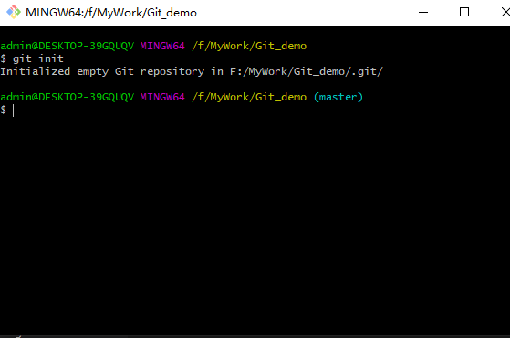

2、添加一个newadd.txt文件，使用“git status”命令查看状态。

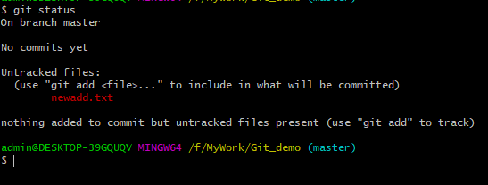

此时新添加的文件处于“Untracked”未跟踪状态，提示使用“git add”命令添加文件到暂存区。

3、执行“git add newadd.txt”命令，重新查看状态。

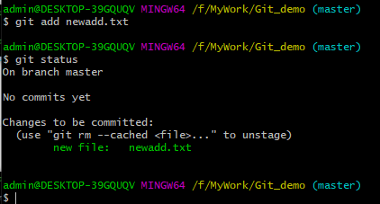

 提示:new file：newadd.txt，说明文件已经添加到了暂存区。

 4、输入“git commit -m ”add a new",把暂存区新修改的文件提交到仓库里面去保存，
并在仓库中用“add a new”这条语句来记录这一次的提交。

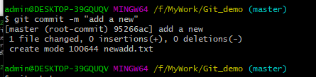

5、查看当前状态，git提示没有新的可提交文件，说明文件已经提交到仓库中去了。

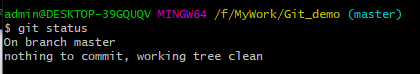

6、在newadd.txt文件中加入一句“change test/\r/\n”,保存退出后，查看状态。

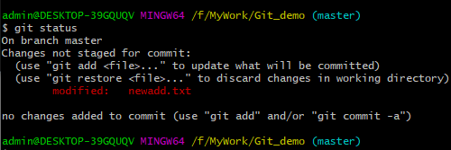

此时git不再提示这是一个新文件，而是一个已经修改(modified)的文件。

7、重复前面提到添加到暂存区、提交到仓库的步骤，那这个改动的文件就已经保存下来了。
使用“git log”命令可以查看到这两次提交的记录。如下图:

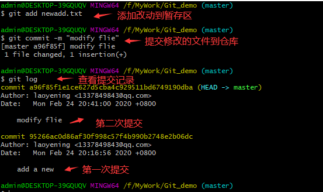

在输出的历史记录中，commit后面跟着的一串数字，是该文件的SHA-1 校验和，
这个校验和在git中称为commit-id。“git show”命令可以通过commit-id，
找到文件对应的修改记录。

8、执行“git show + commit-id”命令，可以看到非常详细的修改记录，包括作者、
时间以及详细的修改内容。+号就代表新加的内容，-号代表删减的内容。

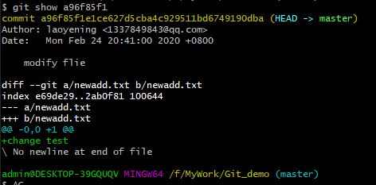

9、如果是特别关注某个文件，还有一个“git blame”命令可以迅速地找到这个文件的改动。
输入“git blame newadd.txt”,该文件每次被提交仓库的commit-id、作者、时间、内容都显示出来了。
如下图:

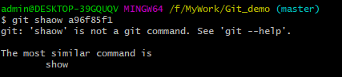

Git远程仓库操作
^^^^^^^^^^^^^^^^^^^^^

远程仓库是指托管在Internet或局域网中的项目版本库。现在较为流行的远程仓库是GitHub和Gitee。
这里以GitHub为例来说明远程仓库的项目创建和下载。

1、登录`GitHub官网 <https://github.com>`_ ，按提示注册一个用户后。打开右上角的'+'号，
选择“New repository”项，创建一个新的远程仓库。
如下图:

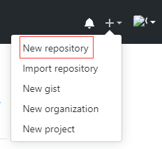

2、设置该远程仓库的名字、概述，选择该远程仓库是公开的还是私有的。
这里把它设为公开的，并设置它的名字为“git_pratice”。如下图：

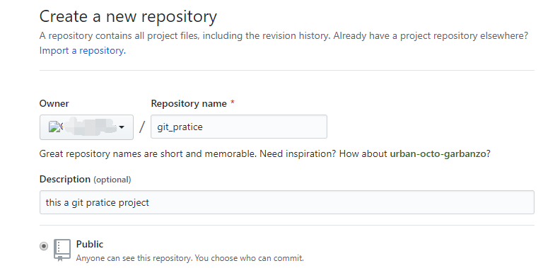

可以看到GitHub生成了两种远程连接方式，SSH和HTTPS。

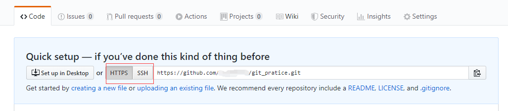

3、输入“git remote add origin + ”https地址“ ”命令，就能把我们本地仓库的项目与该远程仓库相关联，
如下图:

4、这时候就可以把“Git_demo”文件夹中的仓库内容推送到远程仓库了，使用“git push -u origin master”命令进行推送，

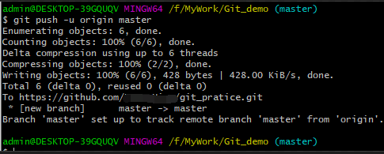

到这里，“Git_demo”文件夹中的本地仓库就成功推送到远程仓库了。以后只要遵循“添加到暂存区”->“提交到本地仓库”->“推送到远程仓库”的步骤，
就能初步完成远程仓库的开发工作了。

5、如果在GitHup上面发现了一些自己感兴趣的项目，可以用“git clone + ”https地址“ ”命令进行克隆。克隆完成后，
会自动在当前目录下创建一个本地仓库，这个本地仓库可以看作是该远程仓库的备份，而且已经与该远程仓库相关联了的。
如下图:

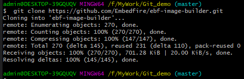

一些成熟稳定的远程仓库往往是多人合作、共同开发的，通常比我们自己创建的项目复杂很多。
这时候如果你想参与到这种规模的项目开发，那上面的介绍的基本命令就不够用了，需要进一步的深入学习。

Git的分支、标签、版本回溯
~~~~~~~~~~~~~~~~~~~~~~~~~

分支
^^^^^^^^

Git的分支管理功能是多人协同开发的利器，在大型项目的开发中，开发者通常会先切出远程仓库的一个分支，
等到在分支上完开发完功能后，再把分支合并到主支中去。

在分支上开发有两个好处，一是避免所有开发者杂糅在主支上开发，导致频繁的提交代码冲突。在新开发的功能未经过严格测试之前，
提交代码到主支上是风险很大的。不能轻易地因为代码冲突就修改其他开发者的代码，这必须是经过慎重考虑的。
二是分支的提交记录不会影响到主支，我们可以随时提交自己的代码到远程仓库的分支中作备份，避免自己因为电脑的硬盘故障而导致本地仓库的资料丢失。

下面模拟两个开发者(A、B)协同工作的流程，帮助大家更好地理解分支的使用、分支冲突解决和版本回溯等功能。

A和B此时分别使用git clone命令，把前面创建的git_pratice远程仓库克隆下来。
如下图:

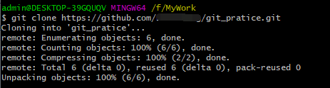

开发者A
“”“”“”“”“”“”“”“”"

1、现在模拟开发者A工作，使用git branch命令，创建一个本地分支，命名为“test_branch1”。
使用“git branch -a”命令查看所有分支。。
如下图:

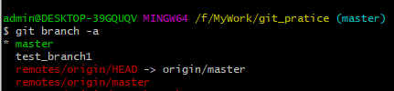

可以看到现在本地仓库中有两个本地分支，其中master默认为主分支，已经和远程仓库关联，
而test_branch1分支为新创建的本地分支。*表示当前本地分支指向master分支。

再看远端仓库，“remote”表示远程分支，但是HEAD不是指一个独立分支，
它表示的是当前分支。所以现在远端仓库只有一个master分支，远端仓库的当前分支指向master。

2、输入“git checkout test_branch1”命令检出test_branch1分支，修改newadd.txt文件内容分为“this is branch1”
如下图:

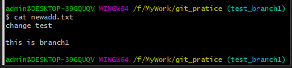

3、把改动添加到缓存区（git add）、提交到本地仓库(git commit)。
如下图:

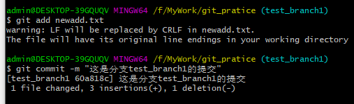

4、执行“git push origin +“分支名””命令（origin是GitHub的默认主机名)，在远程仓库建立test_branch1分支，
并把当前本地分支(test_branch1分支)的内容推送到上去。如下图:

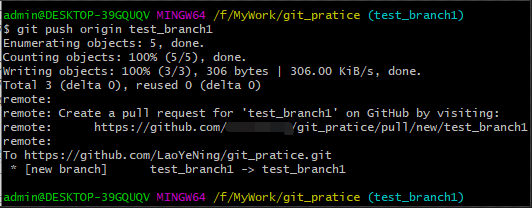

在GitHub远程仓库上，可以看到新创建了分支，如下图：

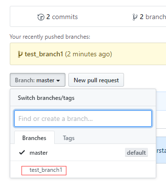

5、假设现在开发者A工作结束了，那么它需要将本地test_branch1合并到mster分支上，再推送到远端仓库的master分支。
需要执行的步骤是:切回到master分支，再使用“git merge +分支名”就能把test_branch1分支合并到master分支。如下图:

.. image:: media/git_merge.png
   :align: center
   :alt: git_merge

6、使用“git push origin master”命令，把当前本地分支（新合并的本地master分支）推送到远端的master分支。
git显示已经成功推送。
如下图:

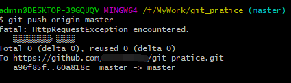

开发者B
“”“”“”“”“”“”“”“”"

1、现在轮到开发者B来开始工作，前面创建、捡出、修改和推送分支的步骤与开发者A是一致的。
但是分支名称改为test_branch2，修改的内容为:“this is branch2”。
如下图:

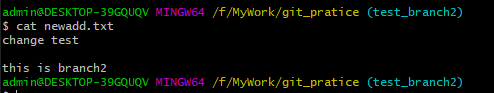

2、同开发者A一样，开发者B的test_branch2分支也提交到远端仓库了。现在远端仓库有三个分支，
如下图：

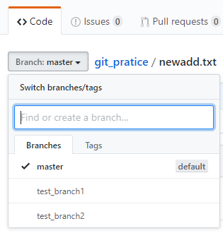

3、假设此时开发者B也完成工作了，需要把test_branch2合并到master主支，然后提交到远程仓库master分支
需要执行的步骤是:切回到master分支，再执行“git merge +分支名”就能把test_branch2分支合并到master分支。

如下图:

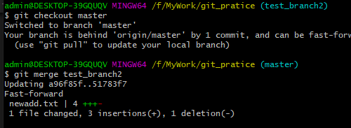

4、使用“git push origin master”命令，把当前本地分支（新合并的本地master分支）推送到远端的master分支。
出乎意料的是，这一次推送失败了。

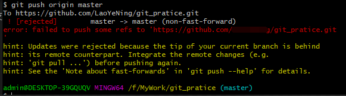

这是因为之前开发者A已经修改了远程仓库的文件，但是现在开发者B的本地仓库中并不知道开发者A修改了什么内容，
所以远端仓库不允许再次推送，否则开发者A修改的内容就被覆盖了。

因此，需要先使用git pull命令把开发者A修改的内容同步到开发者B的本地仓库中，
此时如果开发者A和开发者B修改了相同的文件，那么git会识别出来并且提示你去解决冲突。
如下图:

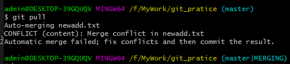

5、打开git提示冲突的文件，解决冲突。
如下图:

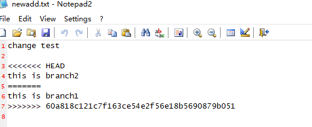

上面“<<<<<<< HEAD”部分代表的是本地仓库的修改内容，“=======”表示内容分割线，“>>>>>>>”表示目前远端仓库的内容。

6、开发者B经过认真思考，觉得应该以自己的内容为准。于是删除了远程仓库的内容和冲突符号，只保留自己的改动。

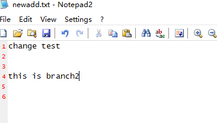

7、把解决冲突后的内容，重新添加到暂存区、提交到本地仓库。
如下图:

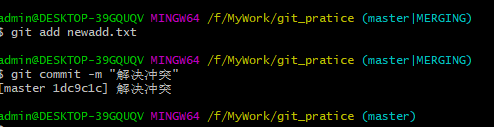

8、此时再次使用“git push origin master”命令，把当前本地分支（新合并的本地master分支）推送到远端的master分支。
如下图:

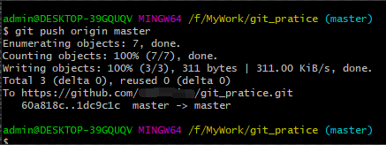

此时，修改的内容就成功推送到远端仓库了。

9、如果确认功能完成开发后，输入“git branch -d +分支名”命令可以删除本地分支，
输入“git push --delete origin +分支名”命令可以删除远程分支。

如下图:

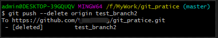

远程分支已经删除成功。

标签
^^^^^^

上面介绍了如何通过“git show + commit-id”命令来查看某次历史提交的详细记录。但是commit-id是一串冰冷、
无规律的数字，十分难以记忆。有时候开发者完成了一个大版本的功能开发，此时新功能未经市场验证，
，可能后面需要频繁review代码、解决bug。那么每次追溯都要重复地查询commit-id，效率就会很低。

在这种场景下，git的标签功能就很重要了。它可以对某一时间点上的版本打上指定标签，
利用该标签可以方便快速地进行查看历史提交信息。可以把标签理解为给commit-id起一个别名。

1、用“git log”命令可以查询到历史提交的commit-id。输入“git tag +标签名 +commit-id”命令，
给commit-id对应的历史版本打上一个标签。
如下图:

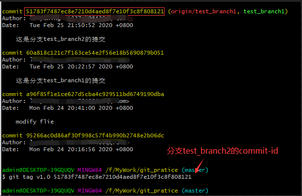

找到分支test_branch的提交，并给这个版本的提交打上“v1.0”的标签。

2、执行“git show v1.0”命令，可以查看到该次提交的详细信息，包括作者、日期、文件改动内容等等。
如下图:

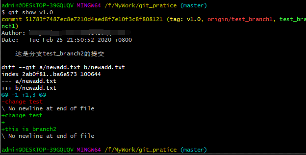

3、使用“git push origin +标签名”命令，可以把该标签推送到远端分支。加 --tags 选项表示推送全部标签。
如下图:

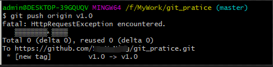

git提示标签推送成功。

4、使用“git tag -d +标签名”命令删除本地仓库的标签，使用“git push origin :refs/tags/+标签名”来移除远端仓库的标签。

git提示本地标签已经删除，远端仓库相应的标签也已经删除。

版本回溯
^^^^^^^^

一旦开发者仓库中提交了错误的修改内容，就需要进行版本回溯。版本回溯的意思是把仓库里面的内容还原到某一次历史提交的状态中。
通常在新产品出了bug时，就可以通过版本回溯来定位bug。

1、用“git log”命令查询到历史提交的commit-id。输入“git reset --hard +commit-id”命令，
就能把仓库还原到commit-id对应的历史提交的状态中。
如下图:

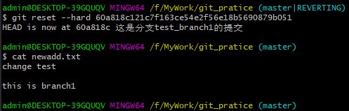

看到newadd.txt已经还原到test_branch1提交的状态。

2、使用“git push -f origin master”，强制推送到远端仓库，远端仓库也将被还原到test_branch1提交状态。

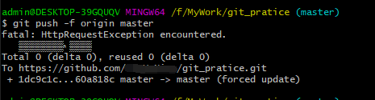

3、版本回溯还有其他更优雅的方法，比如使用标签替代commit-id，使用git revert等，
考虑到篇幅，无法一一详述。大家感兴趣可以自行查阅git说明文档。

Git的版本库分析
~~~~~~~~~~~~~~~~~~~~~~~~~

本地仓库存储在.git文件夹中，.git文件夹目录如下图所示:

.. image:: media/git_store.png
   :align: center
   :alt: git_store

其中，

- hooks目录下是存放一些shell脚本，可以指定某些shell脚本在git指令执行时运行。

- info 目录存放包含仓库的部分信息，里面的exclude文件可以排除管理的文件，不同的地方是它不会被共享。

- logs目录保存所有的历史引用记录(commit-id)。

- objects目录中存放所有的git对象(commit、tree、tag、blob)。

- refs目录存放具体的引用信息。三个子目录heads、remote、tags分别记录本地仓库、远端仓库和标签最后一次的commit-id。

- config目录里面记录了远程仓库的名字(默认为origin)、url、本地仓库主支(默认为master)等。

- COMMIT_EDITMSG文件记录最后的一次commit message

- description文件是仓库的描述信息

- index 是一个二进制文件，实际上就是暂存区。

- HEAD文件记录当前分支。

- FETCH_HEAD文件记录远端仓库的数据获取过程，指向远端仓库的最新版本。

- ORIG_HEAD:HEAD指针的前一个状态。

- packed-refs：clone仓库时所有的引用信息。

git对象
^^^^^^^^^^^^^^^

待后续补充

git add/commit底层机制
^^^^^^^^^^^^^^^

待后续补充

常用git命令汇总

