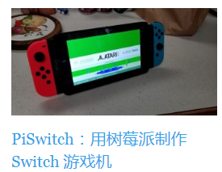
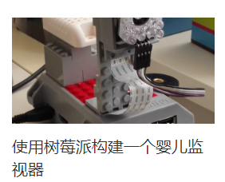

.. vim: syntax=rst

如何学习linux开发
----------------

嵌入式linux学习路线
~~~~~~~~~~~~~~~~~~~~

我们立足于树莓派的开发方式，借鉴其一系列先进的设计理念和软件架构，力求为电子爱好者提供强大、好用的DIY平台，
方便实现各种天马行空的想法。与此同时，所有的软件和芯片手册将全部开源，为有志于从事嵌入式linux行业者后续深入学习各种软件架构和驱动程序扫清障碍。

适合哪些用户群体
^^^^^^^^^^^^^^^^^^^^^^^^^^^
嵌入式linux学习者大体可以分为两类，一类是进阶用户，主要指已经有大量mcu工作经验的开发者，
他们希望进阶到更有难度，薪资更高的mpu开发中去。另一类则是学生用户，主要是刚开始接触嵌入式开发的大学生群体。

对于前者而言，出于工作的压力和升职加薪的需求，通常会比较关注课程学习的深度，关注学习完成后，能不能顺利地利用学习的知识来跳槽升职加薪。
但是对于后者，他们没有行业经验，没有工作压力，更加注重的是课程的有趣性，功能性，想知道通过这个课程我有能力做出什么东西来。

本教程兼顾两种用户的需求，首先，最大程度上降低入门门槛，这主要指两个方面，一方面简化开发环境的搭建，尽可能避免各种各样的软件版本问题，
以及各种电脑系统的兼容性问题。另一方面是先学习嵌入式linux的高频技能，所谓高频技能，就是指在大部分实际开发工作中都较为频繁地使用的技能。
其次，是尝试使用这些高频技能去开发一些炫酷、自己感兴趣的产品，进一步去了解嵌入式linux各式各样的产业，体验嵌入式linux在人类实际生活中的影响。
最后，在对嵌入式linux有整体了解后，根据自己的个人兴趣和实际工作需求，选择嵌入式linux的某一个方面深入研究。

通常，国内传统的嵌入式linux学习路线大体为:

1.  linux基本操作+c语言进阶
#.  ARM裸机开发
#.  linux系统移植(u-boot移植、kernel移植、构建根文件系统)
#.  linux驱动开发
#.  linux应用编程
#.  项目实战

按照上面的学习路线走下来，一方面，需要耗费巨大的学习精力，哪怕全天学习，一般也要4个月以上的时间。这对于还没有确定职业方向的学生用户，
想玩嵌入式linux的门槛太高。

另一方面，不贴合进阶用户实际工作需求，因为大部分课程在设计的时候充斥了许多低频技能，这些技能在大部分嵌入式linux工作中很少用上(比如ARM裸机开发)。
而当工作中真正遇到系统性能问题的时候，往往又没有能力去实际解决问题，因为你所学习的linux系统移植，不过是用芯片公司团队做好的系统镜像，
自己复制粘贴一些文件，修改一些配置，然后重新编译安装到系统里面去，真正高阶的技能其实没学到多少。

为什么选择树莓派教育理念
^^^^^^^^^^^^^^^^^^^^^^^^^^^

树莓派（Raspberry Pi）是尺寸仅有信用卡大小的一个小型电脑，您可以将树莓派连接电视、显示器、键盘鼠标等设备使用，
它的设计目标是用较为低廉的价格和大量开源软件，为青少年提供一个计算机教育平台，用于培养计算机程序设计的兴趣和能力。

现在树莓派已经拥有全球100万用户的作品展示社区，这意味着树莓派有海量的应用可以参考和模仿。
下面是它们的一些DIY案例:

树莓派的成功给了国内linux教育一些深刻的启发，那就是编程教育应该是强调探究性、项目式学习，以此激发探索的好奇心和享受实现自己目标的成就感。
从这个角度而言，掌握一些必备的计算机编程技能只是完成了基本的知识获取过程，重点是站在巨人肩膀上的各种创新。

考虑到开发者技术水平参差不齐，树莓派做了很多软件架构上的优化和开发了很多方便好用工具。
这是树莓派广受好评和便于在社区推广的一大原因，非常值得我们去借鉴学习。

但是树莓派也有它的不足之处，那就是它的底层的bootloader和核心数据手册是闭源的，普通用户无法获取。
所以树莓派往往更被学生群体或者其他一些创客群体所青睐，而不太适合嵌入式linux从业者的进阶学习，闭源的部分导致它在工程项目中使用也带来诸多不便。

