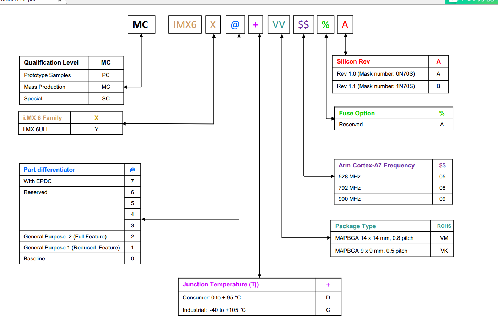

.. vim: syntax=rst

i.MX系列芯片简介
------------------------------

本章简要介绍一下为什么我们采用i.MX系列应用处理器进行讲解，使用该系列芯片学习Linux开发有什么优势。

i.MX 系列应用处理器
~~~~~~~~~~~~~~~~~~~~~~~~~~~~~~~~~~~~

i.MX 应用处理器包括i.MX8、i.MX7、i.MX6及i.MX28系列，被广泛应用于工业控制、汽车电子领域，久经市场考验。而且它的产品线非常丰富，用户熟悉其中一款产品后就能非常方便地迁移至不同的平台。它们的前身是Freescale旗下的产品，目前属于NXP公司，所以在查阅资料和代码时，在看到F
reescale的一些标签时不要奇怪。NXP承诺对这些产品供货周期持续10年以上。学习应用处理器的驱动程序开发时，芯片原厂的技术支持是非常重要的，NXP官方提供的资料包含uboot、Linux内核的Yocto定制示例工程，完善的裸机SDK软件库等，相比之下部分芯片厂商甚至连寄存器手册都遮遮掩掩，个人
难以获取，这无疑提高了学习的门槛。

所以应用领域广泛、产品供货稳定、官方支持的资料丰富，这是我们选择它们作为学习平台的原因。

其中i.MX6系列应用处理器包含基于Cortex的单核、双核和四核系列的的产品，其架构有，主要采用Cortex-A7，Cortex-A9作为内核，部分型号采用Cortex-A9+Cortex-M4的双核心方案。主频从528MHz~1.2GHz不等。该系列芯片主要应用在车载多媒体系统、数字标牌电子阅读
器、人机界面、物联网网关、智能工业控制系统等轻量、低功耗的领域，在物联网推进的大潮下，该芯片定有一番作为。

本书讲解主要采用的是i.MX6ULL系列处理器，它包含一个Cortex-A7内核，主频有528MHz、792MHz和900Mhz，具体芯片的特性可参考图
2‑1的命名规则说明进行区分。如型号为MCIMX6Y2CVM08AB的芯片，它属于i.MX6ULL系列，是主频为792MHz、芯片封装为BGA，尺寸为14x14mm，焊盘间距为0.8pitch的工业级芯片。

|imxser002|

图 2‑1 i.MX6 ULL芯片命名规则

Cortex A7内核简介
~~~~~~~~~~~~~~~~~~~~~~~~~~

Cortex-A7处理器是ARM开发的一种高能效处理器架构，它的架构和功能集与Cortex-A15 处理器大部分相同，不过Cortex-A7
处理器的结构侧重于功耗与性能的平衡，因此这两种处理器可在big.LITTLE（大小核伴侣架构）配置中协同工作，从而提供高性能与超低功耗的组合。单个Cortex-A7处理器的能源效率是ARM Cortex-A8处理器的5倍，性能提升50%，而尺寸仅为后者的五分之一。

联发科的MT6589手机处理器采用的是4核Cortex-A7架构，它曾被用在红米、中兴U956、华为G520等手机上。不过目前手机性能要求更高，所以Cortex-A7架构处理器的应用场景已转移至低功耗嵌入式设备上，如可穿戴设备，IoT节点等。i.MX6系列处理器有Cortex-A9和Cortex-A
7的不同型号，需要根据具体的应用场景进行选择。

i.MX RT系列
~~~~~~~~~~~~~~~~~~

NXP针对MCU（微控制器）的应用场景，推出了i.MX RT系列跨界处理器，该系列下又包括i.MX RT1020、i.MX RT1050及i.MX RT1060等子系列芯片。所谓“跨界”，是指它自身的定位既非传统的应用处理器也非传统的微控制器。

它在i.MX6的MPU（应用处理器）平台之上把其Cortex-A内核换成Cortex-M内核，使得它具备了应用处理器的高性能及丰富的功能，又具备传统微控制器的易用、实时及低功耗的特性。

如果大家觉得学习Linux开发太过复杂，可以先学习一下i.MX RT系列微控制器的应用，因为除了内核，在外设等方面可以说是完全一样，而开发i.MX RT系列微控制器的应用与传统MCU无异，熟悉了i.MX RT系列芯片之后，基本可以跳过i.MX
6裸机程序开发的环节，再学习i.MX6时，仅专注于Linux相关知识即可。

针对i.MX RT系列芯片应用，野火电子提供了非常详细的教程，覆盖裸机至实时操作系统及LwIP应用的教程：

-  《i.MX RT库开发实战指南》

-  《FreeRTOS内核实现与应用开发实战指南》

-  《RT-Thread内核实现与应用开发实战指南》

-  《uCOS-III内核实现与应用开发实战指南》

-  《LwIP应用开发实战指南》

对于学习Linux依然心怀忐忑，希望学习MCU过渡的读者，这些是非常适合的教材。具体资料下载地址请参见链接：\ https://github.com/Embdefire/products/wiki\ 。

|imxser003|

图 2‑2 我这有本秘笈（图片来源：周星驰 电影《功夫》）

|imxser004|

图 2‑3 老乡别跑（图片来源：周星驰 电影《功夫》）

.. |imxser003| image:: media/imxser003.jpg
   :width: 4.12879in
   :height: 2.99977in

