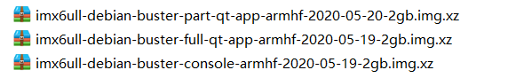
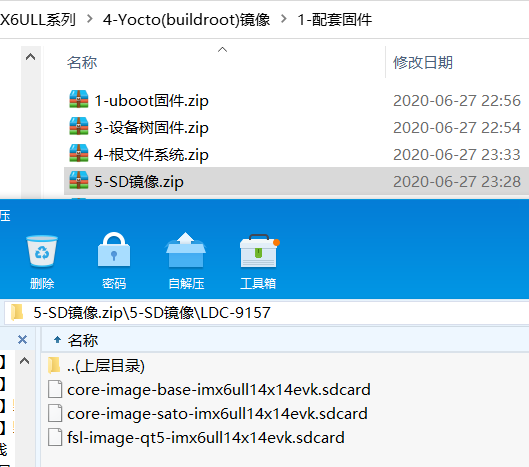

.. vim: syntax=rst

认识系统镜像和固件
----------------------------------------
通过本章节浏览野火提供的系统镜像，了解镜像的大致固件构成。在以后的学习中我们将会了解到如何烧录和构建镜像固件。

镜像文件格式
~~~~~~~~~~~~~~~~~~~~~~~~~~~~~~

安装Ubuntu系统时，我们使用到了Ubuntu提供的“iso”后缀的系统镜像文件，这是在PC上常用的系统镜像文件格式。

所谓镜像文件其实与压缩包类似，它将一系列文件按照特定的格式制作成单个文件，方便用户下载和使用。
iso文件的一个重要特性是它能被某些软件识别直接刻录到光盘上，而虚拟机虚拟的光驱则可以直接把iso文件像光盘一样加载读取，
从而通过iso系统镜像安装操作系统。

为了扩展适用范围，人们又制定了img文件格式，主要用于创建磁盘的镜像文件（disk image），
它可以用来打包整个磁盘或光盘的内容。img是iso文件格式的超集，它向后兼容iso文件格式。

嵌入式单板机一般没有光驱，而它们通常支持运行SD卡里的操作系统，所以嵌入式的系统镜像通常使用img文件的形式发布。
人们通常在PC上使用软件通过读卡器把img镜像文件烧录至SD卡，然后把SD接入到嵌入式单板机上运行。

.. hint:: 部分工具生成的镜像文件后缀名不一定是img，例如使用yocto生成的系统镜像，通常是以“.sdcard”为后缀的。

debian、yocto（buildroot）镜像的差异
~~~~~~~~~~~~~~~~~~~~~~~~~~~~~~~~~~~~~

目前我们主要为i.MX6开发板提供了两种类型的镜像，分别是debian镜像以及使用yocto工具构建的镜像。

其中 **debian镜像** 是基于debian社区提供的构建工具制作的debian 10 buster稳定发行版，
而 **yocto镜像** 则是基于nxp提供的yocto工具配置构建的。

还有很多系统工程师使用buildroot来构建镜像，buildroot工具构建出来的镜像与yocto镜像类似，
不过buildroot工具使用起来相对简单一点。我们把buildroot与yocto镜像都归类为 **自定义镜像**。

由于debian镜像与自定义镜像的根文件系统不同，导致两种镜像的使用感受差异非常大。
使用debian镜像时，可以保留我们在x86 PC上使用Debian、Ubuntu的习惯，通过apt包管理工具直接安装各种各样的软件，
例如python、java、php等运行环境，各种使用配置也跟PC上的类似，这会给我们的开发和学习带来极大的便利。

而使用yocto（buildroot）镜像时，如果我们想给系统安装某些软件，就需要重新使用yocto（buildroot）工具构建文件系统，再烧录到开发板上，非常麻烦。
特别是对Linux系统不熟悉的用户，使用它来学习效率会非常非常低。

使用yocto（buildroot）镜像的主要优势是：如果有需要，它可以把镜像做得非常小，我们制作的debian镜像最小的约为340MB，如果再裁剪的话，可能很多debian系统的功能都会没用了，没有意义。
而使用yocto（buildroot）工具可以制作出50MB以内的镜像。当然了，如果想要用yocto（buildroot）工具做出debian系统的效果，它并不会比debian镜像小。
所以通常在产品功能固定、应用程序本身依赖小、flash容量要求苛刻且有非常熟悉系统的工程师时，才会采用这种方案定制自己的镜像。
简单来说，debian镜像是整个开源社区的力量制作出来的，而且无论是在x86、arm等各种平台上使用它都非常多，基于debian还衍生出各种各样的Linux发行版。

在功能上，可以把debian镜像比如为链锁店麦当劳制作的食品，它能适应大众的口味，而且标准化、质量稳定、遇到问题也容易解决。
而使用yocto（buildroot）工具构建的镜像，就是某个厨师专门根据你的要求来做菜，私人定制，但它的质量完全取决于该厨师的水平。

据我们了解，绝大多数企业应用，使用debian镜像完全满足需求，大大节省了定制系统的人力与时间。
对于有志于成为系统工程师的同学，我们也强烈建议先学习好如何构建debian镜像，再去研究buildroot，最后再学习yocto工具。

**除特殊说明外，本书的教程都是基于debian镜像进行讲解的。**

开发板debian镜像说明
~~~~~~~~~~~~~~~~~~~~~~~~~

野火提供适用于i.MX6开发板的镜像可在如下链接下载（含debian及yocto镜像）：
https://ebf-products.readthedocs.io/zh_CN/latest/linux/ebf_i.mx6ull.html#debian

针对不同的使用情况，我们的debian镜像主要提供了下图几个版本：

这些镜像都是以 ``imx6ull-debian-buster-xxx-armhf-日期.img.xz`` 的格式命名，其中的xxx表示镜像版本。
它们是img格式的文件，并且使用了xz进行压缩，直接通过Etcher软件即可把镜像烧录到SD卡中，烧录步骤将在下一章节进行详细说明。

上述镜像的简介如下：

- ``part-qt-app版本``: **这是开发板出厂镜像**，该镜像自带野火出厂Qt App的 **部分** 功能，裁剪了播放视频相关的App，烧录到存储器后约420MB。
- ``full-qt-app版本``: **这是学习推荐使用的镜像**，该镜像自带野火出厂Qt App的 **全部** 功能，烧录到存储器后约900MB。
- ``console版本``: Debian的纯净版固件，不带桌面环境和野火的QT App，烧录到存储器后约340MB， **推荐在该版本之上搭建自己的应用**。

``console版本`` 以及 ``part-qt-app版本`` 镜像都可以通过联网的形式使用debian的apt工具安装软件，达到 ``full-qt-app版本`` 的功能。

开发板yocto镜像说明
~~~~~~~~~~~~~~~~~~~~~~~
类似地，野火提供的yocto镜像如下图，yocto工具生成的文件后缀默认是sdcard，它实际上是img格式的文件，同样可以使用Etcher工具烧录到SD卡中运行：

由于该yocto生成的镜像是针对特定硬件定制化的，通用性不好。例如我们针对7寸屏幕与4.3寸屏幕就需要分别提供两种镜像文件。
而且此处提供的镜像文件只能适配SD卡，不支持烧录至NAND和eMMC存储器中。
使用yocto镜像时需要严格按照硬件功能进行烧录和定制，相对debian镜像使用起来非常麻烦。
在此处我们只是给出了示例镜像，不推荐大家使用它进行学习。
建议通过debian镜像配合本教程掌握了Linux开发后再来尝试yocto镜像。

系统固件
~~~~~~~~~~~~~~~~~~~~~~~~~~~~~~
上面介绍的debian镜像和yocto镜像都是img格式的文件，这些镜像都是由 ``bootloader、设备树、Linux内核、根文件系统`` 四部分固件构成的。

下面以我们提供的部分yocto固件进行说明（实际提供的固件可能会有差异，此处仅作概括说明，不要太纠结具体的文件）：

- bootloader固件，此处使用uboot，分别适配sd卡、NAND flash以及eMMC存储器：

   .. image:: media/image003.png
      :align: center
      :alt: uboot

- 内核固件，适配5寸屏、4.3寸显示屏：

   .. image:: media/image004.png
      :align: center
      :alt: kernel

- 设备树固件，适配eMMC存储器，由于某些设备引脚共用，只能同时使用其中一个，需要不同的设备树进行适配：

   .. image:: media/image005.png
      :align: center
      :alt: dtb

- 设备树固件，适配NAND存储器，跟eMMC的类似：

   .. image:: media/image006.png
      :align: center
      :alt: dtb

- 不同用途的根文件系统，由于没法通过apt安装软件，所以针对不同的应用提供了多种不同的文件系统示例：

   .. image:: media/image007.png
      :align: center
      :alt: 各种根文件系统

- 根文件系统固件示例：

   .. image:: media/image008.png
      :align: center
      :alt: 根文件系统

上面这些固件都是通过yocto工具构建出来的，单从它生成的文件类型就我们可以感受到yocto工具的强大之处，
即它能够针对不同的应用场景进行细致的定制。

不过，如果我们对这些固件都打包成img格式的镜像文件，将会有非常多的组合，不方便镜像发布和调整。
而且img格式的镜像文件目前只适用于SD卡，没法烧录至板载的NAND FLASH或eMMC存储器上。

一般来说芯片厂商会提供专用的工具来把这些独立的固件烧录到存储器，如NXP提供了mfgtools工具。
使用这样的工具可以直接用上面的固件自己组合并烧录至存储器中，省去了打包成img格式文件的麻烦。

相对来说，我们提供的debian镜像就方便得多：

- 经过整合，SD、NAND和eMMC存储器使用同一个uboot固件和内核固件。
- 使用插件设备树和fire-config工具，能在系统运行时调整设备树，适配不同的硬件使用场景。
- 通过apt工具可以安装各种软件，达到调整文件系统的目的。例如使用我们提供的debian纯净版系统，
  直接通过apt工具就能安装全功能的野火Qt-App，变成我们提供的Full-Qt版镜像。
  用户可以根据自己的需要安装各种软件工具而不需要重新制作和烧录镜像。
- 可以直接在运行的系统复制粘贴替换除uboot外的系统固件，使用apt-update可在线更新包括uboot在内的系统固件。
- SD卡的镜像能直接原样刷机至NAND和eMMC存储器，量产非常方便。

这就是为什么我们一直推荐大家使用debian版本镜像的原因。
