.. vim: syntax=rst

安装Ubuntu系统
--------------------

要进行Linux开发，自然少不了一台运行Linux系统的开发主机。从PC上开始使用Linux系统是最好的熟悉方法。

对于熟悉Linux且有多余主机的用户，建议直接采用独立的主机安装系统作为开发环境。而对于入门级用户，强烈建议在Windows环境下安装VirtualBox或VMware虚拟机软件，然后在虚拟机上安装相应的Linux系统。在虚拟机上体验Linux系统的好处是没有后顾之忧，觉得不如意就推倒重来，而且依旧
可以使用Windows进行其它工作，也方便在Windows与Ubuntu虚拟机之间进行文件共享。即使是只进行Linux嵌入式开发工作，也避免不了需要使用Windows下的工具，如后期我们给开发板烧录uboot、Linux内核时，使用到的NXP官方MFGtools工具时，还是依赖于Windows系统。

安装虚拟机VirtualBox
~~~~~~~~~~~~~~~~~~~~~~~~~~~~~~~~~~~~~~~~~~~~~~~~~~~~~~~~~~~~~~~~~~~~~~~~~~~~~~~~~~~~~~

虚拟机技术是虚拟化技术的一种，所谓虚拟化技术就是将事物从一种形式转变成另一种形式，最常用的虚拟化技术有操作系统中内存的虚拟化，实际运行时用户需要的内存空间可能远远大于物理机器的内存大小，利用内存的虚拟化技术，用户可以将一部分硬盘虚拟化为内存，而这对用户是透明的。

流行的虚拟机软件有VMware、Virtual Box和Virtual PC，它们都能在Windows系统上虚拟出多个计算机，本书使用的是免费的虚拟机软件Virtual Box，我们可以去\ https://www.virtualbox.org/wiki/Downloads\
官网中下载VirtualBox软件，也可以使用我们提供的资料光盘中的软件，进行安装。

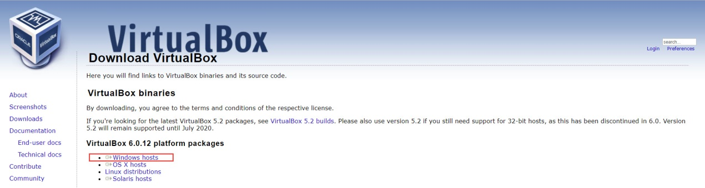

下面介绍一下，安装虚拟机软件VirtualBox的全过程：

(1) 运行VirtualBox-6.0.2-128162-Win.exe，可以看到的界面，点击“下一步”，见下图。

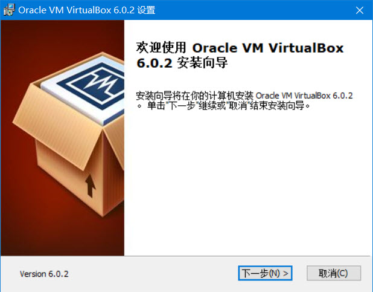

(2) 需要安装的功能，选择默认即可。软件的安装路径，用户可以根据实际情况自由选择，本书选择安装
在E盘，点击“下一步”，见下图。

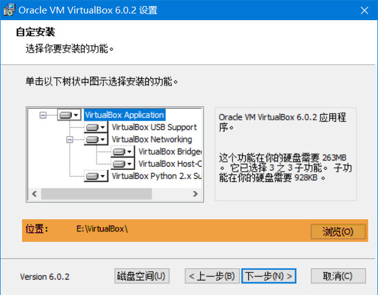

(3) 安装过程，选择软件自定义的功能，这里选择默认即可，点击“下一步”，见下图。

.. image:: media/instal005.jpg
   :align: center
   :alt: 未找到图片05|

(4) 在安装过程中，会提示一个警告，我们可以忽略该警告，点击“是”，继续安装，见下图。

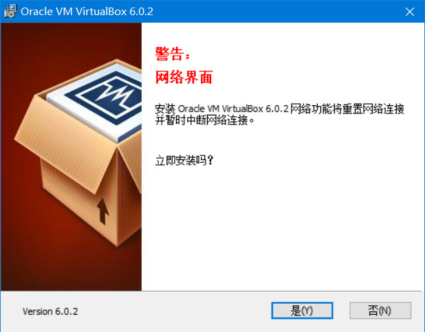

(5) 下图中，点击“安装”按钮，开始安装软件。

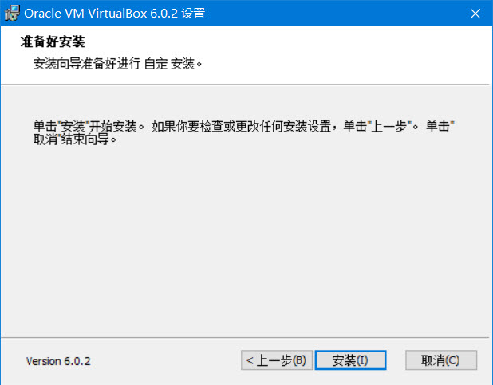

(6) 这样之后，便开始安装VirtualBox软件，静静地等待，软件安装完成。

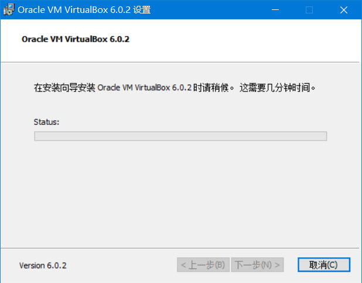

(7) 软件安装成功，点击“完成”，运行VirtualBox，见下图。

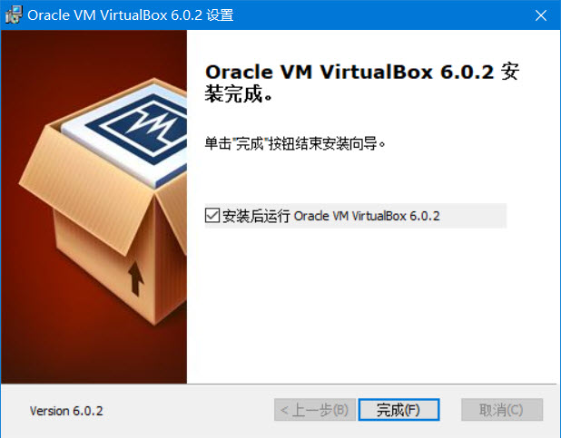

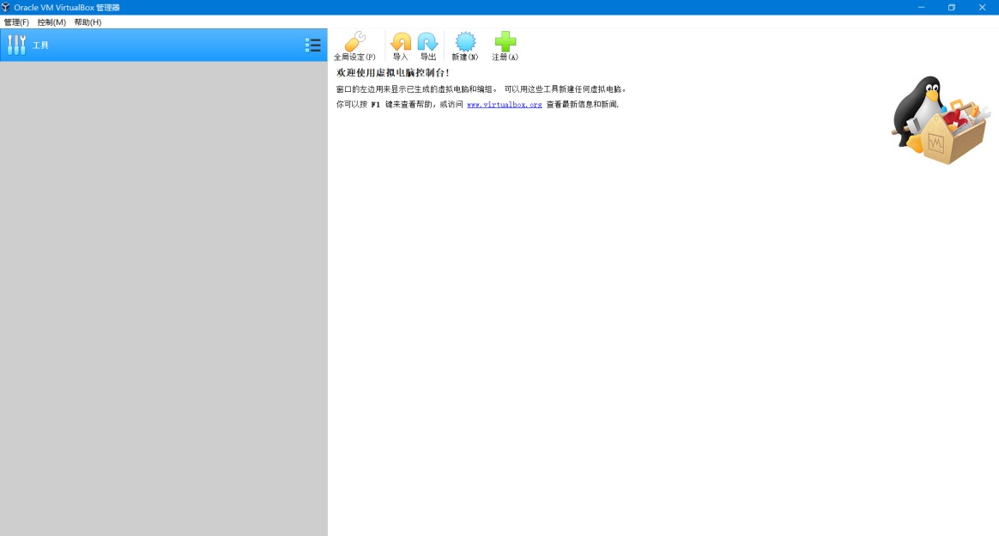

获取Ubuntu系统
~~~~~~~~~~~~~~~~~~~~~~~~~~

本书以Ubuntu 18.04桌面发行版本作为开发主机的主体系统环境，对于后期编
译内核等依赖不同版本系统环境的情况，我们会采用Docker技术创建其它运行环境。

在安装前需要先到Ubuntu的官网下载桌面版的系统镜像，可在如下
址下载得到：\ https://ubuntu.com/download/desktop\ ，具体见下图。

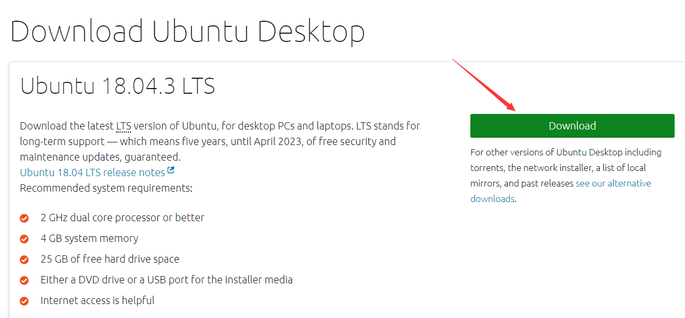

使用VirtualBox安装Ubuntu系统
~~~~~~~~~~~~~~~~~~~~~~~~~~~~~~~~~~~~~~~~~~~~~~~~~~~~~~~~~~~~~~

以下为使用VirtualBox安装Ubuntu18.04系统的操作步骤。在以下的步骤中，可按照自己使用的电脑参数进行配置

(1) 可从以下地址获取VirtualBox软件：\ https://www.virtualbox.org/wiki/Downloads\ ，下载后直接安装即可。

(2) 运行VirtualBox软件，点击“新建”按钮，来创建一个新的虚拟机，如下图所示。点击“下一步”。

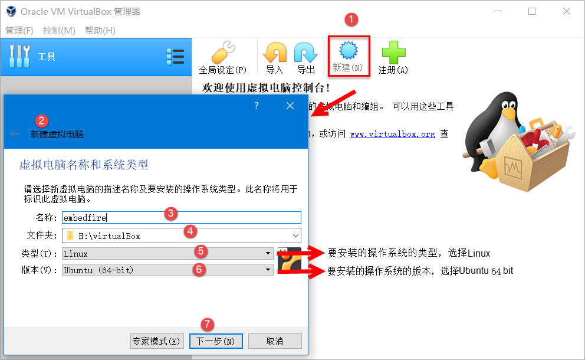

(3) 选择内存大小，默认为1024MB，可以根据自己电脑
    的配置选择，这里选择4096MB，即4GB的内存大小，点击“下一步”按钮。

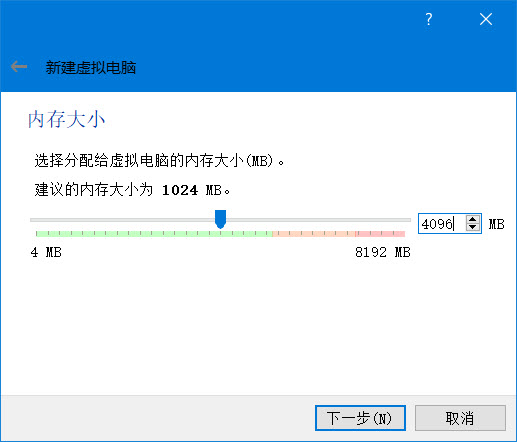

(4) 选择虚拟硬盘，如下图所示，选择“现在创建虚拟硬盘”，点击“创建”。出现如下所示的窗口，选择
    虚拟硬盘的类型，一般情况都选择VDI，单击“下一步”。虚拟硬盘的分配方
    式有两种：一种是动态分配，需要多少用多少，一开始占用小，随着空间需要而增长；另一种是固定大小，它
    会直接占用所分配的物理硬盘空间，但是访问速度快。这里我们选择“动态
    分配”，点击“下一步”之后，就需要我们选择虚拟硬盘大小，默认是10GB，用户可
    以根据自己电脑配置和需要进行分配，这里选择100GB（它不会立即占用这么多的空间，根据自
    己需求设置即可）。最后点击“创建”按钮，这样就创建好了。

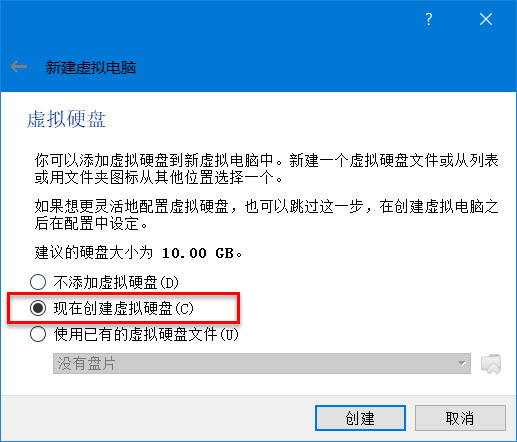

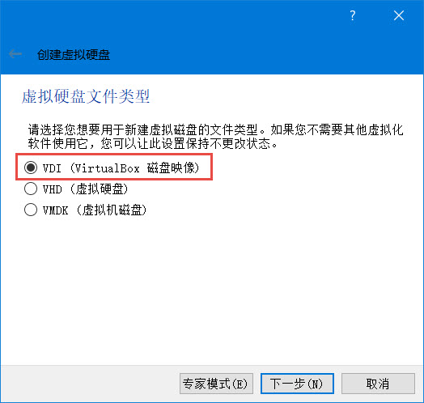

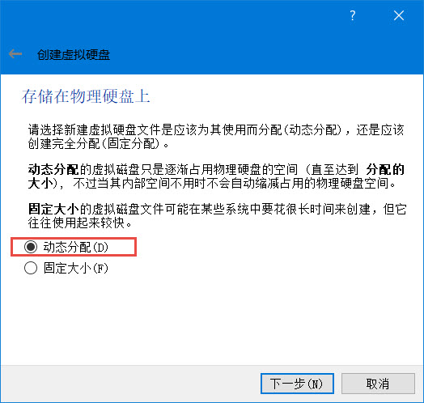

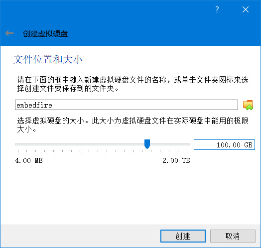

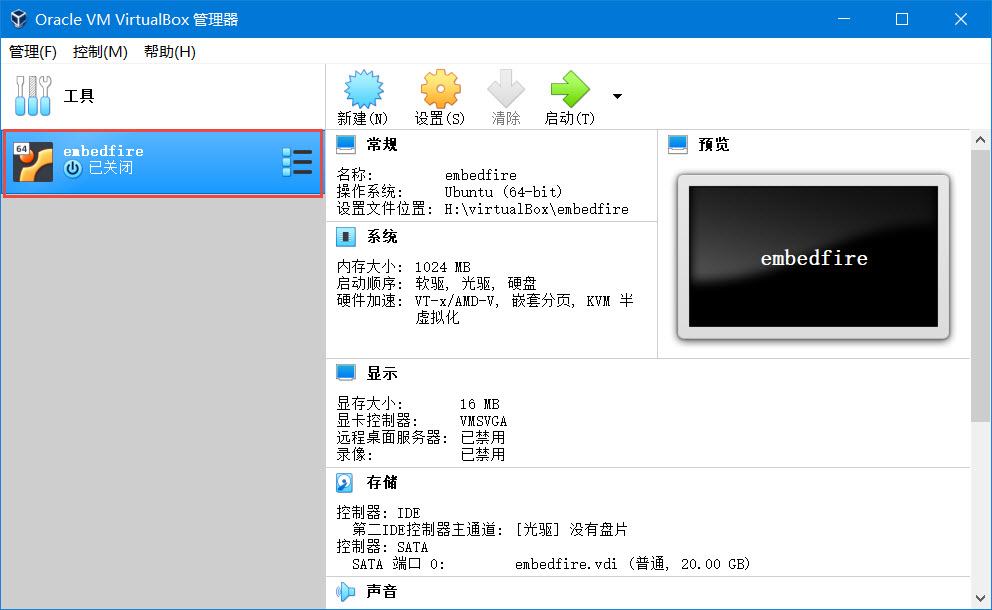

(5) 点击右侧的“设置”按钮，如下图所示，选择“存储”栏
    目，然后选择处来设置系统镜像文件，通过点击处的按钮来选择我们Ubuntu镜像
    文件（*.iso）的路径，设置成功之后，如下图所示，点击“OK”，进入下一步。

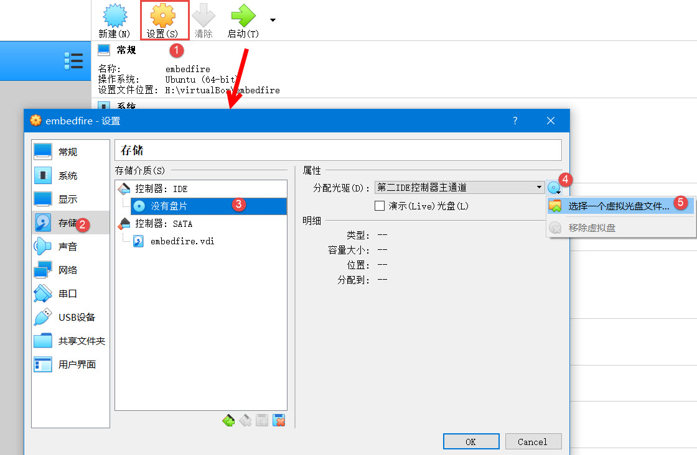

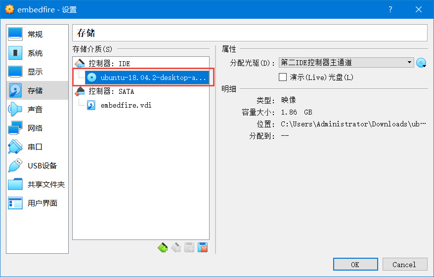

(6) 选择“网络”栏目，将网卡连接方式配置为桥接网卡，如下图所示。

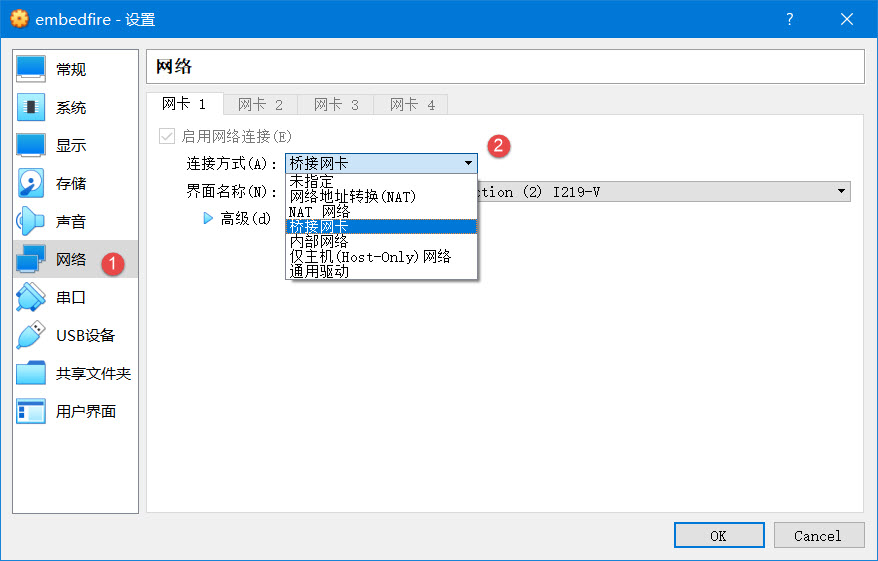

(7) 安装Ubuntu18.04系统，点击启动“启动”按钮，启动虚拟机，如下图所示。进入安装程序，如下图所示。

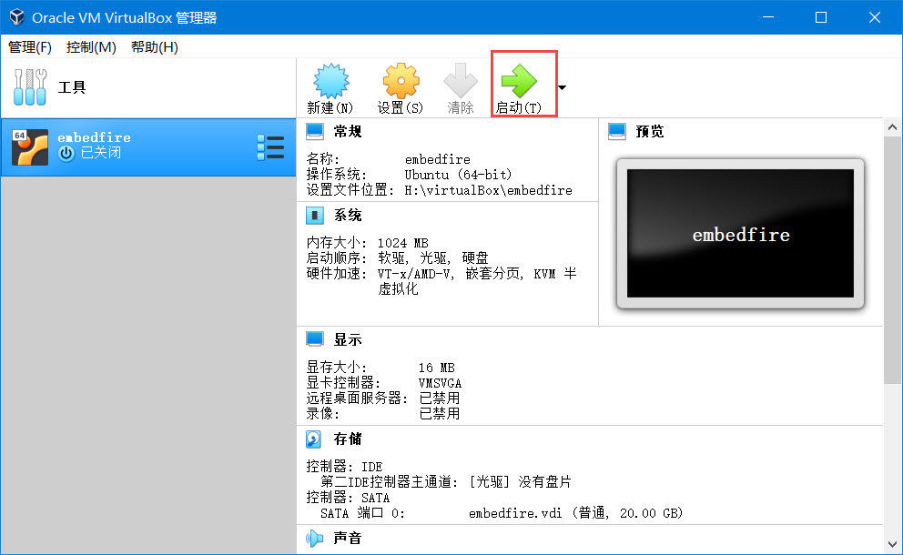

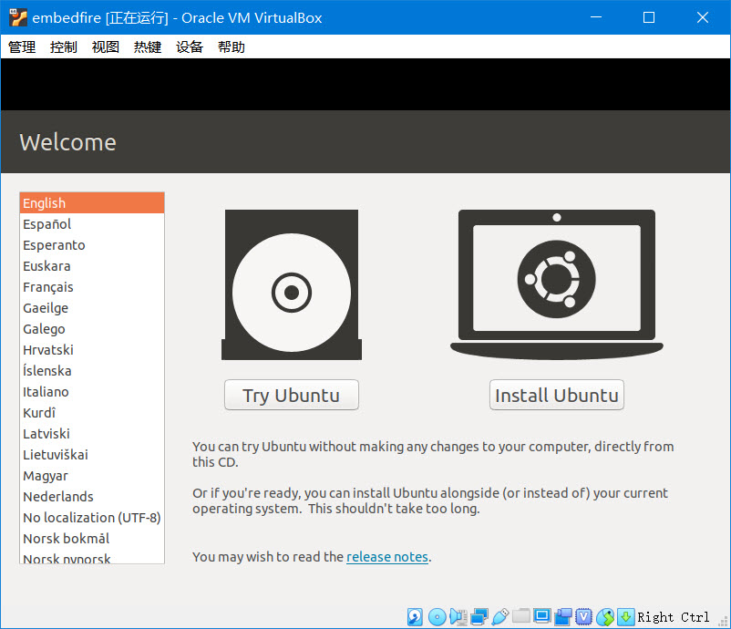

(8) 选择语言，处可以选择英文，中文等语言，这里我们选择 “简体中文”，然后点击处
    的“install Ubuntu”按钮，进入下一步。

.. image:: media/instal024.jpg
   :align: center
   :alt: 未找到图片24|

(9) 选择键盘布局，如下图所示，点击“继续”。

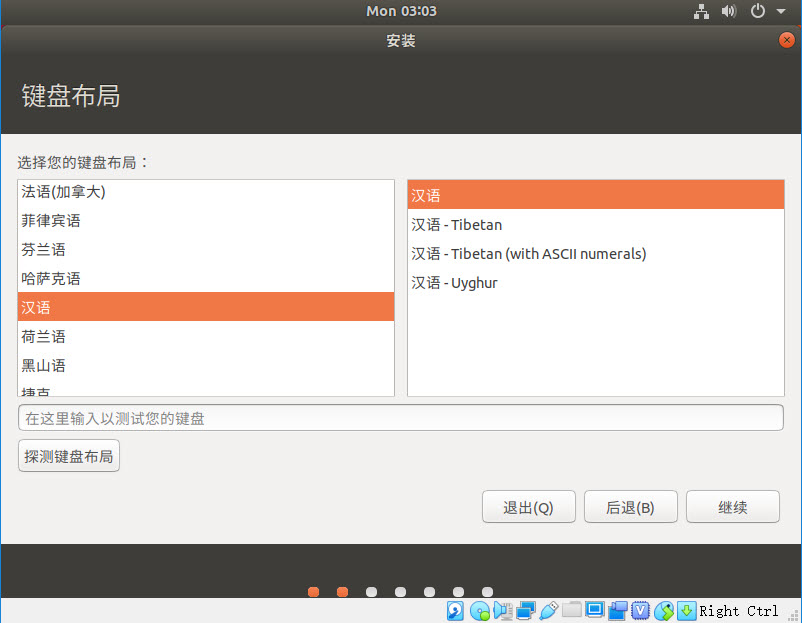

(10) 选择一些软件安装，如下图所示，点击“继续”，进入下一步。

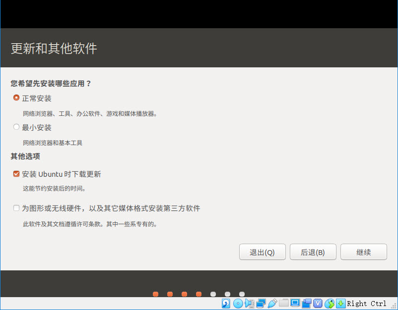

(11) 进入如下图所示的界面，由于虚拟机的虚拟硬盘是独占的，我们选择默认的“清除整个磁盘并安装Ubuntu”即可。

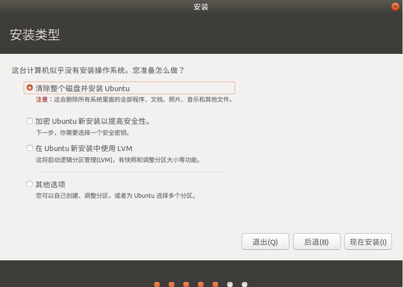

(12) 点击继续后会弹出提示确认磁盘的分区修改，点击继续即可。

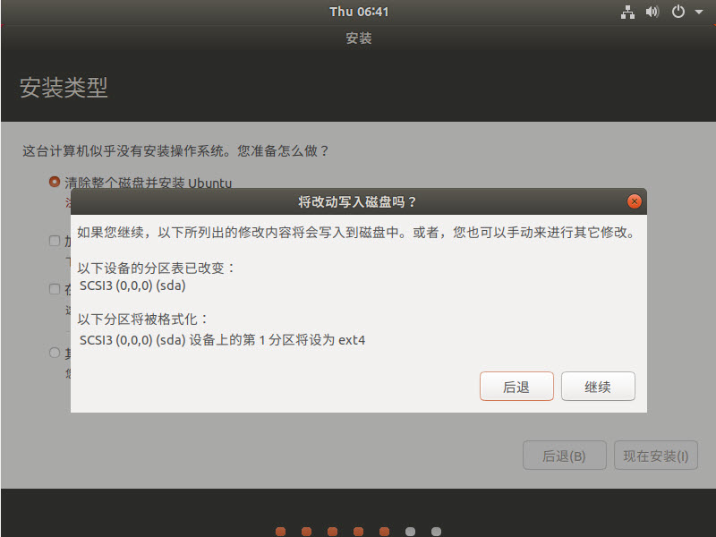

(13) 选择时区，在下图的提示界面区域点击我国东侧位置，其下的文本会出现“Shanghai”字
     样，选择后系统使用的就是北京时间。

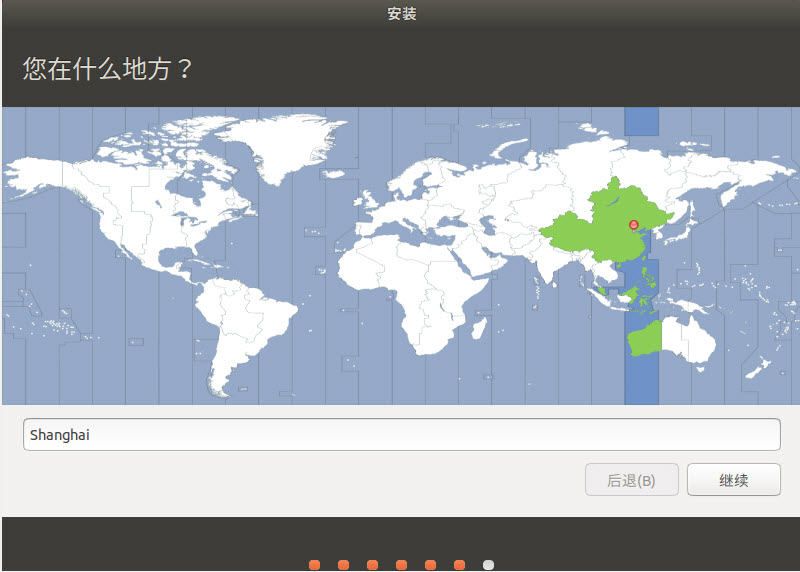

(14) 进入如下图所示的界面，在这个界面中输入用户名和密码，设置计算机名称，用户
     可以根据自己的喜好来设置。此处设置的用户会默认具有系统管理员的权限，使
     用Linux系统时，常常需要使用该密码进行认证，请牢记该密码。

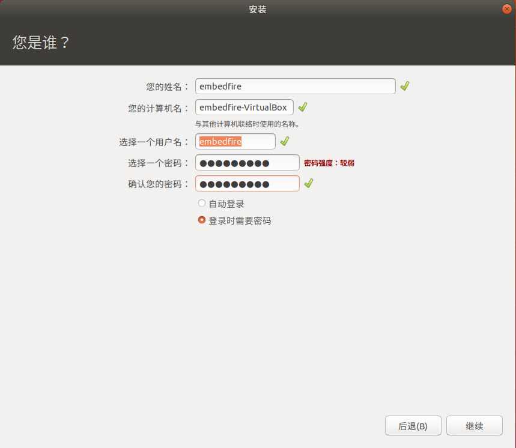

(15) 如下图所示，等待安装完成，然后重启虚拟机，输入密码，就可以看到Linux的桌面了，如下所示。

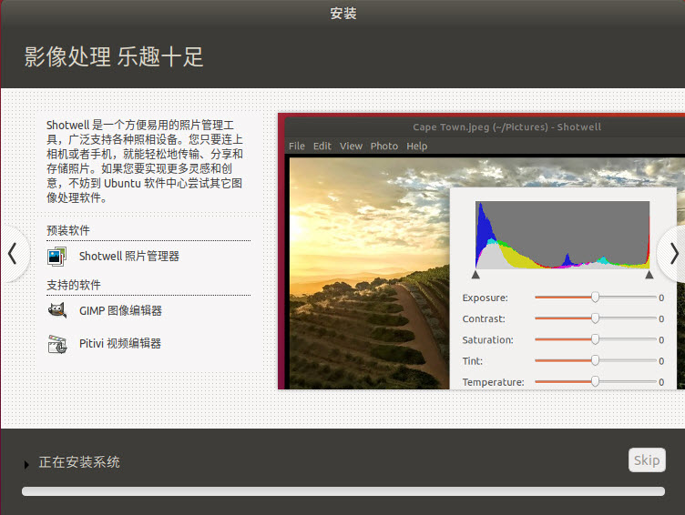

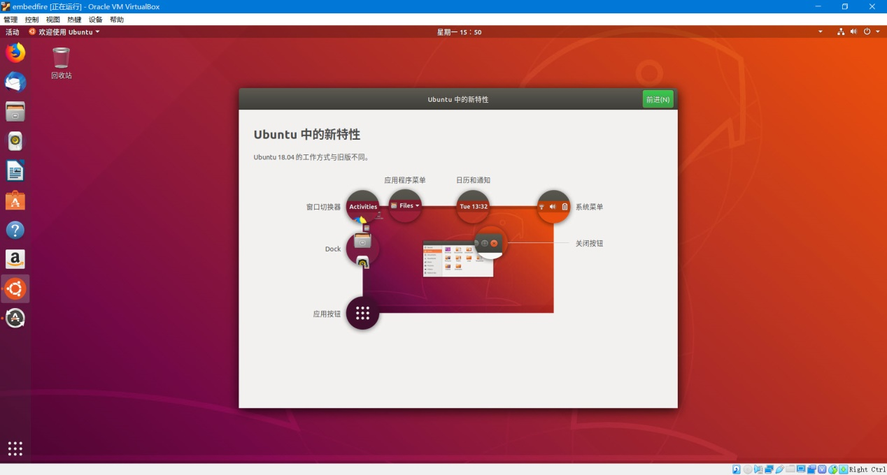

给虚拟机安装增强功能
~~~~~~~~~~~~~~~~~~~~~~~~~~

安装完成操作系统后，可给虚拟机安装增强功能，安装后支持双向复制、共享文件、屏幕自动调整分辨率，使用起来更加方便。

安装过程如下：

(1) 在虚拟机界面点击“设备/安装增强功能”即可，见下图。

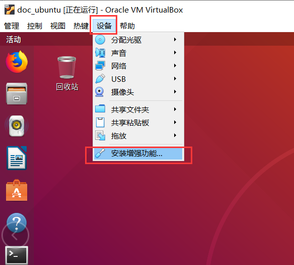

(2) 点击安装增强功能后，虚拟机中会插入一个光盘，并会自动启动安装程序，见下图，在弹出的
    界面点击运行。若没有自动启动，可手动双击该光盘进行安装。

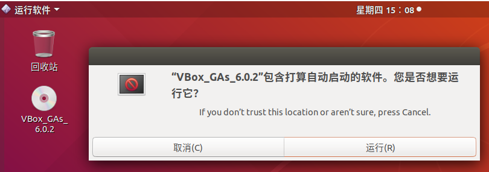

(3) 点击运行后会出现终端界面输出运行提示，最后提示“press return to close this window”时，按回车键退出即可。

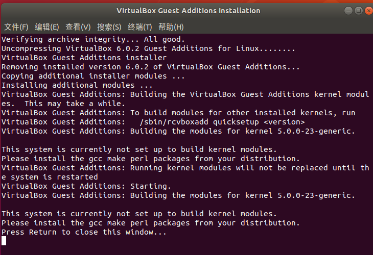

(4) 重启虚拟机，进入系统后尝试调整虚拟机控制界面的窗口大小，看到虚拟机内桌面根据窗口大小调整分辨率表明安装成功。

(5) 设置虚拟机控制选项中的“设备/共享粘贴板”和“设备/拖放”一栏可以设置虚拟机与主机之间的粘贴板和拖放功能。

设置共享文件夹
~~~~~~~~~~~~~~~

在未来的学习过程中，我们有时候需要把下载的资料文件放到虚拟机中，或者是需要把虚拟机的
资料挪到Windows主机中，常用的解决方法有很多，如winscp，FileZilla等软件。不过，上述
的软件虽然在使用的过程十分快捷方便，但是在安装过程中，都相当地麻烦，一会需要在虚拟机
上操作，一会又要到主机上操作
。我们的虚拟机实际上提供了一个强大的功能：共享文件夹。我们可以通过这个功能，实现主
机与虚拟机的文件传输，安装方式以及使用方法也都十分简单。下面，介绍一下如何开启虚
拟机VirtualBox的共享文件夹功能（执行以下步骤时，确保Linux虚拟机处于关机状态）。

(1) 新建文件夹，用于Windows主机和Linux虚拟机共享文件夹。用户可以根据实际情况，创建共享文件夹，见下图。

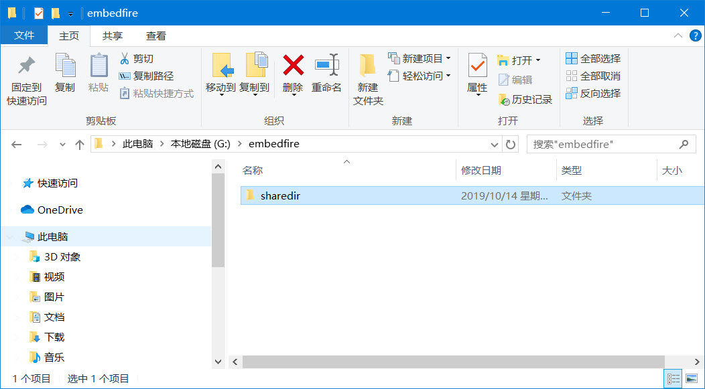

(2) 设置虚拟机的共享文件夹，点击下图的标记处，弹出设置窗口，选择“共享文件夹”选项卡（下图的处），最后点
    击的按钮，添加共享文件夹，进入下一步。

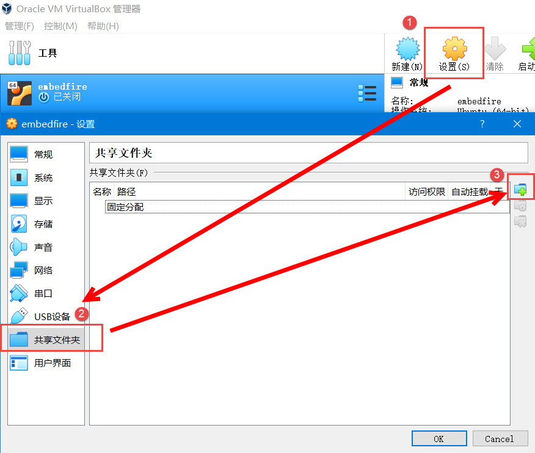

(3) 下图中，点击处按钮，新增共享文件夹，在弹出的“添加共享文
    件夹”窗口，我们可以看到处有一个下拉箭头，我们选中处，来选择
    我们刚刚新建的文件夹。到这里之后，我们就完成了文件夹路径的
    设置。我们仍然需要让虚拟机启动的时候，自动挂载共享文件夹，见下
    图。选中“自动挂载”选项，在处填入共享文件夹的挂载点，这里我
    们建议初学者使用我们提供的路径：**/home/用户名/ebf_dir**  

    用户名需要根据用户安装系统时，输入的用户名。本书使用的embedfire，因此，我们
    输入的路径为“/home/embedfire/ebf_dir”，最后点击“OK”按钮即可完成设置，见下图。

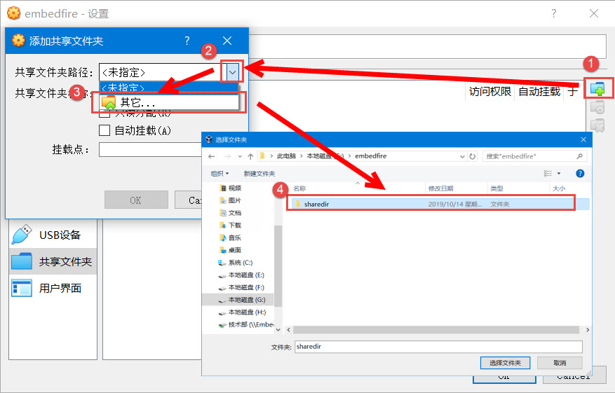

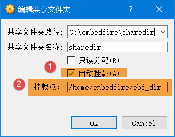

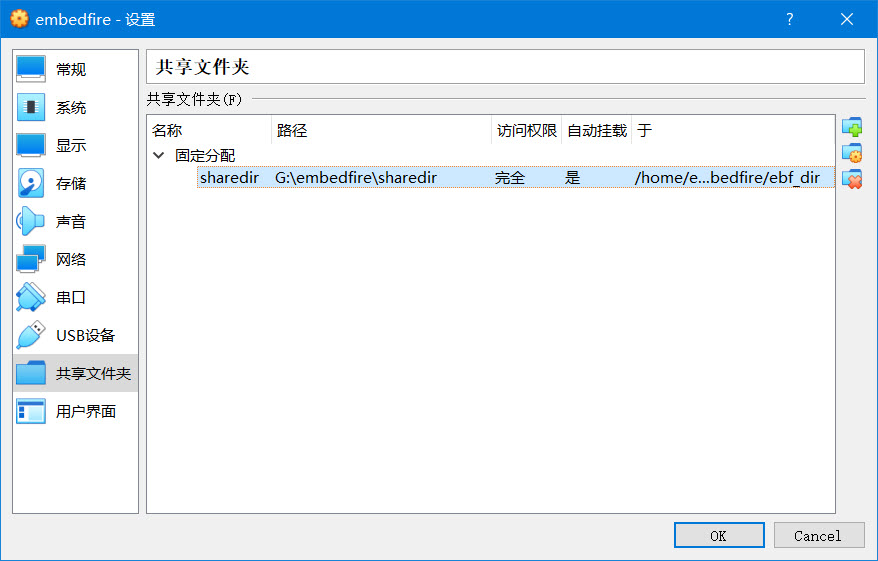

(4) 启动虚拟机，我们就可以看到我们的共享文件夹了，见下图。

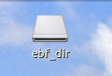

(5) 单击鼠标右键，左键点击“打开终端”，见下图。

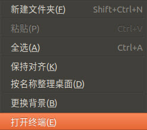

出现如下图所示的窗口，输入命令：

.. code-block:: sh
   :emphasize-lines: 1
   :linenos:

   sudo usermod -a -G vboxsf 用户名

本机的用户名是embedfire，因此，输入命令“sudo usermod –a –G vboxsf embedfire”，见下图。

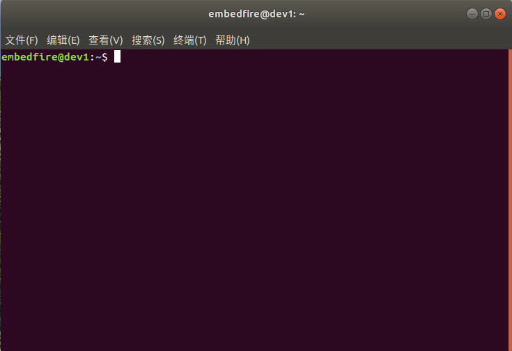

(6) 打开之后，这里为了更好地说明，因此在Windows下新建一个普通的txt文档，我们可
    以看到Linux也可以对该文档进行操作。

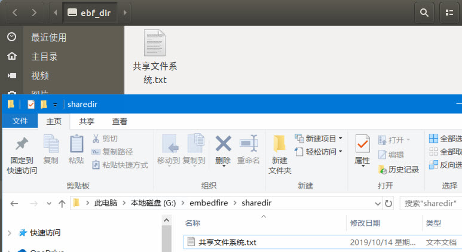

熟悉系统
~~~~~~~~~~~~

Ubuntu系统安装好后，请随意体验一下Ubuntu系统，看看能用它做些什么日常操作。

它自带有浏览器，音乐播放器以及一些与Office功能类似的办公软件，如果安装的是
中文版，中文输入法也会默认被配置好。建议使用打开浏览器看看自己的常用网站，打开
系统的文件夹新建文件随便记录一些内容，甚至安装一下Steam游戏平台，看看能玩什么游
戏。对于与Windows系统的差异，如不能使用MCU的开发
软件Keil等，不能用Adobe的PS等软件，在这些方面就不要去强求和折腾。现在
国产软件开始对Linux重新重视了起来，腾讯QQ也于2019-10-24回归Linux了。

应用列表
^^^^^^^^^^^^^^^^^^^^^^^^^^^^^^^^^^^^^^^^^^^^^^^^^

下面我们以Ubuntu下使用gedit编辑器编写文件为例，让大家去熟悉操作系统。在Ubuntu桌
面的左下角有个应用软件列表按钮，点开后可看到系统中包含的应用，如下图所示。

.. image:: media/instal046.png
   :align: center
   :alt: 未找到图片46|

上图中的“文本编辑器”即是Ubuntu系统自带的gedit编辑器，直接点击
后打开可以输入文字，它的使用就类似Windows系统自带的记事本软件一样。

使用拼音输入法
^^^^^^^^^^^^^^^^^^^^^^^^^^^^^^^^^^^^^^^^^^^^^^^^^^^^^^^^^^^^^^^^^^^^^^^^^^^^^^^^^^^^^^^^^^^^^^^^^

如果安装Ubuntu系统时选择了中文支持，那么系统安装后就自带拼音
输入法，其设置位置在桌面状态栏的“zh”图标中，点击后可
选择汉语拼音输入法，如下图所示。

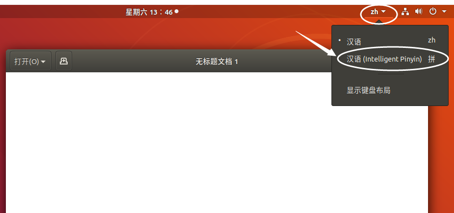

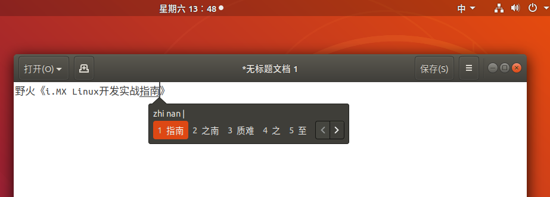

该输入法使用效果如上图所示，使用输入法时可以通过“Shift”键快速切换中英文输入。

在后面我们使用命令行的时候，建议直接把输入法关闭掉，即重新点击输入法设置的图标，把它选择回“zh”即可。

文件浏览器
^^^^^^^^^^^^^^^^^^^^^^^^^^^^^^^^^^^^^^^^^^^^^^^^^^

输入完内容后点击编辑器右侧的保存按钮，它会弹出选择文件保存位置的弹框，如下图所示。

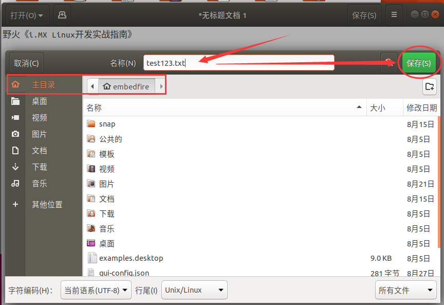

可以看到它默认的保存位置是“主目录embedfire”，这个是用户自己的目
录，如果你选择其它位置，有可能会因为没有权限而无法保存。选定好存储位
置并输入文件名称后，通过保存按钮可保存文件。

保存关闭文件后，点击桌面任务栏的文件浏览器图标，可以打开到刚刚
文件存放的目录，查找到该文件，如下图所示。

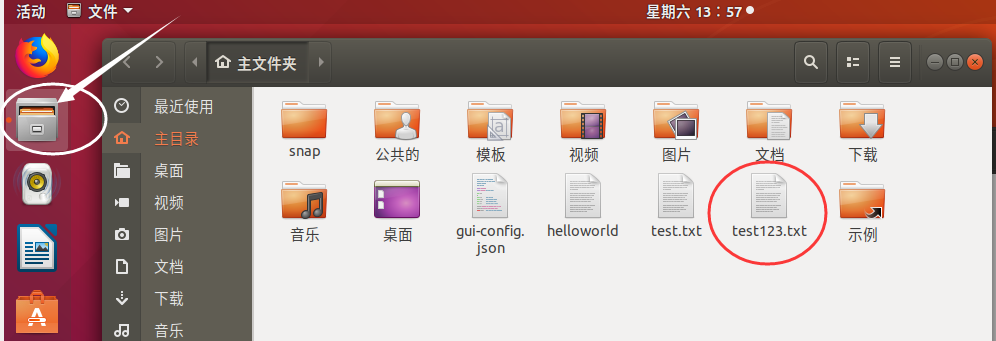

安装软件及权限
~~~~~~~~~~~~~~~~~~~~~~~~~~~~~~

不同的Linux发行版安装应用软件的方式不尽相同，Ubuntu系统自
带了软件中心，使用它可以非常方便地安装和卸载各种软件。

在桌面的任务栏有“Ubuntu软件”图标，如下图所示，点击后可以打开软件中心。

我们尝试安装“2048”小游戏。打开软件之后，点击搜索
的按钮（下图中的框框处），输入“2048”，如下图所示，点击安装框框处的“2048”游戏。

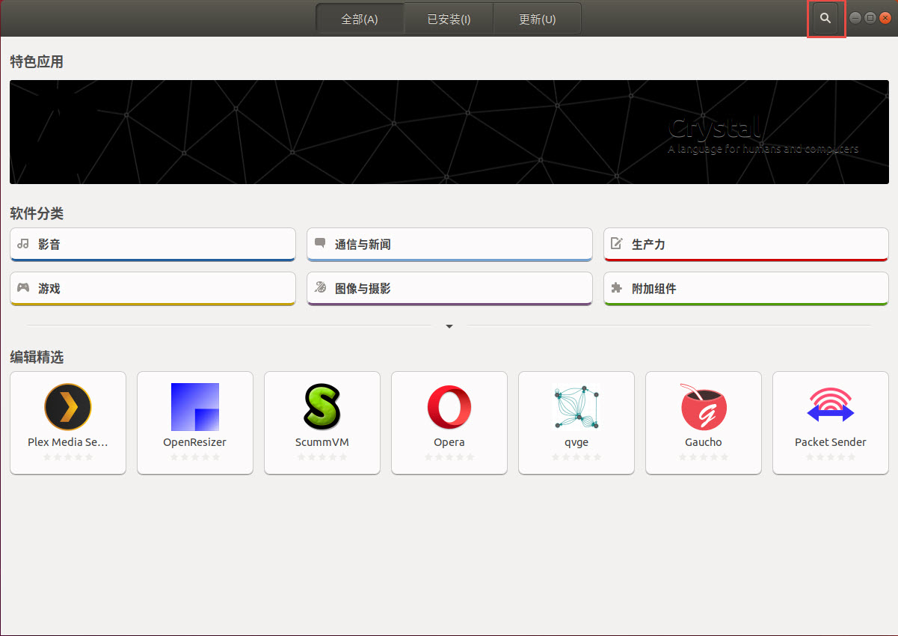

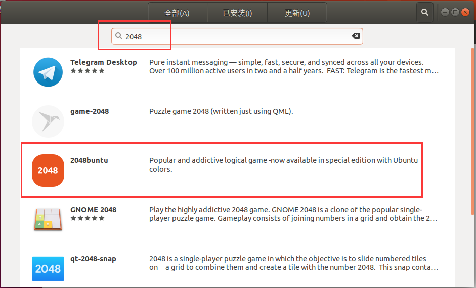

安装软件时，可能会弹出如下图所示的提示，由于需要系统管理员的权限，所以要
输入密码进行认证，该密码为安装系统时设置的用户密码。

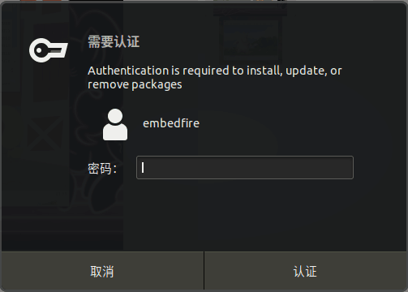

在Linux系统下，所有的操作都有明确的权限要求。如安装软
件需要系统管理员权限；普通用户在自己所属的目录下才能创建文件等。

目前Ubuntu软件中心采用Snap软件市场来安装软件，暂时还
没有国内的镜像下载源，所以下载可能需要花比较长的时间。如果不想体验可以直接点击取消安装。

.. |instal005| image:: media/instal005.jpg
   :width: 5.15in
   :height: 4.025in

.. |instal024| image:: media/instal024.jpg
   :width: 5.76806in
   :height: 4.10972in

.. |instal046| image:: media/instal046.png
   :width: 3.84057in
   :height: 3.85897in

