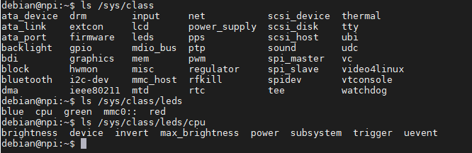
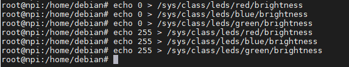
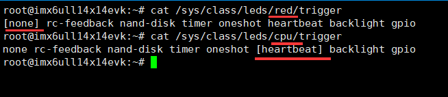
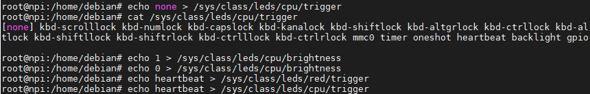
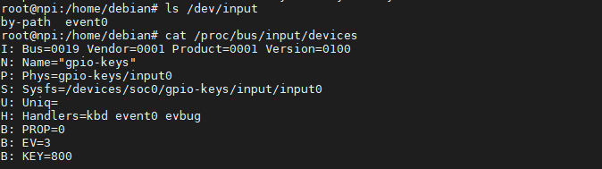
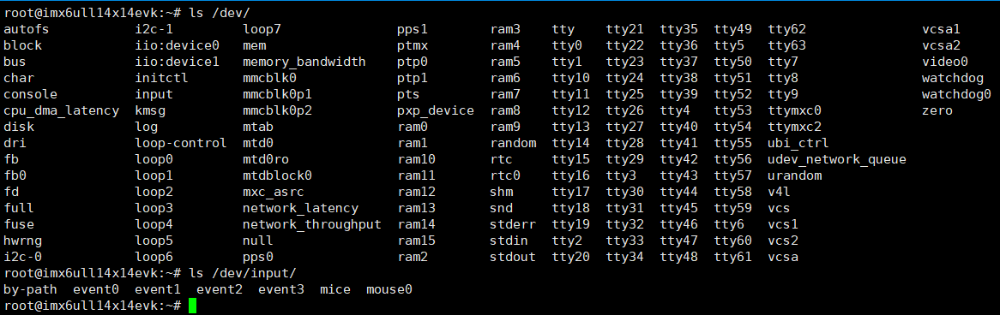
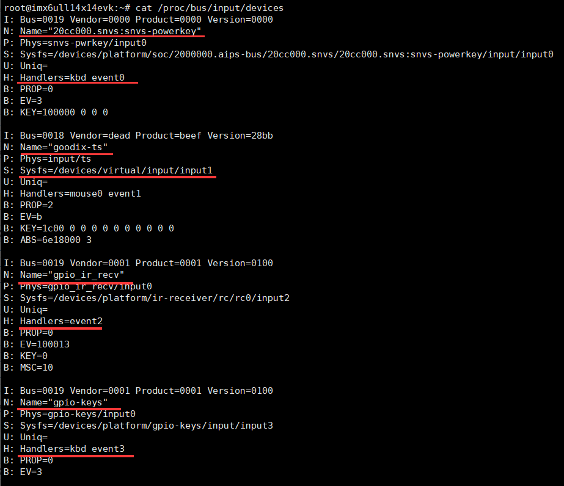
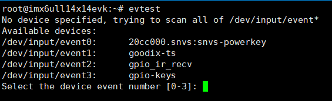
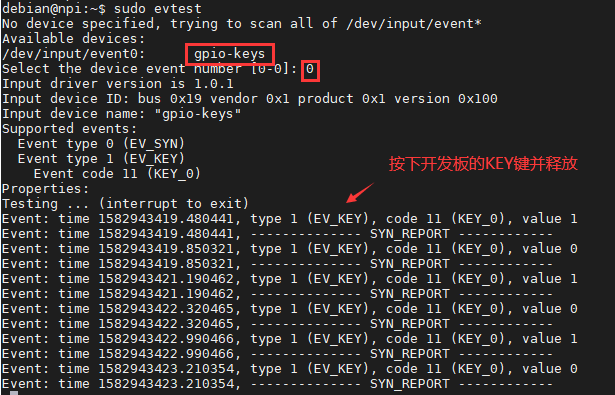
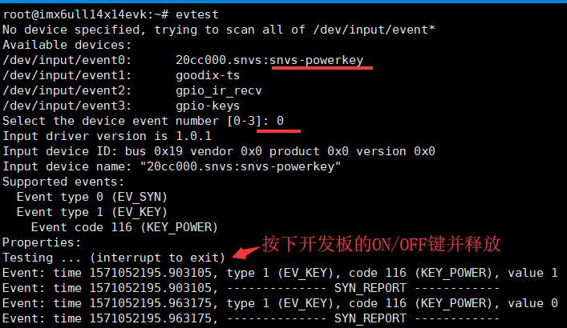

.. vim: syntax=rst

命令行点灯和检测按键
-----------
**注意:目前发布的Debian镜像只使能了LED灯，没有使能呼吸灯，本章节中的呼吸灯相关操作需要在下一个版本的Debian镜像中操作**

前面讲了那么多的内容，终于迎来了重头戏——使用开发板的各种硬
件外设，如入门必备的点灯，按键，蜂鸣器，串口等等。本章先带领大家使用命令行来控制LED灯和检测按键。

初探/sys目录
~~~~~~~~

与/proc目录类似，/sys目录下的文件/文件夹向用户提供了一些关
于设备、内核模块、文件系统以及其他内核组件的信息，如子目录block中存
放了所有的块设备；子目录bus中存放了系统中所有的总线类型，有i2c、usb、sdio、pci等；子
目录class按类型归类设备，如leds、lcd、mtd、p
wm等。

尝试在开发板的终端执行以下命令查看sys各层级的目录内容：

.. code-block:: sh
   :linenos:

   #在开发板上的终端执行以下命令查看
   ls /sys
   ls /sys/class
   ls /sys/class/leds
   ls /sys/class/leds/cpu

可以看到，本开发板的/sys/class/leds目录下分别
有：blue、cpu、green、red等目录（出厂的），它们代表着开
发板上不同的LED灯，是由Linux内核驱动提供给用户的控制接口。

以其中的/sys/class/leds/cpu目录为例，它下面又
包含brightness、device、max_brightness、power、subsystem、trigger、uevent等文
件。其中brightness表示LED灯的亮度，trigger表示LED灯的触发方式，我们可以通过echo、
cat等命令来修改或查看这些文件，从而达到控制LED灯的目的。下面以实例进行讲解。

控制LED灯
~~~~~~

在野火的i.MX 6ULL Pro及Mini开发板上，有如下几个LED灯
可以通过主控芯片的引脚进行控制，硬件的具体位
置见《野火EBF 6ULL 开发板硬件资源介绍》章节的资源图：

-  心跳灯：默认用来指示系统运行状态，系统正在运行时
   就会持续闪烁。开发板文件系统上的/sys/class/leds/cpu目录表示的就是该心跳灯。

-  三盏普通LED灯：在Pro开发板上，它们共同组成一盏RGB彩
   灯，可以进行色彩混合。在Mini开发板上是三盏独立的小灯。开发板文件系
   统上的/sys/class/leds/red、/sys/class/leds/blue、/sys/class/leds/green目录表示的就是这三盏灯。

brightness文件
^^^^^^^^^^^^

各LED灯设备下的brightness文件表示了它的亮
度值。本开发板提供的内核驱动中，心跳灯是直接IO控制的，它的亮度
范围为1和0表示亮灭；而其它三盏普通LED灯是使用pwm控制的，支持的亮度范围为0~255。

我们先尝试控制三盏普通LED灯，在开发板的终端上执行如下
命令，执行前请确认当前为root用户：

.. code-block:: sh
   :linenos:

   #LED灯默认可能处于亮的状态，我们先把它们全部关闭再一盏盏点亮
   echo 0 > /sys/class/leds/red/brightness #关闭red灯
   echo 0 > /sys/class/leds/blue/brightness #关闭blue灯
   echo 0 > /sys/class/leds/green/brightness #关闭green灯
   echo 255 > /sys/class/leds/red/brightness #点亮red灯
   echo 255 > /sys/class/leds/blue/brightness #点亮blue灯
   echo 255 > /sys/class/leds/green/brightness #点亮green灯

在Pro开发板中，由于三盏灯会进行硬件RGB混色，所以随着每条指
令的执行，彩灯的颜色不一定呈红蓝绿的变化，而是三盏灯状态的
共同结果，可以自行尝试使用不同的亮度值对RGB灯进行混色。

在Mini开发板上三盏LED是硬件独立的，可以更明显地看出执行不同指令时硬件的运行情况。

trigger文件
^^^^^^^^^

如果我们直接使用上面的方式去控制/sys/class/leds/cpu心跳灯
的brightness文件，发现并没有生效，心跳灯依然是按自己的节奏在
闪烁，这是因为我们的驱动中心跳灯与上述普通LED灯使用了不同的默
认触发条件。LED灯的触发条件可以通过其目录下的trigger文件控制。

我们先来查看各LED设备trigger文件的原内容：

.. code-block:: sh
   :linenos:

   cat /sys/class/leds/red/trigger #查看red灯的trigger文件内容
   cat /sys/class/leds/cpu/trigger #查看cpu灯的trigger文件内容

仔细对比上图中red及cpu灯的trigger文件内容，发现两个文
件中有类似的内容，这些内容表示触发条件，其中"[]"括号括起来的表示当前使
用的触发方式。可看到red灯中的触发条件为"none"，表示无触发条件，所以直接
修改brightness文件来控制；而cpu灯的触发条件为"heartb
eat"，表示系统心跳指示触发，这时用户不能再直接修改brightness文件来
控制。

了解触发条件后，我们可以先把cpu灯的触发条件改为none，再
修改brightness文件即可以手动控制cpu灯，尝试执行如下命令：

.. code-block:: sh
   :linenos:

   echo none > /sys/class/leds/cpu/trigger #修改cpu灯触发条件为none
   cat /sys/class/leds/cpu/trigger #查看cpu灯的trigger文件内容
   echo 1 > /sys/class/leds/cpu/brightness # 点亮cpu灯
   echo 0 > /sys/class/leds/cpu/brightness #关闭cpu灯

类似地，我们可以把red灯的触发条件改为heartbeat，此时red灯就会以心跳指示的方式进行闪烁：

.. code-block:: sh
   :linenos:

   echo heartbeat > /sys/class/leds/red/trigger

在示例中我们一直是用echo命令修改文件内容来达到控制的目的，但我
们要清楚地知道，并不是echo命令能控制硬件，而是文件的内容影响了硬
件的工作状态。可以尝试使用Vi编辑器来修改各个LED灯的brightness文件
的内容，完全可以达到同样的控制目的。不过使用Vi时可能会提示权限问题，忽略即可。

初探/dev目录
~~~~~~~~

除了/proc和/sys目录外，/dev目录也包含了非常丰富的设备信息，该目
录下包含了Linux系统中使用的所有外部设备，如/dev/tty为串口
设备、/dev/ram为内存、通过这些设备文件，我们也可以访问到对应的硬件设备。

尝试使用以下命令查看dev目录的内容：

.. code-block:: c
   :caption: 看dev目录的内容
   :linenos:

   ls /dev
   
   ls /dev/input

以上图中/dev/input目录下的内容为例，上面的event0是输入设备的事件文件接口，
通过它们可以获知设备上报的输入事件。event后带的数字并不是跟设备绑定的，
可以查看文件/proc/bus/input/devices了解它们分别代表什么。

在开发板的终端执行以下命令：

.. code-block:: sh
   :linenos:

   cat /proc/bus/input/devices

如上图所示，可看到当前开发板的只包含了一个输入设备，在具体的开发板上可能会有差异：

-  event0：名称为gpio_keys，它对应的是KEY按键。

检测按键
~~~~

在开发板中，我们可以使用evtest工具更方便地查看硬件当前接入的输入设备，
并且对其进行实时检测。

apt安装evtest工具

.. code-block:: sh
   :linenos:

   sudo apt install evtest

**注意**:第一次使用apt install命令前，需要先执行以下执行刷新镜像源

.. code-block:: sh
   :linenos:

   sudo apt update

使用evtest工具：

.. code-block:: sh
   :linenos:

   sudo evtest

执行命令后，它会扫描/dev/input目录下的event设备输入事件文件，并列
出到终端，它提示我们可以通过数字选择对应的设备进行测试，具体请根据自己
开发板上的输出进行选择。此处我们以gpio-keys为例，测试结果如下图所示。测试
时可执行"Ctrl"+"c"退出。

设备、文件与驱动
~~~~~~~~

通过前面使用LED灯和按键的控制过程，可体会到Linux系统中设备与文件的联系。控制时我们根本不需要知道LED灯和按键的具体硬件连接，只要知道哪个文件代表哪个设备，然后就可以通过文件以同样的方式操控同类设备了。这就是驱动的作用，它把硬件设备与Linux文件建立了映射关系。

在MCU的裸机程序中，要控制LED灯和按键，需要先了解它们与MCU硬件是如何连接的，即要知道连接的具体的IO引脚，然后修改寄存器配置IO的输入输出，工作模式等，最后编写相关的控制函数API提供给上层调用。编写应用时用户通过函数API去控制硬件。

在Linux系统下，驱动工程师的工作其实类似，他们也需要了解LED或按键是如何与CPU连接的，也得配置好IO的工作模式，区别在于还需要按照Linux系统的接口要求编写相关控制函数提供给Linux的虚拟文件系统，使得硬件与文件建立起联系，提供给Linux用户。编写应用时用户通过设备文件即可控制硬件。

所以说，驱动工程师所做的工作就是把硬件的控制方式抽象、封装成为函数API或者文件，只不过Linux驱动工程师在封装时需要按照Linux的规范去编写，而且在编写时需要了解Linux内核的一些机制，所以相对裸机驱动来说，提出了更高的要求。

