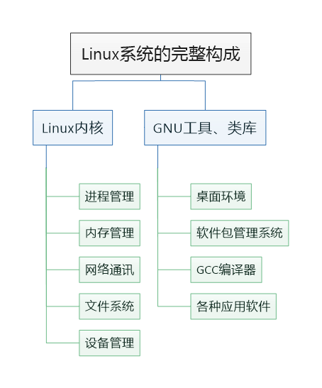
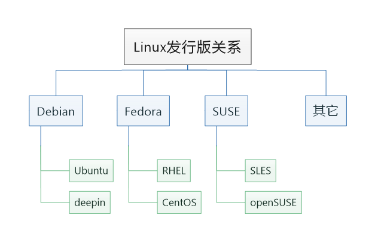

.. vim: syntax=rst

Linux系统简介
------------------

本章主要讲解Linux系统的基础使用，包括系统的一些基本概念、安装以及日常应用。

Linux系统简介
~~~~~~~~~~~~~~~~~~

Linux系统由Linus Torvalds （林纳斯·托瓦兹）于1991年发布在新闻组的内核发展而来，由于它在发布之初就免费和自由传播，支持多用户、多任务及多线程，且兼容POSIX标准，使得它支持运行当时主流系统Unix的一些工具软件，吸引了众多的使用者和开发者，逐渐发展壮大至今。

关于Linux系统的发展历史，建议阅读其作者Linus本人的自传《Just For Fun》一书。

 Linux内核与发行版
 ~~~~~~~~~~~~~~~~~~~~

当我们说Linux系统时，其含义往往是指采用Linux内核的操作系统。Linux内核负责控制硬件、管理文件系统、进程管理、网络通讯等，但它本身并没有给用户提供必要的工具和应用软件。

由于Linux内核本身是开源的，所以一些人和厂商在其规则之下，基于Linux内核搭配各种各样系统管理软件或
应用工具软件，从而组成一套完整可用的操作系统，见下图。我们称这样的系
统为Linux发行版（distribution）。完整的Linux系统就如同
汽车，Linux内核构成了最为关键的引擎，不同的发行版就类似使用相同引擎的不同车型。

图 3‑1 Linux系统的完整构成

人们制作发行版通常用于特定的用途，构建哲学不一，侧重点有所不同，因
而Linux发行版可谓百花齐放。其中以Debian、Suse及Fedora派系的发行版最
为常见。对于基础用户来说，常常会困惑于安装某些软件时，软件的安装帮助会针
对不同派系的Linux给出不同的安装指令，这实际是由于不同Linux派系之
间使用不同的包管理软件（可理解为使用不同的软件商店），这无伤大雅。常见的Linux发行版关系见下图。

图 3‑2 常见的Linux发行版关系图

对于初次接触Linux的用户，建议只要了解到这些都是Linux系统，而且目前我们
的开发主机要用的是Ubuntu即可。至于在开发板上运行的Linux系统，也可以理
解为这是我们针对特定板子而定制的Linux发行版。

Debian派系
^^^^^^^^^^^^^^^^

Debian派系下主要包含Debian、Ubuntu等发行版。

Debian的特色在于其海量的软件支持和apt-get软件包管理系统，而且其支持的硬件
平台非常全面，包括x86、AMD、MIPS、ARM、POWERPC等。

Ubuntu衍生自Debian，由于其易用性，可以说是最成功的Linux桌
面版，且它的成功已经开始漫延至其服务器版本，目前还推出了Ubuntu Core版本
针对物联网等小型设备领域，非常有发展前景。本书将采用Ubuntu作为开发主机的系统环境。

Debian和Ubuntu官网有非常丰富的使用教程，而且中文支持也很好，推
荐初学者多多浏览其中的内容，尤其是Debian。

Debian官网：https://www.debian.org

Ubuntu官网：https://ubuntu.com

Fedora派系
^^^^^^^^^^^^^^^^

Fedora派系下包含Fedora、Red Hat Linux、Red Hat Enterprise（RHEL）、CentOS等发行版。

Red Hat Linux是由Red Hat（红帽）发行的个人版本Linux，现已停止开发，他们转而
开发主要应用于服务器领域的Red Hat Enterprise
Linux（RHEL），即红帽企业版Linux。使用RHEL的好处是获得安全稳定的技术支持以
及企业级的保证，这正是众多服务器应用场景的核心需求，红帽公司也正是依靠提供这
些服务成为了最赚钱的Linux公司。现红帽公司已被IBM收购。

Fedora发行版是由社区基于RHEL构建的，由Red Hat公司赞助，它大胆采用和验证最
新的技术，部分经验证的技术会被加入至RHEL。因而Fedora与RHEL是被互惠互利关系。从另
一个角度看，Fedora也被认为是RHEL的小白鼠版本。

CentOS全名为Community Enterprise Operation
System，即社区企业操作系统，它由红帽遵循开源协议公开的RHEL源代码构建而
成，它们的区别在于CentOS提供免费的长期升级和更新服务，使用CentOS相当于
使用RHEL而不寻求红帽的技术支持，CentOS在我国的小型服务器领域应用非常广泛。

Open SUSE派系
^^^^^^^^^^^^^^^^^^^

SUSE派系下包含SUSE、SUSE Linux Enterprise Server（SLES）、openSUSE等发行版，
它们的关系类似于Fedora， Red Hat Enterprise Linux（RHEL） 和CentOS的关系。相对Red
Hat专长x86架构的计算机来说，SUSE在诞生之初就瞄准大型机，所以SUSE在大型服务器领域占有一席之地。

麒麟
^^^^^^^^^^^^^^^^^^

由于军政系统对信息安全要求严格，我国基于Linux内核构建了中标
麒麟、优麒麟、银河麒麟等发行版，其特色主要在于自主、风险可控。

