.. vim: syntax=rst

Linux文件目录
---------------------------

对于刚刚从Windows使用者切换到Ubuntu的用户，觉得最不习惯的地方可能就是文件目录的差异了，但实际上这只是使用习惯导致的，它们有着非常多的共同点，可以对比学习。

家目录
~~~~~~~~~~~~

当尝试使用gedit等编辑器保存文件时，系统默认通常会先打开个人用户的“家”目录，建议在通常情况下个人相关的内容也是保存在该目录中，因为其它目录大都是系统相关的，使用时容易导致混乱，而且需要相关权限。

点击Ubuntu系统侧栏的文件图标，如图 5‑1，可以打开系统的文件资源管理器。

|linuxd002|

图 5‑1 文件图标

打开后可以看到当前用户的主文件夹目录，也称为个人的“家”目录，“home”目录，它与Win10系统的个人目录非常相似，具体见图 5‑2和图 5‑3。

|linuxd003|

图 5‑2 Ubuntu个人目录

|linuxd004|

图 5‑3 Win10个人目录

Ubuntu和Win10希望用户使用时个人的内容都存放在个人目录，主要是为了与系统核心文件区分开来，因为通常不希望普通用户修改系统相关的内容，而且人个目录分开也便于系统升级。

不过按照大多数人使用Windows的习惯，通常会另外新建磁盘来专门存储不同的内容，如D、E、F、G编号分别为软件盘、工作资料盘、游戏盘、视频盘等。而当我们希望在Ubuntu下尝试复制这种习惯时，发现它并没有列出众多的磁盘，它所有的内容都位于根目录下。

根目录
~~~~~~~~~~~~

根目录是Linux下所有文件和目录的起点，它的路径用斜杠符号“/”来表示。如图 5‑4，通过点击文件浏览器的“/其他位置/计算机”可以查看到整个Ubuntu系统的根目录内容。

|linuxd005|

图 5‑4 点击查看计算机的其它文件

打开目录后，可以查看到Ubuntu系统根目录的内容，如图 5‑5。

|linuxd006|

图 5‑5 Ubuntu根目录的内容

也就是说，图 5‑5中这些文件或文件夹都位于“/”目录下，而它们的路径分别为“/bin”、“/boot”、“/cdrom”、“/initrd.img”等。

特别地，前面说明的家目录（个人目录）路径为“/home/用户名/”，见图 5‑6，图中的例子目录是/home/embedfire。也就是说，在Ubuntu系统下，用户的个人目录都在“/home”下，并且按照用户名命名，如果系统下有多个用户A、B、C并且它们都有个人目录的话，那么它们的个人目录路径默认
就是/home/A，/home/B，/home/C。在这方面，跟Windows系统是类似的，在Windows系统下，个人目录默认是“C:/Users”或“C:/用户”。

|linuxd007|

图 5‑6 家目录的完整路径

对于Linux开发者来说，必须要了解根目录的内容，这也是大部分人觉得Linux的不友好之处。如果我们把/home的个人目录排除掉，实质上Linux的根目录与Windows系统C:/Windows目录的功能类似，都是系统核心的文件，只是对于Windows用户通常不需要了解系统文件目录罢了。如果把Lin
ux系统用于普通的桌面应用，实际上也不需要多么了解它的根目录内容。

但是当我们利用Linux系统进行开发或用于服务器时，一般需要给系统安装各种软件工具，又或者需要对系统和工具进行配置，常常不可避免地要修改根目录下的文件内容。如软件工具默认安装在/usr/bin目录，软件工具的配置文件可能位于/etc目录，甚至系统的日常使用如插入U盘或光盘，又发现它们不会像Windo
ws有独立的盘符可以访问，而是默认挂载在/media目录下。

根目录结构
~~~~~~~~~~~~~~

整个Linux系统有且只有一棵从根目录开始的目录树，如图 5‑7。

|linuxd008|

图 5‑7 根目录结构图

所以如果一个计算机中如果有多个硬盘，也不会呈现出Windows下的C、D、E盘的结构，强行复制Windows下习惯的话，可以在根目录下创建C、D、E目录，然后把磁盘C、D、E挂载在/C、/D或/E目录下，即它们仍然从属于“/”根目录，不过在Linux下通常不会这么用。

目录树只是一个管理上的概念，它本身并不跟硬件挂钩的，例如这些文件之所以是存储在磁盘中，是因为在安装系统时，已经把整个根目录“挂载”在了磁盘上。所谓挂载就是把存储器的分区与某个目录对应起来，当对访问该目录时，相应的操作会被映射到其挂载的存储器分区，而这些存储器包括磁盘、光盘、U盘、NAND
FLASH等。

给电脑插入U盘，系统会自动把U盘挂载在“/media/用户名/”目录下，打开该目录即可访问U盘进行读写，另外，在桌面也会看到一个U盘的快捷方式，通过该快捷方式访问的也是同样的目录。使用VirtualBox虚拟机时，要注意把U盘分配到虚拟机，见图 5‑8、图 5‑9和图 5‑10。

|linuxd009|

图 5‑8 把U盘分配到虚拟机

|linuxd010|

图 5‑9 /media/embedfire目录下的U盘

|linuxd011|

图 5‑10 桌面下的U盘快捷方式

不同的发行版对根目录的理解不同，但它们大都遵守文件层次标准（FHS， Filesystem Hierarchy Standard），所以根目录下的各个子目录内容和功能大致如表 5‑1所示。

表 5‑1 根目录的内容

=========== ==================================================================================================================================
目录        目录放置的内容
=========== ==================================================================================================================================
bin         存放系统命令的目录，如命令cat，cp，mkdir
boot        存放开机启动过程所需的内容，如开机管理程序grub2
dev         所有设备文件的目录（如声卡、硬盘、光驱）
etc         系统的主要配置文件
home        用户家目录数据的存放目录
lib         存放sbin和bin目录下命令所需的库文件
lib32/lib64 存放二进制函数库，支持32位/64位
lost+found  在EXT3/4系统中，当系统意外崩溃或意外关机时，会产生一些碎片文件在这个目录下面，系统启动fcsk工具会检查这个目录，并修复已损坏的文件。
media       用于挂载光盘，软盘和DVD等设备
mnt         同media作用一样，用于临时挂载存储设备
opt         第三方软件安装存放目录。
proc        进程及内核信息存放目录，不占用硬盘空间。
root        root用户的家目录
run         是一个临时文件系统，存储系统启动以来的信息。当系统重启时，这个目录下的文件应该被删掉或清除。
sbin        root用户使用的命令存放目录
srv         一些网络服务所需要的数据文件
sys         同proc目录，用于记录CPU与系统硬件的相关信息
tmp         程序运行时产生的临时文件存放目录
usr         系统存放程序的目录，类似于在windows下的文件夹programefiles
var         存放内容常变动的文件目录，如系统日志文件
=========== ==================================================================================================================================

下面我们对根目录下的内容进行详细说明，在阅读这些说明时，请亲自打开对应的目录查看，以建立初步印象。

/bin目录
^^^^^^^^^^^^^^

/bin目录是/binary的缩写，它包含众多普通用户可用的命令。而命令的本质就是可执行程序，二进制bin文件。熟悉Linux命令后，回头再来本目录看看，会发现ls、cp、cat等命令，都可以在此处找到，具体见图 5‑11。

|linuxd012|

图 5‑11 /bin目录的部分内容

/sbin目录
^^^^^^^^^^^^^^^

/sbin目录是/system bin的缩写，它的功能类似/bin ，不过它存储的一般是系统程序，一般需要使用管理员权限才能使用。如显示系统已加载的模块命令lsmod、对存储器分区进行格式化的mkfs等，具体见图 5‑12。

|linuxd013|

图 5‑12 /sbin目录的部分内容

/etc目录
^^^^^^^^^^^^^^

/etc目录是/etcetera的缩写，据说原始的Unix设计是在该目录存放些零碎的内容，但现在该目录现在已发展成存放系统的各种配置文件，非常重要。如用户信息文件/etc/passwd，系统初始化文件/etc/rc等，系统依据这些配置运行。在给系统安装某些软件或服务后，常常需要修改/etc目录下的文
件进行配置。

/root目录
^^^^^^^^^^^^^^^

/root是超级用户的目录，在Ubuntu下默认为空。

/home目录
^^^^^^^^^^^^^^^

/home即前面介绍的家目录。

/lib目录
^^^^^^^^^^^^^^

/lib目录是/library的缩写，根文件系统上的程序所需的共享库，存放了根文件系统程序运行所需的共享文件。如C语言标准库，这些文件包含了可被许多程序共享的代码，以避免每个程序都包含有相同的子程序的副本，故可以使得可执行文件变得更小，节省空间。如代码A和代码B都使用到C语言标准库的printf和m
alloc函数，那么它们就可以共用文件系统上的C库内容，代码A和代码B自身就不需要把C库的这部分内容添加到自己发布的程序包中了。关于这部分在GCC章节的静态/动态编译将会有讲解。

/dev目录
^^^^^^^^^^^^^^

/dev目录存放了设备文件，即设备驱动程序，用户通过这些文件访问外部设备。比如，用户可 以通过访问/dev/mouse来访问鼠标的输入，就像访问其他文件一样。

/proc目录
^^^^^^^^^^^^^^^

/proc目录通常包含了内核导出到用户空间的内核信息，通过访问该目录下的文件可以查看这些信息。

/sys目录
^^^^^^^^^^^^^^

与/proc目录类似，/sys目录用于把内核的设备驱动导出到用户空间，可通过访问sys目录及其下的文件，来查看甚至控制内核的一些驱动设备。

/tmp目录
^^^^^^^^^^^^^^

/tmp目录存放程序在运行时产生的信息和数据。但在引导启动后，运行的程序最好使用/var/tmp来 代替/tmp，因为前者可能拥有一个更大的磁盘空间。

/boot目录
^^^^^^^^^^^^^^^

/boot目录存放引导加载器(bootstrap loader)使用的文件，如lilo，核心映像也经常放在这里，而不是放在根目录中。但是如果有许多核心映像，这个目录就可能变得很大，这时使用单独的 文件系统会更好一些。

/mnt目录
^^^^^^^^^^^^^^

/mnt目录是系统管理员临时挂载(mount)文件系统的安装点。/mnt下面可以分为许多子目录，例如/mnt/dosa可能是使用 msdos文件系统的软驱，而/mnt/exta可能是使用ext2文件系统的软驱，/mnt/cdrom光 驱等等。

/media目录
^^^^^^^^^^^^^^^^^^^^^^^^

/media目录通常是一些自动挂载的设备目录，如光盘和U盘，部分系统会自动挂载到这个目录下，然后通过自动挂载的目录可以访问对应的设备。

/usr目录
^^^^^^^^^^^^^^

曾经的 /usr 还是用户的家目录，存放着各种用户文件 —— 现在已经被 /home 取代了（例如 /usr/someone 已经改为 /home/someone）。现代的 /usr 只专门存放各种程序和数据，用户目录已经转移。虽然 /usr 名称未改，不过其含义已经从“用户目录”变成了“unix
system resource”(Unix 系统资源)。值得注意的是，在一些 unix 系统上，仍然把 /usr/someone 当做用户家目录，如 Minix。

-  /usr/bin : 所有可执行文件，如 gcc，firefox 等（指不包含在 /sbin 和 /bin 内的）；

-  /usr/include : 各种头文件，编译文件等时需要使用；

-  /usr/include/’package-name’ : 程序特定的头文件；

-  /usr/lib : 所以可执行文件所需要的库文件；

-  /usr/scr：源代码，Linux内核的源代码就放在该目录下

文件类型
~~~~~~~~~~~~~

在Linux下，我们看到的一切都是文件，主要包括如下类型。

普通文件
^^^^^^^^^^^^

如文本文件，bin文件等。

可执行文件
^^^^^^^^^^^^^

可执行文件包括脚本和应用程序，这些文件可被系统加载运行，类似Windows下的bat脚本、exe程序文件等。

链接文件
^^^^^^^^^^^^

链接文件分为硬链接和软链接：

-  硬链接是指同一个文件的不同别名。

-  软链接文件有类似于Windows的快捷方式。它实际上是一个特殊的文件。在符号连接中，文件实际上是一个文本文件，其中包含的有另一文件的位置信息。

目录文件
^^^^^^^^^^^^

在Linux下目录也是文件。

设备文件
^^^^^^^^^^^^

硬件设备也是文件，通过打开对应的设备文件可以初始化设备，部分设备还可以通过读写设备文件实现对硬件的控制。

文件扩展名
~~~~~~~~~~~~~~

在Windows下习惯通过文件的后缀名来判断可以使用什么软件打开对应的文件，而Linux下没有这样的要求，便Linux下为了容易区分和兼容用户使用Windows的习惯，我们还是会用扩展名来表示文件类型。举例如下：

-  后缀.tar、.tar.gz、.tgz、.zip、.tar.bz表示压缩文件，创建命令一般为tar，gzip，zip等。在压缩文件中的后缀名来通常表示自身由什么压缩格式打包的，以便解压时方便选择要使用的命令。

-  .sh表示shell脚本文件，通过shell语言开发的程序。

-  .pl表示perl语言文件，通过perl语言开发的程序。

-  .py表示python语言文件，通过python语言开发的程序。

-  .html、.htm、.php、.jsp、.do表示网页语言的文件。

-  .conf表示系统服务的配置文件。

-  .rpm表示rpm安装包文件。

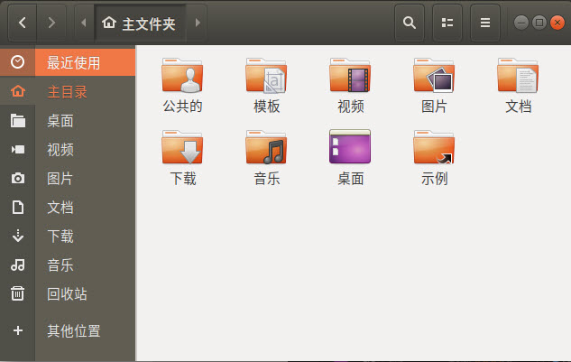
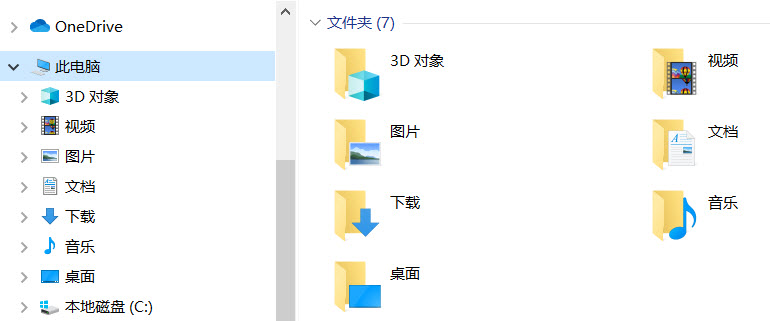
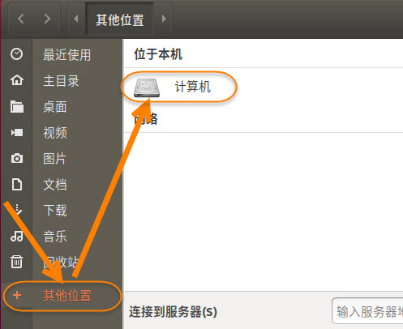
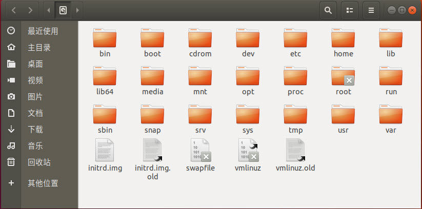
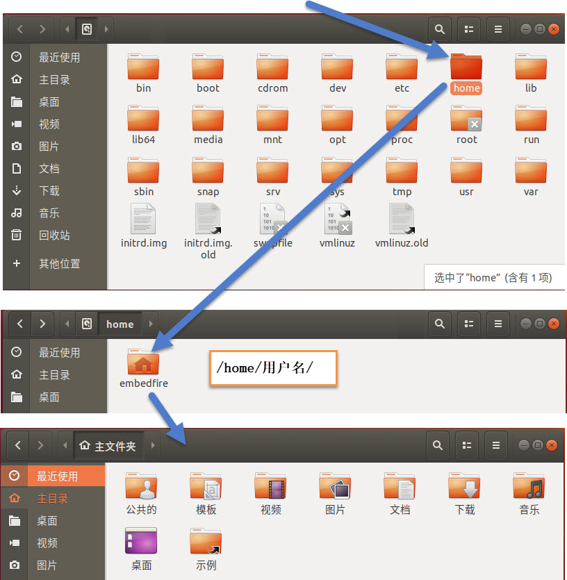
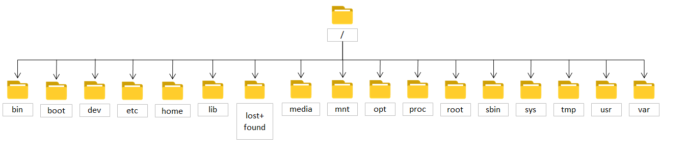
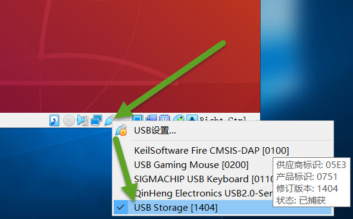
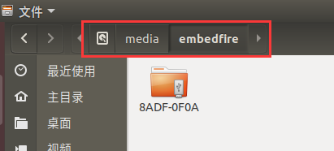
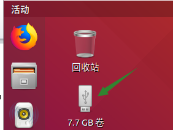
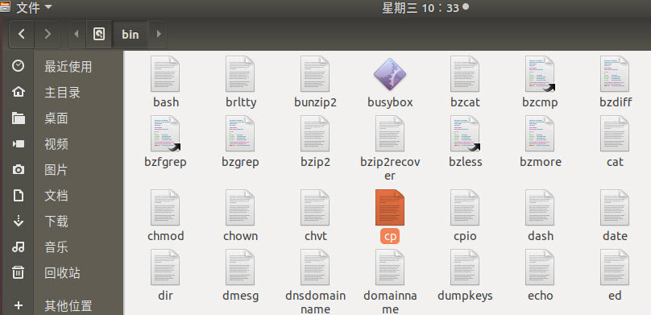
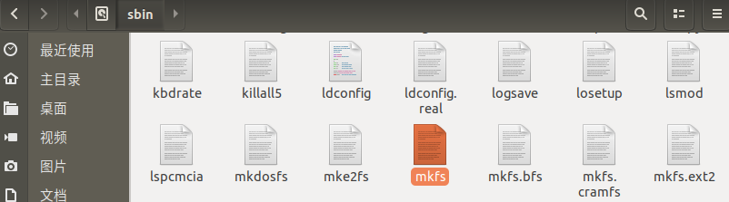
