.. vim: syntax=rst

Linux制作deb包的方法
----------------------

上一章节我们介绍了如何在开发板出厂配套的系统镜像中使用一些脚本来控制板载外设，为了方便管理这些脚本，
我们将这些脚本都制作在一个deb包中，本章节将介绍如何制作一个deb包，制作deb的方式很多，如使用dpkg-deb方式、
使用checkinstall方式、使用dh_make方式及修改原有的deb包，由于完全从新制作deb包比较复杂，
所以本次介绍的deb包制作方式为修改原有的deb包（基于野火的peripheral_0.1.4_armhf.deb包）以及使用dpkg-deb从零开始制作一个自己的deb包。

什么是deb包？
~~~~~~~~~~~~~~~~~~~~~~~~~~~~~~~~~~~~

deb包是在linux系统下的一种安装包，有时我们在网上下载的Linux软件安装包也会以deb包的形式出现，
由于它是基于tar包的，所以同样会记录着文件的权限信息（读、写、可执行）、所有者、用户组等。

我们可以使用命令：dpkg -l来查看系统以及安装了哪些deb包。

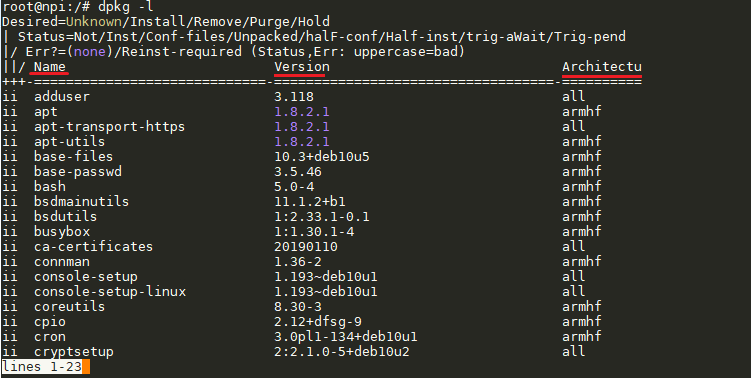

图中为imx6ull下所安装的deb包列表，Name所对应的列为已安装的deb包包名，Version表示该包的版本号，Architecture为该包所支持的处理器架构。

deb包的组成结构
~~~~~~~~~~~~~~~~~~~~~~~~~~~~~~~~~~~~

deb包一般分成两部分：

- 控制信息（放在DEBIAN目录下），本deb包的DEBIAN目录下有changelog、control、copyright、postinst等文件。changelog文件记录了该deb包的作者、版本以及最后一次更新日期等信息；control文件记录了包名、版本号、架构、维护者及描述等信息；copyright文件记录了一些版权信息；postinst记录了在安装deb包后的欢迎词信息。
- 安装的内容，这部分类似linux的根目录，如根目录下的/home/debian/peripheral存放着我们的运行脚本。

1. control：deb包必要的文件，它描述了软件包的名称、版本号、描述信息、所支持的处理器架构等，它可供deb包安装管理及索引。

2. postinst：包含了软件在进行正常目录文件拷贝到系统后，所需要执行的配置工作。

3. postrm文件：软件卸载后需要执行的脚本。

修改已有deb包（基于野火已制作好的peripheral_0.1.4_armhf.deb）
~~~~~~~~~~~~~~~~~~~~~~~~~~~~~~~~~~~~

创建目录结构
^^^^^^^^^^^^^^^^^^^^

安装依赖：

.. code-block:: c

   sudo apt-get install build-essential debhelper make autoconf automake dpkg-dev fakeroot pbuilder gnupg

创建deb包做需的目录结构，使用mkdir创建一个存放deb包的目录，目录名字可自己取，我创建的目录为peripheral_0.1.7_armhf，接着在peripheral_0.1.7_armhf目录下
下创建DEBIAN目录，如下图所示：

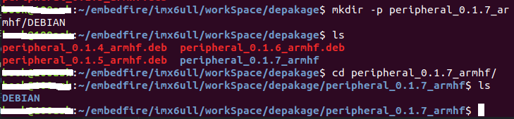

接着使用dpkg -X {要解压的deb包路径} {刚刚创建的peripheral_0.1.7_armhf目录} 来解压deb包，解压成功后输出如下信息。

.. image:: media/mk_deb002.PNG
   :align: center
   :alt: 未找到图片02|

上面只是解压了安装的内容，接着使用dpkg -e {要解压的deb包路径} 解压出控制信息（注意要在你创建的目录下解压），如下图所示：

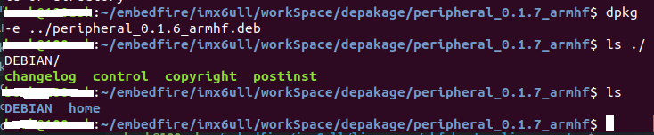

从上图可以看到DEBIAN目录下已经有了文件，表明控制信息解压成功。然后就可以修改其中的内容了，修改前的内容如下图所示：

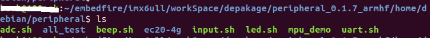

修改内容
^^^^^^^^^^^^^^^^^^^^

接着我们往/peripheral_0.1.7_armhf/home/debian/peripheral目录下添加一些硬件测试脚本，添加ap3216c.sh、ds18b20.sh、dht11.sh等脚本，
修改后的内容如下图所示：

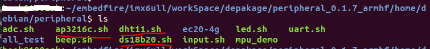

修改完安装内容后，我们再回到DEBIAN目录下，记录一下本次修改的日期及更新版本号等，比如修改changelog和control文件的信息，如图所示：

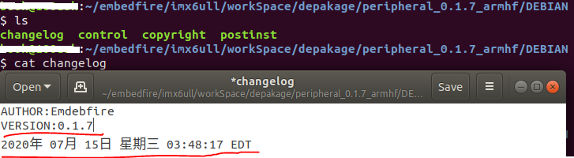

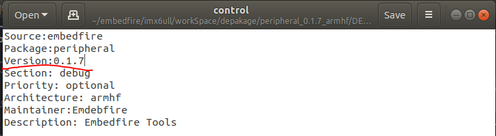

画横线的表示修改过的内容，只修改了版本号和本次修改的日期。

重新打包
^^^^^^^^^^^^^^^^^^^^

最后使用dpkg -b {创建的peripheral_0.1.7_armhf目录} {要打包的包名} 命令便可将修改后的目录重新打成deb包，如图下所示：

.. image:: media/mk_deb008.PNG
   :align: center
   :alt: 未找到图片08|

从零开始创建自己的deb包
~~~~~~~~~~~~~~~~~~~~~~~~~~~~~~~~~~~~

首先我们创建如下目录及文件，该包被安装到imx6ull后可以执行MyAdcSoftware.sh脚本以实现ADC检测功能。

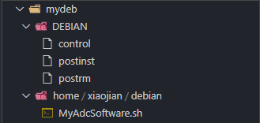

其中，home/xiaojian/debian目录表示该软件被安装后所在你文件系统中的目录，如果你想让软件安装到你文件系统中的/usr/lib目录下，那你可以建立/usr/lib目录结构代替我的home/xiaojian/debian目录结构。
然后分别给予postinst、postrm、MyAdcSoftware.sh等文件可执行权限，chmod +x postinst、postrm、MyAdcSoftware.sh。

其中control文件所包含信息如下：

.. code-block:: sh
   :linenos:
   :caption: mydeb/DEBIAN/control

   Package: MyAdcSoftware
   Version: 1.0.0
   Section: free
   Priority: optional
   Essential: no
   Architecture: armhf
   Maintainer: Jason <1291015298@qq.com>
   Provides: MyAdcSoftware
   Description: adc detect

若以后想升级这个deb包，可以修改该包的版本号Version，值得注意的是Architecture，前面我们也有讲到，就是该deb包所支持的处理器架构，
因为我最终要将该deb包安装到imx6ull处理器上，而imx6ull处理器架构为armhf，所以我们应该在Architecture中填入armhf属性，大家可根据自己的需求做相应修改即可，如果不知道你的处理器架可以通过
dpkg -l命令来查看已安装的deb包持支的架构，或者输入lscpu查看处理器信息，若想支持所有架构，可以填入all属性，如果Architecture属性与当前处理器架构属性不匹配
的话，deb包将无法成功安装，且control的属性信息必须以字母或者数字开头，control文件需要多留出一个空行，不然可能导致打包出错。

postinst文件包含信息如下：

.. code-block:: sh
   :linenos:
   :caption: mydeb/DEBIAN/postinst

   #!/bin/sh
   if [ "$1" = "upgrade" ] || [ "$1" = "install" ];then
   echo "install"
   fi

当安装了该deb包以后，系统会默认执行postinst脚本，通常我们利用该脚本来搭建一些为软件执行的环境（如创建目录、修改权限等），值得注意的是该文件首行必须填#!/bin/sh，且应该给此文件可执行权限。
我这里写的比较简单,判断第一个参数，仅供参考。

postrm文件包含信息如下：

.. code-block:: sh
   :linenos:
   :caption: mydeb/DEBIAN/postrm

   #!/bin/sh
   if [ "$1" = "upgrade" ] ; then
   echo "upgrade"
   elif [ "$1" = "remove" ] || [ "$1" = "purge" ] ; then
   echo "remove"
   fi

当卸载了该deb包以后，系统会默认执行postrm脚本，通常我们利用该脚本来清理环境，值得注意的是该文件首行必须填#!/bin/sh，且应该给此文件可执行权限。
我这里写的比较简单,判断第一个参数，仅供参考。

最后我们来看下真正的软件，为了简单起见，我写了一个用于检测ADC的脚本：

.. code-block:: sh
   :linenos:
   :caption: mydeb/DEBIAN/postrm

   #!/bin/bash
   range=4095
   max_vol=3.3

   while true
   do
      echo "Press Ctrl+C for quit"
      Conversion_Value=$(cat /sys/bus/iio/devices/iio\:device0/in_voltage3_raw)
      echo The Conversion Value is : $Conversion_Value
      vol=$(echo "scale=4;$Conversion_Value*$max_vol/$range" | bc)
      echo The current AD value = $vol V
      sleep 1s
   done

该脚本每秒钟会输出一次当前检测的ADC值到终端。

万事俱备，只欠东风，当备齐了制作deb包的基本原材料之后我们便可以开始制作属于自己的deb包了，首先cd进入
mydeb目录下，也就是DEBIAN及home文件夹所在的目录，接着输入如下命令来构建软件包。

.. code-block:: c

   sudo dpkg-deb -b ../mydeb ../MyAdcSoftware_1.0.0_armhf.deb

其中dpkg-deb是构建deb包命令，-b参数表示要构建一个deb包，../mydeb参数表示要构建deb包原材料的路径，../MyAdcSoftware_1.0.0_armhf.deb参数表示将该deb包构建在当前目录的上级目录中，
一般我们构建deb包的名字都会遵循这么一个原则，其命名方式为：软件名称+软件版本号+该软件所支持的处理器架构，如我软件名为MyAdcSoftware，版本号为1.0.0，所支持的处理器架构为armhf。

打包成功后会输出如下信息：

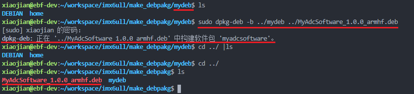

制作好自己的deb包后我们需要验证一下是否真的制作成功，我们可以输入“dpkg -c MyAdcSoftware_1.0.0_armhf.deb”命令查看已制作的deb包文件内容:

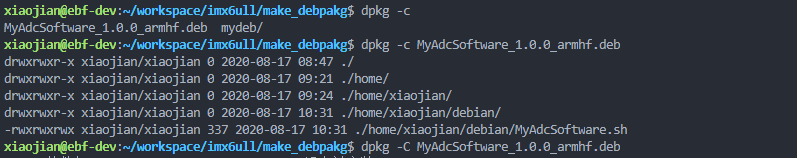

输入“dpkg --info MyAdcSoftware_1.0.0_armhf.deb”命令查看deb包信息：

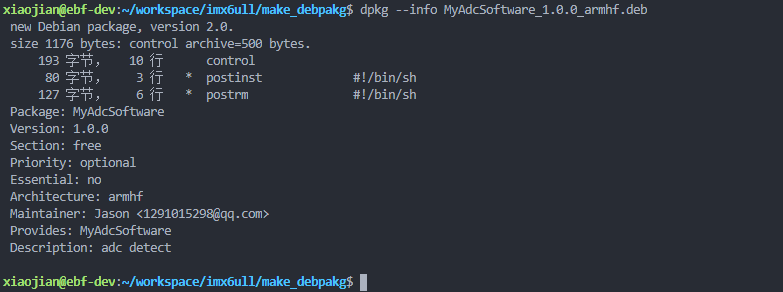

下面我将该deb包拷贝到imx6ull的文件系统下，并在deb包目录下输入“dpkg -i MyAdcSoftware_1.0.0_armhf.deb”命令以安装软件，其中-i 参数表示安装软件，即install，并且在安装完软件之后可以输入“dpkg -s myadcsoftware”命令查看是否安装了软件。

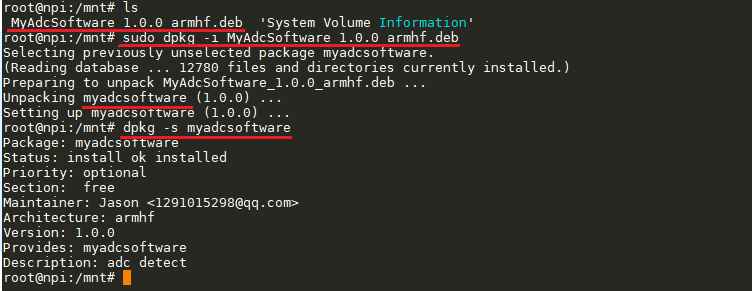

或者输入“dpkg -l”命令罗列出系统已经安装的软件，查看你的软件是否在已安装软件列表里面。

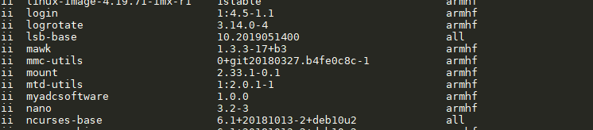

验证安装完成之后我们进入myadcsoftware软件所在目录（该目录是我们在构建deb包的时候对应的目录：/home/xiaojian/debian），
然后执行我们的软件（shell脚本）之后可以看到被检测的ADC信息打印到了终端：

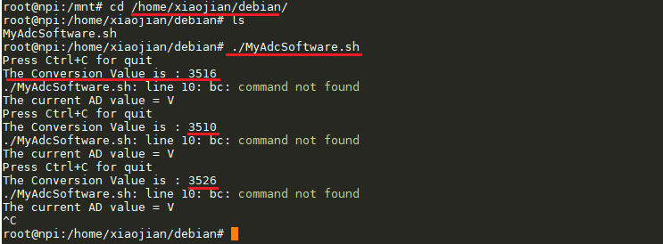

到此，制作deb包的基本流程已介绍完毕。

