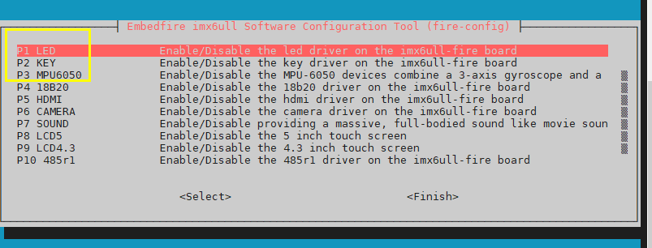
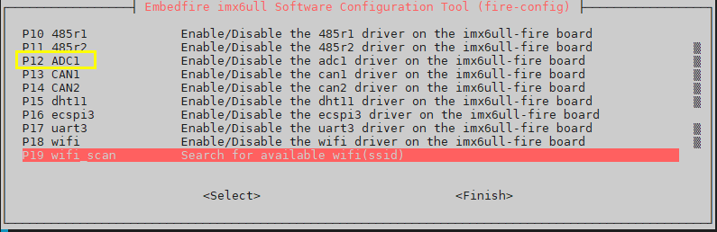
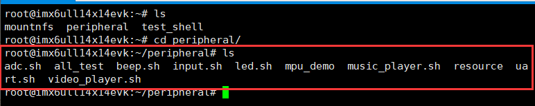
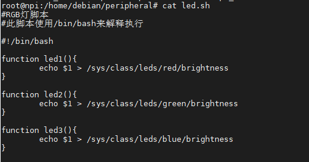
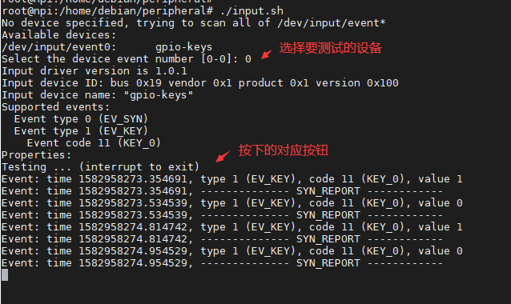
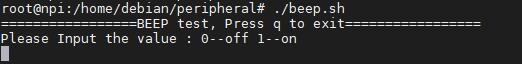
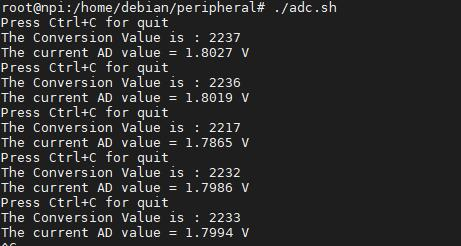
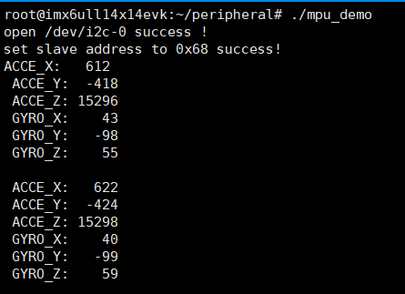
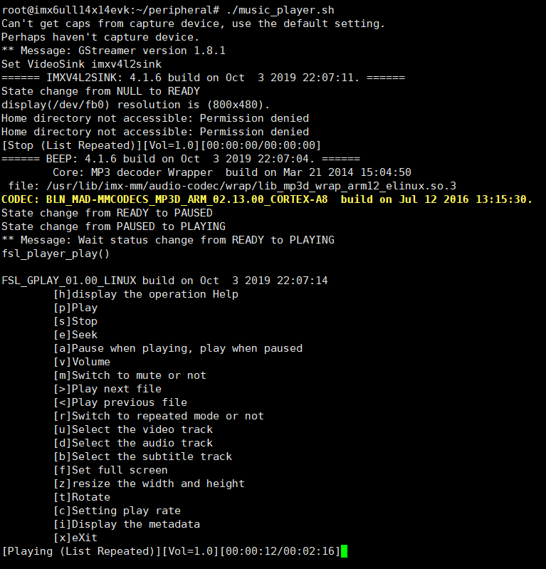
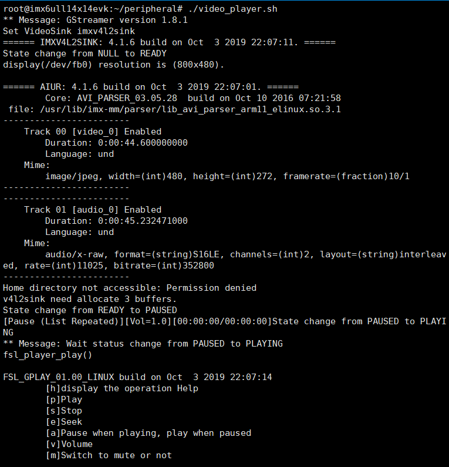

.. vim: syntax=rst

使用脚本测试硬件
--------

为方便对开发板的硬件进行测试，我们在开发板出厂配套的系统镜像中提供了一些脚
本来演示如何控制嵌入式行业常见的板载外设。使用这些脚本可以方便地体验开发板的强大之处。

作为一个合格的程序员，可能在阅读本节的时候，会思考这部分的代码是如何实现的
呢？不过本章我们先进行体验，建立概念，在后面章节再对其中的原理进行详细讲解。只要耐心地
看完本书，精彩都是在后头的。

fire-config使能外设
~~~~~~~~~~~~~~~~~~~~~~~~~~~~~~~~~~~~

本节测试实验，主要涉及LED、按键、蜂鸣器、ADC、陀螺仪等硬件外设，需要初始化化相关模块。
参考《fire-config工具简介》章节的相关介绍，确保使能LED、key、IIC、ADC等模块。

安装脚本文件
~~~~~~~~~~~~~~~~~~~~~~~~~~~~~~~~~~~~

执行安装命令

.. code-block:: sh
   :linenos:

   sudo apt install peripheral

注意:如果开发板是第一次使用下载软件，请先使用以下命令进行软件源的刷新

.. code-block:: sh
   :linenos:

   sudo apt update

测试脚本目录
~~~~~~~~~~~~~~~~~~~~~~~~~~~~~~~~~~~~

安装完成后，测试脚本都被存放在开发板的"/home/debian/peripheral"目录。
为方便讲解，本章后面默认是在该目录下进行，先使用如下命令切换至该目录：

.. code-block:: sh
   :linenos:

   cd ~/peripheral

如上图是开发板提供的外设示例脚本，不同的开发板提供的内容可能会不同。

LED灯测试
~~~~~~~~~~~~~~~~~~~~~~~~~~~~~~~~~~~~

led.sh脚本可以控制开发板上的LED灯，对于EBF6ULL Pro开发板的RGB彩灯会进行
混色，对于EBF6ULL Mini开发板三盏用户LED会以不同形式进行闪烁。

在脚本目录下，使用如下命令可直接运行。执行前请确认当前用户为root用户。

#在脚本目录下运行

.. code-block:: sh
   :linenos:

   ./led.sh

对脚本内容感兴趣的用户可以使用cat命令来查看脚本的内容，如下图所示。

脚本的内容看似复杂，其本质就是相当于手动在终端中执行echo命令修改LED灯的设备文件。其余脚本大都是使
用类似原理对硬件外设进行控制的。

输入设备测试
~~~~~~~~~~~~~~~~~~~~~~~~~~~~~~~~~~~~

input.sh脚本可用于对输入设备进行测试，包括按键、触摸屏、鼠标和键盘等。运行脚本可以看到如下图所示 按键
测试所示的终端信息，若想要退出测试时，请按键盘上的"Ctrl"+"c"结束当前进程。

#在脚本目录下运行

.. code-block:: sh
   :linenos:

   ./input.sh

该脚本其实是直接调用了《检测按键》章节提到的evtest命令，若已了解则使用相同的方式测试即可。

执行脚本后，它会列出可用的输入设备，其中右侧说明带"powerkey"或"gpio-keys"字样的
分别对应开发板的"ON/OFF"键及"KEY"键，输设备对应的数字，就可以进行测试。

上图的示例中数字0表示的是KEY按键，若开发板接入了不同的输入设备，对应的数字可能
不同，请按照自己开发板的提示输出进行选择。

选择了KEY键进行测试后，按下开发板对应的KEY键，终端会有相应的事件检测输出。

蜂鸣器
~~~~~~~~~~~~~

EBF6ULL Pro开发板带有蜂鸣器，可进行蜂鸣器测试。

测试时可使用beep.sh脚本。

#在脚本目录下运行

.. code-block:: sh
   :linenos:

   ./beep.sh

执行脚本后，按提示输入1，蜂鸣器则会发出响声，输入0，则会关闭蜂鸣器。

ADC数据采集
~~~~~~~~~~~~~~~~~~~~~~~~~~~~~~~~~~~~~

EBF6ULL Pro开发板带有电位器，可进行ADC电压采集测试。

在运行该命令前，请先检查跳帽J26是否已接上。

测试时可使用./adc.sh脚本，运行时旋转电位器可看到采集的电压变化。

#在脚本目录下运行

.. code-block:: sh
   :linenos:

   ./adc.sh

陀螺仪
~~~~~~~~~~~~~

EBF6ULL Pro开发板带有陀螺仪，可进行陀螺仪测试。

测试时可使用./mpu_demo应用程序，运行时调整开发板的姿态可看到陀螺仪输出的加速度、角速度会发生变化。

#在脚本目录下运行

.. code-block:: sh
   :linenos:

   ./mpu_demo

其它
~~~~~~~~~~~~

EBF6ULL Pro开发板上还有DHT11、摄像头、WiFi等硬件接口，不过由于开
发板存在硬件引脚的复用，控制某些硬件时需要使用非出厂自带
的Linux系统设备树，控制这些硬件的方式我们将在学习切换系统设备树后再进行操作。

