.. vim: syntax=rst

包管理工具
-------------------------

在windows操作系统中，我们要想安装某个软件的时候，只要点开相应的exe文件，一直按“下一步”，最后点“完成”，这样就可以在我们电脑上使用这个软件了。前面我们也提到过，Ubuntu提供了一个软件商店，虽然它也可以提供软件的下载，并且能够自动安装，但是有些软件并不一定能够在里面搜索得到，那只能以源
码的方式来安装软件。采用这种安装方式，都需要检测当前的系统环境，设置编译的参数，如加入/剔除某个模块等，这样的安装方式就显得非常的繁琐。

软件包与包管理工具
~~~~~~~~~~~~~~~~~~~~~~~~~~~

目前，大多数类 Unix 操作系统都提供了一种中心化的机制用来搜索和安装软件，软件开发者先在固定的硬件平台上将需要安装或升级的软件编译好，然后再将软件的所有相关的文件打包存放在公开的服务器中。用户想要安装某个软件时，通过包的形式进行分发，包提供了操作系统的基本组件，以及共享的库、应用程序、服务和文档
，当用户需要时，可以运行特定的指令来安装。负责这部分工作内容的工具被称为包管理工具，包管理工具除了安装软件外，它还负责更新已经安装的包。

在Linux操作系统中，最常见的两种包分别是deb和rpm。

deb包、dpkg及apt
^^^^^^^^^^^^^

在Debian、Ubuntu等Linux发行版中，通常使用deb（debian）形式的软件包，如图 8‑1是Vim软件的deb安装包。

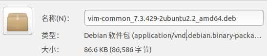

若下载了deb软件包，可使用如下命令进行安装，其中xxxx.deb为要安装的软件包的名字：

.. code-block:: sh
   :linenos:

   sudo dpkg -i xxxx.deb

命令中的dpkg（Debian Packager）是Debian专门开发的包管理工具，它可以用
来安装、更新和移除软件，安装时它需要使用deb软件包。

dpkg是一个底层的包管理工具，主要用于对已下载到本地和已经安装的软件
包进行管理。在它之上的apt（Advanced Package Tool）包管理工具，其功能
则更加丰富和方便使用，使用apt能够自动从互联网的软件仓库中搜索、安装、升级、卸载
软件，它会咨询软件仓库，并能安装软件时的模块及依赖问题。

如果是使用apt工具安装某个软件，直接使用如下命令即可，它会自动下载并安装软件：

.. code-block:: sh
   :linenos:

   sudo apt-get install 软件名

概括起来可以这么理解，deb是软件包，dpkg是手动安装工具，apt是自动安装工具。

rpm包、rpm及yum
^^^^^^^^^^^^

类似地，在RedHat，Fedora，Centos等派系的Linux发行版中，通常
使用rpm（RedHat Package Manager)形式的软件包，下图是Vim软件的rpm安装包。

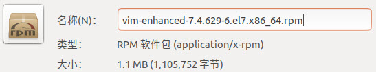

若下载了rpm软件包，可使用如下命令进行安装，其中xxxx.rpm为要安装的软件包的名字：

.. code-block:: sh
   :linenos:

   rpm -ivh xxxx.rpm

命令中的rpm与dpkg的功能类似，同样是主要用于对已下载到本地和已经安装
的软件包进行管理。在它之上yum（Yellow dog Updater, Modified）包管理
工具，功能与apt类似，它会咨询软件仓库，并能安装软件时的模块及依赖问题。

使用yum安装软件的命令如下，同样地，它会自动下载并完成安装：

.. code-block:: sh
   :linenos:

   yum install 软件名

关于这些软件包和工具，总结如下表：

表  软件包和工具

============== ================ ================
\              Debian派系发行版 Redhat派系发行版
============== ================ ================
软件包         deb              rpm
基础包管理工具 dpkg             rpm
上层包管理工具 apt              yum
============== ================ ================

apt工具使用
~~~~~~~

本书使用的Linux发行版是Ubuntu，对应的包管理工具就是apt工具，apt包管
理工具包含了apt-get工具，主要负责软件包的的安装、卸载以及更新等事务，除
此之外，还有apt-cache，用于查询软件包的相关信息，apt-config，用于配
置所有apt工具。

安装与删除软件包
^^^^^^^^

.. code-block:: sh
   :linenos:

   apt-get install
'''''''''''''''

使用apt-get工具安装程序的时候，需要你知道应用程序的名字。具体的命令语法：

.. code-block:: sh
   :linenos:

   sudo apt-get install 软件包名

apt-get install会扫描本地存放的软件包更新列表/var/lib/apt/lists/，找
到最新版本的软件包，然后检查软件包依赖关系，找到支持该软件正常运行的
所有软件包，并从镜像源地址中下载所需的软件包，最后解压软件包，自动完
成应用程序的安装和配置。

下面带大家来安装一个有趣的命令：sl。运行该命令之后，你的终端里会出
现一辆火车在跑，执行以下命令：

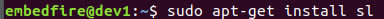

可以看到终端会输出很多信息，下面我们把输出信息拆分成三块进行讲解：

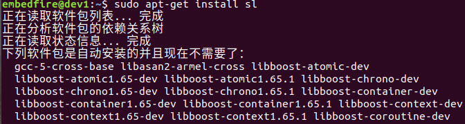

上图中的输出信息，apt-get install正读取软件包列表，并且检查软件包的依赖关系，并且列出了所有的依赖文件。

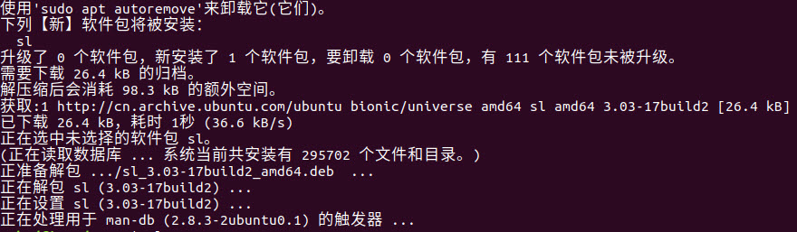

上图则是apt-get install从镜
像源http://cn.archive.ubuntu.com/ubuntu中下载所需要的软件，并且
自动解压，完成安装的整个过程。

运行刚刚安装的软件，在终端输入命令：sl，就可以看到下图的画面。

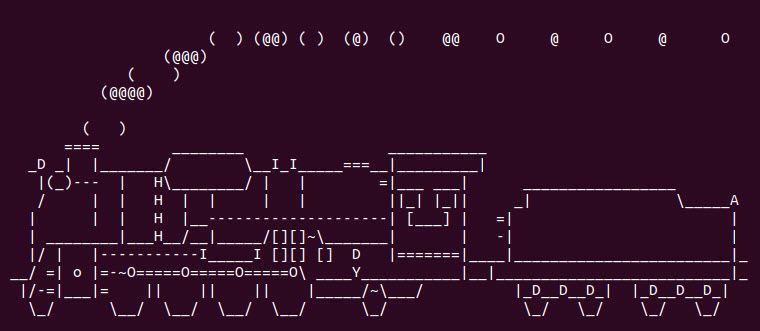

apt-get remove
''''''''''''''

讲了如何安装软件，自然也要知道如何卸载一个软件，具体的命令语法如下：

.. code-block:: sh
   :linenos:

   sudo apt-get remove 软件包名

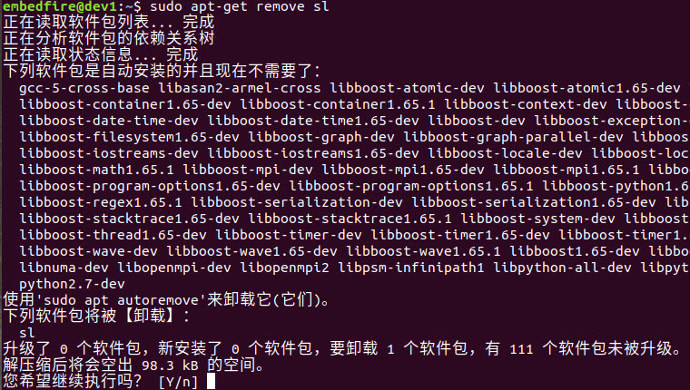

在执行命令之后，终端会提示是否继续执行删除操作，输入“Y”的话，该软件
就和你彻底说拜拜了，输入“n”的话，则会终止当前的删除操作。

常用镜像站
^^^^^

使用apt-get install安装软件时，可注意到它是从Ubuntu官方源地址下载的，但Ubuntu默认官
方的软件仓库都设置在国外，经常出现软件包安装更新缓慢甚至下载超时等异常情况。实
际上，国内有许多第三方软件仓库镜像源，可以从这些国内仓库安装软件工具。

常用的国内镜像源有：

-  清华大学镜像源：\ https://mirrors.tuna.tsinghua.edu.cn/

-  中国科技大学镜像源：\ https://mirrors.ustc.edu.cn/

-  阿里云镜像源：\ https://opsx.alibaba.com/mirror

这些镜像站通常包含非常丰富的软件，以清华大学镜像源的网站为例，见下图，在其镜
像列表中可以找到ubuntu的软件源，点击ubuntu右侧的“？”，还可以查看到如下的帮助说明。

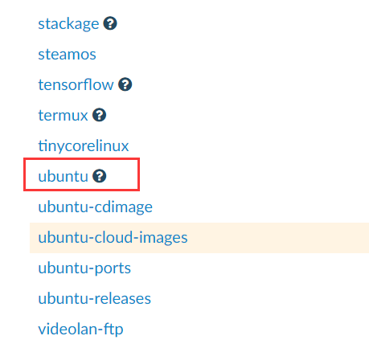

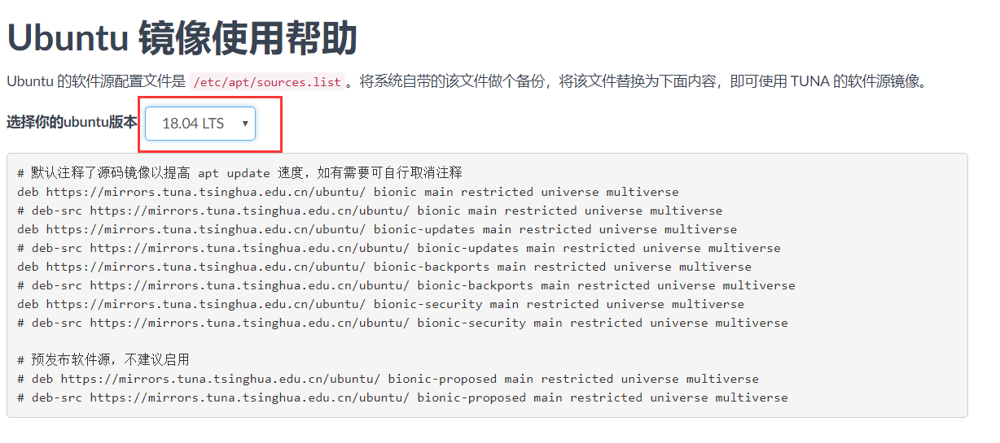

点击镜像站中的ubuntu链接，可以看到如下所示的界面。

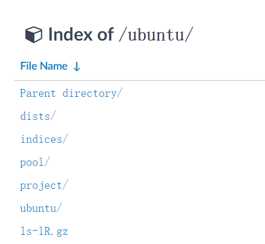

该页面下的目录pool就是各种Ubuntu软件存放的位置，点击该地址，可以看到如下所示的内容。

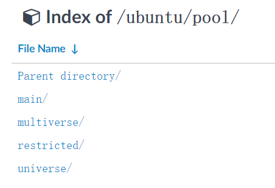

其中有四个目录，分别是main，multiverse，restricted以及universe四个“仓库”，它们
主要是依据软件包是否开源来进行划分的：

-  main表示完全开源软件，可以被Ubuntu官方完全支持的软件。

-  muitiverse表示非开源软件，不提供任何的支持和补丁。

-  restricted表示 不完全开源的软件，依然能被Ubuntu官方支持的软件，但可能不能提供完全的技术支持。

-  universe表示Ubuntu官方不提供支持与补丁，全靠社区支持。

这四个目录中的软件都是按照软件名称的首字母进行分类，极大地方便了我们搜索某个
软件，如下所示。不过，当我们使用时，是直接通过apt工具下载的，而不需要自己来到开源镜像站中查找。

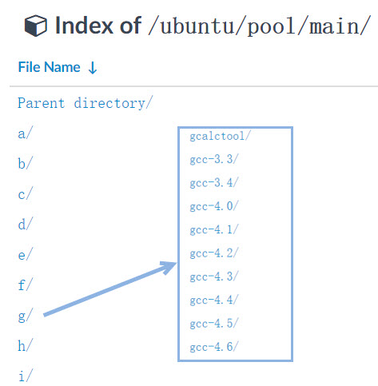

修改软件源（图形）
^^^^^^^^^

在Ubuntu下可直接在“软件和更新”的配置中修改软件源，见下图。

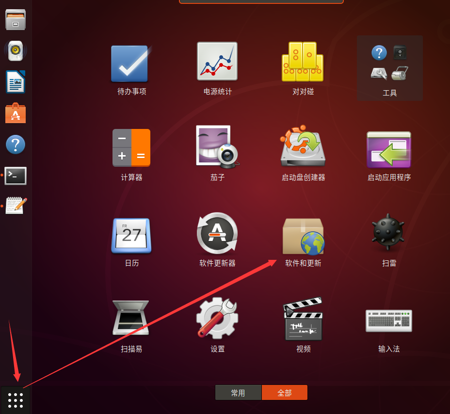

在弹出的界面选择“其他站点”->“mirrors.tuna.tsinghua.edu.cn”（清华大学
镜像源）或“mirrors.aliyun.com”（阿里云镜像源）网址，如下图所示。

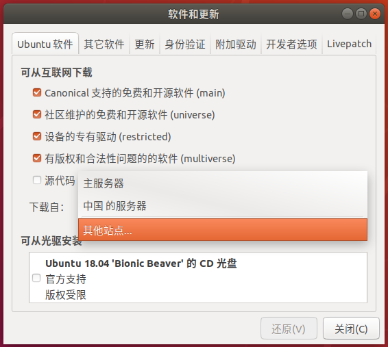

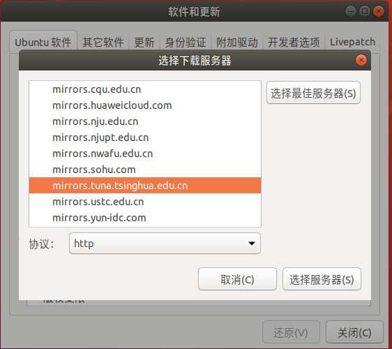

选择后关闭该窗口它会提示更新源，点击“重新载入”即可，见下图。

.. image:: media/softwa017.png
   :align: center
   :alt: 未找到图片17|

软件源格式
^^^^^

在后面我们的开发板会提供Debian及Ubuntu的镜像，但在开发板中修改软件源
并没有上述的图形界面这么方便，我们通常是使用终端去修改软件源配置文件
实现的，而且在后期搭建开发环境的时候，也常常需要修改各种配置文件。在本例
子中如果改得不对，还可以通过上面的图形界面修改回来，所以我们就趁这个机会先熟悉一
下修改配置文件的过程吧。修改配置文件的步骤为：熟悉配置文件的格式->修改配置文件->更新配置。

我们先来了解软件源配置文件的格式，在Ubunut下，软件源的配置是记录
在文件/etc/apt/sources.list中的，我们可以通过cat命令输出该文件的内容，查
看自己电脑上的源配置：

.. code-block:: sh
   :linenos:

   at /etc/apt/sources.list

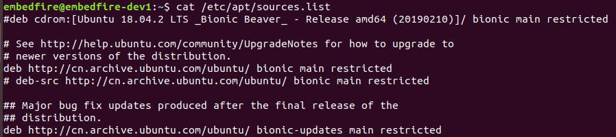

/etc/apt/sources.list文件具有一定的格式如下所示。

官方软件源（/etc/apt/sources.list节选）

1 deb http://cn.archive.ubuntu.com/ubuntu/ bionic main restricted

2 deb-src http://cn.archive.ubuntu.com/ubuntu/ bionic main restricted

第三方镜像源（以清华大学镜像源为例）

1 deb https://mirrors.tuna.tsinghua.edu.cn/ubuntu/ bionic main restricted universe multiverse

2 deb-src https://mirrors.tuna.tsinghua.edu.cn/ubuntu/ bionic main restricted universe multiverse

我们以清华大学提供的镜像源为例，讲解一下Ubuntu软件源的格式。

/etc/apt/sources.list中每一行都代表了一个软件源，每行的软件源描述又可以分为四个部分，见下表。

表  软件源格式

=========== ============================================ ==================== ===================================
软件包格式  镜像源地址                                   Ubuntu发行版版本代号 要下载软件包的类型
=========== ============================================ ==================== ===================================
deb/deb-src https://mirrors.tuna.tsinghua.edu.cn/ubuntu/ bionic               main restricted universe multiverse
=========== ============================================ ==================== ===================================

这四部分的说明如下：

-  第一部分，软件包格式。apt工具下载某个格式的软件包，有deb和deb-src两种格
   式。deb格式就是所要的软件安装包，而deb-src则是对应软件的源代码。因为
   开源协议，我们在下载某个软件的同时，也可以下载到某个软件的源代码。

-  第二部分，镜像源地址， apt工具去什么地方可以下载到我们所
   需要的软件包。这个地址可不是什么普通的地址，关于这部分内容后面还会继续介绍。

-  第三部分，Ubuntu发行版本的版本代号。在本章开篇处，曾提到
   了包管理工具中的软件都是经过Linux开发者在特定的硬件平台上编译成功
   之后，发布出来的。因此，同一个软件，在不同的平台上不一定适用，因此，在
   下载的时候，千万不能搞错版本，张冠李戴。Ubuntu中的每个版本都是由一个形容词和一个动物名称组
   成，并且形容词和名词的首字母都是一致的。如果当前版本的首字母是 D ，下个
   版本就要以 E 来起头。

表  Ubuntu发行版版本代号

===== ================
版本  版本代号
===== ================
12.04 Precise Pangolin
14.04 Trusty Tahr
16.04 Xenial Xerus
18.04 Bionic Beaver
===== ================

..

   上表只列出了Ubuntu的LTS版本。LTS，是长期支持（Long Term Support）的缩写。Ubuntu
   桌面版通常每两年发布一个新的LTS版本，本书使用的Ubuntu18.04，对应的版本代号为Bionic Beaver。

-  第四部分，选择要下载的软件包的类型，前面介绍的main完全开源软件， restricted不完全开源
   的软件，universe Ubuntu官方不提供支持与补丁的软件，全靠社区支持。muitiverse非开源软件。

修改软件源（命令行）
^^^^^^^^^^

下面我们尝试通过修改/etc/apt/sources.list文件修改软件源。

建议在修改软件源前，使用如下复制命令对原文件进行备份：

.. code-block:: sh
   :linenos:

   cp /etc/apt/sources.list /etc/apt/sources_bk.list

若修改后使用有问题，使用备份的/etc/apt/sources_bk.list覆盖原文件后更新即可。

由于修改/etc/apt/sources.list配置文件通常需要管理员权限，
普通用户在图形界面直接双击打开该文件时，Ubuntu系统自带的编辑器gedit只有只读权限，无法修改。可以在终端中使用sudo以管理员的身份运行gedit，并打开/etc/apt/sources.list文件进行修改，命令如下：

.. code-block:: sh
   :linenos:

   sudo gedit /etc/apt/sources.list

在后面的系统应用中，我们常常需要修改某些系统配置文件，都可以通过这
种方式使用gedit进行修改，把命令中的文件名改成目标文件即可。

如果系统没有gedit或者没有图形界面，一般直接在终端下使
用Vi/Vim编辑器进行修改，不会使用Vi/Vim的话，请在学习《使用Vim编辑器》的章
节后再进行修改。

把前面镜像源使用帮助的sources.list文件内容复制替换文件/etc/apt/sources.list的原内容，保存后退出即可。

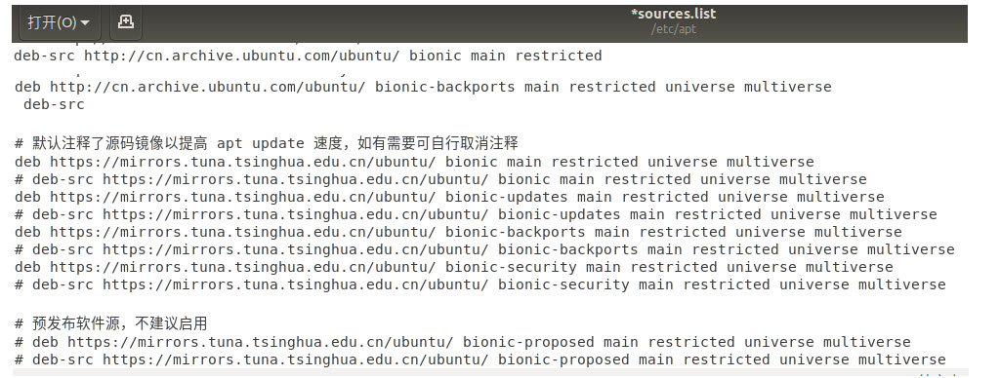

更新软件源
^^^^^

用户一旦修改了软件源配置文件/etc/apt/sources.list，需要运行apt-get update命令来更新软件源中的所有软件列表。

.. code-block:: sh
   :linenos:

   sudo apt-get update

.. image:: media/softwa020.png
   :align: center
   :alt: 未找到图片20|

apt-get update命令会扫描每一个软件源地址，并为该软件源地址所具有软
件包资源建立索引文件，存放在本地的/var/lib/apt/lists/目录下。

我们从上图中，可以看到我们上面添加的中国科技大学的镜
像源地址，在sources.list文件中选择只下载main类型的软件，因此在apt-get
update的过程中，也只会去获取main类型的软件包。此外，图中
的amd64是一种64位的电脑处理器架构，又称“x86-64”或“x64”；i386则是
作为对Intel（英特尔）32位微处理器的统称。

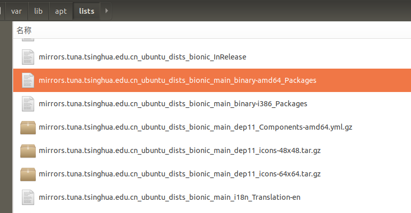

本书的虚拟机使用的64位机器，我们打开上图选中的文件，该文件主要
记录了所有适用于am64架构处理器的软件包。

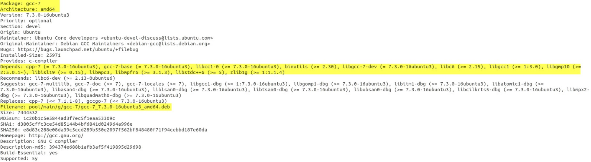

上图中记录了gcc-7软件包的相关信息：

-  Package：记录了关于软件的具体名称；

-  Architecture：该软件包可以运行的平台架构，常见的
   有amd64，i386。Debian和Ubuntu的Linux发行版也支持armhf架构的处理器。

-  Depends：记录了该软件的需要依赖文件，而且还有相应的
   版本要求。安装gcc-7编译器，需要依赖zlib1g，版本要求高于1:1.1.4。

-  Filename：记录了该软件包位于镜像源的位置，是不是和我们上一节分析的内容一致。

   1. ..
      rubric:: apt-cache工具 :name: apt-cache工具

apt-cache是Ubuntu的另一个APT软件包管理工具。通过apt-cache工具
配合对应的子命令，可以实现查找，显示软件包信息及包依赖关系等功能，见下表。

表  apt-cache工具

========================== ============================================
命令                       作用
========================== ============================================
apt-cache showsrc 软件包名 显示软件包的相关信息，如版本信息，依赖关系等
apt-cache search 软件包名  按关键字查找软件包
apt-cache depends软件包名  显示该软件包的依赖关系信息
apt-cache rdepends软件包名 显示所有依赖于该软件包的软件包名字
apt-cache show 软件包名    显示指定软件包的信息，如版本号，依赖关系等.
apt-cache pkgnames         显示所有软件包的名字
apt-cache policy 软件包名  显示软件包的安装状态
========================== ============================================

例如，可通过如下命令搜索支持ifconfig命令的软件包：

.. code-block:: sh
   :linenos:

   apt-cache search ifconfig

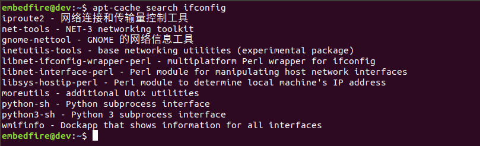

APT包管理工具还包括apt-config工具，用于配置所有的APT工具，但是我们
基本上接触不到。因此，我们只需要重点掌握apt-get工具的用法，对于apt-
cache的话，我们只需要大概了解即可。实际上，Ubuntu开发团队也发现了这
个问题，并且给出了有效的解决方法：apt命令。这里的apt命令和APT包管理
工具是完全不同的两个东西，请不要混淆了。

apt与apt-get
~~~~~~~~~~~

前面介绍命令“apt-get install”时，已经为大家演示了如何安装软件。下面的实验
是大多数初学者经常会遇到的情况。现在我们执行下面的命令：

.. code-block:: sh
   :linenos:

   vim

终端会告诉你，找不到这个vim命令，并告诉你可以用下面提供命令来安
装软件，如下图所示。Linux的终端往往会输出一些有利于我们
解决问题的信息。而Windows偶尔会弹出一个对话框来提醒用户。因
此，在今后的学习中，遇到问题，应该多关注终端的输出信息，说不定里面暗含着解决之道。

不知道有没有细心的读者发现，此处Linux给出的解决方案是“apt install vim”而
不是“apt-get install vim”。实际上，在Ubuntu 16.04中就引入了 apt 命
令，并且越来越多Linux发行版也开始鼓励用户使用apt而不是apt-get。前面
我们提到，apt-
cache、apt-config 等命令包含众多了功能，但对于 Linux 用户来说可能永
远都不会使用到。apt 命令出现就是为了解决上述的问题，它包括了 apt-get 命
令使用最广泛的功能选项，以及 apt-cache 和 apt-config 命令中很少用到的功能，也就是说apt是集apt-
get、apt-cache 和 apt-config 各工具之所长的工具。不仅如此，使用 apt 命
令安装或删除程序时，会有进度条显示当前的进度。

表  apt命令

==================== ==========================
命令                 作用
==================== ==========================
apt install 软件包名 安装指定的软件包
apt remove 软件包名  卸载指定的软件包
apt update           更新软件源列表
apt search 软件包名  根据关键字搜索对应的软件包
apt show 软件包名    显示软件包的相关信息
apt list             根据名称列出所有的软件包
==================== ==========================

上表中列出了部分常用的apt命令，可以看到apt命令比APT包管理
工具更加精简，更能满足用户的需求。用通俗一点的话讲，就是别人需要三个
工具才能搞定的事情，我只需要一个apt命令，如原来的apt-get install 命令
改成apt install同样也可以完成软件的安装。

我们输入命令：

.. code-block:: sh
   :linenos:

   sudo apt install vim

之后，会提示你输入密码，接着便开始下载，安装软件
了。软件安装完成之后，再执行命令vim，终端就不会再报
错了，这时候就可以使用我们的Vim编辑软件，软件界面如 下图所示。

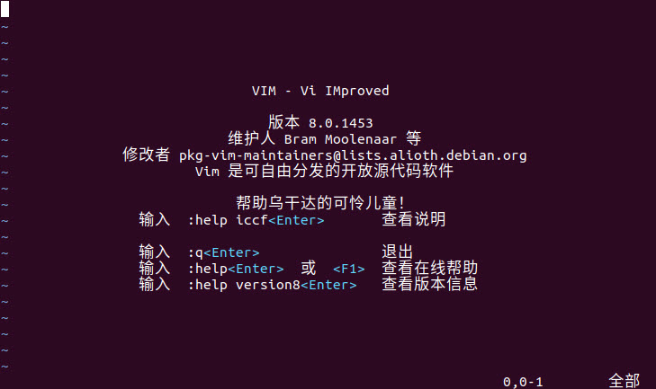

对于没有用过Vim的用户，如果你在Vim上尝试折腾一翻后， 可能会出现各种情
况，如进入到了Vim的编辑模式，输入了些内容，但不知道如何保存或退出，这些
我们将在《第10章 使用编辑器》章节中介绍，现在我们直接点击终端右上角的关闭按钮强制退出即可。

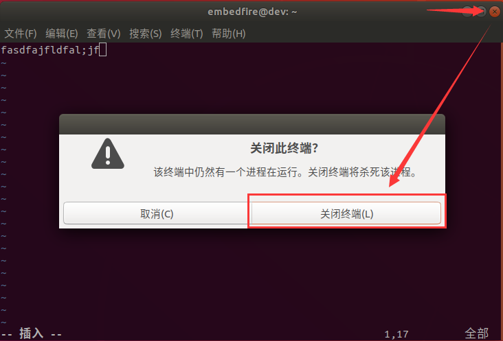

.. |softwa017| image:: media/softwa017.png
   :width: 4.23197in
   :height: 3.1875in

.. |softwa020| image:: media/softwa020.png
   :width: 5.76806in
   :height: 1.87595in

