.. vim: syntax=rst

开发板连接网络与SSH登录
------------------------------------------

连接网络与查看开发板IP地址
~~~~~~~~~~~~~~~~~~~~~~~~~~~~

使用网线通过开发板的任意一个以太网接口与路由器连接起来，或者配置开发板链接上无线路由器WIFI（fire-config连接WIFI章节），即可把开发板连接至网络。

使用ifconfig命令查看开发板的IP地址，见下图。

.. image:: media/boards009.png
   :align: center
   :alt: 未找到图片

在上图中开发板使用ifconfig命令可查看到开发板eth1网口的IP地址，为192.168.0.69。若
使用ifconfig命令查看不到IP地址，请检查网络连接，或尝试使用以下命令申请IP：

.. code-block:: sh
   :linenos:

   #eth1表示第一路以太网口，eth2表示第二路以太网口
   sudo udhcpc  -b  -i  eth1  

若命令执行正常，会出现图中的输出，并且再次输入ifconfig命令会查看到eth1具有正常的IP地址。

.. image:: media/boards010.png
   :align: center
   :alt: 未找到图片

ping测试
^^^^^^^^^^^^^^^^^^^^^^^^^^^^^^^^

若开发板连接的路由器支持连接到公网，直接在终端输入如下命令即可进行连接测试：

.. code-block:: sh
   :linenos:

   #在开发板的终端执行以下命令
   ping www.firebbs.cn

.. image:: media/boards008.png
   :align: center
   :alt: 未找到图片

出现类似上图的输出表示网络连接成功，使用“Ctrl + C”可退出命令。

若连接的路由不支持连接到公网，可以直接ping路由的IP地址或者同样连接到该路由电脑的IP地址，如本例子中的路由IP地址为192.168.0.1。请把以
下命令中的IP地址换成自己实验环境的路由IP：

.. code-block:: sh
   :linenos:

   ping 192.168.0.1

使用MobaXterm SSH登录开发板
~~~~~~~~~~~~~~~~~~~~~~~~~~~~

SSH终端通过开发板的以太网或WiFi的IP地址都可以连接，也可使用主机名。

- 开发板的默认主机名为： **npi** 。
- IP默认由路由动态分配，可先通过串口终端连接，使用 **ifconfig命令** 查看具体IP。

1、上电启动开发板，开发板默认开启ssh服务。系统正常登录后，输入以下命令查看ssh服务是否已经运行：

.. code-block:: sh
   :emphasize-lines: 2
   :linenos:

   sudo systemctl status ssh

如下图所示:active状态说明ssh服务正常运行

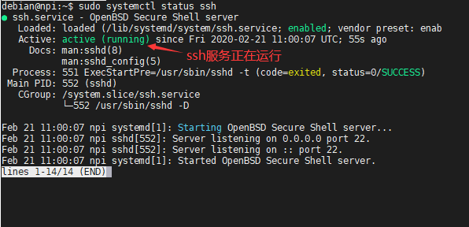

2、确保网络连接正常(注意wifi要先正确配置后才能使用)。输入以下命令查看当前主机的ip地址:

.. code-block:: sh
   :emphasize-lines: 2
   :linenos:

   ifconfig

3、点击菜单栏 「sessions」 –> 「new session」，弹出 「session setting」 对话框，选择SSH：

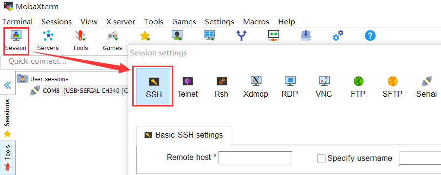

4、在Remote host中填入开发板连接网络后使用的IP地址或者开发板的默认主机名**npi**，
   在Specify username打钩后，可以先填好登录名**debian**，如果不填则之后手动先输入登录名。
   点击下面的OK开始连接。

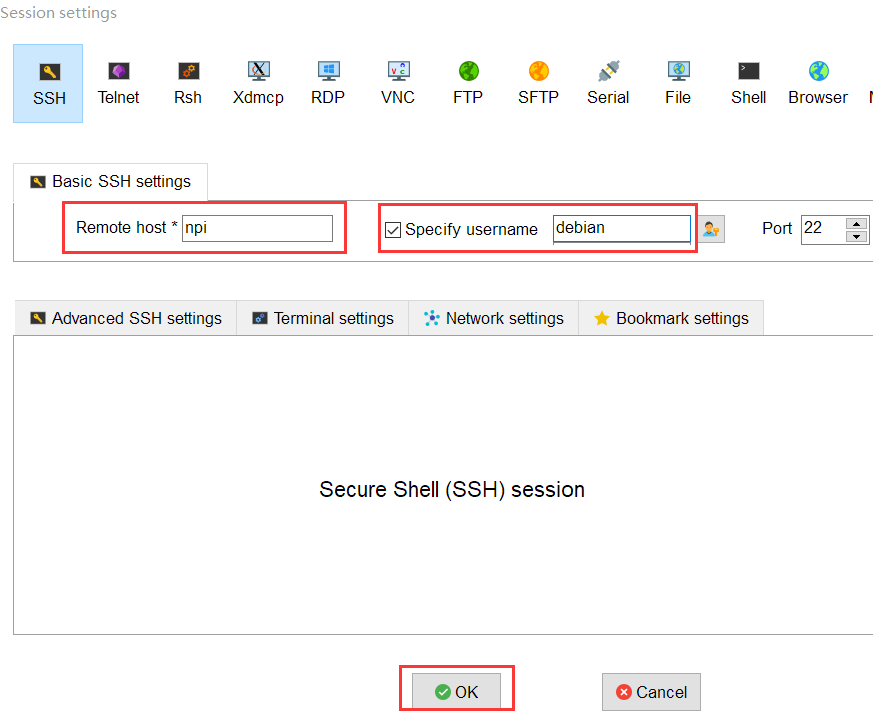

5、成功连接上后会要求输入登录名密码**temppwd**，当密码输入正确回车后，会弹出一个窗口，这里直接点关闭不影响。

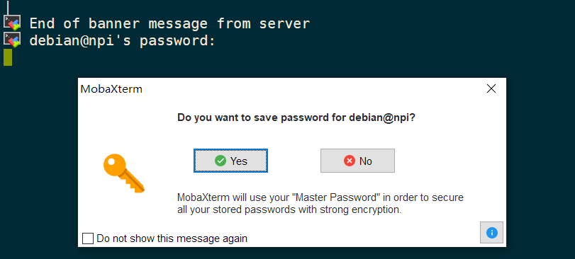

6、成功登陆后即可输入命令操作。左边会自动出现一个窗口显示开发板目录下的文件，可以用鼠标把文件拖放进去或者把板子文件拖放出来。

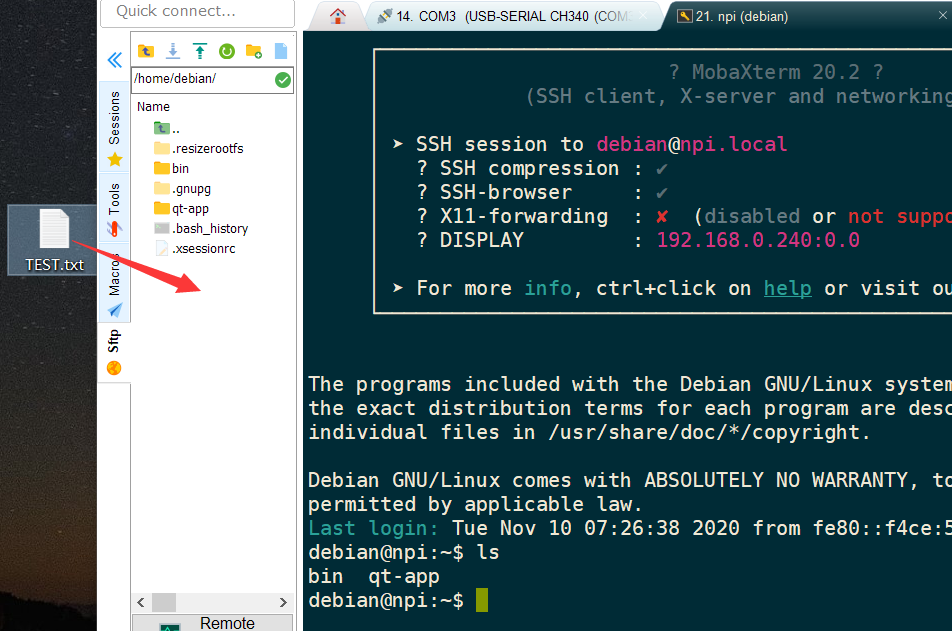

7、文件拖放进开发板后的样子。

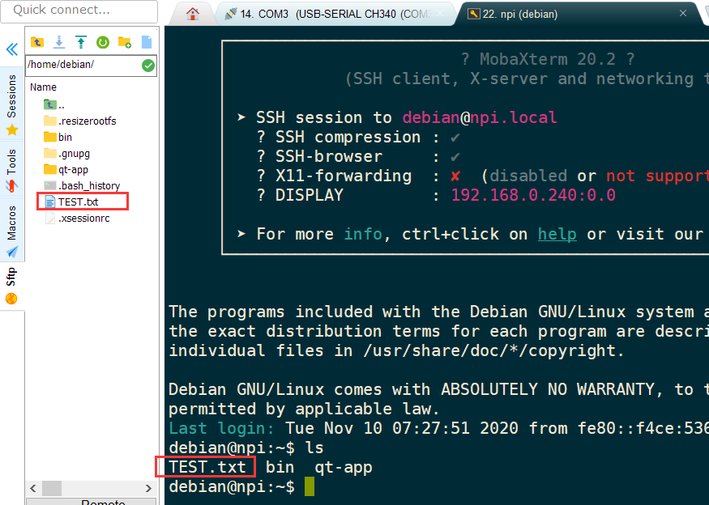

使用vscode SSH登录开发板
~~~~~~~~~~~~~~~~~~~~~~~~~~~~

1、这里使用vscode的Remote-SSH插件为例。
vscode安装完Remote-SSH插件后，使用“ctrl+shift+P”快捷键打开命令面板，
输入“Remote-SSH”迅速找到“Remote-ssh: connect to host”选项，
如下图所示:

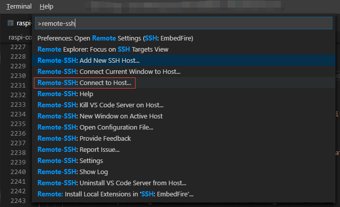

2、进一步选择“Add New SSH Host”选项，如下图

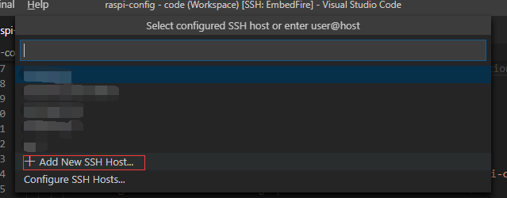

3、根据开发板的ip地址，在ssh登录框中输入登录命令，
这里以本人实际开发环境中的以太网IP地址为例。

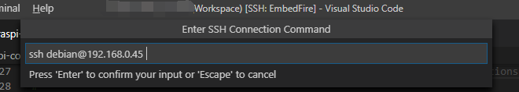

4、选择配置文件来保存主机ip和用户名，一般选择用户名下的config进行配置即可，
如下图所示:

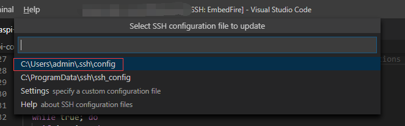

5、提示检查主机公钥指纹，选择“continue”,如下图:

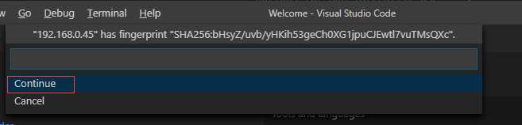

6、输入主机用户的密码，debian用户默认密码为“temppwd”。
如果弹出登录失败串口，点击“retry”选项，重复登录2~3次。

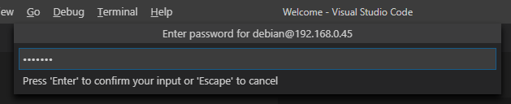

7、登录成功后，在菜单栏打开“Terminal”选项，新建一个终端。
如下图:

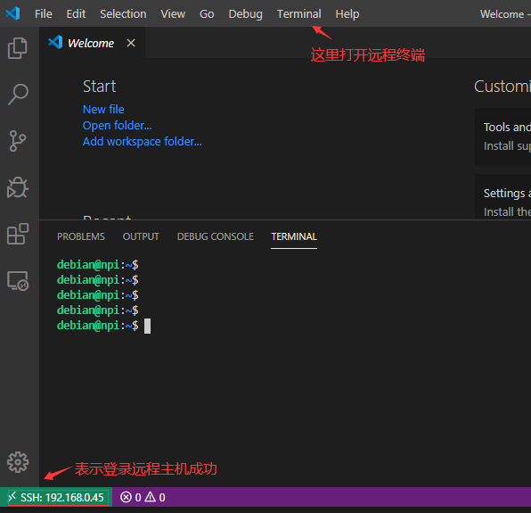

修改启动脚本和固定IP
~~~~~~~~~~~~~~~~~~~~~~~~~~~~

系统在启动时会在显示屏中绘制进度条，这就是 ``/opt/scripts/boot/psplash.sh`` 启动脚本要干的事情，当成功加载完系统后，接着会执行 ``/opt/scripts/boot/psplash_quit.sh`` 启动脚本，那么可以在这个启动脚本中处理一些自己的事情。

比如野火在绘制完进度条后启动qt
app，在 ``/opt/scripts/boot/psplash_quit.sh`` 启动脚本就是这样子写的：

.. code:: bash

    if [ -f /home/debian/qt-app-static/run.sh ] ; then
        sudo /home/debian/qt-app-static/run.sh &
    else
        sudo /home/debian/qt-app/run.sh &
    fi

如果你不想启动qt
app，则可以把上述代码注释掉即可，如果你想在启动后有一个固定的IP地址，那么也可以这样子做， ``xxx`` 改为你自己需要设置的IP地址即可：

.. code:: bash

    sudo ifconfig eth1 down
    sudo ifconfig eth1 192.168.xxx.xxx up

如果你想执行其他操作，就在这里修改即可，此处仅是做个提示。

那么如果我不想等待系统加载完成就运行我的脚本，如何做到呢，其实还是只需要修改 ``/opt/scripts/boot/psplash.sh`` 启动脚本即可，在这个启动脚本中有执行绘制进度条的操作，在改脚本的最后一行，具体如下:

.. code:: bash

    /usr/bin/psplash

那么你也可以在这个启动脚本中添加你需要执行的脚本即可， **请注意：需要脚本所在的绝对路径** 。

