.. vim: syntax=rst

查看系统信息
------------------

当我们新购入一台笔记本电脑或者是台式机时，都免不了会去看看它的CPU型号，内存容量以及硬盘的使用情况等等。
对于Linux开发板来说，实际上也相当于一台小型电脑，虽然距离传统PC可能有差别，但是麻雀虽小，五脏俱全，我们同样希望去查看开发板的这些相关信息。

本章中介绍的内容大部分不仅适用于开发板，大部分也适用于开发主机中的Ubuntu系统，请尝试在两种平台上执行相关的命令查看信息，比较差异。

初探/proc目录
~~~~~~~~~~~~~~~~

Linux没有提供类似Windows的任务管理器，但是它将系统运行的信息都记录在/proc目录下的文件中，
用户可以通过访问该目录下的文件获取对应的系统信息。

请在开发板的终端下执行如下命令查看/proc目录的内容：

.. code-block:: sh
   :linenos:

   #在开发板的终端执行以下命令
   ls /proc

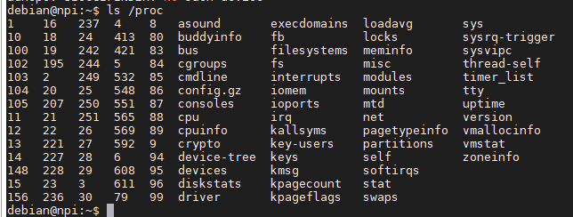

该目录下各文件包含的信息如下表所示。

表   /proc文件结构

=========== ================================================================================================================================================================================
文件名      作用
=========== ================================================================================================================================================================================
pid*        “pid*”通常就是一个数字，该数字表示的是进程的 PID 号，系统中当前运行的每一个进程都有对应的一个目录，用于记录进程所有相关信息。对于操作系统来说，一个应用程序就是一个进程
self        该文件是一个软链接，指向了当前进程的目录，通过访问/proc/self/目录来获取当前进程的信息，就不用每次都获取pid
thread-self 该文件也是一个软链接，指向了当前线程，访问该文件，等价于访问“当前进程pid/task/当前线程tid”的内容。。一个进程，可以包含多个线程，但至少需要一个进程，这些线程共同支撑进程的运行。
version     记录了当前运行的内核版本，通常可以使用“uname –r”命令查看
cpuinfo     记录系统中CPU的提供商和相关配置信息
modules     记录了目前系统加载的模块信息
meminfo     记录系统中内存的使用情况，free命令会访问该文件，来获取系统内存的空闲和已使用的数量
filesystems 记录内核支持的文件系统类型，通常mount一个设备时，如果没有指定文件系统并且它无法确定文件系统类型时，mount会尝试包含在该文件中的文件系统，除了那些标有“nodev”的文件系统。
=========== ================================================================================================================================================================================

通过访问/proc文件夹的内容，就可以得到我们想要的系统信息。

查看CPU信息
~~~~~~~~~~~~~~~~~~~~~

/proc/cpuinfo文件存储了CPU的信息，可通过如下命令查看：

.. code-block:: sh
   :linenos:

   cat /proc/cpuinfo

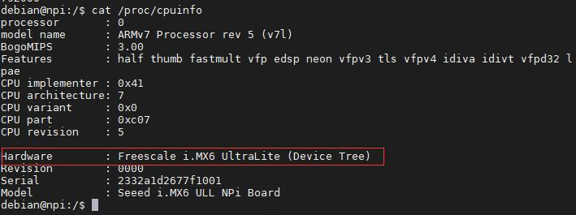

从上图可以看到，我们使用的硬件平台是飞思卡尔i.MX6 Ultralite，
是一款ARMv7架构的处理器（Cortex-A7内核是ARMv7架构的）。

查看内核版本
~~~~~~~~~~~~

/proc/version文件保存了内核的版本信息，我们可以通过如下命令来获取。

.. code-block:: sh
   :linenos:

   cat /proc/version

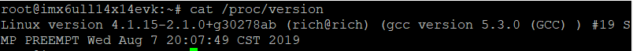

从上图中我们可以看到当前使用的内核版本是4.19.71。

也可以通过如下命令获取：

.. code-block:: sh
   :linenos:

   uname –a

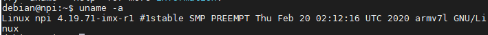

查看内存信息
~~~~~~~~~~~~~~~~~~

内核将内存的使用情况记录在/proc/meminfo文件中，我们可以通过读取该文件的内容，来了解我们内存的使用情况：

.. code-block:: sh
   :linenos:

   cat /proc/meminfo

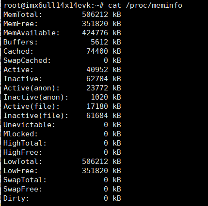

在实际应用中，我们一般都不会直接去读取该文件的内容，而是使用下面的命令来获取内存的相关信息。

通过free命令查看系统的内存大小：

.. code-block:: sh
   :linenos:

   free

如下图所示，输出信息共有三行，六列。其中第一行记录了我们的内
存使用情况，可以看到我们内存容量为491M（503508/1024），当前已
使用了99M，还剩下380M可用。shared表示表示的是多个进程共享的内存总
量，这里只占有了27668个字节；Buffers/cached表示当前磁盘缓存的大
小为31476个字节。

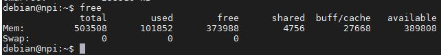

查看FLASH存储器容量
~~~~~~~~~~~~~~~~~~~~~~~

/proc/partitions文件包含了存储器的分区信息，查看分区信息可以了解板载FLASH存储器的容量。

可使用如下命令查看：

.. code-block:: sh
   :linenos:

   cat /proc/partitions

它输出的表示存储器Blocks的数量，对于本示例的开发板，Nand-FLASH的每个Block大小为1024Byte，eMMC则为512Byte。

Nand-Flash存储器版本
^^^^^^^^^^^^^^^^^^^^

下图是使用512MB Nand-FLASH开发板的命令输出信息。

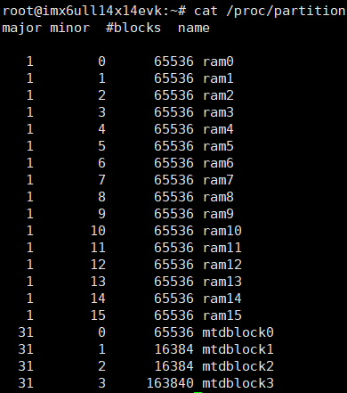

其中的mtdblock开头的都是属于Nand-FLASH存储器的数据块，
把它们所有的blocks加起来就可以算出容量(每个block大小为1024Byte)：

516096+8192 （Block）

= 524288*1024（Byte）

=524288*1024/1024/1024 （MByte）

=512 MByte

eMMC存储器版本
^^^^^^^^^^^^^^^

下图是使用8GB eMMC开发板的命令输出信息。

.. image:: media/system009.png
   :align: center

其中的mmcblk开头的都是属于eMMC存储器的数据块，把它们所有的Blocks加起来就可以算出容量（每个Block大小为512Byte）：

7634944+512000+7020544+512+4096+4096 （Block）

= 15176192*512（Byte）

=15176192*512/1024/1024/1024 （GByte）

=7.2 GByte

算出的最终结果比8GB小一点，这跟SD卡标称值比实际值小的原因一样，不要纠结。

查看任务进程
~~~~~~~~~~~~~~~~~~

在/proc文件夹下，有很多以数字命名的文件夹，这些文件夹是用来记录当前正在运行的进程状态，
文件名则是他们的pid号，每一个进程都对应一个pid号，用于辨识。这些进程文件夹中包含的内容，
基本上是大同小异的。使用ls命令，来查看pid为1的文件夹内容，如下图所示。其中，fd记录里当前进程使用的文件描述，
mountinfo记录了挂载信息，mem则记录了该进程的内存使用情况等。

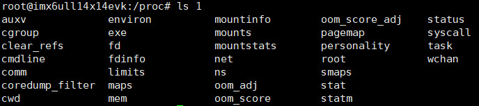

除了上面使用的这种方式，常用的还有top命令。该命令的功能类似于windows的任务管理器，
执行效果如上图所示，该命令可以会实时地更新每个进程的使用情况，按下“q”键或“Ctrl + C”，就可以退出该命令。

.. code-block:: sh
   :linenos:

   top

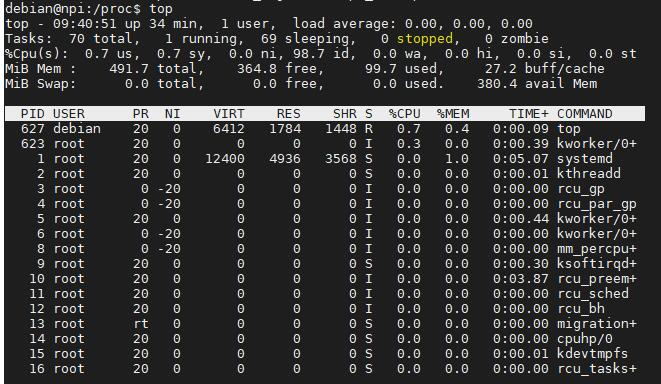

查看支持的文件系统
~~~~~~~~~~~~~~~~~~

/proc/filesystems可以用来查看内核支持的文件系统类型，如上图所示。图中有部分文件系统前带有“nodev”标志，
表示这些文件系统不需要挂载块设备，如网络文件系统nfs/nfs4，伪文件系统sysfs等。

.. code-block:: sh
   :linenos:

   cat /proc/filesystems

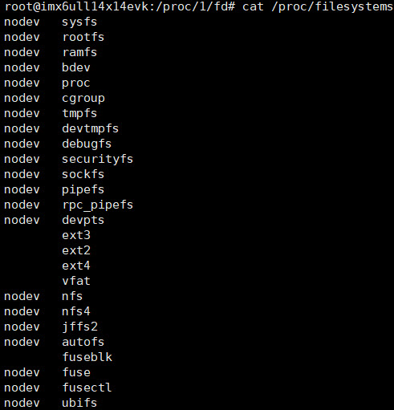

查看CPU当前主频
~~~~~~~~~~~~~~~~~~

除了/proc目录外，在/sys目录也可以查看一些系统相关的信息，
如文件/sys/devices/system/cpu/cpu0/cpufreq/cpuinfo_cur_freq包含了CPU当前的主频信息，
若系统存在该文件，可以把它的内容输出来查看：

.. code-block:: sh
   :linenos:

   cat /sys/devices/system/cpu/cpu0/cpufreq/cpuinfo_cur_freq

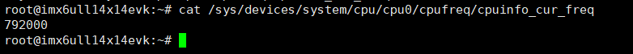

如上图中的输出，表示当前CPU主频为792MHz。

