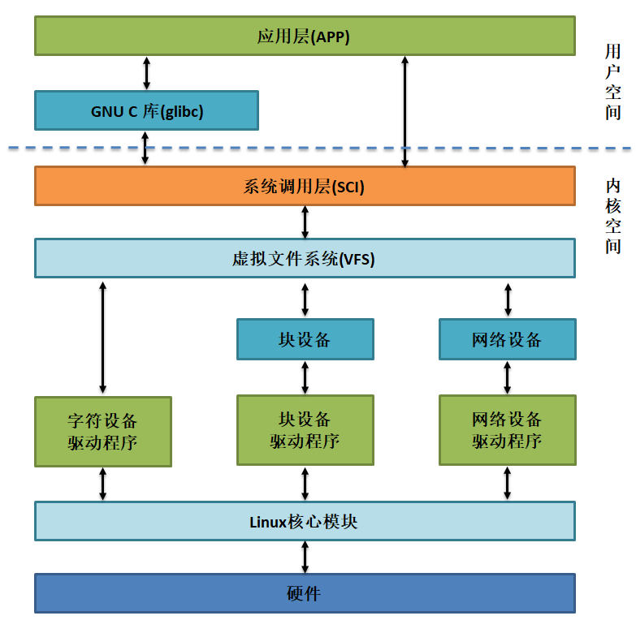

.. vim: syntax=rst

为什么学习Linux开发
------------------------

本章主要从Linux的应用场景，程序员的技能学习，职业方向来讨论为什么需要学习Linux开发并对如何学好Linux开发提出了一些建议。

Linux的应用场景
~~~~~~~~~~~~~~~~~~~~~~~~~~~~~~

对于一般用户来说，因为经常接触PC、手机，可能会知道Windows、iOS、Andorid系统，但对Linux系统却知之甚少，这是因为
Linux的应用场景主要是服务器和嵌入式设备，在直面消费者的桌面系统领域并不占据优势。不过，从某种程度来说，Android系统也属于Linux的一种，毕竟它是基于Linux内核进行开发的，只是由于它规避了Linux的开源协议，不被Linux社区接纳。

Linux的应用场景主要是由其特点决定的，其特点主要有：开源、安全、稳定、网络功能强大、支持多种不同平台的处理器。

服务器
^^^^^^^^^^^^^^^^^^^^^^^^^^^

服务器是指提供计算服务的设备，如网页服务器、文件服务器、数据库服务器、邮件服务器、域名服务器和代理服务器等。可以说我们在互联网上的所有操作，背后都是在跟服务器打交道。例如我们访问网页、网上购物、微信聊天、运行网络游戏、观看在线视频等一切需要联网才能正常进行的应用，其背后都由服务器作为支撑。

服务器的实体各种各样，小到单板电脑，大至计算机集群，实际上你正在使用的个人电脑，安装上对应的服务软件，通过网络给其它计算机提供资源，它也就变身成了一个服务器。服务器的本质也是计算机，只是通常来说它们没有显示器，不需要鼠标键盘。

在商业应用中，在服务器运行的操作系统主要有Linux、Windows和UNIX，其中由于Linux系统开源、使用成本低而且安全稳定，所以Linux在服务器使用的系统中占据了绝大多数。

感兴趣的读者可以访问Netcraft 网站 http://www.netcraft.com，可以查询到其它网站是运行在什么操作系统上的，具体见图 1‑1和图 1‑2。

图 1‑1 Netcraft网站输入要查询的网址

|whylea003|

图 1‑2 查询的网站使用的操作系统

可以查询到绝大部分知名网站都运行在Linux系统之上，包括微软官网：www.microsoft.com。而国内的一些银行官网则通常使用Windows Server系统。

特别地，超级计算机也是特殊的服务器，目前全球TOP500的计算机运行的操作系统都是Linux。

嵌入式设备
^^^^^^^^^^^^^^^^^

嵌入式设备是Linux系统的另一个主战场，这也是本书主要讲解的Linux应用方向。嵌入式设备的定义比较模糊，不过基本上把PC、集群服务器、超级计算机排除后，具有处理器（包括微控制器等）的，按设定程序运行的电子设备大都可以归类为嵌入式设备。

嵌入式设备种类非常丰富，包括日常生活中的手机、智能手表、各种家电、玩具、路由器、车载电子系统，工业应用中包括电力系统监控、环境监测、工业机器人、智能快递柜、手持POS机、地铁闸机系统、停车场管理、卫星、月球车等。

从嵌入式设备的种类就可以知道它们的应用场景是碎片化的，它们内部的电子系统一般会针对设备的功能做专用的控制。部分嵌入式设备不使用操作系统；部分使用freeRTOS等实时操作系统；而另一些高性能的嵌入式设备使用Linux系统。使用Linux系统的的嵌入式设备，往往是看中Linux系统的如下特性：

-  嵌入式设备使用的处理器多种多样，而Linux系统支持运行在x86、ARM、PowerPC、MIPS等不同平台的处理器上。

-  由于代码开源，可裁剪，非常适合针对特定场景进行定制，裁剪后的Linux内核加上文件系统可以做到50MB以内，这能够节省硬件资源和成本。

-  对各种编程语言、类库、编程框架支持良好，如python、java、C++等编程语言，Opencv、TensorFlow等类库和框架，使用freeRTOS等实时操作系统往往很难做到直接支持。

-  应用程序丰富，如音乐播放器、数据库等现成的应用可以直接使用。

-  网络功能强大，使得编写需要联网的应用程序非常方便。

Linux职业方向
~~~~~~~~~~~~~~~~~~

根据Linux的应用场景，社会对Linux技术人员主要分为服务器运维、应用软件开发及设备驱动开发方向。

服务器运维
^^^^^^^^^^^^^^^^^

服务器运维工程师主要是负责搭建起运行环境，让服务器应用程序更高效、稳定、安全地运行在服务器上。如安装操作系统、部署代码运行环境、修复漏洞、监控服务器压力、分析日志等。

应用软件开发
^^^^^^^^^^^^^^^^^^^^^^^^

Linux应用软件开发就是开发基于Linux系统的应用程序。具体而言，应用程序也分服务器、桌面和嵌入式方向，服务器方向如网站后台、数据库系统等。服务器方向的应用程序开发通常跟操作系统的关系并不是很大；桌面开发就如同开发Windows系统下的QQ、WPS、串口调试助手等应用程序；嵌入式方向的软件方向主
要是针对设备应用场景做针对性的开发，如扫地机器人、路由器的控制程序等。

设备驱动开发
^^^^^^^^^^^^^^^^^^^^^^^^

设备驱动，它的本质也是软件程序，不过它介于硬件与操作系统之间的层级，是硬件和操作系统之间的桥梁，具体见图 1‑3。

|whylea004|

图 1‑3 驱动程序在Linux系统中的位置

对于不使用操作系统或使用小型实时操作系统（如freeRTOS）的设备来说，与硬件相关的驱动程序与应用程序往往混合在一起，因此常常不会对驱动与应用进行严格的区分，这也导致更换硬件平台时，应用程序移植困难。

使用了Linux系统的设备，硬件会由操作系统接管。Linux系统的一个重要设计哲学是一切皆文件。包括硬件设备，对于系统来说也是一个文件，所以系统向上层应用程序提供open、write、read、close等统一的文件操作接口，应用程序可以利用这些接口对设备文件进行访问，从而实现对硬件设备的初始化、写
入、读取以及关闭等操作。

当系统接收到应用程序的这些访问请求时，它会向下查询对应设备具体的操作函数，然后调用相应的函数处理请求，而这些针对不同设备具体的操作函数就是设备驱动程序。因此，设备驱动就是这样一种把硬件与操作系统连接在一起的程序，Linux系统会提供统一的格式，设备驱动开发工程师根据具体的设备按照系统格式要求实现相应
的设备操作函数。

本书主要针对嵌入式设备驱动开发的讲解，对于志在应用软件开发的工程师，也可通过本书的内容掌握Linux底层的相关知识，这对应用开发也是大有裨益。

程序员的宝库
~~~~~~~~~~~~~~~~~~~~~~~~~~~~~~

Linux可谓是公开的宝库，它是开源世界的代表作，它的内核源代码是完全公开的，只要你愿意沉浸其中，必定收获丰富。通过学习Linux开发，会熟悉命令行的使用；可以了解到操作系统原理；学习常用数据结构，如链表、红黑树、哈希表等；了解开源社区的文化，学习各自优秀的代码实现，如常用的C语言库libc等；熟悉
各种常用开发工具，如Git版本管理系统、GCC编译器。

并不是说从事传统MCU开发或Windows开发时不能学习到这些，只是这些内容往往被包装起来，要么直接无法追根溯源，要么隐藏起来了。但在进行Linux开发时，相关的内容是直接暴露给用户的，只要钻得够深，永远有惊喜等待着我们。例如，使用Keil或IAR开发时，我们不知道调用C语言库的printf函数后，
具体究竟执行了什么；点击编译按钮时，集成的工具又为我们处理了一些什么内容，这些我们都很难了解到。

对于长期从事MCU开发的程序员来说，学习Linux开发会让人感叹，原来代码的世界一直在这里等着我！

推荐书单
~~~~~~~~~~~~~~~~~~~~

-  《只是为了好玩》/《Just For Fun》，Linus的自传，通过它可了解Linux的发展史以及了解Linus其人的生活态度。

-  《奔跑吧Linux内核》，分上下两册，建议初学者仅学习上册。

-  《鸟哥的Linux私房菜》，该书主要针对Linux服务器运维人员，主要学习上册，了解Linux的日常应用。

-  野火《STM32库开发实战指南》，快速上手MCU开发并巩固C语言相关的知识。

-  野火《i.MX RT库开发实战指南》，i.MX 6ULL的外设与i.MX RT系列基本相同，可以通过它学习i.MX系列芯片的裸机开发进行过渡。

-  野火《RT-Thread内核实现与应用开发实战指南》和《FreeRTOS内核实现与应用开发实战指南》，针对嵌入式实时操作系统讲解，通过它们可掌握操作系统相关的概念。

