.. vim: syntax=rst

GDB调试利器
--------------

GDB简介
===============

在单片机开发中，KEIL、IAR、ADS1.2等集成开发环境下的调试工具对程序开发有很大的帮助，
尤其是出现各种疑难杂症的bug时，往往只能通过单步调试、堆栈查询、CPU寄存器查询、
甚至是反汇编来定位问题。同样的，在嵌入式Linux的开发环境下，也有能够实现类似功能的调试器，那就是GDB（GNU debugger）。
它是一个由GNU开源组织发布的，UNIX/LINUX操作系统下的、基于命令行的、功能强大的调试工具，
是嵌入式linux开发人员必不可少的工具。

GDB的使用
===============

安装gdb工具
~~~~~~~~~~~~~~~~~

在开发板中执行gdb安装命令:

.. code-block:: sh
   :linenos:

   sudo apt install gdb -y

如下图:

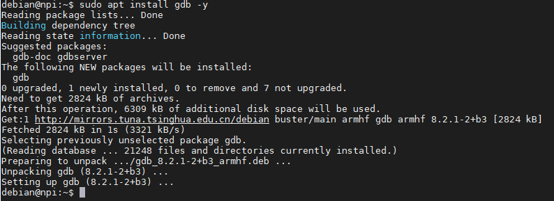

添加程序调试信息
~~~~~~~~~~~~~~~~

本章节示例代码在:embed_linux_tutorial/base_code/linux_debug/gdb_use/hello.c

把代码源文件通过NFS网络文件系统拷贝到开发板后，使用gcc进行编译，-g参数表示添加调试信息。

.. code-block:: sh
   :linenos:

   gcc -g hello.c -o hello

如下图:

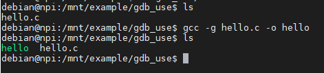

gdb启动应用程序
~~~~~~~~~~~~~~~~~~

开发板输入运行gdb开始调试命令：

.. code-block:: sh
   :linenos:

   gdb hello

如下图:

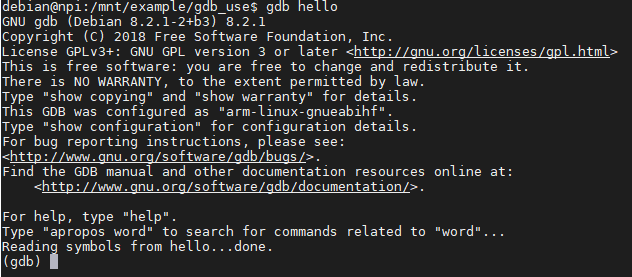

加-q参数，启动时不会打印gdb的默认信息，界面清爽干净些。

如下图:

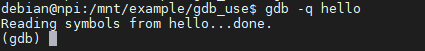

查看源码
~~~~~~~~~~

输入list(简写l)命令可以查看程序源代码，默认显示10行，通过回车键不断查看剩余代码。

如下图:

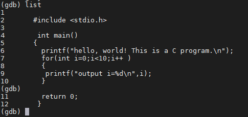

运行程序
~~~~~~~~~~

执行run(简写r)命令用于运行代码，在程序结束或者遇到断点处停下。

如下图:

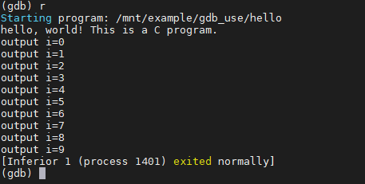

设置断点
~~~~~~~~~

运行break(简写b)命令可以在指定行设置一个断点，断点调试是程序调试里面使用频率最高的技巧，务必熟练掌握。

设置方法为“b”命令后加上相应的行号，在这里以在第6、7行设置断点为例：

.. image:: media/gdb_b.png
   :align: center
   :alt: 未找到图片

查看断点信息
~~~~~~~~~~~~~~~

设置好断点后，执行以下命令查看断点信息：

.. code-block:: sh
   :linenos:

   info b

如下图:

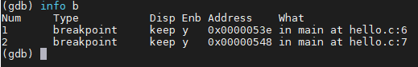

含义解释:

- NUM:断点编号  
- Disp：断点执行一次之后是否还有效（keep:有效 dis:无效）
- Enb:当前断点是否有效（y:有效 n:无效）     
- Address：内存地址

单步调试
~~~~~~~~~

- continue(简写c):继续执行，到下一个断点处(或运行结束)。
- next(简写n):单步执行，跳过子函数。
- strp(简写s)：单步执行，进入子函数。

示例:在第6行设置来断点后，先输入r指令让程序运行到断点处，然后执行n指令进行单步调试，
可以看到第6行的打印信息在单步执行后，输出“hello,world”打印信息。
如下图:

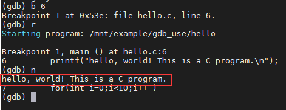

示例:在第6行设置来断点后，先输入r指令让程序运行到断点处，然后执行s指令进行单步调试，
可以看到程序已经进入到printf函数的内部中。继续执行c指令，可以让程序继续运行。

如下图:

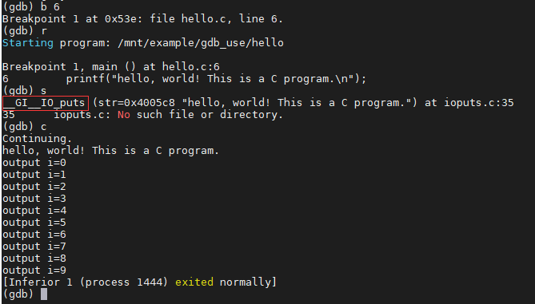

查看变量
~~~~~~~~~

使用print(简写p)指令可以查看变量的值，用法为print+变量名。

示例:在程序的第8行处设置断点，看i的值在for循环两次执行过程中的变化。

如下图:

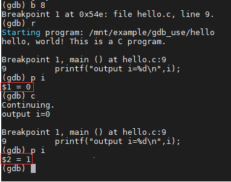

清除断点
~~~~~~~~~

使用clear指令可以删除某一行对应的断点，用法为clear+行号。

运行至函数结束
~~~~~~~~~

使用finish指令可以让程序运行到函数结束位置。

显示源代码窗口
~~~~~~~~~~~~~~~~~

程序运行以后，使用“layout src”命令可以显示源代码窗口,当前执行代码会高亮标志，单步调试非常方便。

如下图:

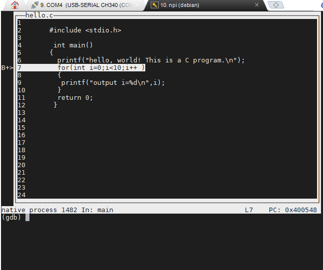

退出gdb
~~~~~~~~~~~~~~~

执行quit(简写q)会退出gdb调试，返回到控制台终端。

CGDB的使用
===============

cgbd是gdb的终端界面增强版，相比windows下的visual studio而言，
它的功能显得十分轻量级而没有太多繁杂，它有上下两栏窗口，上栏的窗口支持vi编辑器的语法，
可以方便的使用它来进行字符串定位等功能。在gdb下使用“layout src”时，界面往往容易花屏，
而cgbd更加的稳定可靠。

安装cgdb工具
~~~~~~~~~~~~~~~~~

在开发板中执行cgdb安装命令:

.. code-block:: sh
   :linenos:

   sudo apt install cgdb -y

如下图:

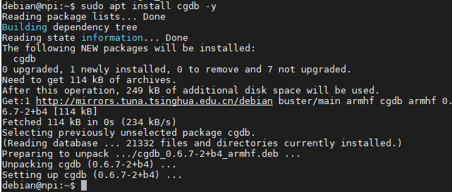

cgdb启动应用程序
~~~~~~~~~~~~~~~~~~

开发板输入运行gdb开始调试命令：

.. code-block:: sh
   :linenos:

   gdb hello

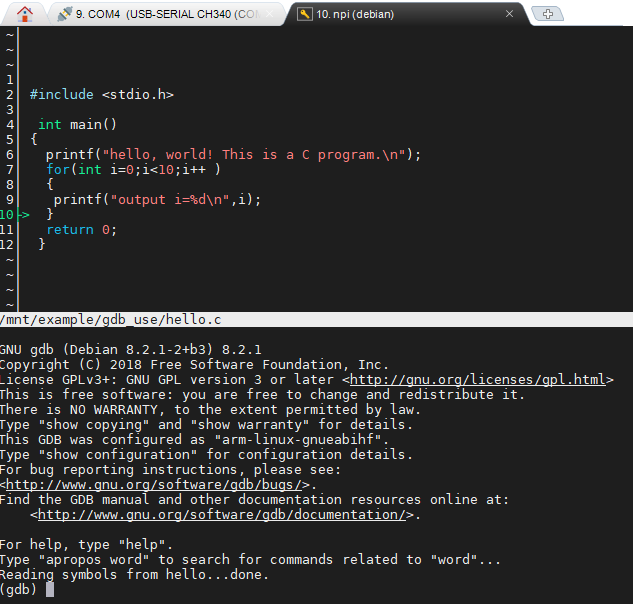

可以看到，cgbd默认启动显示源文件界面，而且颜色区分关键字和变量类型，十分美观。
它下面一栏是gdb窗口，可以直接使用上面介绍的gdb各种指令进行调试。
