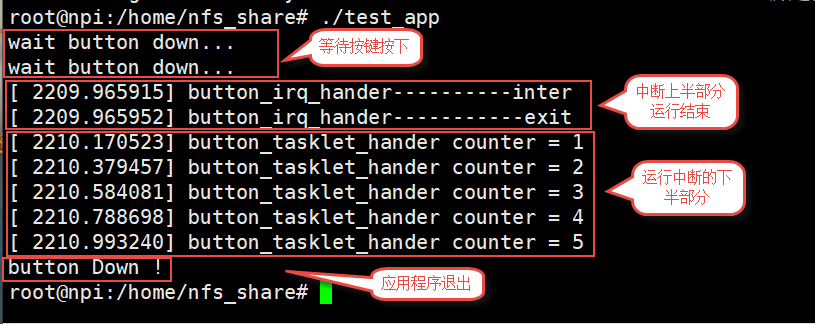

.. vim: syntax=rst

中断实验
-------

本章我们以按键为例讲解在驱动程序中如何使用中断，有关imx6ull中断的详细说明请参考本教程裸机部分的中断章节，
这里主要介绍在驱动中如何使用中断。

本章配套源码和设备树插件位于“**~/embed_linux_tutorial/base_code/button_interrupt**”目录下。

在设备树中添中断信息以及中断基本函数介绍
~~~~~~~~~~~~~~~~~~~~

想要在驱动中使用中断，我们应该先在设备树中添加中断相关信息以及了解中断相关操作函数。

设备树中的中断相关内容
^^^^^^^^^^^

在设备树中添加中断相关信息之前，我们先来了解下设备树中断相关部分的知识。

顶层中断控制器
'''''''

打开 **./arch/arm/boot/dts/** 目录下的 **imx6ull.dtsi** 设备树文件，
找到“interrupt-controller”节点，如下所示。

.. code-block:: c 
    :caption: 中断interrupt-controller节点
    :linenos:

    intc: interrupt-controller@a01000 {
    	compatible = "arm,cortex-a7-gic";
    	#interrupt-cells = <3>;
    	interrupt-controller;
    	reg = <0xa01000 0x1000>,
    	      <0xa02000 0x100>;
    };

- **compatible**：compatible属性用于平台设备驱动的匹配
- **reg**：reg指定中断控制器相关寄存器的地址及大小
- **interrupt-controller**：声明该设备树节点是一个中断控制器。
- **#interrupt-cells** ：指定它的“子”中断控制器用几个cells来描述一个中断，可理解为用几个参数来描述一个中断信息。
  在这里的意思是在intc节点的子节点将用3个参数来描述中断。

gpc一级子中断控制器
'''''''''''

在imx6ull.dtsi文件中直接搜索节点标签“intc”即可找到“一级子中断控制器”

.. code-block:: c 
    :caption: 一级子中断控制器
    :linenos:

    gpc: gpc@20dc000 {
    	compatible = "fsl,imx6ul-gpc", "fsl,imx6q-gpc";
    	reg = <0x20dc000 0x4000>;
    	interrupt-controller;
    	#interrupt-cells = <3>;
    	interrupts = <GIC_SPI 89 IRQ_TYPE_LEVEL_HIGH>;
    	interrupt-parent = <&intc>;
    	fsl,mf-mix-wakeup-irq = <0xfc00000 0x7d00 0x0 0x1400640>;
    };

结合以上代码介绍如下：（省略已经介绍过的部分属性）

- **interrupt-controller**：声明该设备树节点是一个中断控制器，只要是中断控制器都要用该标签声明。

- **#interrupt-cells**：用于规定该节点的“子”中断控制器将使用三个参数来描述子控制器的信息。

- **interrupt-parent**：指定该中断控制器的“父”中断控制器。除了“顶层中断控制器”其他中断控制器都要声明“父”中断控制器。

- **interrupts**：具体的中断描述信息，在该节点的中断控制器的“父"中断控制器，规定了使用三个cells来描述子控制器的信息。
  三个参数表示的含义如下：

第一个参数用于指定中断类型，有两种一种是PPI中断（CPU私有中断），共16个范围是[0-15]，
另外一种是SPI中断（共享中断），取值范围[0-987]，但是imx6ull共有128个SPI中断中断编号范围[32-159]。

第二个参数用于设定中断编号，范围和第一个参数有关。PPI中断范围是[0-15]，SPI中断范围是[0-987]。

第三个参数指定中断触发方式，参数是一个u32类型，其中后四位[0-3]用于设置中断触发类型。
每一位代表一个触发方式，可进行组合，系统提供了红顶义我么可直接使用，如下所示：

.. code-block:: c 
    :caption: 中断触发方式设置
    :linenos:

    #define IRQ_TYPE_NONE           0
    #define IRQ_TYPE_EDGE_RISING    1
    #define IRQ_TYPE_EDGE_FALLING   2
    #define IRQ_TYPE_EDGE_BOTH      (IRQ_TYPE_EDGE_FALLING | IRQ_TYPE_EDGE_RISING)
    #define IRQ_TYPE_LEVEL_HIGH     4
    #define IRQ_TYPE_LEVEL_LOW      8

[8-15]位在PPI中断中用于设置“CPU屏蔽”。在多核系统中这8位用于设置PPI中断发送到那个CPU,一位代表一个CPU,
为1则将PPI中断发送到CPU,否则屏蔽。imx6ull是单核CPU，所以我们不用设置这些位。

二级子中断控制器
''''''''

同样在imx6ull.dtsi文件中直接搜索节点标签“gpc”即可找到“二级子中断控制器”如下所示。

.. code-block:: c 
    :caption: 中断触发方式设置
    :linenos:

    soc {
    	#address-cells = <1>;
    	#size-cells = <1>;
    	compatible = "simple-bus";
    	interrupt-parent = <&gpc>; ------①
    	ranges;

        //busfreq子节点
	    busfreq {
            ................  //表示省略
        }
        ...............     //表示省略
    

该节点是 **soc** 节点，soc即片上外设“总节点”，翻阅源码可以发现该节点很长，我们使用的外设大多包含在里面。
具体外设（例如GPIO）也可作为中断控制器，这里声明了它们的“父”中断控制器。

soc节点内包的中断控制器很多，几乎用到中断的外设都是中断控制器，我们要使用的是开发板上的按键，
使用的是GPIO5_1,所以这里以GPIO5为例介绍。在imx6ull.dtsi文件中直接搜索GPIO5，找到GPIO5对应的设备树节点，如下所示。

.. code-block:: c 
    :caption: gpio5
    :linenos:

    gpio5: gpio@20ac000 {
    	compatible = "fsl,imx6ul-gpio", "fsl,imx35-gpio";
    	reg = <0x20ac000 0x4000>;
    	interrupts = <GIC_SPI 74 IRQ_TYPE_LEVEL_HIGH>,
    		     <GIC_SPI 75 IRQ_TYPE_LEVEL_HIGH>;
    	clocks = <&clks IMX6UL_CLK_GPIO5>;
    	gpio-controller;
    	#gpio-cells = <2>;
    	interrupt-controller;
    	#interrupt-cells = <2>;
    	gpio-ranges = <&iomuxc 0 7 10>, <&iomuxc 10 5 2>;
    };

pinctrl子系统和GPIO子系统相关部分的内容之前的章节已经讲过了，忘了的同学可以回顾下之前的章节，这里主要介绍和中断相关部分。

- **interrupts**：使用3个为一组的参数来描述gpio5的中断信息。

- **interrupt-controller**：声明该设备树节点是一个中断控制器

- **#interrupt-cells**：声明该节点的子节点用多少个参数来描述中断信息。

按键设备树节点
'''''''

以上三部分内容不需要我们修改，真正要我们写的是这部分内容，而这部分内容也非常简单，如下所示。

.. code-block:: c 
    :caption: button按键设备节点
    :linenos:

    button_interrupt {
    	compatible = "button_interrupt";
    	pinctrl-names = "default";
    	pinctrl-0 = <&pinctrl_button>;
    	button_gpio = <&gpio5 1 GPIO_ACTIVE_LOW>;  //默认低电平，按键按下高电平
    	status = "okay";
    	interrupt-parent = <&gpio5>;
    	interrupts = <1 IRQ_TYPE_EDGE_RISING>;     // 指定中断，触发方式为上升沿触发。
    };

这里主要介绍中断部分的内容

- **interrupt-parent**：指定“父控制器节点 ”。需要注意的是，该节点不是一个中断控制器所以没有“interrupt-controller”标签。
- **interrupts**：在“二级子中断控制器”即GPIO5节点中定义了“#interrupt-cells = <2>;”
  使用两个cells来指定使用GPIO组的第几个引脚以及中断的触发条件，触发方式宏定义如下

.. code-block:: c 
    :caption: 中断触发类型设置
    :linenos:

    #define IRQ_TYPE_NONE           0
    #define IRQ_TYPE_EDGE_RISING    1
    #define IRQ_TYPE_EDGE_FALLING   2
    #define IRQ_TYPE_EDGE_BOTH      (IRQ_TYPE_EDGE_FALLING | IRQ_TYPE_EDGE_RISING)
    #define IRQ_TYPE_LEVEL_HIGH     4
    #define IRQ_TYPE_LEVEL_LOW      8

中断相关函数
^^^^^^^^^^^

内核提供了一组操作中断的函数，在驱动中我们将会使用这些函数完成中断驱动实验，这些函使用很简单介绍如下：

中断申请和注销函数
'''''''''''

中断由内核统一管理，使用之前要申请，不用时（例如驱动退出）注销，如果不注销再次申请时会出错。函数原型如下

.. code-block:: c 
    :caption: 申请中断
    :linenos:

    static inline int __must_check request_irq(unsigned int irq, irq_handler_t handler, unsigned long flags, const char *name, void *dev)

    void free_irq(unsigned int, void *dev);

**参数**：

- **irq**：用于指定“内核中断号”，这个参数我们会从设别树中获取、转换得到。在内核空间中它代表一个唯一的中断。
- **handler**：用于指定中断处理函数，中断发生后跳转到该函数去执行。

- **flags**：中断触发条件，也就是我们常说的上升沿触发、下降沿触发等等，与stm32类似，触发方式可以通过“|”运算组合，完成定义如下所示：

.. code-block:: c 
    :caption: 中断触发方式
    :linenos:

    #define IRQF_TRIGGER_NONE	    0x00000000
    #define IRQF_TRIGGER_RISING	    0x00000001
    #define IRQF_TRIGGER_FALLING	0x00000002
    #define IRQF_TRIGGER_HIGH	    0x00000004
    #define IRQF_TRIGGER_LOW	    0x00000008
    #define IRQF_TRIGGER_MASK	    (IRQF_TRIGGER_HIGH | IRQF_TRIGGER_LOW | \
    				    IRQF_TRIGGER_RISING | IRQF_TRIGGER_FALLING)
    #define IRQF_TRIGGER_PROBE	    0x00000010
    
    #define IRQF_SHARED		0x00000080 ---------①
    /*-----------以下宏定义省略------------*/

- **name**：中断的名字，中断申请成功后会在“/proc/interrupts”目录下看到对应的文件。这个名字我们暂时用不到，名字设置能反应中断功能即可。
- **dev**：这个参数针对共享中断，先说一下如何指定为共享中断，如上代码（宏定义）所示，**IRQF_SHARED** 宏的作用就是开启共享中断。
  这里的“共享中断”指的是多个驱动程序共用同一个中断。如果使用了共享中断，中断发生后内核会依次调用这些驱动的“中断服务函数”，没错！是全部执行。
  这样我们就要在中断服务函数中判断中断是否来自本驱动，我们可以用dev参数带回的硬件信息来判断（不建议使用dev参数本身作为判断依据，我们没有测试），
  或者不使用dev,像单片机那样直接读取相应中断状态寄存器来判断。即使不用dev参数判断中断来自哪个驱动，在申请中断时也要加上dev参数
  因为在注销驱动时内核会根据dev参数决定删除哪个中断服务函数。

注意，这里的设置会覆盖设备树中的设置。

**返回值**：

- **成功**：返回0
- **失败**：返回负数。

驱动注销函数很简单，两个参数的作用和注册驱动函数相同。

中断处理函数
''''''

在申请中断时要指定一个中断处理函数，函数书写格式如下所示。

.. code-block:: c 
    :caption: 中断服务函数格式
    :linenos:

    irqreturn_t (*irq_handler_t)(int irq, void * dev);

**参数**：

- **irq**：用于指定“内核中断号”。
- **dev**：在共享中断中，用来判断中断产生的驱动是哪个，具体介绍同上中断注册函数。
  不同的是dev参数是内核“带回”的。如果使用了共享中断还得根据dev带回的硬件信息判断中断是否来自本驱动，或者不使用dev,
  直接读取硬件寄存器判断中断是否来自本驱动。如果不是，应当立即跳出中断服务函数，是，则正常执行中断服务函数。

**返回值**：

- **irqreturn_t类型**：可以发现它是一个枚举类型，如下所示。

.. code-block:: c 
    :caption: 中断服务函数返回值类型
    :linenos:

    enum irqreturn {
    	IRQ_NONE		= (0 << 0),
    	IRQ_HANDLED		= (1 << 0),
    	IRQ_WAKE_THREAD		= (1 << 1),
    };
    
    typedef enum irqreturn irqreturn_t;

如果是“共享中断”并且在中断服务函数中发现中断不是来自本驱动则应当返回IRQ_NONE，表示“中断不来自这个驱动，我不处理”。
如果没有开启共享中断或者开启了并且中断来自本驱动则返回IRQ_HANDLED，表示中断请求已经被正常处理了。
第三个参数涉及到我们后面会讲到的中断服务函数的“上半部分”和“下半部分”，如果在中断服务函数是使用“上半部分”和“下半部分”实现，则应当返回IRQ_WAKE_THREAD。

中断的使能和禁用函数
''''''''''

通过函数使能、禁用某一个中断。

.. code-block:: c 
    :caption: 中断的使能和禁用函数
    :linenos:

    void enable_irq(unsigned int irq)
    void disable_irq(unsigned int irq)

**参数**：

- **irq**：指定的“内核中断号”

**返回值**：**无**

关闭和开启全局中断相关函数（宏定义）
''''''''''''''''''

.. code-block:: c 
    :caption: 关闭和开启全局中断相关函数
    :linenos:

    local_irq_enable()
    local_irq_disable()
    local_irq_save(flags)
    local_irq_restore(flags)

由于“全局中断”的特殊性，通常情况下载关闭之前要使用local_irq_save保存当前中断状态，
开启之后使用local_irq_restore宏恢复关闭之前的状态。flags是一个unsigned long 类型的数据。
宏定义使用很简单，不再过多说明。

了解了以上函数的使用，就可以编写中断驱动。遗漏的内容我们将会在代码里介绍，驱动程序介绍如下。

按键中断程序实现
~~~~~~~~

和我们之前讲过的驱动类似，分三步，编写设备树插件、编写驱动程序、编写简单测试应用程序。结合源码介绍如下。

设备树插件实现
^^^^^^^

按键的设备实际就是个GPIO加上了一个中断，用到了GPIO子系统相关内容，如果遗忘可以参考“pinctrl子系统和GPIO子系统”章节。如何添加中断信息也在本章的第一小节介绍了，这里只结合源码简单说明，源码如下所示：

.. code-block:: c 
    :caption: 设备树插件
    :linenos:

    /dts-v1/;
    /plugin/;
    /*-------------------第一部分-----------------*/
    #include "imx6ul-pinfunc.h"
    #include "./dt-bindings/interrupt-controller/irq.h"
    #include "./dt-bindings/gpio/gpio.h"
    
    
    /*-------------------第二部分-----------------*/
     / {
         fragment@0 {
              target-path = "/";          ---------------------------①
             __overlay__ { 
                button_interrupt {
                	compatible = "button_interrupt";  
                	pinctrl-names = "default";
                	pinctrl-0 = <&pinctrl_button>;
                	button_gpio = <&gpio5 1 GPIO_ACTIVE_LOW>; -------②    
                	status = "okay";            
                	interrupt-parent = <&gpio5>;              -------③
                	interrupts = <1 IRQ_TYPE_EDGE_RISING>;    -------④
                };   
             };
         };
    
    /*-------------------第三部分-----------------*/
         fragment@1 {
             target = <&iomuxc>;
             __overlay__ { 
            pinctrl_button: buttongrp {
    				fsl,pins = <
    					MX6UL_PAD_SNVS_TAMPER1__GPIO5_IO01  0x10b0
    				>;
    			};
             };
         };
     };

学到这里对设备树已经比较熟悉了，简单介绍如下，第一部分，在设备树插件中用了几个宏定义，所以这里包含相应头文件，
直接使用宏原来的数值可省略相应头文件。第二部分，新增的button_interrupt节点，标号①，指定设备节点插入位置，这里是根节点。
标号②这是GPIO子系统的内容，定义button使用的GPIO。
标号③、标号④处是中断相关内容在讲解“在设备树中添加中断信息”已经介绍，这里不再赘述。

按键中断驱动程序实现
^^^^^^^^^^

按键中断驱动程序基于字符设备编写，字符设备在之前的驱动程序中已经多次使用，这里不再介绍有关字符设备的内容重点放在中断驱动程序实现。为节省篇幅这里的代码不完整，完整代码请参考本章配套例程。驱动源码位于“补充”。

虽然使用了设备树（设备树插件）但是驱动程序是一个简单的字符设备驱动，不会和设备树中的节点匹配。无论是否匹配与我们“读设备树”无关，驱动源码大致分为驱动入口和出口函数实现、字符设备操作函数集实现两部分内容，结合源码介绍如下：

驱动入口和出口函数实现
'''''''''''

在驱动的入口函数中实现字符设备的注册， 在出口函数中注销字符设备，部分代码如下所示：

.. code-block:: c 
    :caption: 驱动入口和出口函数实现
    :linenos:

     /*
    *驱动初始化函数
    */
    static int __init button_driver_init(void)
    {
    	int error = -1;
    	/*采用动态分配的方式，获取设备编号，次设备号为0，*/
    	error = alloc_chrdev_region(&button_devno, 0, DEV_CNT, DEV_NAME);
    	if (error < 0)
    	{
    		printk("fail to alloc button_devno\n");
    		goto alloc_err;
    	}
    	/*关联字符设备结构体cdev与文件操作结构体file_operations*/
    	button_chr_dev.owner = THIS_MODULE;
    	cdev_init(&button_chr_dev, &button_chr_dev_fops);
    
    	/*添加设备至cdev_map散列表中*/ 
    	/*------------一下代码省略---------------*/
    }
    
    /*
    *驱动注销函数
    */
    static void __exit button_driver_exit(void)
    {
    	pr_info("button_driver_exit\n");
    	/*删除设备*/
    	device_destroy(class_button, button_devno);		   //清除设备
    	class_destroy(class_button);					   //清除类
    	cdev_del(&button_chr_dev);					       //清除设备号
    	unregister_chrdev_region(button_devno, DEV_CNT);   //取消注册字符设备
    }
    
    module_init(button_driver_init);
    module_exit(button_driver_exit);
    
    MODULE_LICENSE("GPL");

字符设备注册于注销已经使用n次了，为方便阅读这里还是把它的部分代码列出来了。完成的内容请参考本小节配套代码。

.open函数实现
'''''''''

open函数实现button的初始化工作，代码如下：

.. code-block:: c 
    :caption: open函数实现
    :linenos:

    static int button_open(struct inode *inode, struct file *filp)
    {
    	int error = -1;
    	
    	
    	/*添加初始化代码*/
    	// printk_green("button_open");
    
    	/*获取按键 设备树节点*/
    	button_device_node = of_find_node_by_path("/button_interrupt");   ------------------①
    	if(NULL == button_device_node)
    	{
    		printk("of_find_node_by_path error!");
    		return -1;
    	}
    
    	/*获取按键使用的GPIO*/
    	button_GPIO_number = of_get_named_gpio(button_device_node ,"button_gpio", 0);-------②
    	if(0 == button_GPIO_number)
    	{
    		printk("of_get_named_gpio error");
    		return -1;
    	}
    
    	/*申请GPIO  , 记得释放*/
    	error = gpio_request(button_GPIO_number, "button_gpio"); -------------------------③
    	if(error < 0)
    	{
    		printk("gpio_request error");
    		gpio_free(button_GPIO_number);
    		return -1;
    	}
    
    	error = gpio_direction_input(button_GPIO_number); ------------------------------④
    
    	/*获取中断号*/
    	interrupt_number = irq_of_parse_and_map(button_device_node, 0);   -------------⑤
    	printk("\n irq_of_parse_and_map! =  %d \n",interrupt_number);
    
    	/*申请中断, 记得释放*/
    	error = request_irq(interrupt_number,button_irq_hander,IRQF_TRIGGER_RISING,"button_interrupt",device_button); ---------------⑥
    	if(error != 0)
    	{
    		printk("request_irq error");
    		free_irq(interrupt_number, device_button);
    		return -1;
    	}
    
    	/*申请之后已经开启了，切记不要再次打开，否则运行时报错*/
    	// // enable_irq(interrupt_number);
    
    	return 0;
    }

忽略函数的错误检查代码，函数中只用了六个主要函数其中只有两个是我们之前章节没有介绍的，结合源码介绍如下：

标号①，获取button的设备树节点，我们之前说过，虽然没有和设备树节点匹配，这不影响我们获取设备树节点，只要节点路径正确我们也可以获取其他设备树节点。

标号②，获取使用的GPIO。这里可参考“GPIO子系统章节”。

标号③，根据之前介绍，GPIO作为一种资源，使用之前要“获取”不使用时要及时释放，所以这里获取GPIO，退出时还要记得释放。

标号④，设置GPIO为输入模式。

标号⑤，函数irq_of_parse_and_map解析并映射（map）中断函数。函数原型如下：

.. code-block:: c 
    :caption: 解析并映射中断函数
    :linenos:

    unsigned int irq_of_parse_and_map(struct device_node *dev, int index)

该函数的功能是从设备树中获取某一个中断，并且将中断ID转化为linux内核虚拟IRQ number 我们后面简称为kernel aiq
number或“内核中断号”，“内核中断号”是自己起的名字，用于区别中断ID。至于设备树中设置的中断ID时如何转化为“内核中断号”的，我们现阶段不关心，重点是知道irq_of_parse_and_map如何使用以及转换是否成功。

参数dev用于指定设备节点，在这里就是我们标号①函数得到的设备节点，参数index指定解析、映射第几个中断，一个设备树节点可能包含多个中断，这里指定第几个，标号从0开始。成功返回解析、映射得到的内核中断号，失败返回0。

标号⑥，申请中断，这个函数在本章的开始已经介绍，需要注意的是，这里虽然没有使用共享中断，但是仍然将dev参数设置为字符设备结构体指针。当然你也可以设置为NULL或其他值。

中断服务函数实现
''''''''

在open函数申请中断时要指定中断服务函数，一个简答的中断服务函数如下。

.. code-block:: c 
    :caption: 中断服务函数实现
    :linenos:

    atomic_t   button_status = ATOMIC_INIT(0);  //定义整型原子变量，保存按键状态 ，设置初始值为0
    static irqreturn_t button_irq_hander(int irq, void *dev_id)
    {
    	// printk("button on \n");
    	/*按键状态加一*/
    	atomic_inc(&button_status);
    	return IRQ_HANDLED；
    }

从以上代码可以看到我们定义了一个整型原子变量用于保存按键状态，中断发送后，整型原子变量自增一。整型原子变量大于0表示有按键按下。

.read和.release函数实现
''''''''''''''''''

.read函数的工作是向用户空间返回按键状态值，.release函数实现退出之前的清理工作。函数实现源码如下：

.. code-block:: c 
    :caption: .read 和.release函数实现
    :linenos:

    static int button_read(struct file *filp, char __user *buf, size_t cnt, loff_t *offt)
    {
    	int error = -1;
    	int button_countervc = 0;
    
    	/*读取按键状态值*/
    	button_countervc = atomic_read(&button_status);
    
    	/*结果拷贝到用户空间*/
    	error = copy_to_user(buf, &button_countervc, sizeof(button_countervc));
    	if(error < 0)
    	{
    		printk_red("copy_to_user error");
    		return -1;
    	}
    
    	/*清零按键状态值*/
    	atomic_set(&button_status,0);
    	return 0;
    }
    
    /*字符设备操作函数集，.release函数实现*/
    static int button_release(struct inode *inode, struct file *filp)
    {
    	/*释放申请的引脚,和中断*/
    	gpio_free(button_GPIO_number);
    	free_irq(interrupt_number, device_button);
    	return 0;
    }

可以看到在button_read函数中我们读取按键状态值，然后使用copy_to_user拷贝到用户空间，最后设置按键状态为0。button_release函数更简单，它只是释放.open函数中申请的中断和GPIO.

测试应用程序实现
^^^^^^^^

测试应用程序工作是读取按键状态然后打印状态，就这么简单，源码如下：

.. code-block:: c 
    :caption: 测试应用程序
    :linenos:

    #include <stdio.h>
    #include <unistd.h>
    #include <fcntl.h>
    #include <string.h>
    #include <stdlib.h>
    #include "test_app.h"
    
    int main(int argc, char *argv[])
    {
        int error = -20;
        int button_status = 0;
    
        /*打开文件*/
        int fd = open("/dev/button", O_RDWR);
        if (fd < 0)
        {
            printf("open file : /dev/button error!\n");
            return -1;
        }
    
        printf("wait button down... \n");
        printf("wait button down... \n");
    
        do
        {
            /*读取按键状态*/
            error = read(fd, &button_status, sizeof(button_status));
            if (error < 0)
            {
                printf("read file error! \n");
            }
            usleep(1000 * 100); //延时100毫秒
        } while (0 == button_status);
        printf("button Down !\n");
    
        /*关闭文件*/
        error = close(fd);
        if (error < 0)
        {
            printf("close file error! \n");
        }
        return 0;
    }

测试应用程序仅仅是测试驱动是否正常，我们只需要打开、读取状态、关闭文件即可。需要注意的是打开之后需要关闭才能再次打开，如果连续打开两次由于第一次打开申请的GPIO和中断还没有释放打开会失败。

中断的上半部分和下半部分
~~~~~~~~~~~~

在linux 系统中引入了中断的“上半部分”和“下半部分”的概念又被称为中断分层。“上半部分”是指在中断服务函数中执行的那部分代码，“下半部分”是指那些原本应当在中断服务函数中执行但通过某种方式把它们放到中断服务函数外执行。把中断服务函数划分为“上半部分”和下半部分的好处是减少中断服务函数执行时间，
在写STM32程序时我们也要求尽量缩短中断服务函数执行时间。这用做的好处是减少中断响应时间，提高系统的实时性。

上一小节我们编写的按键中断实验足够简单，不必使用中断分层。为了学习如何使用中断分层，这里模拟一个耗时操作，强行加上中断分层。

中断分层实现方法常用的有三种，分别为软中断、tasklet、和工作队列，下面分别介绍这三种方式。

软中断和tasklet
^^^^^^^^^^^

tasklet是基于软中断实现，它们有很多相似之处，我们把它两个放到一块介绍。

软中断
'''

软中断由软件发送中断指令产生，Linux4.xx支持的软中断非常有限，只有10个（不同版本的内核可能不同）在Linux内核中使用一个枚举变量列出所有可用的软中断，如下所示。

.. code-block:: c 
    :caption: 软中断中断编号
    :linenos:

    enum
    {
    	HI_SOFTIRQ=0,
    	TIMER_SOFTIRQ,
    	NET_TX_SOFTIRQ,
    	NET_RX_SOFTIRQ,
    	BLOCK_SOFTIRQ,
    	BLOCK_IOPOLL_SOFTIRQ,
    	TASKLET_SOFTIRQ,
    	SCHED_SOFTIRQ,
    	HRTIMER_SOFTIRQ,
    	RCU_SOFTIRQ,    /* Preferable RCU should always be the last softirq */
    
    	NR_SOFTIRQS
    };

类比硬中断，这个枚举类型列出了软中断的中断编号，我们“注册”软中断以及触发软中断都会用到软中断的中断编号。

软中断“注册”函数如下所示：

.. code-block:: c 
    :caption: 注册软中断函数
    :linenos:

    void open_softirq(int nr, void (*action)(struct softirq_action *))
    {
    	softirq_vec[nr].action = action;
    }

**参数**：

- **nr**:用于指定要“注册”的软中断中断编号，参数action是一个函数指针类型的数据，指定软中断的中断服务函数。

**返回值**：**无**

我们再看函数实现，这里只有一个赋值语句，重点是softirq_vec变量，在内核源码中找到这个变量如下所示：

.. code-block:: c 
    :caption: 软中断“中断向量表”
    :linenos:

    static struct softirq_action softirq_vec[NR_SOFTIRQS]

这是一个长度为NR_SOFTIRQS的softirq_action类型数组，长度NR_SOFTIRQS在软中断的“中断编号”枚举类型中有定义，长度为10。这个数组是一个全局的数组，作用等同于硬中断的中断向量表。接着来看数组的类型“struct softirq_action”如下所示。

.. code-block:: c 
    :caption:  软中断结构体
    :linenos:

    struct softirq_action
    {
    	void	(*action)(struct softirq_action *);
    };

它只有一个参数，就是注册软中断函数的参数open_softirq。至此我们知道数组softirq_vec就是软中断的中断向量表，
所谓的注册软中断函数就是根据中断号将中断服务函数的地址写入softirq_vec数组的对应位置。

软中断注册之后还要调用“触发”函数触发软中断，进而执行软中断中断服务函数，函数如下所示：

.. code-block:: c 
    :caption: 中断interrupt-controller节点
    :linenos:

    void raise_softirq(unsigned int nr);

**参数**：

- **nr**：要触发的软中断。

**返回值**：**无**

tasklet
'''''''

tasklet是基于软中断实现，如果对效率没有特殊要求推荐是用tasklet实现中断分层。为什么这么说，根据之前讲解软中断的中断服务函数是一个全局的数组，
在多CPU系统中，所有CPU都可以访问，所以在多CPU系统中需要用户自己考虑并发、可重入等问题，增加编程负担。
软中断资源非常有限一些软中断是为特定的外设准备的（不是说只能用于特定外设）例如“NET_TX_SOFTIRQ,NET_RX_SOFTIRQ,”
从名字可以看出它们用于网络的TX和RX。像网络这种对效率要求较高的场合还是会使用软中断实现中断分层的。

相比软中断tasklet使用起来更简单，最重要的一点是在多CPU系统中同一时间只有一个CPU运行tasklet，所以并发、可重入问题就变得很容易处理（一个tasklet甚至不用去考虑）。而且使用时也比较简单，介绍如下。

tasklet_struct结构体

在驱动中使用tasklet_struct结构体表示一个tasklet，结构体定义如下所示：

.. code-block:: c 
    :caption: 触发软中断
    :linenos:

    struct tasklet_struct
    {
    	struct tasklet_struct *next;
    	unsigned long state;
    	atomic_t count;
    	void (*func)(unsigned long);
    	unsigned long data;
    };

参数介绍如下：

- **next**：指向链表的下一个tasklet_struct，这个参数我们不需要自己去配置。
- **state**：保存tasklet状态，等于0表示tasklet还没有被调度，等于TASKLET_STATE_SCHED表示tasklet被调度正准备运行。等于TASKLET_STATE_RUN表示正在运行。
- **count**：引用计数器，如果为0表示tasklet可用否则表示tasklet被禁止。
- **func**：指定tasklet处理函数
- **data**：指定tasklet处理函数的参数。

tasklet初始化函数

函数原型如下：

.. code-block:: c 
    :caption: tasklet初始化函数
    :linenos:

    void tasklet_init(struct tasklet_struct *t,void (*func)(unsigned long), unsigned long data)
    {
    	t->next = NULL;
    	t->state = 0;
    	atomic_set(&t->count, 0);
    	t->func = func;
    	t->data = data;
    }

- **t**：指定要初始化的tasklet_struct结构体
- **func**：指定tasklet处理函数，等同于中断中的中断服务函数
- **data**：指定tasklet处理函数的参数。函数实现就是根据设置的参数填充tasklet_struct结构体结构体。

触发tasklet

和软中断一样，需要一个触发函数触发tasklet，函数定义如下所示：

.. code-block:: c 
    :caption: tasklet触发函数
    :linenos:

    static inline void tasklet_schedule(struct tasklet_struct *t)
    {
    	if (!test_and_set_bit(TASKLET_STATE_SCHED, &t->state))
    		__tasklet_schedule(t);
    }

**参数**：

- **t**：tasklet_struct结构体。

tasklet实现中断分层实验
'''''''''''''''

实验在按键中断程序基础上完成，按键中断原本不需要使用中断分层，这里只是以它为例简单介绍tasklet的具体使用方法。
tasklet使用非常简单，主要包括定义tasklet结构体、初始化定义的tasklet结构体、实现tasklet中断处理函数、触发tasklet中断。

下面结合源码介绍如下。注意，源码是在“按键中断程序”基础上添加tasklet相关代码，这里只列出了tasklet相关代码。

.. code-block:: c 
    :caption: tasklet相关代码
    :linenos:

    /*--------------第一部分--------------- */
    struct tasklet_struct button_tasklet;  //定义全局tasklet_struct类型结构体
    
    /*--------------第二部分-----------------*/
    void button_tasklet_hander(unsigned long data)
    {
    	int counter = 1;
    	mdelay(200);
    	printk(KERN_ERR "button_tasklet_hander counter = %d  \n", counter++);
    	mdelay(200);
    	printk(KERN_ERR "button_tasklet_hander counter = %d  \n", counter++);
    	mdelay(200);
    	printk(KERN_ERR "button_tasklet_hander counter = %d  \n", counter++);
    	mdelay(200);
    	printk(KERN_ERR "button_tasklet_hander counter = %d \n", counter++);
    	mdelay(200);
    	printk(KERN_ERR "button_tasklet_hander counter = %d \n", counter++);
    }
    
    /*--------------第三部分-----------------*/
    static int button_open(struct inode *inode, struct file *filp)
    {
    	/*----------------以上代码省略----------------*/
    	/*初始化button_tasklet*/
    	tasklet_init(&button_tasklet,button_tasklet_hander,0);
    
    	/*申请之后已经开启了，切记不要再次打开，否则运行时报错*/
    	// // enable_irq(interrupt_number);
    
    	return 0;
    }
    
    /*--------------第四部分-----------------*/
    static irqreturn_t button_irq_hander(int irq, void *dev_id)
    {
    	printk(KERN_ERR "button_irq_hander----------inter");
    	/*按键状态加一*/
    	atomic_inc(&button_status);
    
    	tasklet_schedule(&button_tasklet);
    
    	printk(KERN_ERR "button_irq_hander-----------exit");
    	return IRQ_RETVAL(IRQ_HANDLED);
    }

结合代码各部分介绍如下：

第一部分，定义tasklet_struct类型结构体。

第二部分，定义tasklet的“中断服务函数”可以看到我们在tasklet的中断服务函数中使用延时和printk语句模拟一个耗时的操作。

第三部分, 在.open函数中调用tasklet_init函数初始化第一步定义的tasklet_struct类型结构体。

第四部分，在中断服务函数中调用tasklet_schedule函数触发tasklet中断。在按键中断服务函数中的开始处和结束处添加打印语句，正常情况下程序会先执行按键中断的中短发服务函数，退出中断服务函数后再执行中断的下半部分，既tasklet的“中断服务函数”。

下载验证
''''

本实验在在按键中断驱动程序基础上修改，实验方法与按键中断程序相同，测试应用程序以及设备树插件不用修改。

将修改后的驱动程序编译、下载到开发板，加载驱动然后运行测试应用程序如下所示。

工作队列
^^^^

与软中断和tasklet不同，工作队列运行在内核线程，允许被重新调度和睡眠。如果中断的下部分能够接受被重新调度和睡眠，推荐使用工作队列。

和tasklet类似，从使用角度讲主要包括定义工作结构体、初始化工作、触发工作。

工作结构体
'''''

“工作队列”是一个“队列”，但是对于用户来说不必关心“队列”以及队列工作的内核线程，这些内容由内核帮我们完成，我们只需要定义一个具体的工作、初始化工作即可，在驱动中一个工作结构体代表一个工作，工作结构体如下所示：

.. code-block:: c 
    :caption: work_struct结构体
    :linenos:

    struct work_struct {
    	atomic_long_t data;
    	struct list_head entry;
    	work_func_t func;
    #ifdef CONFIG_LOCKDEP
    	struct lockdep_map lockdep_map;
    #endif
    };

重点关心参数“work_func_t func;”该参数用于指定“工作”的处理函数。work_func_t如下所示。

.. code-block:: c 
    :caption: 工作函数
    :linenos:

    void (*work_func_t)(struct work_struct *work);

工作初始化函数
'''''''

内核提初始化宏定义如下所示。

.. code-block:: c 
    :caption: 工作初始化宏定义
    :linenos:

    #define INIT_WORK(_work, _func)

该红顶共有两个参数，_work用于指定要初始化的工作结构体，_func用于指定工作的处理函数。

启动工作函数
''''''

驱动工作函数执行后相应内核线程将会执行工作结构体指定的处理函数，驱动函数如下所示。

.. code-block:: c 
    :caption: 启动工作函数
    :linenos:

    static inline bool schedule_work(struct work_struct *work)
    {
    	return queue_work(system_wq, work);
    }

启动工作函数只有一个工作结构体参数。

工作队列实验
''''''

工作队列实验同样在按键中断程序基础上实现，这里只列出了工作队列相关代码，完整内容请参考本小节配套驱动程序。（这里只修改驱动程序，其他内容保持不变）

.. code-block:: c 
    :caption: 工作队列相关函数
    :linenos:

    /*--------------第一部分-----------------*/
    struct work_struct button_work;
    
    /*--------------第二部分-----------------*/
    void work_hander(struct work_struct  *work)
    {
    	int counter = 1;
    	mdelay(200);
    	printk(KERN_ERR "work_hander counter = %d  \n", counter++);
    	mdelay(200);
    	printk(KERN_ERR "work_hander counter = %d  \n", counter++);
    	mdelay(200);
    	printk(KERN_ERR "work_hander counter = %d  \n", counter++);
    	mdelay(200);
    	printk(KERN_ERR "work_hander counter = %d  \n", counter++);
    	mdelay(200);
    	printk(KERN_ERR "work_hander counter = %d  \n", counter++);
    }
    
    /*--------------第三部分-----------------*/
    static int button_open(struct inode *inode, struct file *filp)
    {
    	/*----------------以上代码省略----------------*/
    	/*初始化button_work*/
    	INIT_WORK(&button_work, work_hander);
    	return 0;
    }
    
    /*--------------第四部分-----------------*/
    static irqreturn_t button_irq_hander(int irq, void *dev_id)
    {
    	/*按键状态加一*/
    	atomic_inc(&button_status);
    	schedule_work(&button_work);
    	return IRQ_HANDLED;
    }

与tasklet实现中断分层类似，使用方法几乎一样，这里不再赘述。

.. |button002| image:: media\button002.png
   :width: 5.76806in
   :height: 2.29306in
