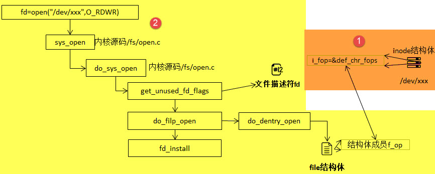
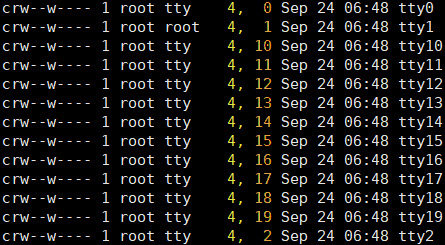
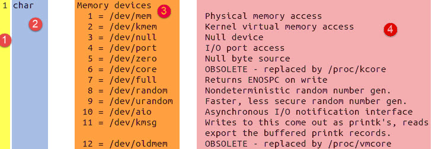
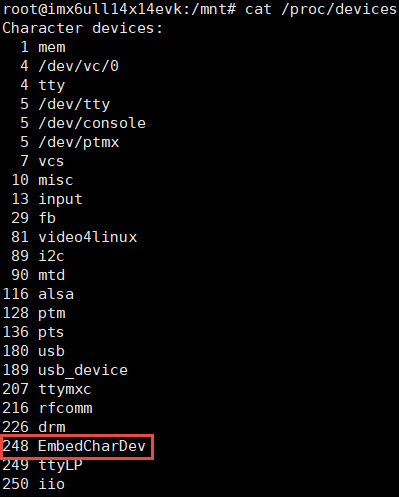
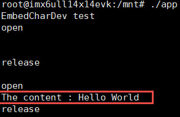
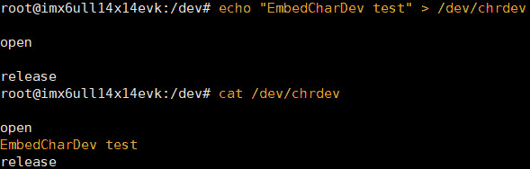
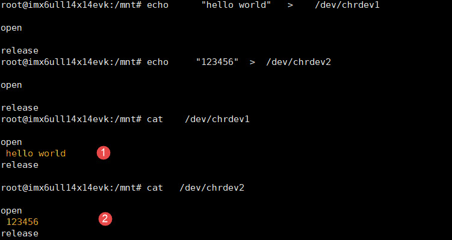
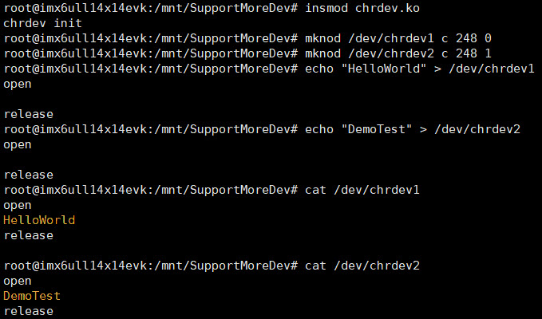

.. vim: syntax=rst

字符设备驱动
------------------------------------

本章节内容处于开发笔记状态，还待整理至最终版的教程。

本章节内容处于开发笔记状态，还待整理至最终版的教程。

本章，我们将学习如何编写一个字符设备驱动：

1. 介绍Linux设备分类，了解什么是字符设备、块设备以及网络设备；

2. 我们经常说"一切皆文件"，对于硬件设备，也是如此。那当我们打开
   设备文件时，到底做了什么东西。为什么我们对该文件进行读写可以操作
   我们的硬件呢。刚开始学习本节，可能会很懵圈。但是，当你学习完整章的
   内容之后，再回过头来看本节的内容，可以加深你对字符设备驱动的理解。

3. 介绍字符设备驱动相关的数据结构

4. 介绍字符设备驱动程序的基本框架，以后写字符设备驱动时，就可以根据这个模板进行填空了。

5. 自己写一个字符设备驱动

Linux设备
~~~~~~~~~~~~~~~~~~~~~~~~~~~~~~~~~~~

Linux中，根据设备的类型可以分为三类：字符设备、块设备和网络设备。

字符设备：应用程序按字节/字符来读写数据，通常不支持随机存取。我们常用的键盘、串口都是字符设备。

块设备：应用程序可以随机访问设备数据。典型的块设备有硬盘、SD卡、闪存等，应用程序
可以寻址磁盘上的任何位置，并由此读取数据。此外，数据的读写只能以块的倍数进行。

网络设备是一种特殊设备，它并不存在于/dev下面，主要用于网络数据的收发。

open函数到底做了什么
~~~~~~~~~~~~~~~~~~~~~~~~~~~~~~~~~~~~~~~~~~~~~~~~~~~~~~~~~~~~

在学习字符设备驱动之前，我们一起了解一下，使用open函数打开设备文件，到底做
了些什么工作？下图中列出了open函数执行的大致过程。

设备文件通常在开机启动时自动创建的，不过，我们仍然
可以使用命令mknod来创建一个新的设备文件，命令的基本语法如下：

mknod 设备名 设备类型 主设备号 次设备号

当我们使用上述命令，创建了一个字符设备文件时，实际上
就是创建了一个设备节点inode结构体，并且将该设备的设备编号记录在
成员i_rdev，将成员f_op指针指向了def_chr_fops结构体。这就是mknod负责
的工作内容，具体代码见如下。

.. code-block:: c
   :caption: mknod调用关系
   :linenos:

   static struct inode *shmem_get_inode(struct super_block *sb, const struct inode *dir,
   umode_t mode, dev_t dev, unsigned long flags)
   {
   inode = new_inode(sb);
   if (inode) {
   ......
   switch (mode & S_IFMT) {
   default:
   inode->i_op = &shmem_special_inode_operations;
    init_special_inode(inode, mode, dev);
    break;
    ......
    }
    } else
    shmem_free_inode(sb);
    return inode;
    }
    void init_special_inode(struct inode *inode, umode_t mode, dev_t rdev)
    {
    inode->i_mode = mode;
    if (S_ISCHR(mode)) {
    inode->i_fop = &def_chr_fops;
    inode->i_rdev = rdev;
    }
    ....
    }

命令mknod最终会调用init_special_inode函数，由于我们创建的是
字符设备，因此，会执行第22~23行的代码。这样就完成了上图的内容。

我们使用的open函数在内核中对应的是sys_open函数，sys_open函数
又会调用do_sys_open函数。在do_sys_open函数中，首先调用函
数get_unused_fd_flags来获取一个未被使用的文件描述符fd，该文件描述
符就是我们最终通过open函数得到的值。紧接着，又调用了
do_filp_open函数，该函数通过调用函数get_empty_filp得到一个新
的file结构体，之后的代码做了许多复杂的工作，如解析文件路径，查找该文
件的文件节点inode等，直接来到了函数do_dentry_open函数，如下所示。

.. code-block:: c
   :caption: do_dentry_open函数（位于内核源码/fs/open.c文件）
   :linenos:

   static int do_dentry_open(struct file *f,
   struct inode *inode,
   int (*open)(struct inode *, struct file *),
   const struct cred *cred)
   {
   ……
   f->f_op = fops_get(inode->i_fop);
   ……
    if (!open)
    open = f->f_op->open;
    if (open) {
    error = open(inode, f);
    if (error)
    goto cleanup_all;
    }
    ……
    }

以上代码中的第7行使用fops_get函数来获取该文件节点inode的成
员变量i_fop，在上图中我们使用mknod创建字符设备
文件时，将def_chr_fops结构体赋值给了该设备文件inode的i_fop成员。到
了这里，我们新建的file结构体的成员f_op就指向了
def_chr_fops。

.. code-block:: c
   :caption: def_chr_fops结构体（位于内核源码/fs/char_dev.c文件）
   :linenos:

   const struct file_operations def_chr_fops = {
   .open = chrdev_open,
   .llseek = noop_llseek,
   };

最终，会执行def_chr_fops中的open函数，也就是chrdev_open函数，可以理解为
一个字符设备的通用初始化函数，根据字符设备的设备号，找到相应的
字符设备，从而得到操作该设备的方法，代码实现如下。

.. image:: media/charac003.jpg
   :align: center
   :alt: 未找到图片03|

.. code-block:: c
   :caption: chrdev_open函数（位于内核源码/fs/char_dev.c文件）
   :linenos:

   static int chrdev_open(struct inode *inode, struct file *filp)
   {
   const struct file_operations *fops;
   struct cdev *p;
   struct cdev *new = NULL;
   int ret = 0;
   spin_lock(&cdev_lock);
   p = inode->i_cdev;
    if (!p) {
    struct kobject *kobj;
    int idx;
    spin_unlock(&cdev_lock);
    kobj = kobj_lookup(cdev_map, inode->i_rdev, &idx);
    if (!kobj)
    return -ENXIO;
    new = container_of(kobj, struct cdev, kobj);
    spin_lock(&cdev_lock);
    /* Check i_cdev again in case somebody beat us to it while
    we dropped the lock.
   */
    p = inode->i_cdev;
    if (!p) {
    inode->i_cdev = p = new;
    list_add(&inode->i_devices, &p->list);
    new = NULL;
    } else if (!cdev_get(p))
    ret = -ENXIO;
    } else if (!cdev_get(p))
    ret = -ENXIO;
    spin_unlock(&cdev_lock);
    cdev_put(new);
    if (ret)
    return ret;
   
    ret = -ENXIO;
    fops = fops_get(p->ops);
    if (!fops)
    goto out_cdev_put;
   
    replace_fops(filp, fops);
    if (filp->f_op->open) {
    ret = filp->f_op->open(inode, filp);
    if (ret)
    goto out_cdev_put;
    }
   
    return 0;
   
    out_cdev_put:
    cdev_put(p);
    return ret;
    }

在Linux内核中，使用结构体cdev来描述一个字符设备。在以上代码中
的第14行，inode->i_rdev中保存了字符设备的设备编号，通过函数kobj_lookup函数便
可以找到该设备文件cdev结构体的kobj成员，再通过函数container_of便可以得到
该字符设备对应的结构体cde
v。函数container_of的作用就是通过一个结构变量中一个成员的地址找到这个结
构体变量的首地址。同时，将cdev结构体记录到文件节点inode中的i_cdev，便于下次
打开该文件。继续阅读第36~45行代码，我们可以发现，函数chrdev_open最终将该文件
结构体file的成员f_op替换成
了cdev对应的ops成员，并执行ops结构体中的open函数。

最后，调用上图的fd_install函数，完成文件描述符和文件
结构体file的关联，之后我们使用对该文件描述符fd调用read、write函数，最终都
会调用file结构体对应的函数，实际上也就是调用cdev结构体中ops结构体内的相关函数。

总结一下整个过程，当我们使用open函数，打开设备文件时，会根据该设
备的文件的设备号找到相应的设备结构体，从而得到了操作该设备的方法。也就是
说如果我们要添加一个新设备的话，我们需要提供一个设备号，一个设备结构体以
及操作该设备的方法（file_operations结构体）
。接下来，我们将介绍以上的三个内容。

数据结构
~~~~

本节，我们讲解编写设备驱动需要了解到的数据结
构体，包括了文件操作方式（file_operations），字符设备
结构体（struct cdev）以及文件描述结构体（struct file）。

file_operations结构体
^^^^^^^^^^^^^^^^^^

上一节，我们提及到的文件结构体file以及字符设备
结构体cdev，他们都有一个struct file_operations类型的
成员变量。file_operations结构体中包含了操作文件的一系列函数
指针，一下代码中只列出本章使用到的部分函数。

.. code-block:: c
   :caption: file_operations结构体（位于内核源码/include/linux/fs.h文件）
   :linenos:

   struct file_operations {
   loff_t (*llseek) (struct file *, loff_t, int);
   ssize_t (*read) (struct file *, char __user *, size_t, loff_t *);
   ssize_t (*write) (struct file *, const char __user *, size_t, loff_t *);
   long (*unlocked_ioctl) (struct file *, unsigned int, unsigned long);
   int (*open) (struct inode *, struct file *)
   int (*release) (struct inode *, struct file *);
   };

-  llseek：用于修改文件的当前读写位置，并返回偏移后的位置。参数file传入了对应的文
   件指针，我们可以看到以上代码中所有的函数都有该形参，通常用于读取文件的信息，如文件
   类型、读写权限；参数loff_t指定偏移量的大小；参数int是用于指定新位置
   指定成从文件的某个位置进行偏移，SEEK_SET表示从文件起始处开始偏移；SEEK_CUR表示
   从当前位置开始偏移；SEEK_END表示从文件结尾开始偏移。

-  read：用于读取设备中的数据，并返回成功读取的字节数。该函数指针被
   设置为NULL时，会导致系统调用read函数报错，提示"非法参数"。该函数有三个参数：file类型指针变量，char
  __user*类型的数据缓冲区，__user用于修饰变量，表明该变量所在的地址空间是用户空间的。内核模块不能直接使用该数
  据，需要使用copy_to_user函数来进行操作。size_t类型变量指定读取的数据大小。

-  write：用于向设备写入数据，并返回成功写入的字节数，write函数的参数用法与read函数类似，不过在访问__user修饰的数
据缓冲区，需要使用copy_from_user函数。

-  unlocked_ioctl：提供设备执行相关控制命令的实现方法，它对应于应用程序的fcntl函数以及ioctl函数。在 kernel 3.0 中已
经完全删除了 struct file_operations 中的 ioctl 函数指针。

-  open：设备驱动第一个被执行的函数，一般用于硬件的初始化。如果该成员被设置为NULL，则表示这个设备的打开操作永远成功。

-  release：当file结构体被释放时，将会调用该函数。与open函数相反，该函数可以用于释放

上面，我们提到read和write函数时，需要使用copy_to_user函数以及copy_from_user函数来进行数据访问，写入/读取成
功函数返回0，失败则会返回未被拷贝的字节数。

.. code-block:: c
   :caption: copy_to_user和copy_from_user函数（位于内核源码/include/asm-generic/uaccess.h文件）
   :linenos:

   static inline long copy_from_user(void *to,
   const void __user * from, unsigned long n)
   static inline long copy_to_user(void __user *to,
   const void *from, unsigned long n)

-  to：指定目标地址，也就是数据存放的地址，

-  from：指定源地址，也就是数据的来源。

-  n：指定写入/读取数据的字节数。

file结构体
^^^^^^^

内核中用file结构体来表示每个打开的文件，每打开一个文件，内核会创建一个结构体，并将对该文件上的操作函数传递给
该结构体的成员变量f_op。如下代码中，只列出了我们本章需要了解的成员变量。

.. code-block:: c
   :caption: file结构体（位于内核源码/include/fs.h文件）
   :linenos:

   struct file {
   const struct file_operations *f_op;
   /* needed for tty driver, and maybe others */
   void *private_data;
   };

-  f_op：存放与文件操作相关的一系列函数指针，如open、read、wirte等函数。

-  private_data：该指针变量只会用于设备驱动程序中，内核并不会对该成员进行操作。因此，在驱动
   程序中，通常用于指向描述设备的结构体。

cdev结构体
^^^^^^^

如下图所示，内核用struct cdev结构体来描述一个字符设备，并通过struct kobj_map类型的
散列表cdev_map来管理当前系统中的所有字符设备。

.. image:: media/charac004.jpg
   :align: center
   :alt: 未找到图片04|

.. code-block:: c
   :caption: cdev结构体（位于内核源码/include/linux/cdev.h文件）
   :linenos:

   struct cdev {
   struct kobject kobj;
   struct module *owner;
   const struct file_operations *ops;
   struct list_head list;
   dev_t dev;
   unsigned int count;
   };

-  kobj：内核数据对象，用于管理该结构体。obj_lookup函
   数中从cdev_map中得到该成员，由该成员便可以得到相应的字符设备结构体。

-  owner：指向了关联该设备的内核模块，实际上就是关联了驱动程序，通常设置为THIS_MODULE。

-  ops：该结构体中最重要的一部分，也是我们实现字符设备驱动的关键一步，用于存放所有操作该设备的函数指针。

-  list：实现一个链表，用于包含与该结构体对应的字符设备文件inode的成员i_devices 的链表。

-  dev：记录了字符设备的设备号。

-  count：记录了与该字符设备使用的次设备号的个数。

字符设备驱动程序框架
~~~~~~~~~~

前面我们已经讲解了一些相关的数据结构，但是各个结构体要如何进行联系？答案肯定
是通过函数。因此，本节我们开始讲解关于字符设备的驱动程序框架。关于框架，我们
在内核模块那张也讲了一个内核模块的框架，实际上，在Linux上写驱动程序，都是做
一些"填空题"。因为Linux给我们提供了一个基本的框架，如果你不按
照这个框架写驱动，那么你写的驱动程序是不能被内核所接纳的。

初始化/移除字符设备
^^^^^^^^^^

Linux内核提供了两种方式来定义字符设备，如下所示。

.. code-block:: c
   :caption: 定义字符设备
   :linenos:

   //第一种方式
   static struct cdev chrdev;
   //第二种方式
   struct cdev *cdev_alloc(void);

第一种方式，就是我们常见的变量定义；第二种方式，是内核提供的动态分配方式，调用该函数之
后，会返回一个struct cdev类型的指针，用于描述字符设备。

从内核中移除某个字符设备，则需要调用cdev_del函数，如下所示。

.. code-block:: c
   :caption: cdev_del函数
   :linenos:

   void cdev_del(struct cdev *p)

该函数需要将我们的字符设备结构体的地址作为实参传递进去，就可以从内核中移除该字符设备了。

分配/注销设备号
^^^^^^^^

Linux的各种设备都以文件的形式存放在/dev目录下，为了管理这些设备，系
统为各个设备进行编号，每个设备号又分为主设备号和次设备号。主设备号用来
区分不同种类的设备，如USB，tty等，次设备号用来区分同一类型的多个设备，如tty0，tty1……下图
列出了部分tty设备，他们的主设备号都是4，而不同的次设备号分别对应一个tty设备。

内核提供了一种数据类型：dev_t，用于记录设备编号，该数据类
型实际上是一个无符号32位整型，其中的12位用于表示主设备号，剩余的20位则用于表示次设备号。

实际上，内核将一部分主设备号分配给了一些常见的设备。在内核源码
的Documentation/devices.txt文件中可以找到这些设备以及这部分设备占据的主设备号。

devices文件大致上分成了上图的四个部分：

1. 这一部分的内容，主要记录了当前内核所占据的所有字符设备的主设备号，我们通过检查这一列
   的内容，便可以知道当前的主设备号是否被内核占用。

2. 第二部分的内容，主要记录了设备的类型，主要分为块设备（block）以及字符设备（char），我们这里只关心字符设备即可。

3. 第三部分的内容，记录了每个次设备号对应的设备。

4. 第四部分的内容，则是对每个设备的概述。

根据上一节提到的，创建一个新的字符设备之前，我们需要为新的字符设备注册一个新的设备号，就好像
每个人都有一个身份证号，用来标识自己。内核提供了三种方式，来完成这项工作。

register_chrdev_region函数
''''''''''''''''''''''''

register_chrdev_region函数用于静态地为一个字符设备申请一个或多个设备编号。该函数在分配
成功时，会返回0；失败则会返回相应的错误码，函数原型如下所示。

.. code-block:: c
   :caption: register_chrdev_region函数原型
   :linenos:

   int register_chrdev_region(dev_t from, unsigned count, const char *name)

参数说明：

-  from：dev_t类型的变量，用于指定字符设备的起始设备号，如果要注册的设备号已经被其他的设备注册了，那么就会导致注册失败。

-  count：指定要申请的设备号个数，count的值不可以太大，否则会与下一个主设备号重叠。

-  name：用于指定该设备的名称，我们可以在/proc/devices中看到该设备。

register_chrdev_region函数使用时需要指定一个设备编号， Linux内核为我们提供了生成设备号的
宏定义MKDEV，用于将主设备号和次设备号合成一个设备号，主设备可以通过查阅内核
源码的Documentation/devices.txt文件，而次设备号通常是从编号0开始。除此之外，内
核还提供了另外两个宏定义MAJOR和MINOR，可以根据设备的设备号来获取设备的主设备号和次设备号。

.. code-block:: c
   :caption: 合成设备号MKDEV（位于内核源码/include/linux/kdev_t.h）
   :linenos:

   #define MINORBITS 20
   #define MINORMASK ((1U << MINORBITS) - 1)
   #define MAJOR(dev) ((unsigned int) ((dev) >> MINORBITS))
   #define MINOR(dev) ((unsigned int) ((dev) & MINORMASK))
   #define MKDEV(ma,mi) (((ma) << MINORBITS) \| (mi))

alloc_chrdev_region函数
'''''''''''''''''''''

使用register_chrdev_region函数时，都需要去查阅内核
源码的Documentation/devices.txt文件，这就十分不方便。因此，内核又
为我们提供了一种能够动态分配设备编号的方式：alloc_chrdev_region。

调用alloc_chrdev_region函数，内核会自动分配给我们一个尚未使用的主设备号。我
们可以通过命令"cat /proc/devices"查询内核分配的主设备号。

.. code-block:: c
   :caption: alloc_chrdev_region函数原型
   :linenos:

   int alloc_chrdev_region(dev_t *dev, unsigned baseminor, unsigned count, const char *name)

参数说明如下：

-  dev：指向dev_t类型数据的指针变量，用于存放分配到的设备编号的起始值；

-  baseminor：次设备号的起始值，通常情况下，设置为0；

-  count、name：同register_chrdev_region类型，用于指定需要分配的设备编号的个数以及设备的名称。

unregister_chrdev_region函数
''''''''''''''''''''''''''

当我们删除字符设备时候，我们需要把分配的设备编号交还给内核，对于使用register_chrdev_region函数
以及alloc_chrdev_region函数分配得到的设备编号，可以使用unregister_chrdev_region函数实现该功能。

.. code-block:: c
   :caption: unregister_chrdev_region函数（位于内核源码/fs/char_dev.c）
   :linenos:

   void unregister_chrdev_region(dev_t from, unsigned count)

-  from：指定需要注销的字符设备的设备编号起始值，我们一般将定义的dev_t变量作为实参。

-  count：指定需要注销的字符设备编号的个数，该值应与申请函数的count值相等，通常采用宏定义进行管理。

register_chrdev函数
'''''''''''''''''

除了上述的两种，内核还提供了register_chrdev函数用于分配设备号。该函数是一个内联函数，它不
仅支持静态申请设备号，也支持动态申请设备号，并将主设备号返回，函数原型如下所示。

.. code-block:: c
   :caption: register_chrdev函数原型（位于内核源码/include/linux/fs.h文件）
   :linenos:

   static inline int register_chrdev(unsigned int major, const char *name,
   const struct file_operations *fops)
   {
   return __register_chrdev(major, 0, 256, name, fops);
   }

参数说明：

-  major：用于指定要申请的字符设备的主设备号，等价于register_chrdev_region函数，当设置为0时，内核会自动分配一个未使用的主设备号。

-  name：用于指定字符设备的名称

-  fops：用于操作该设备的函数接口指针。

我们从以上代码中可以看到，使用register_chrdev函数向内核申请设备号，同一类字
符设备（即主设备号相同），会在内核中申请了256个，通常情况下，我们不需要用到这么多个设备，这就造成了极大的资源浪费。

unregister_chrdev函数
'''''''''''''''''''

使用register函数申请的设备号，则应该使用unregister_chrdev函数进行注销。

.. code-block:: c
   :caption: unregister_chrdev函数（位于内核源码/include/linux/fs.h文件）
   :linenos:

   static inline void unregister_chrdev(unsigned int major, const char *name)
   {
   __unregister_chrdev(major, 0, 256, name);
   }

-  major：指定需要释放的字符设备的主设备号，一般使用register_chrdev函数的返回值作为实参。

-  name：执行需要释放的字符设备的名称。

关联设备的操作方式
^^^^^^^^^

前面我们已经提到过了，编写一个字符设备最重要的事情，就是要实现file_operations这个结
构体中的函数。实现之后，如何将该结构体与我们的字符设备结构相关联呢？内核提供了cdev_init函数，来实现这个工程。

.. code-block:: c
   :caption: cdev_init函数（位于内核源码/fs/char_dev.c）
   :linenos:

   void cdev_init(struct cdev *cdev, const struct file_operations *fops)

-  cdev：struct cdev类型的指针变量，指向需要关联的字符设备结构体；

-  fops：file_operations类型的结构体指针变量，一般将实现操作该设备的结构体file_operations结构体作为实参。

注册设备
^^^^

cdev_add函数用于向内核的cdev_map散列表添加一个新的字符设备，如下所示。

.. code-block:: c
   :caption: cdev_add函数（位于内核源码/fs/char_dev.c文件）
   :linenos:

   int cdev_add(struct cdev *p, dev_t dev, unsigned count)

-  p：struct cdev类型的指针，用于指定需要添加的字符设备；

-  dev：dev_t类型变量，用于指定设备的起始编号；

-  count：指定注册多少个设备。

字符设备驱动程序实验
~~~~~~~~~~

结合前面所有的知识点，首先，字符设备驱动程序是以内核模块的形式存在的，因此，使用内核
模块的程序框架是毫无疑问的。紧接着，我们要向系统注册一个新的字符设备，需要这几样东西：字符
设备结构体cdev，设备编号devno，以及最最最重要的操作方式结构体file_operations。

下面，我们开始编写我们自己的字符设备驱动程序。

**本章的示例代码目录为：base_code/linux_driver/EmbedCharDev/chrdev.c**

内核模块框架
^^^^^^

既然我们的设备程序是以内核模块的方式存在的，那么就需要先写出一个基本的内核框架，见如下所示。

.. code-block:: c
   :caption: 内核模块加载函数（位于../base_code/linux_driver/EmbedCharDev/chrdev.c）
   :linenos:

   #define DEV_NAME "EmbedCharDev"
   #define DEV_CNT (1)
   #define BUFF_SIZE 128
   //定义字符设备的设备号
   static dev_t devno;
   //定义字符设备结构体chr_dev
   static struct cdev chr_dev;
   static int __init chrdev_init(void)
   {
    int ret = 0;
    printk("chrdev init\n");
    //第一步
    //采用动态分配的方式，获取设备编号，次设备号为0，
    //设备名称为EmbedCharDev，可通过命令cat /proc/devices查看
    //DEV_CNT为1，当前只申请一个设备编号
    ret = alloc_chrdev_region(&devno, 0, DEV_CNT, DEV_NAME);
    if (ret < 0) {
    printk("fail to alloc devno\n");
    goto alloc_err;
    }
    //第二步
    //关联字符设备结构体cdev与文件操作结构体file_operations
    cdev_init(&chr_dev, &chr_dev_fops);
    //第三步
    //添加设备至cdev_map散列表中
    ret = cdev_add(&chr_dev, devno, DEV_CNT);
    if (ret < 0) {
    printk("fail to add cdev\n");
    goto add_err;
    }
    return 0;
   
    add_err:
    //添加设备失败时，需要注销设备号
    unregister_chrdev_region(devno, DEV_CNT);
    alloc_err:
    return ret;
    }
    module_init(chrdev_init);

在模块的加载函数中，以上代码的第16~20行使用动态分配的方式来获取设备号，指定设备的名称为"EmbedCharDev"，只申请
一个设备号，并且次设备号为0。这里使用C语言的goto语法，当获取失败时，直接返回对应的错
误码。成功获取到设备号之后，我们还缺字符设备结构体以及文件的操作方式。以上代码中使用定义
变量的方式定义了一个字符设备结构体chr_dev，调用cdev_init函数将chr_dev结构体和文件操
作结构体相关联，该结构体的具体实现下节见分晓。到这里，我们的字符设备就已经编写完毕。最后
我们只需要调用cdev_add函数将我们的字符设备添加到字符设备管理列表cdev_map即可。此处也使用了
goto语法，当添加设备失败的话，需要将申请的设备号注销掉，要养成一个好习惯，不要"占着茅坑不拉屎"。

模块的卸载函数就相对简单一下，只需要完成注销设备号，以及移除字符设备，如下所示。

.. code-block:: c
   :caption: 内核模块卸载函数（位于../base_code/linux_driver/EmbedCharDev/chrdev.c）
   :linenos:

   static void __exit chrdev_exit(void)
   {
   printk("chrdev exit\n");
   unregister_chrdev_region(devno, DEV_CNT);
   cdev_del(&chr_dev);
   }
   module_exit(chrdev_exit);

文件操作方式的实现
^^^^^^^^^

下面，我们开始实现字符设备最重要的部分：文件操作方式结构体file_operations，见如下所示。

.. code-block:: c
   :caption: file_operations结构体（位于../base_code/linux_driver/EmbedCharDev/chrdev.c）
   :linenos:

   #define BUFF_SIZE 128
   //数据缓冲区
   static char vbuf[BUFF_SIZE];
   static struct file_operations chr_dev_fops = {
   .owner = THIS_MODULE,
   .open = chr_dev_open,
   .release = chr_dev_release,
   .write = chr_dev_write,
   .read = chr_dev_read,
    };

由于这个字符设备是一个虚拟的设备，与硬件并没有什么关联，因此，open函数与release直接返回0即可，我们重点
关注write以及read函数的实现。

.. code-block:: c
   :caption: chr_dev_open函数与chr_dev_release函数（位于../base_code/linux_driver/EmbedCharDev/chrdev.c）
   :linenos:

   static int chr_dev_open(struct inode *inode, struct file *filp)
   {
   printk("\nopen\n");
   return 0;
   }
   static int chr_dev_release(struct inode *inode, struct file *filp)
   {
   printk("\nrelease\n");
    return 0;
    }

我们在open函数与release函数中打印相关的调试信息，如上方代码所示。

.. code-block:: c
   :caption: chr_dev_write函数（位于../base_code/linux_driver/EmbedCharDev/chrdev.c）
   :linenos:

   static ssize_t chr_dev_write(struct file *filp, const char __user * buf, size_t count, loff_t *ppos)
   {
   unsigned long p = *ppos;
   int ret;
   int tmp = count ;
   if (p > BUFF_SIZE)
   return 0;
   if (tmp > BUFF_SIZE - p)
   tmp = BUFF_SIZE - p;
    ret = copy_from_user(vbuf, buf, tmp);
    *ppos += tmp;
    return tmp;
    }

当我们的应用程序调用write函数，最终就调用我们的chr_dev_write函数。在该函数中，变量p记录
了当前文件的读写位置，如果超过了数据缓冲区的大小（128字节）的话，直接返回0。并且如果要读
写的数据个数超过了数据缓冲区剩余的内容的话，则只读取剩余的内容。使用copy_from_user从用户
空间拷贝tmp个字节的数据到数据缓冲区中，同时让文件的读写位置偏移同样的字节数。

.. code-block:: c
   :caption: chr_dev_read函数（位于../base_code/linux_driver/EmbedCharDev/chrdev.c）
   :linenos:

   static ssize_t chr_dev_read(struct file *filp, char __user * buf, size_t count, loff_t *ppos)
   {
   unsigned long p = *ppos;
   int ret;
   int tmp = count ;
   if (p >= BUFF_SIZE)
   return 0;
    if (tmp > BUFF_SIZE - p)
    tmp = BUFF_SIZE - p;
    ret = copy_to_user(buf, vbuf+p, tmp);
    *ppos +=tmp;
    return tmp;
    }

同样的，当我们应用程序调用read函数，则会执行chr_dev_read函数的内容。该函数的
实现与chr_dev_write函数类似，区别在于，使用copy_to_user从数据缓冲区拷贝tmp个字节的数据到用户空间中。

应用程序验证
^^^^^^

.. code-block:: c
   :caption: Makefile(位于../base_code/linux_driver/EmbedCharDev/Makefile)
   :linenos:

   KERNEL_DIR=/home/embedfire/module/linux-imx
   obj-m := chrdev.o
   all:
   $(MAKE) -C $(KERNEL_DIR) M=$(CURDIR) modules
   .PHONY:clean
   clean:
    $(MAKE) -C $(KERNEL_DIR) M=$(CURDIR) clean

编写Makefile，执行make，生成的chrdev.ko文件通过nfs网络文件系统，让
开发板能够访问该文件。执行以下命令：

insmod chrdev.ko

cat /proc/devices

我们从/proc/devices文件中，可以看到我们注册的字符设备EmbedCharDev的主设备号为248。

mknod /dev/chrdev c 248 0

使用mknod命令来创建一个新的设备chrdev，见下图。

.. image:: media/charac008.jpg
   :align: center
   :alt: 未找到图片08|

下面，我们开始编写应用程序，来读写我们的字符设备，如下所示。

.. code-block:: c
   :caption: main.c函数（位于../base_code/linux_driver/EmbedCharDev/main.c）
   :linenos:

   #include <stdio.h>
   #include <unistd.h>
   #include <fcntl.h>
   #include <string.h>
   char *wbuf = "Hello World\n";
   char rbuf[128];
   int main(void)
   {
   printf("EmbedCharDev test\n");
    //打开文件
    int fd = open("/dev/chrdev", O_RDWR);
    //写入数据
    write(fd, wbuf, strlen(wbuf));
    //写入完毕，关闭文件
    close(fd);
    //打开文件
    fd = open("/dev/chrdev", O_RDWR);
    //读取文件内容
    read(fd, rbuf, 128);
    //打印读取的内容
    printf("The content : %s", rbuf);
    //读取完毕，关闭文件
    close(fd);
    return 0;
    }

main函数中，打开文件/dev/chrdev，这里只是进行简单的读写测试。最后，我们可以看
到终端的输出信息，见下图。

实际上，我们也可以通过echo或者cat命令，来测试我们的设备驱动程序。

echo "EmbedCharDev test" > /dev/chrdev

cat /dev/chrdev

当我们不需要该内核模块的时候，我们可以执行以下命令：

rmmod chrdev.ko

rm /dev/chrdev

使用命令rmmod，卸载内核模块，并且删除相应的设备文件。

一个驱动支持多个设备
~~~~~~~~~~

在Linux内核中，主设备号用于标识设备对应的驱动程序，告诉Linux内核使用哪一个驱动
程序为该设备服务。但是，次设备号表示了同类设备的
各个设备。每个设备
的功能都是不一样的。如何能够用一个驱动程序去控制各种设备呢？很
明显，首先，我们可以根据次设备号，来区分
各种设备；其次，就是前文提到过的file结构体的私有数据成员private_data。我们可以通
过该成员来做文章，不难想到为什么只有open函数和close函数的形参才有file结构体，因为驱
动程序第一个执行的是操作就是open，通过open函数就可以控制我们想要驱动的底层硬件。

下面介绍第一种实现方式，将我们的上一节程序改善一下，生成了两个设备，各自管理各自的数据缓冲区。

**本章的示例代码目录为：base_code/linux_driver/1_SupportMoreDev/chrdev.c**

.. code-block:: c
   :caption: chrdev.c修改部分（位于../base_code/linux_driver/1_SupportMoreDev/chrdev.c）
   :linenos:

   #define DEV_NAME "EmbedCharDev"
   #define DEV_CNT (2) (1)
   #define BUFF_SIZE 128
   //定义字符设备的设备号
   static dev_t devno;
   //定义字符设备结构体chr_dev
   static struct cdev chr_dev;
   //数据缓冲区
   static char vbuf1[BUFF_SIZE]; (2)
    static char vbuf2[BUFF_SIZE]; (3)

以上代码中，（1）处修改了宏定义DEV_CNT，将原本的个数1改为2，这样的话，我们的驱动程序便可以管
理两个设备。（2）~（3）处修改为两个数据缓冲区。

.. code-block:: c
   :caption: chr_dev_open函数修改（位于../base_code/linux_driver/1_SupportMoreDev/chrdev.c）
   :linenos:

   static int chr_dev_open(struct inode *inode, struct file *filp)
   {
   printk("\nopen\n ");
   switch (MINOR(inode->i_rdev)) {
   case 0 : {
   filp->private_data = vbuf1;
   break;
   }
   case 1 : {
    filp->private_data = vbuf2;
    break;
    }
    }
    return 0;
    }

我们知道inode结构体中，对于设备文件的设备号会被保存到
其成员i_rdev中。在chr_dev_open函数中，我们使用宏定义MINOR来获
取该设备文件的次设备号，使用private_data指向各自的数据缓冲区。对于
次设备号为0的设备，负责管理vbuf1的数据，对于次设备号为1的设备，则用于管理
vbuf2的数据，这样就实现了同一个设备驱动，管理多个设备了。接下来，我们
的驱动只需要对private_data进行读写即可。

.. code-block:: c
   :caption: chr_dev_write函数（位于../base_code/linux_driver/1_SupportMoreDev/chrdev.c）
   :linenos:

   static ssize_t chr_dev_write(struct file *filp, const char __user * buf, size_t count, loff_t *ppos)
   {
   unsigned long p = *ppos;
   int ret;
   char *vbuf = filp->private_data;
   int tmp = count ;
   if (p > BUFF_SIZE)
   return 0;
   if (tmp > BUFF_SIZE - p)
    tmp = BUFF_SIZE - p;
    ret = copy_from_user(vbuf, buf, tmp);
    *ppos += tmp;
    return tmp;
    }

可以看到，我们的chr_dev_write函数改动很小，只是增加了第5行的代码，将原
先vbuf数据指向了private_data，这样的话，当我们往次设备号为0的设备写数据
时，就会往vbuf1中写入数据。次设备号为1的设备写数据，也是同样的道理。

.. code-block:: c
   :caption: chr_dev_read函数（位于../base_code/linux_driver/1_SupportMoreDev/chrdev.c）
   :linenos:

   static ssize_t chr_dev_read(struct file *filp, char __user * buf, size_t count, loff_t *ppos)
   {
   unsigned long p = *ppos;
   int ret;
   int tmp = count ;
   char *vbuf = filp->private_data;
   if (p >= BUFF_SIZE)
   return 0;
   if (tmp > BUFF_SIZE - p)
    tmp = BUFF_SIZE - p;
    ret = copy_to_user(buf, vbuf+p, tmp);
    *ppos +=tmp;
    return tmp;
    }

同样的，chr_dev_read函数也只是增加了第6行的代码，将原先的vbuf指向了private_data成员。

至于Makefile文件，与上一小节的相同，这里便不再罗列出来了。下面我们
使用cat以及echo命令，对我们的驱动程序进行测试。

insmod chrdev.ko

mknod /dev/chrdev1 c 248 0

mknod /dev/chrdev2 c 248 1

通过以上命令，加载了新的内核模块，同时创建了两个新的字符设备，分
别是/dev/chrdev1和/dev/chrdev2，开始进行读写测试：

echo "hello world" > /dev/chrdev1

echo "123456" > /dev/chrdev2

cat /dev/chrdev1

cat /dev/chrdev2

可以看到设备chrdev1中保存了字符串"hello world"，而设
备chrdev2中保存了字符串"123456"。只需要几行代码，就可以实现一个驱动程序，控制多个设备。

我们回忆一下，我们前面讲到的文件节点inode中的成员i_cdev，为了
方便访问设备文件，在打开文件过程中，将对应的字符设备结构体cdev保
存到该变量中，那么我们也可以通过该变量来做文章。

**本章的示例代码目录为：base_code/linux_driver/2_SupportMoreDev/chrdev.c**

.. code-block:: c
   :caption: 定义设备（位于../base_code/linux_driver/2_SupportMoreDev/chrdev.c）
   :linenos:

   /*虚拟字符设备*/
   struct chr_dev {
   struct cdev dev;
   char vbuf[BUFF_SIZE];
   };
   //字符设备1
   static struct chr_dev vcdev1;
   //字符设备2
   static struct chr_dev vcdev2;

以上代码中定义了一个新的结构体struct chr_dev，它有两个结
构体成员：字符设备结构体dev以及设备对应的数据缓冲区。使用新的结构
体类型struct chr_dev定义两个虚拟设备vcdev1以及vcdev2。

.. code-block:: c
   :caption: chrdev_init函数（位于../base_code/linux_driver/2_SupportMoreDev/chrdev.c）
   :linenos:

   static int __init chrdev_init(void)
   {
   int ret;
   printk("4 chrdev init\n");
   ret = alloc_chrdev_region(&devno, 0, DEV_CNT, DEV_NAME);
   if (ret < 0)
   goto alloc_err;
   //关联第一个设备：vdev1
    cdev_init(&vcdev1.dev, &chr_dev_fops);
    ret = cdev_add(&vcdev1.dev, devno+0, 1);
    if (ret < 0) {
    printk("fail to add vcdev1 ");
    goto add_err1;
    }
    //关联第二个设备：vdev2
    cdev_init(&vcdev2.dev, &chr_dev_fops);
    ret = cdev_add(&vcdev2.dev, devno+1, 1);
    if (ret < 0) {
    printk("fail to add vcdev2 ");
    goto add_err2;
    }
    return 0;
    add_err2:
    cdev_del(&(vcdev1.dev));
    add_err1:
    unregister_chrdev_region(devno, DEV_CNT);
    alloc_err:
    return ret;
   
    }

chrdev_init函数的框架仍然没有什么变化。只不过，在添加字符设备时，使
用cdev_add依次添加。注意，当虚拟设备1添加失败时，直接返回的时候，只需要
注销申请到的设备号即可。若虚拟设备2添加失败，则需要把虚拟设备1移动，再将申请的设备号注销。

.. code-block:: c
   :caption: chrdev_exit函数（位于../base_code/linux_driver/2_SupportMoreDev/chrdev.c）
   :linenos:

   static void __exit chrdev_exit(void)
   {
   printk("chrdev exit\n");
   unregister_chrdev_region(devno, DEV_CNT);
   cdev_del(&(vcdev1.dev));
   cdev_del(&(vcdev2.dev));
   }

chrdev_exit函数注销了申请到的设备号，使用cdev_del移动两个虚拟设备。

.. code-block:: c
   :caption: chr_dev_open以及chr_dev_release函数（位于../base_code/linux_driver/2_SupportMoreDev/chrdev.c）
   :linenos:

   static int chr_dev_open(struct inode *inode, struct file *filp)
   {
   printk("open\n");
   filp->private_data = container_of(inode->i_cdev, struct chr_dev, dev);
   return 0;
   }
   static int chr_dev_release(struct inode *inode, struct file *filp)
   {
    printk("release\n");
    return 0;
    }

我们知道inode中的i_cdev成员保存了对应字符设备结构体的地址，但是我们的虚
拟设备是把cdev封装起来的一个结构体，我们要如何能够得到虚拟设备的数
据缓冲区呢？为此，Linux提供了一个宏定义container_of，该宏可以根
据结构体的某个成员的地址，来得到该结构体的地址。该宏需要三个参数，分
别是代表结构体成员的真实地址，结构体的类型以及结构体成员的名
字。在chr_dev_open函数中，我们需要通过inode的i_cdev成员，来得
到对应的虚拟设备结构体，并保存到文件指针filp的私有数据成员中。假如，我
们打开虚拟设备1，那么inode->i_cdev便指向了vcdev1的成员dev，
利用container_of宏，我们就可以得到vcdev1结构体的地址，也就可以操作对应的数据缓冲区了。

.. code-block:: c
   :caption: chr_dev_write函数（位于../base_code/linux_driver/2_SupportMoreDev/chrdev.c）
   :linenos:

   static ssize_t chr_dev_write(struct file *filp, const char __user * buf, size_t count, loff_t *ppos)
   {
   unsigned long p = *ppos;
   int ret;
   //获取文件的私有数据
   struct chr_dev *dev = filp->private_data;
   char *vbuf = dev->vbuf;
   int tmp = count ;
    if (p > BUFF_SIZE)
    return 0;
    if (tmp > BUFF_SIZE - p)
    tmp = BUFF_SIZE - p;
    ret = copy_from_user(vbuf, buf, tmp);
    *ppos += tmp;
    return tmp;
    }

对比第一种方法，实际上只是新增了第6行代码，通过文件指针filp的成
员private_data得到相应的虚拟设备。修改第7行的代码，定义了char类型的指
针变量，指向对应设备的数据缓冲区。

.. code-block:: c
   :caption: chr_dev_read函数（位于../base_code/linux_driver/2_SupportMoreDev/chrdev.c）
   :linenos:

   static ssize_t chr_dev_read(struct file *filp, char __user * buf, size_t count, loff_t *ppos)
   {
   unsigned long p = *ppos;
   int ret;
   int tmp = count ;
   //获取文件的私有数据
   struct chr_dev *dev = filp->private_data;
   char *vbuf = dev->vbuf;
   if (p >= BUFF_SIZE)
    return 0;
    if (tmp > BUFF_SIZE - p)
    tmp = BUFF_SIZE - p;
    ret = copy_to_user(buf, vbuf+p, tmp);
    *ppos +=tmp;
    return tmp;
    }

读函数，与写函数的改动部分基本一致，这里就只贴出代码，不进行讲解。

我们往两个数据缓冲区分别写入"HelloWorld"以及"DemoTest"字符串，然
后使用cat命令来读取设备，实验结果见上图。

总结一下，一个驱动支持多个设备的具体实现方式的重点在于如
何运用file的私有数据成员。第一种方法是通过将各自的数据缓冲区放
到该成员中，在读写函数的时候，直接就可以对相应的数据缓冲区进行
操作；第二种方法则是通过将我们的数据缓冲区和字符设备结构体封装到一
起，由于文件结构体inode的成员i_cdev保存
了对应字符设备结构体，使用container_of宏便可以获得封装后的结构
体的地址，进而得到相应的数据缓冲区。

到这里，字符设备驱动就已经讲解完毕了。如果你发现自己有
好多不理解的地方，学完本章之后，建议重新梳理一下整个过程，有助于加深对整个字符设备驱动框架的理解。

.. |charac003| image:: media/charac003.jpg
   :width: 5.76806in
   :height: 1.63046in
.. |charac004| image:: media/charac004.jpg
   :width: 5.76806in
   :height: 2.29444in

.. |charac008| image:: media/charac008.jpg
   :width: 3.75in
   :height: 0.31667in

