.. vim: syntax=rst

字符设备驱动
==============================

上一章节我们了解到什么是内核模块，模块的加载\卸载详细过程以及内核模块的使用等内容。
本章，我们将学习驱动相关的概念，理解字符设备驱动程序的基本本框架，并从源码上分析字符设备驱动实现和管理。
主要内容有如下五点：

1. Linux设备分类；
2. 字符设备的抽象，字符设备设计思路；
3. 字符设备相关的概念以及数据结构，了解设备号等基本概念以及file_operations、file、inode相关数据结构；
4. 字符字符设备驱动程序框架，例如内核是如何管理设备号的；系统关联、调用file_operation接口，open函数所涉及的知识等等。
5. 设备驱动程序实验。

Linux设备分类
~~~~~~~~~~~~~~~~~~~~~~~~~~~~~~
linux是文件型系统，所有硬件都会在对应的目录(/dev)下面用相应的文件表示。
在windows系统中，设备大家很好理解，象硬盘，磁盘指的是实实在在硬件。
而在文件系统的linux下面，都有对于文件与这些设备关联的，访问这些文件就可以访问实际硬件。
像访问文件那样去操作硬件设备，一切都会简单很多，不需要再调用以前com,prt等接口了。
直接读文件，写文件就可以向设备发送、接收数据。 
按照读写存储数据方式，我们可以把设备分为以下几种：字符设备、块设备和网络设备。

**字符设备**:指应用程序按字节/字符来读写数据的设备。
这些设备节点通常为传真、虚拟终端和串口调制解调器、键盘之类设备提供流通信服务，
它通常不支持随机存取数据。字符设备在实现时，大多不使用缓存器。系统直接从设备读取/写入每一个字符。
例如，键盘这种设备提供的就是一个数据流，当你敲入“cnblogs”这个字 符串时，
键盘驱动程序会按照和输入完全相同的顺序返回这个由七个字符组成的数据流。它们是顺序的，先返回c，最后是s。

**块设备**:通常支持随机存取和寻址，并使用缓存器。
操作系统为输入输出分配了缓存以存储一块数据。当程序向设备发送了读取或者写入数据的请求时，
系统把数据中的每一个字符存储在适当的缓存中。当缓存被填满时，会采取适当的操作（把数据传走），
而后系统清空缓存。它与字符设备不同之处就是，是否支持随机存储。字符型是流形式，逐一存储。
典型的块设备有硬盘、SD卡、闪存等，应用程序可以寻址磁盘上的任何位置，并由此读取数据。
此外，数据的读写只能以块的倍数进行。

**网络设备**:是一种特殊设备，它并不存在于/dev下面，主要用于网络数据的收发。

Linux内核中处处体现面向对象的设计思想，为了统一形形色色的设备，Linux系统将设备分别抽象为struct cdev,
struct block_device,struct net_devce三个对象，具体的设备都可以包含着三种对象从而继承和三种对象属性和操作，
并通过各自的对象添加到相应的驱动模型中，从而进行统一的管理和操作

字符设备驱动程序适合于大多数简单的硬件设备，而且比起块设备或网络驱动更加容易理解，
因此我们选择从字符设备开始，从最初的模仿，到慢慢熟悉，最终成长为驱动界的高手。

字符设备抽象
~~~~~~~~~~~~~~~~~~~~~~~~~~~~~~
Linux内核中将字符设备抽象成一个具体的数据结构(struct cdev),我们可以理解为字符设备对象，
cdev记录了字符设备的相关信息（设备号、内核对象），字符设备的打开、读写、关闭等操作接口（file_operations），
在我们想要添加一个字符设备时，就是将这个对象注册到内核中，通过创建一个文件（设备节点）绑定对象的cdev，
当我们对这个文件进行读写操作时，就可以通过虚拟文件系统，在内核中找到这个对象及其操作接口，从而控制设备。

C语言中没有面向对象语言的继承的语法，但是我们可以通过结构体的包含来实现继承，这种抽象提取了设备的共性，
为上层提供了统一接口，使得管理和操作设备变得很容易。

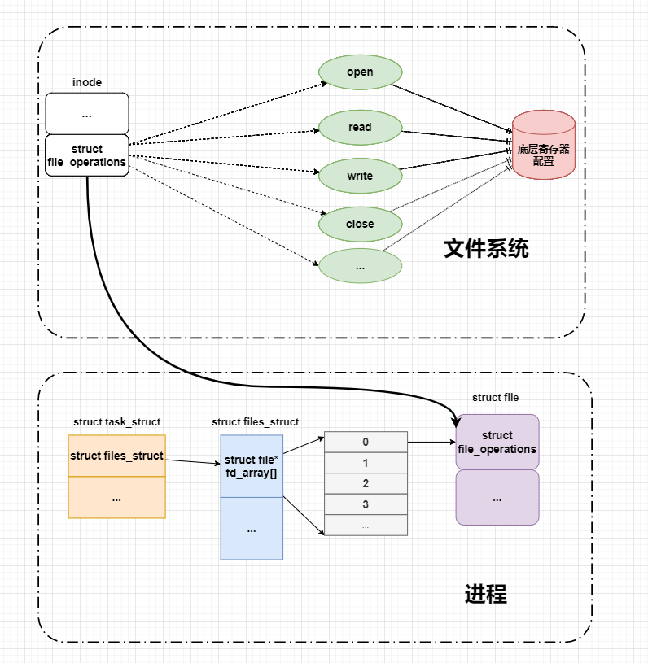

在硬件层，我们可以通过查看硬件的原理图、芯片的数据手册，确定底层需要配置的寄存器，这类似于裸机开发。
将对底层寄存器的配置，读写操作放在文件操作接口里面，也就是实现file_operations结构体。

其次在驱动层，我们将文件操作接口注册到内核，内核通过内部散列表来登记记录主次设备号。

在文件系统层，新建一个文件绑定该文件操作接口，应用程序通过操作指定文件的文件操作接口来设置底层寄存器

实际上，在Linux上写驱动程序，都是做一些“填空题”。因为Linux给我们提供了一个基本的框架，
我们只需要按照这个框架来写驱动，内核就能很好的接收并且按我们所要求的那样工作。有句成语工欲善其事,必先利其器，
在理解这个框架之前我们得花点时间来学习字符设备驱动相关概念及数据结构。

相关概念及数据结构
~~~~~~~~~~~~~~~~~~~~~~~~~~~~~~
在linux中，我们使用设备编号来表示设备，主设备号区分设备类别，次设备号标识具体的设备。
cdev结构体被内核用来记录设备号，而在使用设备时，我们通常会打开设备节点，通过设备节点的inode结构体、
file结构体最终找到file_operations结构体，并从file_operations结构体中得到操作设备的具体方法。

设备号
------------------------------
对于字符的访问是通过文件系统的名称进行的，这些名称被称为特殊文件、设备文件，或者简单称为文件系统树的节点，
Linux根目录下有/dev这个文件夹，专门用来存放设备中的驱动程序，我们可以使用ls -l 以列表的形式列出系统中的所有设备。
其中，每一行表示一个设备，每一行的第一个字符表示设备的类型。

如下图：'c'用来标识字符设备，'b'用来标识块设备。如 autofs 是一个字符设备c, 它的主设备号是10，次设备号是235；
loop0 是一个块设备，它的主设备号是7，次所备案为0，同时可以看到loop0-loop3共用一个主设备号，次设备号由0开始递增。

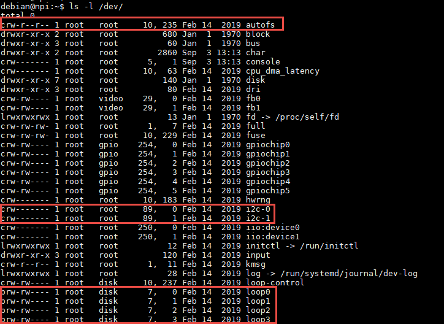

一般来说，主设备号指向设备的驱动程序，次设备号指向某个具体的设备。如上图，I2C-0，I2C-1属于不同设备但是共用一套驱动程序

内核中设备编号的含义
^^^^^^^^^^^^^^^^^^^^^^^^^^^^^^
在内核中，dev_t用来表示设备编号，dev_t是一个32位的数，其中，高12位表示主设备号，低20位表示次设备号。
也就是理论上主设备号取值范围：0-2^12，次设备号0-2^20。
实际上在内核源码中__register_chrdev_region(...)函数中，major被限定在0-CHRDEV_MAJOR_MAX，CHRDEV_MAJOR_MAX是一个宏，值是512。
在kdev_t中，设备编号通过移位操作最终得到主/次设备号码，同样主/次设备号也可以通过位运算变成dev_t类型的设备编号，
具体实现参看上面代码MAJOR(dev)、MINOR(dev)和MKDEV(ma,mi)。

.. code-block:: c
   :caption: dev_t定义  (内核源码/include/types.h）
   :linenos:

   typedef u32 __kernel_dev_t;

   typedef __kernel_dev_t		dev_t;

.. code-block:: c
   :caption: 设备号相关宏 (内核源码//include/linux/kdev_t.h）
   :linenos:

   #define MINORBITS	20
   #define MINORMASK	((1U << MINORBITS) - 1)

   #define MAJOR(dev)	((unsigned int) ((dev) >> MINORBITS))
   #define MINOR(dev)	((unsigned int) ((dev) & MINORMASK))
   #define MKDEV(ma,mi)	(((ma) << MINORBITS) | (mi))

- 第4-5行：内核还提供了另外两个宏定义MAJOR和MINOR，可以根据设备的设备号来获取设备的主设备号和次设备号。
- 第6行：宏定义MKDEV，用于将主设备号和次设备号合成一个设备号，主设备可以通过查阅内核源码的Documentation/devices.txt文件，而次设备号通常是从编号0开始。

cdev结构体
^^^^^^^^^^^^^^^^^^^^^^^^^^^^^^
内核通过一个散列表(哈希表)来记录设备编号。
哈希表由数组和链表组成，吸收数组查找快，链表增删效率高，容易拓展等优点。

以主设备号为cdev_map编号，使用哈希函数f(major)=major%255来计算组数下标(使用哈希函数是为了链表节点尽量平均分布在各个数组元素中，提高查询效率)；
主设备号冲突,则以次设备号为比较值来排序链表节点。
如下图所示，内核用struct cdev结构体来描述一个字符设备，并通过struct kobj_map类型的
散列表cdev_map来管理当前系统中的所有字符设备。

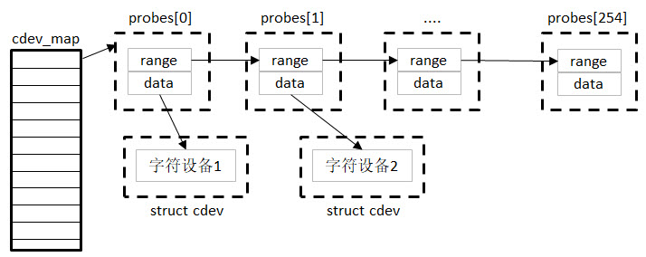

.. code-block:: c
   :caption: cdev结构体（内核源码/include/linux/cdev.h）
   :linenos:

   struct cdev {
      struct kobject kobj;
      struct module *owner;
      const struct file_operations *ops;
      struct list_head list;
      dev_t dev;
      unsigned int count;
   };

- **struct kobject kobj：** 内嵌的内核对象，通过它将设备统一加入到“Linux设备驱动模型”中管理（如对象的引用计数、电源管理、热插拔、生命周期、与用户通信等）。
- **struct module \*owner：** 字符设备驱动程序所在的内核模块对象的指针。
- **const struct file_operations \*ops：** 文件操作，是字符设备驱动中非常重要的数据结构，在应用程序通过文件系统（VFS）呼叫到设备设备驱动程序中实现的文件操作类函数过程中，ops起着桥梁纽带作用，VFS与文件系统及设备文件之间的接口是file_operations结构体成员函数，这个结构体包含了对文件进行打开、关闭、读写、控制等一系列成员函数。
- **struct list_head list：** 用于将系统中的字符设备形成链表（这是个内核链表的一个链接因子，可以再内核很多结构体中看到这种结构的身影）。
- **dev_t dev：** 字符设备的设备号，有主设备和次设备号构成。
- **unsigned int count：** 属于同一主设备好的次设备号的个数，用于表示设备驱动程序控制的实际同类设备的数量。

设备节点
------------------------------
设备节点（设备文件）：Linux中设备节点是通过“mknod”命令来创建的。一个设备节点其实就是一个文件，
Linux中称为设备文件。有一点必要说明的是，在Linux中，所有的设备访问都是通过文件的方式，
一般的数据文件程序普通文件，设备节点称为设备文件。

设备节点被创建在/dev下，是连接内核与用户层的枢纽，就是设备是接到对应哪种接口的哪个ID 上。 
相当于硬盘的inode一样的东西，记录了硬件设备的位置和信息在Linux中，所有设备都以文件的形式存放在/dev目录下，
都是通过文件的方式进行访问，设备节点是Linux内核对设备的抽象，一个设备节点就是一个文件。
应用程序通过一组标准化的调用执行访问设备，这些调用独立于任何特定的驱动程序。而驱动程序负责将这些标准调用映射到实际硬件的特有操作。

数据结构
------------------------------
在驱动开发过程中，不可避免要涉及到三个重要的的内核数据结构分别包括文件操作方式（file_operations），
文件描述结构体（struct file）以及inode结构体，在我们开始阅读编写驱动程序的代码之前，有必要先了解这三个结构体。

file_operations结构体
^^^^^^^^^^^^^^^^^^^^^^^^^^^^^^
file_operation就是把系统调用和驱动程序关联起来的关键数据结构。这个结构的每一个成员都对应着一个系统调用。
读取file_operation中相应的函数指针，接着把控制权转交给函数指针指向的函数，从而完成了Linux设备驱动程序的工作。

.. image:: media/characprog002.png
   :align: center
   :alt: 字符设备散列表

在系统内部，I/O设备的存取操作通过特定的入口点来进行，而这组特定的入口点恰恰是由设备驱动程序提供的。
通常这组设备驱动程序接口是由结构file_operations结构体向系统说明的，它定义在ebf_buster_linux/include/linux/fs.h中。
传统上, 一个file_operation结构或者其一个指针称为 fops( 或者它的一些变体). 结构中的每个成员必须指向驱动中的函数,
这些函数实现一个特别的操作, 或者对于不支持的操作留置为NULL。当指定为NULL指针时内核的确切的行为是每个函数不同的。

以下代码中只列出本章使用到的部分函数。

.. code-block:: c
   :caption: file_operations结构体（内核源码/include/linux/fs.h）
   :linenos:

   struct file_operations {
      struct module *owner;
      loff_t (*llseek) (struct file *, loff_t, int);
      ssize_t (*read) (struct file *, char __user *, size_t, loff_t *);
      ssize_t (*write) (struct file *, const char __user *, size_t, loff_t *);
      long (*unlocked_ioctl) (struct file *, unsigned int, unsigned long);
      int (*open) (struct inode *, struct file *)
      int (*release) (struct inode *, struct file *);
   };

-  **llseek：** 用于修改文件的当前读写位置，并返回偏移后的位置。参数file传入了对应的文件指针，我们可以看到以上代码中所有的函数都有该形参，通常用于读取文件的信息，如文件类型、读写权限；参数loff_t指定偏移量的大小；参数int是用于指定新位置指定成从文件的某个位置进行偏移，SEEK_SET表示从文件起始处开始偏移；SEEK_CUR表示从当前位置开始偏移；SEEK_END表示从文件结尾开始偏移。
-  **read：** 用于读取设备中的数据，并返回成功读取的字节数。该函数指针被设置为NULL时，会导致系统调用read函数报错，提示“非法参数”。该函数有三个参数：file类型指针变量，char__user*类型的数据缓冲区，__user用于修饰变量，表明该变量所在的地址空间是用户空间的。内核模块不能直接使用该数据，需要使用copy_to_user函数来进行操作。size_t类型变量指定读取的数据大小。
-  **write：** 用于向设备写入数据，并返回成功写入的字节数，write函数的参数用法与read函数类似，不过在访问__user修饰的数据缓冲区，需要使用copy_from_user函数。
-  **unlocked_ioctl：** 提供设备执行相关控制命令的实现方法，它对应于应用程序的fcntl函数以及ioctl函数。在 kernel 3.0 中已经完全删除了 struct file_operations 中的 ioctl 函数指针。
-  **open：** 设备驱动第一个被执行的函数，一般用于硬件的初始化。如果该成员被设置为NULL，则表示这个设备的打开操作永远成功。
-  **release：** 当file结构体被释放时，将会调用该函数。与open函数相反，该函数可以用于释放

上面，我们提到read和write函数时，需要使用copy_to_user函数以及copy_from_user函数来进行数据访问，写入/读取成
功函数返回0，失败则会返回未被拷贝的字节数。

.. code-block:: c
   :caption: copy_to_user和copy_from_user函数（内核源码/include/asm-generic/uaccess.h）
   :linenos:

   static inline long copy_from_user(void *to, const void __user * from, unsigned long n)
   static inline long copy_to_user(void __user *to, const void *from, unsigned long n)

函数参数和返回值如下：

**参数**

-  **to**：指定目标地址，也就是数据存放的地址，
-  **from**：指定源地址，也就是数据的来源。
-  **n**：指定写入/读取数据的字节数。

**返回值**

- 写入/读取数据的字节数

file结构体
^^^^^^^^^^^^^^^^^^^^^^^^^^^^^^
内核中用file结构体来表示每个打开的文件，每打开一个文件，内核会创建一个结构体，并将对该文件上的操作函数传递给
该结构体的成员变量f_op，当文件所有实例被关闭后，内核会释放这个结构体。如下代码中，只列出了我们本章需要了解的成员变量。

.. code-block:: c
   :caption: file结构体（内核源码/include/fs.h）
   :linenos:

   struct file {
   const struct file_operations *f_op;
   /* needed for tty driver, and maybe others */
   void *private_data;
   };

-  **f_op**：存放与文件操作相关的一系列函数指针，如open、read、wirte等函数。
-  **private_data**：该指针变量只会用于设备驱动程序中，内核并不会对该成员进行操作。因此，在驱动程序中，通常用于指向描述设备的结构体。

inode结构体
^^^^^^^^^^^^^^^^^^^^^^^^^^^^^^
VFS inode 包含文件访问权限、属主、组、大小、生成时间、访问时间、最后修改时间等信息。
它是Linux 管理文件系统的最基本单位，也是文件系统连接任何子目录、文件的桥梁。
内核使用inode结构体在内核内部表示一个文件。因此，它与表示一个已经打开的文件描述符的结构体(即file 文件结构)是不同的，
我们可以使用多个file文件结构表示同一个文件的多个文件描述符，但此时，
所有的这些file文件结构全部都必须只能指向一个inode结构体。
inode结构体包含了一大堆文件相关的信息，但是就针对驱动代码来说，我们只要关心其中的两个域即可：

- **dev_t i_rdev：** 表示设备文件的结点，这个域实际上包含了设备号。
- **struct cdev \*i_cdev：** struct cdev是内核的一个内部结构，它是用来表示字符设备的，当inode结点指向一个字符设备文件时，此域为一个指向inode结构的指针。

字符设备驱动程序框架
~~~~~~~~~~~~~~~~~~~~~~~~~~~~~~
讲了很多次字符设备驱动程序框架，那到底什么是字符文件程序框架呢？我可以从下面的思维导图来解读内核源码。

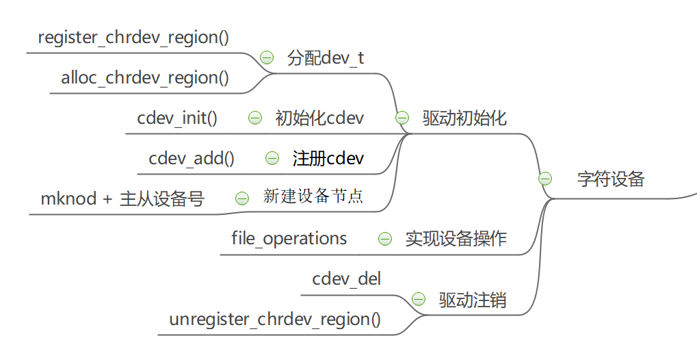

我们创建一个字符设备的时候，首先要的到一个设备号，分配设备号的途径有静态分配和动态分配；
拿到设备的唯一ID，我们需要实现file_operation并保存到cdev中，实现cdev的初始化；
然后我们需要将我们所做的工作告诉内核，使用cdev_add()注册cdev；
最后我们还需要创建设备节点，以便我们后面调用file_operation接口。

注销设备时我们需释放内核中的cdev，归还申请的设备号，删除创建的设备节点。

在实现设备操作这一段，我们可以看看open函数到底做了什么。

驱动初始化和注销
------------------------------
设备号的申请和归还
^^^^^^^^^^^^^^^^^^^^^^^^^^^^^^
Linux内核提供了两种方式来定义字符设备，如下所示。

.. code-block:: c
   :caption: 定义字符设备
   :linenos:

   //第一种方式
   static struct cdev chrdev;
   //第二种方式
   struct cdev *cdev_alloc(void);

第一种方式，就是我们常见的变量定义；第二种方式，是内核提供的动态分配方式，调用该函数之
后，会返回一个struct cdev类型的指针，用于描述字符设备。

从内核中移除某个字符设备，则需要调用cdev_del函数，如下所示。

.. code-block:: c
   :caption: cdev_del函数
   :linenos:

   void cdev_del(struct cdev *p)

函数参数和返回值如下：

**参数：** 

-  **p：** 该函数需要将我们的字符设备结构体的地址作为实参传递进去，就可以从内核中移除该字符设备了。

**返回值：** 无

**register_chrdev_region函数**

register_chrdev_region函数用于静态地为一个字符设备申请一个或多个设备编号。函数原型如下所示。

.. code-block:: c
   :caption: register_chrdev_region函数
   :linenos:

   int register_chrdev_region(dev_t from, unsigned count, const char *name)

函数参数和返回值如下：

**参数：**

-  **from**：dev_t类型的变量，用于指定字符设备的起始设备号，如果要注册的设备号已经被其他的设备注册了，那么就会导致注册失败。
-  **count**：指定要申请的设备号个数，count的值不可以太大，否则会与下一个主设备号重叠。
-  **name**：用于指定该设备的名称，我们可以在/proc/devices中看到该设备。

**返回值：** 返回0表示申请成功，失败则返回错误码

**alloc_chrdev_region函数**

使用register_chrdev_region函数时，都需要去查阅内核源码的Documentation/devices.txt文件，
这就十分不方便。因此，内核又为我们提供了一种能够动态分配设备编号的方式：alloc_chrdev_region。

调用alloc_chrdev_region函数，内核会自动分配给我们一个尚未使用的主设备号。
我们可以通过命令“cat /proc/devices”查询内核分配的主设备号。

.. code-block:: c
   :caption: alloc_chrdev_region函数原型
   :linenos:

   int alloc_chrdev_region(dev_t *dev, unsigned baseminor, unsigned count, const char *name)

函数参数和返回值如下：

**参数：**

-  **dev**：指向dev_t类型数据的指针变量，用于存放分配到的设备编号的起始值；
-  **baseminor**：次设备号的起始值，通常情况下，设置为0；
-  **count、name**：同register_chrdev_region类型，用于指定需要分配的设备编号的个数以及设备的名称。

**返回值：** 返回0表示申请成功，失败则返回错误码

**unregister_chrdev_region函数**

当我们删除字符设备时候，我们需要把分配的设备编号交还给内核，对于使用register_chrdev_region函数
以及alloc_chrdev_region函数分配得到的设备编号，可以使用unregister_chrdev_region函数实现该功能。

.. code-block:: c
   :caption: unregister_chrdev_region函数（内核源码/fs/char_dev.c）
   :linenos:

   void unregister_chrdev_region(dev_t from, unsigned count)

函数参数和返回值如下：

**参数：**

-  **from**：指定需要注销的字符设备的设备编号起始值，我们一般将定义的dev_t变量作为实参。
-  **count**：指定需要注销的字符设备编号的个数，该值应与申请函数的count值相等，通常采用宏定义进行管理。

**返回值：** 无

**register_chrdev函数**

除了上述的两种，内核还提供了register_chrdev函数用于分配设备号。该函数是一个内联函数，它不
仅支持静态申请设备号，也支持动态申请设备号，并将主设备号返回，函数原型如下所示。

.. code-block:: c
   :caption: register_chrdev函数原型（内核源码/include/linux/fs.h文件）
   :linenos:

   static inline int register_chrdev(unsigned int major, const char *name,
   const struct file_operations *fops)
   {
      return __register_chrdev(major, 0, 256, name, fops);
   }

函数参数和返回值如下：

**参数：**

-  **major**：用于指定要申请的字符设备的主设备号，等价于register_chrdev_region函数，当设置为0时，内核会自动分配一个未使用的主设备号。
-  **name**：用于指定字符设备的名称
-  **fops**：用于操作该设备的函数接口指针。

**返回值：** 主设备号

我们从以上代码中可以看到，使用register_chrdev函数向内核申请设备号，同一类字
符设备（即主设备号相同），会在内核中申请了256个，通常情况下，我们不需要用到这么多个设备，这就造成了极大的资源浪费。

**unregister_chrdev函数**

使用register函数申请的设备号，则应该使用unregister_chrdev函数进行注销。

.. code-block:: c
   :caption: unregister_chrdev函数（内核源码/include/linux/fs.h）
   :linenos:

   static inline void unregister_chrdev(unsigned int major, const char *name)
   {
   __unregister_chrdev(major, 0, 256, name);
   }

函数参数和返回值如下：

**参数：**

-  **major**：指定需要释放的字符设备的主设备号，一般使用register_chrdev函数的返回值作为实参。
-  **name**：执行需要释放的字符设备的名称。

**返回值：** 无

初始化cdev
^^^^^^^^^^^^^^^^^^^^^^^^^^^^^^
前面我们已经提到过了，编写一个字符设备最重要的事情，就是要实现file_operations这个结构体中的函数。
实现之后，如何将该结构体与我们的字符设备结构体相关联呢？内核提供了cdev_init函数，来实现这个过程。

.. code-block:: c
   :caption: cdev_init函数（内核源码/fs/char_dev.c）
   :linenos:

   void cdev_init(struct cdev *cdev, const struct file_operations *fops)

函数参数和返回值如下：

**参数：**

-  **cdev**：struct cdev类型的指针变量，指向需要关联的字符设备结构体；
-  **fops**：file_operations类型的结构体指针变量，一般将实现操作该设备的结构体file_operations结构体作为实参。

**返回值：** 无

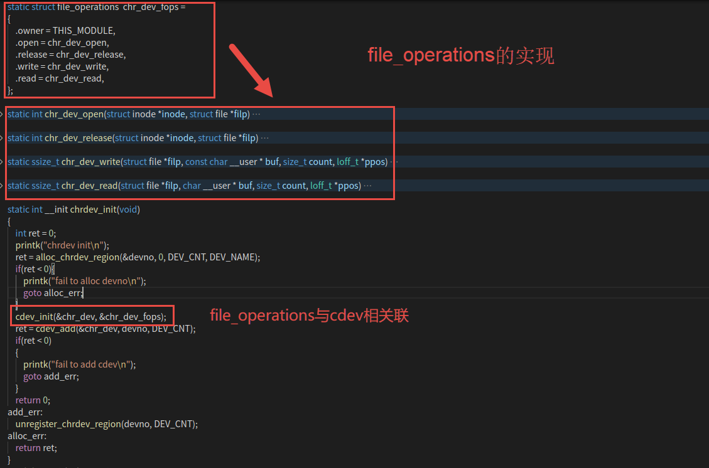

设备注册和注销
------------------------------
cdev_add函数用于向内核的cdev_map散列表添加一个新的字符设备，如下所示。

.. code-block:: c
   :caption: cdev_add函数（内核源码/fs/char_dev.c）
   :linenos:

   int cdev_add(struct cdev *p, dev_t dev, unsigned count)

函数参数和返回值如下：

**参数：**

-  **p**：struct cdev类型的指针，用于指定需要添加的字符设备；
-  **dev**：dev_t类型变量，用于指定设备的起始编号；
-  **count**：指定注册多少个设备。

**返回值：** 错误码

从系统中删除cdev，cdev设备将无法再打开，但任何已经打开的cdev将保持不变，
即使在cdev_del返回后，它们的FOP仍然可以调用。

.. code-block:: c
   :caption: cdev_del函数（内核源码/fs/char_dev.c）
   :linenos:
   
   void cdev_del(struct cdev *p)

函数参数和返回值如下：

**参数：**

-  **p**：struct cdev类型的指针，用于指定需要删除的字符设备；

**返回值：** 无

设备节点的创建和销毁
------------------------------
创建一个设备并将其注册到文件系统

.. code-block:: c
   :caption: device_create函数（内核源码/drivers/base/core.c）
   :linenos:

   struct device *device_create(struct class *class, struct device *parent,
               dev_t devt, void *drvdata, const char *fmt, ...)

函数参数和返回值如下：

**参数：**

-  **class**：指向这个设备应该注册到的struct类的指针；
-  **parent**：指向此新设备的父结构设备（如果有）的指针；
-  **devt**：要添加的char设备的开发；
-  **drvdata**：要添加到设备进行回调的数据；
-  **fmt**：输入设备名称。

**返回值：** 成功时返回 struct device 结构体指针, 错误时返回ERR_PTR().

删除使用device_create函数创建的设备

.. code-block:: c
   :caption: device_destroy函数（内核源码/drivers/base/core.c）
   :linenos:

   void device_destroy(struct class *class, dev_t devt)

函数参数和返回值如下：

**参数：**

-  **class**：指向注册此设备的struct类的指针；
-  **devt**：以前注册的设备的开发；

**返回值：**  无

除了使用代码创建设备节点，还可以使用mknod命令创建设备节点。

用法：mknod 设备名 设备类型 主设备号 次设备号

当类型为"p"时可不指定主设备号和次设备号，否则它们是必须指定的。
如果主设备号和次设备号以"0x"或"0X"开头，它们会被视作十六进制数来解析；如果以"0"开头，则被视作八进制数；
其余情况下被视作十进制数。可用的类型包括：

- b      创建(有缓冲的)区块特殊文件
- c, u   创建(没有缓冲的)字符特殊文件
- p      创建先进先出(FIFO)特殊文件

如：mkmod /dev/test c 2 0

创建一个字符设备/dev/test，其主设备号为2，次设备号为0。

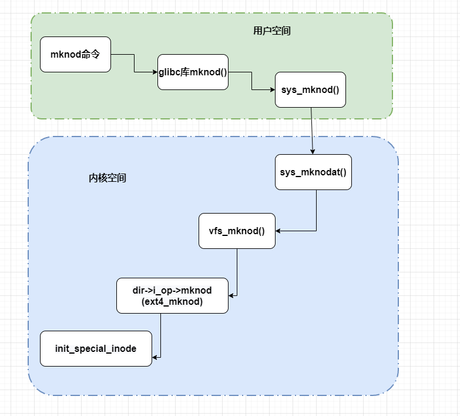

当我们使用上述命令，创建了一个字符设备文件时，实际上就是创建了一个设备节点inode结构体，
并且将该设备的设备编号记录在成员i_rdev，将成员f_op指针指向了def_chr_fops结构体。
这就是mknod负责的工作内容，具体代码见如下。

.. code-block:: c
   :caption: mknod调用关系 (内核源码/mm/shmem.c)
   :linenos:

   static struct inode *shmem_get_inode(struct super_block *sb, const struct inode *dir,
   umode_t mode, dev_t dev, unsigned long flags)
   {
      inode = new_inode(sb);
      if (inode) {
         ......
         switch (mode & S_IFMT) {
            default:
            inode->i_op = &shmem_special_inode_operations;
            init_special_inode(inode, mode, dev);
            break;
            ......
         }
      } else
      shmem_free_inode(sb);
      return inode;
   }

- 第10行：mknod命令最终执行init_special_inode函数

.. code-block:: c
   :caption: init_special_inode函数（内核源码/fs/inode.c）
   :linenos:

   void init_special_inode(struct inode *inode, umode_t mode, dev_t rdev)
   {
      inode->i_mode = mode;
      if (S_ISCHR(mode)) {
         inode->i_fop = &def_chr_fops;
         inode->i_rdev = rdev;
      } else if (S_ISBLK(mode)) {
         inode->i_fop = &def_blk_fops;
         inode->i_rdev = rdev;
      } else if (S_ISFIFO(mode))
         inode->i_fop = &pipefifo_fops;
      else if (S_ISSOCK(mode))
         ;	/* leave it no_open_fops */
      else
         printk(KERN_DEBUG "init_special_inode: bogus i_mode (%o) for"
               " inode %s:%lu\n", mode, inode->i_sb->s_id,
               inode->i_ino);
   }

- 第4-17行：判断文件的inode类型，如果是字符设备类型，则把def_chr_fops作为该文件的操作接口，并把设备号记录在inode->i_rdev。

inode上的file_operation并不是自己构造的file_operation，而是字符设备通用的def_chr_fops，
那么自己构建的file_operation等在应用程序调用open函数之后，才会绑定在文件上。接下来我们再看open函数到底做了什么。

open函数到底做了什么
~~~~~~~~~~~~~~~~~~~~~~~~~~~~~~
使用设备之前我们通常都需要调用open函数，这个函数一般用于设备专有数据的初始化，申请相关资源及进行设备的初始化等工作，
对于简单的设备而言，open函数可以不做具体的工作，你在应用层通过系统调用open打开设备时，
如果打开正常，就会得到该设备的文件描述符，之后，我们就可以通过该描述符对设备进行read和write等操作；
open函数到底做了些什么工作？下图中列出了open函数执行的大致过程。

.. image:: media/character_ready014.png
   :align: center
   :alt: open函数的执行过程

户空间使用open()系统调用函数打开一个字符设备时(int fd = open("dev/xxx", O_RDWR))大致有以下过程：

   - 在虚拟文件系统VFS中的查找对应与字符设备对应 struct inode节点
   - 遍历散列表cdev_map，根据inod节点中的 cdev_t设备号找到cdev对象
   - 创建struct file对象（系统采用一个数组来管理一个进程中的多个被打开的设备，每个文件秒速符作为数组下标标识了一个设备对象）
   - 初始化struct file对象，将 struct file对象中的 file_operations成员指向 struct cdev对象中的 file_operations成员（file->fops =  cdev->fops）
   - 回调file->fops->open函数

我们使用的open函数在内核中对应的是sys_open函数，sys_open函数又会调用do_sys_open函数。在do_sys_open函数中，
首先调用函数get_unused_fd_flags来获取一个未被使用的文件描述符fd，该文件描述符就是我们最终通过open函数得到的值。
紧接着，又调用了do_filp_open函数，该函数通过调用函数get_empty_filp得到一个新的file结构体，之后的代码做了许多复杂的工作，
如解析文件路径，查找该文件的文件节点inode等，直接来到了函数do_dentry_open函数，如下所示。

.. code-block:: c
   :caption: do_dentry_open函数（位于 ebf-busrer-linux/fs/open.c）
   :linenos:

   static int do_dentry_open(struct file *f,struct inode *inode,int (*open)(struct inode *, struct file *),const struct cred *cred)
   {
      ……
      f->f_op = fops_get(inode->i_fop);
      ……
      if (!open)
      open = f->f_op->open;
      if (open) {
         error = open(inode, f);
         if (error)
         goto cleanup_all;
      }
      ……
   }

- 第4行：使用fops_get函数来获取该文件节点inode的成员变量i_fop，在上图中我们使用mknod创建字符设备文件时，将def_chr_fops结构体赋值给了该设备文件inode的i_fop成员。
- 第7行：到了这里，我们新建的file结构体的成员f_op就指向了def_chr_fops。

.. code-block:: c
   :caption: def_chr_fops结构体（内核源码/fs/char_dev.c）
   :linenos:

   const struct file_operations def_chr_fops = {
      .open = chrdev_open,
      .llseek = noop_llseek,
   };

最终，会执行def_chr_fops中的open函数，也就是chrdev_open函数，可以理解为一个字符设备的通用初始化函数，根据字符设备的设备号，
找到相应的字符设备，从而得到操作该设备的方法，代码实现如下。

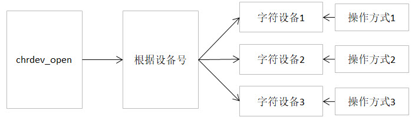

.. code-block:: c
   :caption: chrdev_open函数（内核源码/fs/char_dev.c）
   :linenos:

   static int chrdev_open(struct inode *inode, struct file *filp)
   {
      const struct file_operations *fops;
      struct cdev *p;
      struct cdev *new = NULL;
      int ret = 0;
      spin_lock(&cdev_lock);
      p = inode->i_cdev;
      if (!p) {
         struct kobject *kobj;
         int idx;
         spin_unlock(&cdev_lock);
         kobj = kobj_lookup(cdev_map, inode->i_rdev, &idx);
         if (!kobj)
            return -ENXIO;
         new = container_of(kobj, struct cdev, kobj);
         spin_lock(&cdev_lock);
         /* Check i_cdev again in case somebody beat us to it whilewe dropped the lock.*/
         p = inode->i_cdev;
         if (!p) {
            inode->i_cdev = p = new;
            list_add(&inode->i_devices, &p->list);
            new = NULL;
         } else if (!cdev_get(p))
            ret = -ENXIO;
      } else if (!cdev_get(p))
         ret = -ENXIO;
      spin_unlock(&cdev_lock);
      cdev_put(new);
      if (ret)
         return ret;

      ret = -ENXIO;
      fops = fops_get(p->ops);
      if (!fops)
      goto out_cdev_put;

      replace_fops(filp, fops);
      if (filp->f_op->open) {
         ret = filp->f_op->open(inode, filp);
         if (ret)
         goto out_cdev_put;
      }

      return 0;

      out_cdev_put:
      cdev_put(p);
      return ret;
   }

在Linux内核中，使用结构体cdev来描述一个字符设备。

- 第8行：inode->i_rdev中保存了字符设备的设备编号，
- 第13行：通过函数kobj_lookup函数便可以找到该设备文件cdev结构体的kobj成员，
- 第16行：再通过函数container_of便可以得到该字符设备对应的结构体cdev。函数container_of的作用就是通过一个结构变量中一个成员的地址找到这个结构体变量的首地址。同时，将cdev结构体记录到文件节点inode中的i_cdev，便于下次打开该文件。
- 第38-43行：函数chrdev_open最终将该文件结构体file的成员f_op替换成了cdev对应的ops成员，并执行ops结构体中的open函数。

最后，调用上图的fd_install函数，完成文件描述符和文件结构体file的关联，之后我们使用对该文件描述符fd调用read、write函数，
最终都会调用file结构体对应的函数，实际上也就是调用cdev结构体中ops结构体内的相关函数。

总结一下整个过程，当我们使用open函数，打开设备文件时，会根据该设备的文件的设备号找到相应的设备结构体，
从而得到了操作该设备的方法。也就是说如果我们要添加一个新设备的话，我们需要提供一个设备号，
一个设备结构体以及操作该设备的方法（file_operations结构体）。

字符设备驱动程序实验
~~~~~~~~~~~~~~~~~~~~~~~~~~~~~~

硬件介绍
------------------------------

本节实验使用到 EBF6ULL-PRO 开发板。

实验代码讲解
------------------------------

**本章的示例代码目录为：base_code/linux_driver/EmbedCharDev/CharDev/**

结合前面所有的知识点，首先，字符设备驱动程序是以内核模块的形式存在的，、
因此，使用内核模块的程序框架是毫无疑问的。
紧接着，我们要向系统注册一个新的字符设备，需要这几样东西：字符设备结构体cdev，设备编号devno，
以及最最最重要的操作方式结构体file_operations。

下面，我们开始编写我们自己的字符设备驱动程序。

内核模块框架
^^^^^^^^^^^^^^^^^^^^^^^^^^^^^^
既然我们的设备程序是以内核模块的方式存在的，那么就需要先写出一个基本的内核框架，见如下所示。

.. code-block:: c
   :caption: 内核模块加载函数（位于../base_code/linux_driver/EmbedCharDev/CharDev/chrdev.c）
   :linenos:

   #define DEV_NAME "EmbedCharDev"
   #define DEV_CNT (1)
   #define BUFF_SIZE 128
   //定义字符设备的设备号
   static dev_t devno;
   //定义字符设备结构体chr_dev
   static struct cdev chr_dev;
   static int __init chrdev_init(void)
   {
      int ret = 0;
      printk("chrdev init\n");
      //第一步
      //采用动态分配的方式，获取设备编号，次设备号为0，
      //设备名称为EmbedCharDev，可通过命令cat /proc/devices查看
      //DEV_CNT为1，当前只申请一个设备编号
      ret = alloc_chrdev_region(&devno, 0, DEV_CNT, DEV_NAME);
      if (ret < 0) {
      printk("fail to alloc devno\n");
      goto alloc_err;
    }
    //第二步
    //关联字符设备结构体cdev与文件操作结构体file_operations
    cdev_init(&chr_dev, &chr_dev_fops);
    //第三步
    //添加设备至cdev_map散列表中
    ret = cdev_add(&chr_dev, devno, DEV_CNT);
    if (ret < 0) {
      printk("fail to add cdev\n");
      goto add_err;
    }
    return 0;
   
    add_err:
    //添加设备失败时，需要注销设备号
    unregister_chrdev_region(devno, DEV_CNT);
    alloc_err:
    return ret;
    }
    module_init(chrdev_init);

- 第16行：使用动态分配(alloc_chrdev_region)的方式来获取设备号，指定设备的名称为“EmbedCharDev”，只申请一个设备号，并且次设备号为0。
- 第19行：这里使用C语言的goto语法，当获取失败时，直接返回对应的错误码。成功获取到设备号之后，我们还缺字符设备结构体以及文件的操作方式。
- 第23行：以上代码中使用定义变量的方式定义了一个字符设备结构体chr_dev，调用cdev_init函数将chr_dev结构体和文件操作结构体相关联，该结构体的具体实现下节见分晓。
- 第26行：最后我们只需要调用cdev_add函数将我们的字符设备添加到字符设备管理列表cdev_map即可。
- 第29行：此处也使用了goto语法，当添加设备失败的话，需要将申请的设备号注销掉，要养成一个好习惯，不要“占着茅坑不拉屎”。

模块的卸载函数就相对简单一下，只需要完成注销设备号，以及移除字符设备，如下所示。

.. code-block:: c
   :caption: 内核模块卸载函数（位于../base_code/linux_driver/EmbedCharDev/CharDev/chrdev.c）
   :linenos:

   static void __exit chrdev_exit(void)
   {
      printk("chrdev exit\n");
      unregister_chrdev_region(devno, DEV_CNT);
      cdev_del(&chr_dev);
   }
   module_exit(chrdev_exit);

文件操作方式的实现
^^^^^^^^^^^^^^^^^^^^^^^^^^^^^^
下面，我们开始实现字符设备最重要的部分：文件操作方式结构体file_operations，见如下所示。

.. code-block:: c
   :caption: file_operations结构体（位于../base_code/linux_driver/EmbedCharDev/CharDev/chrdev.c）
   :linenos:

   #define BUFF_SIZE 128
   //数据缓冲区
   static char vbuf[BUFF_SIZE];
   static struct file_operations chr_dev_fops = {
      .owner = THIS_MODULE,
      .open = chr_dev_open,
      .release = chr_dev_release,
      .write = chr_dev_write,
      .read = chr_dev_read,
    };

由于这个字符设备是一个虚拟的设备，与硬件并没有什么关联，因此，open函数与release直接返回0即可，我们重点关注write以及read函数的实现。

.. code-block:: c
   :caption: chr_dev_open函数与chr_dev_release函数（位于../base_code/linux_driver/EmbedCharDev/CharDev/chrdev.c）
   :linenos:

   static int chr_dev_open(struct inode *inode, struct file *filp)
   {
      printk("\nopen\n");
      return 0;
   }
   static int chr_dev_release(struct inode *inode, struct file *filp)
   {
      printk("\nrelease\n");
      return 0;
    }

我们在open函数与release函数中打印相关的调试信息，如上方代码所示。

.. code-block:: c
   :caption: chr_dev_write函数（位于../base_code/linux_driver/EmbedCharDev/CharDev/chrdev.c）
   :linenos:

   static ssize_t chr_dev_write(struct file *filp, const char __user * buf, size_t count, loff_t *ppos)
   {
      unsigned long p = *ppos;
      int ret;
      int tmp = count ;
      if (p > BUFF_SIZE)
         return 0;
      if (tmp > BUFF_SIZE - p)
         tmp = BUFF_SIZE - p;
      ret = copy_from_user(vbuf, buf, tmp);
      *ppos += tmp;
      return tmp;
   }

当我们的应用程序调用write函数，最终就调用我们的chr_dev_write函数。

- 第3行：变量p记录了当前文件的读写位置，
- 第6-9行：如果超过了数据缓冲区的大小（128字节）的话，直接返回0。并且如果要读写的数据个数超过了数据缓冲区剩余的内容的话，则只读取剩余的内容。
- 第10-11行：使用copy_from_user从用户空间拷贝tmp个字节的数据到数据缓冲区中，同时让文件的读写位置偏移同样的字节数。

.. code-block:: c
   :caption: chr_dev_read函数（位于../base_code/linux_driver/EmbedCharDev/CharDev/chrdev.c）
   :linenos:

   static ssize_t chr_dev_read(struct file *filp, char __user * buf, size_t count, loff_t *ppos)
   {
      unsigned long p = *ppos;
      int ret;
      int tmp = count ;
      if (p >= BUFF_SIZE)
      return 0;
      if (tmp > BUFF_SIZE - p)
         tmp = BUFF_SIZE - p;
      ret = copy_to_user(buf, vbuf+p, tmp);
      *ppos +=tmp;
      return tmp;
   }

同样的，当我们应用程序调用read函数，则会执行chr_dev_read函数的内容。
该函数的实现与chr_dev_write函数类似，区别在于，使用copy_to_user从数据缓冲区拷贝tmp个字节的数据到用户空间中。

简单测试程序
^^^^^^^^^^^^^^^^^^^^^^^^^^^^^^
下面，我们开始编写应用程序，来读写我们的字符设备，如下所示。

.. code-block:: c
   :caption: main.c函数（位于../base_code/linux_driver/EmbedCharDev/CharDev/main.c）
   :linenos:

   #include <stdio.h>
   #include <unistd.h>
   #include <fcntl.h>
   #include <string.h>
   char *wbuf = "Hello World\n";
   char rbuf[128];
   int main(void)
   {
      printf("EmbedCharDev test\n");
      //打开文件
      int fd = open("/dev/chrdev", O_RDWR);
      //写入数据
      write(fd, wbuf, strlen(wbuf));
      //写入完毕，关闭文件
      close(fd);
      //打开文件
      fd = open("/dev/chrdev", O_RDWR);
      //读取文件内容
      read(fd, rbuf, 128);
      //打印读取的内容
      printf("The content : %s", rbuf);
      //读取完毕，关闭文件
      close(fd);
      return 0;
   }

- 第11行：以可读可写的方式打开我们创建的字符设备驱动
- 第12-15行：写入数据然后关闭
- 第17-21行：再次打开设备将数据读取出来

实验准备
------------------------------
获取内核模块源码，将配套代码 /base_code/linux_driver/embedCharDev/charDev 解压到内核代码同级目录。

makefile修改说明
^^^^^^^^^^^^^^^^^^^^^^^^^^^^^^

.. code-block:: makefile
   :caption: makefile（位于../base_code/linux_driver/EmbedCharDev/CharDev/Makefile）
   :linenos:

   KERNEL_DIR=../../ebf-buster-linux/build_image/build

   ARCH=arm
   CROSS_COMPILE=arm-linux-gnueabihf-
   export  ARCH  CROSS_COMPILE

   obj-m := chrdev.o
   out =  chrdev_test

   all:
      $(MAKE) -C $(KERNEL_DIR) M=$(CURDIR) modules
      $(CROSS_COMPILE)gcc -o $(out) main.c

   .PHONY:clean
   clean:
      $(MAKE) -C $(KERNEL_DIR) M=$(CURDIR) clean
      rm $(out)

Makefile与此前相比，增加了编译测试程序部分。

- 第1行：该Makefile定义了变量KERNEL_DIR，来保存内核源码的目录。
- 第3-5行： 指定了工具链并导出环境变量
- 第7行：变量obj-m保存着需要编译成模块的目标文件名。
- 第8行：变量out保存着需要编译成测试程序的目标文件名。
- 第11行：'$(MAKE)modules'实际上是执行Linux顶层Makefile的伪目标modules。通过选项'-C'，可以让make工具跳转到源码目录下读取顶层Makefile。'M=$(CURDIR)'表明返回到当前目录，读取并执行当前目录的Makefile，开始编译内核模块。CURDIR是make的内嵌变量，自动设置为当前目录。
- 第12行：交叉编译工具链编译测试程序。

编译命令说明
^^^^^^^^^^^^^^^^^^^^^^^^^^^^^^

.. code:: bash

    make

编译成功后，实验目录下会生成两个名为"chrdev.ko"驱动模块文件和" chrdev_test"测试程序。

程序运行结果
------------------------------
编写Makefile，执行make，生成的chrdev.ko文件和驱动测试程序chrdev_test，
通过nfs网络文件系统或者scp，将文件拷贝到开发板。执行以下命令：

sudo insmod chrdev.ko

cat /proc/devices

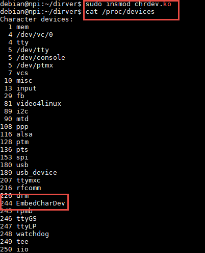

我们从/proc/devices文件中，可以看到我们注册的字符设备EmbedCharDev的主设备号为244。

mknod /dev/chrdev c 244 0

使用mknod命令来创建一个新的设备chrdev，见下图。

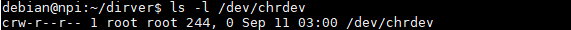

运行chrdev_test，测试程序，效果见下图。

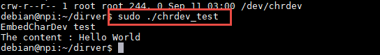

实际上，我们也可以通过echo或者cat命令，来测试我们的设备驱动程序。

echo "EmbedCharDev test" > /dev/chrdev
如果没有获取su的权限 也可以这样使用 sudo sh -c "echo 'EmbedCharDev test' > /dev/chrdev"

cat /dev/chrdev

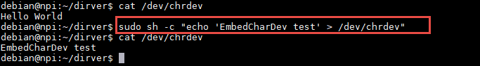

当我们不需要该内核模块的时候，我们可以执行以下命令：

rmmod chrdev.ko

rm /dev/chrdev

使用命令rmmod，卸载内核模块，并且删除相应的设备文件。

一个驱动支持多个设备
~~~~~~~~~~~~~~~~~~~~~~~~~~~~~~

在Linux内核中，主设备号用于标识设备对应的驱动程序，告诉Linux内核使用哪一个驱动程序为该设备服务。但是，
次设备号表示了同类设备的各个设备。每个设备的功能都是不一样的。如何能够用一个驱动程序去控制各种设备呢？
很明显，首先，我们可以根据次设备号，来区分各种设备；其次，就是前文提到过的file结构体的私有数据成员private_data。
我们可以通过该成员来做文章，不难想到为什么只有open函数和close函数的形参才有file结构体，
因为驱动程序第一个执行的是操作就是open，通过open函数就可以控制我们想要驱动的底层硬件。

硬件介绍
------------------------------

本节实验使用到 EBF6ULL-PRO 开发板上

实验代码讲解
------------------------------

实现方式一 管理各种的数据缓冲区
^^^^^^^^^^^^^^^^^^^^^^^^^^^^^^
下面介绍第一种实现方式，将我们的上一节程序改善一下，生成了两个设备，各自管理各自的数据缓冲区。

**本章的示例代码目录为：base_code/linux_driver/EmbedCharDev/1_SupportMoreDev/**

.. code-block:: c
   :caption: chrdev.c修改部分（位于../base_code/linux_driver/EmbedCharDev/1_SupportMoreDev/chrdev.c）
   :linenos:

   #define DEV_NAME "EmbedCharDev"
   #define DEV_CNT (2) (1)
   #define BUFF_SIZE 128
   //定义字符设备的设备号
   static dev_t devno;
   //定义字符设备结构体chr_dev
   static struct cdev chr_dev;
   //数据缓冲区
   static char vbuf1[BUFF_SIZE]; (2)
    static char vbuf2[BUFF_SIZE]; (3)

- 第2行：修改了宏定义DEV_CNT，将原本的个数1改为2，这样的话，我们的驱动程序便可以管理两个设备。
- 第9-10行：处修改为两个数据缓冲区。

.. code-block:: c
   :caption: chr_dev_open函数修改（位于../base_code/linux_driver/EmbedCharDev/1_SupportMoreDev/chrdev.c）
   :linenos:

   static int chr_dev_open(struct inode *inode, struct file *filp)
   {
      printk("\nopen\n ");
      switch (MINOR(inode->i_rdev)) {
         case 0 : {
            filp->private_data = vbuf1;
            break;
         }
         case 1 : {
            filp->private_data = vbuf2;
            break;
         }
      }
      return 0;
   }

我们知道inode结构体中，对于设备文件的设备号会被保存到其成员i_rdev中。

- 第4行：在chr_dev_open函数中，我们使用宏定义MINOR来获取该设备文件的次设备号，使用private_data指向各自的数据缓冲区。
- 第5-12行：对于次设备号为0的设备，负责管理vbuf1的数据，对于次设备号为1的设备，则用于管理vbuf2的数据，这样就实现了同一个设备驱动，管理多个设备了。

接下来，我们的驱动只需要对private_data进行读写即可。

.. code-block:: c
   :caption: chr_dev_write函数（位于../base_code/linux_driver/EmbedCharDev/1_SupportMoreDev/chrdev.c）
   :linenos:

   static ssize_t chr_dev_write(struct file *filp, const char __user * buf, size_t count, loff_t *ppos)
   {
      unsigned long p = *ppos;
      int ret;
      char *vbuf = filp->private_data;
      int tmp = count ;
      if (p > BUFF_SIZE)
         return 0;
      if (tmp > BUFF_SIZE - p)
         tmp = BUFF_SIZE - p;
      ret = copy_from_user(vbuf, buf, tmp);
      *ppos += tmp;
      return tmp;
   }

可以看到，我们的chr_dev_write函数改动很小，只是增加了第5行的代码，将原先vbuf数据指向了private_data，这样的话，
当我们往次设备号为0的设备写数据时，就会往vbuf1中写入数据。次设备号为1的设备写数据，也是同样的道理。

.. code-block:: c
   :caption: chr_dev_read函数（位于../base_code/linux_driver/EmbedCharDev/1_SupportMoreDev/chrdev.c）
   :linenos:

   static ssize_t chr_dev_read(struct file *filp, char __user * buf, size_t count, loff_t *ppos)
   {
      unsigned long p = *ppos;
      int ret;
      int tmp = count ;
      char *vbuf = filp->private_data;
      if (p >= BUFF_SIZE)
         return 0;
      if (tmp > BUFF_SIZE - p)
         tmp = BUFF_SIZE - p;
      ret = copy_to_user(buf, vbuf+p, tmp);
      *ppos +=tmp;
      return tmp;
   }

同样的，chr_dev_read函数也只是增加了第6行的代码，将原先的vbuf指向了private_data成员。

实现方式二 i_cdev变量
^^^^^^^^^^^^^^^^^^^^^^^^^^^^^^
我们回忆一下，我们前面讲到的文件节点inode中的成员i_cdev，为了方便访问设备文件，在打开文件过程中，
将对应的字符设备结构体cdev保存到该变量中，那么我们也可以通过该变量来做文章。

**本章的示例代码目录为：base_code/linux_driver/EmbedCharDev/2_SupportMoreDev/**

.. code-block:: c
   :caption: 定义设备（位于../base_code/linux_driver/EmbedCharDev/2_SupportMoreDev/chrdev.c）
   :linenos:

   /*虚拟字符设备*/
   struct chr_dev {
   struct cdev dev;
   char vbuf[BUFF_SIZE];
   };
   //字符设备1
   static struct chr_dev vcdev1;
   //字符设备2
   static struct chr_dev vcdev2;

以上代码中定义了一个新的结构体struct chr_dev，它有两个结构体成员：字符设备结构体dev以及设备对应的数据缓冲区。
使用新的结构体类型struct chr_dev定义两个虚拟设备vcdev1以及vcdev2。

.. code-block:: c
   :caption: chrdev_init函数（位于../base_code/linux_driver/EmbedCharDev/2_SupportMoreDev/chrdev.c）
   :linenos:

   static int __init chrdev_init(void)
   {
      int ret;
      printk("4 chrdev init\n");
      ret = alloc_chrdev_region(&devno, 0, DEV_CNT, DEV_NAME);
      if (ret < 0)
         goto alloc_err;
      //关联第一个设备：vdev1
      cdev_init(&vcdev1.dev, &chr_dev_fops);
      ret = cdev_add(&vcdev1.dev, devno+0, 1);
      if (ret < 0) {
         printk("fail to add vcdev1 ");
         goto add_err1;
      }
      //关联第二个设备：vdev2
      cdev_init(&vcdev2.dev, &chr_dev_fops);
      ret = cdev_add(&vcdev2.dev, devno+1, 1);
      if (ret < 0) {
         printk("fail to add vcdev2 ");
         goto add_err2;
      }
      return 0;
      add_err2:
      cdev_del(&(vcdev1.dev));
      add_err1:
      unregister_chrdev_region(devno, DEV_CNT);
      alloc_err:
      return ret;
   }

chrdev_init函数的框架仍然没有什么变化。

- 第10、17行：在添加字符设备时，使用cdev_add依次添加。
- 第23-24行：当虚拟设备1添加失败时，直接返回的时候，只需要注销申请到的设备号即可。
- 第25-26行：若虚拟设备2添加失败，则需要把虚拟设备1移除，再将申请的设备号注销。

.. code-block:: c
   :caption: chrdev_exit函数（位于../base_code/linux_driver/EmbedCharDev/2_SupportMoreDev/chrdev.c）
   :linenos:

   static void __exit chrdev_exit(void)
   {
      printk("chrdev exit\n");
      unregister_chrdev_region(devno, DEV_CNT);
      cdev_del(&(vcdev1.dev));
      cdev_del(&(vcdev2.dev));
   }

chrdev_exit函数注销了申请到的设备号，使用cdev_del移动两个虚拟设备。

.. code-block:: c
   :caption: chr_dev_open以及chr_dev_release函数（位于../base_code/linux_driver/EmbedCharDev/2_SupportMoreDev/chrdev.c）
   :linenos:

   static int chr_dev_open(struct inode *inode, struct file *filp)
   {
      printk("open\n");
      filp->private_data = container_of(inode->i_cdev, struct chr_dev, dev);
      return 0;
   }
   static int chr_dev_release(struct inode *inode, struct file *filp)
   {
      printk("release\n");
      return 0;
   }

我们知道inode中的i_cdev成员保存了对应字符设备结构体的地址，但是我们的虚拟设备是把cdev封装起来的一个结构体，
我们要如何能够得到虚拟设备的数据缓冲区呢？为此，Linux提供了一个宏定义container_of，该宏可以根据结构体的某个成员的地址，
来得到该结构体的地址。该宏需要三个参数，分别是代表结构体成员的真实地址，结构体的类型以及结构体成员的名字。
在chr_dev_open函数中，我们需要通过inode的i_cdev成员，来得到对应的虚拟设备结构体，并保存到文件指针filp的私有数据成员中。
假如，我们打开虚拟设备1，那么inode->i_cdev便指向了vcdev1的成员dev，利用container_of宏，
我们就可以得到vcdev1结构体的地址，也就可以操作对应的数据缓冲区了。

.. code-block:: c
   :caption: chr_dev_write函数（位于../base_code/linux_driver/EmbedCharDev/2_SupportMoreDev/chrdev.c）
   :linenos:

   static ssize_t chr_dev_write(struct file *filp, const char __user * buf, size_t count, loff_t *ppos)
   {
      unsigned long p = *ppos;
      int ret;
      //获取文件的私有数据
      struct chr_dev *dev = filp->private_data;
      char *vbuf = dev->vbuf;
      int tmp = count ;
      if (p > BUFF_SIZE)
         return 0;
      if (tmp > BUFF_SIZE - p)
         tmp = BUFF_SIZE - p;
      ret = copy_from_user(vbuf, buf, tmp);
      *ppos += tmp;
      return tmp;
   }

对比第一种方法，实际上只是新增了第6行代码，通过文件指针filp的成员private_data得到相应的虚拟设备。
修改第7行的代码，定义了char类型的指针变量，指向对应设备的数据缓冲区。

.. code-block:: c
   :caption: chr_dev_read函数（位于../base_code/linux_driver/EmbedCharDev/2_SupportMoreDev/chrdev.c）
   :linenos:

   static ssize_t chr_dev_read(struct file *filp, char __user * buf, size_t count, loff_t *ppos)
   {
      unsigned long p = *ppos;
      int ret;
      int tmp = count ;
      //获取文件的私有数据
      struct chr_dev *dev = filp->private_data;
      char *vbuf = dev->vbuf;
      if (p >= BUFF_SIZE)
         return 0;
      if (tmp > BUFF_SIZE - p)
         tmp = BUFF_SIZE - p;
      ret = copy_to_user(buf, vbuf+p, tmp);
      *ppos +=tmp;
      return tmp;
   }

读函数，与写函数的改动部分基本一致，这里就只贴出代码，不进行讲解。

实验准备
------------------------------
分别获取两个种方式的内核模块源码，将配套代码 /base_code/linux_driver/CharDev下 1_SupportMoreDev和2_SupportMoreDev 解压到内核代码同级目录。

makefile说明
^^^^^^^^^^^^^^^^^^^^^^^^^^^^^^

至于Makefile文件，与上一小节的相同，这里便不再罗列出来了。

编译命令说明
^^^^^^^^^^^^^^^^^^^^^^^^^^^^^^
在实验目录下输入如下命令来编译驱动模块：

.. code:: bash

    make

编译成功后，实验目录下会分别生成驱动模块文件

程序运行结果
------------------------------
通过NFS或者SCP将编译好的驱动模块拷贝到开发板中

下面我们
使用cat以及echo命令，对我们的驱动程序进行测试。

insmod chrdev.ko

mknod /dev/chrdev1 c 244 0

mknod /dev/chrdev2 c 244 1

通过以上命令，加载了新的内核模块，同时创建了两个新的字符设备，分
别是/dev/chrdev1和/dev/chrdev2，开始进行读写测试：

echo "hello world" > /dev/chrdev1
或者 sudo sh -c "echo 'hello world' > /dev/chrdev1"

echo "123456" > /dev/chrdev2
或者 sudo sh -c "echo '123456' > /dev/chrdev2"

cat /dev/chrdev1

cat /dev/chrdev2

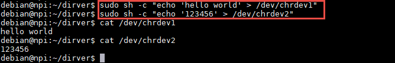

可以看到设备chrdev1中保存了字符串“hello world”，而设备chrdev2中保存了字符串“123456”。
只需要几行代码，就可以实现一个驱动程序，控制多个设备。

总结一下，一个驱动支持多个设备的具体实现方式的重点在于如何运用file的私有数据成员。
第一种方法是通过将各自的数据缓冲区放到该成员中，在读写函数的时候，直接就可以对相应的数据缓冲区进行操作；
第二种方法则是通过将我们的数据缓冲区和字符设备结构体封装到一起，由于文件结构体inode的成员i_cdev保存了对应字符设备结构体，
使用container_of宏便可以获得封装后的结构体的地址，进而得到相应的数据缓冲区。

到这里，字符设备驱动就已经讲解完毕了。如果你发现自己有好多不理解的地方，学完本章之后，建议重新梳理一下整个过程，
有助于加深对整个字符设备驱动框架的理解。
