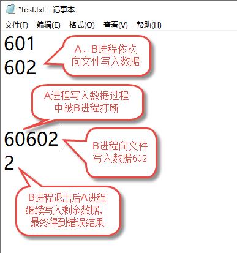
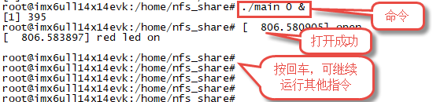
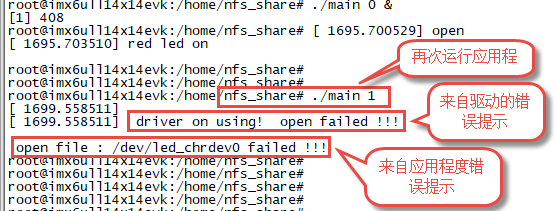
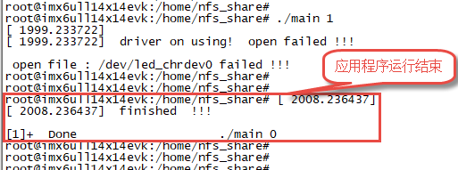
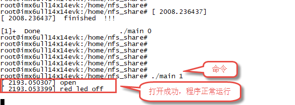
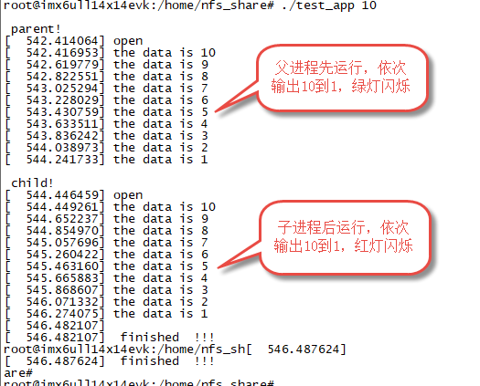
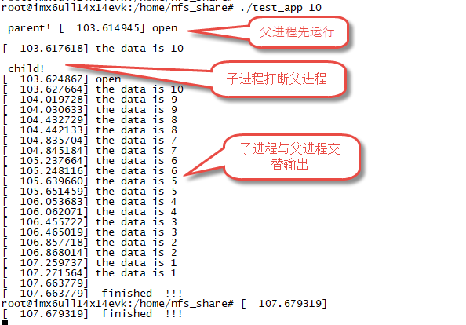
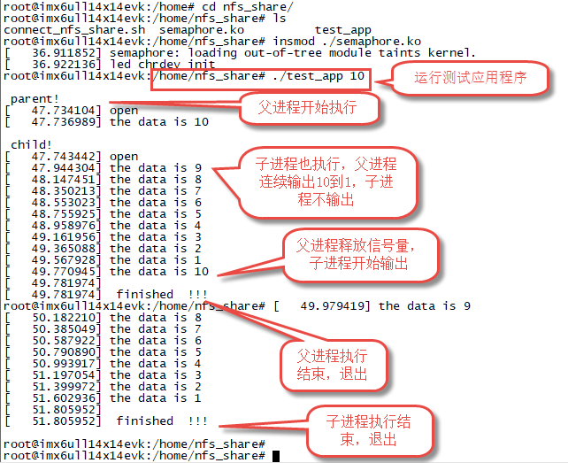

.. vim: syntax=rst

linux驱动并发与竞态
------------

并发是指多个执行单元同时、并行执行，而并发的执行单元对共享资源(硬件资源和软件上的全局变量、静态变量等)的访问
则很容易导致竞态。对于多核系统，很容易理解，由于多个CPU同时执行，多个CPU同时读、写共享资源时很容易造成竞态。
对于单核系统（例如我们的i.mx6ull），属于“宏观并行，微观串行”，虽然没有真正的“并行”执行，
但是linux系统是多任务系统，linux2.6以及更高版本的内核是抢占式内核，高优先级的任务可以打断低优先级的任务，
再加上中断的存在在单核系统中同样存在竞态的问题。

竞态的产生
~~~~~

竞态的定义是在并发的执行单元对共享资源(硬件资源和软件上的全局变量、静态变量等)的访问。
对应到我们的linux系统就是多个线程对于共享资源的相互竞争访问，而不是按照一定的顺序访问；从而造成不可控的错误，
从竞态的定义可知，竞态产生需要两个条件，第一，存在共享资源，第二，对于共享资源进行竞争访问。

在linux系统中可被多个线程访问的内容都可被称为共享资源，比如一个文件、一块内存、全局变量。
linux系统中一切皆文件，我们编写的驱动在系统中对应一个设备节点文件，从应用程序角度看，驱动也是共享资源。
竞争访问对于单核linux系统主要表现为抢占式内核以及中断。linux2.6及更高版本引入了抢占式内核，
高优先级的任务可以打断低优先级的任务。在线程访问共享资源的时候，另一个线程打断了现在正在访问共享资源的线程同时也对共享
资源进行操作，从宏观角度上来看两个线程对共享资源的访问是“同时”的，存在着竞争关系，
同样也存在线程和中断的“同时”访问共享资源的情况。

**举例1**

从C语言变量访问的角度来理解竞态的产生过程，代码如下：

.. code-block:: c

   //C语言代码
   进程一：i=10
   进程二：i=20

   //汇编代码
   进程一：
   ldr r0, =0X30000000 /* i 变量的内存地址 */
   ldr r1, = 10 /* 要写入的值 */
   str r1, [r0] /* 将 10 写入到 i 变量中 */

   进程二：
   ldr r0, =0X30000000 /* i 变量的内存地址 */
   ldr r1, = 20 /* 要写入的值 */
   str r1, [r0] /* 将 20 写入到 i 变量中 */

假设在系统中存在着进程1和进程2，进程1的内容是对全局变量i进行赋值操作，
进程2也是对全局变量i进行赋值操作。在编译过程中，对变量i的操作变成了多条机器指令，
若进程1对i的赋值进行到一半被进程2打断，那么对于变量i的值是不确定的，可能是10也可能是20。

**举例2**

以文件读写为例简单理解竞态的产生过程，如下图所示

假设进程A和进程B不断的读取、转换同一传感器传回的数据，并将结果记录到文本文件中，B进程优先级高于A进程。
假设A进程得到的是“601”，B进程得到的是“602”。正常情况下文本文件新增两条记录“601”和“602”。
但是在A进程写入“602”过程中B进程准备就绪将A进程打断，然后在文件中写入“601”B进程退出后A进程继续写入，
最终文件中增加的两条数据可能是“60602”“1”。

竞态的解决方法
~~~~~~~

解决竞态的主要路径是当有一个执行单元在访问共享资源时，其他的执行单元禁止访问，
根据共享资源的种类以及实际应用场景我们有多种解决方法可选，常用的几种方式介绍如下。

**原子操作**

“原子”的定义是“化学反应不可再分的基本微粒”，“原子操作”可以理解为“不可拆分的操作”。
原子操作保证了对于一个整型数据的修改是不可分割的，它的实现与CPU的架构息息相关，对于ARM处理器而言，底层使用LDREX和
STREX指令，而Linux内核提供了一系列函数来实现内核中的原子操作，我们只需要调用相对应的函数即可进行原子操作。
原子操作进一步细分为“整型原子操作”和“位原子操作”，两者都只能保护“整型”数据。

**自旋锁**

自旋锁是实现互斥访问的常用手段，在一些实时操作系统中也经常用到。自旋锁主要操作分为定义自旋锁、初始化自旋锁、
获取自旋锁、释放自旋锁。 “自旋锁”的作用是给一段代码“加锁”。获取自旋锁成功后才能运行被保护的代码，运行结束后释放自旋锁。
“自旋”是指获取自旋锁失败后会一直轮询检测锁的状态，直到自旋锁被释放。CPU在等待自旋锁时不做任何有用的工作，仅仅是等待。

自旋锁的缺点是自旋锁失败后会循环检测自旋锁的状态，占用系统资源。
同时应该避免自旋锁导致系统死锁，既在递归调用时，递归使用自旋锁。如果一个已经拥有自旋锁的线程想第二次获取这个自旋锁，
那么将导致死锁的情况。自旋锁在锁定期间不能调用可能引起进程调度的函数，不然可能导致内核崩溃。
优点是实现简单、不需要休眠、可以在中断中使用。

**信号量**

信号量是操作系统中最典型的用于同步和互斥的手段，信号量的值可以是0、1或者n;
信号量的使用一般分为定义信号量、初始化信号量、尝试获取信号量、获取信号量和释放信号量。
对比“自旋锁”使用方法差异不大，两者差异主要表现在申请失败后的处理方式，自旋锁申请失败后会轮询检测锁的状态，
而信号量申请失败后进程可引入休眠，当信号量可用时由系统通知进程退出休眠。

由于信号量无需轮询检测信号量状态所以它不会造成系统资源的浪费，缺点是会引起进程的休眠所以不能在中断中使用。
信号量的“量值”可以是多个所以它可以同时保护多个资源。例如有5个缓冲区，使用信号量时将“量值”设置为5每获取一次“量值”减一，
释放一次“量值”加一。当信号量的值为0时，该线程将进入等待状态，直到信号量释放唤醒。

**互斥体**

信号量已经实现了互斥的功能了，互斥体可以说是“量值”为1的信号量。把信号量的“量值”设置为1就行了那为什么还要引入互斥体呢？
很简单，虽然两者功能相同但是具体实现不同，互斥体效率更高。在使用信号量时，如果“量值”为1，考虑到效率，
我们一般将其改为使用互斥体实现。

原子操作函数（宏定义）及实验
~~~~~~~~~~~~~~~~~

原子操作分为整型原子操作和位原子操作。使用方法非常类似，本小节介绍分别
介绍整型原子操作和位原子操作的函数（确切的说某些是宏定义）。测试实验仅
用整型原子操作，读者可自行使用位原子操作实现,实验源码位于“**~/base_code/linux_driver/concurrency/atomic**” 。

整型原子操作函数（宏定义）介绍
^^^^^^^^^^^^^^^

定义整型原子变量并设置初始值
''''''''''''''''''''''''''''

.. code-block:: c

   //atomic_t类型结构体
   typedef struct {
      int counter;
   } atomic_t;

   #define ATOMIC_INIT(i)	{ (i) }

   atomic_t data = ATOMIC_INIT(int i);

**参数**：  

- **i**： 设置整型原子变量的初始值

**atomic_t类型**： 暂且称为“整型原子类型”，我们用它定义整型原子变量。

设置整型原子变量的值
''''''''''''''''

.. code-block:: c

   #define atomic_set(v, i)		WRITE_ONCE(((v)->counter), (i))

**参数**：

- **v**：要设置的整型原子变量的指针（地址）。
- **i**：设置的值。

获取原子变量的值
''''''''''''''''

.. code-block:: c

   #define atomic_read(v) ACCESS_ONCE((v)->counter)

   atomic_read(atomic_t* v)

**参数**：

- **v**：要获取的整型原子变量的指针。

**返回值**：获取到的整型原子变量的值

整型原子变量的加/减
''''''''''''''''''''

.. code-block:: c

   void atomic_add(int i, atomic_t *v); //整型原子变量加i
   void atomic_sub(int i, atomic_t *v); //整型原子变量减i

**参数**：

- **v**：要设置的整型原子变量的指针（地址）。
- **i**： 设置的值。

**返回值**：**无**

整型原子变量自增/自减
''''''''''''''''''''

.. code-block:: c

   void atomic_inc(atomic_t *v); //整型原子变量自增1
   void atomic_dec(atomic_t *v);//整型原子变量自减1

**参数**：

- **v**：要设置的整型原子变量的指针（地址）。

**返回值**：**无**

整型原子变量操作返回函数（宏定义）
''''''''''''''''''''''''''

.. code-block:: c

   int atomic_add_return(int i, atomic_t *v); //返回增加后的结果
   int atomic_sub_return(int i, atomic_t *v); //返回减少后的结果

**参数**：

- **v**：要设置的整型原子变量的指针（地址）。
- **i**: 要进行加/减操作的大小

**返回值**：返回加/减计算后的结果

.. code-block:: c

   #define atomic_inc_return(v) atomic_add_return(1, (v))//返回自增1的结果
   #define atomic_dec_return(v) atomic_sub_return(1, (v)) //返回自减1的结果

**参数**：

- **v**：要设置的整型原子变量的指针（地址）。

**返回值**：
返回自增1/自减1后的结果

整型原子变量测试函数（宏定义）
''''''''''''''''''''''''''

.. code-block:: c

   /*整型原子变量减i后是否为0*/
   #define atomic_sub_and_test(i, v) (atomic_sub_return((i), (v)) == 0)
   /*整型原子变量自减1后是否为0*/
   #define atomic_dec_and_test(v) (atomic_dec_return(v) == 0)
   /*整型原子变量自加1后是否为0*/
   #define atomic_inc_and_test(v) (atomic_inc_return(v) == 0)

**参数**：

- **v**：要设置的整型原子变量的指针（地址）。
- **i**：要进行加/减操作的大小

**返回值**：
进行运算后的结果如果为0，则返回true，否则返回false

位原子操作函数（宏定义）介绍
^^^^^^^^^^^^^^^

设置位
'''''''''''''''''''

.. code-block:: c

   void set_bit(int nr, unsigned long *addr)

**参数**：

- **addr**：指定要设置的地址。
- **nr**：指定设置哪一位 ，如果地址指定的数据是32位的，那么nr可取0~31。

**返回值**：**无**

设置位作用是将某一位置1。

清除位
''''''''''''''

.. code-block:: c

   void clear_bit(int nr, unsigned long *addr)

**参数**：

- **addr**：指定要设置的地址。
- **nr**：指定清除哪一位 ，如果地址指定的数据是32位的，那么nr可取0~31。

**返回值**：**无**

清除位作用是将某一位清0。

改变位
''''''''

.. code-block:: c

   void change_bit(int nr, unsigned long *addr);

**参数**：

- **addr**：指定要设置的地址。
- **nr**：指定翻转哪一位 ，如果地址指定的数据是32位的，那么nr可取0~31。

**返回值**：**无**

改变位作用就是翻转某一位的值，是0就变为1，是1就变为0。

测试位
'''''''''''''

.. code-block:: c

   int test_bit(int nr, const volatile unsigned long *addr)

**参数**：

- **addr**：指定要设置的地址。
- **nr**：指定获取哪一位 ，如果地址指定的数据是32位的，那么nr可取0~31。

**返回值**：返回nr位的值

测试位作用就是获取某一位的值。

测试并操作位
''''''''''''''

.. code-block:: c

   /*测试并设置位*/

   int test_and_set_bit(int nr, volatile unsigned long *addr);
   /*测试并清除位*/
   int test_and_clear_bit(int nr, volatile unsigned long *addr);
   /*测试并反转位*/
   int test_and_change_bit(int nr, volatile unsigned long *addr);

上述函数等同于先执行test_bit函数然后再执行xxx_bit函数（xxx,指 set、clear、change）

**参数**：

- **addr**：指定要设置的地址。
- **nr**：指定获取哪一位 ，如果地址指定的数据是32位的，那么nr可取0~31。

**返回值**：返回nr位的值

原子操作函数（宏定义）很多，但都非常简单，特别注意的是在程序中要使用以上提供的函数实现想要的功能，
切记不能自行使用“+”、“-”等等操作原子操作数。

整型原子操作实验
^^^^^^^^^^^^^^

本实验使用整型原子变量保护驱动程序不被多次打开，既驱动打开一次之后，在退
出之前其他进程无法再次打开驱动。实验在“~/base_code/linux_driver/led_cdev”字符设备驱动基础上修改得到，修改的主要的内容
包括在在驱动中添加整型原子操作、添加测试应用程序。修改完成后的源码位于“**~/base_code/linux_driver/concurrency/atomic**”

修改驱动程序
''''''

只需要在驱动程序的.open和.release函数中添加整型原子相关操作即可，修改之后的源码如下所示（省略了大量未修改的代码）。

.. code-block:: c
   :caption: 驱动程序修改内容
   :linenos:  

   /*---------------以下代码省略-----------------*/
   
   /*---------------第一部分-----------------*/
   static atomic_t test_atomic = ATOMIC_INIT(1);
   
   static int led_chrdev_open(struct inode *inode, struct file *filp)
   {
   
       /*---------------以下代码省略-----------------*/
   
       /*---------------第二部分-----------------*/
   
   	if(atomic_read(&test_atomic))
   	{
   		atomic_set(&test_atomic,0);
   	}
       else
       {
   		printk("\n driver on using!  open failed !!!\n");
   		return - EBUSY;
       }
       
       
   	printk("open \n");
       /*---------------以下代码省略-----------------*/
   
   	return 0;
   }
   
   static int led_chrdev_release(struct inode *inode, struct file *filp)
   {
       /*---------------以下代码省略-----------------*/
   
       /*---------------第三部分-----------------*/
       atomic_set(&test_atomic,1);
   	printk("\n finished  !!!\n");
   
   	return 0;
   }
   
   
   static struct file_operations led_chrdev_fops = {
   	.owner = THIS_MODULE,
   	.open = led_chrdev_open,
   	.release = led_chrdev_release,
   	.write = led_chrdev_write,
   };

相比原驱动，修改内容很少。结合代码介绍如下：

- 代码第4行：定义并初始化整型原子变量。初始值设置为1，表示驱动还未被占用。
- 代码13-21行：在.open函数的开始处添加多整型原子变量值的检测，如果为1则将其设置为0（表示驱动已经被占用）并继续正常运行。
  否则输出提示信息“driver on using! open failed !!!”并返回 “- EBUSY”错误码表示驱动已经被打开并且没有退出。
- 代码30-39行：在.release函数的末尾使用atomic_set将整型原子变量的值重新设置为1，表示已经退出。

编译驱动程序：

.. code-block:: c

   make ARCH=arm CROSS_COMPILE=arm-linux-gnueabihf-

编写测试应用程序
''''''''

测试应用程序的目的是验证整型原子变量能否保护驱动程序不被多次打开。测试程序源码如下所示，完整内容请参考本小节配套例程。

.. code-block:: c
   :caption: 整型原子变量测试应用程序
   :linenos:  

   int main(int argc, char *argv[])
   {
   
       /*--------------第一部分---------------*/
       /*判断输入的命令是否合法*/
       if(argc != 2)
       {
           printf(" commend error ! \n");
           return -1;
       }
   
       /*--------------第二部分---------------*/
       /*打开文件*/
       int fd = open("/dev/led_chrdev0", O_RDWR);
       if(fd < 0)
       {
   		printf("open file : %s failed !\n", argv[0]);
   		return -1;
   	}
       
       /*--------------第三部分---------------*/
       /*判断命令的有效性*/
       /*写入命令*/
       int error = write(fd,argv[1],sizeof(argv[1]));
       if(error < 0)
       {
           printf("write file error! \n");
           close(fd);
           /*判断是否关闭成功*/
       }
   
       /*--------------第四部分---------------*/
       sleep(15);  //休眠5秒
   
       /*关闭文件*/
       error = close(fd);
       if(error < 0)
       {
           printf("close file error! \n");
       }
       return 0;
   }

代码大致分为四部分，介绍如下：

- 代码6-10行：第一部分，检测输入的命令是否合法，在运行应用程序时需要传递一个参数，
  格式是“./<应用程序路径> <参数>”。为简化代码这里只是检测输入的命令长度是否为2。
- 代码14-19行：打开led灯的设备节点文件。在驱动中我们使用一个主设备号和三个次设备号三个LED灯的设备节点文件是独立的，
  我们这里只使用红灯的设备节点文件“led_chrdev0”
- 代码24-30行：使用“write”函数写入命令。
- 代码33行：休眠15秒。休眠的目的是模拟驱动程序正在被使用，休眠时间可根据需要自己设定。

编译应用程序：

编译命令：

.. code-block:: c

   arm-linux-gnueabihf-gcc <源文件路径> -o <输出文件名>

以本实验为例，源文件名“main.c”则在源码目录下的编译命令为：

.. code-block:: c

   arm-linux-gnueabihf-gcc ./main.c -o main

下载验证
''''

将前两小节编译得到的驱动程序和应用程序拷贝到开发板中。
（推荐使用NFS共享文件夹，如果无法连接开发板和电脑可以先将程序拷贝到U盘或者SD卡，然后再将它们挂载到开发板）。

加载驱动程序

以本章配套源码为例，加载命令：

.. code-block:: c

   insmod ./led_cdev.ko

运行应用程序开始测试

我们的目的是测试驱动程序能否被打开两次，首先在后台运行应用程序“./main 0 &”，这个程序将会运行15秒，
在十五秒之内再次运行“./main 1 &”，正常情况下由于第一次程序还没有退出第二次会打开失败。实际实现现象如下所示。

1. 在后台运行测试应用程序并点亮led灯

命令：

.. code-block:: c

   ./main 0 &

执行结果如下所示：

2. 在上一个应用程序退出之前再次运行应用程序

命令：

.. code-block:: c

   ./main 1

执行结果如下所示：

3. 等待应用程序运行结束。

4. 等待结束后再次运行应用程序

命令：

从上面实验可以看出，第一次运行的应用程序释放驱动之前其他
线程是无法打开驱动的。实现了我们的预定目标。

自旋锁操作函数（宏定义）及实验
~~~~~~~~~~~~~~~

和整型原子变量类似，linux提供了一系列函数（宏定义）来操作自旋锁。
我们先介绍自旋锁相关的函数然后在整型原子变量实验基础上完成实验。
实验源码位于“**~/base_code/linux_driver/concurrency/spinlock**”

自旋锁相关函数
^^^^^^^

定义自旋锁
'''''''''

.. code-block:: c

   typedef struct {
      struct lock_impl internal_lock;
   } spinlock_t;

spinlock_t用来描述自旋锁结构体，使用自旋锁前应先定义一个spinlock_t类型的变量。

初始化自旋锁
''''''''''''

.. code-block:: c

   void spin_lock_init(spinlock_t *lock);

**参数：**

- **lock**：spinlock_t类型指针。

**返回值**：**无**

该函数用来初始化自旋锁。

获取自旋锁
''''''''''''

linux提供了两种获得自旋锁的方法，介绍如下：

**获取自旋锁函数**：

.. code-block:: c

   void spin_lock(spinlock_t *lock);

**参数：**

- **lock**：spinlock_t类型指针。

**返回值**：**无**

获取自旋锁成功则继续向下执行，否则进行将会一直轮询检测直到获取成功。

**尝试获取自旋锁函数**：

.. code-block:: c

   int spin_trylock(spinlock_t *lock);

**参数：**

- **lock**：spinlock_t类型指针。

**返回值**：

- **成功**：返回“true”
- **失败**：返回“false”

无论返回的结果如何程序都会继续向下执行。

释放自旋锁
''''''''''''

.. code-block:: c

   void spin_unlock(spinlock_t *lock);

**参数：**

- **lock**：spinlock_t类型指针。

**返回值**：**无**

释放自旋锁函数和获取自旋锁函数一般成对存在。

以上自旋锁操作函数（宏定义）只能解决来自别的CPU和进程间的抢占（抢占式内核），CPU不受控制。简单来说，
函数spin_lock只是关闭了linux 内核的抢占调度，并没有关闭中断，如果想要把中断关掉，需要使如下函数。

获取自旋锁并关中断
''''''''''''''''''''

.. code-block:: c

   void spin_lock_irq(spinlock_t *lock);

**参数：**

- **lock**：spinlock_t类型指针。

**返回值**：**无**

此函数相当于同时执行获取自旋锁函数“spin_lock”和关中断函数“local_irq_disable”。

释放自旋锁并开中断
''''''''''''''''''

.. code-block:: c

   void spin_unlock_irq(spinlock_t *lock);

**参数：**

- **lock**：spinlock_t类型指针。

**返回值**：**无**

此函数与上一个函数“spin_lock_irq”成对存在，用法相似。

获取自旋锁并保存中断状态字
'''''''''''''''''''''''''

.. code-block:: c

   spin_lock_irqsave(lock, flags)

**参数：**

- **lock**：指定自旋锁。
- **flags**：指定中断状态字。

我们还没有介绍中断，该函数不过多介绍，使用到时我们再详细介绍。
与它成对使用的函数还有“spin_unlock_irqrestore”释放自旋锁并恢复中断状态字。

自旋锁测试实验
^^^^^^^

与原子操作实验类似，我们在字符设备驱动基础上完成该实验。修改之前的字符设备
驱动源码“~/base_code/linux_driver/led_cdev”。修改的主要的内
容包括在在驱动中添加自旋锁、添加测试应用程序。修改完成后的源
码位于“**~/base_code/linux_driver/concurrency/spinlock**”。

修改Makefile文件
''''''''''''

将源文件名对应的.o文件添加到Makefile中，如下所示。

.. code-block:: c
   :caption: Makefile文件
   :linenos: 

   KERNEL_DIR = /home/fire2/ebf-buster-linux
   
   obj-m := spinlock.o
   
   all:
   	$(MAKE) -C $(KERNEL_DIR) M=$(CURDIR) modules
   	
   .PHONY:clean
   clean:
   	$(MAKE) -C $(KERNEL_DIR) M=$(CURDIR) clean
   
   	echo 1 >/dev/led_chrdev0

修改驱动程序
''''''

驱动程序修改内容较少，主要包括添加自旋锁、初始化自旋锁以及使用“上锁”、“释放锁”函数
保护一段代码。源码如下所示（只列出了修改内容，完整源码请参考配套历程）。

.. code-block:: c
   :caption: 自旋锁驱动程序修改内容
   :linenos:  

   #include <linux/init.h>
   #include <linux/module.h>
   #include <linux/cdev.h>
   #include <linux/fs.h>
   #include <linux/uaccess.h>
   #include <linux/io.h>
   #include <linux/delay.h>
   
   /*-------------以下代码省略-------------*/
   
   /*------------------第一部分修改，定义自旋锁---------------*/
   /*定义一个自旋锁*/
   spinlock_t s_lock;
   
   static ssize_t led_chrdev_write(struct file *filp, const char __user *buf,
   								size_t count, loff_t *ppos)
   {
   	unsigned long val = 0;
   	unsigned long ret = 0;
   	unsigned long i;
   
   	int tmp = count;
   
   	kstrtoul_from_user(buf, tmp, 10, &ret);
   	struct led_chrdev *led_cdev = (struct led_chrdev *)filp->private_data;
   
   /*------------------第二部分修改，保护“临界”资源 ---------------*/
   	spin_lock(&s_lock);
   	for (i = ret; i > 0; i--)
   	{
   		printk("the data is %ld \n", i);
   
   		/*点亮led 灯*/
   		val &= ~(0x01 << led_cdev->led_pin);
   		iowrite32(val, led_cdev->va_dr);
   		mdelay(100);
   
   		/*熄灭led 灯*/
   		val |= (0x01 << led_cdev->led_pin); 
   		iowrite32(val, led_cdev->va_dr);
   		mdelay(100);
   	}
   	spin_unlock(&s_lock);
   
   
   	*ppos += tmp;
   	return tmp;
   }
   
   static struct file_operations led_chrdev_fops = {
   	.owner = THIS_MODULE,
   	.open = led_chrdev_open,
   	.release = led_chrdev_release,
   	.write = led_chrdev_write,
   };
   
   
   
   /*驱动入口*/
   static __init int led_chrdev_init(void)
   {
   	int i = 0;
   	dev_t cur_dev;
       /*-------------以下代码省略-------------*/
   
   /*------------------第三部分修改，初始化自旋锁 ---------------*/
   	spin_lock_init(&s_lock);
   	return 0;
   }

程序中我们修改了三个地方，结合代码介绍如下：

- 代码13行：定义一个自旋锁。由于自旋锁要被两个进程调用，所有这里使用全局变量定义它。
- 代码28-43行：使用spin_lock函数和spin_unlock函数保护一段代码。根据自旋锁的特性，自旋锁不适合保护哪些耗时的操作，
  但是为更好的观察实现现象这里使用for循环和延时函数模拟一个耗时的过程，实际程序中不会这么做。
  这段代码会循环执行“ret”次，ret是我们运行应用程序时传入的一个参数，每次循环LED闪烁一次，间隔100ms。
- 代码67行：初始化自旋锁。自旋锁初始化放到了驱动程序的进入函数，防止被多次初始化。

编写测试应用程序
''''''''

测试应用程序的工作是启动两个线程，然后分别打开led灯设备节点文件“led_chrdev0”和led灯设备节点文件“led_chrdev1”。
“led_chrdev0”对应RGB灯的红灯，“led_chrdev1”对应RGB灯的绿灯，它们拥有相同的主设备号，在驱动中共用“.write”函数。
在上一小节我们在“.write”函数中添加了自旋锁，所以两个线程会“依次”通过“受保护的代码片段”。测试代码如下所示。

.. code-block:: c
   :caption: 自旋锁测试应用程序
   :linenos:  

   #include <stdio.h>
   #include <unistd.h>
   #include <fcntl.h>
   #include <string.h>
   
   /*多线程需要用到的头文件*/
   #include <sys/types.h>
   #include <unistd.h>
   
   int main(int argc, char *argv[])
   {
   
       pid_t pid; //用于保存 fork 函数返回的父、子线程的PID
       int fd;  //文件描述符
       
   /*---------------第一部分------------------*/
       /*判断输入的命令是否合法*/
       if (argc != 2)
       {
           printf(" commend error ! \n");
           return -1;
       }
   
   /*---------------第二部分------------------*/
       pid = fork();
       if (pid < 0)
       {
           /*fork 函数执行错误*/
           printf("\n fork error ！！\n");
           return -1;
       }
   
   /*---------------第三部分------------------*/
       if (0 == pid)
       {
           printf("\n child! \n");
           /*这里是子线程*/
           fd = open("/dev/led_chrdev0", O_RDWR); //打开设 "led_chrdev0"
           if (fd < 0)
           {
               printf("\n open file : /dev/led_chrdev0 failed !!!\n");
               return -1;
           }
   
           /*写入命令*/
           int error = write(fd, argv[1], sizeof(argv[1]));
           if (error < 0)
           {
               printf("write file error! \n");
               close(fd);
               /*判断是否关闭成功*/
           }
   
           /*关闭文件*/
           error = close(fd);
           if (error < 0)
           {
               printf("close file error! \n");
           }
       }
   /*---------------第四部分------------------*/
       else
       {
           printf("\n parent! \n");
           /*这里是父进程*/
           fd = open("/dev/led_chrdev1", O_RDWR); //打开设 "led_chrdev1"
           if (fd < 0)
           {
               printf("\n open file : /dev/led_chrdev1 failed !!!\n");
               return -1;
           }
   
           /*写入命令*/
           int error = write(fd, argv[1], sizeof(argv[1]));
           if (error < 0)
           {
               printf("write file error! \n");
               close(fd);
               /*判断是否关闭成功*/
           }
   
           /*关闭文件*/
           error = close(fd);
           if (error < 0)
           {
               printf("close file error! \n");
           }
       }
   
       return 0;
   }

代码大致分为四部分，结合代码介绍如下：

- 代码18-22行：判断命令长度是否符合要求。执行应用程序时要加一个参数指定循环次数，命令格式为“./<应用程序> <循环次数>”。
- 代码25-31行：使用函数fork创建子线程并检测创建是否成功。
- 代码34-60行：在子线程中依次打开、写入、关闭 “/dev/led_chrdev0”设备节点。
- 代码63-88行，在父线程中依次打开、写入、关闭“/dev/led_chrdev1”设别节点。

父进程与子进程都会调用“.write”函数，并且在.write函数中使用自旋锁保护了一段耗时的代码。

实验现象。
''''''''

在驱动所在目录下执行如下命令编译驱动：

编译命令：

.. code-block:: c

   make ARCH=arm CROSS_COMPILE=arm-linux-gnueabihf-

以本章配套源码为例，编译成功后会在源码目录下生成“spinlock.ko”文件，将其拷贝到开发板即可。

在应用程序所在目录下执行如下命令编译测试应用程序：

编译命令：

.. code-block:: c

   arm-linux-gnueabihf-gcc <源文件路径> -o <输出文件名>

以本实验为例，源文件名“test_app.c”则在源码目录下的编译命令为：

.. code-block:: c

   arm-linux-gnueabihf-gcc ./ test_app.c -o test_app

编译成功后将生成的“test_app”拷贝到开发板中。

测试步骤如下所示：

1. 加载驱动

.. code-block:: c

   执行“insmod <驱动所在路径>”加载驱动

2. 运行应用程序

.. code-block:: c

   执行 “./test_app 10”命令，执行结果如下所示：

信号量试验

控制台输出内容上图所示，输出的数字是连续的。开发板的现象是绿灯闪烁10次之后红灯闪烁。

3. 屏蔽掉自旋锁相关代码再次编译驱动，下载运行试验现象如下。

控制台输出内容上图所示，输出的数字是不连续的，父进程与子进程交替输出。开发板的现象是绿灯闪烁一次之后闪烁黄灯
（红色+绿色显示黄色），由于不同情况下子、父进程执行情况不同实现现象可能稍有差异。

信号量操作函数（宏定义）及试验
~~~~~~~~~~~~~~~

信号量与自旋锁的使用方法非常类似，包括定义信号量、初始化信号量、获取信号量、释放信号量。我们
先介绍信号量操作函数，然后编写程序测试程序深入理解信号量。实验源码位于“~/base_code/linux_driver/concurrency/semaphore”

信号量操作函数（宏定义）介绍
^^^^^^^^^^^^^^

定义信号量
'''''''''''''

结构体

.. code-block:: c

   struct semaphore {
   raw_spinlock_t    lock;
   unsigned int      count;
   struct list_head  wait_list;
   };

用于定义信号量。

初始化信号量
''''''''''''''

.. code-block:: c

   static inline void sema_init(struct semaphore *sem, int val);

**参数：**

- **参数sem**：指定要初始化的信号量。
- **参数val**：信号量的初始值。

**返回值**：**无**

获取信号量
''''''''''

.. code-block:: c

   void down(struct semaphore *sem);

**参数：**

- **参数sem**：指定要获取的信号量，

**返回值**：**无**

该函数每执行一次，信号量的值就会减1。如果申请时信号量已经为0则获取失败，
进程将会休眠并且不能被信号打断，该函数不能用在中断的上下文中。

.. code-block:: c

   int down_interruptible(struct semaphore *sem);

**参数：**

- **参数sem**：指定要获取的信号量，

**返回值**：**无**

函数down_interruptible和上面函数作用差不多，获取信号量失败同样会进入休眠，
但是休眠可以被信号打断，并且函数会返回非0值，该函数可以用在中断的上下文中而函数down不可以。

尝试获取信号量
'''''''''''''

.. code-block:: c

   int down_trylock(struct semaphore *sem);

**参数：**
- **参数sem**：指定要获取的额信号量，

**返回值**：

- **成功**：返回0
- **失败**：返回非零值

该函数不会导致进程休眠，可以用在中断的上下文中。

释放信号量
'''''''''''''

.. code-block:: c

   void up(struct semaphore *sem);

**参数：**

- **参数sem**：指定要释放的信号量，

**返回值**：**无**

该函数用于释放信号量，信号量加一。

信号量测试实验
^^^^^^^

信号量测试实验在自旋锁实验基础上修改得到。我们只需要修改驱动程序和Makefile文件，在驱动程序中使用信号量操作函
数替换自旋锁操作函数，在Makefiel中只需要修改目标文件名即可。
实验源码位于“**~/base_code/linux_driver/concurrency/semaphore**”

修改驱动程序
''''''

修改之后驱动代码如下所示。（这里只列出了部分代码，完整内容请参考本章配套历程）。

.. code-block:: c
   :caption: 信号量试验驱动部分代码
   :linenos:  

   #include <linux/init.h>
   #include <linux/module.h>
   #include <linux/cdev.h>
   #include <linux/fs.h>
   #include <linux/uaccess.h>
   #include <linux/io.h>
   #include <linux/delay.h>
   
   #define DEV_NAME "led_chrdev"
   #define DEV_CNT (3)
   
   static dev_t devno;
   struct class *led_chrdev_class;
   
   
   /*---------------第一部分------------------*/
   /*定义一个自旋锁*/
   // spinlock_t s_lock;
   struct semaphore sema_lock;
   
   static ssize_t led_chrdev_write(struct file *filp, const char __user *buf,
   								size_t count, loff_t *ppos)
   {
   
   /*----------------以下代码省略----------------*/
   
   /*---------------第二部分------------------*/
   	// spin_lock(&s_lock);
   	down(&sema_lock);
   	for (i = ret; i > 0; i--)
   	{
   		printk("the data is %ld \n", i);
   
   		/*点亮led 灯*/
   		val &= ~(0x01 << led_cdev->led_pin);
   		iowrite32(val, led_cdev->va_dr);
   		mdelay(100);
   
   		/*熄灭led 灯*/
   		val |= (0x01 << led_cdev->led_pin); 
   		iowrite32(val, led_cdev->va_dr);
   		mdelay(100);
   	}
   	// spin_unlock(&s_lock);
   	up(&sema_lock);
   
   	*ppos += tmp;
   	return tmp;
   }
   
   static struct file_operations led_chrdev_fops = {
   	.owner = THIS_MODULE,
   	.open = led_chrdev_open,
   	.release = led_chrdev_release,
   	.write = led_chrdev_write,
   };
   
   /*---------------第三部分------------------*/
   /*驱动入口*/
   static __init int led_chrdev_init(void)
   {
   /*----------------以下代码省略----------------*/
   	// spin_lock_init(&s_lock);
   	sema_init(&sema_lock, 1);
   	return 0;
   }

在驱动中修改了三部分内容，使用信号量操作函数替换掉自旋锁操作函数。

- 代码19行：定义了一个信号量sema_lock。
- 代码29行：在.write函数开头获取信号量。
- 代码45行：在.write函数末尾释放信号量。
- 代码64行：在模块的入口函数初始化信号为1。

修改Makefile文件
''''''''''''

Makefile文件同上面小节内容相同，只需要修改目标文件名，和源文件（.c文件）名对应即可，这里便不列出具体代码。

实验现象
''''

程序的编译方法与上一小节相同，这里不再赘述。编译完成后拷贝到开发板即可。以本章配套源码为例，
驱动为“semaphore.ko”,应用程序为“test_app”。

执行“insmod <驱动所在路径>”加载驱动，加载成功执行“./test_app 10”运行应用程序，正常情况下控制台输出内容如下所示。

开发板上的实验现象与自旋锁相同，RGB灯先闪烁绿灯，然后闪烁红灯。不会出现红灯、绿灯同时量（显示黄灯）。

互斥体操作函数（宏定义）及实验
~~~~~~~~~~~~~~~

上一小节我们讲解了信号量的用法，将信号量设置为1则可以实现互斥体的功能，为什么还要
讲解互斥体呢？前面也说过，互斥体比信号量的效率要高。实验源码位于“~/base_code/linux_driver/concurrency/mutex”

互斥体操作函数
^^^^^^^

互斥体的操作函数用法和信号量操作函数使用方法非常相似，可对比学习。互斥体操作函数介绍如下所示。

定义信号量
''''''''''''''

.. code-block:: c

   struct mutex {
      atomic_long_t		owner;
      spinlock_t		wait_lock;
   #ifdef CONFIG_MUTEX_SPIN_ON_OWNER
      struct optimistic_spin_queue osq; /* Spinner MCS lock */
   #endif
      struct list_head	wait_list;
   #ifdef CONFIG_DEBUG_MUTEXES
      void			*magic;
   #endif
   #ifdef CONFIG_DEBUG_LOCK_ALLOC
      struct lockdep_map	dep_map;
   #endif
   };

结构体struct mutex 用于定义信号量。

初始化互斥体
''''''''''''

.. code-block:: c

   mutex_init(struct mutex *lock)

**参数：**

- **lock**：指定要初始化的互斥体。

获取互斥体
'''''''''

.. code-block:: c

   void __sched mutex_lock(struct mutex *lock);

**参数：**
- **lock**：指定要获取的互斥体。

执行该函数相当于“上锁”，释放之前其他线程无法再次获取。获取失败进程将会休眠并且不能被信号打断，
该函数不能用在中断的上下文中。

.. code-block:: c

   int __sched mutex_lock_interruptible(struct mutex *lock);

**参数：**
- **lock**：指定要获取的互斥体。

**返回值**：

- **成功**：返回0
- **失败**：返回非0

mutex_lock_interruptible函数作用和mutex_lock函数类似 获取互斥体失败同样会进入休眠，但是休眠可以被信号打断，
并且函数会返回非0值，该函数可以用在中断的上下文中而函数mutex_lock不可以。

尝试获取互斥体
''''''''''

.. code-block:: c

   int __sched mutex_trylock(struct mutex *lock);

**参数：**
- **lock**：指定要获取的互斥体。

**返回值**：

- **成功**：返回0
- **失败**：返回非0

该函数获取失败不会导致进程休眠，并且可以用于中断的上下文中。

释放互斥体
'''''''''''

.. code-block:: c

   void mutex_unlock (struct semaphore *sem);

互斥体测试实验
^^^^^^^

互斥体的使用方法与信号量几乎完全相同，在信号量测试实验的基础上使用互斥体操作
函数替换信号量操作函数即可。

这里只提供测试源码位于“~/base_code/linux_driver/concurrency/mutex”，这里不再对代码
进行讲解，详细可参考信号量测试实验。

