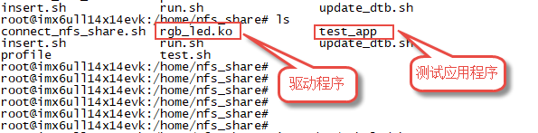
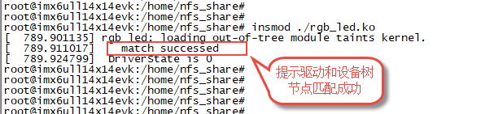

.. vim: syntax=rst

使用设备树实现RGB 灯驱动
==========================

通过上一小节的学习，我们已经能够编写简单的设备树节点，并且使用常用的of函数从设备树中获取我们想要的节点资源。
这一小节我们带领大家使用设备树编写一个简单的RGB灯驱动程序，加深对设备树的理解。

实验说明
~~~~~~~~~~~~~~~~~~~~~~~~~~

本节实验使用到 EBF6ULL-PRO 开发板上的 RGB 彩灯

硬件原理图分析
>>>>>>>>>>>>>>>>>>>>>>>>>>

参考"字符设备驱动--点亮LED灯"章节

实验代码讲解
~~~~~~~~~~~~~~~~~~~~~~~~~~

**本章的示例代码目录为：base_code/linux_driver/device_tree_rgb_led**

编程思路
>>>>>>>>>>>>>>>>>>>>>>>>>>
程序编写的主要内容为添加RGB灯的设备树节点、在驱动程序中使用of函数获取设备节点中的属性，编写测试应用程序。

- 首先向设备树添加RGB设备节点
- 其次编写平台设备驱动框架，主要包驱动入口函数、驱动注销函数、平台设备结构体定义三部分内容。
- 实现.probe函数，对rgb进行设备注册和初始化。
- 实现字符设备操作函数集，这里主要实现.write操作。
- 编写测试应用程序，对于输入不同的值控制rgb颜色。

代码分析
>>>>>>>>>>>>>>>>>>>>>>>>>>

添加RGB设备节点
-----------------------------------------

RGB灯实际使用的是一个IO口，控制它所需要的资源几个控制寄存器，所以它的设备树节点也非常简单如下所示。

.. code-block:: c 
    :caption: 添加RGB设备节点
    :linenos:

    /*
    *CCM_CCGR1                         0x020C406C
    *IOMUXC_SW_MUX_CTL_PAD_GPIO1_IO04  0x020E006C
    *IOMUXC_SW_PAD_CTL_PAD_GPIO1_IO04  0x020E02F8
    *GPIO1_GD                          0x0209C000
    *GPIO1_GDIR                        0x0209C004
    */
    
    /*
    *CCM_CCGR3                         0x020C4074
    *IOMUXC_SW_MUX_CTL_PAD_CSI_HSYNC   0x020E01E0
    *IOMUXC_SW_PAD_CTL_PAD_CSI_HSYNC   0x020E046C
    *GPIO4_GD                          0x020A8000
    *GPIO4_GDIR                        0x020A8004
    */

    /*
    *CCM_CCGR3                         0x020C4074
    *IOMUXC_SW_MUX_CTL_PAD_CSI_VSYNC   0x020E01DC
    *IOMUXC_SW_PAD_CTL_PAD_CSI_VSYNC   0x020E0468
    *GPIO4_GD                          0x020A8000
    *GPIO4_GDIR                        0x020A8004
    */
	
    /*添加led节点*/
	rgb_led{
	#address-cells = <1>;
	#size-cells = <1>;
	compatible = "fire,rgb_led";

	/*红灯节点*/
	ranges;
	rgb_led_red@0x020C406C{
		compatible = "fire,rgb_led_red";
		reg = <0x020C406C 0x00000004
				0x020E006C 0x00000004
				0x020E02F8 0x00000004
				0x0209C000 0x00000004
				0x0209C004 0x00000004>;
		status = "okay";
	};

	/*绿灯节点*/
	rgb_led_green@0x020C4074{
		compatible = "fire,rgb_led_green";
		reg = <0x020C4074 0x00000004
				0x020E01E0 0x00000004
				0x020E046C 0x00000004
				0x020A8000 0x00000004
				0x020A8004 0x00000004>;
		status = "okay";
	};

	/*蓝灯节点*/
	rgb_led_blue@0x020C4074{
		compatible = "fire,rgb_led_blue";
		reg = <0x020C4074 0x00000004
				0x020E01DC 0x00000004
				0x020E0468 0x00000004
				0x020A8000 0x00000004
				0x020A8004 0x00000004>;
		status = "okay";
	};

RGB灯的设备节点添加到了根节点的末尾，完整内容请参考本章配套代码base_code/linux_driver/device_tree_rgb_led/imx6ull-seeed-npi.dts。

- **第1-23行：**  这部分列出了控制RGB灯的三个引脚所使用的的寄存器，这些寄存器的作用以及用法已经在裸机部分详细介绍，这里不再赘述，如有疑问可以参考**字符设备驱动——点亮LED灯**章节。
- **第25-29行：**  这里就是RGB灯的设备树节点，节点名“rgb_led”由于在根节点下，很明显它的设备树路径为“/rgb_led”,在驱动程序中我们会用到这cells”定义了它的子节点的reg属性样式。“compatible”属性用于匹配驱动，在驱动我们会配置一个和“compatible”一样的参数，这样加载驱动是就可以自动和这个设备树节点匹配了。
- **第31-63行：**  rgb_led节点的子节点。RGB灯使用了三个引脚，如上所示，它会用到15个寄存器，为方便管理，我们为每个引脚创建了一个子节点，从上到下依次为红灯控制引脚、绿灯控制引脚、蓝灯控制引脚。它们三个非常相似，我们这里只以第一个红灯控制引脚为例讲解。在红灯子节点中只定义了三个属性，“compatie = “fire,rgb_led_red””表示这是一个红灯子节点，对于本实验来说可有可无。“reg = < ...>”定义红灯引脚使用到寄存器。一共有五个，排列顺序与注释中的一致。“status = “okay””定义子节点的状态，我们要用这个子节点所以设置为“okay”。

编写驱动程序
-----------------------------------------

基于设备树的驱动程序与平台总线驱动非常相似，差别是平台总线驱动中的平台驱动要和平台设备进行匹配，
使用设备树后设备树取代“平台设备”的作用，平台驱动只需要和与之对应的设备树节点匹配即可。

驱动程序主要内容包括编写平台设备驱动框架、编写.prob函数、实现字符设备操作函数集、驱动注销四部分内容。
源码base_code/linux_driver/device_tree_rgb_led/rgb_led.c。

**驱动入口函数**

驱动入口函数仅仅注册一个平台驱动，如下所示

.. code-block:: c 
    :caption: 驱动初始化函数
    :linenos:

    /*
    *驱动初始化函数
    */
    static int __init led_platform_driver_init(void)
    {
    	int DriverState;
    	DriverState = platform_driver_register(&led_platform_driver);
    	printk(KERN_EMERG "\tDriverState is %d\n", DriverState);
    	return 0;
    }

在整个入口函数中仅仅调用了“platform_driver_register”函数注册了一个平台驱动。参数是传入一个平台设备结构体。

**定义平台设备结构体**

注册平台驱动时会用到平台设备结构体，在平台设备结构体主要作用是指定平台驱动的.probe函数、指定与平台驱动匹配的平台设备，
使用了设备树后就是指定与平台驱动匹配的设备树节点。

.. code-block:: c 
    :caption: 平台设备结构体
    :linenos:

    static const struct of_device_id rgb_led[] = {
    	{.compatible = "fire,rgb_led"},
    	{/* sentinel */}
	};

    /*定义平台设备结构体*/
    struct platform_driver led_platform_driver = {
    	.probe = led_probe,
    	.driver = {
    		.name = "rgb-leds-platform",
    		.owner = THIS_MODULE,
    		.of_match_table = rgb_led,
    	}
	};

- **第1-4行：** 定义匹配表
- **第7-8行：** 就是我们定义的平台设备结构体。其中“.probe =led_probe,”指定.probe函数。.probe函数比较特殊，当平台驱动和设备树节点匹配后会自动执行.probe函数，后面的RGB灯的初始化以及字符设备的注册都在这个函数中实现（当然也可以在其他函数中实现）。
- **第9-14行：**“.driver = { …}”定义driver的一些属性，包括名字、所有者等等，其中最需要注意的是“.of_match_table ”属性，它指定这个驱动的匹配表。这里只定义了一个匹配值“.compatible = "fire,rgb_led”，这个驱动将会和设备树中“compatible =“fire,rgb_led”的节点匹配”，准确的说是和““compatible = “fire,rgb_led””的相对根节点的子节点匹配。我们在根节点下定义了rgb_led子节点，并且设置“compatible = “fire,rgb_led”;所以正常情况下，驱动会和这个子节点匹配。

**实现.probe函数**

之前说过，当驱动和设备树节点匹配成功后会自动执行.probe函数，所以我们在.probe函数中实现一些初始化工作。
本实验将RGB初始化以及字符设备的初始化全部放到.probe函数中实现，.probe函数较长，但包含大量的简单、重复性的初始化代码，非常容易理解。

.. code-block:: c 
    :caption: .probe函数
    :linenos:

    /*定义 led 资源结构体，保存获取得到的节点信息以及转换后的虚拟寄存器地址*/
    struct led_resource
    {
		 //rgb_led_red的设备树节点
    	struct device_node *device_node;
    	void __iomem *virtual_CCM_CCGR;
    	void __iomem *virtual_IOMUXC_SW_MUX_CTL_PAD;
    	void __iomem *virtual_IOMUXC_SW_PAD_CTL_PAD;
    	void __iomem *virtual_DR;
    	void __iomem *virtual_GDIR;
    };
    
    /*定义 R G B 三个灯的led_resource 结构体，保存获取得到的节点信息*/
    struct led_resource led_red;
    struct led_resource led_green;
    struct led_resource led_blue;
    
    static int led_probe(struct platform_device *pdv)
    {
    	//保存错误状态码
    	int ret = -1; 
    	unsigned int register_data = 0;
    
    	printk(KERN_EMERG "\t  match successed  \n");
    
    	/*获取rgb_led的设备树节点*/
    	rgb_led_device_node = of_find_node_by_path("/rgb_led");
    	if (rgb_led_device_node == NULL)
    	{
    		printk(KERN_ERR "\t  get rgb_led failed!  \n");
    		return -1;
    	}
    
    	/*获取rgb_led节点的红灯子节点*/
    	led_red.device_node = of_find_node_by_name(rgb_led_device_node,"rgb_led_red");
    	if (led_red.device_node == NULL)
    	{
    		printk(KERN_ERR "\n get rgb_led_red_device_node failed ! \n");
    		return -1;
    	}
    
    	/*获取 reg 属性并转化为虚拟地址*/
    	led_red.virtual_CCM_CCGR = of_iomap(led_red.device_node, 0);
    	led_red.virtual_IOMUXC_SW_MUX_CTL_PAD = of_iomap(led_red.device_node, 1);
    	led_red.virtual_IOMUXC_SW_PAD_CTL_PAD = of_iomap(led_red.device_node, 2);
    	led_red.virtual_DR = of_iomap(led_red.device_node, 3);
    	led_red.virtual_GDIR = of_iomap(led_red.device_node, 4);
    
    	/*初始化红灯*/
    	register_data = readl(led_red.virtual_CCM_CCGR);
    	register_data |= (0x03 << 26);
		//开启时钟
    	writel(register_data, led_red.virtual_CCM_CCGR); 
    
    	register_data = readl(led_red.virtual_IOMUXC_SW_MUX_CTL_PAD);
    	register_data &= ~(0xff << 0);
    	register_data |= (0x05 << 0);
		//设置复用功能
    	writel(register_data, led_red.virtual_IOMUXC_SW_MUX_CTL_PAD); 
    
    	register_data = readl(led_red.virtual_IOMUXC_SW_PAD_CTL_PAD);
    	register_data = (0x10B0);
		//设置PAD 属性
    	writel(register_data, led_red.virtual_IOMUXC_SW_PAD_CTL_PAD); 
    
    	register_data = readl(led_red.virtual_GDIR);
    	register_data |= (0x01 << 4);
		//设置GPIO1_04 为输出模式
    	writel(register_data, led_red.virtual_GDIR); 
    
    	register_data = readl(led_red.virtual_DR);
    	register_data |= (0x01 << 4);
		//设置 GPIO1_04 默认输出高电平
    	writel(register_data, led_red.virtual_DR); 
    
    	/*获取rgb_led节点的绿灯子节点*/
    	led_green.device_node = of_find_node_by_name(rgb_led_device_node,"rgb_led_green");
    	if (led_green.device_node == NULL)
    	{
    		printk(KERN_ERR "\n get rgb_led_green_device_node failed ! \n");
    		return -1;
    	}
    
    	/*获取 reg 属性并转化为虚拟地址*/
    	led_green.virtual_CCM_CCGR = of_iomap(led_green.device_node, 0);
    	led_green.virtual_IOMUXC_SW_MUX_CTL_PAD = of_iomap(led_green.device_node, 1);
    	led_green.virtual_IOMUXC_SW_PAD_CTL_PAD = of_iomap(led_green.device_node, 2);
    	led_green.virtual_DR = of_iomap(led_green.device_node, 3);
    	led_green.virtual_GDIR = of_iomap(led_green.device_node, 4);
    
    	/*初始化绿灯*/
    	register_data = readl(led_green.virtual_CCM_CCGR);
    	register_data |= (0x03 << 12);
		//开启时钟
    	writel(register_data, led_green.virtual_CCM_CCGR); 
    
    	register_data = readl(led_green.virtual_IOMUXC_SW_MUX_CTL_PAD);
    	register_data &= ~(0xff << 0);
    	register_data |= (0x05 << 0);
		//设置复用功能
    	writel(register_data, led_green.virtual_IOMUXC_SW_MUX_CTL_PAD); 
    
    	register_data = readl(led_green.virtual_IOMUXC_SW_PAD_CTL_PAD);
    	register_data = (0x10B0);
		//设置PAD 属性
    	writel(register_data, led_green.virtual_IOMUXC_SW_PAD_CTL_PAD); 
    
    	register_data = readl(led_green.virtual_GDIR);
    	register_data |= (0x01 << 20);
		 //设置GPIO4_IO20 为输出模式
    	writel(register_data, led_green.virtual_GDIR);
    
    	register_data = readl(led_green.virtual_DR);
    	register_data |= (0x01 << 20);
		//设置 GPIO4_IO20 默认输出高电平
    	writel(register_data, led_green.virtual_DR); 
    
    	/*获取rgb_led节点的蓝灯子节点*/
    	led_blue.device_node = of_find_node_by_name(rgb_led_device_node,"rgb_led_blue");
    	if (led_blue.device_node == NULL)
    	{
    		printk(KERN_ERR "\n get rgb_led_blue_device_node failed ! \n");
    		return -1;
    	}
    
    	/*获取 reg 属性并转化为虚拟地址*/
    	led_blue.virtual_CCM_CCGR = of_iomap(led_blue.device_node, 0);
    	led_blue.virtual_IOMUXC_SW_MUX_CTL_PAD = of_iomap(led_blue.device_node, 1);
    	led_blue.virtual_IOMUXC_SW_PAD_CTL_PAD = of_iomap(led_blue.device_node, 2);
    	led_blue.virtual_DR = of_iomap(led_blue.device_node, 3);
    	led_blue.virtual_GDIR = of_iomap(led_blue.device_node, 4);
    
    	/*初始化绿灯*/
    	register_data = readl(led_blue.virtual_CCM_CCGR);
    	register_data |= (0x03 << 12); 
		//开启时钟
    	writel(register_data, led_blue.virtual_CCM_CCGR);
    
    	register_data = readl(led_blue.virtual_IOMUXC_SW_MUX_CTL_PAD);
    	register_data &= ~(0xff << 0);
    	register_data |= (0x05 << 0);
		//设置复用功能
    	writel(register_data, led_blue.virtual_IOMUXC_SW_MUX_CTL_PAD); 
    
    	register_data = readl(led_blue.virtual_IOMUXC_SW_PAD_CTL_PAD);
    	register_data = (0x10B0);
		 //设置PAD 属性
    	writel(register_data, led_blue.virtual_IOMUXC_SW_PAD_CTL_PAD);
    
    	register_data = readl(led_blue.virtual_GDIR);
    	register_data |= (0x01 << 19); 
		//设置GPIO4_IO19 为输出模式
    	writel(register_data, led_blue.virtual_GDIR);
    
    	register_data = readl(led_blue.virtual_DR);
    	register_data |= (0x01 << 19);
		//设置 GPIO4_IO19 默认输出高电平
    	writel(register_data, led_blue.virtual_DR); 

    	/*注册 字符设备部分*/
    	//采用动态分配的方式，获取设备编号，次设备号为0，
    	//设备名称为rgb-leds，可通过命令cat  /proc/devices查看
    	//DEV_CNT为1，当前只申请一个设备编号
    	ret = alloc_chrdev_region(&led_devno, 0, DEV_CNT, DEV_NAME);
    	if (ret < 0)
    	{
    		printk("fail to alloc led_devno\n");
    		goto alloc_err;
    	}

    	//关联字符设备结构体cdev与文件操作结构体file_operations
    	led_chr_dev.owner = THIS_MODULE;
    	cdev_init(&led_chr_dev, &led_chr_dev_fops);

    	//添加设备至cdev_map散列表中
    	ret = cdev_add(&led_chr_dev, led_devno, DEV_CNT);
    	if (ret < 0)
    	{
    		printk("fail to add cdev\n");
    		goto add_err;
    	}

    	/*创建类 */
    	class_led = class_create(THIS_MODULE, DEV_NAME);
    
    	/*创建设备*/
    	device = device_create(class_led, NULL, led_devno, NULL, DEV_NAME);
    
    	return 0;
    
    add_err:
    	//添加设备失败时，需要注销设备号
    	unregister_chrdev_region(led_devno, DEV_CNT);
    	printk("\n error! \n");
    alloc_err:
    
	return -1;
}

- **第2-11行：** 自定义led资源结构体，用于保存获取得到的设备节点信息以及转换后的虚拟寄存器地址。
- **第27-32行：** 使用of_find_node_by_path函数获取设备树节点“/rgb_led”，获取成功后会返回“/rgb_led”节点的“设备节点结构体”后面的代码我们就可以根据这个“设备节点结构体”访问它的子节点。
- **第32-158行：** 依次初始化 红、绿、蓝灯，这三部分非常相似，这里仅介绍第三部分红灯初始化部分。初始化过程如下：

	- 第35-40行：获取红灯子节点，这里使用函数“of_find_node_by_name”，参数rgb_led_device_node指定从rgb_led节点开始搜索，参数“rgb_led_red”指定要获取那个节点，这里是rgb_led节点下的rgb_led_red子节点。
	- 第42-47行：获取并转换reg属性，我们知道reg属性保存的就是寄存器地址（物理地址），这里使用“of_iomap”函数，获取并完成物理地址到虚拟地址的转换。
	- 第49-74行：初始化寄存器，至于如何将初始化GPIO在裸机章节已经详细介绍这里不再赘述，需要注意的是这里只能用系统提供的API(例如这里读写的是32位数据，使用writel和readl)，不能像裸机那样直接使用“=”、“&=”、“|=”等等那样直接修改寄存器。

- **第160-189行：** 注册一个字符设备。字符设备的注册过程与之前讲解的字符设备驱动非常相似，这部分代码就是从字符设备驱动拷贝得到的。这里仅仅做简单介绍。

.. code-block:: c 
    :caption: 注册字符设备使用到的结构体
    :linenos:

    static dev_t led_devno;					 //定义字符设备的设备号
    static struct cdev led_chr_dev;			 //定义字符设备结构体chr_dev
    struct class *class_led;				 //保存创建的类
    struct device *device;					 // 保存创建的设备
    
    static struct file_operations led_chr_dev_fops ={
    		.owner = THIS_MODULE,
    		.open = led_chr_dev_open,
    		.write = led_chr_dev_write,
    };

- **第164-169行：** 使用“alloc_chrdev_region”动态申请主设备号，并保存到led_devno结构体中。
- **第172-173行：** 使用“cdev_init”初始化字符设别。
- **第176-181行：** 使用“cdev_add”将字符设备添加到系统。如果需要驱动自动创建设备节点，则还要创建类和设备。
- **第184行：** 使用“class_create”函数创建类。
- **第187行：** 使用“device_create”创建设备，其中参数“DEV_NAME”用于指定设备节点名，这个名字在应用程序中会用到。

如果驱动和设备树节点完成匹配，系统会自动执行.probe函数，从上方代码可知，.probe函数完成了RGB灯的初始化和字符设备的创建。
下一步我们只需要在字符设备的操作函数集中控制RGB灯即可。

**实现字符设备操作函数集**

为简化程序设计这里仅仅实现了字符设备操作函数集中的.write函数，.write函数根据收到的信息控制RGB灯的亮、灭，结合代码介绍如下：

.. code-block:: c 
    :caption: .write函数实现
    :linenos:

    /*字符设备操作函数集，open函数*/
    static int led_chr_dev_open(struct inode *inode, struct file *filp)
    {
    	printk("\n open form driver \n");
    	return 0;
    }
    
    /*字符设备操作函数集，write函数*/
    static ssize_t led_chr_dev_write(struct file *filp, const char __user *buf, size_t cnt, loff_t *offt)
    {
    
    	unsigned int register_data = 0; //暂存读取得到的寄存器数据
    	unsigned char write_data; //用于保存接收到的数据
    
    	int error = copy_from_user(&write_data, buf, cnt);
    	if (error < 0)
    	{
    		return -1;
    	}
    
    	/*设置 GPIO1_04 输出电平*/
    	if (write_data & 0x04)
    	{
    		register_data = readl(led_red.virtual_DR);
    		register_data &= ~(0x01 << 4);
    		writel(register_data, led_red.virtual_DR); // GPIO1_04引脚输出低电平，红灯亮
    	}
    	else
    	{
    		register_data = readl(led_red.virtual_DR);
    		register_data |= (0x01 << 4);
    		writel(register_data, led_red.virtual_DR); // GPIO1_04引脚输出高电平，红灯灭
    	}
    
    	/*设置 GPIO4_20 输出电平*/
    	if (write_data & 0x02)
    	{
    		register_data = readl(led_green.virtual_DR);
    		register_data &= ~(0x01 << 20);
    		writel(register_data, led_green.virtual_DR); // GPIO4_20引脚输出低电平，绿灯亮
    	}
    	else
    	{
    		register_data = readl(led_green.virtual_DR);
    		register_data |= (0x01 << 20);
    		writel(register_data, led_green.virtual_DR); // GPIO4_20引脚输出高电平，绿灯灭
    	}
    
    	/*设置 GPIO4_19 输出电平*/
    	if (write_data & 0x01)
    	{
    		register_data = readl(led_blue.virtual_DR);
    		register_data &= ~(0x01 << 19);
    		writel(register_data, led_blue.virtual_DR); //GPIO4_19引脚输出低电平，蓝灯亮
    	}
    	else
    	{
    		register_data = readl(led_blue.virtual_DR);
    		register_data |= (0x01 << 19);
    		writel(register_data, led_blue.virtual_DR); //GPIO4_19引脚输出高电平，蓝灯灭
    	}
    
    	return 0;
    }

    /*字符设备操作函数集*/
    static struct file_operations led_chr_dev_fops =
    	{
    		.owner = THIS_MODULE,
    		.open = led_chr_dev_open,
    		.write = led_chr_dev_write,
    };

我们仅实现了两个字符设备操作函数，open 对应led_chr_dev_open函数这是一个空函数。
.write对应led_chr_dev_write函数，这个函数接收应用程序传回的命令，根据命令控制RGB三个灯的亮、灭。

- **第14-19行：** 使用copy_from_user函数将用户空间的数据拷贝到内核空间。这里传递的数据是一个无符号整型数据。
- **第21-61行：** 解析命令，如何解析由我们自己决定。本例中使用数字的后三位从高到低依次对应红灯、绿灯、蓝灯，对应位是1则亮灯否则熄灭。例如0x03表示红灯灭，绿灯和蓝灯亮。0x07 表示全亮。具体实现过程很简单这里不再赘述。

编写测试应用程序
-----------------------------------------

在驱动程序中我采用自动创建设备节点的方式创建了字符设备的设备节点文件，文件名可自定义，写测试应用程序时记得文件名即可。本例程设备节点名为“rgb_led”。测试程序很简单，源码如下所示。

.. code-block:: c 
    :caption: 测试应用程序
    :linenos:

    #include <stdio.h>
    #include <unistd.h>
    #include <fcntl.h>
    #include <string.h>
    int main(int argc, char *argv[])
    {
    
        printf("led_tiny test\n");
        /*判断输入的命令是否合法*/
        if(argc != 2)
        {
            printf(" commend error ! \n");
            return -1;
        }
    
        /*打开文件*/
        int fd = open("/dev/rgb_led", O_RDWR);
        if(fd < 0)
        {
    		printf("open file : %s failed !\n", argv[0]);
    		return -1;
    	}
    	
		//将受到的命令值转化为数字;
        unsigned char commend = atoi(argv[1]);  
    
        /*判断命令的有效性*/
    
        /*写入命令*/
        int error = write(fd,&commend,sizeof(commend));
        if(error < 0)
        {
            printf("write file error! \n");
            close(fd);
            /*判断是否关闭成功*/
        }
    
        /*关闭文件*/
        error = close(fd);
        if(error < 0)
        {
            printf("close file error! \n");
        }
        
        return 0;
    }

- **第10-14行：** 简单判断输入是否合法，运行本测试应用程序时argc应该为2。它由应用程序文件名和命令组成例如“./test_app <命令值>”。
- **第16-22行：** 打开设备文件。
- **第25-30行：** 将终端输入的命令值转化为数字最终使用write函数
- **第39-43行：** 关闭设备文件。

编译驱动程序
~~~~~~~~~~~~~~~~~~~~~~~~~~~~~

编译设备树
>>>>>>>>>>>>>>>>>>>>>>>>>>

将rgb_led节点添加到设备树中，并在内核源码目录执行如下命令。

	make ARCH=arm CROSS_COMPILE=arm-linux-gnueabihf- npi_v7_defconfig
	
	make ARCH=arm -j4 CROSS_COMPILE=arm-linux-gnueabihf- dtbs

最终会在内核源码/arch/arm/boot/dts下生成 imx6ull-seeed-npi.dtb这个设备树文件。

编译驱动和应用程序
>>>>>>>>>>>>>>>>>>>>>>>>>>

执行make命令，Makefile和前面大致相同。
最终会生成rgb_led.ko和test_app应用程序

程序运行结果
~~~~~~~~~~~~~~~~~~~~~~~~~~~~~~~~

将设备树、驱动程序和应用程序通过NFS或SCP等方式拷贝到开发板中。

替换原来的设备树/boot/dtbs/4.19.71-imx-r1/imx6ull-seeed-npi.dtb，并重启开发板。

执行如下命令加载驱动：

命令：

	sudo insmod ./rgb-led.ko

驱动加载成功后直接运行应用程序如下所示。

命令：./test_app <命令>

执行结果如下：

与此同时，你还会看到LED呈现不同颜色的光。

命令是一个“unsigned char”型数据，只有后三位有效，每一位代表一个灯，从高到低依次代表红、绿、蓝，1表示亮，0表示灭。例如命令=4 则亮红灯，命令=7则三个灯全亮。
