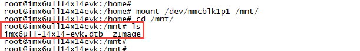
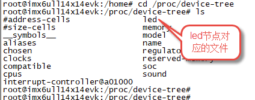
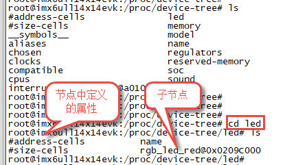
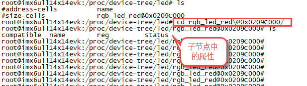
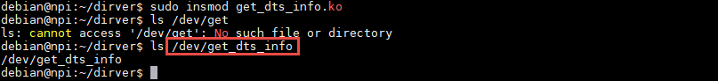
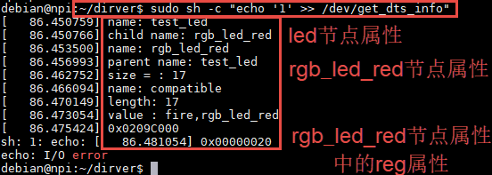
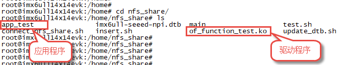
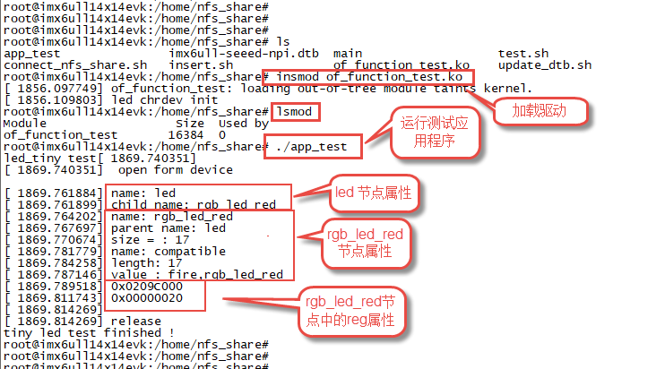

.. vim: syntax=rst

Linux设备树
--------------------------------

Linux3.x以后的版本才引入了设备树，设备树用于描述一个硬件平台的板级细节。在早些的linux内核，这些“硬件平台的板级细节”保存在linux内核目录“/arch”，以ARM平台为例“硬件平台的板级细节”保存在“/arch/arm/plat-xxx”和“/arch/arm/mach-
xxx”目录下。随着处理器数量的增多用于描述“硬件平台板级细节”的文件越来越多导致Linux内核非常臃肿，Linux之父发现这个问题之后决定使用设备树解决这个问题。设备树简单、易用、可重用性强，linux3.x之后大多采用设备树编写驱动。

设备树简介
~~~~~~~~~~~~~~~~~~~~

设备树的作用就是描述一个硬件平台的硬件资源。这个“设备树”可以被bootloader(uboot)传递到内核，内核可以从设备树中获取硬件信息。

设备树描述硬件资源时有两个特点。第一，以“树状”结构描述硬件资源，例如本地总线为树的“主干”在设备树里面称为“根节点”，挂载到本地总线的IIC总线、SPI总线、UART总线为树的“枝干”在设备树里称为“根节点的子节点”，IIC 总线下的IIC设备不止一个，这些“枝干”又可以再分。第二，设备树可以像头
文件（.h文件）那样，一个设备树文件引用另外一个设备树文件，这样可以实现“代码”的重用，例如多个硬件平台都使用i.MX6ULL作为主控芯片，那么我们可以将i.MX6ULL芯片的硬件资源写到一个单独的设备树文件里面一般使用“.dtsi”后缀，其他设备树文件直接使用“# include
xxx”引用即可。

DTS、DTC和DTB它们是文档中常见的几个缩写。DTS是指.dts格式的文件，是一种ASII 文本格式的设备树描述，也是我们要编写的设备树源码，一般一个.dts文件对应一个硬件平台，位于Linux源码的“/arch/arm/boot/dts”目录下。DTC是指编译设备树源码的工具，一般情况下我们需
要手动安装这个编译工具。DTB是设备树源码编译生成的文件，类似于我们C语言中“.C”文件编译生成“.bin”文件。

设备树语法讲解及源码分析
~~~~~~~~~~~~~~~~~~~~~~~~~~~~~~~~~~~~~~~~~~~~~~~~

上一小节我们简单了解了设备树的作用，到现在为止我们还不知道“设备树”是什么样子。考虑到直接讲解设备树语法可能会让人摸不着头脑，下面内容将以我们现在使用的设备树源码为例逐步分析设备树，在分析过程中讲解设备树基本语法。

本教程使用的设备树位于“~/ebf-buster-linux/arch/arm/boot/dts/imx6ull-seeed-npi.dts”

打开设备树文件“imx6ull-seeed-npi.dts”如下所示。

.. code-block:: c 
    :caption: 设备树
     :linenos:
 
    /*--------------------第一部分----------------*/
    #include <dt-bindings/input/input.h>  
    #include "imx6ull.dtsi"            ---------------①
    
    
    /*--------------------第二部分----------------*/
    / {  --------------------②
    	model = "Seeed i.MX6 ULL NPi Board";
    	compatible = "fsl,imx6ull-14x14-evk", "fsl,imx6ull";
    
    	aliases {
    		pwm0 = &pwm1;
    		pwm1 = &pwm2;
    		pwm2 = &pwm3;
    		pwm3 = &pwm4;
    	};
        chosen {
    		stdout-path = &uart1;
    	};
    
    	memory {
    		reg = <0x80000000 0x20000000>;
    	};
    
    	reserved-memory {
    		#address-cells = <1>;
    		#size-cells = <1>;
    		ranges;
    
    		linux,cma {
    			compatible = "shared-dma-pool";
    			reusable;
    			size = <0x14000000>;
    			linux,cma-default;
    		};
    	};
        /*-------------以下内容省略=-------------*/
    };
    
    /*--------------------第三部分----------------*/
    &cpu0 {  --------------------③
    	dc-supply = <&reg_gpio_dvfs>;
    	clock-frequency = <800000000>;
    };
    
    &clks {  --------------------④
    	assigned-clocks = <&clks IMX6UL_CLK_PLL4_AUDIO_DIV>;
    	assigned-clock-rates = <786432000>;
    };
    
    
    &fec1 {  --------------------⑤
    	pinctrl-names = "default";
    	pinctrl-0 = <&pinctrl_enet1>;
    	phy-mode = "rmii";
    	phy-handle = <&ethphy0>;
    	status = "okay";
    };
    /*-------------以下内容省略=-------------*/

设备树源码分为三部分，介绍如下：

第一部分，头文件。根据之前讲解设备树是可以像C语言那样使用“#include”引用头文件。标号①处并不是我们常见的“.h”头文件，它也是一个imx6ull平台“共用”的设备树文件，它由NXP官方提供，稍后我们会以imx6ull.dtsi文件为例分析设备树。

第二部分，添加设备树节点。设备树给我们最直观的感受是它由一些嵌套的大括号“{}”组成，每一个“{}”都是一个“节点”标号② “/ {…};”表示它是一个“根节点”每一个设备树只有一个根节点。如果打开“imx6ull.dtsi”文件可以发现它也有一个根节点，“imx6ull-seeed-
npi.dts”引用了“imx6ull.dtsi”文件，那么“imx6ull-seeed-npi.dts”设备树是否有两个根节点？其实不同文件的根节点会合并为一个。

在根节点内部的“aliases {…}”、“chosen {…}”、“memory {…}”等等，是他的子节点。节点格式我们稍后会详细介绍。

第三部分，对已经存在的设备树节点追加内容。第三部分的子节点比根节点下的子节点多了一个“&”，他表示在已经存在的子节点
追加加数据。这些“已经存在的节点”可能定义在“imx6ull-seeed-npi.dts”文件也可能定义在“imx6ull-seeed-
npi.dts”文件所包含的设备树文件里。本例程中的“&cpu0 {…}”、“&clks {…}”、“&fec1 {…}”等等，就是定义在“imx6ull.dtsi”。

到目前为止我们知道设备树由一个根节点和众多子节点组成，子节点也可以包含其他节点，也就是子节点的子节点。设备树的组成很简单，下面我们重点介绍如何书写一个子节点，以及在驱动中如何从节点中获取数据。

节点基本格式
~~~~~~~~~~~~~~~~~~~~~~~~~~~~~~

设备树中的每个节点都按照以下约定命名：

.. code-block:: c 
    :caption: 节点基本格式
    :linenos:

    node-name@unit-address{
    
    属性1 = …
    
    属性2 = …
    
    属性13= …
    
    子节点…
    
    }

node-name 节点名
'''''''''''''''''''''''''''''''''''''''''''''''''''''''''''''''''

用于指定节点的名称。 它的长度为1至31个字符，只能由如下字符组成

==== ========
字符 描述
==== ========
0-9  数字
a-z  小写字母
A-Z  大写字母
,    英文逗号
.    英文句号
\_   下划线
+    加号
-    减号 
==== ========

另外，节点名应当使用大写或小写字母开头，并且能够描述设备类别。

@unit-address
''''''''''''''''''''''''''''''''''''''''''''''''''''

符号“@”可以理解为是一个分割符，“unit-address”用于指定“单元地址”，它的值要和节点“reg”属性的第一个地址（节点属性我们稍后介绍）。如果节点
没有“reg”属性值，直接省略“@unit-address”，注意，这时要求同级别的设备树下（相同级别的子节点）节点名要唯一,也就是同级别的子节点的节点名可以相同，但是要求
“单元地址”不同。

节点属性
''''''''''''''''''''''''

通常情况下一个节点包含多个属性信息，这些属性信息就是要传递到内核的“板级硬件描述信息”驱动中会通过一些API函数获取这些信息（后面会详细介绍）。一个节点中也可以包含自己的子节点。

注意，根节点没有节点名和单元地址用“/”指代这是一个根节点。

设备树中的一些基本概念
~~~~~~~~~~~~~~~~~~~~~~~~~~~~~~~~~~~~~~~~~~~~

打开设备树，可以发现有些设备树节点并不是我们上一小节讲的那样。初学者可能感到疑惑，这一小节就学习一下这些“不同之处”。

节点标签
^^^^^^^^^^^^^^^^

如下所示。

.. code-block:: c 
    :caption: 节点标签
    :linenos:

    cpu0: cpu@0 {
    	compatible = "arm,cortex-a7";
    	device_type = "cpu";
    	reg = <0>;
    }

在节点名“cpu”前面多了个“cpu0”,“cpu0”就是我们所说的节点标签。节点标签的作用是便于向节点中追加内容。

向已存在的节点追加内容
^^^^^^^^^^^^^^^^^^^^^^^^^^^^^^^^^^^^^^^^^^^^

在我们编写的设备树源码“~/ebf-buster-linux/arch/arm/boot/dts/imx6ull-seeed-npi.dts”中存在如下所示的内容（大约120行的位置）。

.. code-block:: c 
    :caption: 向节点追加内容
    :linenos:

    &cpu0 {
    	dc-supply = <&reg_gpio_dvfs>;
    	clock-frequency = <800000000>;
    };

这些源码并不包含在根节点“/{…}”内，它们不是一个新的节点，而是向原有节点追
加内容。以上方源码为例，“&cpu0”表示向“节点标签”为“cpu0”的节点追加数据，这个节点可能
定义在本文件也可能定义在本文件所包含的设备树文件中，上方源码的“cpu0”定义在“imx6ull.dtsi”文件夹下。

节点路径
^^^^^^^^^^^^^^^^^^^^

通过指定从根节点到所需节点的完整路径，可以唯一地标识设备树中的节点，“不同层次的
设备树节点名字可以相同”。这有点类似于我们windows上的文件，一个路径唯一标识
一个文件或文件夹，不同目录下的文件文件名可以相同。例如在“imx6ull.dtsi”文件内的cpu节点的路径标识为“/cpus/cpu”，
如果在驱动中要获取CPU属性我们就会用到这个路径，当然我们也可以为cpu节点定义一个别名（稍后会介绍），直接通过这个别名访问它。

别名子节点
^^^^^

别名子节点的作用就是为其他节点起一个别名，如下所示。

.. code-block:: c 
    :caption: 别名子节点
    :linenos:

    aliases {
    	can0 = &flexcan1;
    	can1 = &flexcan2;
    	ethernet0 = &fec1;
    	ethernet1 = &fec2;
    	gpio0 = &gpio1;
    	gpio1 = &gpio2;
    	gpio2 = &gpio3;
    	gpio3 = &gpio4;
    	gpio4 = &gpio5;
    	i2c0 = &i2c1;
    	i2c1 = &i2c2;
    	/*----------- 以下省略------------*/
    }

以“can0 = &flexcan1;”为例。“flexcan1”是一个节点的名字，设置别名后我么可以使用“can0”来指代flexcan1节点。在设备树中更多的是为节点添加标签，没有使用节点别名，别名的作用是“快速找到设备树节点”。在驱动中如果要查找一个节点，通常情况下我们可以使用“节点路径”一步
步找到节点。也可以使用别名“一步到位”找到节点。

chosen自节点
^^^^^^^^^

chosen子节点位于根节点下，如下所示

.. code-block:: c 
    :caption: chosen子节点
    :linenos:

    chosen {
    	stdout-path = &uart1;
    };

chosen子节点不代表实际硬件，它主要用于给内核传递参数。这里只设置了“stdout-path =
&uart1;”一条属性，表示系统输出使用uart1。此外这个节点还用作uboot向linux内核传递配置参数的“通道”，我们在Uboot中设置的参数就是通过这个节点传递到内核的，这部分内容是uboot和内核自动完成的，作为初学者我们不必深究。

.. _节点属性-1:

节点属性
~~~~

我们编写设备树最主要的内容是编写节点的节点属性，通常情况下一个节点代表一个设备，设备有哪些属性、怎么编写这些属性、在驱动中怎么引用这些属性是我们后面讲解的重点，这一小节只讲解设备节点有哪些可设置属性。节点属性有一些节点属性是所有节点共有的，一些作用于特定的节点，我们这里介绍那些共有的节点属性，其他节
点属性使用到时再详细介绍。

节点属性分为标准属性和自定义属性，也就是说我们在设备树中可以根据自己的实际需要定义、添加设备属性。标准属性的属性名是固定的，自定义属性名可按照要求自行定义。

compatible属性
''''''''''''

属性值类型：字符串

.. code-block:: c 
    :caption: compatible属性
    :linenos:

    intc: interrupt-controller@a01000 {
    	compatible = "arm,cortex-a7-gic";
    	#interrupt-cells = <3>;
    	interrupt-controller;
    	reg = <0xa01000 0x1000>,
    	      <0xa02000 0x100>;
    };

compatible属性值由一个或多个字符串组成，这些字符串定义了设备的特定编程模型。 此字符串列表用于设备和驱动的匹配，类似于平台总线的设备和驱动的匹配。

model
'''''

属性值类型：字符串

示例：

.. code-block:: c 
    :caption: model属性
    :linenos:

    model = "Seeed i.MX6 ULL NPi Board";

compatible属性用于指定设备的制造商和型号，推荐使用“执照商, 型号”的格式，当然也可以自定义，本例子就没有使用这种格式。

应由客户端程序用于设备驱动程序的选择。 属性值由空终止字符串的级联列表组成，从最特定到最一般。 它们允许设备表示其与一系列类似设备的兼容性，可能允许单个设备驱动程序与多个设备匹配。

status
''''''

属性值类型：字符串

示例：

.. code-block:: c 
    :caption: status属性
    :linenos:

    /* External sound card */
    sound: sound {
        status = "disabled";
    };
   

状态属性用于指示设备的操作状态。 “操作状态”如下所示。

========== ===========================================================================================================
状态值     描述
========== ===========================================================================================================
"okay"     设备正常运行
"disabled" 表明该设备目前尚未运行，但它可能在未来开始运行（例如，某些东西没有插入或关闭）。
"fail"     表示设备不可操作。
"fail-sss" 设备不可操作，原因是设备中检测到一个严重的错误，如果没有修复，它就不太可能运行。“sss”的值与具体的设备相关。
========== ===========================================================================================================

#address-cells 和 #size-cells
''''''''''''''''''''''''''''

属性值类型：u32

示例：

.. code-block:: c 
    :caption: #address-cells和 #size-cells
    :linenos:

    soc {
    	#address-cells = <1>;
    	#size-cells = <1>;
    	compatible = "simple-bus";
    	interrupt-parent = <&gpc>;
    	ranges;
    	ocrams: sram@900000 {
    		compatible = "fsl,lpm-sram";
    		reg = <0x900000 0x4000>;
    	};
    };

#address-cells和 #size-cells属性同时存在，在设备树测城西结构中，它们用在有子节点的设备节点（节点），用于设置子节点的“reg”属性的“书写格式”。

补充：reg属性值由一串数字组成，如上图中的reg = <0x900000 0x4000>，ret属性的书写格式为reg = < cells cells cells cells cells cells…>，长度根据实际情况而定，这些数据分为地址数据（地址字段），长度数据（大小字段）。

#address-cells，用于指定子节点reg属性“地址字段”所占的长度（单元格数量）。# size-cells，用于指定子节点reg属性“大小字段”所占的长度（单元格数量）。例如#address-cells=2，#address-cells=1，则reg内的数据含义为reg = <
address address size address address size…>，#address-cells=1，#address-cells=1，则reg内的数据含义为reg = < address size address size address size…>。总之# size-
cells和#address-cells决定了子节点的reg属性中哪些数据是“地址”，哪些数据是“长度”信息。

reg属性
'''''

属性值类型：地址、长度数据对

示例：

与 #address-cells和 #size-cells示例相同。

reg属性描述设备资源在其父总线定义的地址空间内的地址。通常情况下用于表示一块寄存器的起始地址（偏移地址）和长度，在特定情况下也有不同的含义。例如上例中#address-cells = <1>，#address-cells = <1>，reg = <0x900000
0x4000>，0x900000表示的是地址，0x4000表示的是地址长度，这里的reg属性指定了起始地址为0x900000，长度为0x4000的一块地址空间。

ranges
''''''

属性值类型：任意数量的 <子地址、父地址、地址长度>编码

示例：

.. code-block:: c 
    :caption: ranges属性
    :linenos:

    soc {
    		#address-cells = <1>;
    		#size-cells = <1>;
    		compatible = "simple-bus";
    		interrupt-parent = <&gpc>;
    		ranges;
    
    		busfreq {
    			/*以下内容省略*/
    
    		};
    }

该属性提供了子节点地址空间和父地址空间的映射（转换）方法，常见格式是ranges = (字地址, 父地址, 转换长度)。如果父地址空间和字地址空间相同则无需转换，如示例中所示，只写了renges,内容为空，我们也可以直接省略renges属性。

name和device_type
''''''''''''''''

属性值类型：字符串。

示例：

name和device_type

.. code-block:: c 
    :caption: name属性
    :linenos:

    example{
    	name = "name"
    }

.. code-block:: c 
    :caption: device_type属性
    :linenos:

    cpus {
    		#address-cells = <1>;
    		#size-cells = <0>;
    
    		cpu0: cpu@0 {
    			compatible = "arm,cortex-a7";
    			device_type = "cpu";
    			reg = <0>;

这两个属性很少用（已经被废弃），不推荐使用。name用于指定节点名，在旧的设备树中它用于确定节点名，现在我们使用的设备树已经弃用。device_type属性也是一个很少用的属性，只用在CPU和内存的节点上。如上例中所示，device_type用在了CPU节点。

在中断、时钟部分也有自己的节点标准属性，随着深入的学习我们会详细介绍这些节点标准属性。

在设备树中添加设备节点实验
~~~~~~~~~~~~~

通常情况下我们几乎不会从零开始写一个设备树，因为一个功能完善的设备树通常比较庞大，例如本教程引用的NXP官方编写的设备树“imx6ull.dtsi”就多达1000行，另外官方已经写好了一部分呢我们只需要引用官方写好的设备树，然后根据自己的实际情况修改即可。在实际应用中我们最常见的操作是向设备节点中增
加一个节点、向现有设备节点追加数据、和编写设备树插件。

这一小节不需要编写驱动程序，开发板上的系统保持不变。

 添加节点
 ^^^^

根据之前讲解，我们的系统默认使用的是“~/ebf-buster-linux/arch/arm/boot/dts/imx6ull-seeed-npi.dts”设备树，我们就在这个设备树里尝试增加一个设备节点，如下所示。

.. code-block:: c 
    :caption: 添加子节点
    :linenos:

    / {
    	model = "Seeed i.MX6 ULL NPi Board";
    	compatible = "fsl,imx6ull-14x14-evk", "fsl,imx6ull";
    
    	aliases {
    		pwm0 = &pwm1;
    		pwm1 = &pwm2;
    		pwm2 = &pwm3;
    		pwm3 = &pwm4;
    	};
    	/*-----------一下代码省略-------------*/
    
    	/*添加led节点*/
    	led{
    		/*-------------第一部分-----------*/
    		#address-cells = <1>;
    		#size-cells = <1>; 
    
    		/*-------------第二部分-----------*/
    		rgb_led_red@0x0209C000{
    			compatible = "fire,rgb_led_red";
    			reg = <0x0209C000 0x00000020>;
    			status = "okay";
    		};
    	};
    };

在我们在imx6ull-seeed-npi.dts设备树文件的根节点末尾新增了一个节点名为“led”的节点，里面只添加了几个基本属性，我们这里只是学习添加一个设备节点。

在以上代码中，led节点的#address-cells = <1>，#size-cells = <1>，意味着它的子节点的reg属性里的数据是“地址”、“长度”交替的。

第二部分是led 节点的子节点，它定义了三个属性分别为compatible、reg、status，这三个属性在 “节点属性”章节已经介绍。需要注意的是rgb属性，在父节点设置了#address-cells = <1>，#size-cells =
<1>，所以这里0x0209C000表示的是地址（这里填写的是GPIO1控制寄存器的首地址），0x00000020表示的是地址长度。“rgb_led_red@0x0209C000”中的单元的地址0x0209C000要和reg属性的第一个地址一致。

编译下载设备树
^^^^^^^

编译设备树
'''''

编译内核时会自动编译设备树，但是编译内核很耗时，所以我们推荐使用如下命令只编译设备树。

命令：

make ARCH=arm CROSS_COMPILE=arm-linux-gnueabihf- npi_v7_defconfig

make ARCH=arm -j4 CROSS_COMPILE=arm-linux-gnueabihf- dtbs

如果在内核源码中执行了make distclean 则必须执行第一条命令，它用于生成默认配置文件，如果执行过一次就没有必要再次执行，当然再次执行也没有什么问题。第二条命令开始编译设备树，参数“-j4”指定多少个线程编译，根据自己电脑实际情况设置，越大编译越快，当然也可以不设置，设备树编译本来就很快。

编译成功后生成的设备树文件（.dtb）位于源码目录下的“./arch/arm/boot/dts”文件名为“imx6ull-seeed-npi.dtb”

下载设备树
'''''

设备树“下载”有两种方法。第一种，像刷系统那样使用MFG工具将设备树烧写到开发板，这种方法比较繁琐但适用于SD卡、emmc、nand。第二种，将设备树使用nfs共享文件夹拷贝到开发板（其他工具也可以），挂载设备树和内核所在的磁盘，然后用新的设备树替换掉旧的。这种方法我们只测试了emmc，SD卡和na
nd暂不支持使用这种方式。

使用MFG工具烧录

将编译生成的设备树imx6ull-seeed-npi.dtb拷贝得到MFG工具的相应目录（如果文件已存在则替换掉旧的），注意修改mfg工具的“cfg.ini”文件，具体烧录过程和使用MFG工具烧系统完全一致，这里不再介绍。

在开发板中更新设备树文件

如果使用emmc，推荐使用这种方式，将生成的设备树imx6ull-seeed-npi.dtb拷贝到开发板，然后执行如下命令挂载设备树所在磁盘。

命令：

mount /dev/mmcblk1p1 /mnt

以上命令将mmcblk1p1磁盘挂载到“/mnt”目录下，mmcblk1p1磁盘保存的是内核和设备树，挂载成功后打开“/mnt”目录。如下所示。

将我们编译生成的设备树重命名为“imx6ull-14x14-evk.dtb”替换掉“/mnt”目录下设备树文件即可。替换之后记得取消挂载，或者重新打开、关闭 “/mnt”目录，这样更改之后的内容会立即写入磁盘，重新启动即可。取消挂载命令如下：

命令

umount /dev/mmcblk1p1

实验结果

设备树中的设备树节点在文件系统中有与之对应的文件，位于“/proc/device-tree”目录。进入“/proc/device-tree”目录如下所示。

接着进入led 文件夹，可以发现led节点中定义的属性以及它的子节点，如下所示。

在节点属性中多了一个name，我们在led节点中并没有定义name属性，这是自从生成的，保存节点名。

这里的属性是一个文件，而子节点是一个文件夹，我们再次进入“rgb_led_red@0x0209C000”文件夹，如下所示。

同样这些属性是一个文件，我们可以使用“vi”命令查看这些属性文件，如下所示。

至此，我们已经成功的在设备树中添加了一个名为“led”的节点。

在驱动中获取设备树节点的属性
~~~~~~~~~~~~~~

在设备树中“节点”对应实际硬件中的设备，我们在设备树中添加了一个“led”节点，

正常情况下我们可以从这个节点获取编写led驱动所用到的所有信息，例如led相关控制寄存器地址、led时钟控制寄存器地址等等。这一小节我们就开始学习如何从设备树的设备节点获取我们想要的数据。

常用获取资源函数
^^^^^^^^

内核提供了一组函数用于从设备节点获取资源（设备节点中定义的属性）的函数，这些函数以of_开头，称为OF操作函数。常用的OF函数介绍如下：

查找节点函数
''''''

根据节点路径寻找节点函数

函数原型：

struct device_node \*of_find_node_by_path(const char \*path)

参数“path”，指定节点在设备树中的路径。

返回值“device_node”结构体指针，如果查找失败则返回NULL，否则返回device_node类型的结构体指针，它保存着设备节点的信息。

device_node机构体如下所示。

.. code-block:: c 
    :caption: device_node结构体
    :linenos:

    struct device_node {
    	const char *name;  //节点名
    	const char *type;  //设备类型
    	phandle phandle;
    	const char *full_name; //完整名字
    	struct fwnode_handle fwnode;
    
    	struct	property *properties; //属性
    	struct	property *deadprops;	/* removed properties */
    	struct	device_node *parent; //父节点
    	struct	device_node *child;  //子节点
    	struct	device_node *sibling;
    #if defined(CONFIG_OF_KOBJ)
    	struct	kobject kobj;
    #endif
    	unsigned long _flags;
    	void	*data;
    #if defined(CONFIG_SPARC)
    	const char *path_component_name;
    	unsigned int unique_id;
    	struct of_irq_controller *irq_trans;
    #endif
    };

得到device_node结构体之后我们就可以使用其他of 函数获取节点的详细信息。

根据节点名字寻找节点函数

函数原型：

struct device_node \*of_find_node_by_name(struct device_node \*from,const char \*name);

参数from，指定从哪个节点开始查找，它本身并不在查找行列中，只查找它后面的节点，如果设置为NULL表示从根节点开始查找。

参数name，要寻找的节点名。

返回值：device_node类型的结构体指针，保存获取得到的节点。同样，如果失败返回NULL。

根据节点类型寻找节点函数

函数原型：

struct device_node \*of_find_node_by_type(struct device_node \*from,const char \*type)

类似of_find_node_by_name函数。

参数from，指定从哪个节点开始查找，它本身并不在查找行列中，只查找它后面的节点，如果设置为NULL表示从根节点开始查找。

参数type，要查找节点的类型，这个类型就是device_node-> type。

返回值：device_node类型的结构体指针，保存获取得到的节点。同样，如果失败返回NULL。

根据节点类型和compatible属性寻找节点函数

函数原型：

struct device_node \*of_find_compatible_node(struct device_node \*from,const char \*type, const char \*compatible)

相比of_find_node_by_name函数增加了一个compatible属性作为筛选条件。

参数from，指定从哪个节点开始查找，它本身并不在查找行列中，只查找它后面的节点，如果设置为NULL表示从根节点开始查找。

参数type，要查找节点的类型，这个类型就是device_node-> type。

参数compatible，要查找节点的compatible属性。

返回值：device_node类型的结构体指针，保存获取得到的节点。同样，如果失败返回NULL。

根据匹配表寻找节点函数

函数原型：

static inline struct device_node \*of_find_matching_node_and_match(

struct device_node \*from,

const struct of_device_id \*matches,

const struct of_device_id \*\*match)

参数from，指定从哪个节点开始查找，它本身并不在查找行列中，只查找它后面的节点，如果设置为NULL表示从根节点开始查找。

参数matches，源匹配表，查找与该匹配表想匹配的设备节点。

结构体struct of_device_id如下所示。

.. code-block:: c 
    :caption: of_device_id结构体
    :linenos:

   /*
    * Struct used for matching a device
    */
   struct of_device_id {
   	char	name[32];
   	char	type[32];
   	char	compatible[128];
   	const void *data;
   };

可以看到，该结构体包含了更多的匹配参数，也就是说相比前三个寻找节点函数，这个函数匹配的参数更多，对节点的筛选更细。

参数match，查找得到的结果。

返回值：device_node类型的结构体指针，保存获取得到的节点。同样，如果失败返回NULL。

寻找父节点函数

函数原型

struct device_node \*of_get_parent(const struct device_node \*node)

参数node，指定谁（节点）要查找父节点。

返回值：device_node类型的结构体指针，保存获取得到的节点。同样，如果失败返回NULL。

寻找子节点函数

函数原型

struct device_node \*of_get_next_child(const struct device_node \*node,

struct device_node \*prev)

参数node，指定谁（节点）要查找它的子节点。

参数prev，前一个子节点，寻找的是prev节点之后的节点。这是一个迭代寻找过程，例如寻找第二个子节点，这里就要填第一个子节点。参数为NULL 表示寻找第一个子节点。

返回值：device_node类型的结构体指针，保存获取得到的节点。同样，如果失败返回NULL。

这里介绍了7个寻找节点函数，这7个函数有一个共同特点——返回值类型相同。只要找到了节点就会返回节点对应的device_node结构体，在驱动程序中我们就是通过这个device_node获取设备节点的属性信息、顺藤摸瓜查找它的父、子节点等等。第一函数of_find_node_by_path与后面六个不
同，它是通过节点路径寻找节点的，“节点路径”是从设备树源文件(.dts)中的到的。而中间四个函数是根据节点属性在某一个节点之后查找符合要求的设备节点，这个“某一个节点”是设备节点结构体（device_node），也就是说这个节点是已经找到的。最后两个函数与中间四个类似，只不过最后两个没有使用节点属性
而是根据父、子关系查找。

提取属性值的of函数
''''''''''

上一小节我们讲解了7个查找节点的函数，它们有一个共同特点，找到一个设备节点就会返回这个设备节点对应的结构体指针（device_node*）。这个过程可以理解为把设备树中的设备节点“获取”到驱动中。“获取”成功后我们再通过一组of函数从设备节点结构体（device_node）中获取我们想要的设备节点属
性信息。

查找节点属性函数

函数原型

struct property \*of_find_property(const struct device_node \*np,const char \*name,int \*lenp)

参数np，指定要获取那个设备节点的属性信息。

参数name，属性名。

参数lenp，获取得到的属性值的大小，这个指针作为输出参数，这个参数“带回”的值是实际获取得到的属性大小。

返回值：获取得到的属性。这是一个结构体，我们把它称为节点属性结构体，如下所示。失败返回NULL。

.. code-block:: c 
    :caption: property属性结构体
    :linenos:

    struct property {
    	char	*name;  //属性名
    	int	length;     //属性长度
    	void	*value; //属性值
    	struct property *next; //下一个属性
    #if defined(CONFIG_OF_DYNAMIC) || defined(CONFIG_SPARC)
    	unsigned long _flags;
    #endif
    #if defined(CONFIG_OF_PROMTREE)
    	unsigned int unique_id;
    #endif
    #if defined(CONFIG_OF_KOBJ)
    	struct bin_attribute attr;
    #endif
    };

从这个结构体中我们就可以得到想要的属性值了。

读取整型属性函数

读取属性函数是一组函数，分别为读取8、16、32、64位数据。

函数原型：

//8位整数读取函数

int of_property_read_u8_array(const struct device_node \*np, const char \*propname,

u8 \*out_values, size_t sz)

//16位整数读取函数

int of_property_read_u16_array(const struct device_node \*np, const char \*propname,

u16 \*out_values, size_t sz)

//32位整数读取函数

int of_property_read_u32_array(const struct device_node \*np, const char \*propname,

u32 \*out_values, size_t sz)

//64位整数读取函数

int of_property_read_u64_array(const struct device_node \*np, const char \*propname,

u64 \*out_values, size_t sz)

这几个函数结构和用法是相同的，以8位读取为例介绍如下：

参数np，指定要读取那个设备节点结构体，也就是说读取那个设备节点的数据。

参数propname，指定要获取设备节点的哪个属性。

参数out_values，这是一个输出参数，是函数的“返回值”，保存读取得到的数据。

参数sz，这是一个输入参数，它用于设置读取的长度。

返回值，成功返回0，错误返回错误状态码（非零值），-EINVAL（属性不存在），-ENODATA（没有要读取的数据），-EOVERFLOW（属性值列表太小）。

简化后的读取整型属性函数

这里的函数是对读取整型属性函数的简单封装，将读取长度设置为1。用法与读取属性函数完全一致，这里不再赘述。

函数原型：

//8位整数读取函数

int of_property_read_u8 (const struct device_node \*np, const char \*propname,

u8 \*out_values)

//16位整数读取函数

int of_property_read_u16 (const struct device_node \*np, const char \*propname,

u16 \*out_values)

//32位整数读取函数

int of_property_read_u32 (const struct device_node \*np, const char \*propname,

u32 \*out_values)

//64位整数读取函数

int of_property_read_u64 (const struct device_node \*np, const char \*propname,

u64 \*out_values)

读取字符串属性函数

在设备节点中存在很多字符串属性，例如compatible、status、type等等，这些属性可以使用查找节点属性函数of_find_property来获取，但是这样比较繁琐。内核提供了一组用于读取字符串属性的函数，介绍如下：

int of_property_read_string(const struct device_node \*np,const char \*propname,

const char \*\*out_string)

int of_property_read_string_index(const struct device_node \*np,const char \*propname,

int index,const char \**out_string)

第一个函数，介绍如下：

参数np，指定要获取那个设备节点的属性信息。

参数propname，属性名。

参数out_string，获取得到字符串指针，这是一个“输出”参数，带回一个字符串指针。也就是字符串属性值的首地址。这个地址是“属性值”在内存中的真实位置，也就是说我们可以通过对地址操作获取整个字符串属性（一个字符串属性可能包含多个字符串，这些字符串在内存中连续存储，使用’\0’分隔），这个函数使用
相对繁琐，推荐使用第二个。

返回值：成功返回0，失败返回错误状态码。

第二个函数介绍如下：

相比第一函数增加了参数index，它用于指定读取属性值中第几个字符串，index从零开始计数。第一个函数只能得到属性值所在地址，也就是第一个字符串的地址，其他字符串需要我们手动修改移动地址，非常麻烦，推荐使用第二个函数。

读取布尔型属性函数

在设备节点中一些属性是BOOL型，当然内核会提供读取BOOL型属性的函数，介绍如下：

static inline bool of_property_read_bool(const struct device_node \*np,

const char \*propname)：

参数np，指定要获取那个设备节点的属性信息。

参数propname，属性名。

返回值：true ,属性存在。false,其他。

这个函数不按套路出牌，它不是读取某个布尔型属性的值，仅仅是读取这个属性存在或者不存在。如果想要或取值，可以使用之前讲解的“全能”函数查找节点属性函数of_find_property。

内存映射相关of函数
''''''''''

在设备树的设备节点中大多会包含一些内存相关的属性，比如常用的reg属性。通常情况下，得到寄存器地址之后我们还要通过ioremap函数将物理地址转化为虚拟地址。现在内核提供了of函数，自动完成物理地址到虚拟地址的转换。介绍如下：

void \__iomem \*of_iomap(struct device_node \*np, int index)

参数np，指定要获取那个设备节点的属性信息。

参数index，通常情况下reg属性包含多段，index 用于指定映射那一段，标号从0开始。；

返回值：成功，得到转换得到的地址。失败返回NULL。

内核也提供了常规获取地址的of函数，这些函数得到的值就是我们在设备树中设置的地址值。介绍如下：

int of_address_to_resource(struct device_node \*dev, int index, struct resource \*r)

参数np，指定要获取那个设备节点的属性信息。

参数index，通常情况下reg属性包含多段，index 用于指定映射那一段，标号从0开始。

参数r，这是一个resource结构体，是“输出参数”用于返回得到的地址信息。resource结构体如下所示：

.. code-block:: c 
    :caption: resource属性结构体
    :linenos:

    struct resource {
    	resource_size_t start; //起始地址
    	resource_size_t end;  //结束地址
    	const char *name;    //属性名字
    	unsigned long flags;
    	unsigned long desc;
    	struct resource *parent, *sibling, *child;
    };

从这个结构体比较简单，很容从中得到获取得到的具体信息。这里不再赘述。

返回值，成功返回0，失败返回错误状态码。

这里介绍了三类常用的of函数，这些基本满足我们的需求，其他of函数后续如果使用到我们在详细介绍。

在驱动中获取节点属性实验
~~~~~~~~~~~~

本实验目的是演示如何使用上一小节讲解的of函数，进行本实验之前要先完成“在设备树中添加设备节点实验”，因为本实验就是从我们添加的节点中获取设备节点属性。

本实验是一个简化的字符设备驱动，在驱动中没有实际操作硬件，仅在.open 函数中调用of函数获取设备树节点中的属性，获取成功后打印获取得到的内容。

源码讲解
^^^^

程序源码如下所示，这里只列出了.open函数中的内容，其他与字符设备驱动类似，完整内容请参考本章配套源码“补充”。

.. code-block:: c 
    :caption: 获取节点属性实验
    :linenos:

   /*-------------------第一部分------------------*/
   struct device_node	*led_device_node; //led的设备树节点
   struct device_node  *rgb_led_red_device_node; //rgb_led_red 红灯节点
   struct property     *rgb_led_red_property;    //定义属性结构体指针
   int size = 0 ;
   unsigned int out_values[18];  //保存读取得到的REG 属性值
   
   
   
   /*.open 函数*/
   static int led_chr_dev_open(struct inode *inode, struct file *filp)
   {
       int error_status = -1;
   
       printk("\n open form device \n");
   
   
   /*-------------------第二部分------------------*/
       /*of 测试函数*/
       led_device_node = of_find_node_by_path("/led");
       if(led_device_node == NULL)
       {
           printk(KERN_EMERG "\n get led_device_node failed ! \n");
           return -1;
       }
       /*根据 led_device_node 设备节点结构体输出节点的基本信息*/
       printk(KERN_EMERG "name: %s",led_device_node->name); //输出节点名
       printk(KERN_EMERG "child name: %s",led_device_node->child->name);  //输出子节点的节点名
   
   
   /*-------------------第三部分------------------*/
       /*获取 rgb_led_red_device_node 的子节点*/ 
       rgb_led_red_device_node = of_get_next_child(led_device_node,NULL); 
       if(rgb_led_red_device_node == NULL)
       {
           printk(KERN_EMERG "\n get rgb_led_red_device_node failed ! \n");
           return -1;
       }
       printk(KERN_EMERG "name: %s",rgb_led_red_device_node->name); //输出节点名
       printk(KERN_EMERG "parent name: %s",rgb_led_red_device_node->parent->name);  //输出父节点的节点名
   
   
   /*-------------------第四部分------------------*/
       /*获取 rgb_led_red_device_node 节点  的"compatible" 属性 */ 
       rgb_led_red_property = of_find_property(rgb_led_red_device_node,"compatible",&size);
       if(rgb_led_red_property == NULL)
       {
           printk(KERN_EMERG "\n get rgb_led_red_property failed ! \n");
           return -1;
       }
       printk(KERN_EMERG "size = : %d",size);                      //实际读取得到的长度
       printk(KERN_EMERG "name: %s",rgb_led_red_property->name);   //输出属性名
       printk(KERN_EMERG "length: %d",rgb_led_red_property->length);        //输出属性长度
       printk(KERN_EMERG "value : %s",(char*)rgb_led_red_property->value);  //属性值
   
   
   /*-------------------第五部分------------------*/
       /*获取 reg 地址属性*/
       error_status = of_property_read_u32_array(rgb_led_red_device_node,"reg",out_values, 2);
       if(error_status != 0)
       {
           printk(KERN_EMERG "\n get out_values failed ! \n");
           return -1;
       }
       printk(KERN_EMERG"0x%08X ", out_values[0]);
       printk(KERN_EMERG"0x%08X ", out_values[1]);
   
       return 0;
   }

测试代码大致分为5部分，介绍如下。

第一部分，定义一些变量，用于保存读取得到的数据，在讲解of 函数时已经介绍了这些结构体这不再赘述。

第二部分，使用“of_find_node_by_path”函数寻找“led”设备节点。参数是“led”的设备节点路径。获取成功后得到的是一个device_node类型的结构体指针，然后我们就可以从这个结构体中获得我们想要的数据。获取完整的属性信息可能还需要使用其他of函数。

第三部分，获取 “led”节点的子节点。在第二部分我们得到了“led”节点的“设备节点结构体”这里就可以使用“of_get_next_child”函数获取它的子节点。当然我们也可以从“led”节点的“设备节点结构体”中直接读取得到它的第一个子节点。

第四部分，使用“of_find_property”函数获取“rgb_led_red”节点的“compatible”属性。

第五部分，使用“of_property_read_u32_array”函数获取reg属性，

下载验证
^^^^

本小节配套源码位于“补充”，使用如下命令编译驱动程序。

命令：

make ARCH=arm CROSS_COMPILE=arm-linux-gnueabihf-

使用如下命名编译测试应用程序：

命令：

arm-linux-gnueabihf-gcc <源文件路径> -o <目标文件路径>

编译成功后将驱动.ko和应用程序拷贝到开发板，以例程为例如下所示。

首先使用insmod 加载驱动，然后直接运行应用程序，如下所示。

从上图中可以看到，驱动程序中得到了设备树中设置的属性值。

.. |driver002| image:: media\driver002.png
   :width: 5.76806in
   :height: 0.83056in
.. |driver003| image:: media\driver003.png
   :width: 4.41611in
   :height: 1.73937in
.. |driver004| image:: media\driver004.png
   :width: 4.48902in
   :height: 2.5101in
.. |driver005| image:: media\driver005.png
   :width: 5.76806in
   :height: 1.62639in
.. |driver006| image:: media\driver006.png
   :width: 5.76806in
   :height: 0.90903in
.. |driver007| image:: media\driver007.png
   :width: 4.47861in
   :height: 1.43732in
.. |driver008| image:: media\driver008.png
   :width: 5.76806in
   :height: 1.08125in
.. |driver009| image:: media\driver009.png
   :width: 5.76806in
   :height: 3.20278in
