.. vim: syntax=rst

ecspi驱动OLED屏实验
=============================

本章我们以ecspi接口的oled显示屏为例讲解ecspi驱动程序的编写。

本章主要分为四部分内容。

- 第一部分，ecspi驱动基本知识，简单讲解SPI物理总线、时序和模式。
- 第二部分，分析ecspi驱动框架和后续使用到的核心数据结构。
- 第三部分，分析ecspi总线驱动和spi核心层以及spi控制器。
- 第四部分，编写驱动时会使用到的函数，如同步、异步等。
- 第五部分，ecspi驱动oled液晶屏。

ecspi基本知识
~~~~~~~~~~~~~~~~~~~~~~~~~~~
ecSPI是 *Enhanced Configurable SPI* 直译为增强可配置SPI，可以理解为是功能更强的SPI接口，

ecspi驱动和我们上章讲解的i2c驱动非常相似，它们都是按照总线、设备驱动模型编写。
ecspi总线驱动由NXP官方编写，ecspi设备驱动需要我们根据实际连接的设备编写对应的驱动，例如spi接口的oled屏，spi接口的外置AD转换新芯片等等。

spi物理总线
^^^^^^^^^^^^^^^^^^^^^^^^^^^^^^
i2c总线和spi总线都可以挂载多个设备，spi支持一主多从，全双工通信，最大速率可达上百MHz。其中四根控制线包括：

- SCK：时钟线，数据收发同步
- MOSI：数据线，主设备数据发送、从设备数据接收
- MISO：数据线，从设备数据发送，主设备数据接收
- NSS、CS：片选信号线

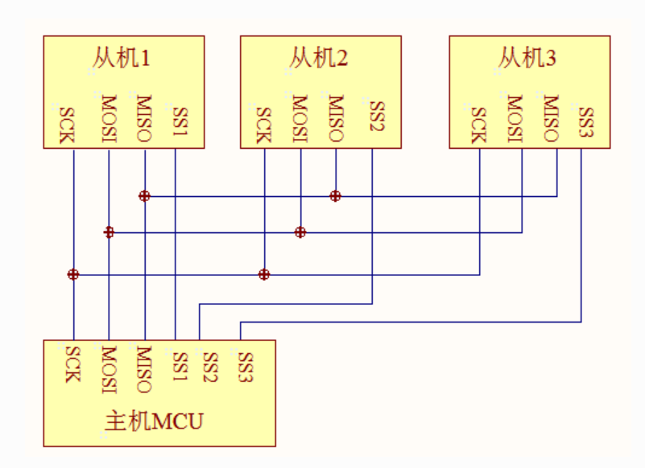

i2c通过i2c设备地址选择通信设备，而spi通过片选引脚选中要通信的设备。

imx6ull的每个ecspi接口提供了4个片选引脚（ss0-ss3），可以连接4个SPI设备，当然也可以使用外部GPIO扩展SPI设备的数量，
这样一个ecspi接口可连接的设备数由片选引脚树决定。

- 如果使用ecspi接口提供的片选引脚，ecspi总线驱动会处理好什么时候选ecspi设备。
- 如果使用外部GPIO作为片选引脚需要我们在ecspi设备驱动中设置什么时候选中ecspi。（或者在配置SPI时指定使用的片选引脚）。

通常情况下无特殊要求我们使用ecspi接口提供的片选引脚。

spi时序
^^^^^^^^^^^^^^^^^^^^^^^^^^^^^^

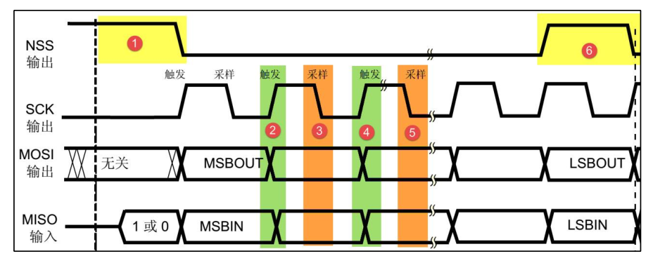

- 起始信号：NSS 信号线由高变低
- 停止信号：NSS 信号由低变高
- 数据传输：在 SCK的每个时钟周期 MOSI和 MISO同时传输一位数据，高/低位传输没有硬性规定

  - 传输单位：8位或16位
  - 单位数量：允许无限长的数据传输

spi通信模式
^^^^^^^^^^^^^^^^^^^^^^^^^^^^^^

总线空闲时 SCK 的时钟状态以及数据采样时刻

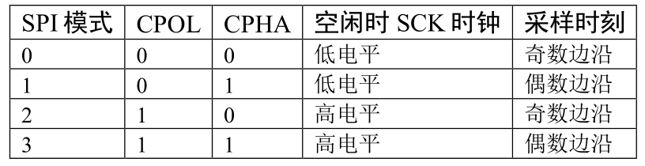

- 时钟极性 CPOL：指 SPI 通讯设备处于空闲状态时，SCK信号线的电平信号：

  - CPOL=0时，SCK在空闲状态时为低电平
  - CPOL=1时，SCK在空闲状态时为高电平

- 时钟相位 CPHA：数据的采样的时刻：

  - CPHA=0时，数据在SCK时钟线的“奇数边沿”被采样
  - CPHA=1时，数据在SCK时钟线的“偶数边沿”被采样

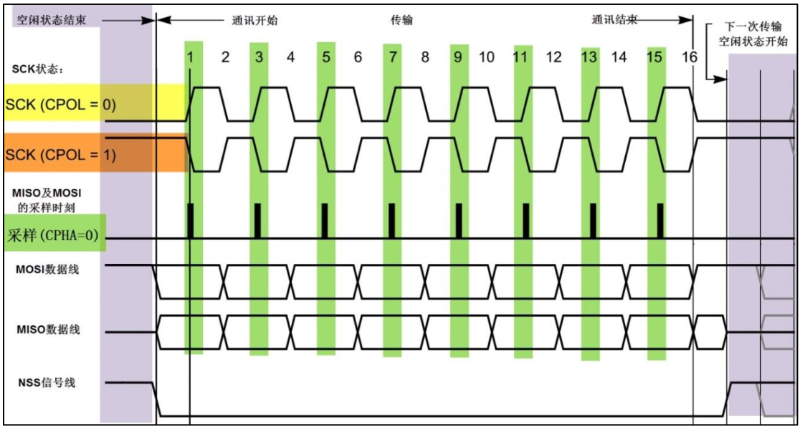

如上图所示：

SCK信号线在空闲状态为低电平时，CPOL=0；空闲状态为高电平时，CPOL=1。
CPHA=0，数据在 SCK 时钟线的“奇数边沿”被采样，当 CPOL=0 的时候，时钟的奇数边沿是上升沿，当 CPOL=1 的时候，时钟的奇数边沿是下降沿。

更多有关SPI通信协议的内容可以参考 **【野火®】零死角玩转STM32** 中spi章节。

ecspi驱动框架
~~~~~~~~~~~~~~~~~~~~~~~~~~~

ecspi设备驱动和i2c设备驱动非常相似，可对比学习。这一小节主要介绍ecspi驱动框架以及主要的结构体。

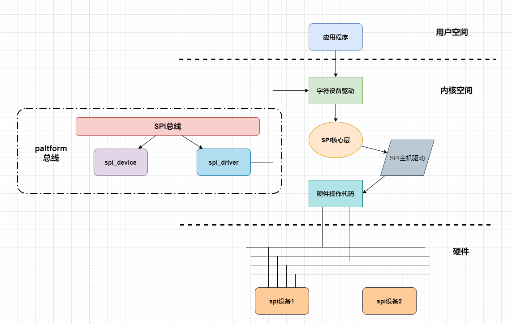

如框架图所示，ecspi可分为spi总线驱动和spi设备驱动。spi总线驱动已经由芯片厂商提供，我们适当了解其实现机制。
而spi设备驱动由我们自己编写，则需要明白其中的原理。spi设备驱动涉及到字符设备驱动、SPI核心层、SPI主机驱动，具体功能如下。

- SPI核心层：提供SPI控制器驱动和设备驱动的注册方法、注销方法、SPI通信硬件无关接口函数。
- SPI主机驱动：主要包含SPI硬件体系结构中适配器(spi控制器)的控制，用于产生SPI 读写时序。
- SPI设备驱动：通过SPI主机驱动与CPU交换数据。

关键数据结构
^^^^^^^^^^^^^^^^^^^^^^^^^^^^^^
这里对整个ecspi驱动框架所涉及的关键数据结构进行整理，可先跳过，后续代码中遇到这些数据结构时再回来看详细定义。

spi_master
'''''''''''''''''''''
spi_master会在SPI主机驱动中使用到。 spi_controller实际是一个宏，指向spi_controller结构体。

.. code-block:: c 
    :caption:  spi_controller （内核源码/include/linux/spi/spi.h）
    :linenos:
    #define spi_master  spi_controller

spi_controller
'''''''''''''''''''''
部分成员变量已经被省略，下面是spi_controller关键成员变量：

.. code-block:: c 
    :caption:  spi_controller结构体（内核源码/include/linux/spi/spi.h）
    :linenos:

    struct spi_controller {
        struct device	dev;
        ...
        struct list_head list;
        s16			bus_num;
        u16			num_chipselect;
        ...
        struct spi_message		*cur_msg;
        ...
        int			(*setup)(struct spi_device *spi);
        int			(*transfer)(struct spi_device *spi,
                            struct spi_message *mesg);
        void		(*cleanup)(struct spi_device *spi);
        struct kthread_worker		kworker;
        struct task_struct		*kworker_task;
        struct kthread_work		pump_messages;
        struct list_head		queue;
        struct spi_message		*cur_msg;
        
        ...
        int (*transfer_one)(struct spi_controller *ctlr, struct spi_device *spi,struct spi_transfer *transfer);
        int (*prepare_transfer_hardware)(struct spi_controller *ctlr);
        int (*transfer_one_message)(struct spi_controller *ctlr,struct spi_message *mesg);
        void (*set_cs)(struct spi_device *spi, bool enable);
        ...
        int			*cs_gpios;
    }

spi_controller中包含了各种函数指针，这些函数指针会在SPI核心层中被使用。

- **list：** 链表节点，芯片可能有多个spi控制器
- **bus_num：** spi控制器编号
- **num_chipselect：** spi片选信号的个数，对不同的从设备进行区分
- **cur_msg：** spi_message结构体类型，我们发送的信息都会被封装在这个结构体中。cur_msg，当前正带处理的消息队列
- **transfer：** 用于把数据加入控制器的消息队列中
- **cleanup：** 当spi_master被释放的时候，完成清理工作
- **kworker：** 内核线程工人，spi可以使用异步传输方式发送数据
- **pump_messages：** 具体传输工作
- **queue：** 所有等待传输的消息队列挂在该链表下
- **transfer_one_message：** 发送一个spi消息，类似IIC适配器里的algo->master_xfer，产生spi通信时序
- **cs_gpios：** 记录spi上具体的片选信号。

spi_driver结构体
'''''''''''''''''''''
.. code-block:: c 
    :caption:  spi_driver结构体 （内核源码/include/linux/spi/spi.h）
    :linenos:

    struct spi_driver {
    	const struct spi_device_id *id_table;
    	int			(*probe)(struct spi_device *spi);
    	int			(*remove)(struct spi_device *spi);
    	void			(*shutdown)(struct spi_device *spi);
    	struct device_driver	driver;
    };

- **id_table：** 用来和spi进行配对。
- **.probe：** spi设备和spi驱动匹配成功后，回调该函数指针

可以看到spi设备驱动结构体和我们之前讲过的i2c设备驱动结构体 *i2c_driver* 、平台设备驱动结构体 *platform_driver* 拥有相同的结构，用法也相同。

spi_device
'''''''''''''''''设备结构体''''

在spi驱动中一个spi设备结构体代表了一个具体的spi设备，它保存着这个spi设备的详细信息，也可以说是配置信息。
当驱动和设备匹配成功后（例如设备树节点）我们可以从.prob函数的参数中得到spi_device结构体。

.. code-block:: c 
    :caption:  spi_driver结构体（内核源码/include/linux/spi/spi.h）
    :linenos:
    :linenos:

    struct spi_device {
        struct device		dev;
        struct spi_controller	*controller;
        struct spi_controller	*master;	/* compatibility layer */
        u32			max_speed_hz;
        u8			chip_select;
        u8			bits_per_word;
        u16			mode;
       #define	SPI_CPHA	0x01			/* clock phase */
       #define	SPI_CPOL	0x02			/* clock polarity */
       #define	SPI_MODE_0	(0|0)			/* (original MicroWire) */
       #define	SPI_MODE_1	(0|SPI_CPHA)
       #define	SPI_MODE_2	(SPI_CPOL|0)
       #define	SPI_MODE_3	(SPI_CPOL|SPI_CPHA)
       #define	SPI_CS_HIGH	0x04			/* chipselect active high? */
       #define	SPI_LSB_FIRST	0x08			/* per-word bits-on-wire */
       #define	SPI_3WIRE	0x10			/* SI/SO signals shared */
       #define	SPI_LOOP	0x20			/* loopback mode */
       #define	SPI_NO_CS	0x40			/* 1 dev/bus, no chipselect */
       #define	SPI_READY	0x80			/* slave pulls low to pause */
       #define	SPI_TX_DUAL	0x100			/* transmit with 2 wires */
       #define	SPI_TX_QUAD	0x200			/* transmit with 4 wires */
       #define	SPI_RX_DUAL	0x400			/* receive with 2 wires */
       #define	SPI_RX_QUAD	0x800			/* receive with 4 wires */
        int			irq;
        void			*controller_state;
        void			*controller_data;
        char			modalias[SPI_NAME_SIZE];
        int			cs_gpio;	/* chip select gpio */

        /* the statistics */
        struct spi_statistics	statistics;
    };

- **dev：** device类型结构体。这是一个设备结构体，我们把它称为spi设备结构体、i2c设备结构体、平台设备结构体都是“继承”自设备结构体。它们根据各自的特点添加自己的成员，spi设备添加的成员就是后面要介绍的成员
- **controller：** 当前spi设备挂载在那个spi控制器
- **master：** spi_master类型的结构体。在总线驱动中，一个spi_master代表了一个spi总线，这个参数就是用于指定spi设备挂载到那个spi总线上
- **max_speed_hz：** 指定SPI通信的最大频率
- **chip_select：** spi总选用于区分不同SPI设备的一个标号，不要误以为他是SPI设备的片选引脚。指定片选引脚的成员在下面
- **bits_per_word：** 指定SPI通信时一个字节多少位，也就是传输单位
- **mode：** SPI工作模式，工作模式如以上代码中的宏定义。包括时钟极性、位宽等等，这些宏定义可以使用或运算“|”进行组合，这些宏定义在SPI协议中有详细介绍，这里不再赘述
- **irq：** 如果使用了中断，它用于指定中断号
- **cs_gpio：** 片选引脚。在设备树中设置了片选引脚，驱动和设别树节点匹配成功后自动获取片选引脚，我们也可以在驱动总通过设置该参数自定义片选引脚
- **statistics：** 记录spi名字，用来和spi_driver进行配对。

spi_transfer结构体
'''''''''''''''''''''

在spi设备驱动程序中，spi_transfer结构体用于指定要发送的数据，后面称为 *传输结构体* ：

.. code-block:: c 
    :caption:  spi_transfer结构体
    :linenos:

    struct spi_transfer {
    	/* it's ok if tx_buf == rx_buf (right?)
    	 * for MicroWire, one buffer must be null
    	 * buffers must work with dma_*map_single() calls, unless
    	 *   spi_message.is_dma_mapped reports a pre-existing mapping
    	 */
    	const void	*tx_buf;
    	void		*rx_buf;
    	unsigned	len;
    
    	dma_addr_t	tx_dma;
    	dma_addr_t	rx_dma;
    	struct sg_table tx_sg;
    	struct sg_table rx_sg;
    
    	unsigned	cs_change:1;
    	unsigned	tx_nbits:3;
    	unsigned	rx_nbits:3;
    #define	SPI_NBITS_SINGLE	0x01 /* 1bit transfer */
    #define	SPI_NBITS_DUAL		0x02 /* 2bits transfer */
    #define	SPI_NBITS_QUAD		0x04 /* 4bits transfer */
    	u8		bits_per_word;
    	u16		delay_usecs;
    	u32		speed_hz;
    
    	struct list_head transfer_list;
    };

传输结构体的成员较多，需要我们自己设置的很少，这里只介绍我们常用的配置项。

- **tx_buf：** 发送缓冲区，用于指定要发送的数据地址。
- **rx_buf：** 接收缓冲区，用于保存接收得到的数据，如果不接收不用设置或设置为NULL.
- **len：** 要发送和接收的长度，根据SPI特性发送、接收长度相等。
- **tx_dma、rx_dma：** 如果使用了DAM,用于指定tx或rx DMA地址。
- **bits_per_word：** speed_hz，分别用于设置每个字节多少位、发送频率。如果我们不设置这些参数那么会使用默认的配置，也就是我初始化spi是设置的参数。

spi_message结构体
'''''''''''''''''''''
总的来说spi_transfer结构体保存了要发送（或接收）的数据，而在SPI设备驱动中数据是以“消息”的形式发送。
spi_message是消息结构体，我们把它称为消息结构体，发送一个消息分四步，
依次为定义消息结构体、初始化消息结构体、“绑定”要发送的数据（也就是初始化好的spi_transfer结构）、执行发送。

spi_message结构体定义如下所示：

.. code-block:: c 
    :caption:  spi_message结构体
    :linenos:

    struct spi_message {
    	struct list_head	transfers;
    
    	struct spi_device	*spi;
    
    	unsigned		is_dma_mapped:1;
    
    	/* REVISIT:  we might want a flag affecting the behavior of the
    	 * last transfer ... allowing things like "read 16 bit length L"
    	 * immediately followed by "read L bytes".  Basically imposing
    	 * a specific message scheduling algorithm.
    	 *
    	 * Some controller drivers (message-at-a-time queue processing)
    	 * could provide that as their default scheduling algorithm.  But
    	 * others (with multi-message pipelines) could need a flag to
    	 * tell them about such special cases.
    	 */
    
    	/* completion is reported through a callback */
    	void			(*complete)(void *context);
    	void			*context;
    	unsigned		frame_length;
    	unsigned		actual_length;
    	int			status;
    
    	/* for optional use by whatever driver currently owns the
    	 * spi_message ...  between calls to spi_async and then later
    	 * complete(), that's the spi_master controller driver.
    	 */
    	struct list_head	queue;
    	void			*state;
    };

spi_message结构体成员我们比较陌生，如果我们不考虑具体的发送细节我们可以不用了解这些成员的含义，因为spi_message的初始化以及“绑定”spi_transfer传输结构体都是由内核函数实现。
唯一要说明的是第二个成员“spi”，它是一个spi_device类型的指针，我们讲解spi_device结构体时说过，一个spi设备对应一个spi_device结构体，这个成员就是用于指定消息来自哪个设备。

ecspi总线驱动
~~~~~~~~~~~~~~~~~~~~~~~~~~~

SPI核心层
^^^^^^^^^^^^^^^^^^^^^^^^^^^^^^

spi 总线注册
'''''''''''''''''''''

linux系统在开机的时候就会执行，自动进行spi总线注册。

.. code-block:: c 
    :caption: spi总线注册 （内核源码/drivers/spi/spi.c）
    :linenos:

    static int __init spi_init(void)
    {
        int	status;
        ...
        status = bus_register(&spi_bus_type);
        ...
        status = class_register(&spi_master_class);
        ...
    }

当总线注册成功之后，会在sys/bus下面生成一个spi总线，然后在系统中新增一个设备类，sys/class/目录下会可以找到spi_master类。

spi总线定义
'''''''''''''''''''''
spi_bus_type 总线定义，会在spi总线注册时使用。

.. code-block:: c 
    :caption: spi总线定义
    :linenos:

    struct bus_type spi_bus_type = {
        .name		= "spi",
        .dev_groups	= spi_dev_groups,
        .match		= spi_match_device,
        .uevent		= spi_uevent,
    };

.match函数指针，设定了spi设备和spi驱动的匹配规则，具体如下spi_match_device。

spi_match_device()函数
'''''''''''''''''''''

.. code-block:: c 
    :caption: spi总线注册 （内核源码/drivers/spi/spi.c）
    :linenos:

    static int spi_match_device(struct device *dev, struct device_driver *drv)
    {
        const struct spi_device	*spi = to_spi_device(dev);
        const struct spi_driver	*sdrv = to_spi_driver(drv);

        /* Attempt an OF style match */
        if (of_driver_match_device(dev, drv))
            return 1;

        /* Then try ACPI */
        if (acpi_driver_match_device(dev, drv))
            return 1;

        if (sdrv->id_table)
            return !!spi_match_id(sdrv->id_table, spi);

        return strcmp(spi->modalias, drv->name) == 0;
    }

函数提供了四种匹配方式，设备树匹配方式和acpi匹配方式以及id_table匹配方式，如果前面三种都没有匹配成功，则通过设备名进行配对。

spi控制器驱动
^^^^^^^^^^^^^^^^^^^^^^^^^^^^^^
我们使用的IMX6ull芯片有4个spi控制器，对应的设备树存在4个节点

.. code-block:: dts 
    :caption: ecspi3 设备树节点 （内核源码/arch/arm/boot/dts/imx6ull.dtsi）
    :linenos:
        
    ecspi3: ecspi@2010000 {
        #address-cells = <1>;
        #size-cells = <0>;
        compatible = "fsl,imx6ul-ecspi", "fsl,imx51-ecspi";
        reg = <0x2010000 0x4000>;
        interrupts = <GIC_SPI 33 IRQ_TYPE_LEVEL_HIGH>;
        clocks = <&clks IMX6UL_CLK_ECSPI3>,
            <&clks IMX6UL_CLK_ECSPI3>;
        clock-names = "ipg", "per";
        dmas = <&sdma 7 7 1>, <&sdma 8 7 2>;
        dma-names = "rx", "tx";
        status = "disabled";
    };

reg为spi3寄存器组相关的起始地址为0x2010000，寄存器长度为0x4000。其他属性暂时不需要了解。

module_platform_driver()宏

.. code-block:: c 
    :caption: module_platform_driver()宏 （内核源码/include/linux/platform_device.h）
    :linenos:
        
    #define module_platform_driver(__platform_driver) \
        module_driver(__platform_driver, platform_driver_register, \
                platform_driver_unregister)

module_driver()展开如下:

.. code-block:: c 
    :caption: module_driver（内核源码/include/linux/device.h）
    :linenos:

    #define module_driver(__driver, __register, __unregister, ...) \
    static int __init __driver##_init(void) \
    { \
        return __register(&(__driver) , ##__VA_ARGS__); \
    } \
    module_init(__driver##_init); \

- __driver：即为module_platform_driver()宏中的__platform_driver，也就是spi_imx_driver。
- __register：platform_driver_register
- __unregister：platform_driver_unregister
- \##\__VA_ARGS__：可变参数

module_platform_driver用于注册平台设备,我们向函数传入platform_driver结构体类型的spi_imx_driver结构体变量，

module_platform_driver(spi_imx_driver)

.. code-block:: c 
    :caption: spi_imx_driver_init函数 （内核源码/include/linux/device.h）
    :linenos:

    static int __init spi_imx_driver_init(void) \
    { \
        return platform_driver_register(&(spi_imx_driver) , ##__VA_ARGS__); \
    } \
    module_init(spi_imx_driver_init); \

spi_imx_probe()函数
'''''''''''''''''''''
spi_imx_probe()函数主要有如下功能：
获取设备树节点信息，初始化spi时钟、dma、中断等，
保存spi寄存器起始地址，填充spi控制器回调函数。

代码如下（部分被省略）：

.. code-block:: c 
    :caption: spi_imx_probe函数 （内核源码/drivers/spi/spi-imx.c）
    :linenos:

    static int spi_imx_probe(struct platform_device *pdev)
    {
        struct device_node *np = pdev->dev.of_node;
        const struct of_device_id *of_id =
                of_match_device(spi_imx_dt_ids, &pdev->dev);
        struct spi_imx_master *mxc_platform_info =
                dev_get_platdata(&pdev->dev);
        struct spi_master *master;
        struct spi_imx_data *spi_imx;
        struct resource *res;
        const struct spi_imx_devtype_data *devtype_data = of_id ? of_id->data :
            (struct spi_imx_devtype_data *)pdev->id_entry->driver_data;
        bool slave_mode;
        ...
        slave_mode = devtype_data->has_slavemode &&
                of_property_read_bool(np, "spi-slave");
        if (slave_mode)
            master = spi_alloc_slave(&pdev->dev,
                        sizeof(struct spi_imx_data));
        else
            master = spi_alloc_master(&pdev->dev,
                        sizeof(struct spi_imx_data));
        if (!master)
            return -ENOMEM;
        ...
            ret = of_property_read_u32(np, "fsl,spi-num-chipselects", &num_cs);
            if (ret < 0) {
                if (mxc_platform_info) {
                    num_cs = mxc_platform_info->num_chipselect;
                    master->num_chipselect = num_cs;
                }
            } else {
                master->num_chipselect = num_cs;
            }
        
        spi_imx = spi_master_get_devdata(master);
        spi_imx->bitbang.master = master;
        spi_imx->dev = &pdev->dev;
        spi_imx->slave_mode = slave_mode;

        spi_imx->devtype_data = devtype_data;

        master->cs_gpios = devm_kzalloc(&master->dev,
                sizeof(int) * master->num_chipselect, GFP_KERNEL);
        
        spi_imx->bitbang.chipselect = spi_imx_chipselect;
        spi_imx->bitbang.setup_transfer = spi_imx_setupxfer;
        spi_imx->bitbang.txrx_bufs = spi_imx_transfer;
        spi_imx->bitbang.master->setup = spi_imx_setup;
        spi_imx->bitbang.master->cleanup = spi_imx_cleanup;
        spi_imx->bitbang.master->prepare_message = spi_imx_prepare_message;
        spi_imx->bitbang.master->unprepare_message = spi_imx_unprepare_message;
        spi_imx->bitbang.master->slave_abort = spi_imx_slave_abort;
        spi_imx->bitbang.master->mode_bits = SPI_CPOL | SPI_CPHA | SPI_CS_HIGH \
        ...
        init_completion(&spi_imx->xfer_done);

        res = platform_get_resource(pdev, IORESOURCE_MEM, 0);
        spi_imx->base = devm_ioremap_resource(&pdev->dev, res);
        ...
        ret = spi_bitbang_start(&spi_imx->bitbang);
        ...
    }

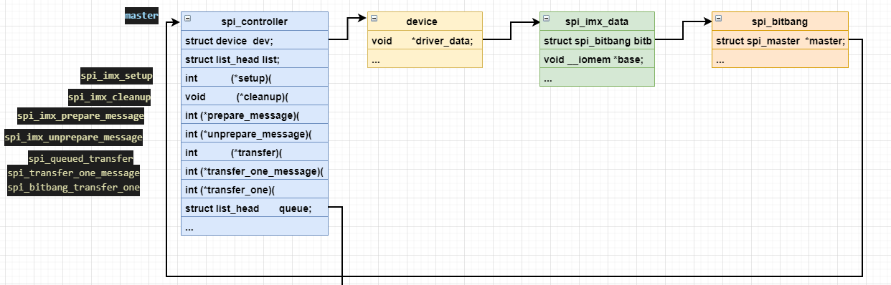

- 第2-13行： 声明一些必要的变量，这些结构体的关系如上所示。
- 第16行： of_property_read_bool（）去设备树节点读取指定的值保存在slave_mode中，spi-slave的值指定spi是工作在主模式还是从模式下面。
- 第17-24行：  根据slave_mode的值为master分配内存。
- 第26-34行：读取spi片选数量，保存在num_cs中，然后将值赋给master。使用时，就可以通过spi_controller获取片选信号。
- 第37行：将spi_bitbang结构体指向spi控制器，spi_bitbang的作用就是让我们使用普通GPIO来模拟spi时序。由于我们不使用普通GPIO模拟spi，这部分就不深入讲解
- 第38-41行： 对spi_imx其他成员进行初始化。
- 第43行： 对master中的cs_gpios动态申请内存。用来存放spi控制器所使用的引脚。
- 第46-54行： 为spi_bitbang设置了一系列的回调函数，这里重要的有spi_imx_setup、spi_imx_cleanup、spi_imx_prepare_message、spi_imx_unprepare_message,后面会一一介绍。
- 第58、59行： 获取设备树spi控制器的基地址，并进行虚拟地址映射，存放现在spi_imx结构体变量中的base成员中。
- 第61行： 接下来调用spi_bitbang_start函数传入bitbang指针，下面是spi_bitbang_start函数。

spi_bitbang_start()函数
'''''''''''''''''''''

.. code-block:: c 
    :caption: spi_bitbang_start函数 （内核源码/drivers/spi/spi-bitbang.c）
    :linenos:

    int spi_bitbang_start(struct spi_bitbang *bitbang)
    {
        struct spi_master *master = bitbang->master;
        int ret;

        if (!master || !bitbang->chipselect)
            return -EINVAL;

        mutex_init(&bitbang->lock);

        if (!master->mode_bits)
            master->mode_bits = SPI_CPOL | SPI_CPHA | bitbang->flags;

        if (master->transfer || master->transfer_one_message)
            return -EINVAL;

        master->prepare_transfer_hardware = spi_bitbang_prepare_hardware;
        master->unprepare_transfer_hardware = spi_bitbang_unprepare_hardware;
        master->transfer_one = spi_bitbang_transfer_one;
        master->set_cs = spi_bitbang_set_cs;

        if (!bitbang->txrx_bufs) {
            bitbang->use_dma = 0;
            bitbang->txrx_bufs = spi_bitbang_bufs;
            if (!master->setup) {
                if (!bitbang->setup_transfer)
                    bitbang->setup_transfer =
                        spi_bitbang_setup_transfer;
                master->setup = spi_bitbang_setup;
                master->cleanup = spi_bitbang_cleanup;
            }
        }

        /* driver may get busy before register() returns, especially
        * if someone registered boardinfo for devices
        */
        ret = spi_register_master(spi_master_get(master));
        if (ret)
            spi_master_put(master);

        return ret;
    }

    EXPORT_SYMBOL_GPL(spi_bitbang_start);

- 第6-15行： 对传入的bitbang结构体成员进行判断。
- 第17-20行：  对master的回调函数进行填充。
- 第37行： 调用spi_register_master将master注册进linux。

ecspi设备驱动
~~~~~~~~~~~~~~~~~~~~~~~~~~~
ecspi总线驱动，由硬件供应商提供，我们只需要了解，学习其原理就行。
下面涉及的函数，我们将会在ecspi设备驱动中使用。

核心函数
^^^^^^^^^^^^^^^^^^^^^^^^^^^^^^

ecspi设备的注册和注销函数分别在驱动的入口和出口函数中调用，这与平台设备驱动、i2c设备驱动相同，

ecspi设备注册和注销函数如下：

.. code-block:: c
    :caption:  ecspi设备注册和注销函数
    :linenos:

    int spi_register_driver(struct spi_driver *sdrv)
    static inline void spi_unregister_driver(struct spi_driver *sdrv)

对比i2c设备的注册和注销函数，不难发现把“spi”换成“i2c”就是i2c设备的注册和注销函数了，并且用法相同。

**参数：**

- **spi** spi_driver类型的结构体（spi设备驱动结构体），一个spi_driver结构体就代表了一个ecspi设备驱动

**返回值：**

- **成功：** 0
- **失败：** 其他任何值都为错误码

spi_setup()函数
'''''''''''''''''''''

函数设置spi设备的片选信号、传输单位、最大传输速率等，函数中调用spi控制器的成员controller->setup()，
也就是spi_imx->bitbang.master->setup(),在函数spi_imx_probe()中我们将spi_imx_setup赋予该结构体。

.. code-block:: c 
    :caption: spi_setup函数（内核源码/drivers/spi/spi.c）
    :linenos:

    int spi_setup(struct spi_device *spi)

**参数：**

- **spi** spi_device spi设备结构体

**返回值：**

- **成功：** 0
- **失败：** 其他任何值都为错误码

spi_message_init()函数
'''''''''''''''''''''

初始化spi_message，

.. code-block:: c 
    :caption: spi_message_init函数（内核源码/include/linux/spi/spi.h）
    :linenos:

    static inline void spi_message_init(struct spi_message *m)
    {
        memset(m, 0, sizeof *m);
        spi_message_init_no_memset(m);
    }

**参数：**

- **m** spi_message 结构体指针，spi_message结构体定义和介绍可在前面关键数据结构中找到。

**返回值：** 无。

spi_message_add_tail()函数
'''''''''''''''''''''

.. code-block:: c 
    :caption: spi_message_init函数（内核源码/include/linux/spi/spi.h）
    :linenos:

    static inline void spi_message_add_tail(struct spi_transfer *t, struct spi_message *m)
    {
        list_add_tail(&t->transfer_list, &m->transfers);
    }

这个函数很简单就是将将spi_transfer结构体添加到spi_message队列的末尾。

ecspi同步与互斥
^^^^^^^^^^^^^^^^^^^^^^^^^^^^^^

在spi_controller中有一个函数指针transfer_one，
回头去看spi_bitbang_start()函数，其中spi_bitbang_transfer_one就是来初始化该函数指针的;

spi_message通过成员变量queue将一系列的spi_message串联起来，第一个spi_message挂在struct list_head queue下面
spi_message还有struct list_head transfers成员变量，transfer也是被串联起来的，如下图所示。

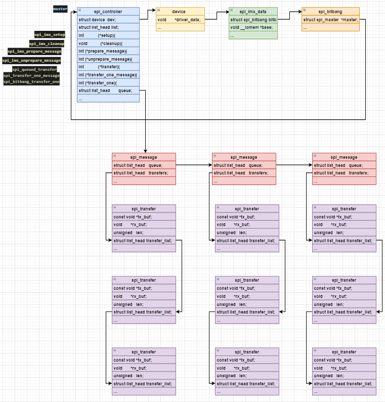

SPI同步传输数据
'''''''''''''''''''''
阻塞当前线程进行数据传输，spi_sync()内部调用__spi_sync()函数，mutex_lock（）和mutex_unlock（）为互斥锁的加锁和解锁。

.. code-block:: c 
    :caption: spi_sync()函数（内核源码/drivers/spi/spi.c）
    :linenos:

    int spi_sync(struct spi_device *spi, struct spi_message *message)
    {
        int ret;

        mutex_lock(&spi->controller->bus_lock_mutex);
        ret = __spi_sync(spi, message);
        mutex_unlock(&spi->controller->bus_lock_mutex);

        return ret;
    }

__spi_sync()函数实现如下：

.. code-block:: c 
    :caption: __spi_sync()函数（内核源码/drivers/spi/spi.c）
    :linenos:

    static int __spi_sync(struct spi_device *spi, struct spi_message *message)
    {
        int status;
        struct spi_controller *ctlr = spi->controller;
        unsigned long flags;

        status = __spi_validate(spi, message);
        if (status != 0)
            return status;

        message->complete = spi_complete;
        message->context = &done;
        message->spi = spi;
        ...
        if (ctlr->transfer == spi_queued_transfer) {
            spin_lock_irqsave(&ctlr->bus_lock_spinlock, flags);

            trace_spi_message_submit(message);

            status = __spi_queued_transfer(spi, message, false);

            spin_unlock_irqrestore(&ctlr->bus_lock_spinlock, flags);
        } else {
            status = spi_async_locked(spi, message);
        }
        
        
        if (status == 0) {
            ...
            wait_for_completion(&done);
            status = message->status;
        }
        message->context = NULL;
        return status;
    }
- 第7-9行： 函数内部首先调用__spi_validate对spi各个通信参数进行校验
- 第11-13行： 对message结构体进行初始化，其中第11行，当消息发送完毕后，spi_complete回调函数将被执行。
- 第30行： 阻塞当前线程，当message发送完成时结束阻塞。

SPI异步传输数据
'''''''''''''''''''''

.. code-block:: c 
    :caption: spi_async()函数（内核源码/drivers/spi/spi.c）
    :linenos:

    int spi_async(struct spi_device *spi, struct spi_message *message)
    {
        ...
        ret = __spi_async(spi, message);
        ...
    }

在驱动程序中调用async时不会阻塞当前进程，只是把当前message结构体添加到当前spi控制器成员queue的末尾。
然后在内核中新增加一个工作，这个工作的内容就是去处理这个message结构体。

.. code-block:: c 
    :caption: __spi_async()函数（内核源码/drivers/spi/spi.c）
    :linenos:

    static int __spi_async(struct spi_device *spi, struct spi_message *message)
    {
        struct spi_controller *ctlr = spi->controller;
        ...
        return ctlr->transfer(spi, message);
    }

oled屏幕驱动实验
~~~~~~~~~~~~~~~~~~~~~~

ecspi_oled驱动和我们上一节介绍的i2c_mpu6050设备驱动非常相似，可对比学习，推荐先学习i2c_mpu6050驱动，因为这里会省略一部分在i2c_mpu6050绍过的内容。

**本章配套源码和设备树插件位于base_code/linux_driver/ecSPI_OLED**。

硬件介绍
^^^^^^^^^^^^^^^^^^^^^^^^^^^^^^

硬件原理图分析
>>>>>>>>>>>>>>>>>>>>>
在oled驱动中我们使用ecspi1，可以通过IMX6ul的芯片手册查到，ecspi使用到的引脚如下。

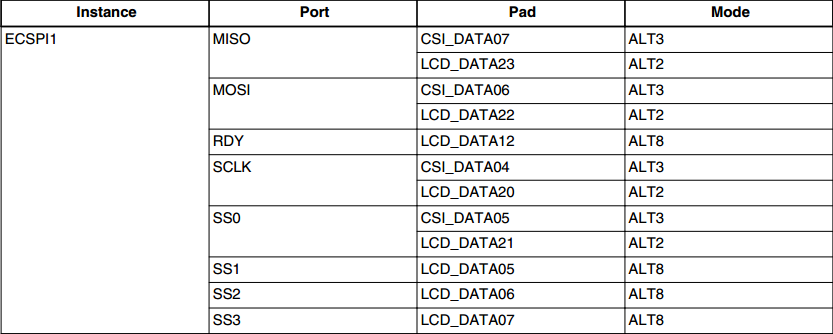

在我们实验中ecspi1使用CSI_DATA04-CSI_DATA07，oled屏和ecspi引脚对应入下。

.. csv-table::  
    :header: "SPI_OLED显示屏", "功能", "说明", "引脚引出位置（排针）"
    :widths: 15, 30,30,30

    "MOSI", "ECSPI1_MOSI", "MOSI引脚", "CN5排针 IO4.25 脚"
    "未使用", "ECSPI1\_ MISO", "MISO引脚", "CN5排针 IO4.28 脚"
    "CLK", "ECSPI1_SCLK", "ECSPI时钟引脚", "CN5排针 IO4.27 脚"
    "D/C ", "GPIO4_IO24", "数据、命令控制引脚", "CN5排针 IO4.24脚"
    "CS", "ECSPI1_SS0", "片选引脚", "CN5排针 IO4.26脚"
    "GND", "电源-", " ", "GND"
    "VCC", "电源+", " ", "3.3V"

设备树插件
>>>>>>>>>>>>>>>>>>>>>
设备树插件书写格式不变，我们重点讲解ecspi_oled设备节点。

.. code-block:: dts 
    :caption:  ecspi_oled设备树插件 （base_code/linux_driver/ecSPI_OLED/imx-fire-ecspi-oled-overlay.dts）
    :linenos:

    /dts-v1/;
    /plugin/;
    #include "imx6ul-pinfunc.h"
    
    /{
        fragment@0 {
            target = <&ecspi1>;
            __overlay__ { 
                fsl,spi-num-chipselects = <1>; ------①
                cs-gpios = <&gpio4 26 0>;     -------②
                pinctrl-names = "default";
                pinctrl-0 = <&pinctrl_ecspi1>; ------③
                status = "okay";

                ecspi_oled@0 {
                    d_c_control_pin = <&gpio4 24 0>; ------①
                    compatible = "fire,ecspi_oled";
                    spi-max-frequency = <20000000>; -------②
                    reg = <0>;                      -------③
                };        
            };
        };

        fragment@1 {
            target = <&iomuxc>;
            __overlay__ { 
                pinctrl_ecspi1: ecspi1grp {
                    fsl,pins = <
                        MX6UL_PAD_CSI_DATA07__ECSPI1_MISO  0x10b0
                        MX6UL_PAD_CSI_DATA06__ECSPI1_MOSI  0x10b0
                        MX6UL_PAD_CSI_DATA04__ECSPI1_SCLK  0x10b0
                        MX6UL_PAD_CSI_DATA05__ECSPI1_SS0   0x10b0
                        MX6UL_PAD_CSI_DATA03__GPIO4_IO24   0x10b0
                    >;
                }; 
            };
        };
    };

- 第7行: 向ecspi1节点追加内容
- 第9行: 指定设备的数量，当前只有一个ecspi_oled，设置为1。
- 第10行: 指定使用的片选引脚，我们这里使用的是CS1既GPIO4_26。
- 第12行: 指定ecspi1使用的pinctrl节点，也就是说指定ecspi1要使用的引脚。

- 第15行: 向ecspi1节点追加ecspi_oled子节点
- 第16行: 指定ecspi_oled使用的D/C控制引脚，在驱动程序中会控制该引脚设置发送的是命令还是数据。
- 第18行: 设置SPI传输的最大频率，
- 第19行: 设置reg属性为0,表示ecspi_oled连接到ecspi的通道0

- 第25行: 向pinctrl子系统节点追加ecspi_oled使用到的引脚。

向pinctrl子系统添加引脚具体内容可参考 *GPIO子系统章节* 。这里使用了5个引脚它们与ecspi_oled显示屏引脚对应关系、引脚的功能、以及在开发板上的位置如上表所示。
需要注意的是ecspi_oled显示屏没有MISO引脚，直接空出即可，ecspi_oled显示屏需要一个额外的引脚连接D/C,
用于控制spi发送的是数据还是控制命令（高电平是数据，低电平是控制命令）。

实验代码讲解
^^^^^^^^^^^^^^^^^^^^^^^^^^^^^^

编程思路
>>>>>>>>>>>>>>>>>>>>>>>>
ecspi_oled驱动使用设备树插件方式开发,主要工作包三部分内容。

- 第一，编写ecspi_oled的设备树插件（硬件部分已介绍），
- 第二，编写ecspi_oled驱动程序，包含驱动的入口、出口函数实现，.prob函数实现，file_operations函数集实现。
- 第三，编写简单测试应用程序。

oled驱动实现
>>>>>>>>>>>>>>>>>>>>>>>>
ecspi_oled的驱动结构和上一章的i2c_mpu6050完全相同。这里不再赘述，直接讲解实现代码。如下所示。

驱动的入口和出口函数实现
''''''''''''''''''''''''

驱动入口和出口函数与I2C_mpu6050驱动相似，只是把i2c替换为ecspi,源码如下所示。

.. code-block:: c
    :caption:  驱动入口函数实现（base_code/linux_driver/ecSPI_OLED/ecspi_oled.c）
    :linenos:

    /*指定 ID 匹配表*/
    static const struct spi_device_id oled_device_id[] = {
    	{"fire,ecspi_oled", 0},
    	{}};
    
    /*指定设备树匹配表*/
    static const struct of_device_id oled_of_match_table[] = {
    	{.compatible = "fire,ecspi_oled"},
    	{}};

    /*spi总线设备结构体*/
    struct spi_driver oled_driver = {
    	.probe = oled_probe,
    	.remove = oled_remove,
    	.id_table = oled_device_id,
    	.driver = {
    		.name = "ecspi_oled",
    		.owner = THIS_MODULE,
    		.of_match_table = oled_of_match_table,
    	},
    };

    /*
    *驱动初始化函数
    */
    static int __init oled_driver_init(void)
    {
    	int error;
    	pr_info("oled_driver_init\n");
    	error = spi_register_driver(&oled_driver);
    	return error;
    }
    
    /*
    *驱动注销函数
    */
    static void __exit oled_driver_exit(void)
    {
    	pr_info("oled_driver_exit\n");
    	spi_unregister_driver(&oled_driver);
    }

- 第2-9行： 这里定义了两个匹配表，第一个是传统的匹配表（可省略）。第二个是和设备树节点匹配的匹配表，保证与设备树节点.compatible属性设定值相同即可。
- 第12-21行： 定义spi_driver类型结构体。该结构体可类比i2c_driver和platform_driver。
- 第26-41行： 驱动的入口和出口函数，在入口函数只需要注册一个spi驱动，在出口函数中注销它

.prob函数实现
''''''''''''''''''''''''

在.prob函数中完成两个主要工作，第一，初始化ecspi，第二，申请一个字符设备。

.. code-block:: c
    :caption:  .prob函数实现（base_code/linux_driver/ecSPI_OLED/ecspi_oled.c）
    :linenos:

    static int oled_probe(struct spi_device *spi)
    {
    	printk(KERN_EMERG "\t  match successed  \n");
    	/*获取 ecspi_oled 设备树节点*/
    	oled_device_node = of_find_node_by_path("/soc/aips-bus@2000000/spba-bus@2000000/ecspi@2008000/ecspi_oled@0");
    	if (oled_device_node == NULL)
    	{
    		printk(KERN_EMERG "\t  get ecspi_oled@0 failed!  \n");
    	}
    	/*获取 oled 的 D/C 控制引脚并设置为输出，默认高电平*/
    	oled_control_pin_number = of_get_named_gpio(oled_device_node, "d_c_control_pin", 0);
    	gpio_direction_output(oled_control_pin_number, 1);
    	/*初始化spi*/
    	oled_spi_device = spi;  ----①
    	oled_spi_device->mode = SPI_MODE_0; ---②
    	oled_spi_device->max_speed_hz = 2000000; ---③
    	spi_setup(oled_spi_device);
        /*注册字符设备*/
        ret = alloc_chrdev_region(&oled_devno, 0, DEV_CNT, DEV_NAME);
        if (ret < 0)
        {
            printk("fail to alloc oled_devno\n");
            goto alloc_err;
        }
        /*关联字符设备结构体cdev与文件操作结构体file_operations*/
        oled_chr_dev.owner = THIS_MODULE;
        cdev_init(&oled_chr_dev, &oled_chr_dev_fops);
        /*添加设备至cdev_map散列表中*/
        ret = cdev_add(&oled_chr_dev, oled_devno, DEV_CNT);
        if (ret < 0)
        {
            printk("fail to add cdev\n");
            goto add_err;
        }
        /*创建类*/
        class_oled = class_create(THIS_MODULE, DEV_NAME);
        /*创建设备 DEV_NAME 指定设备*/
        device_oled = device_create(class_oled, NULL, oled_devno, NULL, DEV_NAME);
        
        ...

    	return 0;
    }

.prob函数介绍如下：

- 第6-10行： 根据设备树节点路径获取节点。
- 第13-14行： 获取ecspi_oled的D/C控制引脚。并设置为高电平。
- 第17行： .prob函数传回的spi_device结构体，根据之前讲解，该结构体代表了一个ecspi(spi)设备，我们通过它配置SPI,这里设置的内容将会覆盖设备树节点中设置的内容。
- 第18行： 设置SPI模式为SPI_MODE_0。
- 第19行： 设置最高频率为2000000，设备树中也设置了该属性，则这里设置的频率为最终值。
- 第23-46行：注册字符设备、创建设备。 

字符设备操作函数集实现
''''''''''''''''''''''''
字符设备操作函数集是驱动对外的接口，我们要在这些函数中实现对ecspi_oled的初始化、写入、关闭等等工作。
这里共实现三个函数，.open函数用于实现ecspi_oled的初始化，.write函数用于向ecspi_oled写入显示数据，.release函数用于关闭ecspi_oled。

**.open函数实现**

在open函数中完成ecspi_oled的初始化，代码如下：

.. code-block:: c 
    :caption:  .open函数实现（base_code/linux_driver/ecSPI_OLED/ecspi_oled.c）
    :linenos:

    /*字符设备操作函数集，open函数实现*/
    static int oled_open(struct inode *inode, struct file *filp)
    {
    	spi_oled_init(); //初始化显示屏
    	return 0;
    }
    
    /*oled 初始化函数*/
    void spi_oled_init(void)
    {
    	/*初始化oled*/
    	oled_send_commands(oled_spi_device, oled_init_data, sizeof(oled_init_data));
    
    	/*清屏*/
    	oled_fill(0x00);
    }
    
    static int oled_send_commands(struct spi_device *spi_device, u8 *commands, u16 lenght)
    {
    	int error = 0;
    	struct spi_message *message;   //定义发送的消息
    	struct spi_transfer *transfer; //定义传输结构体
    
    	/*申请空间*/
    	message = kzalloc(sizeof(struct spi_message), GFP_KERNEL);
    	transfer = kzalloc(sizeof(struct spi_transfer), GFP_KERNEL);
    	/*设置 D/C引脚为低电平*/
    	gpio_direction_output(oled_control_pin_number, 0);
    	/*填充message和transfer结构体*/
    	transfer->tx_buf = commands;
    	transfer->len = lenght;
    	spi_message_init(message);
    	spi_message_add_tail(transfer, message);
    	error = spi_sync(spi_device, message);

    	kfree(message);
    	kfree(transfer);
    	if (error != 0)
    	{
    		printk("spi_sync error! \n");
    		return -1;
    	}
    	return error;
    }

如上代码所示，open函数只调用了自定义spi_oled_init函数，在spi_oled_init函数函数中调用oled_send_commands函数初始化ecspi_oled，然后调用清屏函数。
这里主要讲解oled_send_commands函数：

- 第21、22行： 定义spi_message结构体和spi_transfer结构体。
- 第25、26行： 为节省内核栈空间这里使用kzalloc为它们分配空间，这两个结构体大约占用100字节，推荐这样做。
- 第28行： 设置 D/C引脚为低电平，前面说过，ecspi_oled的D/C引脚用于控制发送的命令或数据，低电平时表示发送的是命令。
- 第30-34行： 这里就是我们之前讲解的发送流程依次为初始化spi_transfer结构体指定要发送的数据、初始化消息结构体、将消息结构体添加到队尾部、调用spi_sync函数执行同步发送。。
- 第36-43行： 释放空间。

**.write函数实现**

.write函数用于接收来自应用程序的数据，并显示这些数据。函数实现如下所示：

.. code-block:: c 
    :caption:  .write函数实现（base_code/linux_driver/ecSPI_OLED/ecspi_oled.c）
    :linenos:

    /*字符设备操作函数集，.write函数实现*/
    static int oled_write(struct file *filp, const char __user *buf, size_t cnt, loff_t *off)
    {
        int copy_number=0;
        /*申请内存*/
        oled_display_struct *write_data;
        write_data = (oled_display_struct*)kzalloc(cnt, GFP_KERNEL);
        copy_number = copy_from_user(write_data, buf,cnt);
        oled_display_buffer(write_data->display_buffer, write_data->x, write_data->y, write_data->length);
        /*释放内存*/
        kfree(write_data);
        return 0;
    }

    static int oled_display_buffer(u8 *display_buffer, u8 x, u8 y, u16 length)
    
    /*数据发送结构体*/
    typedef struct oled_display_struct
    {
        u8 x;
        u8 y;
        u32 length;
        u8 display_buffer[];
    }oled_display_struct;

代码介绍如下：

- 第2行： .write函数，我们重点关注两个参数buf保存来自应用程序的数据地址，我们需要把这些数据拷贝到内核空间才能使用，参数cnt指定数据长度。
- 第6行： 定义oled_display_struct结构体并保存来自用户空间的数据。
- 第7-8行： 使用kzalloc为oled_display_struct结构体分配空间，因为在应用程序中使用相同的结构体，所以这里直接根据参数“cnt”分配空间，分配成功后执行“copy_from_user”即可。
- 第9行： 调用自定义函数oled_display_buffer显示数据。
- 第11行： 释放空间 

- 第15行： 函数原型如第四部分所示，参数display_buffer指定要显示的点阵数据x、y用于指定显示起始位置，length指定显示长度。具体函数实现也很简单，这里不再赘述。
- 第25行： oled_display_struct结构体是自定义的一个结构体。它是一个可变长度结构体，参数 x 、y用于指定数据显示位置，参数length指定数据长度，柔性数组display_buffer[]用于保存来自用户空间的显示数据。

**.release函数实现**

.release函数功能仅仅是向ecspi_oled显示屏发送关闭显示命令，源码如下：

.. code-block:: c 
    :caption:  .release函数实现（base_code/linux_driver/ecSPI_OLED/ecspi_oled.c）
    :linenos:

    /*字符设备操作函数集，.release函数实现*/
    static int oled_release(struct inode *inode, struct file *filp)
    {
    	oled_send_command(oled_spi_device, 0xae);//关闭显示
    	return 0;
    }

oled测试应用程序实现
>>>>>>>>>>>>>>>>>>>>>
测试应用程序主要工作是实现oled显示屏实现刷屏、显示文字、显示图片。

测试程序需要用到字符以及图片的点阵数据保存在oled_code_table.c文件，为方便管理我们编写了一个简单makefile文件方便我们编译程序。

.. image:: ./media/ecspio002.png
   :align: center
   :alt: 2|

makefile文件如下所示：

.. code-block:: Makefile 
    :caption:  Makefile（base_code/linux_driver/ecSPI_OLED/test_app/Makefile.c）
    :linenos:

    out_file_name = "test_app"

    all: test_app.c oled_code_table.c
    	arm-linux-gnueabihf-gcc $^ -o $(out_file_name)
    
    .PHONY: clean
    clean:
    	rm $(out_file_name)

Makefile很简单，就不加以说明。

下面是我们的测试程序源码。如下所示：

.. code-block:: c 
    :caption:  测试应用程序 Makefile（base_code/linux_driver/ecSPI_OLED/test_app/test_app.c）
    :linenos:

    /*点阵数据*/
    extern unsigned char F16x16[];
    extern unsigned char F6x8[][6];
    extern unsigned char F8x16[][16];
    extern unsigned char BMP1[];
    
    int main(int argc, char *argv[])
    {
        int error = -1;
        /*打开文件*/
        int fd = open("/dev/ecspi_oled", O_RDWR);
        if (fd < 0)
        {
            printf("open file : %s failed !\n", argv[0]);
            return -1;
        }
        /*显示图片*/
        show_bmp(fd, 0, 0, BMP1, X_WIDTH*Y_WIDTH/8);
        sleep(3);

        /*显示文字*/
        oled_fill(fd, 0, 0, 127, 7, 0x00);  //清屏
        oled_show_F16X16_letter(fd,0, 0, F16x16, 4);  //显示汉字
        oled_show_F8X16_string(fd,0,2,"F8X16:THIS IS ecSPI TEST APP"); 
        oled_show_F6X8_string(fd, 0, 6,"F6X8:THIS IS ecSPI TEST APP");
        sleep(3);

        oled_fill(fd, 0, 0, 127, 7, 0x00);  //清屏
        oled_show_F8X16_string(fd,0,0,"Testing is completed"); 
        sleep(3);
    
        /*关闭文件*/
        error = close(fd);
        if(error < 0)
        {
            printf("close file error! \n");
        }
    
        return 0;
    }

测试程序很简单，完整代码请参考配套例程，结合代码简单介绍如下：
- 第2-5行： 测试程序要用到的点阵数据，我们显示图片、汉字之前都要把它们转化为点阵数据。这么转？，野火spi_oled模块配套资料提供有转换工具以及使用说明。
- 第11行： 打开ecspi_oled的设备节点，这个根据自己的驱动而定，我们使用的驱动源码就是这个路径。
- 第18行： 显示图片测试，这里需要说明的是由于测试程序不那么完善，图片显示起始位置x坐标应当设置为0，这样在循环显示时才不会乱。显示长度应当为显示屏的像素数除以8，因为每个字节8位，这8位控制8个像素点。
- 第22-25行： 测试显示汉字和不同规格的字符。
- 第28-33行： 显示测试结束提示语，之后关闭显示。

实验准备
^^^^^^^^^^^^^^^^^^^^^^^^^^^^^^
编译设备树插件
>>>>>>>>>>>>>>>>>>>>>

编译工具下载地址

    git clone https://github.com/Embedfire/ebf-linux-dtoverlays.git

    git clone https://gitee.com/Embedfire/ebf-linux-dtoverlays.git

将我们编写的设备树插件 base_code/linux_driver/ecSPI_OLED/imx-fire-ecspi-oled-overlay.dts 拷贝到 ebf-linux-dtoverlays/overlays/ebf/下，执行make。
在“ebf-linux-dtoverlays/output/”目录下，会生成imx-fire-ecspi-oled-overlay.dtbo。

imx-fire-ecspi-oled-overlay.dtbo就是oled屏的设备树插件

编译驱动程序
>>>>>>>>>>>>>>>>>>>>>

将 **base_code/ecSPI_OLED/** 拷贝到内核源码同级目录，执行里面的MakeFile，生成ecspi_oled.ko。

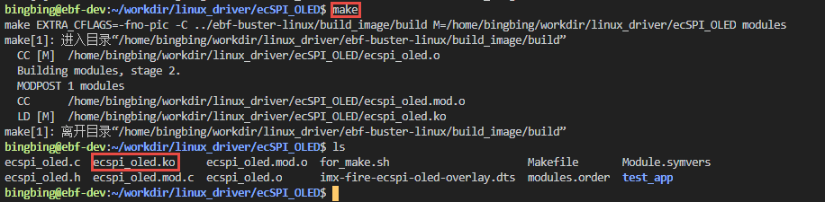

编译应用程序
>>>>>>>>>>>>>>>>>>>>>

将 **base_code/ecSPI_OLED/test_app** 目录中执行里面的MakeFile，生成test_app。

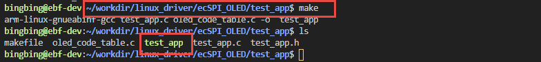

程序运行结果
^^^^^^^^^^^^^^^^^^^^^^^^^^^^^^

将前面生成的设备树插件、驱动程序、应用程序通过scp等方式拷贝到开发板。

加载设备树和驱动文件
>>>>>>>>>>>>>>>>>>>>>
将设备树插件拷贝到/lib/firmware/,在/boot/uEnv.txt中添加 *dtoverlay=/lib/firmware/imx-fire-ecspi-oled-overlay.dtbo*

.. image:: ./media/ecspi008.png
   :align: center
   :alt: 加载设备树

加载驱动陈程序 insmod ecspi_oled.ko。驱动程序打印match successed、

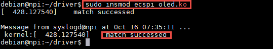

测试效果
>>>>>>>>>>>>>>>>>>>>>

驱动加载成功后直接运行测试应用程序 ./test_app，正常情况下显示屏会显示设定的内容，如下所示。

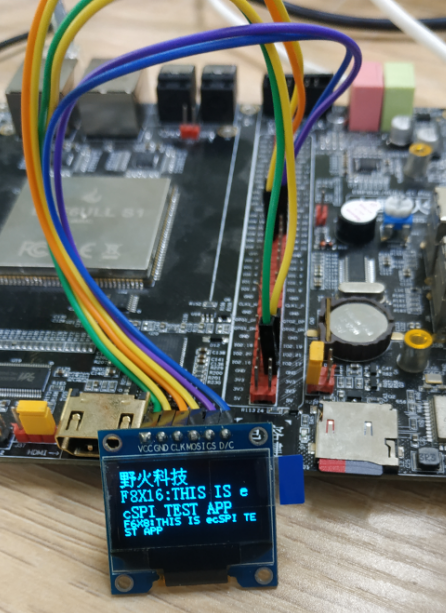
