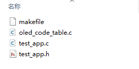
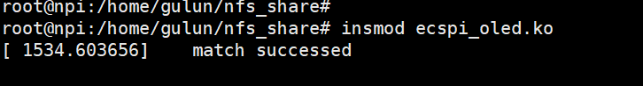
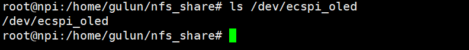

.. vim: syntax=rst

ecspi驱动实验
---------

本章我们以ecspi接口的oled显示屏为例讲解ecspi驱动程序的编写，本章主要分为四部分内容。第一部分，ecspi驱动基本知识，包括ecspi驱动的一些函数和结构体讲解。第二部分，编写ecspi_oled的设备树插件。第三部分，编写ecspi_oled 驱动。第四部分，编写简单测试应用程序。

本章配套源码和设备树插件位于“~/embed_linux_tutorial/base_code/linux_driverecSPI_OLED”。

ecspi驱动简介
~~~~~~~~~

ecSPI是“Enhanced Configurable SPI”直译为增强可配置SPI，可以理解为是功能更强的SPI接口，有关SPI通信协议的内容可以参考野火单片机SPI部分，这里不再赘述。

ecspi驱动和我们上章讲解的i2c驱动非常相似，它们都是按照总线、设备驱动模型编写。ecspi总线驱动由NXP官方编写，ecspi设备驱动需要我们根据实际连接的设备编写对应的驱动，例如spi接口的oled屏，spi接口的外置AD转换新芯片等等。

i2c总线和spi总线都可以挂载多个设备，不同的是i2c通过i2c设备地址确定不同的设备，而spi通过片选引脚选中要通信的设备。imx6ull的每个ecspi接口提供了4个片选引脚，可以连接4个SPI设备，当然也可以使用外部GPIO扩展SPI设备的数量，这样一个ecspi接口可连接的设备数由片选引脚
树决定。

如果使用ecspi接口提供的片选引脚，ecspi总线驱动会处理好什么时候选ecspi设备。如果使用外部GPIO作为片选引脚需要我们在ecspi设备驱动中设置什么时候选中ecspi。（或者在配置SPI时指定使用的片选引脚）。通常情况下无特殊要求我们使用ecspi接口提供的片选引脚。

ecspi设备驱动介绍
~~~~~~~~~~~

ecspi设备驱动和i2c设备驱动非常相似，可对比学习。这一小节主要介绍ecspi设备驱动程序中要用到的一些函数和结构体。

ecspi设备的注册和注销
^^^^^^^^^^^^^

ecspi设备的注册和注销函数分别在驱动的入口和出口函数中调用，这与平台设备驱动、i2c设备驱动相同，ecspi设备注册和注销函数如下：

.. code-block:: c 
    :caption:  ecspi设备注册和注销函数
    :linenos:

    int spi_register_driver(struct spi_driver *sdrv)
    static inline void spi_unregister_driver(struct spi_driver *sdrv)

对比i2c设备的注册和注销函数，不难发现把“spi”换成“i2c”就是i2c设备的注册和注销函数了，并且用法相同。参数之后一个spi_driver类型的结构体（后面称为spi设备驱动结构体）。一个spi_driver结构体就代表了一个ecspi设备驱动。spi_driver结构体如下所示

.. code-block:: c 
    :caption:  spi_driver结构体
    :linenos:

    struct spi_driver {
    	const struct spi_device_id *id_table;
    	int			(*probe)(struct spi_device *spi);
    	int			(*remove)(struct spi_device *spi);
    	void			(*shutdown)(struct spi_device *spi);
    	struct device_driver	driver;
    };

可以看到spi设备驱动结构体和我们之前讲过的i2c设备驱动结构体“i2c_driver”、平台设备驱动结构体“platform_driver”拥有相同的结构。用法也相同，这里不再赘述。

spi设备结构体spi_device
^^^^^^^^^^^^^^^^^^

在spi驱动中一个spi设备结构体代表了一个spi设备，它保存着这个spi设备的详细信息，也可以说是配置信息。当驱动和设备匹配成功后（例如设备树节点）我们可以从.prob函数的参数中得到spi_device结构体。spi_device结构体如下所示：

.. code-block:: c 
    :caption:  spi_driver结构体
    :linenos:

    struct spi_device {
    	struct device		dev;
    	struct spi_master	*master;
    	u32			max_speed_hz;
    	u8			chip_select;
    	u8			bits_per_word;
    	u16			mode;
       #define	SPI_CPHA	0x01			/* clock phase */
       #define	SPI_CPOL	0x02			/* clock polarity */
       #define	SPI_MODE_0	(0|0)			/* (original MicroWire) */
       #define	SPI_MODE_1	(0|SPI_CPHA)
       #define	SPI_MODE_2	(SPI_CPOL|0)
       #define	SPI_MODE_3	(SPI_CPOL|SPI_CPHA)
       #define	SPI_CS_HIGH	0x04			/* chipselect active high? */
       #define	SPI_LSB_FIRST	0x08			/* per-word bits-on-wire */
       #define	SPI_3WIRE	0x10			/* SI/SO signals shared */
       #define	SPI_LOOP	0x20			/* loopback mode */
       #define	SPI_NO_CS	0x40			/* 1 dev/bus, no chipselect */
       #define	SPI_READY	0x80			/* slave pulls low to pause */
       #define	SPI_TX_DUAL	0x100			/* transmit with 2 wires */
       #define	SPI_TX_QUAD	0x200			/* transmit with 4 wires */
       #define	SPI_RX_DUAL	0x400			/* receive with 2 wires */
       #define	SPI_RX_QUAD	0x800			/* receive with 4 wires */
    	int			irq;
    	void			*controller_state;
    	void			*controller_data;
    	char			modalias[SPI_NAME_SIZE];
    	int			cs_gpio;	/* chip select gpio */
    
    };

常用的结构体成员介绍如下：

dev，device类型结构体。这是一个设备结构体，我们把它称为spi设备结构体、i2c设备结构体、平台设备结构体都是“继承”自设备结构体。它们根据各自的特点添加自己的成员，spi设备添加的成员就是后面要介绍的成员。

master，spi_master类型的结构体。在总线驱动中，一个spi_master代表了一个spi总线，这个参数就是用于指定spi设备挂载到那个spi总线上。

max_speed_hz，指定SPI通信的最大频率。

chip_select, spi总选用于区分不同SPI设备的一个标号，不要误以为他是SPI设备的片选引脚。指定片选引脚的成员在下面。

bits_per_word, 指定SPI通信时一个字节多少位。

mode，SPI工作模式，工作模式如以上代码中的宏定义。包括时钟极性、位宽等等，这些宏定义可以使用或运算“|”进行组合，这些宏定义在SPI协议中有详细介绍，这里不再赘述。

irq，如果使用了中断，它用于指定中断号。

cs_gpio，片选引脚。在设备树中设置了片选引脚，驱动和设别树节点匹配成功后自动获取片选引脚，我们也可以在驱动总通过设置该参数自定义片选引脚。

spi发送函数
^^^^^^^

在介绍spi发送函数之前我们需要了解spi发送所用到的一些结构体，介绍如下：

spi_transfer结构体
'''''''''''''''

在spi设备驱动程序中，spi_transfer结构体用于指定要发送的数据，后面称为“传输结构体”，传输结构体如下所示。

.. code-block:: c 
    :caption:  spi_transfer结构体
    :linenos:

    struct spi_transfer {
    	/* it's ok if tx_buf == rx_buf (right?)
    	 * for MicroWire, one buffer must be null
    	 * buffers must work with dma_*map_single() calls, unless
    	 *   spi_message.is_dma_mapped reports a pre-existing mapping
    	 */
    	const void	*tx_buf;
    	void		*rx_buf;
    	unsigned	len;
    
    	dma_addr_t	tx_dma;
    	dma_addr_t	rx_dma;
    	struct sg_table tx_sg;
    	struct sg_table rx_sg;
    
    	unsigned	cs_change:1;
    	unsigned	tx_nbits:3;
    	unsigned	rx_nbits:3;
    #define	SPI_NBITS_SINGLE	0x01 /* 1bit transfer */
    #define	SPI_NBITS_DUAL		0x02 /* 2bits transfer */
    #define	SPI_NBITS_QUAD		0x04 /* 4bits transfer */
    	u8		bits_per_word;
    	u16		delay_usecs;
    	u32		speed_hz;
    
    	struct list_head transfer_list;
    };

传输结构体的成员较多，需要我们自己设置的很少，这里只介绍我们常用的配置项。

tx_buf，发送缓冲区，用于指定要发送的数据地址。

rx_buf，接收缓冲区，用于保存接收得到的数据，如果不接收不用设置或设置为NULL.

len,要发送和接收的长度，根据SPI特性发送、接收长度相等。

tx_dma、rx_dma，如果使用了DAM,用于指定tx或rx DMA地址。

bits_per_word、speed_hz，分别用于设置每个字节多少位、发送频率。如果我们不设置这些参数那么会使用默认的配置，也就是我初始化spi是设置的参数。

spi_message结构体和发送函数
'''''''''''''''''''

总的来说spi_transfer结构体保存了要发送（或接收）的数据，而在SPI设备驱动中数据是以“消息”的形式发送。spi_message是消息结构体，我们把它称为消息结构体，发送一个消息分四步，依次为定义消息结构体、初始化消息结构体、“绑定”要发送的数据（也就是初始化好的spi_transfer结
构）、执行发送。

消息结构体spi_message

spi_message结构体定义如下所示

.. code-block:: c 
    :caption:  spi_message结构体
    :linenos:

    struct spi_message {
    	struct list_head	transfers;
    
    	struct spi_device	*spi;
    
    	unsigned		is_dma_mapped:1;
    
    	/* REVISIT:  we might want a flag affecting the behavior of the
    	 * last transfer ... allowing things like "read 16 bit length L"
    	 * immediately followed by "read L bytes".  Basically imposing
    	 * a specific message scheduling algorithm.
    	 *
    	 * Some controller drivers (message-at-a-time queue processing)
    	 * could provide that as their default scheduling algorithm.  But
    	 * others (with multi-message pipelines) could need a flag to
    	 * tell them about such special cases.
    	 */
    
    	/* completion is reported through a callback */
    	void			(*complete)(void *context);
    	void			*context;
    	unsigned		frame_length;
    	unsigned		actual_length;
    	int			status;
    
    	/* for optional use by whatever driver currently owns the
    	 * spi_message ...  between calls to spi_async and then later
    	 * complete(), that's the spi_master controller driver.
    	 */
    	struct list_head	queue;
    	void			*state;
    };

spi_message结构体成员我们比较陌生，如果我们不考虑具体的发送细节我们可以不用了解这些成员的含义，因为spi_message的初始化以及“绑定”spi_transfer传输结构体都是由内核函数实现。唯一要说明的是第二个成员“spi”，它是一个spi_device类型的指针，我们讲解spi_d
evice结构体时说过，一个spi设备对应一个spi_device结构体，这个成员就是用于指定消息来自哪个设备。

初始化消息结构体

消息结构体使用之前要初始化，内核提供了初始化函数如下：

.. code-block:: c 
    :caption:  spi_message_init函数
    :linenos:

    static inline void spi_message_init(struct spi_message *m)

函数很简单，只有一个参数，既要初始化的消息结构体。

“绑定”要传输的数据

定义消息结构体并初始化后需要设置“要发送的数据”，同样内核提供了“绑定”函数，原型如下：

.. code-block:: c 
    :caption:  spi_message_add_tail函数
    :linenos:

    static inline void
    spi_message_add_tail(struct spi_transfer *t, struct spi_message *m)
    {
    	list_add_tail(&t->transfer_list, &m->transfers);
    }

该函数的工作就是将spi_transfer结构体添加到spi_message队列的末尾。

执行发送（接收）

发送函数分为同步传输函数spi_sync和异步传输函数spi_async。同步传输函数就是传输函数执行后直到发送完成才退出函数，异步传输恰恰相反，传输函数执行后立即返回，接着向下执行，而传输完成后会调用提前设置好的传输完成回调函数。

.. code-block:: c 
    :caption:  发送函数
    :linenos:

    int spi_sync(struct spi_device *spi, struct spi_message *message);
    int spi_async(struct spi_device *spi, struct spi_message *message);

ecspi_oled驱动实现讲解
~~~~~~~~~~~~~~~~

ecspi_oled驱动和我们上一节介绍的i2c_mpu6050设备驱动非常相似，可对比学习，推荐先学习i2c_mpu6050驱动，因为这里会省略一部分在i2c_mpu6050绍过的内容。

ecspi_oled驱动使用设备树插件方式开发,驱动的主要工作包三部分内容。第一，编写ecspi_oled的设备树插件，第二，编写ecspi_oled驱动程序，第三，编写简单测试应用程序。结合代码，这三部分内容介绍如下。

ecspi_oled的设备树插件实现
^^^^^^^^^^^^^^^^^^

设备树插件书写格式不变，我们重点讲解ecspi_oled设备节点。

.. code-block:: c 
    :caption:  spi_message_add_tail函数
    :linenos:

     /dts-v1/;
     /plugin/;
    #include "imx6ul-pinfunc.h"
    
     / {
         fragment@0 {
             target = <&ecspi1>;
             __overlay__ { 
    			 /*---------------第一部分----------------*/
                fsl,spi-num-chipselects = <1>; ------①
    			cs-gpios = <&gpio4 26 0>;     -------②
    			pinctrl-names = "default";
    			pinctrl-0 = <&pinctrl_ecspi1>; ------③
    			status = "okay";
    			/*---------------第二部分----------------*/
    	        ecspi_oled@0 {
    				d_c_control_pin = <&gpio4 24 0>; ------①
    				compatible = "fire,ecspi_oled";
    				spi-max-frequency = <20000000>; -------②
    				reg = <0>;                      -------③
    			};        
             };
         };
    
    /*---------------第三部分----------------*/
         fragment@1 {
             target = <&iomuxc>;
             __overlay__ { 
            pinctrl_ecspi1: ecspi1grp {
    				fsl,pins = <
    					MX6UL_PAD_CSI_DATA07__ECSPI1_MISO  0x10b0
    					MX6UL_PAD_CSI_DATA06__ECSPI1_MOSI  0x10b0
    					MX6UL_PAD_CSI_DATA04__ECSPI1_SCLK  0x10b0
    					MX6UL_PAD_CSI_DATA05__ECSPI1_SS0   0x10b0
    					MX6UL_PAD_CSI_DATA03__GPIO4_IO24   0x10b0
    				>;
            	}; 
             };
         };
     };

设备树插件共分为三部分，其中第一、二部分向ecspi1节点追加内容以及追加子节点。第三部分是向pinctrl子系统节点追加ecspi_oled使用到的引脚。具体介绍如下（先介绍第三部分）：

第三部分，向iomuxc节点追加ecspi_oled使用到的引脚。具体内容可参考GPIO子系统章节。这里使用了5个引脚它们与ecspi_oled显示屏引脚对应关系、引脚的功能、以及在开发板上的位置如下表所示。

============== ============= ================== ====================
SPI_OLED显示屏 功能          说明               引脚引出位置（排针）
============== ============= ================== ====================
MOSI           ECSPI1_MOSI   MOSI引脚           CN5排针 IO4.25 脚
未使用         ECSPI1\_ MISO MISO引脚           CN5排针 IO4.28 脚
CLK            ECSPI1_SCLK   ECSPI时钟引脚      CN5排针 IO4.27 脚
D/C            GPIO4_IO24    数据、命令控制引脚 CN5排针 IO4.24脚
CS             ECSPI1_SS0    片选引脚           CN5排针 IO4.26脚
GND            电源-                            GND
VCC            电源+                            3.3V
============== ============= ================== ====================

需要注意的是ecspi_oled显示屏没有MISO引脚，直接空出即可，ecspi_oled显示屏需要一个额外的引脚连接D/C 用于控制spi发送的是数据还是控制命令（高电平是数据，低电平是控制命令）。

回到上方的设备树插件。

第一部分，向ecspi1节点追加内容，介绍如下，标号①，指定设备的数量，当前只有一个ecspi_oled，设置为1。标号②指定使用的片选引脚，我们这里使用的是CS1既GPIO4_26。标号③，指定ecspi1使用的pinctrl节点，也就是说指定ecspi1要使用的引脚，我们在第三部分定义了这些引脚
。

第三部分，向ecspi1节点追加ecspi_oled子节点。标号①处指定ecspi_oled使用的D/C控制引脚，在驱动程序中会控制该引脚设置发送的是命令还是数据。标号②，设置SPI传输的最大频率。设置reg属性为0,表示ecspi_oled连接到ecspi的通道0

ecspi_oled驱动实现
^^^^^^^^^^^^^^

ecspi_oled的驱动结构和上一章的i2c_mpu6050完全相同。这里不再赘述，直接讲解实现代码。如下所示。

驱动的入口和出口函数实现
''''''''''''

驱动入口和出口函数与I2C_mpu6050驱动相似，只是把i2c替换为ecspi,源码如下所示。

.. code-block:: c 
    :caption:  驱动入口函数实现
    :linenos:

    /*---------------第一部分----------------*/
    /*指定 ID 匹配表*/
    static const struct spi_device_id oled_device_id[] = {
    	{"fire,ecspi_oled", 0},
    	{}};
    
    /*指定设备树匹配表*/
    static const struct of_device_id oled_of_match_table[] = {
    	{.compatible = "fire,ecspi_oled"},
    	{}};
     
    
    /*---------------第二部分----------------*/
    /* spi 总线设备结构体*/
    struct spi_driver oled_driver = {
    	.probe = oled_probe,
    	.remove = oled_remove,
    	.id_table = oled_device_id,
    	.driver = {
    		.name = "ecspi_oled",
    		.owner = THIS_MODULE,
    		.of_match_table = oled_of_match_table,
    	},
    };
    
    /*---------------第三部分----------------*/
    /*
    *驱动初始化函数
    */
    static int __init oled_driver_init(void)
    {
    	int error;
    	pr_info("oled_driver_init\n");
    	error = spi_register_driver(&oled_driver);
    	return error;
    }
    
    /*
    *驱动注销函数
    */
    static void __exit oled_driver_exit(void)
    {
    	pr_info("oled_driver_exit\n");
    	spi_unregister_driver(&oled_driver);
    }

代码很简单，说明如下：

第一部分，定义匹配表，这里定义了两个，第一个是传统的匹配表（可省略）。第二个是和设备树节点匹配的匹配表，保证与设备树节点.compatible属性设定值相同即可。

第二部分，定义spi_driver类型结构体。该结构体可类比i2c_driver和platform_driver,这里不再赘述。

第三部分，驱动的入口和出口函数，在入口函数只需要注册一个spi驱动，在出口函数中注销它。

.prob函数实现
'''''''''

在.prob函数中完成两个主要工作，第一，初始化ecspi，第二，申请一个字符设备，申请、注册字符设备已经多次用到，这里不再赘述.prob部分代码如下所示。

.. code-block:: c 
    :caption:  驱动入口函数实现
    :linenos:

    static int oled_probe(struct spi_device *spi)
    {
    
    	printk(KERN_EMERG "\t  match successed  \n");
    
    	/*------------------第一部分-----------------*/
    	/*获取 ecspi_oled 设备树节点*/
    	oled_device_node = of_find_node_by_path("/soc/aips-bus@2000000/spba-bus@2000000/ecspi@2008000/ecspi_oled@0");
    	if (oled_device_node == NULL)
    	{
    		printk(KERN_EMERG "\t  get ecspi_oled@0 failed!  \n");
    	}
    
    	/*------------------第二部分-----------------*/
    	/*获取 oled 的 D/C 控制引脚并设置为输出，默认高电平*/
    	oled_control_pin_number = of_get_named_gpio(oled_device_node, "d_c_control_pin", 0);
    	gpio_direction_output(oled_control_pin_number, 1);
    
        /*------------------第三部分-----------------*/
    	/*初始化spi*/
    	oled_spi_device = spi;  ----①
    	oled_spi_device->mode = SPI_MODE_0; ---②
    	oled_spi_device->max_speed_hz = 2000000; ---③
    	spi_setup(oled_spi_device);
    
    	/*---------------------注册 字符设备部分-----------------*/
    
    	/*---------------------以下代码省略-----------------*/
    	return 0;
    }

省略注册字符设备相关代码.prob函数变得清爽很多，简单介绍如下：

第一部分，根据设备树节点路径获取节点。

第二部分，获取ecspi_oled的D/C控制引脚。并设置为高电平。

第三部分，初始化spi，标号①，保存.prob函数传回的spi_device结构体，根据之前讲解，该结构体代表了一个ecspi(spi)设备，我们通过它配置SPI,这里设置的内容将会覆盖设备树节点中设置的内容。例如标号③设置最高频率为2000000，设备树中也设置了该属性，则这里设置的频率为最终值。

字符设备操作函数集实现
'''''''''''

字符设备操作函数集是驱动对外的接口，我们要在这些函数中实现对ecspi_oled的初始化、写入、关闭等等工作。这里共实现三个函数，.open函数用于实现ecspi_oled的初始化，.write函数用于向ecspi_oled写入显示数据，.release函数用于关闭ecspi_oled。结合源码，这
三个函数实现介绍如下：

.open函数实现

在open函数中完成ecspi_oled的初始化，代码如下：

.. code-block:: c 
    :caption:  .open函数实现
    :linenos:

    /*字符设备操作函数集，open函数实现*/
    static int oled_open(struct inode *inode, struct file *filp)
    {
    	spi_oled_init(); //初始化显示屏
    	return 0;
    }
    
    /*oled 初始化函数*/
    void spi_oled_init(void)
    {
    	/*初始化oled*/
    	oled_send_commands(oled_spi_device, oled_init_data, sizeof(oled_init_data));
    
    	/*清屏*/
    	oled_fill(0x00);
    }
    
    
    static int oled_send_commands(struct spi_device *spi_device, u8 *commands, u16 lenght)
    {
    	int error = 0;
    
    	/*------------------第一部分-----------------*/
    	struct spi_message *message;   //定义发送的消息
    	struct spi_transfer *transfer; //定义传输结构体
    
    	/*申请空间*/
    	message = kzalloc(sizeof(struct spi_message), GFP_KERNEL);
    	transfer = kzalloc(sizeof(struct spi_transfer), GFP_KERNEL);
    
    	/*------------------第二部分-----------------*/
    	/*设置 D/C引脚为低电平*/
    	gpio_direction_output(oled_control_pin_number, 0);
    
    	/*------------------第三部分-----------------*/
    	/*填充message和transfer结构体*/
    	transfer->tx_buf = commands;
    	transfer->len = lenght;
    	spi_message_init(message);
    	spi_message_add_tail(transfer, message);
    	error = spi_sync(spi_device, message);
    
    	/*------------------第四部分-----------------*/
    	kfree(message);
    	kfree(transfer);
    	if (error != 0)
    	{
    		printk("spi_sync error! \n");
    		return -1;
    	}
    	return error;
    }

如上代码所示，open函数只调用了自定义spi_oled_init函数，在spi_oled_init函数函数中调用
oled_send_commands函数初始化ecspi_oled，然后调用清屏函数，我们重点看oled_send_commands函数。结合以上源码oled_send_commands函数各部分介绍如下：

第一部分，定义spi_message结构体和spi_transfer结构体。为节省内核栈空间这里使用kzalloc为它们分配空间，这两个结构体大约占用100字节，推荐这样做。

第二部分，设置 D/C引脚为低电平，前面说过，ecspi_oled的D/C引脚用于控制发送的命令或数据，低电平时表示发送的是命令。

第三部分，这里就是我们之前讲解的发送流程依次为初始化spi_transfer结构体指定要发送的数据、初始化消息结构体、将消息结构体添加到队尾部、调用spi_sync函数执行同步发送。

第四部分，释放刚刚申请的空间。

.write函数实现

.write函数用于接收来自应用程序的数据，并显示这些数据。函数实现如下所示：

.. code-block:: c 
    :caption:  .write函数实现
    :linenos:

    /*字符设备操作函数集，.write函数实现*/
    
    /*---------------第一部分-----------------*/
    
    static int oled_write(struct file *filp, const char __user *buf, size_t cnt, loff_t *off)
    
    {
    
        int copy_number=0;
    
        /*---------------第二部分-----------------*/
    
        /*申请内存*/
    
        oled_display_struct *write_data;
    
        write_data = (oled_display_struct*)kzalloc(cnt, GFP_KERNEL);
    
        copy_number = copy_from_user(write_data, buf,cnt);
    
        /*---------------第三部分-----------------*/
    
        oled_display_buffer(write_data->display_buffer, write_data->x, write_data->y, write_data->length);
    
        /*释放内存*/
    
        kfree(write_data);
    
        return 0;
    
    }
    
    /*---------------第四部分-----------------*/
    
    static int oled_display_buffer(u8 *display_buffer, u8 x, u8 y, u16 length)
    
    /*---------------第五部分-----------------*/
    
    /*数据发送结构体*/
    
    typedef struct oled_display_struct
    
    {
    
        u8 x;
    
        u8 y;
    
        u32 length;
    
        u8 display_buffer[];
    
    }oled_display_struct;

结合代码各部分简单介绍如下：

第一部分，.write函数，我们重点关注两个参数buf保存来自应用程序的数据地址，我们需要把这些数据拷贝到内核空间才能使用，参数cnt指定数据长度。

第二部分。定义oled_display_struct结构体并保存来自用户空间的数据。oled_display_struct结构体是自定义的一个结构体，如第五部分代码所示。它是一个可变长度结构体，参数 x 、y用于指定数据显示位置，参数length指定数据长度，柔性数组display_buffer[]
用于保存来自用户空间的显示数据。回到第二部分代码，使用kzalloc为oled_display_struct结构体分配空间，因为在应用程序中使用相同的结构体，所以这里直接根据参数“cnt”分配空间，分配成功后执行“copy_from_user”即可。

第三部分，调用自定义函数oled_display_buffer显示数据。函数原型如第四部分所示，参数display_buffer指定要显示的点阵数据x、y用于指定显示起始位置，length指定显示长度。具体函数实现也很简单，这里不再赘述。

release函数实现

.release函数功能仅仅是向ecspi_oled显示屏发送关闭显示命令，源码如下：

.. code-block:: c 
    :caption:  .release函数实现
    :linenos:

    /*字符设备操作函数集，.release函数实现*/
    static int oled_release(struct inode *inode, struct file *filp)
    {
    	oled_send_command(oled_spi_device, 0xae);//关闭显示
    	return 0;
    }

测试应用程序实现
^^^^^^^^

测试应用程序主要工作是实现oled显示屏实现刷屏、显示文字、显示图片。当然，使用之前要先添加设备树插件并正确加载驱动（具体过程在前面章节已经介绍）。

测试程序需要用到字符以及图片的点阵数据保存在oled_code_table.c文件，为方便管理我们编写了一个简单makefile文件方便我们编译程序。测试程序目录结构如下：

makefile文件如下所示：

.. code-block:: c 
    :caption:  极简makefile
    :linenos:

    out_file_name = "test_app"
    
    all: test_app.c oled_code_table.c
    	arm-linux-gnueabihf-gcc $^ -o $(out_file_name)
    
    
    .PHONY: clean
    clean:
    	rm $(out_file_name)

可以说这是一个极简makefile,不必介绍，以后有需要再逐渐完善。

test_app.c/h就是我们测试程序源码。如下所示：

.. code-block:: c 
    :caption:  测试应用程序
    :linenos:

    /*点阵数据*/
    /*---------------第一部分--------------*/
    extern unsigned char F16x16[];
    extern unsigned char F6x8[][6];
    extern unsigned char F8x16[][16];
    extern unsigned char BMP1[];
    
    int main(int argc, char *argv[])
    {
        int error = -1;
    
    	/*---------------第二部分--------------*/
        /*打开文件*/
        int fd = open("/dev/ecspi_oled", O_RDWR);
        if (fd < 0)
        {
            printf("open file : %s failed !\n", argv[0]);
            return -1;
        }
    
        /*---------------第三部分--------------*/
        /*显示图片*/
        show_bmp(fd, 0, 0, BMP1, X_WIDTH*Y_WIDTH/8);
        sleep(3);
    
    	/*---------------第四部分--------------*/
        /*显示文字*/
        oled_fill(fd, 0, 0, 127, 7, 0x00);  //清屏
        oled_show_F16X16_letter(fd,0, 0, F16x16, 4);  //显示汉字
        oled_show_F8X16_string(fd,0,2,"F8X16:THIS IS ecSPI TEST APP"); 
        oled_show_F6X8_string(fd, 0, 6,"F6X8:THIS IS ecSPI TEST APP");
        sleep(3);
        
    	/*---------------第五部分--------------*/
        oled_fill(fd, 0, 0, 127, 7, 0x00);  //清屏
        oled_show_F8X16_string(fd,0,0,"Testing is completed"); 
        sleep(3);
    
        /*关闭文件*/
        error = close(fd);
        if(error < 0)
        {
            printf("close file error! \n");
        }
    
        return 0;
    }

测试程序很简单，完整代码请参考配套例程，结合代码简单介绍如下：

第一部分，测试程序要用到的点阵数据，我们显示图片、汉字之前都要把它们转化为点阵数据。这么转？，野火spi_oled模块配套资料提供有转换工具以及使用说明。

第二部分，打开ecspi_oled的设备节点，这个根据自己的驱动而定，如果使用我们的驱动源码就是这个路径。

第三部分，显示图片测试，这里需要说明的是由于测试程序不那么完善，图片显示起始位置x坐标应当设置为0，这样在循环显示时才不会乱。显示长度应当为显示屏的像素数除以8，因为每个字节8位，这8位控制8个像素点。

第四部分，测试显示汉字和不同规格的字符。

第五部分，显示测试结束提示语，之后关闭显示。

下载验证
~~~~

正确加载设备树插件后（添加方式请参考使用设备树插件实现RGB灯章节），将驱动和测试应用程序拷贝到开发板（例如使用nfs共享文件夹），直接执行“insmod”加载驱动，正常情况下会提示匹配成功并且在开发板的“/dev”目录下生成ecspi_oled的设备节点文件，如下所示。

“/dev/”目录下生成对应的设备节点文件，如下所示。

驱动加载成功后直接运行测试应用程序，正常情况下显示屏会显示设定的内容，如下所示。

.. image:: ./media/ecspio005.png
   :align: center
   :alt: 5|

.. |ecspio002| image:: media\ecspio002.png
   :width: 2.82256in
   :height: 1.40607in
.. |ecspio003| image:: media\ecspio003.png
   :width: 5.76806in
   :height: 0.77847in
.. |ecspio004| image:: media\ecspio004.png
   :width: 5.76806in
   :height: 0.62569in
.. |ecspio005| image:: media\ecspio005.png
   :width: 3.72727in
   :height: 5.12291in
