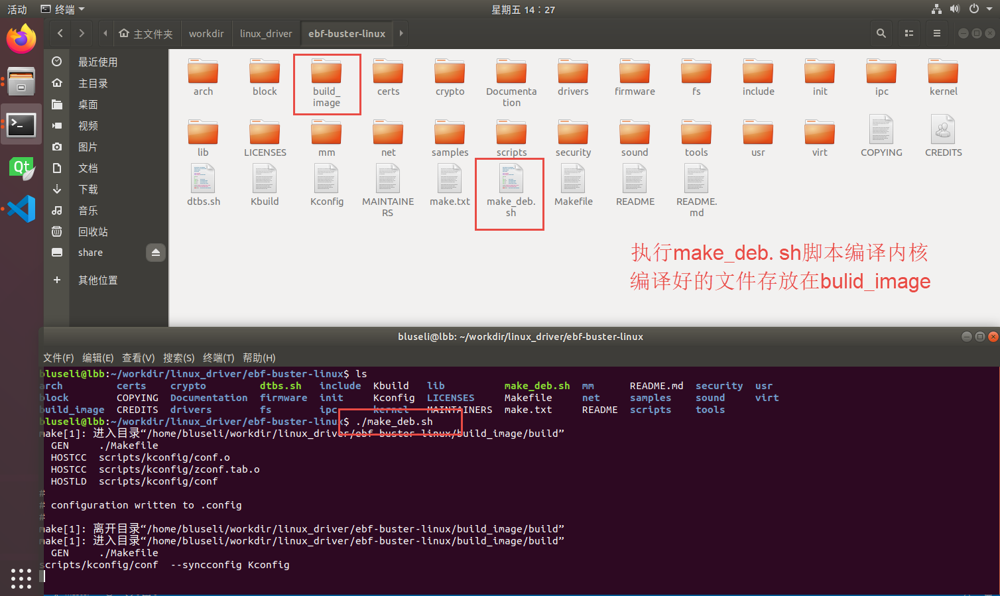
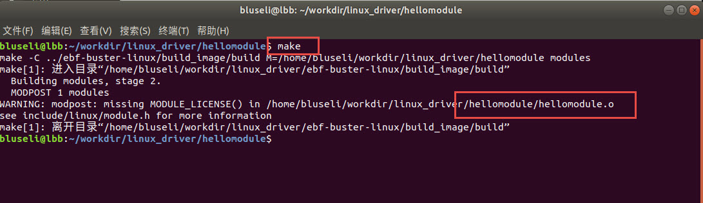
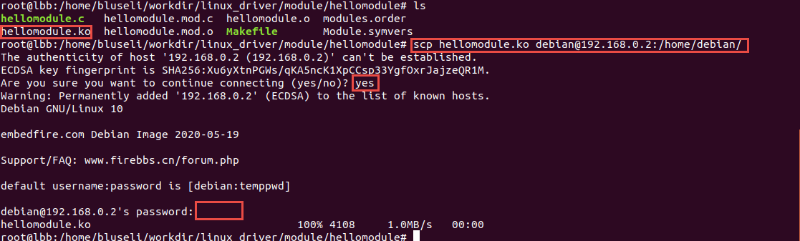
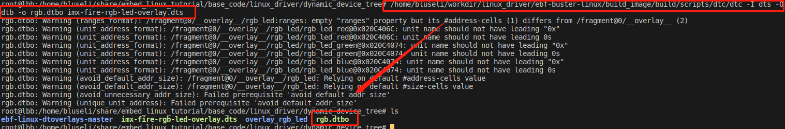
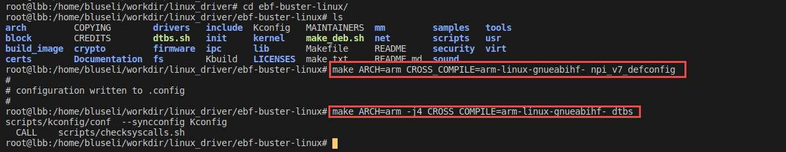
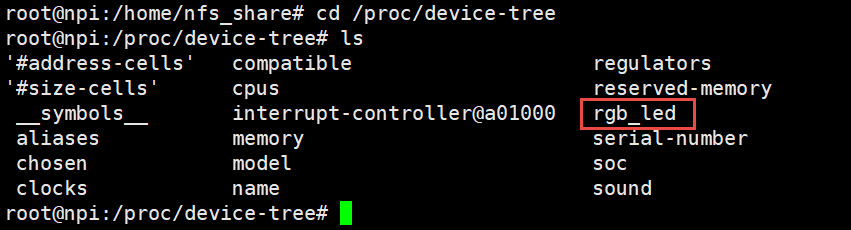
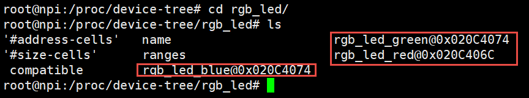
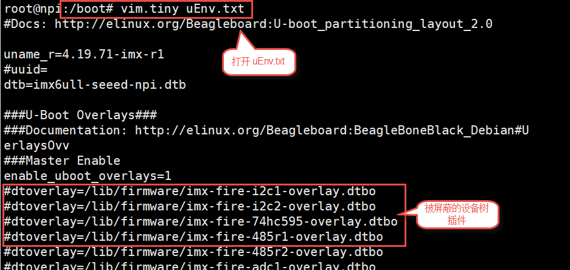

.. vim: syntax=rst

驱动章节实验环境搭建
==============================

本章主要目的是搭建驱动章节的实验环境，方便后续章节不在实验环境上耗费太多版面，
而是主要讲解设备驱动的原理。当进行实验的时候，不清楚具体细节时再跳转回来看。

首先我们要明白程序最终是运行在开发板上，我们开发板主要使用i.MX6ULL系列处理器，
它包含一个Cortex-A7(ARM的一种高能效处理器架构)内核。开发板上已经移植好相关的环境，
我们只需要将我们写的代码交叉编译成arm架构下的可执行文件。

设备驱动是具有独立功能的程序，它可以被单独编译，但不能独立运行，
在运行时它被链接到内核作为内核的一部分在内核空间运行。也因此想要我们写的内核模块在某个版本的内核上运行，
那么就必须在该内核版本上编译它，如果我们编译的内核与我们运行的内核具备不相同的特性，设备驱动则可能无法运行。

首先我们需要知道内核版本，并准备好该版本的内核源码，使用交叉编译工具编译内核源码；
其次，依赖编译的内核源码编译我们的驱动模块以及设备树文件。最终将驱动模块和设备树拷贝到开发板上运行。

环境准备
~~~~~~~~~~~~~~~~~~~~~~~~~~~~~~
安装工具
------------------------------
在编译源码之前我们需要先准备好交叉编译的环境，安装必要的依赖和工具，

- gcc-arm-linux-gnueabihf  交叉编译器
- bison 语法分析器
- flex  词法分析器
- libssl-dev OpenSSL通用库
- lzop LZO压缩库的压缩软件

执行下面的命令即可：

::

   sudo apt install make gcc-arm-linux-gnueabihf gcc bison flex libssl-dev dpkg-dev lzop

编译内核
------------------------------

**注意：** 开发板已默认烧录4.19.71版本内核，本章节都不需要烧录我们编译的内核，编译内核是为了辅助编译驱动程序。
如果你有烧录内核的需求请参考 *制作系统镜像* 系列章节。

获取内核源码
^^^^^^^^^^^^^^^^^^^^^^^^^^^^^^
开发板内核使用 Linux npi 4.19.71-imx-r1 版本，可以使用命令'uname -a'查看。
我们可以从github或者gitee上克隆野火官方提供的Debian镜像内核源码，
国内推荐使用gitee下载，当然首先需要安装git工具。

克隆命令如下：

github:

::

   git clone https://github.com/Embedfire/ebf-buster-linux.git

gitee:

::

   git clone https://gitee.com/Embedfire/ebf-buster-linux.git

进行编译
^^^^^^^^^^^^^^^^^^^^^^^^^^^^^^

我们可以单独新建一个工作目录，将内核源码放置在该目录下，切换到内核源码目录，我们可以找到make_deb.sh脚本，
里面有配置好的参数，只需要执行脚本便可编译内核。编译出来的内核相关文件存放位置，
由脚本中的ebf-buster-linux/make_deb.sh中build_opts="${build_opts} O=build_image/build" 指定。
示例源码指定编译好的内核存放在build_image/build，建议不修改此目录，方便后面编译驱动模块。

.. image:: media/exper_env001.png
   :align: center
   :alt: 内核模块信息

接下来我们不妨简单了解下构建内核的脚本make_deb.sh

make_deb.sh脚本
^^^^^^^^^^^^^^^^^^^^^^^^^^^^^^

.. code-block:: bash
   :caption: make_deb.sh（内核源码/make_deb.sh）
   :linenos:

   deb_distro=bionic
   DISTRO=stable
   build_opts="-j 6"
   build_opts="${build_opts} O=build_image/build"
   build_opts="${build_opts} ARCH=arm"
   build_opts="${build_opts} KBUILD_DEBARCH=${DEBARCH}"
   build_opts="${build_opts} LOCALVERSION=-imx-r1"

   build_opts="${build_opts} KDEB_CHANGELOG_DIST=${deb_distro}"
   build_opts="${build_opts} KDEB_PKGVERSION=1${DISTRO}"
   build_opts="${build_opts} CROSS_COMPILE=arm-linux-gnueabihf-" 
   build_opts="${build_opts} KDEB_SOURCENAME=linux-upstream"

   make ${build_opts}  npi_v7_defconfig
   make ${build_opts}  
   make ${build_opts}  bindeb-pkg

- **第4行：** 指定编译好的内核放置位置
- **第5行：** 编译出来的目标是针对ARM体系结构的内核
- **第6行：** 对于deb-pkg目标，允许覆盖deb-pkg部署的常规启发式
- **第7行：** 使用内核配置选项“LOCALVERSION”为常规内核版本附加一个唯一的后缀。
- **第11行：** 指定交叉编译器
- **第14行：** 生成配置文件
- **第16行：** 编译文件进行打包

内核驱动模块编译和加载
~~~~~~~~~~~~~~~~~~~~~~~~~~~~~~
首先我们需要，获取内核驱动模块示例源码。

github:

   git clone https://github.com/Embedfire/embed_linux_tutorial

gitee:

   git clone https://gitee.com/Embedfire/embed_linux_tutorial

将配套驱动程序代码解压到 *内核代码同级目录* ，原因是编译内核驱动模块的时候，
驱动程序需要依赖上一小节编译好的内核，在同一目录则无需修改任意配置。

**演示的实验代码位于：base_code/linux_driver/module/hellomodule**

这里不做代码讲解，具体原理请参考 *内核模块* 章节。

.. image:: media/exper_env004.png
   :alt: 实验环境

在内核源码外编译
------------------------------
内核驱动模块对象所需的构建步骤和编译很复杂，它利用了linux内核构建系统的强大功能，
当然我们不需要深入了解这部分知识，利用简单的Make工具就能编译出我们想要的内核驱动模块。
::

   cd hellomodule
   make

.. image:: media/exper_env004.jpg
   :align: center
   :alt: 实验环境

**注意：  该目录下的Makefile中 "KERNEL_DIR=../ebf-buster-linux/build_image/build"为引用之前编译内核脚本make_deb.sh中指定的编译目录，
因为内核仓库有提交更新过，make_deb.sh指定编译目录与视频中有差异，以实际脚本内容为准，同理之后编译设备树、设备树插件Makefile的KERNEL_DIR也要注意**

切换到module/hellomodule目录下，直接执行make命令，即可编译程序。

.. code-block:: Makefile
   :caption: Makefile（module/hellomodule/Makefile）
   :linenos:

   KERNEL_DIR=../../ebf-buster-linux/build_image/build
   ARCH=arm
   CROSS_COMPILE=arm-linux-gnueabihf-
   export  ARCH  CROSS_COMPILE

   obj-m := hellomodule.o

   all:
      $(MAKE) -C $(KERNEL_DIR) M=$(CURDIR) modules

   .PHONE:clean

   clean:
      $(MAKE) -C $(KERNEL_DIR) M=$(CURDIR) clean	

- **第1行：** 指定编译内核存放位置
- **第2行：** 针对ARM体系结构
- **第3行：** 指定交叉编译工具链
- **第4行：** 导入环境变量
- **第6行：** 表示以模块编译
- **第8行：** all只是个标号，可以自己定义，是make的默认执行目标。
- **第9行：** $(MAKE):MAKE是Makefile中的宏变量，要引用宏变量要使用符号。这里实际上就是指向make程序，所以这里也可以把$(MAKE)换成make.-C:是make命令的一个选项，-C作用是changedirectory. -C dir 就是转到dir目录。M=$(CURDIR)：返回当前目录。这句话的意思是：当make执行默认的目标all时，-C(KVDIR)指明跳转到内核源码目录下去执行那里的Makefile,-C $(KERNEL_DIR)指明跳转到内核源码目录下去执行那里的Makefile,M=(CURDIR)表示又返回到当前目录来执行当前的Makefile.
- **第11行：** clean 就是删除后面这些由make生成的文件。

查看module/hellomodule/文件夹，新增hellomodule.ko，这就是我们自己编写、编译的内核驱动模块。

和内核源码一起编译
------------------------------
   - 待完善

加载内核驱动模块
------------------------------

编译好内核驱动模块，可以通过多种方式将hellomodule.ko拷贝到开发板，我们这里主要使用NFS网络文件系统或者SCP命令。

NFS环境请搭建请参考Linux系列章节之 *挂载MFS网络文件系统* 章节。

scp 命令用于 Linux 之间复制文件和目录，scp命令格式如下：

   scp local_file remote_username@remote_ip:remote_folder 

例如：scp hellomodule.ko debian@192.168.0.2:/home/debian/

将hellomodule.ko发送到192.168.0.2这个IP的Linux(这里是我的开发板IP)的/home/debian/目录下，开发板用户名为debian，
输入yes，然后验证密码，等待传输完成。这个时候我们开发板就有了hellomodule.ko 这个文件。

安装卸载内核驱动模块使用insmod和rmmod，后面章节有对这两个工具的详细介绍，这里不做展开。

   sudo insmod hellomodule.ko
   
   sudo rmmod hellomodule.ko

设备树编译和加载
~~~~~~~~~~~~~~~~~~~~~~~~~~~~~~
Linux3.x以后的版本才引入了设备树，设备树用于描述一个硬件平台的板级细节。
后面我们写的驱动需要依赖设备树，所以在这里先演示如何编译设备树、加载设备树。

**演示的实验代码位于：base_code/linux_driver/device_tree**

这里不做代码讲解，具体原理请参考 *Linux设备树* 章节

设备树编译
------------------------------

使用内核中的dtc工具编译
^^^^^^^^^^^^^^^^^^^^^^^^^^^^^^

首先我们需要编译好内核(通常只需一次编译好内核，编译内核的时候会生成的dtc工具)，内核编译的位置在 *内核源码/build_image/build/* ，内核中的dtc工具位置在  *内核源码/build_image/build/scripts/dtc/dtc*。

   内核构建目录/scripts/dtc/dtc -I dts -O dtb -o xxx.dtbo xxx.dts // 编译 dts 为 dtbo

   ../ebf-buster-linux/build_image/build/scripts/dtc/dtc -I dts -O dtb -o rgb.dtbo imx-fire-rgb-led-overlay.dts

在内核源码中编译内核（推荐使用）
^^^^^^^^^^^^^^^^^^^^^^^^^^^^^^

编译内核时会自动编译设备树，我们所要用到的设备树文件都存放在 *内核源码/arch/arm/boot/dts/* 里面，但是编译内核很耗时，
所以我们推荐使用如下命令只编译设备树。

   make ARCH=arm CROSS_COMPILE=arm-linux-gnueabihf- npi_v7_defconfig
   
   make ARCH=arm -j4 CROSS_COMPILE=arm-linux-gnueabihf- dtbs

如果在内核源码中执行了make distclean 则必须执行第一条命令，它用于生成默认配置文件， 如果执行过一次就没有必要再次执行，当然再次执行也没有什么问题。
第二条命令开始编译设备树， 参数“-j4”指定多少个线程编译，根据自己电脑实际情况设置，越大编译越快，当然也可以不设置，设备树编译本来就很快。

编译成功后生成的设备树文件（.dtb）位于源码目录下的 *内核源码/arch/arm/boot/dts*，
开发板适配的设备树文件名为 *imx6ull-seeed-npi.dtb*。

加载设备树
^^^^^^^^^^^^^^^^^^^^^^^^^^^^^^

替换设备树有下面几种方法。

- 第一种，简单直接，设备树是在编译到内核中的，所以重新烧写内核这种方式肯定可行。但是烧写内核比较麻烦，可以参考制作系统镜像系列章节。不推荐也不做过多的讲解。
- 第二种，将我们编译好的设备树或者设备树插件替换掉开发板里面原有的。

加载设备树
------------------------------

通过SCP或NFS将编译的设备树拷贝到开发板上。替换 */boot/dtbs/4.19.71-imx-r1/imx6ull-seeed-npi.dtb* 。

uboot在启动的时候负责该目录的设备文件加载到内存，供内核解析使用。重启开发板即可。

设备树中的设备树节点在文件系统中有与之对应的文件，位于“/proc/device-tree”目录。进入“/proc/device-tree”目录如下所示。

.. image:: ./media/driver003.png
   :align: center
   :alt: 查看led_test节点

接着进入led 文件夹，可以发现led节点中定义的属性以及它的子节点，如下所示。

.. image:: ./media/driver004.png
   :align: center
   :alt: led_test子节点

在节点属性中多了一个name，我们在led节点中并没有定义name属性，这是自从生成的，保存节点名。

这里的属性是一个文件，而子节点是一个文件夹，我们再次进入“rgb_led_red@0x0209C000”文件夹。
里面有compatible  name  reg  status四个属性文件。
我们可以使用“vi”命令查看这些属性文件，如下所示。

.. image:: ./media/driver005.png
   :align: center
   :alt: 查看子节点属性文件

至此，设备树加载成功。

设备树插件的编译和加载
~~~~~~~~~~~~~~~~~~~~~~~~~~~~~~
Linux4.4以后引入了动态设备树（Dynamic DeviceTree）。设备树插件被动态的加载到系统中，供被内核识别。
编译设备树插件的时候无需重新编译整个设备树插件，只需要编译我们修改的部分即可。

**演示的实验代码位于：base_code/linux_driver/dynamic_device_tree**

这里不做代码讲解，具体原理请参考 *使用设备树插件实现RGB灯驱动* 章节

单独使用dtc工具编译
------------------------------
设备树插件与设备树一样都是使用DTC工具编译，只不过设备树编译为.dtb。而设备树插件需要编译为.dtbo。
我们可以使用DTC编译命令编译生成.dtbo，但是这样比较繁琐、容易出错。
我们提供一个编译工具，帮助完成这些繁琐的工作，实现“一键式”编译。

编译工具下载地址

   git clone https://github.com/Embedfire/ebf-linux-dtoverlays.git
   
   或者
   
   git clone https://gitee.com/Embedfire/ebf-linux-dtoverlays.git

要编译的设备树插件源文件放在 *ebf-linux-dtoverlays/overlays/ebf* 目录下，
然后回到编译工具的根目录 *ebf-linux-dtoverlays/* 执行“make”即可。

生成的.dtbo位于“~/ebf-linux-dtoverlays/output”目录下。

例如本章的RGB设备树插件为“imx-fire-rgb-led-overlay.dts”将其拷贝到“ebf-linux-dtoverlays/overlays/ebf”目录下，
编译之后就会在“ebf-linux-dtoverlays/output”目录下生成同名的.dtbo文件。得到.dtbo后，下一步就是将其加载到系统中。
需要注意的是，如果你在执行“make”后出现下图报错，可以尝试先卸载device-tree-compiler（卸载命令为：“sudo apt-get autoremove device-tree-compiler”）,
重新安装，然后在“ebf-linux-dtoverlays/basic/fixdep文件的权限，
修改权限命令为：“chmod 777 scripts/basic/fixdep”。

.. image:: ./media/dtboerr001.png
   :align: center
   :alt: 02|

内核dtc工具编译设备树插件
------------------------------

编译设备树插件和编译设备树类似，这里使用内核中的dtc工具编译编译设备树插件。

将xxx.dts 编译为 xxx.dtbo

   内核构建目录/scripts/dtc/dtc -I dts -O dtb -o xxx.dtbo xxx.dts
   
例如，将imx-fire-rgb-led-overlay.dts编译为rgb.dtbo

   ../ebf-buster-linux/build_image/build/scripts/dtc/dtc -I dts -O dtb -o rgb.dtbo imx-fire-rgb-led-overlay.dts

编译好的设备树插件为rgb.dtbo。

加载设备树插件
------------------------------

安装之前通过SCP或NFS将rgb.dtbo拷贝到开发板上，下面操作都在开发板上进行。

使用echo命令加载
^^^^^^^^^^^^^^^^^^^^^^^^^^^^^^
首先在/sys/kernel/config/device-tree/overlays/下创建一个新目录。

   mkdir /sys/kernel/config/device-tree/overlays/xxx

这个文件夹的名字可以任意定义，最好能反应对应的设备，例如本例中要插入RGB灯的设备树插件，则文件夹命名为rgb_led。

然后将dtbo固件echo到path属性文件中或者将dtbo的内容cat到dtbo属性文件

   echo xxx.dtbo >/sys/kernel/config/device-tree/overlays/xxx/path

   cat xxx.dtbo >/sys/kernel/config/device-tree/overlays/xxx/dtbo

执行该命令可能会出现警告，直接忽略即可。加载过程中如果不出错不会输出提示信息。

和设备树相同，加载成功后就可以在“/proc/device-tree”目录下找到与插入的设备树节点同名的文件夹，
进入该文件夹还可以看到该节点拥有的属性以及它的子节点，如下所示。

进入rgb_led 目录，如下所示。

看到这些文件，证明已经加载成功了。

删除"插件"设备树

   rmdir /sys/kernel/config/device-tree/overlays/xxx

uboot加载(适用野火linux开发板)
^^^^^^^^^^^^^^^^^^^^^^^^^^^^^^

将设备树插件写入uEnv.txt配置文件系统启动过程中自动从uEnv.txt读取要加载的设备树插件，我们也不用创建文件夹。
与使用 echo命令加载相同的是需要将要加载的.dtbo放入“/lib/firmware”，然后打开位于“/boot”目录下的uEnv.txt文件，如下所示。

从上图可以看出在uEnv.txt文件夹下有很多被屏蔽的设备树插件，这些设备树插件是烧写系统时自带的插件，为避免它们干扰我们的实验，这里把它们全部屏蔽掉。
如果要将RGB的设备树插件写入uEnv.txt也很简单，参照着写即可。书写格式为“dtoverlay=<设备树插件路径>”。

修改完成后保存、退出。执行reboot命令重启系统。重启后正常情况下我们可以在“/proc/device-tree”找与插入的设备节点同名的文件夹。