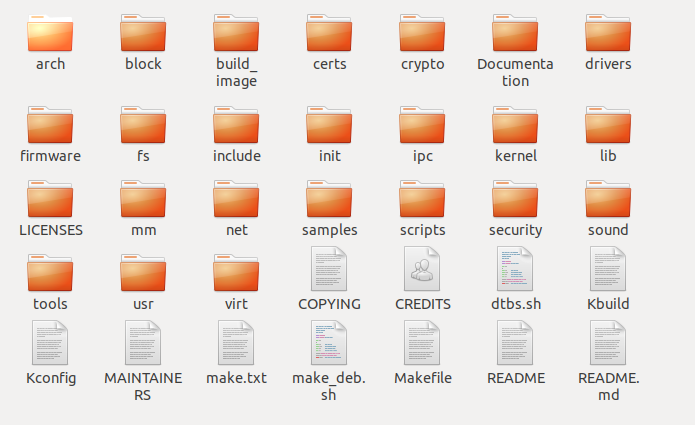

.. vim: syntax=rst

驱动章节实验环境搭建
==============================

本章主要目的是搭建驱动章节的实验环境，方便后续章节不在实验环境上耗费太多时间，
而是集中精力理解设备驱动的原理。

首先我们要明白程序最终是运行在开发板上，我们开发板主要使用i.MX6ULL系列处理器，
它包含一个Cortex-A7(ARM的一种高能效处理器架构)内核。开发板上已经移植好相关的环境，
我们只需要将我们写的代码交叉编译成arm架构下的可执行文件即可。

设备驱动是具有独立功能的程序，它可以被单独编译，但不能独立运行，
在运行时它被链接到内核作为内核的一部分在内核空间运行。也因此想要我们写的内核模块在某个版本的内核上运行，
那么就必须在该内核版本上编译它，如果我们编译的内核与我们运行的内核具备不相同的特性，设备驱动则可能无法运行。

首先我们需要知道内核版本，并准备好该版本的内核源码，
使用交叉编译工具编译内核源码，最终再依赖编译好的内核编译我们的程序。

环境准备
~~~~~~~~~~~~~~~~~~~~~~~~~~~~~~
安装工具
------------------------------
在编译源码之前我们需要先准备好交叉编译的环境，安装必要的依赖和工具，

- gcc-arm-linux-gnueabihf  交叉编译器
- bison 语法分析器
- flex  词法分析器
- libssl-dev OpenSSL通用库
- lzop LZO压缩库的压缩软件

执行下面的命令即可：

::

   sudo apt install make gcc-arm-linux-gnueabihf gcc bison flex libssl-dev dpkg-dev lzop

编译内核
------------------------------
获取内核源码
^^^^^^^^^^^^^^^^^^^^^^^^^^^^^^
开发板内核使用 Linux npi 4.19.71-imx-r1 版本，可以使用命令'uname -a'查看。
我们可以从github或者gitee上克隆野火官方提供的Debian镜像内核源码，
国内推荐使用gitee下载，当然首先需要安装git工具。

克隆命令如下：

github:

::

   git clone https://github.com/Embedfire/ebf-buster-linux.git

gitee:

::

   git clone https://gitee.com/Embedfire/ebf-buster-linux.git

进行编译
^^^^^^^^^^^^^^^^^^^^^^^^^^^^^^
设备驱动被链接到内核有两种方式，编译成模块和直接编译进内核；

首先就单独编译内核，再将设备驱动编译成模块来使用：

我们可以单独新建一个工作目录，将内核源码放置在该目录下，切换到内核源码目录，我们可以找到make_deb.sh脚本，
里面有配置好的参数，只需要执行脚本便可编译内核。编译出来的内核相关文件存放位置，
由脚本中的ebf-buster-linux/make_deb.sh中build_opts="${build_opts} O=build_image/build" 指定。

.. image:: media/exper_env001.png
   :align: center
   :alt: 内核模块信息

.. image:: media/exper_env002.png
   :align: center
   :alt: 内核模块信息

接下来我们不妨简单了解一些内核的构建原理。

内核的构建原理
------------------------------
内核源码目录
^^^^^^^^^^^^^^^^^^^^^^^^^^^^^^
首先我们大致了解一下内核源码目录

- **arch：** 主要包含和硬件体系结构相关的代码，如arm、x86、MIPS，PPC，每种CPU平台占一个相应的目录，例如我们使用的imx系列CPU就在 arch/arm/mach-imx 目录下，Linux内核目前已经支持30种左右的CPU体系结构。arch中的目录下存放的是各个平台以及各个平台的芯片对Linux内核进程调度、 内存管理、 中断等的支持，以及每个具体的SoC和电路板的板级支持代码。
- **block：** 在Linux中block表示块设备（以块（多个字节组成的整体，类似于扇区）为单位来整体访问），譬如说SD卡、Nand、硬盘等都是块设备，block目录下放的是一些Linux存储体系中关于块设备管理的代码。
- **crypto： ** 这个文件夹下存放的是常用加密和散列算法（如md5、AES、 SHA等） ，还有一些压缩和CRC校验算法。
- **Documentation：** 内核各部分的文档描述。
- **drivers：** 设备驱动程序，里面列出了linux内核支持的所有硬件设备的驱动源代码，每个不同的驱动占用一个子目录，如char、 block、 net、 mtd、 i2c等。
- **fs：** fs就是file system，里面包含Linux所支持的各种文件系统，如EXT、 FAT、 NTFS、 JFFS2等。
- **include：** 目录包括编译核心所需要的大部分头文件，例如与平台无关的头文件在 include/linux 子目录下，与cpu架构相关的头文件在include目录下对应的子目录中。
- **init：** 内核初始化代码，这个目录下的代码就是linux内核启动时初始化内核的代码。
- **ipc：** ipc就是 inter process commuication ，进程间通信，该文件夹下都是linux进程间通信的代码。
- **kernel：**  kernel就是Linux内核，是Linux中最核心的部分，包括进程调度、定时器等，而和平台相关的一部分代码放在 arch/*/kernel 目录下。
- **lib：** lib是库的意思，lib目录下存放的都是一些公用的有用的库函数，注意这里的库函数和C语言的库函数不一样的，因为在内核编程中是不能用C语言标准库函数的，所以需要使用lib中的库函数，除此之外与处理器结构相关的库函数代码被放在 arch/*/lib/ 目录下。
- **mm：**  目录包含了所有独立于 cpu 体系结构的内存管理代码，如页式存储管理内存的分配和释放等，而与具体硬件体系结构相关的内存管理代码位于 arch/*/mm 目录下，例如 arch/arm/mm/fault.c 。
- **net：** 网络协议栈相关代码，net目录下实现各种常见的网络协议。
- **scripts：** 这个目录下全部是脚本文件，这些脚本文件不是linux内核工作时使用的，而是用了配置编译linux内核的。
- **security：** 内核安全模型相关的代码，例如最有名的SELINUX。
- **sound：** ALSA、 OSS音频设备的驱动核心代码和常用设备驱动。
- **usr： ** 实现用于打包和压缩的cpio等。

对于其他的未列出来的目录，暂时不用去理会。

Makefile脚本
^^^^^^^^^^^^^^^^^^^^^^^^^^^^^^

首先是make_deb.sh脚本

.. code:: bash

   deb_distro=bionic
   DISTRO=stable
   build_opts="-j 6"
   build_opts="${build_opts} O=build_image/build"
   build_opts="${build_opts} ARCH=arm"
   build_opts="${build_opts} KBUILD_DEBARCH=${DEBARCH}"
   build_opts="${build_opts} LOCALVERSION=-imx-r1"

   build_opts="${build_opts} KDEB_CHANGELOG_DIST=${deb_distro}"
   build_opts="${build_opts} KDEB_PKGVERSION=1${DISTRO}"
   build_opts="${build_opts} CROSS_COMPILE=arm-linux-gnueabihf-" 
   build_opts="${build_opts} KDEB_SOURCENAME=linux-upstream"

   make ${build_opts}  npi_v7_defconfig
   make ${build_opts}  
   make ${build_opts}  bindeb-pkg

- 第4行：指定编译好的内核放置位置
- 第5行：编译出来的目标是针对ARM体系结构的内核
- 第6行：对于deb-pkg目标，允许覆盖deb-pkg部署的常规启发式
- 第7行：使用内核配置选项“LOCALVERSION”为常规内核版本附加一个唯一的后缀。
- 第11行：指定交叉编译器
- 第14行：
- 第15行：
- 第16行：

我们可以去https://www.kernel.org/doc/html/latest/index.html 和 https://www.debian.org/ 了解更多关于

编译程序
~~~~~~~~~~~~~~~~~~~~~~~~~~~~~~
获取内核模块示例源码，将配套代码解压到内核代码同级目录，这里以Linux内核模块章节的hellomodule实验为例。
实验代码位于：/base_code/linux_driver/module/hellomodule。

github:

::

   git clone https://github.com/Embedfire/embed_linux_tutorial

gitee:

::

   git clone https://gitee.com/Embedfire/embed_linux_tutorial

在内核源码外编译
------------------------------
内核模块对象所需的构建步骤和编译很复杂，它利用了linux内核构建系统的强大功能，
当然我们不需要深入了解这部分知识，利用简单的Make工具就能编译出我们想要的内核模块。
::

   cd hellomodule
   make

.. image:: media/exper_env003.jpg
   :align: center
   :alt: 实验环境

.. image:: media/exper_env004.jpg
   :align: center
   :alt: 实验环境

注意该目录下的Makefile中 "KERNEL_DIR=../ebf-buster-linux/build_image/build"要与前面编译的内核所在目录一致。

.. code:: bash

   #指定编译内核存放位置
   KERNEL_DIR=../../ebf-buster-linux/build_image/build
   #针对ARM体系结构
   ARCH=arm
   #交叉编译工具链
   CROSS_COMPILE=arm-linux-gnueabihf-
   #导入环境变量
   export  ARCH  CROSS_COMPILE
   #表示以模块编译
   obj-m := hellomodule.o
   #all只是个标号，可以自己定义，是make的默认执行目标。
   all:
      $(MAKE) -C $(KERNEL_DIR) M=$(CURDIR) modules

   .PHONE:clean copy

   clean:
      $(MAKE) -C $(KERNEL_DIR) M=$(CURDIR) clean	

$(MAKE) -C $(KERNEL_DIR) M=$(CURDIR) modules
$(MAKE):MAKE是Makefile中的宏变量，要引用宏变量要使用符号。这里实际上就是指向make程序，
所以这里也可以把$(MAKE)换成make.-C:是make命令的一个选项，-C作用是changedirectory. 
-C dir 就是转到dir目录。M=$(CURDIR)：返回当前目录。

这句话的意思是：当make执行默认的目标all时，-C(KVDIR)指明跳转到内核源码目录下去执行那里的Makefile,
-C $(KERNEL_DIR)指明跳转到内核源码目录下去执行那里的Makefile,M=(CURDIR)表示又返回到当前目录来执行当前的Makefile.

clean 就是删除后面这些由make生成的文件。

查看文件夹，新增hellomodule.ko，这就是我们自己编写、编译的内核模块。
使用file hellomodule.ko查看当前编译的文件，32-bit ARM架构的ELF文件。
::

   file hellomodule.ko
   hellomodule.ko: ELF 32-bit LSB relocatable, ARM, EABI5 version 1 (SYSV),
   BuildID[sha1]=1a139278874b2e1a335f1834e755d2cf3f9a4bff, not stripped

和内核源码一起编译
------------------------------