.. vim: syntax=rst

pinctrl子系统和gpio子系统
------------------

本章将会使用GPIO子系统实现LED驱动，GPIO子系统要用到pinctrl子系统所以本章将pinctrl子系统和GPIO子系统放在一块讲解。

pinctrl子系统
~~~~~~~~~~

从名字不难看出pinctrl子系统主要用于管理芯片（以下简称SOC）的引脚（pin）。imx6ull芯片拥有众多的片上外设，而大多数外设需要通过芯片的PIN（引脚）与外部设备（器件）相连进而实现特定的功能。例如我们熟悉的IIC、SPI、LCD、USDHC、等等。imx6ull芯片的可用引脚（除去电源
引脚和特定功能引脚）数量是有限的，为充分发挥芯片性能，提高硬件设计的灵活性，通常情况下每个外设的功能引脚有多个外部引脚可选，以IIC1为例，如下图所示。

IIC的SCL和SDA都有三个引脚可选，在设计硬件时我们可以根据需要灵活的选择其中的一个。硬件设计完成后片上外设使用的引脚就已经确定了，假设在硬件设计中IIC1的SCL和SDA分别连接到UART4_TX_DATA和UART4_RX_DATA，从引脚名字可以看出这两个引脚是UART4的接收、发送引脚并
不是用作IIC1的SCL和SDA，无论是裸机还是驱动，一般首先要设置引脚的复用功能并且设置引脚的PAD属性（驱动能力、上下拉等等）。

在pinctrl子系统出现之前，在驱动程序中我们需要手动设置每个引脚的复用功能，这样不仅增加了工作量而且编写的驱动程序不方便移植，可重用性差。更糟糕的是由于缺乏对引脚的统一管理，容易出现引脚的重复定义。还以I2C1为例，假设我们在I2C1的驱动中将UART4_RX_DATA引脚和UART4_TX_D
ATA引脚复用为SCL和 SDA，恰好在编写UART4驱动驱动时没有注意到UART4_RX_DATA引脚和UART4_TX_DATA引脚已经被使用，在驱动中又将其初始化为UART4_RX和UART4_TX，这样IIC1驱动将不能正常工作，并且这种错误很难被发现。

简单来说pinctrl子系统是由芯片厂商来实现的,用于帮助我们管理芯片引脚并自动完成引脚的初始化，而我们要做的只是在设备树中按照规定的格式写出想要的配置参数。

pinctrl子系统编写格式以及引脚属性详解
^^^^^^^^^^^^^^^^^^^^^^

本章使用的内核以及设备树与上一章相同，首先我们会介绍如何将RGB灯的三个引脚添加到pinctrl子系统中，以及各个参数的含义，修改完成后编译并下载到开发板验证修改是否成功。

本小节使用的设备树位于“~/ebf-buster-linux/arch/arm/boot/dts/imx6ull-seeed-npi.dts”。打开imx6ull-seeed-npi.dts，在文件中搜索“&iomuxc”找到设备树中引用“iomuxc”节点的位置如下所示。

.. code-block:: c 
    :caption: imx6ull-seeed-npi.dts中iomuxc部分
    :linenos:

    &iomuxc {
    	pinctrl-names = "default";
    	pinctrl-0 = <&pinctrl_hog_1>;
    
    
    
    	pinctrl_gpmi_nand: gpmi-nand {
    			fsl,pins = <
    				MX6UL_PAD_NAND_CLE__RAWNAND_CLE         0xb0b1
    				MX6UL_PAD_NAND_ALE__RAWNAND_ALE         0xb0b1
    				MX6UL_PAD_NAND_WP_B__RAWNAND_WP_B       0xb0b1
    				/*------------以下省略-----------------*/
    			>;
    		};
    
    	pinctrl_hog_1: hoggrp-1 {
    		fsl,pins = <
    			MX6UL_PAD_UART1_RTS_B__GPIO1_IO19	0x17059 /* SD1 CD */
    			MX6UL_PAD_GPIO1_IO05__USDHC1_VSELECT	0x17059 /* SD1 VSELECT */
    			MX6UL_PAD_GPIO1_IO09__GPIO1_IO09        0x17059 /* SD1 RESET */
    		>;
    	};
    
    	pinctrl_enet1: enet1grp {
    		fsl,pins = <
    			MX6UL_PAD_ENET1_RX_EN__ENET1_RX_EN	0x1b0b0
    			MX6UL_PAD_ENET1_RX_ER__ENET1_RX_ER	0x1b0b0
    			MX6UL_PAD_ENET1_RX_DATA0__ENET1_RDATA00	0x1b0b0
    			/*------------以下省略-----------------*/
    		>;
    	};
    
    	pinctrl_enet2: enet2grp {
    		fsl,pins = <
    			MX6UL_PAD_GPIO1_IO07__ENET2_MDC		0x1b0b0
    			MX6UL_PAD_GPIO1_IO06__ENET2_MDIO	0x1b0b0
                /*------------以下省略-----------------*/
    		>;
    	};
    
    	pinctrl_uart1: uart1grp {
    		fsl,pins = <
    			MX6UL_PAD_UART1_TX_DATA__UART1_DCE_TX 0x1b0b1
    			MX6UL_PAD_UART1_RX_DATA__UART1_DCE_RX 0x1b0b1
    		>;
    	};

iomuxc节点定义在imx6ull.dtsi设备树内，在这里通过“&iomuxc”在“iomuxc”节点下追加内容。结合设备树源码介绍如下：

“pinctrl-names”标识，指定PIN的状态列表，默认设置为“default”。“pinctrl-0 = <&pinctrl_hog_1>”是支持热插拔相关我们暂时不用理会。其余源码就是pinctrl子节点，它们都是按照一定的格式规范编写，以源码最后“pinctrl_uart1”节点为例介绍如下：

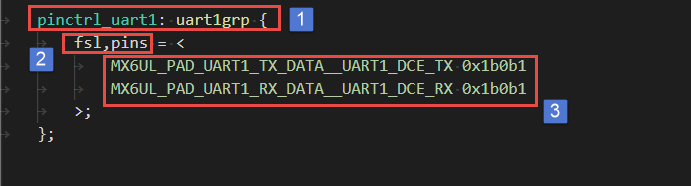

和其他子节点一样，“pinctrl_uart1”子节点按照固定的格式编写，提取格式框架如下所示。

.. code-block:: c 
    :caption: pinctrl子节点格式
    :linenos:

    pinctrl_自定义名字: 自定义名字 {
    	fsl,pins = <
    		引脚复用宏定义   PAD（引脚）属性
    		引脚复用宏定义   PAD（引脚）属性
    	>;
    };    
    

如果我们添加自己的子节点按照上面的格式框架编写即可。我们重点讲解上图的标号3处的内容，它是我们编写的主要内容-添加PIN配
置信息。

每个引脚使用一条配置信息，每条配置信息分为两部分，直观上看第一部分是一个宏定义，暂且称为引脚
复用宏定义，第二部分是一个16进制数，用于设置PAD属性值。以上图的第一条配置信息为例说明如下所示。

.. code-block:: c 
    :caption: 引脚配置信息
    :linenos:

    MX6UL_PAD_UART1_TX_DATA__UART1_DCE_TX 0x1b0b1

**MX6UL_PAD_UART1_TX_DATA__UART1_DCE_TX宏定义**

MX6UL_PAD_UART1_TX_DATA__UART1_DCE_TX是定义在“~/ebf-buster-linux/arch/arm/boot/dts/imx6ul-pinfunc.h”文件内的一个宏定义，如下图所示。

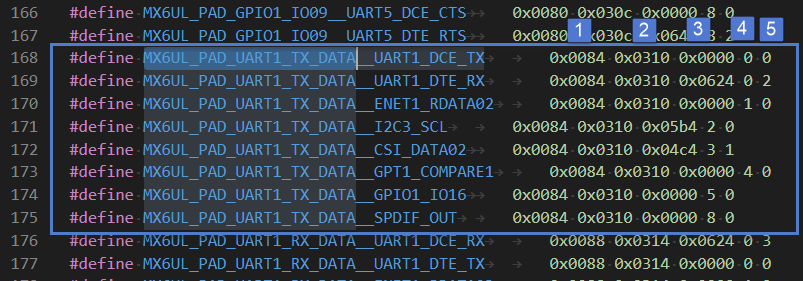

从上图可以看出以“MX6UL_PAD_UART1_TX_DATA__xxx”命名的宏定义共有8个，结合我们之前讲解的引脚复用选择寄存器很容易联想到这就是“UART1_TX_DATA”引脚的8个复用功能，而宏定义“MX6UL_PAD_UART1_TX_DATA__UART1_DCE_TX”将“UART
1_TX_DATA”引脚复用为UART1的TX引脚。每个宏定义后面有5个参数，名字依次为mux_reg、conf_reg、input_reg、mux_mode、input_val。如果将宏定义展开则在设备树中每条配置信息实际是6个参数，由于第6个参数需要根据实际需要设置所以并没有把它放到宏定义里
面。以MX6UL_PAD_UART1_TX_DATA__UART1_DCE_TX为例，宏定义中5个参数参数介绍如下：

1. mux_reg和mux_mode，mux_reg是引脚复用选择寄存器偏移地址，mux_mode是引脚复用选择寄存器模式选择位的值。UART1_TX引脚复用选择寄存器IOMUXC_SW_MUX_CTL_PAD_UART1_TX_DATA定义如下所示。

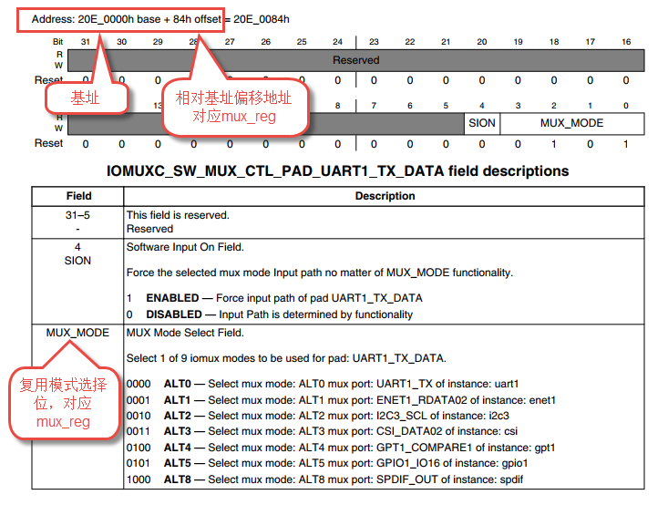

mux_reg = 0x0084与IM6ULL用户手册偏移地址一致, mux_mode = 0。设置复用选择寄存器IOMUXC_SW_MUX_CTL_PAD_UART1_TX_DATA[MUX_MODE] = 0，将其复用为UART1_TX功能。

2. conf_reg，引脚（PAD）属性控制寄存器偏移地址。与引脚复用选择寄存器不同，引脚属性寄存器应当根据实际需要灵活的配置，所以它的值并不包含在宏定义中，它的值是我们上面所说的“第六个”参数。UART1_TX引脚属性控制寄存器IOMUXC_SW_PAD_CTL_PAD_UART1_TX
   _DATA如下所示。

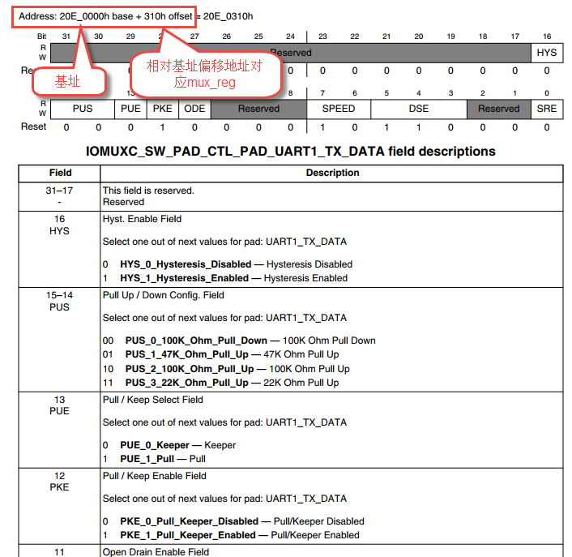

从上图可以看到conf_reg = 0x0310对应UART1_TX引脚的引脚属性寄存器的偏移地址。而这个寄存器包含很多配置项（上图中是部分配置项），这些配置项在裸机部分有详细介绍，寄存器的值就是上面所说的“第六个”参数。

3. input_reg和input_val，input_reg暂且称为输入选择寄存器偏移地址。input_val是输入选择寄存器的值。这个寄存器只有某些用作输入的引脚才有，正如本例所示，UART1_TX用作输出，所以这两个参数都是零。“输入选择寄存器”理解稍微有点复杂，结合下图介绍如下。

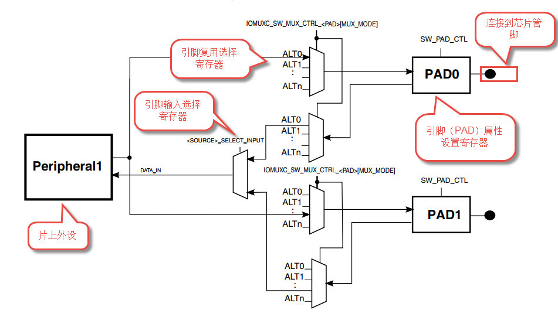

从上图可以看出，如果引脚用作输出，我们我们只需要配置引脚复用选择寄存器和引脚PAD属性设置寄存器。如果用作输入时还增加了引脚输入选择寄存器，输入选择寄存器的作用也很明显，在多个可选输入中选择一个连接到片上外设。

**引脚（PAD）属性值**

在pinctrl子系统中一条配置信息由一个宏定义和一个参数组成，将宏定义展开就是六个参数。结合上图不难发现这6个参数就是IOMUX相关的三个寄存器偏移地址和寄存器的值(引脚用作输出时实际只有四个有效，输入选择寄存器偏移地址和它的值全为0)，至于为什么要将pad属性寄存器的值单独列出，前面也说过了，pad属性配置选项非常多，配置灵活。在pinctrl子系统中添加的PAD属
性值就是引脚（PAD）属性设置寄存器的值（16进制）。有关PAD属性设置内容已经在裸机部分GPIO章节详细介绍这里不再赘述。

将RGB灯引脚添加到pinctrl子系统
^^^^^^^^^^^^^^^^^^^^

本小节假设没有看过裸机部分RGB灯章节，我们从看原理图开始，一步步将RGB灯用到的三个引脚添加到pinctrl子系统中。

查找RGB灯使用的引脚
'''''''''''

RGB灯对应的原理图如下所示。

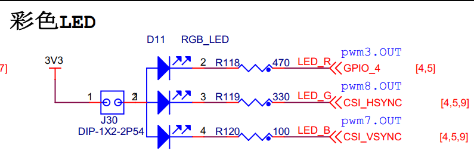

根据网络名在核心板上找到对应的引脚，如下。

rgb_led_red: GPIO1_IO04

rgb_led_green: CSI\_HSYNC

rgb_led_blue: CSI_VSYNC

找到引脚配置宏定义
'''''''''

这些引脚都将被复用为GPIO，用作驱动LED灯。首先要在“~/ebf-buster-linux/arch/arm/boot/dts/imx6ul-pinfunc.h”文件内找到对应的宏定义，以CSI_HSYNC引脚为例，在imx6ul-pinfunc.h中直接搜索“CSI_HSYNC”找到如下结果，

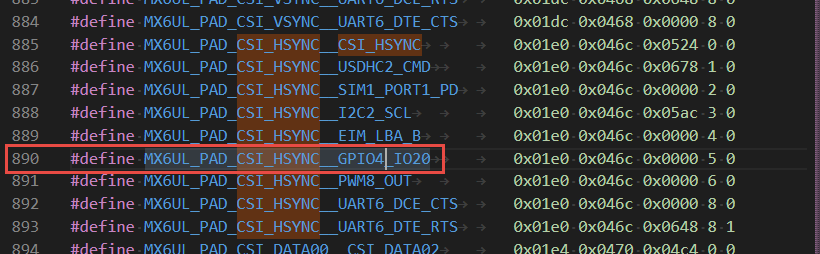

同一个引脚的可选复用功能是连续排布的，我们要将其复用为GPIO，所以选择“MX6UL_PAD_CSI_HSYNC__GPIO4_IO20”即可。

其他的两个引脚最终得到的结果如下：

CSI_HSYNC：MX6UL_PAD_CSI_HSYNC__GPIO4_IO20

CSI_VSYNC：MX6UL_PAD_CSI_VSYNC__GPIO4_IO19

设置引脚属性
''''''

我们要写入到设备树中的引脚属性实际就是引脚属性设置寄存器的值。引脚属性配置项很多，以GPIO1_IO04为例如下所示。

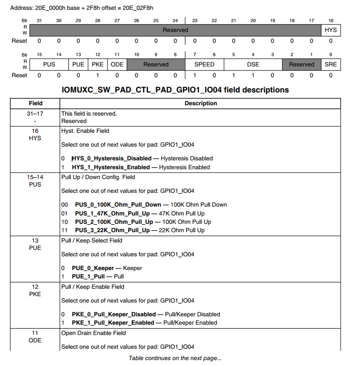

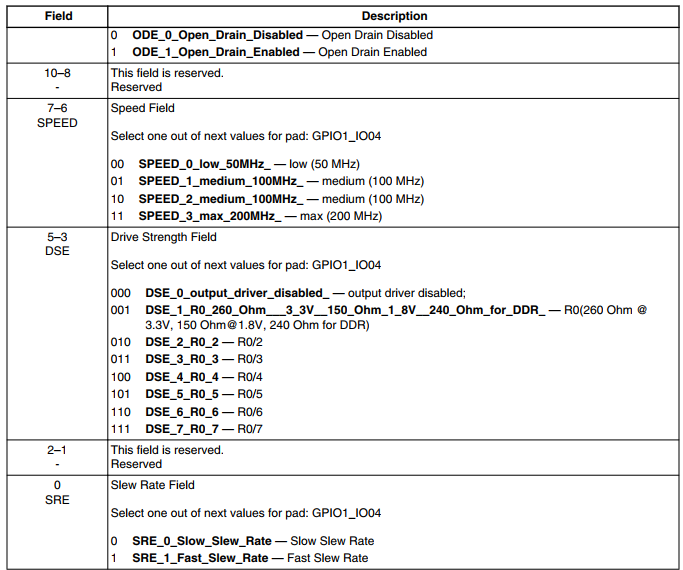

实际编程中我们几乎不会手动设置每一个配置项然后再将其组合成一个16进制数，通常情况下我们直接参照官方的设置，如果有需要在对个别参数进行修改。通常情况下用作GPIO的引脚PAD属性设置为“0x000010B1”

在iomuxc节点中添加pinctrl子节点
''''''''''''''''''''''

添加子节点很简单，我们只需要将前面选择好的配置信息按照之前讲解的格式写入到设备树中即可，添加完成后如下所示。

.. code-block:: c 
    :caption: 新增pinctrl子节点
    :linenos:

    &iomuxc {
    	pinctrl-names = "default";
    	pinctrl-0 = <&pinctrl_hog_1>;
    
    	/*----------新添加的内容--------------*/
    	pinctrl_rgb_led:rgb_led{
    			fsl,pins = <
    				MX6UL_PAD_GPIO1_IO04__GPIO1_IO04	0x000010B1 
    				MX6UL_PAD_CSI_HSYNC__GPIO4_IO20	    0x000010B1 
    				MX6UL_PAD_CSI_VSYNC__GPIO4_IO19	    0x000010B1 
    			>;
    		};

新增的节点名为“rgb_led”，名字任意选取，长度不要超过32个字符，最好能表达出节点的
作用。“pinctrl_rgb_led”节点标签，“pinctrl_”是固定的格式，后面的内容自定义的，我们将通过这个标签引用这个节点。  

GPIO子系统
~~~~~~~

上一小节我们将RGB灯使用的三个引脚添加到了pinctrl子系统中，正常情况下系统会根据
我们添加的配置信息将引脚初始化GPIO，初始化完成后就该GPIO子系统登场了。

会想一下，如果没有使用GPIO子系统我们是怎样控制led灯的。首先要获取RGB灯用到
的GPIO配置寄存器的地址（如果是物理地址还要转化为虚拟地址），然后手动的读、改、写这些寄存器实现控制RGB灯的目的。有了GPIO子系统之后这部分工作
由GPIO子系统帮我们完成，我们只需要调用GPIO子系统提供的API函数即可。

要使用GPIO子系统首先按照要求在设备树中添加设备节点，然后在程序中使用GPIO子系统提供的API实现特定的GPIO功能。

在设备树中添加RGB灯的设备树节点
^^^^^^^^^^^^^^^^^

相比之前led灯的设备树节点(没有使用GPIO子系统)，这里只需要增加GPIO属性定义。基于GPIO子系统的rgb_led设备树节点
添加到“~/ebf-buster-linux/arch/arm/boot/dts/imx6ull-seeed-npi.dts”设备树的根节点内。
添加完成后的设备树如下所示。

.. code-block:: c 
    :caption: 设备树中添加rgb_led节点
    :linenos:

    /*添加rgb_led节点*/
    rgb_led{
    	#address-cells = <1>;
    	#size-cells = <1>;
    	pinctrl-names = "default";
    	compatible = "fire,rgb-led";
    	pinctrl-0 = <&pinctrl_rgb_led>;
    	rgb_led_red = <&gpio1 4 GPIO_ACTIVE_LOW>;
    	rgb_led_green = <&gpio4 20 GPIO_ACTIVE_LOW>;
    	rgb_led_blue = <&gpio4 19 GPIO_ACTIVE_LOW>;
    	status = "okay";
    };

以上代码第6行，设置“compatible”属性值，根据之前讲解这个属性值要和驱动程序中设置的一致，这样才能和驱动匹配。第7行，指定RGB灯的引脚pinctrl信息，上一小节我们定义了pinctrl节点，并且标签设置为“pinctrl_rgb_led”，在这里我们引用了这个pinctrl信息。代码
第8到12行指定引脚使用的哪个GPIO,编写格式如下所示。

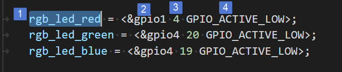

标号①，设置引脚名字，如果使用GPIO子系统提供的API操作GPIO,在驱动程序中会
用到这个名字，名字是自定义的。标号②，指定GPIO组，标号③指定GPIO编号。编号④，这是一个宏定义，指定有效电平，低电平有效选择“GPIO_ACTIVE_LOW”高电平有效选择“GPIO_ACTIVE_HIGH”
。

编译、下载设备树验证修改结果
^^^^^^^^^^^^^^

前两小节我们分别在设备树中将RGB灯使用的引脚添加到pinctrl子系统，然
后又在设备树中添加了rgb_led设备树节点。这一小节将会编译、下载修改后的设备树，用新的设备树启动系统，然后检查是否有rgb_led设备树节点产生。

编译内核时会自动编译设备树，我们可以直接重新编译内核，这样做的缺点是编译时间会很长。如果内核已经成功编译过一次并且没有执行“make distclean”命令清理内核，我们可以
直接在内核目录下（~/ebf-buster-linux）执行如下命令，只编译设备树：

命令：

.. code-block:: sh
   :linenos:

   make ARCH=arm CROSS_COMPILE=arm-linux-gnueabihf- dtbs

如果执行了“make distclean”清理了内核，那么就需要在内核目录下执行如下命令重新配置内核（如果编译设备树出错也可以先清理内核然后执行如下命令尝试重新编译）。

命令：

.. code-block:: sh
   :linenos:

   make ARCH=arm CROSS_COMPILE=arm-linux-gnueabihf- npi_v7_defconfig
   make ARCH=arm CROSS_COMPILE=arm-linux-gnueabihf- dtbs

编译成功后会在“/ebf-buster-linux/arch/arm/boot/dts”目录下生成“imx6ull-seeed-npi.dtb”将其烧录到开发板，使用新的设备树启动之后正常情况下会在开发板的“/proc/driver-tree”目录下生成“rgb_led”设备树节点。如下所示。

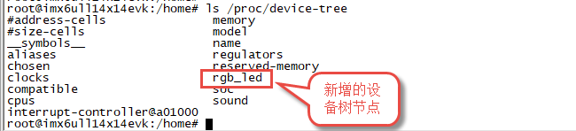

GPIO子系统常用API函数讲解
^^^^^^^^^^^^^^^^

之前两小节我们修改设备树并编译、下载到开开发板。设备树部分已经完成了，这里介绍GPIO子系统常用的几个API函数，然后就可以使用GPIO子系统编写RGB驱动了。

**1. 获取GPIO编号函数of_get_named_gpio**

GPIO子系统大多数API函数会用到GPIO编号。GPIO编号是of_get_named_gpio函数从设备树中获取的。

.. code-block:: c
   :caption: of_get_named_gpio函数(内核源码include/linux/of_gpio.h)
   :linenos:

    static inline int of_get_named_gpio(struct device_node *np, const char *propname, int index)

**参数：**

- **np：** 指定设备节点。
- **propname：** GPIO属性名，与设备树中定义的属性名对应。
- **index：** 引脚索引值，在设备树中一条引脚属性可以包含多个引脚，该参数用于指定获取那个引脚。

**返回值：**

- **成功：** 获取的GPIO编号（这里的GPIO编号是根据引脚属性生成的一个非负整数），
- **失败:** 返回负数。

**2. GPIO申请函数gpio_request**

.. code-block:: c
   :caption: gpio_request函数(内核源码drivers/gpio/gpiolib-legacy.c)
   :linenos:

   static inline int gpio_request(unsigned gpio, const char *label);

**参数：**

- **gpio:** 要申请的GPIO编号，该值是函数of_get_named_gpio的返回值。
- **label:** 引脚名字，相当于为申请得到的引脚取了个别名。

**返回值：**

- **成功:** 返回0，
- **失败:** 返回负数。

**3. GPIO释放函数**

.. code-block:: c
   :linenos:
   :caption: gpio_free函数(内核源码drivers/gpio/gpiolib-legacy.c)

   static inline void gpio_free(unsigned gpio);

该函数与gpio_request是一对，一个申请，一个释放。一个GPIO只能被申请一次，所以不再使用某一个引脚时一定要调用gpio_request函数将其释放掉。

**参数：**

- **gpio：** 要释放的GPIO编号。

**返回值：** **无**

**4. GPIO输出设置函数gpio_direction_output**

函数用于将引脚设置为输出模式。

.. code-block:: c 
   :linenos:
   :caption: gpio_direction_output函数(内核源码include/asm-generic/gpio.h)
   
   static inline int gpio_direction_output(unsigned gpio , int value);

**函数参数：**

- **gpio:** 要设置的GPIO的编号。
- **value:** 输出值，1，表示高电平。0表示低电平。

**返回值：**

- **成功:** 返回0
- **失败:** 返回负数。

**5. GPIO输入设置函数gpio_direction_input**

gpio_direction_output与gpio_direction_input是一对，前者将引脚设置为输出，后者用于将引脚设置为输入。

.. code-block:: c
   :linenos:
   :caption: gpio_direction_input函数(内核源码include/asm-generic/gpio.h)

   static inline int gpio_direction_input(unsigned gpio)

**函数参数：**

- **gpio:** 要设置的GPIO的编号。

**返回值：**

- **成功:** 返回0
- **失败:** 返回负数。

**6. 获取GPIO引脚值函数gpio_get_value**

无论引脚被设置为输出或者输入都可以用该函数获取引脚的当前状态。

.. code-block:: c
   :linenos:
   :caption: gpio_get_value函数(内核源码include/asm-generic/gpio.h)

   static inline int gpio_get_value(unsigned gpio);

**函数参数：**

- **gpio:** 要获取的GPIO的编号。

**返回值：**

- **成功:** 获取得到的引脚状态
- **失败:** 返回负数

**7. 设置GPIO输出值gpio_set_value**

该函数只用于那些设置为输出模式的GPIO.

.. code-block:: c
   :linenos:
   :caption: gpio_direction_output函数(内核源码include/asm-generic/gpio.h)

   static inline int gpio_direction_output(unsigned gpio, int value);

**函数参数**

- **gpio：** 设置的GPIO的编号。
- **value：** 设置的输出值，为1输出高电平，为0输出低电平。

**返回值：**

- **成功:** 返回0
- **失败:** 返回负数

我们使用以上函数就可以在驱动程序中控制IO口了。

基于GPIO子系统的RGB程序编写
~~~~~~~~~~~~~~~~~

程序包含两部分，第一部分是驱动程序，驱动程序在平台总线基础上编写。第二部分是一个简单的测试程序，用于测试驱动是否正常。

驱动程序编写
^^^^^^

驱动程序大致分为三个部分，第一部分，编写平台设备驱动的入口和出口函数。第二部分，编写平台设备的.probe函数,在probe函数中实现字符设备的注册和RGB灯的初始化。第三部分，编写字符设备函数集，实现open和write函数。

**平台驱动入口和出口函数实现**

程序与平台驱动章节相同，源码如下：

.. code-block:: c 
    :caption: 平台驱动框架
    :linenos:

    /*------------------第一部分----------------*/
    static const struct of_device_id rgb_led[] = {
    { .compatible = "fire,rgb-led"},
      { /* sentinel */ }
    };
    
    /*定义平台驱动结构体*/
    struct platform_driver led_platform_driver = {
    	.probe = led_probe,
    	.driver = {
    		.name = "rgb-leds-platform",
    		.owner = THIS_MODULE,
    		.of_match_table = rgb_led,
    	}
    };
    
    /*------------------第二部分----------------*/
    /*驱动初始化函数*/
    static int __init led_platform_driver_init(void)
    {
    	int error;
    	
    	error = platform_driver_register(&led_platform_driver);
    	
    	printk(KERN_EMERG "\tDriverState = %d\n",error);
    	return 0;
    }
    
    /*------------------第三部分----------------*/
    /*驱动注销函数*/
    static void __exit led_platform_driver_exit(void)
    {
    	printk(KERN_EMERG "platform_driver_exit!\n");
    	
    	platform_driver_unregister(&led_platform_driver);	
    }
    
    
    module_init(led_platform_driver_init);
    module_exit(led_platform_driver_exit);
    
    MODULE_LICENSE("GPL");

以上代码分为三部分，第二、三部分是平台设备的入口和出口函数，函数实现很简单，在入口函数中注册平台驱动，在出口函数中注销平台驱动。我们重点介绍第一部分，平台驱动结构体。

在平台驱动结构体中我们仅实现.probe函数和.driver，当驱动和设备匹配成功后会执行该函数，这个函数的函数实现我们在后面介绍。.driver描述这个驱动的属性，包括.name驱动的名字，.owner驱动的所有者,.of_match_table
驱动匹配表，用于匹配驱动和设备。驱动设备匹配表定义为“rgb_led”在这个表里只有一个匹配值“.compatible = “fire,rgb-led””这个值要与我
们在设备树中rgb_led设备树节点的“compatible”属性相同。

**平台驱动.probe函数实现**

当驱动和设备匹配后首先会probe函数，我们在probe函数中实现RGB的初始化、注册一个字符设备。后面将会在字符设备操作函数（open、write）中实现对RGB等的控制。函数源码如下所示。

.. code-block:: c 
    :caption: probe函数实现
    :linenos:

    static int led_probe(struct platform_device *pdv)
    {
        unsigned int  register_data = 0;  //用于保存读取得到的寄存器值
    	int ret = 0;  //用于保存申请设备号的结果
        
    	printk(KERN_EMERG "\t  match successed  \n");
    
    	/*------------------第一部分---------------*/
        /*获取RGB的设备树节点*/
        rgb_led_device_node = of_find_node_by_path("/rgb_led");
        if(rgb_led_device_node == NULL)
        {
            printk(KERN_EMERG "\t  get rgb_led failed!  \n");
        }
    
    	/*------------------第二部分---------------*/
        rgb_led_red = of_get_named_gpio(rgb_led_device_node, "rgb_led_red", 0);
        rgb_led_green = of_get_named_gpio(rgb_led_device_node, "rgb_led_green", 0);
        rgb_led_blue = of_get_named_gpio(rgb_led_device_node, "rgb_led_blue", 0);
    
        printk("rgb_led_red = %d,\n rgb_led_green = %d,\n rgb_led_blue = %d,\n", rgb_led_red,\
        rgb_led_green,rgb_led_blue);
    
    	/*------------------第三部分---------------*/
        gpio_direction_output(rgb_led_red, 1);
        gpio_direction_output(rgb_led_green, 1);
        gpio_direction_output(rgb_led_blue, 1);
    
    	/*------------------第四部分---------------*/
    	/*---------------------注册 字符设备部分-----------------*/
    	//第一步
        //采用动态分配的方式，获取设备编号，次设备号为0，
        //设备名称为rgb-leds，可通过命令cat  /proc/devices查看
        //DEV_CNT为1，当前只申请一个设备编号
        ret = alloc_chrdev_region(&led_devno, 0, DEV_CNT, DEV_NAME);
        if(ret < 0){
            printk("fail to alloc led_devno\n");
            goto alloc_err;
        }
        //第二步
        //关联字符设备结构体cdev与文件操作结构体file_operations
    	led_chr_dev.owner = THIS_MODULE;
        cdev_init(&led_chr_dev, &led_chr_dev_fops);
        //第三步
        //添加设备至cdev_map散列表中
        ret = cdev_add(&led_chr_dev, led_devno, DEV_CNT);
        if(ret < 0)
        {
            printk("fail to add cdev\n");
            goto add_err;
        }
    
    	//第四步
    	/*创建类 */
    	class_led = class_create(THIS_MODULE, DEV_NAME);
    
    	/*创建设备*/
    	device = device_create(class_led, NULL, led_devno, NULL, DEV_NAME);
    
    	return 0;
    
    add_err:
        //添加设备失败时，需要注销设备号
        unregister_chrdev_region(led_devno, DEV_CNT);
    	printk("\n error! \n");
    alloc_err:
    
    	return -1;
    }

前三部分是RGB灯初始化部分，第四部分是字符设备相关内容，这部分内容在字符设备章节已经详细介绍这里不再赘述。

第一部分，使用of_find_node_by_path函数找到并获取rgb_led在设备树中的设备节点。参数“/rgb_led”是要获取的设备树节点在设备树中的路径，由于rgb_led设备树节点在根节点下，所以路径为“/rgb_led”，如果要获取的节点嵌套在其他子节点中需要写出节点所在的完整路径。

第二部分，使用函数of_get_named_gpio函数获取GPIO号，以“rgb_led_red = of_get_named_gpio(rgb_led_device_node, “rgb_led_red”,
0);”为例，读取成功则返回读取得到的GPIO号。“rgb_led_device_node”是我们使用函数“of_find_node_by_path”得到
的设备节点。“rgb_led_red”指定GPIO的名字，这个参数要与rgb_led设备树节点中GPIO属性名对应，如下所示

.. code-block:: c 
    :caption: 设备树中GPIO属性定义部分
    :linenos:

    rgb_led_red = <&gpio1 4 GPIO_ACTIVE_LOW>;
    rgb_led_green = <&gpio4 20 GPIO_ACTIVE_LOW>;
    rgb_led_blue = <&gpio4 19 GPIO_ACTIVE_LOW>;

参数“0”指定引脚索引，我们的设备树中一条属性中只定义了一个引脚，当然也可以定义多个，如果定义多个则该参数就用于指定获取的哪一个（从零开始），我们只有一个所以设置为0.

第三部分，将GPIO设置为输出模式，默认输出电平为高电平。上一步我们已经获取了引脚编号，这里直接使用GPIO子系统提供的API函数操作GPIO即可。

**实现字符设备函数**

字符设备函数我们只需要实现open函数和write函数。函数源码如下。

.. code-block:: c 
    :caption: open函数和write函数实现
    :linenos:

    /*------------------第一部分---------------*/
    /*字符设备操作函数集*/
    static struct file_operations  led_chr_dev_fops = 
    {
    	.owner = THIS_MODULE,
       .open = led_chr_dev_open,
    	.write = led_chr_dev_write,
    };
    
    /*------------------第二部分---------------*/
    /*字符设备操作函数集，open函数*/
    static int led_chr_dev_open(struct inode *inode, struct file *filp)
    {
    	printk("\n open form driver \n");
        return 0;
    }
    
    /*------------------第三部分---------------*/
    /*字符设备操作函数集，write函数*/
    static ssize_t led_chr_dev_write(struct file *filp, const char __user *buf, size_t cnt, loff_t *offt)
    {
    	unsigned char write_data; //用于保存接收到的数据
    
    	int error = copy_from_user(&write_data, buf, cnt);
    	if(error < 0) {
    		return -1;
    	}
    
        /*设置 GPIO1_04 输出电平*/
    	if(write_data & 0x04)
    	{
    		gpio_direction_output(rgb_led_red, 0);  // GPIO1_04引脚输出低电平，红灯亮
    	}
    	else
    	{
    		gpio_direction_output(rgb_led_red, 1);    // GPIO1_04引脚输出高电平，红灯灭
    	}
    
        /*设置 GPIO4_20 输出电平*/
    	if(write_data & 0x02)
    	{
    		gpio_direction_output(rgb_led_green, 0);  // GPIO4_20引脚输出低电平，绿灯亮
    	}
    	else
    	{
    		gpio_direction_output(rgb_led_green, 1);    // GPIO4_20引脚输出高电平，绿灯灭
    	}
    
        /*设置 GPIO4_19 输出电平*/
    	if(write_data & 0x01)
    	{
    		gpio_direction_output(rgb_led_blue, 0);  // GPIO4_19引脚输出低电平，蓝灯亮
    	}
    	else
    	{
    		gpio_direction_output(rgb_led_blue, 1);    // GPIO4_19引脚输出高电平，蓝灯灭
    	}
    
    	return 0;
    }

代码共分为三部分，结合代码介绍如下：

第一部分，定义字符设备操作函数集，这里我们只实现open和write函数即可。

第二部分，实现open函数，在平台驱动的prob函数中已经初始化了GPIO,这里不用做任何操作，当然我们也可以将GPIO初始化部分代码移动到这里。

第三部分，实现write函数。write函数的主要任务是根据应用程序传递来的命令控制RGB三个灯的亮、灭。这里存在一个问题，我们怎么解析命令？ 在程序中规定“命令”是一个“unsigned char”类型的数据，数据的后三位从高到低分别代表红、绿、蓝。为“1”表示亮为“0”表示灭。

write函数实现也很简单，首先使用“copy_from_user”函数将来自应用层的数据“拷贝”内核层。得到命令后就依次检查
后三位，根据命令值使用“gpio_direction_output”函数控制RGB灯的亮灭。

**修改Makefile并编译生成驱动程序**

Makefile程序并没有大的变化，修改后的Makefile如下所示。

.. code-block:: c 
    :caption: Makefile文件
    :linenos:

    KERNEL_DIR = /home/fire2/ebf-buster-linux
    
    obj-m := rgb-leds.o
    
    all:
    	$(MAKE) -C $(KERNEL_DIR) M=$(CURDIR) modules
    	
    .PHONY:clean
    clean:
    	$(MAKE) -C $(KERNEL_DIR) M=$(CURDIR) clean

需要注意的是第二行，变量“KERNEL_DIR”保存的是内核所在路径，这个需要根据自己内核所在位置设定。第四行“obj-m := rgb-leds.o”中的“rgb-leds.o”要与驱动源码名对应。Makefiel 修改完成后执行如下命令编译驱动。

命令：

.. code-block:: sh
   :linenos:

   make ARCH=arm CROSS_COMPILE=arm-linux-gnueabihf-

正常情况下会在当前目录生成.ko驱动文件。

应用程序编写
^^^^^^

应用程序实现

应用程序编写比较简单，我们只需要打开设备节点文件，写入命令然后关闭设备节点文件即可。源码如下所示。

.. code-block:: c 
    :caption: Makefile文件
    :linenos:

    int main(int argc, char *argv[])
    {
        /*判断输入的命令是否合法*/
        if(argc != 2)
        {
            printf(" commend error ! \n");
            return -1;
        }
    
        /*打开文件*/
        int fd = open("/dev/rgb-leds", O_RDWR);
        if(fd < 0)
        {
    		printf("open file : %s failed !\n", argv[0]);
    		return -1;
    	}
    
        unsigned char commend = atoi(argv[1]);  //将受到的命令值转化为数字;
    
        /*判断命令的有效性*/
        /*写入命令*/
        int error = write(fd,&commend,sizeof(commend));
        if(error < 0)
        {
            printf("write file error! \n");
            close(fd);
            /*判断是否关闭成功*/
        }
        /*关闭文件*/
        error = close(fd);
        if(error < 0)
        {
            printf("close file error! \n");
        }
        return 0;
    }

结合代码各部分说明如下：

第一部分，判断命令是否有效。再运行应用程序时我们要传递一个控制命令，所以参数长度是2。

第二部分，打开设备文件。参数“/dev/rgb-leds”用于指定设备节点文件，设备节点文件名是在驱动程序中设置的，这里保证与驱动一致即可。

第三部分，由于从main函数中获取的参数是字符串，这里首先要将其转化为数字。最后条用write函数写入命令然后关闭文件即可。

编译应用程序

进入应用程序所在目录“~/gpio_subsystem_rgb_led/”执行如下命令：

命令：

.. code-block:: sh
   :linenos:

   arm-linux-gnueabihf-gcc <源文件名> –o <输出文件名>

以本章配套历程为例执行如下命令编译应用程序：

命令：

.. code-block:: sh
   :linenos:

   arm-linux-gnueabihf-gcc rgb_leds_app.c –o rgb_leds_app

下载验证
^^^^

前两小节我们已经编译出了.ko驱动和应用程序，将驱动程序和应用程序添加到开发板中（推荐使用之前讲解的NFS共享文件夹），驱动程序和应用程序在开发板中的存放位置没有限制。我们将驱动和应用都放到开发板的“/home/nfs_share”目录下，如下所示。

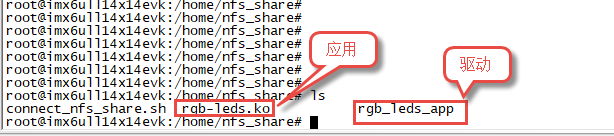

执行如下命令加载驱动：

命令：

.. code-block:: sh
   :linenos:

   insmod ./rgb-leds.ko

正常情况下输出结果如下所示。

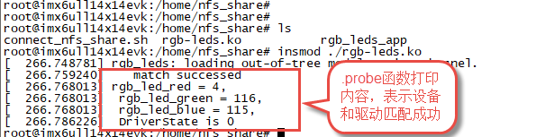

在驱动程序中，我们在.probe函数中注册字符设备并创建了设备文件，设备和驱动匹配成功后.probe函数已经执行，所以正常情况下在“/dev/”目录下已经生成了“rgb-leds”设备节点，如下所示。

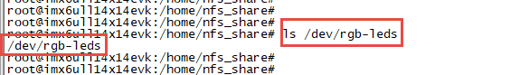

驱动加载成功后直接运行应用程序如下所示。

命令：

.. code-block:: sh
   :linenos:

   ./rgb_leds_app <命令>

执行结果如下：

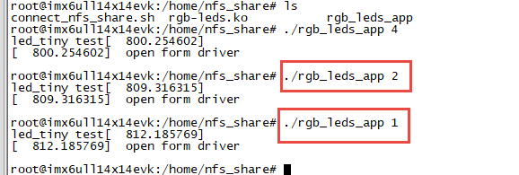

命令是一个“unsigned char”型数据，只有后三位有效，每一位代表一个灯，从高到低依次代表红、绿、蓝，1表示亮，0表示灭。例如命令=4 则亮红灯，命令=7则三个灯全亮。

.. |gpiosu002| image:: media\gpiosu002.png
   :width: 5.76806in
   :height: 1.09722in
.. |gpiosu003| image:: media\gpiosu003.png
   :width: 5.76806in
   :height: 1.55208in
.. |gpiosu004| image:: media\gpiosu004.png
   :width: 5.76806in
   :height: 2.01806in
.. |gpiosu005| image:: media\gpiosu005.png
   :width: 5.76806in
   :height: 4.35903in
.. |gpiosu006| image:: media\gpiosu006.png
   :width: 5.76806in
   :height: 5.6125in
.. |gpiosu007| image:: media\gpiosu007.png
   :width: 5.76806in
   :height: 3.31111in
.. |gpiosu008| image:: media\gpiosu008.png
   :width: 5.76806in
   :height: 1.98056in
.. |gpiosu009| image:: media\gpiosu009.png
   :width: 5.76806in
   :height: 1.78681in
.. |gpiosu010| image:: media\gpiosu010.png
   :width: 5.76806in
   :height: 6.06111in
.. |gpiosu011| image:: media\gpiosu011.png
   :width: 5.76806in
   :height: 4.81389in
.. |gpiosu012| image:: media\gpiosu012.png
   :width: 5.76806in
   :height: 1.21319in
.. |gpiosu013| image:: media\gpiosu013.png
   :width: 5.76806in
   :height: 1.31319in
.. |gpiosu014| image:: media\gpiosu014.png
   :width: 5.76806in
   :height: 1.27708in
.. |gpiosu015| image:: media\gpiosu015.png
   :width: 5.76806in
   :height: 1.48264in
.. |gpiosu016| image:: media\gpiosu016.png
   :width: 5.76806in
   :height: 0.83194in
.. |gpiosu017| image:: media\gpiosu017.png
   :width: 5.76806in
   :height: 1.94583in
