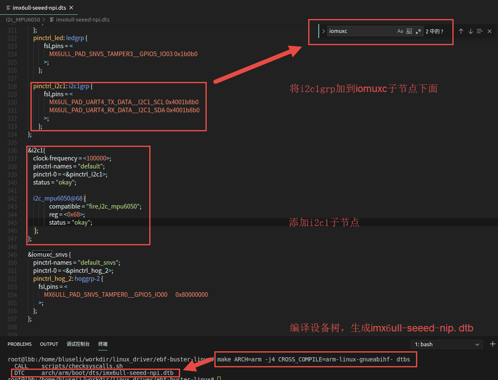
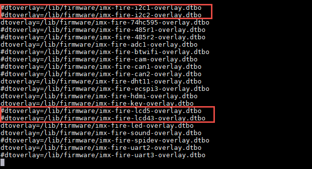
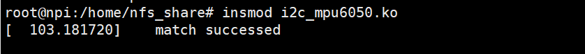
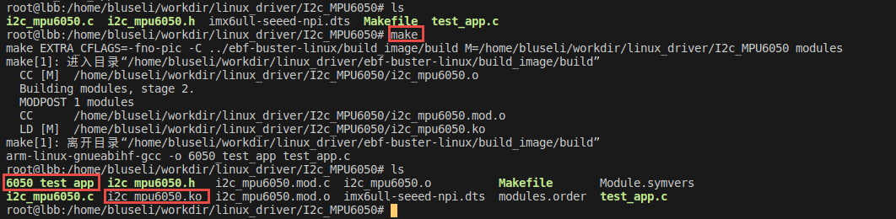

.. vim: syntax=rst

i2c_mpu6050驱动实验
---------------

本章我们以板载MPU6050为例讲解i2c驱动程序的编写，本章主要分为四
部分内容。第一部分，i2c驱动基本知识，包括i2c驱动的一些函数和结构
体讲解。第二部分，编写i2c_mpu6050的设备树插件。第三部分，编写mpu6050驱动。第四部分，编写
简单测试应用程序。

本章配套源码和设备树插件源码位于“~/embed_linux_tutorial/base_code/linux_driver/I2c_MPU6050”。

i2c驱动基本知识
~~~~~~~~~

学过单片机的用户对i2c协议并不陌生，如果忘记可参考野火单片机相关教程，这里不再赘述。

在编写单片机裸机i2c驱动时我们需要根据i2c协议手动配置i2c控制寄存器使其能够输出起始信号、停止信号、数据信息等等。在Linux系统中采用了总线、设备驱动模型。我们之前讲解的平台设备也是采用了这种总线、设备驱动模型，只不过平台总线是一个虚拟的总线。

我们知道一个i2c(例如i2c1)上可以挂在多个i2c设备，例如mpu6050、i2c接口的OLED显示屏、摄像头（摄像头通过i2c接口发送控制信息）等等，这些设备共用一个i2c，这个i2c的驱动我们称为i2c总线驱动。而对应具体的设备,例如mpu6050的驱动就是设备驱动。这样我们要使用mpu60
50就需要拥有“两个驱动”一个是i2c总线驱动和mpu6050设备驱动。i2c总线驱动由芯片厂商提供（驱动复杂，官方提供了经过测试的驱动，我们直接用），mpu6050设备驱动可以从mpu6050芯片厂家那里获得（不确定有），也可以我们手动编写。

NXP官方i2c总线驱动介绍
~~~~~~~~~~~~~~

为方便用户使用NXP官方已经写好了i2c总线驱动，如果我们使用NXP官方提供的Linux内核i2c总线驱动已经保存在内核中，并且默认情况下已经编译进内核。下面结合源码简单介绍i2c总线驱动实现。

查找i2c总线驱动的入口在设备树，我们可以根据i2c设备节点中的compatible属性来定位i2c总线驱动源码。i2c是IMX6ull平台共用的资源所以它的设备树节点保存在“imx6ull.dtsi”文件内，该文件位于内核源码的“~/arch/arm/boot/dts”目录下。打开该文件，在文件中
直接搜索i2c1，找到i2c1对应的设备树节点如下所示。

.. code-block:: c 
    :caption: i2c1设别树节点
    :linenos:

    i2c1: i2c@021a0000 {
    	#address-cells = <1>;
    	#size-cells = <0>;
    	compatible = "fsl,imx6ul-i2c", "fsl,imx21-i2c";
    	reg = <0x021a0000 0x4000>;
    	interrupts = <GIC_SPI 36 IRQ_TYPE_LEVEL_HIGH>;
    	clocks = <&clks IMX6UL_CLK_I2C1>;
    	status = "disabled";
    };

我么先不关心i2c1设备树节点的详细内容，重点关注compatible属性，我们复制“fsl,imx6ul-i2c”或“fsl,imx21-i2c”在内核驱动源码中全局搜索（例如进入内核源码使用VScode打开drivers文件夹使用vscode搜索）。如下所示。

进入i2c驱动源文件“~/drivers/i2c/busses/i2c-imx.c”，i2c总线驱动代码较长，我们只简单介绍重要的几个点，如果感兴趣可自行阅读完整的i2c驱动源码。通常情况下，看驱动程序首先要找到驱动的入口和出口函数，驱动入口和出口位于驱动的末尾，如下所示。

.. code-block:: c 
    :caption: 驱动入口和出口函数
    :linenos:

    static int __init i2c_adap_imx_init(void)
    {
    	return platform_driver_register(&i2c_imx_driver);
    }
    subsys_initcall(i2c_adap_imx_init);
    
    static void __exit i2c_adap_imx_exit(void)
    {
    	platform_driver_unregister(&i2c_imx_driver);
    }
    module_exit(i2c_adap_imx_exit);

驱动入口和出口函数很简单，我们可以从中得到i2c驱动是一个平台驱动，并且我们知道平台驱动结构体是“i2c_imx_driver”，平台驱动结构体如下所示。

.. code-block:: c 
    :caption: 平台设备驱动结构体
    :linenos:

    /*----------------第一部分-----------------*/
    static const struct of_device_id i2c_imx_dt_ids[] = {
    	{ .compatible = "fsl,imx1-i2c", .data = &imx1_i2c_hwdata, },
    	{ .compatible = "fsl,imx21-i2c", .data = &imx21_i2c_hwdata, },
    	{ .compatible = "fsl,vf610-i2c", .data = &vf610_i2c_hwdata, },
    	{ /* sentinel */ }
    };
    
    /*----------------第二部分-----------------*/
    static struct platform_driver i2c_imx_driver = {
    	.probe = i2c_imx_probe,
    	.remove = i2c_imx_remove,
    	.driver	= {
    		.name = DRIVER_NAME,
    		.owner = THIS_MODULE,
    		.of_match_table = i2c_imx_dt_ids,
    		.pm = IMX_I2C_PM,
    	},
    	.id_table	= imx_i2c_devtype,
    };

第一部分是i2c驱动的匹配表，用于和设备树节点匹配，第二部分就是初始化的平台设备结构体，从这个结构体我们可以找到.prob函数，.prob函数的作用我们都很清楚，通常情况下该函数实现设备的基本初始化，下面重点介绍.porb函数的内容。（.prob函数较长，推荐配合源码阅读这部分内容）。

.. code-block:: c 
    :caption: i2c 驱动 .prob函数
    :linenos:

    static int i2c_imx_probe(struct platform_device *pdev)
    {
    	const struct of_device_id *of_id = of_match_device(i2c_imx_dt_ids,
    							   &pdev->dev);
    	struct imx_i2c_struct *i2c_imx;
    	struct resource *res;
    	struct imxi2c_platform_data *pdata = dev_get_platdata(&pdev->dev);
    	void __iomem *base;
    	int irq, ret;
    	dma_addr_t phy_addr;
    
    	dev_dbg(&pdev->dev, "<%s>\n", __func__);
    
    /*----------------第一部分-----------------*/
    	irq = platform_get_irq(pdev, 0);
    	if (irq < 0) {
    		dev_err(&pdev->dev, "can't get irq number\n");
    		return irq;
    	}
    
    /*----------------第二部分-----------------*/
    	res = platform_get_resource(pdev, IORESOURCE_MEM, 0);
    	base = devm_ioremap_resource(&pdev->dev, res);
    	if (IS_ERR(base))
    		return PTR_ERR(base);
    
    	phy_addr = (dma_addr_t)res->start;
    
        /*----------------第三部分-----------------*/
    	i2c_imx = devm_kzalloc(&pdev->dev, sizeof(*i2c_imx), GFP_KERNEL);
    	if (!i2c_imx)
    		return -ENOMEM;
    
    	if (of_id)
    		i2c_imx->hwdata = of_id->data;
    	else
    		i2c_imx->hwdata = (struct imx_i2c_hwdata *)
    				platform_get_device_id(pdev)->driver_data;
    
    /*----------------第四部分-----------------*/
    	/* Setup i2c_imx driver structure */
    	strlcpy(i2c_imx->adapter.name, pdev->name, sizeof(i2c_imx->adapter.name));
    	i2c_imx->adapter.owner		= THIS_MODULE;
    	i2c_imx->adapter.algo		= &i2c_imx_algo;
    	i2c_imx->adapter.dev.parent	= &pdev->dev;
    	i2c_imx->adapter.nr		= pdev->id;
    	i2c_imx->adapter.dev.of_node	= pdev->dev.of_node;
    	i2c_imx->base			= base;
    
    /*----------------第五部分-----------------*/
    	/* Get I2C clock */
    	i2c_imx->clk = devm_clk_get(&pdev->dev, NULL);
    	if (IS_ERR(i2c_imx->clk)) {
    		dev_err(&pdev->dev, "can't get I2C clock\n");
    		return PTR_ERR(i2c_imx->clk);
    	}
    
    /*----------------第六部分-----------------*/
    	ret = clk_prepare_enable(i2c_imx->clk);
    	if (ret) {
    		dev_err(&pdev->dev, "can't enable I2C clock\n");
    		return ret;
    	}
    
    /*----------------第七部分-----------------*/
    	/* Request IRQ */
    	ret = devm_request_irq(&pdev->dev, irq, i2c_imx_isr,
    			       IRQF_NO_SUSPEND, pdev->name, i2c_imx);
    	if (ret) {
    		dev_err(&pdev->dev, "can't claim irq %d\n", irq);
    		goto clk_disable;
    	}
    
    	/* Init queue */
    	init_waitqueue_head(&i2c_imx->queue);
    
    	/* Set up adapter data */
    	i2c_set_adapdata(&i2c_imx->adapter, i2c_imx);
    
    	/* Set up clock divider */
    	i2c_imx->bitrate = IMX_I2C_BIT_RATE;
    	ret = of_property_read_u32(pdev->dev.of_node,
    				   "clock-frequency", &i2c_imx->bitrate);
    	if (ret < 0 && pdata && pdata->bitrate)
    		i2c_imx->bitrate = pdata->bitrate;
    
    	/* Set up chip registers to defaults */
    	imx_i2c_write_reg(i2c_imx->hwdata->i2cr_ien_opcode ^ I2CR_IEN,
    			i2c_imx, IMX_I2C_I2CR);
    	imx_i2c_write_reg(i2c_imx->hwdata->i2sr_clr_opcode, i2c_imx, IMX_I2C_I2SR);
    
    	/* Add I2C adapter */
    	ret = i2c_add_numbered_adapter(&i2c_imx->adapter);
    	if (ret < 0) {
    		dev_err(&pdev->dev, "registration failed\n");
    		goto clk_disable;
    	}
    
    	/* Set up platform driver data */
    	platform_set_drvdata(pdev, i2c_imx);
    	clk_disable_unprepare(i2c_imx->clk);
    
    	dev_dbg(&i2c_imx->adapter.dev, "claimed irq %d\n", irq);
    	dev_dbg(&i2c_imx->adapter.dev, "device resources: %pR\n", res);
    	dev_dbg(&i2c_imx->adapter.dev, "adapter name: \"%s\"\n",
    		i2c_imx->adapter.name);
    	dev_info(&i2c_imx->adapter.dev, "IMX I2C adapter registered\n");
    
    	/* Init DMA config if supported */
    	i2c_imx_dma_request(i2c_imx, phy_addr);
    
    	return 0;   /* Return OK */
    
    clk_disable:
    	clk_disable_unprepare(i2c_imx->clk);
    	return ret;
    }

这里简单介绍.prob函数的实现过程，很多详细的内容我们还没有讲解到，这里先不具体介绍。

第一部分， 获取中断号，在i2c1的设备树节点中定义了中断，这里获取得到的中断号申请中断时会用到，获取函数使用的是内核提供的函数“platform_get_irq”。

第二部分，获取reg属性，这里同样使用的是内核提供的“platform_get_resource”它实现的功能和我们使用of函数获取reg属性相同。这里的代码获取得到了i2c1的基地址，并且使用“devm_ioremap_resource”将其转化为虚拟地址。

第三部分，为i2c_imx申请内存空间，我们先不关心申请函数，重点是结构体i2c_imx下面我们将重点介绍这个结构体。

.. code-block:: c 
    :caption: imx_i2c_struct结构体
    :linenos:

    struct imx_i2c_struct {
    	struct i2c_adapter	adapter;
    	struct clk		*clk;
    	void __iomem		*base;
    	wait_queue_head_t	queue;
    	unsigned long		i2csr;
    	unsigned int		disable_delay;
    	int			stopped;
    	unsigned int		ifdr; /* IMX_I2C_IFDR */
    	unsigned int		cur_clk;
    	unsigned int		bitrate;
    	const struct imx_i2c_hwdata	*hwdata;
    
    	struct imx_i2c_dma	*dma;
    };

imx_i2c_struct结构体成员较多，其中大多数是用于保存i2c硬件信息例如clk结构体保存时钟相关信息、bitrate保存iic的波特率、dma保存dam相关信息等等。我们重点关心的是第一个成员“i2c_adapter”结构体。

在Linux内核i2c_adapte结构体用于表示一个实际的i2c总线（例如i2c1）。i2c_adapter结构体如下所示。

.. code-block:: c 
    :caption: i2c_adapter结构体
    :linenos:

    /*
     * i2c_adapter is the structure used to identify a physical i2c bus along
     * with the access algorithms necessary to access it.
     */
    struct i2c_adapter {
    	struct module *owner;
    	unsigned int class;		  /* classes to allow probing for */
    	const struct i2c_algorithm *algo; /* the algorithm to access the bus */
    	void *algo_data;
    
    	/* data fields that are valid for all devices	*/
    	struct rt_mutex bus_lock;
    
    	int timeout;			/* in jiffies */
    	int retries;
    	struct device dev;		/* the adapter device */
    
    	int nr;
    	char name[48];
    	struct completion dev_released;
    
    	struct mutex userspace_clients_lock;
    	struct list_head userspace_clients;
    
    	struct i2c_bus_recovery_info *bus_recovery_info;
    	const struct i2c_adapter_quirks *quirks;
    };

i2c_adapte结构体的一些参数较多。在.prob函数中会初始化部分参数，这里重点介绍“struct
i2c_algorithm”结构体，它用于指定“访问总线（i2c）的算法”，在这里就是用于指定外部访问i2c总线的接口，这个“接口”体现到代码就是一些接口函数，i2c_algorithm结构体如下所示。

.. code-block:: c 
    :caption: i2c_algorithm结构体
    :linenos:

    struct i2c_algorithm {
    	/* If an adapter algorithm can't do I2C-level access, set master_xfer
    	   to NULL. If an adapter algorithm can do SMBus access, set
    	   smbus_xfer. If set to NULL, the SMBus protocol is simulated
    	   using common I2C messages */
    	/* master_xfer should return the number of messages successfully
    	   processed, or a negative value on error */
    	int (*master_xfer)(struct i2c_adapter *adap, struct i2c_msg *msgs,
    			   int num);
    	int (*smbus_xfer) (struct i2c_adapter *adap, u16 addr,
    			   unsigned short flags, char read_write,
    			   u8 command, int size, union i2c_smbus_data *data);
    
    	/* To determine what the adapter supports */
    	u32 (*functionality) (struct i2c_adapter *);
    
    #if IS_ENABLED(CONFIG_I2C_SLAVE)
    	int (*reg_slave)(struct i2c_client *client);
    	int (*unreg_slave)(struct i2c_client *client);
    #endif
    };

从以上代码不难看出i2c_algorithm结构体实际提供了一些函数指针，这些函数就是外部访问i2c总线的接口，更直白的说，i2c设备例如mpu6050、i2c接口的oled屏等等就是通过这些函数接口使用i2c总线实现收、发数据的。在i2c1的总线驱动中会实现这些函数（部分函数）。

回到 i2c1的.prob函数的第四部分代码。

第四部分，初始化i2c_imx结构体，根据前面讲解，i2c_imx结构体内有一个imx_i2c_struct类型的结构体，在程序中它代表一个实际的i2c总线。这部分初始化代码大多数用于初始化imx_i2c_struct结构体的成员。其中我们需要特别关心“i2c_imx->adapter.algo =
&i2c_imx_algo;”，它就是用于初始化“访问总线（i2c）的算法”。“i2c_imx_algo”定义如下。

.. code-block:: c 
    :caption: i2c_algorithm结构体实例i2c_imx_algo
    :linenos:

    static struct i2c_algorithm i2c_imx_algo = {
    	.master_xfer	= i2c_imx_xfer,
    	.functionality	= i2c_imx_func,
    };

i2c_imx_algo结构体内指定了两个函数，它们就是外部访问i2c总线的接口，函数i2c_imx_func只是用于返回当前所处状态，真正实现外部访问i2c总线的是函数i2c_imx_xfer。函数定义如下。（省略了具体的函数实现）。

.. code-block:: c 
    :caption: i2c_imx_xfer函数
    :linenos:

    static int i2c_imx_xfer(struct i2c_adapter *adapter,
    						struct i2c_msg *msgs, int num)

在编写设备驱动时我们会使用“i2c_transfer”函数执行数据的传输，i2c_transfer函数最终就是调用i2c_imx_xfer函数实现具体的收发工作。在编写设备驱动时我们会详细介绍i2c_transfer函数的用法。

第五部分，第五部分完成一些基本的初始化，从上到下依次为 获取i2c的时钟、使能i2c时钟、请求中断、初始化队列、设置i2c_adapter结构体的data参数、设置i2c1的时钟分频、设置寄存器为默认值。

第六部分，添加i2c adapter 。根据之前讲解，在系统中一个i2c adapter（一个i2c_adapter结构体）对应一个i2c设备，这一步就是将i2c添加到系统中。参数就是我们前面部分初始化的i2c_imx->adapter结构体。

整个.prob函数完成了两个主要工作 。第一，初始化i2c1硬件，第二，初始化一个“代表i2c1”的i2c_adapter结构体，并将其添加到系统中。

.prob函数完成了i2c的基本初始化并将其添加到了系统中。i2c总线驱动的另外一个重要工作就是实现i2c对外接口函数。我们在初始化i2c_adapter结构体时已经初始化了“访问总线算法结构体”
i2c_adapter->i2c_algorithm.具体代码为“i2c_imx->adapter.algo = &i2c_imx_algo;”。在i2c_imx_algo结构体源码如下所示。

.. code-block:: c 
    :caption: i2c_imx_algo
    :linenos:

    static struct i2c_algorithm i2c_imx_algo = {
    	.master_xfer	= i2c_imx_xfer,
    	.functionality	= i2c_imx_func,
    };

在i2c设备驱动程序中“i2c_transfer”函数的读、写工工作实际由i2c_imx_xfer函数完成，i2c_imx_xfer函数就是i2c总线驱动中实现具体收发工作的函数。i2c_imx_xfer部分代码如下所示。

.. code-block:: c 
    :caption: i2c_imx_xfer函数
    :linenos:

    static int i2c_imx_xfer(struct i2c_adapter *adapter,
    						struct i2c_msg *msgs, int num)
    {
    /*---------------一下内容省略-------------------*/
    	/* read/write data */
    	for (i = 0; i < num; i++) {
    		if (i == num - 1)
    			is_lastmsg = true;
    
    		if (i) {
    			dev_dbg(&i2c_imx->adapter.dev,
    				"<%s> repeated start\n", __func__);
    			temp = imx_i2c_read_reg(i2c_imx, IMX_I2C_I2CR);
    			temp |= I2CR_RSTA;
    			imx_i2c_write_reg(temp, i2c_imx, IMX_I2C_I2CR);
    			result =  i2c_imx_bus_busy(i2c_imx, 1);
    			if (result)
    				goto fail0;
    		}
    		dev_dbg(&i2c_imx->adapter.dev,
    			"<%s> transfer message: %d\n", __func__, i);
    		/* write/read data */
    /*---------------以下下内容省略-------------------*/
    		if (msgs[i].flags & I2C_M_RD)
    			result = i2c_imx_read(i2c_imx, &msgs[i], is_lastmsg);
    		else {
    			if (i2c_imx->dma && msgs[i].len >= DMA_THRESHOLD)
    				result = i2c_imx_dma_write(i2c_imx, &msgs[i]);
    			else
    				result = i2c_imx_write(i2c_imx, &msgs[i]);
    		}
    		if (result)
    			goto fail0;
    	}
    /*---------------以下下内容省略-------------------*/
    }

从以上代码中可以看到i2c_imx_xfer函数会调用i2c_imx_dma_write、i2c_imx_read、imx_i2c_write_reg等等基本收发函数实现数据的收发工作，这些基本的收发函数由i2c总线驱动实现。

至此，我们知道i2c总线驱动完成了i2c的硬件初始化、将i2c总线添加到系统、并提外界访问i2c总线的接口函数。我们的i2c设备驱动只需要根据特定设备使用这些接口函数即可。下面以mpu6050为例讲解如何编写i2c设备驱动。

mpu6050驱动介绍
~~~~~~~~~~~

mpu6050驱动使用设备树插件方式开发,驱动的主要工作包四部分内容。第一，编写mpu6050的设备树插件，第二，编写mpu6050驱动程序，第三，编写简单测试应用程序。结合代码，这三部分内容介绍如下。

mpu6050设备树插件编写
^^^^^^^^^^^^^^

mpu6050使用的是i2c1，我们需要在i2c1设备节点下追加mpu6050这个设备。如果之前没有用到i2c1(还没有将i2c1的两个引脚)，还需要将i2c1使用的引脚添加到pinctrl子系统对应的节点。设备树插件完整代码如下所示。

.. code-block:: c 
    :caption: mpu6050设备树插件
    :linenos:

    /dts-v1/;
    /plugin/;
    #include "imx6ul-pinfunc.h"
    
     / {
         fragment@0 {
    /*-------------第一部分-----------*/
             target = <&i2c1>;  -------------------------①
             __overlay__ { 
                clock-frequency = <100000>;
    	        pinctrl-names = "default";
    	        pinctrl-0 = <&pinctrl_i2c1>; ------------②
    	        status = "okay";
    
    	        i2c_mpu6050@68 {  -----------------------③
    	        	compatible = "fire,i2c_mpu6050";  ---④
    	        	reg = <0x68>;  ----------------------⑤            
    	        	status = "okay";
    	        };        
             };
         };
    /*-------------第二部分-----------*/
         fragment@1 {
             target = <&iomuxc>;------------------------⑥
             __overlay__ { 
            pinctrl_i2c1: i2c1grp {
            		fsl,pins = <
            			MX6UL_PAD_UART4_TX_DATA__I2C1_SCL 0x4001b8b0
            			MX6UL_PAD_UART4_RX_DATA__I2C1_SDA 0x4001b8b0
            		>;
            	};     
             };
         };
    
     };

设别树插件分为两部分内容，第一部分是在i2c1节点追加mpu6050子节点，第二部分是在pinctrl子系统对应节点内追加i2c1所使用的两个引脚。如果其他i2c1设备已经追加过了，则第二部分可以省略。

第一部分，标号①，指定设备树插件“插入”位置。标号②，指定i2c1使用的引脚，“pinctrl_i2c1”定义在设备树插件的第二部分。标号③，指定mpu6050节点名，注意@符号后面是mpu6050在i2c1总线中地址。这个地址是七位地址，我们原理途中给出了mpu6050的8位地址，右移一位得到7位
地址，如下所示。

标号④用于指定compatible 属性，和驱动保持一致即可。标号⑤，设置reg属性，reg属性只需要指定mpu6050在i2c1总线上的地址即可，注意这里要和标号③处的地址保持一致。

设备树插件的编译、添加到系统请参考“设备树插件实现RGB灯章节”。

mpu6050驱动实现
^^^^^^^^^^^

由于NXP官方已经写好了i2c的总线驱动，mpu6050这个设备驱动就变得很简单，下面结合代码介绍mpu6050设别驱动实现。

和平台设备驱动类似，驱动框架如下：

.. code-block:: c 
    :caption: mpu6050驱动程序结构
    :linenos:

    /*--------------第四部分----------------*/
    static int i2c_write_mpu6050(struct i2c_client *mpu6050_client, u8 address, u8 data)
    {
    	return 0;
    }
    static int i2c_read_mpu6050(struct i2c_client *mpu6050_client, u8 address, void *data, u32 length)
    {
    	return 0;
    }
    static int mpu6050_init(void)
    {
    	return 0;
    }
    
    /*--------------第三部分----------------*/
    /*字符设备操作函数集，open函数实现*/
    static int mpu6050_open(struct inode *inode, struct file *filp)
    {
    	return 0;
    }
    /*字符设备操作函数集，.read函数实现*/
    static ssize_t mpu6050_read(struct file *filp, char __user *buf, size_t cnt, loff_t *off)
    {
    	return 0;
    }
    /*字符设备操作函数集，.release函数实现*/
    static int mpu6050_release(struct inode *inode, struct file *filp)
    {
    	return 0;
    }
    /*字符设备操作函数集*/
    static struct file_operations mpu6050_chr_dev_fops =
    	{
    		.owner = THIS_MODULE,
    		.open = mpu6050_open,
    		.read = mpu6050_read,
    		.release = mpu6050_release,
    };
    /*--------------第二部分--------------------*/
    /*i2c总线设备函数集*/
    static int mpu6050_probe(struct i2c_client *client, const struct i2c_device_id *id)
    {
    	/*---------------------添加、注册字符设备-----------------*/
    	return 0
    }
    static int mpu6050_remove(struct i2c_client *client)
    {
    	/*删除设备*/
    	return 0;
    }
    
    
    /*--------------第一部分--------------------*/
    /*定义i2c总线设备结构体*/
    struct i2c_driver mpu6050_driver = {
    	.probe = mpu6050_probe,
    	.remove = mpu6050_remove,
    	.id_table = gtp_device_id,
    };
    
    /*
    *驱动初始化函数
    */
    static int __init mpu6050_driver_init(void)
    {
    	return 0;
    }
    
    /*
    *驱动注销函数
    */
    static void __exit mpu6050_driver_exit(void)
    {
    
    }
    
    module_init(mpu6050_driver_init);
    module_exit(mpu6050_driver_exit);
    
    MODULE_LICENSE("GPL");

从下往上看，驱动程序分为四部分内容。结合以上代码介绍如下：

第一部分，定义i2c总线设备结构体并实现i2c总线设备的注册和注销函数，在这里就是程驱动程序的入口和出口函数。

第二部分，实现i2c总线设备结构体中定义的操作函数，主要是.prob匹配函数，在.prob函数中添加、注册一个字符设备，这个字符设备用于实现mpu6050的具体功能。

第三部分，定义并实现字符设备操作函数集。在应用程序中的open、read操作传到内核后就是执行这些函数，所以他们要真正实现对mpu6050的初始化以及读取转换结果。

第四部分，具体的读、写mpu6050的函数，它们被第三部分的函数调用，用户自行定义。

下面我们将按照这四部分内容介绍mpu6050设备驱动程序实现。

驱动入口和出口函数实现
'''''''''''

驱动入口和出口函数仅仅用于注册、注销i2c设备驱动，代码如下：

.. code-block:: c 
    :caption: mpu6050驱动入口和出口函数实现
    :linenos:

    /*---------------第一部分-----------------*/
    /*定义ID 匹配表*/
    static const struct i2c_device_id gtp_device_id[] = {
    	{"fire,i2c_mpu6050", 0},
    	{}};
    
    /*---------------第二部分-----------------*/
    /*定义设备树匹配表*/
    static const struct of_device_id mpu6050_of_match_table[] = {
    	{.compatible = "fire,i2c_mpu6050"},
    	{/* sentinel */}};
    
    /*---------------第三部分-----------------*/
    /*定义i2c设备结构体*/
    struct i2c_driver mpu6050_driver = {
    	.probe = mpu6050_probe,
    	.remove = mpu6050_remove,
    	.id_table = gtp_device_id,
    	.driver = {
    		.name = "fire,i2c_mpu6050",
    		.owner = THIS_MODULE,
    		.of_match_table = mpu6050_of_match_table,
    	},
    };
    
    /*---------------第四部分-----------------*/
    /*
    *驱动初始化函数
    */
    static int __init mpu6050_driver_init(void)
    {
    	int ret;
    	pr_info("mpu6050_driver_init\n");
    	ret = i2c_add_driver(&mpu6050_driver);
    	return ret;
    }
    
    /*
    *驱动注销函数
    */
    static void __exit mpu6050_driver_exit(void)
    {
    	pr_info("mpu6050_driver_exit\n");
    	i2c_del_driver(&mpu6050_driver);
    }
    
    module_init(mpu6050_driver_init);
    module_exit(mpu6050_driver_exit);
    
    MODULE_LICENSE("GPL");

以上代码中，第三部分是我们定义的i2c设备驱动结构体mpu6050_driver，和我们之前学习的平台设备驱动类似，一个“结构体”代表了一个设备。结构体内主要成员介绍如下， “.id_table”和“.of_match_table”，它们用于和匹配设备树节点
，具体实现如代码第一、第二部分所示。第二部分是“.probe”和“.remove”，它们是i2c设备的操作函数，.prob函数在匹配成功后会执行,设备注销之前.remove函数会执行，稍后我们会实现这两个函数。

第四部分，这部分就是我们常说的驱动入口和出口函数。在入口函数内我们调用“i2c_add_driver”函数添加一个i2c设备驱动。在出口函数内调用“i2c_del_driver”函数删除一个i2c设备驱动。它们的参数都只有一个i2c设备驱动结构体，在这里就是我们第三部分定义的哪个结构体。

.prob函数和.remove函数实现
'''''''''''''''''''

通常情况下.prob用于实现一些初始化工作，.remove用于实现退出之前的清理工作。mpu6050需要初始化的内容很少，我们放到了字符设备的.open函数中实现.prob函数只需要添加、注册一个字符设备即可。程序源码如下所示：（为节省篇幅，这里只列出了部分代码）。

.. code-block:: c 
    :caption: mpu6050驱动.prob和.remove函数实现
    :linenos:

    /*----------------平台驱动函数集-----------------*/
    static int mpu6050_probe(struct i2c_client *client, const struct i2c_device_id *id)
    {
    
    	int ret = -1; //保存错误状态码
    
    	printk(KERN_EMERG "\t  match successed  \n");
    	/*---------------------注册 字符设备部分-----------------*/
    	//采用动态分配的方式，获取设备编号，次设备号为0，
    	ret = alloc_chrdev_region(&mpu6050_devno, 0, DEV_CNT, DEV_NAME);
    	if (ret < 0)
    	{
    		printk("fail to alloc mpu6050_devno\n");
    		goto alloc_err;
    	}
    	/*-------------以下代码省略----------------*/
    }
    
    
    static int mpu6050_remove(struct i2c_client *client)
    {
    	/*删除设备*/
    	device_destroy(class_mpu6050, mpu6050_devno);	  //清除设备
    	class_destroy(class_mpu6050);					  //清除类
    	cdev_del(&mpu6050_chr_dev);						  //清除设备号
    	unregister_chrdev_region(mpu6050_devno, DEV_CNT); //取消注册字符设备
    	return 0;
    }

.prob函数和.remove函数实现很简单。在.prob函数仅仅注册了一个字符设备，注册字符设备已经在之前的驱动程序中多次使用，这里不再赘述。.remove函数工作是注销字符设备。

实现字符设备操作函数集
'''''''''''

在.prob函数中我么添加了一个字符设备，mpu6050的初始化以及转换结果的读取都在这个字符设备的操作函数中实现，其中最主要是.open 和.read函数。下面结合源码介绍这两个函数实现。

.open函数实现

我们在.open函数中配置mpu6050，具体代码如下：

.. code-block:: c 
    :caption: open函数实现
    :linenos:

    /*字符设备操作函数集，open函数实现*/
    static int mpu6050_open(struct inode *inode, struct file *filp)
    {
    	// printk("\n mpu6050_open \n");
    
    	/*向 mpu6050 发送配置数据，让mpu6050处于正常工作状态*/
    	mpu6050_init();
    	return 0;
    }
    
    
    /*初始化i2c
    *返回值，成功，返回0。失败，返回 -1
    */
    static int mpu6050_init(void)
    {
    	int error = 0;
    	/*配置mpu6050*/
    	error += i2c_write_mpu6050(mpu6050_client, PWR_MGMT_1, 0X00);
    	error += i2c_write_mpu6050(mpu6050_client, SMPLRT_DIV, 0X07);
    	error += i2c_write_mpu6050(mpu6050_client, CONFIG, 0X06);
    	error += i2c_write_mpu6050(mpu6050_client, ACCEL_CONFIG, 0X01);
    
    	if (error < 0)
    	{
    		/*初始化错误*/
    		printk(KERN_DEBUG "\n mpu6050_init error \n");
    		return -1;
    	}
    	return 0;
    }
    
    
    /*通过i2c 向mpu6050写入数据
    *mpu6050_client：mpu6050的i2c_client结构体。
    *address, 数据要写入的地址，
    *data, 要写入的数据
    *返回值，错误，-1。成功，0  
    */
    static int i2c_write_mpu6050(struct i2c_client *mpu6050_client, u8 address, u8 data)
    {
    	int error = 0;
    	u8 write_data[2];
    	struct i2c_msg send_msg; //要发送的数据结构体
    
    	/*设置要发送的数据*/
    	write_data[0] = address;
    	write_data[1] = data;
    
    	/*发送 iic要写入的地址 reg*/
    	send_msg.addr = mpu6050_client->addr; //mpu6050在 iic 总线上的地址
    	send_msg.flags = 0;					  //标记为发送数据
    	send_msg.buf = write_data;			  //写入的首地址
    	send_msg.len = 2;					  //reg长度
    
    	/*执行发送*/
    	error = i2c_transfer(mpu6050_client->adapter, &send_msg, 1);
    	if (error != 1)
    	{
    		printk(KERN_DEBUG "\n i2c_transfer error \n");
    		return -1;
    	}
    	return 0;
    }

在.open函数中仅仅调用了我们自己编写的mpu6050_init函数。跳转到mpu6050_init函数，mpu6050初始化函数调用i2c_write_mpu6050函数向mpu6050发送控制参数，这些控制参数的含义可以参考单片机MPU6050相关章节，这里不再介绍，我们重点讲解函数i2c_w
rite_mpu6050实现。跳转到i2c_write_mpu6050函数，该函数是对i2c_transfer函数的封装，而i2c_transfer是系统提供的i2c设备驱动发送函数，根据之前讲解这个函数最终会调用i2c总线驱动里的函数，最终由i2c总线驱动执行收、发工作。我们这里要做的就是按照规定
的格式编写要发送的数据。这里用到了两个结构体struct i2c_client和struct i2c_msg介绍如下：

.. code-block:: c 
    :caption:  i2c从设备结构体
    :linenos:

    struct i2c_client {
    	unsigned short flags;		/* div., see below		*/
    	unsigned short addr;		/* chip address - NOTE: 7bit	*/
    					/* addresses are stored in the	*/
    					/* _LOWER_ 7 bits		*/
    	char name[I2C_NAME_SIZE];
    	struct i2c_adapter *adapter;	/* the adapter we sit on	*/
    	struct device dev;		/* the device structure		*/
    	int irq;			/* irq issued by device		*/
    	struct list_head detected;
    #if IS_ENABLED(CONFIG_I2C_SLAVE)
    	i2c_slave_cb_t slave_cb;	/* callback for slave mode	*/
    #endif
    };

i2c_client结构体用于代表一个i2c从设备，mpu6050挂载到i2c1总线上的从设备。当驱动匹配成功后会通过.prob函数返回i2c从设备（这里就是mpu6050）对应的i2c_client结构体，回到.prob函数“static int mpu6050_probe(struct
i2c_client \*client, const struct i2c_device_id
\*id)”。我们在.prob函数中保存返回得到的“i2c_client”结构体即可。在驱动源码中使用全局变量mpu6050_client保存.prob函数返回的i2c从设备结构体，在这里它就代表了mpu6050这个从设备。

既然i2c_client代表一个i2c从设备，那么它应该保存有一个i2c从设备的必要信息，i2c_client结构体参数介绍如下：

1. flags，标志位，用于表示是否使用包错误检查，片上地址位数。

2. addr，芯片地址，也就是我们设置的七位从机地址，对于mpu6050来说，地址是0x68.

3. name，设备名字，名字没有太多要求，最好能够表达设备信息，长度不要超过I2C_NAME_SIZE宏定义指定的长度。

4. adapter, 这是一个i2c_adapter类型的结构体，我么之前说过一个i2c_adapter代表一个i2c总线，这个参数就是用于指定i2c设备（i2c_client）挂载到了那个总线上。

5. dev，这是一个device类型的结构体，device是一个驱动结构体，该参数用于指定i2c设备（从机）驱动的驱动结构体。

6. irq，如果i2c设备驱动（从机）使用了中断，这个参数用于保存设备生成的IRQ。

7. slave_cb，如果开启了从机模式（6ull作为从机）该参数才有用，我们没有开启，该参数不存在。

这些参数由.prob函数带回，其中最主要的是addr、adapter以及dev，这三个参数我们发送数据时会用到。

.. code-block:: c 
    :caption:  i2c_msg结构体
    :linenos:

    struct i2c_msg {
    	__u16 addr;	/* slave address			*/
    	__u16 flags;
    #define I2C_M_TEN		0x0010	/* this is a ten bit chip address */
    #define I2C_M_RD		0x0001	/* read data, from slave to master */
    #define I2C_M_STOP		0x8000	/* if I2C_FUNC_PROTOCOL_MANGLING */
    #define I2C_M_NOSTART		0x4000	/* if I2C_FUNC_NOSTART */
    #define I2C_M_REV_DIR_ADDR	0x2000	/* if I2C_FUNC_PROTOCOL_MANGLING */
    #define I2C_M_IGNORE_NAK	0x1000	/* if I2C_FUNC_PROTOCOL_MANGLING */
    #define I2C_M_NO_RD_ACK		0x0800	/* if I2C_FUNC_PROTOCOL_MANGLING */
    #define I2C_M_RECV_LEN		0x0400	/* length will be first received byte */
    	__u16 len;		/* msg length				*/
    	__u8 *buf;		/* pointer to msg data			*/
    };

在i2c设备驱动中，数据是基于i2c_msg结构体来发送的。i2c_msg结构体介绍如下：

1. addr，i2c设备地址，这个地址就是i2c设备在i2c总线上的地址。这个地址可以从i2c_client结构体的addr成员得到。

2. flags，发送标志，这个参数的值由一些宏定义组成，为方便使用，这些宏定义添加到了结构体中（根据宏定义的特性，预编译已经处理掉这些宏定义，它们不会影响结构体，更不会多占空间）。下面我们简单常用的几个宏定义。I2C_M_TEN，表示器件是10位地址，根据之前讲解我们使用的是7为地址，linux内核只区
   分10位地址和其他位数地址，所以我们不选该选项即可。I2C_M_RD，表示这是一个读操作。I2C_M_REV_DIR_ADDR，反转读、写标志位。例如I2C_M_RD \| I2C_M_REV_DIR_ADDR就是一个写操作。通常情况下如果是读，则flags = I2C_M_RD =
   1。如果为写则flags = I2C_M_RD \| I2C_M_REV_DIR_ADDR =0。其他宏定义的作用使用暂不介绍，如果读者感兴趣可自行阅读代码注释。

3. buf和len，buf保存要发送数据的地址，len设置要发送数据的长度。

知道了struct i2c_client和struct i2c_msg结构体，i2c_write_mpu6050函数就很容易理解了（为方便阅读，这里再次列出i2c_write_mpu6050函数）

.. code-block:: c 
    :caption:  i2c_write_mpu6050函数
    :linenos:

    /*-------------第一部分----------------*/
    static int i2c_write_mpu6050(struct i2c_client *mpu6050_client, u8 address, u8 data)
    {
    	/*-------------第二部分----------------*/
    	int error = 0;   -------------------①
    	u8 write_data[2];-------------------②
    	struct i2c_msg send_msg; //要发送的数据结构体 --------------③
    
    	/*设置要发送的数据*/
    	write_data[0] = address;
    	write_data[1] = data;
    
    	/*发送 iic要写入的地址 reg*/
    	send_msg.addr = mpu6050_client->addr; //mpu6050在 iic 总线上的地址
    	send_msg.flags = 0;					  //标记为发送数据
    	send_msg.buf = write_data;			  //写入的首地址
    	send_msg.len = 2;					  //reg长度
    
    	/*-------------第三部分----------------*/
    	/*执行发送*/
    	error = i2c_transfer(mpu6050_client->adapter, &send_msg, 1);
    	if (error != 1)
    	{
    		printk(KERN_DEBUG "\n i2c_transfer error \n");
    		return -1;
    	}
    	return 0;
    }

第一部分，函数共有三个参数，参数mpu6050_client是i2c_client类型的结构体，填入mpu6050设备对应的i2c_client结构体即可。参数address，用于设置要写入的地址这个地址是要写入mpu6050的内部地址。参数data, 指定要写入的数据。

第二部分，标号①，保存错误状态。标号②要发送的数据，写入数据时要先发送写入的地址然后发送要写入的数据，这里用长度为二的数组保存地址和数据。标号③定义要发送的i2c_msg，前面已经介绍了 i2c_msg结构体，这里只需要填充这个结构体即可。

第三部分，调用i2c_transfer执行发送。这个函数最终会调用i2c总线驱动里的发送函数最终执行数据的收发。函数原型如下：

.. code-block:: c 
    :caption:  i2c_transfer函数原型
    :linenos:

    int i2c_transfer(struct i2c_adapter *adap, struct i2c_msg *msgs, int num)

函数共有三个参数，参数adap用于指i2c总线句柄，i2c_client-> adapter保存着i2c设备所使用的i2c总线句柄。参数msgs指定要发送的i2c_msg。参数num用于指定发送的i2c_msg的个数。

.read函数实现

mpu6050_read函数源码如下所示。

.. code-block:: c 
    :caption:  .read函数原型
    :linenos:

    /*字符设备操作函数集，.read函数实现*/
    static ssize_t mpu6050_read(struct file *filp, char __user *buf, size_t cnt, loff_t *off)
    {
    
    	char data_H;
    	char data_L;
    	int error;
    	short mpu6050_result[6]; //保存mpu6050转换得到的原始数据
    	
    	/*-------------------第一部分------------------*/
    	i2c_read_mpu6050(mpu6050_client, ACCEL_XOUT_H, &data_H, 1);
    	i2c_read_mpu6050(mpu6050_client, ACCEL_XOUT_L, &data_L, 1);
    	mpu6050_result[0] = data_H << 8;
    	mpu6050_result[0] += data_L;
    
    	i2c_read_mpu6050(mpu6050_client, ACCEL_YOUT_H, &data_H, 1);
    	i2c_read_mpu6050(mpu6050_client, ACCEL_YOUT_L, &data_L, 1);
    	mpu6050_result[1] = data_H << 8;
        mpu6050_result[1] += data_L;
    
    	i2c_read_mpu6050(mpu6050_client, ACCEL_ZOUT_H, &data_H, 1);
    	i2c_read_mpu6050(mpu6050_client, ACCEL_ZOUT_L, &data_L, 1);
    	mpu6050_result[2] = data_H << 8;
    	mpu6050_result[2] += data_L;
    
    	i2c_read_mpu6050(mpu6050_client, GYRO_XOUT_H, &data_H, 1);
    	i2c_read_mpu6050(mpu6050_client, GYRO_XOUT_L, &data_L, 1);
    	mpu6050_result[3] = data_H << 8;
    	mpu6050_result[3] += data_L;
    
    	i2c_read_mpu6050(mpu6050_client, GYRO_YOUT_H, &data_H, 1);
    	i2c_read_mpu6050(mpu6050_client, GYRO_YOUT_L, &data_L, 1);
    	mpu6050_result[4] = data_H << 8;
    	mpu6050_result[4] += data_L;
    
    	i2c_read_mpu6050(mpu6050_client, GYRO_ZOUT_H, &data_H, 1);
    	i2c_read_mpu6050(mpu6050_client, GYRO_ZOUT_L, &data_L, 1);
    	mpu6050_result[5] = data_H << 8;
    	mpu6050_result[5] += data_L;
    
       /*-------------------第二部分------------------*/
    	/*将读取得到的数据拷贝到用户空间*/
    	error = copy_to_user(buf, mpu6050_result, cnt);
    
    	if(error != 0)
    	{
    		printk("copy_to_user error!");
    		return -1;
    	}
    	return 0;
    }

.read函数很简单，大致分为两部分，第一部分，调用i2c_read_mpu6050函数读取mpu6050转换结果。第二部分，调用copy_to_user函数将转换得到的数据拷贝到用户空间。重点是i2c_read_mpu6050函数的实现，该函数实现从mpu6050寄存器中读取转换结果，源码如下：

.. code-block:: c 
    :caption:  i2c_read_mpu6050函数实现
    :linenos:

    /*---------------第一部分-----------------*/
    static int i2c_read_mpu6050(struct i2c_client *mpu6050_client, u8 address, void *data, u32 length)
    {
    	/*---------------第二部分-----------------*/
    	int error = 0;
    	u8 address_data = address;  --------①
    	struct i2c_msg mpu6050_msg[2];------②
    
    	/*---------------第三部分-----------------*/
    	/*设置读取位置i2c_msg*/
    	mpu6050_msg[0].addr = mpu6050_client->addr; //mpu6050在 iic 总线上的地址
    	mpu6050_msg[0].flags = 0;					//标记为发送数据
    	mpu6050_msg[0].buf = &address_data;			//写入的首地址
    	mpu6050_msg[0].len = 1;						//写入长度
    
    	/*读取i2c_msg*/
    	mpu6050_msg[1].addr = mpu6050_client->addr; //mpu6050在 iic 总线上的地址
    	mpu6050_msg[1].flags = I2C_M_RD;			//标记为读取数据
    	mpu6050_msg[1].buf = data;					//读取得到的数据保存位置
    	mpu6050_msg[1].len = length;				//读取长度
    
    	/*---------------第四部分-----------------*/
    	error = i2c_transfer(mpu6050_client->adapter, mpu6050_msg, 2);
    
    	if (error != 2)
    	{
    		printk(KERN_DEBUG "\n i2c_read_mpu6050 error \n");
    		return -1;
    	}
    	return 0;
    }

它与我们之前讲解的i2c_write_mpu6050函数很相似，结合源码介绍如下：

第一部部分，参数mpu6050_client是i2c_client类型的结构体，填入mpu6050设备对应的i2c_client结构体即可。参数address，用于设置要读取的地址这个地址是要读取的mpu6050的内部地址。参数data,
保存读取得到的数据。参数length，指定去取长度，单位字节。

第二部分，定义的一些变量，其中标号②是要用到的i2c_msg结构体，读取工作与写入不同，读取时需要先写入要读取的地址然后再执行读取。第三部分将会填充这两个结构体。

第三部分，初始化i2c_msg结构体。这里初始化了两个，第一个是写入要读取的地址，第二个执行读取，特别注意的是第一个i2c_msg结构体的flags设置为0（或者I2C_M_RD \| I2C_M_REV_DIR_ADDR），第二个i2c_msg结构体的flags设置为1（或者I2C_M_RD）。

mpu6050测试应用程序实现
^^^^^^^^^^^^^^^

这里编写一个简单地测试应用程序测试驱动是否正常，很简单，只需要打开、读取、打印即可。测试代码如下所示。

.. code-block:: c 
    :caption:  mpu6050测试程序
    :linenos:

    #include <stdio.h>
    #include <unistd.h>
    #include <fcntl.h>
    #include <string.h>
    #include <stdlib.h>
    int main(int argc, char *argv[])
    {
    	/*----------------第一部分-----------------*/
        short resive_data[6];  //保存收到的 mpu6050转换结果数据，依次为 AX(x轴角度), AY, AZ 。GX(x轴加速度), GY ,GZ
        printf("led_tiny test\n");
    
    	/*----------------第二部分-----------------*/
        /*打开文件*/
        int fd = open("/dev/I2C1_mpu6050", O_RDWR);
        if(fd < 0)
        {
    		printf("open file : %s failed !\n", argv[0]);
    		return -1;
    	}
    
    	/*----------------第三部分-----------------*/
        /*写入命令*/
        int error = read(fd,resive_data,12);
        if(error < 0)
        {
            printf("write file error! \n");
            close(fd);
            /*判断是否关闭成功*/
        }
        printf("AX=%d, AY=%d, AZ=%d ",(int)resive_data[0],(int)resive_data[1],(int)resive_data[2]);
    	printf("    GX=%d, GY=%d, GZ=%d \n \n",(int)resive_data[3],(int)resive_data[4],(int)resive_data[5]);
    
        /*关闭文件*/
        error = close(fd);
        if(error < 0)
        {
            printf("close file error! \n");
        }
        
        return 0;
    }

测试应用程序很简单，我们不过多介绍，只说明一点，在驱动的.read函数中我们每次读取了6050的AX, AY, AZ ，GX, GY ,GZ共六个short类型数据，在应用程序中每次读取也要读这么多。

下载验证
^^^^

首先我么要将编译好的设备树插件添加到系统中，具体方法参照“使用设备树插件实现RGB灯”章节。将编译好的驱动和测试应用程序拷贝到系统。使用imsmod命令加载驱动，正常情况下会输出“匹配成功”提示，并且在“/dev”目录下生成设备节点。如下所示。

接着运行测试应用程序，运行结果如下所示。

注意：这里采集的是原始数据，所以波动较大是正常的。

.. |i2cmpu002| image:: media\i2cmpu002.png
   :width: 4.6765in
   :height: 4.78065in
.. |i2cmpu003| image:: media\i2cmpu003.png
   :width: 4.62442in
   :height: 4.33279in
.. |i2cmpu004| image:: media\i2cmpu004.png
   :width: 5.76806in
   :height: 0.53681in
.. |i2cmpu005| image:: media\i2cmpu005.png
   :width: 5.76806in
   :height: 0.81736in
