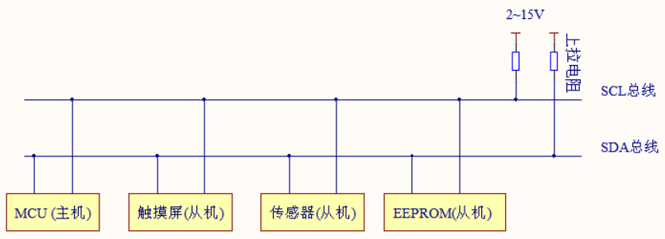
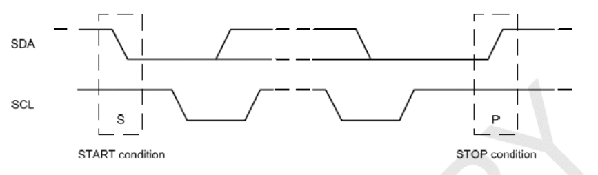
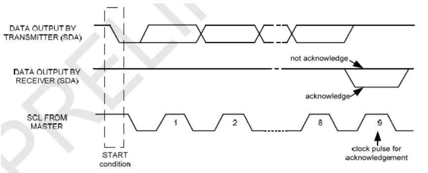
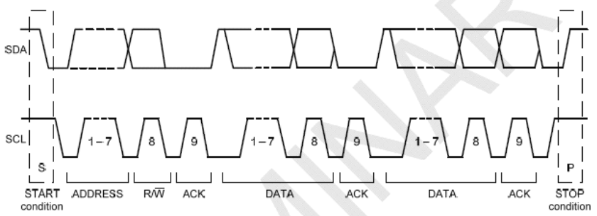
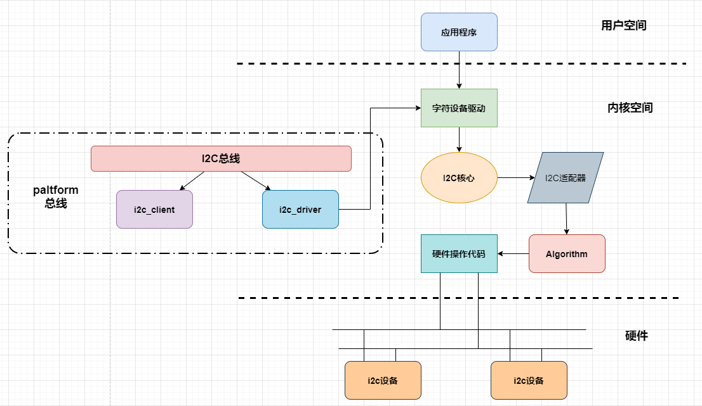
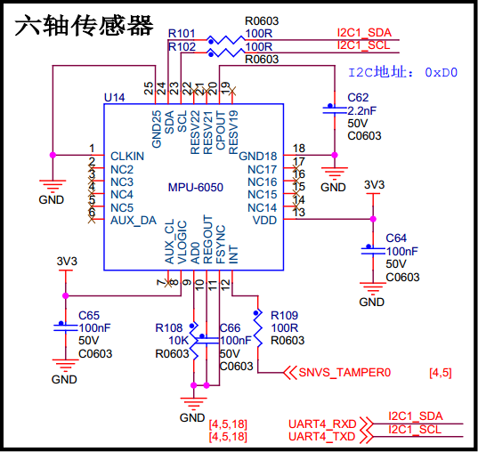

.. vim: syntax=rst

i2c_mpu6050驱动实验
=============================

本章我们以板载MPU6050为例讲解i2c驱动程序的编写，本章主要分为五部分内容。

- 第一部分，i2c基本知识，回忆i2c物理总线和基本通信协议。
- 第二部分，linux下的i2c驱动框架。
- 第三部分，i2c总线驱动代码拆解。
- 第四部分，i2c设备驱动的核心函数。
- 第五部分，MPU6050驱动以及测试程序。

i2c基本知识
~~~~~~~~~~~~~~~~~~~~~~~~~~~

i2c物理总线
^^^^^^^^^^^^^^^^^^^^^^^^^^^^^^

如上图所示，i2c支持一主多从，各设备地址独立，标准模式传输速率为100kbit/s，快速模式为400kbit/s。总线通过上拉电阻接到电源。当 I2C 设备空闲时，会输出高阻态，而当所有设备都空
闲，都输出高阻态时，由上拉电阻把总线拉成高电平。

I2C物理总线使用两条总线线路，SCL和SDA。

- SCL： 时钟线，数据收发同步
- SDA： 数据线，传输具体数据

i2c基本通信协议
^^^^^^^^^^^^^^^^^^^^^^^^^^^^^^

起始信号(S)与停止信号(P)
>>>>>>>>>>>>>>>>>>>>>

当SCL线为高电平时，SDA线由高到低的下降沿，为传输开始标志(S)。直到主设备发出结束信号(P)，
否则总线状态一直为忙。结束标志(P)为，当SCL线为高电平时，SDA线由低到高的上升沿。

数据格式与应答信号(ACK/NACK)、
>>>>>>>>>>>>>>>>>>>>>

i2c的数据字节定义为8-bits长度，对每次传送的总字节数量没有限制,但对每一次传输必须伴有一个应答(ACK)信号，
其时钟由主设备提供，而真正的应答信号由从设备发出，在时钟为高时，通过拉低并保持SDA的值来实现。如果从设备忙，
它可以使 SCL保持在低电平，这会强制使主设备进入等待状态。当从设备空闲后，并且释放时钟线，原来的数据传输才会继续。

主机与从机通信
>>>>>>>>>>>>>>>>>>>>>

开始标志(S)发出后，主设备会传送一个7位的Slave地址，并且后面跟着一个第8位，称为Read/Write位。
R/W位表示主设备是在接受从设备的数据还是在向其写数据。然后，主设备释放SDA线，等待从设备的应答信号(ACK)。
每个字节的传输都要跟随有一个应答位。应答产生时，从设备将SDA线拉低并且在SCL为高电平时保持低。
数据传输总是以停止标志（P）结束，然后释放通信线路。 然而，主设备也可以产生重复的开始信号去操作另一台从设备，
而不发出结束标志。综上可知，所有的SDA信号变化都要在SCL时钟为低电平时进行，除了开始和结束标志

i2c对mpu6050进行数据读写
>>>>>>>>>>>>>>>>>>>>>

单字节写入

连续字节写入

对MPU6050进行写操作时，主设备发出开始标志(S)和写地址(地址位加一个R/W位，0为写)。
MPU6050产生应答信号。然后主设备开始传送寄存器地址(RA)，接到应答后，开始传送寄存器数据，
然后仍然要有应答信号，连续写入多字节时依次类推。

单字节读出

连续字节读出

对MPU6050进行读操作时，主设备发出开始标志(S)和读地址(地址位加一个R/W位，1为读)。
等待MPU6050产生应答信号。然后发送寄存器地址，告诉MPU6050读哪一个寄存器。
紧接着，收到应答信号后，主设备再发一个开始信号，然后发送从设备读地址。
MPU6050产生应答信号并开始发送寄存器数据。通信以主设备产生的拒绝应答信号(NACK)和结束标志(P)结束。

学过单片机的用户对i2c协议并不陌生，这里只是简单的讲解，如果忘记可参考 **【野火®】零死角玩转STM32** 中i2c章节。

i2c驱动框架
~~~~~~~~~~~~~~~~~~~~~~~~~~~

在编写单片机裸机i2c驱动时我们需要根据i2c协议手动配置i2c控制寄存器使其能够输出起始信号、停止信号、数据信息等等。

在Linux系统中则采用了总线、设备驱动模型。我们之前讲解的平台设备也是采用了这种模型，只不过平台总线是一个虚拟的总线。

我们知道一个i2c(例如i2c1)上可以挂在多个i2c设备，例如MPU6050、i2c接口的OLED显示屏、摄像头（摄像头通过i2c接口发送控制信息）等等，
这些设备共用一个i2c，这个i2c的驱动我们称为i2c总线驱动。而对应具体的设备,例如mpu6050的驱动就是i2c设备驱动。
这样我们要使用mpu6050就需要拥有“两个驱动”一个是i2c总线驱动和mpu6050设备驱动。

- i2c总线驱动由芯片厂商提供（驱动复杂，官方提供了经过测试的驱动，我们直接用），
- mpu6050设备驱动可以从mpu6050芯片厂家那里获得（不确定有），也可以我们手动编写。

如上图所示，i2c驱动框架包括i2c总线驱动、具体某个设备的驱动。

i2c总线包括i2c设备(i2c_client)和i2c驱动(i2c_driver),
当我们向linux中注册设备或驱动的时候，按照i2c总线匹配规则进行配对，配对成功，则可以通过i2c_driver中.prob函数创建具体的设备驱动。
在现代linux中，i2c设备不再需要手动创建，而是使用设备树机制引入，设备树节点是与paltform总线相配合使用的。
所以需先对i2c总线包装一层paltform总线，当设备树节点转换为平台总线设备时，我们在进一步将其转换为i2c设备，注册到i2c总线中。

设备驱动创建成功，我们还需要实现设备的文件操作接口(file_operations),file_operations中会使用到内核中i2c核心函数(i2c系统已经实现的函数，专门开放给驱动工程师使用)。
使用这些函数会涉及到i2c适配器，也就是i2c控制器。由于ic2控制器有不同的配置，所有linux将每一个i2c控制器抽象成i2c适配器对象。
这个对象中存在一个很重要的成员变量——Algorithm，Algorithm中存在一系列函数指针，这些函数指针指向真正硬件操作代码。

关键数据结构
^^^^^^^^^^^^^^^^^^^^^^^^^^^^^^

在开始拆解i2c驱动框架的源码之前，先了解其中几个重要的对象。

**struct i2c_adapter**

i2c_适配器对应一个i2c控制器，是用于标识物理i2c总线以及访问它所需的访问算法的结构。

.. code-block:: c
    :caption: i2c_adapter结构体(内核源码/include/linux/i2c.h)
    :linenos:

    /*
     * i2c_adapter is the structure used to identify a physical i2c bus along
     * with the access algorithms necessary to access it.
     */
    struct i2c_adapter {
    	struct module *owner;
    	unsigned int class;		  /* classes to allow probing for */
    	const struct i2c_algorithm *algo; /* the algorithm to access the bus */
    	void *algo_data;
    
    	/* data fields that are valid for all devices	*/
    	struct rt_mutex bus_lock;
    
    	int timeout;			/* in jiffies */
    	int retries;
    	struct device dev;		/* the adapter device */
    
    	int nr;
    	char name[48];
    	struct completion dev_released;
    
    	struct mutex userspace_clients_lock;
    	struct list_head userspace_clients;
    
    	struct i2c_bus_recovery_info *bus_recovery_info;
    	const struct i2c_adapter_quirks *quirks;
    };

- **algo：** struct i2c_algorithm 结构体，访问总线的算法；
- **dev：** struct device 结构体，控制器，表明这是一个设备。

**struct i2c_algorithm**

i2c_算法是一类硬件解决方案的接口，这些解决方案可以使用相同的总线算法来解决，即位碰撞或PCF8584，举两种最常见的算法
structi2c_algorithm 结构体用于指定访问总线（i2c）的算法，在这里就是用于指定外部访问i2c总线的接口，这个“接口”体现到代码就是一些接口函数。
从以上代码不难看出i2c_algorithm结构体实际提供了一些函数指针，这些函数就是外部访问i2c总线的接口，更直白的说，
i2c设备例如mpu6050、i2c接口的oled屏等等就是通过这些函数接口使用i2c总线实现收、发数据的。在i2c1的总线驱动中会实现这些函数（部分函数）。

.. code-block:: c
    :caption: i2c_algorithm结构体(内核源码/include/linux/i2c.h)
    :linenos:

    struct i2c_algorithm {
    	/* If an adapter algorithm can't do I2C-level access, set master_xfer
    	   to NULL. If an adapter algorithm can do SMBus access, set
    	   smbus_xfer. If set to NULL, the SMBus protocol is simulated
    	   using common I2C messages */
    	/* master_xfer should return the number of messages successfully
    	   processed, or a negative value on error */
    	int (*master_xfer)(struct i2c_adapter *adap, struct i2c_msg *msgs,
    			   int num);
    	int (*smbus_xfer) (struct i2c_adapter *adap, u16 addr,
    			   unsigned short flags, char read_write,
    			   u8 command, int size, union i2c_smbus_data *data);
    
    	/* To determine what the adapter supports */
    	u32 (*functionality) (struct i2c_adapter *);
    
    #if IS_ENABLED(CONFIG_I2C_SLAVE)
    	int (*reg_slave)(struct i2c_client *client);
    	int (*unreg_slave)(struct i2c_client *client);
    #endif
    };

- **master_xfer：** 作为主设备时的发送函数，应该返回成功处理的消息数，或者在出错时返回负值。
- **smbus_xfer：** 作为从设备时的发送函数。

**struct i2c_client**

表示i2c从设备

.. code-block:: c
    :caption: i2c_client结构体(内核源码/include/linux/i2c.h)
    :linenos:

	struct i2c_client {
		unsigned short flags;		/* div., see below		*/
		unsigned short addr;		/* chip address - NOTE: 7bit	*/

		char name[I2C_NAME_SIZE];
		struct i2c_adapter *adapter;	/* the adapter we sit on	*/
		struct device dev;		/* the device structure		*/
		int init_irq;			/* irq set at initialization	*/
		int irq;			/* irq issued by device		*/
		struct list_head detected;
		#if IS_ENABLED(CONFIG_I2C_SLAVE)
			i2c_slave_cb_t slave_cb;	/* callback for slave mode	*/
		#endif
	};

- **flags：** :I2C_CLIENT_TEN表示设备使用10位芯片地址，I2C客户端PEC表示它使用SMBus数据包错误检查
- **addr：** addr在连接到父适配器的I2C总线上使用的地址。
- **name：** 表示设备的类型，通常是芯片名。
- **adapter：** struct i2c_adapter 结构体，管理托管这个I2C设备的总线段。
- **dev：** Driver model设备节点。
- **init_irq：** 作为从设备时的发送函数。
- **irq：** 表示该设备生成的中断号。
- **detected：** struct list_head i2c的成员_驱动程序.客户端列表或i2c核心的用户空间设备列表。
- **slave_cb：** 使用适配器的I2C从模式时回调。适配器调用它来将从属事件传递给从属驱动程序。i2c_客户端识别连接到i2c总线的单个设备（即芯片）。暴露在Linux下的行为是由管理设备的驱动程序定义的。

**struct i2c_driver**

i2c设备驱动程序

.. code-block:: c
    :caption: i2c_driver结构体(内核源码/include/linux/i2c.h)
    :linenos:

	struct i2c_driver {
		unsigned int class;

		int (*probe)(struct i2c_client *, const struct i2c_device_id *);
		int (*remove)(struct i2c_client *);

		struct device_driver driver;
		const struct i2c_device_id *id_table;

		int (*detect)(struct i2c_client *, struct i2c_board_info *);

		const unsigned short *address_list;
		struct list_head clients;

		...
	};

- **probe：** i2c设备和i2c驱动匹配后，回调该函数指针。
- **id_table：** struct i2c_device_id 要匹配的从设备信息。
- **address_list：** 设备地址
- **clients：** 设备链表
- **detect：** 设备探测函数

i2c总线驱动
~~~~~~~~~~~~~~~~~~~~~~~~~~~

i2c总线驱动由芯片厂商提供，如果我们使用NXP官方提供的Linux内核，i2c总线驱动已经保存在内核中，并且默认情况下已经编译进内核。

下面结合源码简单介绍i2c总线的运行机制。

- 1、注册I2C总线
- 2、将I2C驱动添加到I2C总线的驱动链表中
- 3、遍历I2C总线上的设备链表，根据i2c_device_match函数进行匹配，如果匹配调用i2c_device_probe函数
- 4、i2c_device_probe函数会调用I2C驱动的probe函数

**i2c总线定义**

.. code-block:: c
    :caption: i2c总线定义(内核源码/drivers/i2c/i2c-core-base.c)
    :linenos:

	struct bus_type i2c_bus_type = {
		.name		= "i2c",
		.match		= i2c_device_match,
		.probe		= i2c_device_probe,
		.remove		= i2c_device_remove,
		.shutdown	= i2c_device_shutdown,
	};

i2c总线维护着两个链表（I2C驱动、I2C设备），管理I2C设备和I2C驱动的匹配和删除等

**i2c总线注册**

linux启动之后，默认执行i2c_init。

.. code-block:: c 
	:caption: i2c总线注册(内核源码/drivers/i2c/i2c-core-base.c)
	:linenos:

	static int __init i2c_init(void)
	{
		int retval;
		...
		retval = bus_register(&i2c_bus_type);
		if (retval)
			return retval;

		is_registered = true;
		...
		retval = i2c_add_driver(&dummy_driver);
		if (retval)
			goto class_err;

		if (IS_ENABLED(CONFIG_OF_DYNAMIC))
			WARN_ON(of_reconfig_notifier_register(&i2c_of_notifier));
		if (IS_ENABLED(CONFIG_ACPI))
			WARN_ON(acpi_reconfig_notifier_register(&i2c_acpi_notifier));

		return 0;
		...
	}

- 第5行：bus_register注册总线i2c_bus_type，总线定义如上所示。
- 第11行：i2c_add_driver注册设备dummy_driver。

**i2c设备和i2c驱动匹配规则**

.. code-block:: c 
    :caption: i2c设备和i2c驱动匹配规则(内核源码/drivers/i2c/i2c-core-base.c)
    :linenos:

	static int i2c_device_match(struct device *dev, struct device_driver *drv)
	{
		struct i2c_client	*client = i2c_verify_client(dev);
		struct i2c_driver	*driver;

		/* Attempt an OF style match */
		if (i2c_of_match_device(drv->of_match_table, client))
			return 1;

		/* Then ACPI style match */
		if (acpi_driver_match_device(dev, drv))
			return 1;

		driver = to_i2c_driver(drv);

		/* Finally an I2C match */
		if (i2c_match_id(driver->id_table, client))
			return 1;

		return 0;
	}

- **of_driver_match_device：** 设备树匹配方式，比较 I2C 设备节点的 compatible 属性和 of_device_id 中的 compatible 属性
- **acpi_driver_match_device：** ACPI 匹配方式
- **i2c_match_id：** i2c总线传统匹配方式，比较 I2C设备名字和 i2c驱动的id_table->name 字段是否相等

在i2c总线驱动代码源文件中，我们只简单介绍重要的几个点，如果感兴趣可自行阅读完整的i2c驱动源码。
通常情况下，看驱动程序首先要找到驱动的入口和出口函数，驱动入口和出口位于驱动的末尾，如下所示。

.. code-block:: c 
    :caption: 驱动入口和出口函数(内核源码/drivers/i2c/busses/i2c-imx.c)
    :linenos:

    static int __init i2c_adap_imx_init(void)
    {
    	return platform_driver_register(&i2c_imx_driver);
    }
    subsys_initcall(i2c_adap_imx_init);
    
    static void __exit i2c_adap_imx_exit(void)
    {
    	platform_driver_unregister(&i2c_imx_driver);
    }
    module_exit(i2c_adap_imx_exit);

驱动入口和出口函数很简单，我们可以从中得到i2c驱动是一个平台驱动，并且我们知道平台驱动结构体是“i2c_imx_driver”，平台驱动结构体如下所示。

.. code-block:: c 
    :caption: 平台设备驱动结构体(内核源码/drivers/i2c/busses/i2c-imx.c)
    :linenos:

    static const struct of_device_id i2c_imx_dt_ids[] = {
    	{ .compatible = "fsl,imx1-i2c", .data = &imx1_i2c_hwdata, },
    	{ .compatible = "fsl,imx21-i2c", .data = &imx21_i2c_hwdata, },
    	{ .compatible = "fsl,vf610-i2c", .data = &vf610_i2c_hwdata, },
    	{ /* sentinel */ }
    };
    
    static struct platform_driver i2c_imx_driver = {
    	.probe = i2c_imx_probe,
    	.remove = i2c_imx_remove,
    	.driver	= {
    		.name = DRIVER_NAME,
    		.owner = THIS_MODULE,
    		.of_match_table = i2c_imx_dt_ids,
    		.pm = IMX_I2C_PM,
    	},
    	.id_table	= imx_i2c_devtype,
    };

- 第1-6行：是i2c驱动的匹配表，用于和设备树节点匹配，
- 第8-18行：是初始化的平台设备结构体，从这个结构体我们可以找到.prob函数，.prob函数的作用我们都很清楚，通常情况下该函数实现设备的基本初始化。

以下是.porb函数的内容。

.. code-block:: c 
    :caption: i2c驱动 .prob函数(内核源码/drivers/i2c/busses/i2c-imx.c)
    :linenos:

    static int i2c_imx_probe(struct platform_device *pdev)
    {
    	const struct of_device_id *of_id = of_match_device(i2c_imx_dt_ids,
    							   &pdev->dev);
    	struct imx_i2c_struct *i2c_imx;
    	struct resource *res;
    	struct imxi2c_platform_data *pdata = dev_get_platdata(&pdev->dev);
    	void __iomem *base;
    	int irq, ret;
    	dma_addr_t phy_addr;
    
    	dev_dbg(&pdev->dev, "<%s>\n", __func__);
    
    	irq = platform_get_irq(pdev, 0);
    	if (irq < 0) {
    		dev_err(&pdev->dev, "can't get irq number\n");
    		return irq;
    	}
    
    	res = platform_get_resource(pdev, IORESOURCE_MEM, 0);
    	base = devm_ioremap_resource(&pdev->dev, res);
    	if (IS_ERR(base))
    		return PTR_ERR(base);
    
    	phy_addr = (dma_addr_t)res->start;
    
    	i2c_imx = devm_kzalloc(&pdev->dev, sizeof(*i2c_imx), GFP_KERNEL);
    	if (!i2c_imx)
    		return -ENOMEM;
    
    	if (of_id)
    		i2c_imx->hwdata = of_id->data;
    	else
    		i2c_imx->hwdata = (struct imx_i2c_hwdata *)
    				platform_get_device_id(pdev)->driver_data;
    
    	/* Setup i2c_imx driver structure */
    	strlcpy(i2c_imx->adapter.name, pdev->name, sizeof(i2c_imx->adapter.name));
    	i2c_imx->adapter.owner		= THIS_MODULE;
    	i2c_imx->adapter.algo		= &i2c_imx_algo;
    	i2c_imx->adapter.dev.parent	= &pdev->dev;
    	i2c_imx->adapter.nr		= pdev->id;
    	i2c_imx->adapter.dev.of_node	= pdev->dev.of_node;
    	i2c_imx->base			= base;
    
    	/* Get I2C clock */
    	i2c_imx->clk = devm_clk_get(&pdev->dev, NULL);
    	if (IS_ERR(i2c_imx->clk)) {
    		dev_err(&pdev->dev, "can't get I2C clock\n");
    		return PTR_ERR(i2c_imx->clk);
    	}
    
    	ret = clk_prepare_enable(i2c_imx->clk);
    	if (ret) {
    		dev_err(&pdev->dev, "can't enable I2C clock\n");
    		return ret;
    	}
    
    	/* Request IRQ */
    	ret = devm_request_irq(&pdev->dev, irq, i2c_imx_isr,
    			       IRQF_NO_SUSPEND, pdev->name, i2c_imx);
    	if (ret) {
    		dev_err(&pdev->dev, "can't claim irq %d\n", irq);
    		goto clk_disable;
    	}
    
    	/* Init queue */
    	init_waitqueue_head(&i2c_imx->queue);
    
    	/* Set up adapter data */
    	i2c_set_adapdata(&i2c_imx->adapter, i2c_imx);
    
    	/* Set up clock divider */
    	i2c_imx->bitrate = IMX_I2C_BIT_RATE;
    	ret = of_property_read_u32(pdev->dev.of_node,
    				   "clock-frequency", &i2c_imx->bitrate);
    	if (ret < 0 && pdata && pdata->bitrate)
    		i2c_imx->bitrate = pdata->bitrate;
    
    	/* Set up chip registers to defaults */
    	imx_i2c_write_reg(i2c_imx->hwdata->i2cr_ien_opcode ^ I2CR_IEN,
    			i2c_imx, IMX_I2C_I2CR);
    	imx_i2c_write_reg(i2c_imx->hwdata->i2sr_clr_opcode, i2c_imx, IMX_I2C_I2SR);
    
    	/* Add I2C adapter */
    	ret = i2c_add_numbered_adapter(&i2c_imx->adapter);
    	if (ret < 0) {
    		dev_err(&pdev->dev, "registration failed\n");
    		goto clk_disable;
    	}
    
    	/* Set up platform driver data */
    	platform_set_drvdata(pdev, i2c_imx);
    	clk_disable_unprepare(i2c_imx->clk);
    
    	dev_dbg(&i2c_imx->adapter.dev, "claimed irq %d\n", irq);
    	dev_dbg(&i2c_imx->adapter.dev, "device resources: %pR\n", res);
    	dev_dbg(&i2c_imx->adapter.dev, "adapter name: \"%s\"\n",
    		i2c_imx->adapter.name);
    	dev_info(&i2c_imx->adapter.dev, "IMX I2C adapter registered\n");
    
    	/* Init DMA config if supported */
    	i2c_imx_dma_request(i2c_imx, phy_addr);
    
    	return 0;   /* Return OK */
    
    clk_disable:
    	clk_disable_unprepare(i2c_imx->clk);
    	return ret;
    }

- 第14-18行：获取中断号，在i2c1的设备树节点中定义了中断，这里获取得到的中断号申请中断时会用到，获取函数使用的是内核提供的函数 *platform_get_irq*。
- 第20-23行：获取reg属性，这里同样使用的是内核提供的“platform_get_resource”它实现的功能和我们使用of函数获取reg属性相同。这里的代码获取得到了i2c1的基地址，并且使用“devm_ioremap_resource”将其转化为虚拟地址。
- 第27-29行：为i2c_imx申请内存空间，我们先不关心申请函数，重点是结构体i2c_imx下面我们将重点介绍这个结构体。

.. code-block:: c 
    :caption: imx_i2c_struct结构体
    :linenos:

    struct imx_i2c_struct {
    	struct i2c_adapter	adapter;
    	struct clk		*clk;
    	void __iomem		*base;
    	wait_queue_head_t	queue;
    	unsigned long		i2csr;
    	unsigned int		disable_delay;
    	int			stopped;
    	unsigned int		ifdr; /* IMX_I2C_IFDR */
    	unsigned int		cur_clk;
    	unsigned int		bitrate;
    	const struct imx_i2c_hwdata	*hwdata;
    
    	struct imx_i2c_dma	*dma;
    };

imx_i2c_struct结构体成员较多，其中大多数是用于保存i2c硬件信息。

	- **clk：** clk结构体保存时钟相关信息
	- **bitrate：** 保存i2c的波特率
	- **dma：** struct imx_i2c_dma 结构体 dam相关信息等等。

- 第38-44行：初始化i2c_imx结构体，根据前面讲解，i2c_imx结构体内有一个imx_i2c_struct类型的结构体，在程序中它代表一个实际的i2c总线。这部分初始化代码大多数用于初始化imx_i2c_struct结构体的成员。其中我们需要特别关心“i2c_imx->adapter.algo = &i2c_imx_algo;”，它就是用于初始化“访问总线（i2c）的算法”。“i2c_imx_algo”定义如下。

.. code-block:: c 
    :caption: i2c_algorithm结构体实例i2c_imx_algo
    :linenos:

    static struct i2c_algorithm i2c_imx_algo = {
    	.master_xfer	= i2c_imx_xfer,
    	.functionality	= i2c_imx_func,
    };

i2c_imx_algo结构体内指定了两个函数，它们就是外部访问i2c总线的接口:

	- 函数i2c_imx_func只是用于返回当前所处状态。
	- 函数i2c_imx_xfer真正实现外部访问i2c总线。

i2c_imx_xfer函数定义如下（省略了具体的函数实现）。

.. code-block:: c 
    :caption: i2c_imx_xfer函数
    :linenos:

    static int i2c_imx_xfer(struct i2c_adapter *adapter, struct i2c_msg *msgs, int num)

在编写设备驱动时我们会使用“i2c_transfer”函数执行数据的传输，i2c_transfer函数最终就是调用i2c_imx_xfer函数实现具体的收发工作。
在编写设备驱动时我们会详细介绍i2c_transfer函数的用法。

- 第47-83行：完成一些基本的初始化，从上到下依次为 获取i2c的时钟、使能i2c时钟、请求中断、初始化队列、设置i2c_adapter结构体的data参数、设置i2c1的时钟分频、设置寄存器为默认值。
- 第86-90行：添加i2c adapter 。根据之前讲解，在系统中一个i2c adapter（一个i2c_adapter结构体）对应一个i2c设备，这一步就是将i2c添加到系统中。参数就是我们前面部分初始化的i2c_imx->adapter结构体。
- 第92-103行：设置平台驱动程序数据,配置DMA等。

整个.prob函数完成了两个主要工作 。第一，初始化i2c1硬件，第二，初始化一个“代表i2c1”的i2c_adapter结构体，并将其添加到系统中。

.prob函数完成了i2c的基本初始化并将其添加到了系统中。i2c总线驱动的另外一个重要工作就是实现i2c对外接口函数。
我们在初始化i2c_adapter结构体时已经初始化了*访问总线算法结构体* i2c_adapter->i2c_algorithm。
具体代码为 *i2c_imx->adapter.algo = &i2c_imx_algo* 。

在i2c_imx_algo结构体源码如下所示。

.. code-block:: c 
    :caption: i2c_imx_algo结构体
    :linenos:

    static struct i2c_algorithm i2c_imx_algo = {
    	.master_xfer	= i2c_imx_xfer,
    	.functionality	= i2c_imx_func,
    };

在i2c设备驱动程序中“i2c_transfer”函数的读、写工工作实际由i2c_imx_xfer函数完成，i2c_imx_xfer函数就是i2c总线驱动中实现具体收发工作的函数。i2c_imx_xfer部分代码如下所示。

.. code-block:: c 
    :caption: i2c_imx_xfer函数
    :linenos:

    static int i2c_imx_xfer(struct i2c_adapter *adapter, struct i2c_msg *msgs, int num)
    {
		...
    	/* read/write data */
    	for (i = 0; i < num; i++) {
    		if (i == num - 1)
    			is_lastmsg = true;
    
    		if (i) {
    			dev_dbg(&i2c_imx->adapter.dev,
    				"<%s> repeated start\n", __func__);
    			temp = imx_i2c_read_reg(i2c_imx, IMX_I2C_I2CR);
    			temp |= I2CR_RSTA;
    			imx_i2c_write_reg(temp, i2c_imx, IMX_I2C_I2CR);
    			result =  i2c_imx_bus_busy(i2c_imx, 1);
    			if (result)
    				goto fail0;
    		}
    		dev_dbg(&i2c_imx->adapter.dev,
    			"<%s> transfer message: %d\n", __func__, i);
    		/* write/read data */
			...
    		if (msgs[i].flags & I2C_M_RD)
    			result = i2c_imx_read(i2c_imx, &msgs[i], is_lastmsg);
    		else {
    			if (i2c_imx->dma && msgs[i].len >= DMA_THRESHOLD)
    				result = i2c_imx_dma_write(i2c_imx, &msgs[i]);
    			else
    				result = i2c_imx_write(i2c_imx, &msgs[i]);
    		}
    		if (result)
    			goto fail0;
    	}
		...
    }

从以上代码中可以看到i2c_imx_xfer函数会调用i2c_imx_dma_write、i2c_imx_read、
imx_i2c_write_reg等等基本收发函数实现数据的收发工作，这些基本的收发函数由i2c总线驱动实现。

至此，我们知道i2c总线驱动完成了i2c的硬件初始化、将i2c总线添加到系统、并提供外界访问i2c总线的接口函数。
我们的i2c设备驱动只需要根据特定设备使用这些接口函数即可。

i2c设备驱动核心函数
~~~~~~~~~~~~~~~~~~~~~~~~~~~

**i2c_add_adapter()**

向linux系统注册一个i2c适配器

.. code-block:: c 
    :caption: 注册一个i2c适配器 （内核源码/drivers/i2c/i2c-core-base.c）
    :linenos:

	//linux系统自动设置i2c适配器编号(adapter->nr)
	int i2c_add_adapter(struct i2c_adapter *adapter)
	//手动设置i2c适配器编号(adapter->nr)
	int i2c_add_numbered_adapter(struct i2c_adapter *adapter)

**参数：**

- **adapter：** i2c物理控制器对应的适配器

**返回值：**

- **成功：** 0
- **失败：** 负数

**i2c_add_driver()宏**

.. code-block:: c 
    :caption: 注册一个i2c驱动（内核源码/include/linux/i2c.h）
    :linenos:

	#define i2c_add_driver(driver)
	
这个宏函数的本质是调用了i2c_register_driver()函数，函数如下。

**i2c_register_driver()函数**

.. code-block:: c 
    :caption: 注册一个i2c驱动（内核源码/drivers/i2c/i2c-core-base.c）
    :linenos:

	int i2c_register_driver(struct module *owner, struct i2c_driver *driver)

**参数：**

- **owner：** 一般为 THIS_MODULE
- **driver：** 要注册的 i2c_driver.

**返回值：**

- **成功：** 0
- **失败：** 负数

**i2c_transfer()函数**

i2c_transfer()函数最终就是调用我们前面讲到的i2c_imx_xfer()函数来实现数据传输。

.. code-block:: c 
    :caption: 收发i2c消息（内核源码/drivers/i2c/i2c-core-base.c）
    :linenos:

	int i2c_transfer(struct i2c_adapter *adap, struct i2c_msg *msgs, int num)

**参数：**

- **adap ：** struct i2c_adapter 结构体，收发消息所使用的i2c适配器，i2c_client 会保存其对应的 i2c_adapter
- **msgs：** struct i2c_msg 结构体，i2c要发送的一个或多个消息
- **num ：** 消息数量，也就是msgs的数量

**返回值：**

- **成功：** 发送的msgs的数量
- **失败：** 负数

**i2c_msg结构体**

.. code-block:: c 
    :caption: 描述一个iic消息（内核源码/include/uapi/linux/i2c.h）
    :linenos:

	struct i2c_msg {
		__u16 addr;	/* slave address			*/
		__u16 flags;
		...
		__u16 len;		/* msg length				*/
		__u8 *buf;		/* pointer to msg data			*/
	};

- **addr：** iic设备地址
- **flags：** 消息传输方向和特性。I2C_M_RD：表示读取消息；0：表示发送消息。
- **len：** 消息数据的长度
- **buf：** 字符数组存放消息，作为消息的缓冲区

**i2c_master_send()函数**

.. code-block:: c 
    :caption: 发送一个i2c消息（内核源码/include/linux/i2c.h）
    :linenos:

	static inline int i2c_master_send(const struct i2c_client *client,
					const char *buf, int count)
	{
		return i2c_transfer_buffer_flags(client, (char *)buf, count, 0);
	};

**i2c_master_recv()函数**

.. code-block:: c 
    :caption: 接收一个i2c消息（内核源码/include/linux/i2c.h）
    :linenos:

	static inline int i2c_master_recv(const struct i2c_client *client,
					char *buf, int count)
	{
		return i2c_transfer_buffer_flags(client, buf, count, I2C_M_RD);
	};

**i2c_transfer_buffer_flags()函数**

.. code-block:: c 
    :caption: 发送一个i2c消息（内核源码/drivers/i2c/i2c-core-base.c）
    :linenos:

	int i2c_transfer_buffer_flags(const struct i2c_client *client, char *buf,
					int count, u16 flags)
	{
		int ret;
		struct i2c_msg msg = {
			.addr = client->addr,
			.flags = flags | (client->flags & I2C_M_TEN),
			.len = count,
			.buf = buf,
		};

		ret = i2c_transfer(client->adapter, &msg, 1);

		/*
		* If everything went ok (i.e. 1 msg transferred), return #bytes
		* transferred, else error code.
		*/
		return (ret == 1) ? count : ret;
	}

下面以mpu6050为例讲解如何编写i2c设备驱动。

mpu6050驱动实验
~~~~~~~~~~~~~~~~~~~~~~
硬件介绍
^^^^^^^^^^^^^^^^^^^^^^^^^^^^^^

本节实验使用到 EBF6ULL-PRO 开发板上的 MPU6050。

MPU6050是一款运动处理传感器，它集成了3轴MEMS陀螺仪，3轴MEMS加速度计。

硬件原理图分析
>>>>>>>>>>>>>>>>>>>>>

MPU6050是通过i2c连接到开发板的，其中传感器上的SDA和SCL连到开发板i2c1;
开发板要控制MPU6050需要先复用这两个引脚为i2c控制器引脚。

查看MPU芯片手册我们可以知道，MPU6050的slave地址为b110100X，七位字长，最低有效位X由AD0管脚上的逻辑电平决定。
从原理图上可以看到，AD0接地，则地址为b1101000，也就是0x68。

设备树
>>>>>>>>>>>>>>>>>>>>>

由上面的原理图分析，我们可以得到下面的设备树。

.. image:: ./media/i2cmpu002.png
   :align: center
   :alt: 3|

.. code-block:: c 
    :caption: mpu6050设备树插件
    :linenos:

	pinctrl_i2c1: i2c1grp {
		fsl,pins = <
			MX6UL_PAD_UART4_TX_DATA__I2C1_SCL 0x4001b8b0
			MX6UL_PAD_UART4_RX_DATA__I2C1_SDA 0x4001b8b0
		>;
	}; 

	&i2c1{
		clock-frequency = <100000>;
		pinctrl-names = "default";
		pinctrl-0 = <&pinctrl_i2c1>;
		status = "okay";
		
		i2c_mpu6050@68 {
					compatible = "fire,i2c_mpu6050";
					reg = <0x68>;
					status = "okay";
		};
	};

- 第1行： 在iomuxc子节点下面添加新的子节点pinctrl_i2c1: i2c1grp。
- 第2-5行： 在fsl,pins属性声明引脚组MX6UL_PAD_UART4_TX_DATA__I2C1_SCL和MX6UL_PAD_UART4_RX_DATA__I2C1_SDA。

- 第8行： 是在i2c1控制器下面设置i2c1属性。
- 第9行： 设置i2c1控制器的时钟频率100k。
- 第10行： 设置引脚默认状态。 
- 第11行： 设置pinctrl_i2c1为具体的引脚组。
- 第12行： 设置i2c1控制器状态为okay。

- 第13行： 添加MPU6050子节点，
- 第14行： 设置MPU6050子节点属性为fire,i2c_mpu6050，和驱动保持一致即可。
- 第15行： 设置reg属性，reg属性只需要指定MPU6050在i2c1总线上的地址，原理图分析可知为0x68。

实验代码讲解
^^^^^^^^^^^^^^^^^^^^^^^^^^^^^^

编程思路
>>>>>>>>>>>>>>>>>>>>>

i2c_mpu6050驱动实验编程思路如下：

- 分析硬件原理图，编写mpu6050的设备树插件，前面已实现。
- 编写mpu6050驱动程序，
- 编写简单测试应用程序。

mpu6050驱动实现
>>>>>>>>>>>>>>>>>>>>>

由于NXP官方已经写好了i2c的总线驱动，mpu6050这个设备驱动就变得很简单，下面结合代码介绍mpu6050设别驱动实现。

和平台设备驱动类似，pu6050驱动程序结构如下：

.. code-block:: c 
    :caption: mpu6050驱动程序结构
    :linenos:

    static int i2c_write_mpu6050(struct i2c_client *mpu6050_client, u8 address, u8 data)
    {
    	return 0;
    }
    static int i2c_read_mpu6050(struct i2c_client *mpu6050_client, u8 address, void *data, u32 length)
    {
    	return 0;
    }
    static int mpu6050_init(void)
    {
    	return 0;
    }
    
    /*字符设备操作函数集，open函数实现*/
    static int mpu6050_open(struct inode *inode, struct file *filp)
    {
    	return 0;
    }
    /*字符设备操作函数集，.read函数实现*/
    static ssize_t mpu6050_read(struct file *filp, char __user *buf, size_t cnt, loff_t *off)
    {
    	return 0;
    }
    /*字符设备操作函数集，.release函数实现*/
    static int mpu6050_release(struct inode *inode, struct file *filp)
    {
    	return 0;
    }
    /*字符设备操作函数集*/
    static struct file_operations mpu6050_chr_dev_fops =
    	{
    		.owner = THIS_MODULE,
    		.open = mpu6050_open,
    		.read = mpu6050_read,
    		.release = mpu6050_release,
    };
    
    /*i2c总线设备函数集*/
    static int mpu6050_probe(struct i2c_client *client, const struct i2c_device_id *id)
    {
    	return 0;
    }
    static int mpu6050_remove(struct i2c_client *client)
    {
    	/*删除设备*/
    	return 0;
    }
    
    /*定义i2c总线设备结构体*/
    struct i2c_driver mpu6050_driver = {
    	.probe = mpu6050_probe,
    	.remove = mpu6050_remove,
    	.id_table = gtp_device_id,
    };
    
    /*
     * 驱动初始化函数
     */
    static int __init mpu6050_driver_init(void)
    {
    	return 0;
    }
    
    /*
     * 驱动注销函数
     */
    static void __exit mpu6050_driver_exit(void)
    {
    
    }
    
    module_init(mpu6050_driver_init);
    module_exit(mpu6050_driver_exit);
    
    MODULE_LICENSE("GPL");

驱动程序可分为如下四部分内容（从下往上看）：

- 第49-73行： 定义i2c总线设备结构体并实现i2c总线设备的注册和注销函数，在这里就是程驱动程序的入口和出口函数。
- 第38-47行： 实现i2c总线设备结构体中定义的操作函数，主要是.prob匹配函数，在.prob函数中添加、注册一个字符设备，这个字符设备用于实现mpu6050的具体功能。
- 第14-36行： 定义并实现字符设备操作函数集。在应用程序中的open、read操作传到内核后就是执行这些函数，所以他们要真正实现对mpu6050的初始化以及读取转换结果。
- 第1-12行： 具体的读、写mpu6050的函数，它们被第三部分的函数调用，用户自行定义。

下面我们将按照这四部分内容介绍mpu6050设备驱动程序实现。

驱动入口和出口函数实现
------------------------------

驱动入口和出口函数仅仅用于注册、注销i2c设备驱动，代码如下：

.. code-block:: c 
    :caption: mpu6050驱动入口和出口函数实现(base_code/I2c_MPU6050/i2c_mpu6050.c)
    :linenos:

    /*定义ID 匹配表*/
    static const struct i2c_device_id gtp_device_id[] = {
    	{"fire,i2c_mpu6050", 0},
    	{}};

    /*定义设备树匹配表*/
    static const struct of_device_id mpu6050_of_match_table[] = {
    	{.compatible = "fire,i2c_mpu6050"},
    	{/* sentinel */}};

    /*定义i2c设备结构体*/
    struct i2c_driver mpu6050_driver = {
    	.probe = mpu6050_probe,
    	.remove = mpu6050_remove,
    	.id_table = gtp_device_id,
    	.driver = {
    		.name = "fire,i2c_mpu6050",
    		.owner = THIS_MODULE,
    		.of_match_table = mpu6050_of_match_table,
    	},
    };

    /*
    *驱动初始化函数
    */
    static int __init mpu6050_driver_init(void)
    {
    	int ret;
    	pr_info("mpu6050_driver_init\n");
    	ret = i2c_add_driver(&mpu6050_driver);
    	return ret;
    }
    
    /*
    *驱动注销函数
    */
    static void __exit mpu6050_driver_exit(void)
    {
    	pr_info("mpu6050_driver_exit\n");
    	i2c_del_driver(&mpu6050_driver);
    }
    
    module_init(mpu6050_driver_init);
    module_exit(mpu6050_driver_exit);
    
    MODULE_LICENSE("GPL");

- 第1-9行： 定义设备树匹配表。
- 第13-14行： .probe和.remove，它们是i2c设备的操作函数，.prob函数在匹配成功后会执行,设备注销之前.remove函数会执行，稍后我们会实现这两个函数。
- 第12-21行： 定义的i2c设备驱动结构体mpu6050_driver，和我们之前学习的平台设备驱动类似，一个“结构体”代表了一个设备。结构体内主要成员介绍如下， “.id_table”和“.of_match_table”，它们用于和匹配设备树节点，具体实现如代码如第二行、第七行。
- 第26-41行： 就是我们常说的驱动入口和出口函数。在入口函数内我们调用“i2c_add_driver”函数添加一个i2c设备驱动。在出口函数内调用“i2c_del_driver”函数删除一个i2c设备驱动。它们的参数都只有一个i2c设备驱动结构体。

.prob函数和.remove函数实现
------------------------------

通常情况下.prob用于实现一些初始化工作，.remove用于实现退出之前的清理工作。
mpu6050需要初始化的内容很少，我们放到了字符设备的.open函数中实现.prob函数只需要添加、注册一个字符设备即可。
程序源码如下所示：

.. code-block:: c 
    :caption: mpu6050驱动.prob和.remove函数实现(base_code/I2c_MPU6050/i2c_mpu6050.c)
    :linenos:

    static int mpu6050_probe(struct i2c_client *client, const struct i2c_device_id *id)
    {
    	int ret = -1; //保存错误状态码
    	printk(KERN_EMERG "\t  match successed  \n");
    	//采用动态分配的方式，获取设备编号，次设备号为0 
    	ret = alloc_chrdev_region(&mpu6050_devno, 0, DEV_CNT, DEV_NAME);
    	if (ret < 0)
    	{
    		printk("fail to alloc mpu6050_devno\n");
    		goto alloc_err;
    	}
    	...
    }
    
    
    static int mpu6050_remove(struct i2c_client *client)
    {
    	/*删除设备*/
    	device_destroy(class_mpu6050, mpu6050_devno);	  //清除设备
    	class_destroy(class_mpu6050);					  //清除类
    	cdev_del(&mpu6050_chr_dev);						  //清除设备号
    	unregister_chrdev_region(mpu6050_devno, DEV_CNT); //取消注册字符设备
    	return 0;
    }

- .prob函数仅仅注册了一个字符设备，注册字符设备已经在之前的驱动程序中多次使用，这里不再赘述。
- .remove函数工作是注销字符设备。

实现字符设备操作函数集
------------------------------

在.prob函数中添加了一个字符设备，mpu6050的初始化以及转换结果的读取都在这个字符设备的操作函数中实现，
其中最主要是.open 和.read函数。下面是这两个函数的实现。

.open函数实现(我们在.open函数中配置mpu6050)，具体代码如下：

.. code-block:: c 
    :caption: open函数实现(base_code/I2c_MPU6050/i2c_mpu6050.c)
    :linenos:

    /*字符设备操作函数集，open函数实现*/
    static int mpu6050_open(struct inode *inode, struct file *filp)
    {
    	// printk("\n mpu6050_open \n");
    	/*向 mpu6050 发送配置数据，让mpu6050处于正常工作状态*/
    	mpu6050_init();
    	return 0;
    }
    
    /*初始化i2c
     *返回值，成功，返回0。失败，返回 -1
     */
    static int mpu6050_init(void)
    {
    	int error = 0;
    	/*配置mpu6050*/
    	error += i2c_write_mpu6050(mpu6050_client, PWR_MGMT_1, 0X00);
    	error += i2c_write_mpu6050(mpu6050_client, SMPLRT_DIV, 0X07);
    	error += i2c_write_mpu6050(mpu6050_client, CONFIG, 0X06);
    	error += i2c_write_mpu6050(mpu6050_client, ACCEL_CONFIG, 0X01);
    
    	if (error < 0)
    	{
    		/*初始化错误*/
    		printk(KERN_DEBUG "\n mpu6050_init error \n");
    		return -1;
    	}
    	return 0;
    }
    
    
    /*通过i2c 向mpu6050写入数据
     *mpu6050_client：mpu6050的i2c_client结构体。
     *address, 数据要写入的地址，
     *data, 要写入的数据
     *返回值，错误，-1。成功，0  
     */
    static int i2c_write_mpu6050(struct i2c_client *mpu6050_client, u8 address, u8 data)
    {
    	int error = 0;
    	u8 write_data[2];
    	struct i2c_msg send_msg; //要发送的数据结构体
    
    	/*设置要发送的数据*/
    	write_data[0] = address;
    	write_data[1] = data;
    
    	/*发送 iic要写入的地址 reg*/
    	send_msg.addr = mpu6050_client->addr; //mpu6050在 iic 总线上的地址
    	send_msg.flags = 0;					  //标记为发送数据
    	send_msg.buf = write_data;			  //写入的首地址
    	send_msg.len = 2;					  //reg长度
    
    	/*执行发送*/
    	error = i2c_transfer(mpu6050_client->adapter, &send_msg, 1);
    	if (error != 1)
    	{
    		printk(KERN_DEBUG "\n i2c_transfer error \n");
    		return -1;
    	}
    	return 0;
    }

- 第2行： 在.open函数中仅仅调用了我们自己编写的mpu6050_init函数。
- 第13-29行： 调用i2c_write_mpu6050函数向mpu6050发送控制参数，控制参数可参考芯片手册，我们重点讲解函数i2c_write_mpu6050实现。

- 第33行： 参数mpu6050_client是i2c_client类型的结构体，填入mpu6050设备对应的i2c_client结构体即可。
- 第34行： 参数address，用于设置要写入的地址这个地址是要写入mpu6050的内部地址。
- 第35行： 参数data, 指定要写入的数据。
- 第42行： 定义struct i2c_msg结构体，用来装要发送数据。
- 第45-46行： 写入数据时要先发送写入的地址然后发送要写入的数据，这里用长度为二的数组保存地址和数据
- 第49-52： i2c_msg结构体填入总线上的地址，标记发送数据，首地址，以及reg长度。

- 第55行： i2c_write_mpu6050函数，该函数是对i2c_transfer函数的封装，而i2c_transfer是系统提供的i2c设备驱动发送函数，根据之前讲解这个函数最终会调用i2c总线驱动里的函数，最终由i2c总线驱动执行收、发工作。我们这里要做的就是按照规定的格式编写要发送的数据。

mpu6050_read函数源码如下所示。

.. code-block:: c 
    :caption:  .read函数实现 (base_code/I2c_MPU6050/i2c_mpu6050.c)
    :linenos:

    /*字符设备操作函数集，.read函数实现*/
    static ssize_t mpu6050_read(struct file *filp, char __user *buf, size_t cnt, loff_t *off)
    {
    
    	char data_H;
    	char data_L;
    	int error;
    	short mpu6050_result[6]; //保存mpu6050转换得到的原始数据
    	
    	i2c_read_mpu6050(mpu6050_client, ACCEL_XOUT_H, &data_H, 1);
    	i2c_read_mpu6050(mpu6050_client, ACCEL_XOUT_L, &data_L, 1);
    	mpu6050_result[0] = data_H << 8;
    	mpu6050_result[0] += data_L;
    
    	i2c_read_mpu6050(mpu6050_client, ACCEL_YOUT_H, &data_H, 1);
    	i2c_read_mpu6050(mpu6050_client, ACCEL_YOUT_L, &data_L, 1);
    	mpu6050_result[1] = data_H << 8;
        mpu6050_result[1] += data_L;
    
    	i2c_read_mpu6050(mpu6050_client, ACCEL_ZOUT_H, &data_H, 1);
    	i2c_read_mpu6050(mpu6050_client, ACCEL_ZOUT_L, &data_L, 1);
    	mpu6050_result[2] = data_H << 8;
    	mpu6050_result[2] += data_L;
    
    	i2c_read_mpu6050(mpu6050_client, GYRO_XOUT_H, &data_H, 1);
    	i2c_read_mpu6050(mpu6050_client, GYRO_XOUT_L, &data_L, 1);
    	mpu6050_result[3] = data_H << 8;
    	mpu6050_result[3] += data_L;
    
    	i2c_read_mpu6050(mpu6050_client, GYRO_YOUT_H, &data_H, 1);
    	i2c_read_mpu6050(mpu6050_client, GYRO_YOUT_L, &data_L, 1);
    	mpu6050_result[4] = data_H << 8;
    	mpu6050_result[4] += data_L;
    
    	i2c_read_mpu6050(mpu6050_client, GYRO_ZOUT_H, &data_H, 1);
    	i2c_read_mpu6050(mpu6050_client, GYRO_ZOUT_L, &data_L, 1);
    	mpu6050_result[5] = data_H << 8;
    	mpu6050_result[5] += data_L;
    
    	/*将读取得到的数据拷贝到用户空间*/
    	error = copy_to_user(buf, mpu6050_result, cnt);
    
    	if(error != 0)
    	{
    		printk("copy_to_user error!");
    		return -1;
    	}
    	return 0;
    }

.read函数很简单，大致分为如下两部分，重点是i2c_read_mpu6050函数的实现。

- 第10-38行： 调用i2c_read_mpu6050函数读取mpu6050转换结果。
- 第41行： 调用copy_to_user函数将转换得到的数据拷贝到用户空间。

.. code-block:: c 
    :caption:  i2c_read_mpu6050函数实现 (base_code/I2c_MPU6050/i2c_mpu6050.c)
    :linenos:

    static int i2c_read_mpu6050(struct i2c_client *mpu6050_client, u8 address, void *data, u32 length)
    {
    	int error = 0;
    	u8 address_data = address;
    	struct i2c_msg mpu6050_msg[2];
    
    	/*设置读取位置i2c_msg*/
    	mpu6050_msg[0].addr = mpu6050_client->addr; //mpu6050在 iic 总线上的地址
    	mpu6050_msg[0].flags = 0;					//标记为发送数据
    	mpu6050_msg[0].buf = &address_data;			//写入的首地址
    	mpu6050_msg[0].len = 1;						//写入长度
    
    	/*读取i2c_msg*/
    	mpu6050_msg[1].addr = mpu6050_client->addr; //mpu6050在 iic 总线上的地址
    	mpu6050_msg[1].flags = I2C_M_RD;			//标记为读取数据
    	mpu6050_msg[1].buf = data;					//读取得到的数据保存位置
    	mpu6050_msg[1].len = length;				//读取长度
    
    	error = i2c_transfer(mpu6050_client->adapter, mpu6050_msg, 2);
    
    	if (error != 2)
    	{
    		printk(KERN_DEBUG "\n i2c_read_mpu6050 error \n");
    		return -1;
    	}
    	return 0;
    }

它与我们之前讲解的i2c_write_mpu6050函数很相似，结合源码介绍如下：

- 第1行： 参数mpu6050_client是i2c_client类型的结构体，填入mpu6050设备对应的i2c_client结构体即可。参数address，用于设置要读取的地址这个地址是要读取的mpu6050的内部地址。参数data,保存读取得到的数据。参数length，指定去取长度，单位字节。
- 第3-5行： 定义的一些变量，其中i2c_msg结构体，读取工作与写入不同，读取时需要先写入要读取的地址然后再执行读取。
- 第8-17行： 初始化i2c_msg结构体。这里初始化了两个，第一个是写入要读取的地址，第二个执行读取，特别注意的是第一个i2c_msg结构体的flags设置为0（或者I2C_M_RD \| I2C_M_REV_DIR_ADDR），第二个i2c_msg结构体的flags设置为1（或者I2C_M_RD）。
- 第19行： 和i2c_write_mpu6050()函数相同，调用i2c_transfer函数，最终由i2c总线驱动执行收、发工作。

mpu6050测试应用程序实现
>>>>>>>>>>>>>>>>>>>>>

这里编写一个简单地测试应用程序测试驱动是否正常，很简单，只需要打开、读取、打印即可。测试代码如下所示。

.. code-block:: c 
    :caption:  mpu6050测试程序
    :linenos:

    #include <stdio.h>
    #include <unistd.h>
    #include <fcntl.h>
    #include <string.h>
    #include <stdlib.h>
    int main(int argc, char *argv[])
    {
        short resive_data[6];
        printf("led_tiny test\n");
    
        /*打开文件*/
        int fd = open("/dev/I2C1_mpu6050", O_RDWR);
        if(fd < 0)
        {
    		printf("open file : %s failed !\n", argv[0]);
    		return -1;
    	}

        /*读取数据*/
        int error = read(fd,resive_data,12);
        if(error < 0)
        {
            printf("write file error! \n");
            close(fd);
            /*判断是否关闭成功*/
        }

        printf("AX=%d, AY=%d, AZ=%d ",(int)resive_data[0],(int)resive_data[1],(int)resive_data[2]);
    	printf("GX=%d, GY=%d, GZ=%d \n \n",(int)resive_data[3],(int)resive_data[4],(int)resive_data[5]);
    
        /*关闭文件*/
        error = close(fd);
        if(error < 0)
        {
            printf("close file error! \n");
        }
        
        return 0;
    }

- 第8行： 保存收到的 mpu6050转换结果数据，依次为 AX(x轴角度), AY, AZ 。GX(x轴加速度), GY ,GZ
- 第12-17行： 打开MPU6050设备文件。
- 第20-29行： 读取传感器是并打印

测试应用程序很简单，我们不过多介绍，只说明一点，在驱动的.read函数中我们每次读取了6050的AX, AY, AZ ，GX, GY ,GZ共六个short类型数据，在应用程序中每次读取也要读这么多。

实验准备
^^^^^^^^^^^^^^^^^^^^^^^^^^^^^^
编译设备树
>>>>>>>>>>>>>>>>>>>>>
将 **base_code/I2c_MPU6050/imx6ull-seeed-npi.dts** 拷贝到 **内核源码/arch/arm/boot/dts/**

如下命令编译设备树：

   make ARCH=arm CROSS_COMPILE=arm-linux-gnueabihf- npi_v7_defconfig
   
   make ARCH=arm -j4 CROSS_COMPILE=arm-linux-gnueabihf- dtbs

编译成功后生成的设备树文件（.dtb）位于源码目录下的 *内核源码/arch/arm/boot/dts*，
开发板适配的设备树文件名为 *imx6ull-seeed-npi.dtb*。

编译驱动程序和应用程序
>>>>>>>>>>>>>>>>>>>>>

将 **base_code/I2c_MPU6050/** 拷贝到内核源码同级目录，执行里面的MakeFile，生成i2c_mpu6050.ko和6050_test_app

.. image:: ./media/i2cmpu005.png
   :align: center
   :alt: 5|

程序运行结果
^^^^^^^^^^^^^^^^^^^^^^^^^^^^^^

加载设备树
>>>>>>>>>>>>>>>>>>>>>

通过SCP或NFS将编译好的设备树拷贝到开发板上。替换掉原来的设备树文件 **/boot/dtbs/4.19.71-imx-r1/imx6ull-seeed-npi.dtb** 。

除此以外还需要将开发板上其他i2c设备屏蔽，打开/boot/目录下的uEnv.txt文件，屏蔽如下内容。

.. image:: ./media/i2cmpu003.png
   :align: center
   :alt: 5|

重启开发板。

测试效果
>>>>>>>>>>>>>>>>>>>>>

加载i2c_mpu6050.ko，拿起开发板，运行6050_test_app即可看到如下效果。

.. image:: ./media/i2cmpu004.png
   :align: center
   :alt: 5|

注意：这里采集的是原始数据，所以波动较大是正常的。
