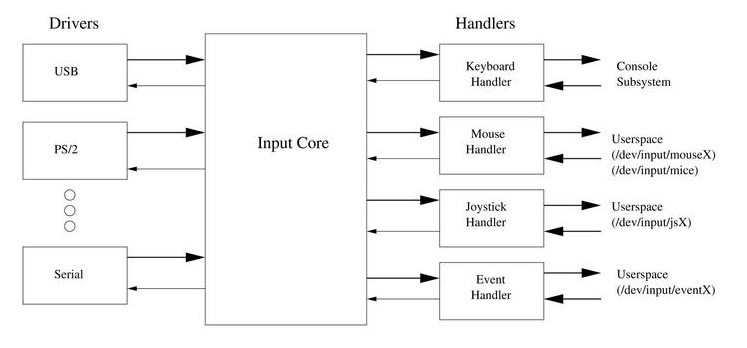
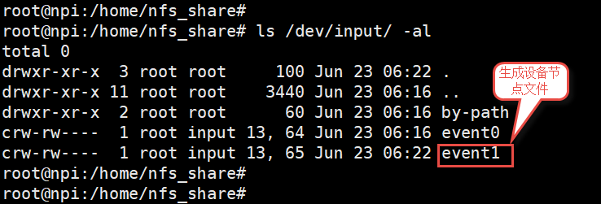
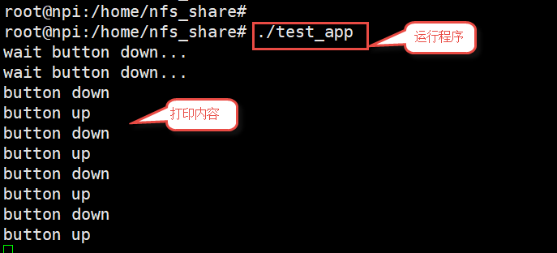

.. vim: syntax=rst

输入子系统
-----

计算机的输入设备繁多，有按键、鼠标、键盘、触摸屏、游戏手柄等等，Linux内核为了能够将所有的输入设备进行统一的管理，
设计了输入子系统。为上层应用提供了统一的抽象层，各个输入设备的驱动程序只需上报产生的输入事件即可。

下面以按键中断为例讲解输入子系统的使用。
本章配套源码和设备树插件位于“ **~/embed_linux_tutorial/base_code/input_sub_system** ”目录下。

输入子系统简介
~~~~~~~

linux为了统一各个输入设备，将输入子系统分为了Drivers（驱动层）、Input Core（输入子系统核心层）、
handlers（事件处理层）三部分。

- Drivers主要实现对硬件设备的读写访问，设置中断，并将硬件产生的事件转为Input Core定义的规范提交给Handlers;
- Input Core起到承上启下的作用，为Drivers提供了规范及接口，并通知Handlers对事件进行处理;
- Handlers并不涉及硬件方面的具体操作，是一个纯软件层，包含了不同的解决方案，如按键、键盘、鼠标、游戏手柄等。

最终所有输入设备的输入信息将被抽象成以下结构体：

.. code-block:: c 
    :caption: struct input_event结构体(内核源码\include\uapi\linux\input.h)
    :linenos:

    //输入事件
    struct input_event{
    	struct timeval time;   //事件产生的时间
    	__u16 type;            //输入设备的类型，鼠标、键盘、触摸屏
    	__u16 code;            
    	__s16 value;           
    }

- **time** ：事件产生的时间。
- **type** ：输入设备的类型。
- **code** ：根据设备类型的不同而含义不同，如果设备类型是按键，code表示为按键值(如第几个按键等)。
- **value**：根据设备类型的不同而含义不同。如果设备类型是按键，value表示的是松开或者按下。

本章目的想要编写一个基于输入子系统和中断的按键驱动程序，重点在于了解Input Core为我们提供了哪些接口，并了解如何将
按键信息以事件上报。

input子系统Input Core实现代码是“ **~/drivers/input/input.c** ”以及“ **~/include/linux/input.h** ”两个文件，
实现了一些API，通过这些API就可以实现输入事件的注册、初始化、上报、注销等等工作。
由于这两个文件内容较多，我们重点介绍常用的API函数，至于驱动的具体实现，我们简单了解即可。

input.c模块入口函数和出口函数
^^^^^^^

打开input子系统内核实现代码，在源码的最后找到驱动的入口和出口函数如下所示。

.. code-block:: c 
    :caption: input子系统内核实现入口和出口函数(内核源码/drivers/input/input.c)
    :linenos:

    static int __init input_init(void)
    {
    	int err;
    
    /*-------------第一部分-----------------*/
    	err = class_register(&input_class);
    	if (err) {
    		pr_err("unable to register input_dev class\n");
    		return err;
    	}
    
    /*-------------第二部分-----------------*/
    	err = input_proc_init();
    	if (err)
    		goto fail1;
    
    /*-------------第三部分-----------------*/
    	err = register_chrdev_region(MKDEV(INPUT_MAJOR, 0),
    				     INPUT_MAX_CHAR_DEVICES, "input");
    	if (err) {
    		pr_err("unable to register char major %d", INPUT_MAJOR);
    		goto fail2;
    	}
    
    	return 0;
    
     fail2:	input_proc_exit();
     fail1:	class_unregister(&input_class);
    	return err;
    }
    
    static void __exit input_exit(void)
    {
    	input_proc_exit();
    	unregister_chrdev_region(MKDEV(INPUT_MAJOR, 0),
    				 INPUT_MAX_CHAR_DEVICES);
    	class_unregister(&input_class);
    }
    
    subsys_initcall(input_init);
    module_exit(input_exit);

结合以上源码介绍如下：

- 代码第6行：在/sys/class下创建input的类
- 代码第13行：在/proc下面建立相关的文件
- 代码18-19行：注册一个字符设备，从参数“MKDEV(INPUT_MAJOR,0)”我们可以知道，
  input子系统内核驱动使用的是主设备号为INPUT_MAJOR（13）的字符设备。
  参数INPUT_MAX_CHAR_DEVICES（1024）创建次设备数量。我们在使用输入子系统时每注册一个“输入事件”就会占用一个次设备号，
  INPUT_MAX_CHAR_DEVICES决定最多支持1024个输入事件。
- 代码32-38行：驱动出口函数，在退出函数中注销设备以及注册的类。

input_dev结构体
^^^^^^^^^^^^

在输入子系统中input_dev代表一个具体的输入设备，后面将会根据具体的设备来初始化这个结构体，结构体成员介绍如下：
（input_dev参数很多，有些不需要我们手动配置，所以这里只列出、介绍常用的参数，完整内容位于input.h文件）。

.. code-block:: c 
    :caption: input_dev结构体(内核源码/drivers/input/input.h)
    :linenos:

    struct input_dev {
    	const char *name;  //设备名
    	const char *phys;  
    	const char *uniq;
    	struct input_id id; //输入设备ID
    
    	unsigned long propbit[BITS_TO_LONGS(INPUT_PROP_CNT)];
    
    	unsigned long evbit[BITS_TO_LONGS(EV_CNT)];  //指定设备支持的事件类型
    	unsigned long keybit[BITS_TO_LONGS(KEY_CNT)]; //记录支持的键值
    	unsigned long relbit[BITS_TO_LONGS(REL_CNT)]; //记录支持的相对坐标位图
    	unsigned long absbit[BITS_TO_LONGS(ABS_CNT)]; //记录支持的绝对坐标位图
    
        /*-----------以下内容省略----------------*/
    };

结构体成员中最重要的是evbit、keybit、relbit等数组，这些数组设置了设备输入事件的类型和键值。
参数evbit用于指定支持的事件类型，这要根据实际输入设备能够产生的事件来选择，可选选项如下所示。

.. code-block:: c 
    :caption: 输入子系统事件类型(内核源码\include\uapi\linux\input-event-codes.h)
    :linenos:

    #define EV_SYN			0x00 //同步事件
    #define EV_KEY			0x01 //用于描述键盘、按钮或其他类似按键的设备。
    #define EV_REL			0x02 //用于描述相对位置变化，例如鼠标移动
    #define EV_ABS			0x03 //用于描述绝对位置变化，例如触摸屏的触点坐标
    #define EV_MSC			0x04 //其他事件类型
    #define EV_SW			0x05 //用于描述二进制开关类型的设备，例如拨码开关。
    #define EV_LED			0x11
    #define EV_SND			0x12
    #define EV_REP			0x14
    #define EV_FF			0x15
    #define EV_PWR			0x16
    #define EV_FF_STATUS	0x17
    #define EV_MAX			0x1f
    #define EV_CNT			(EV_MAX+1)

以上代码只介绍了几个我们常用的事件类型，
完整的介绍可以参考内核源码目录下的“ **~/ Documentation/input/ event-codes.txt** ”内核文档。
很明显，我们本章要使用的按键的事件类型属于EV_KEY。

参数keybit，记录支持的键值，“键值”在程序中用于区分不同的按键，可选“减值”如下所示。

.. code-block:: c 
    :caption: 输入子系统---按键键值(内核源码\include\uapi\linux\input-event-codes.h)
    :linenos:

    #define KEY_RESERVED		0
    #define KEY_ESC			1
    #define KEY_1			2
    #define KEY_2			3
    #define KEY_3			4
    #define KEY_4			5
    /*-----------以下内容省略-------------*/

可以看出“键值”就是一些数字。只要实际设备与按键对应即可。例如本章的按键可以使用KEY_1、也可以使用KEY_4等。

参数relbit、absbit…。这两个参数和上面的keybit都和参数evbit有关，如果evbit中只选择了EV_KEY，
那么我们就不需要设置relbit（相对坐标）和absbit（绝对坐标）以及后面省略的内容。这些内容使用到时再具体介绍。

总之，input_dev结构体成员很多，但是对应到一个具体的输入设备，只需要设置自己用到的其中一两个属性。

input_dev结构体的申请和释放
^^^^^^^^^^^^^^^^^^

根据之前讲解input_dev结构体代表了一个输入设备，它实际会占输入子系统的一个次设备号。使用input_dev结构之前要向系统申请，
不使用时需要释放。input子系统提供了申请和释放函数，如下所示。

.. code-block:: c 
    :caption: input_dev申请函数(内核源码\drivers\input\input.c)
    :linenos:

    struct input_dev *input_allocate_device(void)

**参数：** **无**

**返回值：**

- **成功：** struct input_dev类型指针
- **失败：** NULL

.. code-block:: c 
    :caption: input_dev释放函数(内核源码\drivers\input\input.c)
    :linenos:

    void input_free_device(struct input_dev *dev)

**参数：** **dev**：struct input_dev类型指针

**返回值：** **无**

申请和释放函数都比较简单。申请函数input_allocate_device执行成功后会返回申请得到的input_dev结构体的地址，
如果失败，返回NULL。释放函数input_free_device只有一个参数dev，用于指定要释放的input_dev结构体。

注册和注销input_dev结构体
^^^^^^^^^^^^^^^^^

input_dev申请成功后，我们需要根据自己的实际输入设备配置input_dev结构体，
配置完成后还要使用注册和注销函数将input_dev注册到输入子系统。注册和注销函数如下：

.. code-block:: c 
    :caption: input_dev注册函数(内核源码\drivers\input\input.c)
    :linenos:

    int input_register_device(struct input_dev *dev)

**参数：** **dev**：struct input_dev类型指针
**返回值：**

- **成功：** 0
- **失败：** 返回非0值

input_register_device函数将输入设备（input_dev）注册到输入子系统的核心层。
该函数使用需要注意以下几点

- 使用该函数注册的input_dev必须是使用input_allocate_device函数申请得到的。
- 注册之前需要根据实际输入设备配置好input_dev结构体。
- 如果注册失败必须调用input_free_device函数释放input_dev结构体。
- 如果注册成功，在函数退出时只需要使用input_unregister_device函数注销input_dev结构体不需要再调用。
  input_free_device函数释放input_dev结构体。

.. code-block:: c 
    :caption: input_dev注销函数(内核源码\drivers\input\input.c)
    :linenos:

    void input_unregister_device(struct input_dev *dev)

**参数：** **dev**：struct input_dev类型指针
**返回值：** **无**

input_unregister_device是注销函数，输入子系统的资源是有限的，不使用是应当注销。和刚刚说的那样，
调用input_unregister_device注销函数之后就不必调用input_free_device函数释放input_dev。

上报事件函数和上报结束函数
^^^^^^^^^^^^^

以按键为例，按键按下后需要使用上报函数向输入子系统核心层上报按键事件，并且上报后还要发送上报结束信息。函数定义如下所示。

.. code-block:: c 
    :caption: 上报事件、以及发送上报结束事件(内核源码\drivers\input\input.h)
    :linenos:

    void input_event(struct input_dev *dev, unsigned int type, unsigned int code, int value);
    static inline void input_sync(struct input_dev *dev)
    {
    	input_event(dev, EV_SYN, SYN_REPORT, 0);
    }
    
    static inline void input_report_key(struct input_dev *dev, unsigned int code, int value)
    {
    	input_event(dev, EV_KEY, code, !!value);
    }

input_event函数用于上报事件，共有4个参数介绍如下。

- 参数dev，指定输设备（input_dev结构体）。
- 参数type，事件类型。我们在根据实际输入设备配置input_dev结构体时会设置input_dev-> evbit参数，
  用于设置输入设备能够产生的事件类型（可能是多个）。上报事件时要从“能够产生”的这些事件类型中选择。
- 参数code，编码。以按键为例，按键的编码就是我们设置的按键键值。
- 参数value，指定事件的值。

函数input_sync用于发送同步信号，表示上报结束。

输入子系统实验
~~~~~~~

本小节一按键为例介绍输入子系统的具体使用方法。本实验在上一章“中断实验”基础上完成。结合源码介绍如下。

设备树插件实现
^^^^^^^

设备树插件与上一章的“按键中断实验”使用的设备树插件几乎相同，我们只需要将中断类型修改为“上升和下降沿触发”。
修改部分如下所示。

.. code-block:: c 
    :caption: 设备树插件修改
    :linenos:

    /*----------------修改前---------------*/
    status = "okay";            
    interrupt-parent = <&gpio5>;
    interrupts = <1 IRQ_TYPE_EDGE_RISING>;     // 指定中断，触发方式为上升沿触发。
    
    /*----------------修改后---------------*/
    status = "okay";            
    interrupt-parent = <&gpio5>;
    interrupts = <1 IRQ_TYPE_EDGE_BOTH>;     // 指定中断，触发方式为上升、下降沿触发。

驱动程序实现
^^^^^^

驱动入口函数
''''''

驱动入口函数如下所示。

.. code-block:: c 
    :caption: 驱动入口函数
    :linenos:

    static int __init button_driver_init(void)
    {
    
    	int error;
    	printk(KERN_ERR "button_driver_init \n");
    
    	/*-----------第一部分-------------*/
    	/*获取按键 设备树节点*/
    	button_device_node = of_find_node_by_path("/button_interrupt");
    	if (NULL == button_device_node)
    	{
    		printk(KERN_ERR "of_find_node_by_path error!");
    		return -1;
    	}
    
    	/*获取按键使用的GPIO*/
    	button_GPIO_number = of_get_named_gpio(button_device_node, "button_gpio", 0);
    	if (0 == button_GPIO_number)
    	{
    		printk(KERN_ERR"of_get_named_gpio error");
    		return -1;
    	}
    
    	/*申请GPIO  , 记得释放*/
    	error = gpio_request(button_GPIO_number, "button_gpio");
    	if (error < 0)
    	{
    		printk(KERN_ERR "gpio_request error");
    		gpio_free(button_GPIO_number);
    		return -1;
    	}
    
    	error = gpio_direction_input(button_GPIO_number); //设置引脚为输入模式
    
    
    	/*获取中断号*/
    	interrupt_number = irq_of_parse_and_map(button_device_node, 0);
    	printk(KERN_ERR "\n interrupt_number =  %d \n", interrupt_number);
    
    	/*申请中断, 记得释放*/
    	error = request_irq(interrupt_number, button_irq_hander, IRQF_TRIGGER_RISING | IRQF_TRIGGER_FALLING, "button_interrupt", NULL);
    	if (error != 0)
    	{
    		printk(KERN_ERR "request_irq error");
    		gpio_free(button_GPIO_number);
    		free_irq(interrupt_number, NULL);
    		return -1;
    	}
    
    	/*-----------第二部分-------------*/
    	/*申请输入子系统结构体*/
    	button_input_dev = input_allocate_device();
    	if (NULL == button_input_dev)
    	{
    		printk(KERN_ERR "input_allocate_device error");
    		return -1;
    	}
    	button_input_dev->name = BUTTON_NAME;
    
    	/*-----------第三部分-------------*/
    	/*设置要使用的输入事件类型*/
    	button_input_dev->evbit[0] = BIT_MASK(EV_KEY);
    	input_set_capability(button_input_dev, EV_KEY, KEY_1); //标记设备能够触发的事件
    
    	/*-----------第四部分-------------*/
    	/*注册输入设备*/
    	error = input_register_device(button_input_dev);
    	if (0 != error)
    	{
    		printk(KERN_ERR "input_register_device error");
    		gpio_free(button_GPIO_number);
    		free_irq(interrupt_number, NULL);
    		input_unregister_device(button_input_dev);
    		return -1;
    	}
    	return 0;
    }

驱动入口函数完成基本的初始化工作，结合代码各部分介绍如下：

第一部分，这部分和“中断实验”相同，依次执行获取设备树节点、获取GPIO、申请GPIO、获取中断号、申请中断，
需要注意的是这里中断类型为“上升和下降沿触发”。

第二部分，申请输入子系统结构体，申请得到的input_dev结构体代表了一个输入设备，下面要根据实际的输入设备设置这个结构体。

第三部分，设置输入事件类型。input_dev参数很多，其中最主要的是事件类型和事件对应的code。evbit每一位代表了一种事件类型，
为1则表示支持，0表示不支持。例如我们这里要支持“按键”事件，那么就要将EV_KEY（等于0x01）位置1。
内核提供了帮助宏BIT_MASK帮助我们开启某一“事件”。

设置支持的事件类型之后还要设置与之对应的“事件值”，内核文档中称为code。以按键为例，就是为按键选择键值
（在程序中通过键值区分不同的按键），input_dev->keybit参数用于选择键值，例如在驱动中有6个按键，那么就要使能6个键值，
同样input_dev->keybit每一位代表一个键值，我们可以直接设置某一位使能对应的键值，
不过内核提供了很多帮助宏或函数帮助我们设置键值（也可用于设置其他类型事件的code），
我们在程序中使用的是input_set_capability函数，原型如下：

.. code-block:: c 
    :caption: code设置函数(内核源码\drivers\input\input.c)
    :linenos:

    void input_set_capability(struct input_dev *dev, unsigned int type, unsigned int code)
    {
    	switch (type) {
    	case EV_KEY:
    		__set_bit(code, dev->keybit);
    		break;
    
    	case EV_REL:
    		__set_bit(code, dev->relbit);
    		break;
    
    	case EV_ABS:
    		input_alloc_absinfo(dev);
    		if (!dev->absinfo)
    			return;
    
    		__set_bit(code, dev->absbit);
    		break;
    
    	case EV_MSC:
    		__set_bit(code, dev->mscbit);
    		break;
    
    	case EV_SW:
    		__set_bit(code, dev->swbit);
    		break;
    
    	case EV_LED:
    		__set_bit(code, dev->ledbit);
    		break;
    
    	case EV_SND:
    		__set_bit(code, dev->sndbit);
    		break;
    
    	case EV_FF:
    		__set_bit(code, dev->ffbit);
    		break;
    
    	case EV_PWR:
    		/* do nothing */
    		break;
    
    	default:
    		pr_err("input_set_capability: unknown type %u (code %u)\n",
    		       type, code);
    		dump_stack();
    		return;
    	}
    
    	__set_bit(type, dev->evbit);
    }

参数dev指定要设置的input_dev结构体，也就是要设置的输入设备，参数type设置输入类型，可以看到，
函数实现中根据type设置不同的input_dev结构体参数。例如type =EV_KEY，那么设置的是input_dev->keybit，也就是键值。
参数code,不同类型的输入信号含义不同，如果是按键，则表示的是要设置的按键的键值。

回到驱动入口函数。

第四部分，注册输入设备。注册成功后，输入设备被添加到输入子系统内核层，系统能够接受来自该设备的输入事件。
需要注意的是如果注册失败需要注销之前申请的资源然后退出。

驱动出口函数
''''''

出口函数主要完成驱动退出前的清理工作，很简单，代码如下：

.. code-block:: c 
    :caption: 驱动出口函数
    :linenos:

    static void __exit button_driver_exit(void)
    {
    	pr_info("button_driver_exit\n");
    
    	/*释放申请的引脚,和中断*/
    	gpio_free(button_GPIO_number);
    	free_irq(interrupt_number, NULL);
    	
    	/*释放输入子系统相关内容*/
    	input_unregister_device(button_input_dev);
    }
    

出口函数中的函数我们已经介绍，这里不再赘述。

中断服务函数
''''''

中断服务函数中我们读取按键输入引脚的状态判断按键是按下还是松开。代码如下所示。

.. code-block:: c 
    :caption: 按键中断处理函数
    :linenos:

    static irqreturn_t button_irq_hander(int irq, void *dev_id)
    {
    	int button_satus = 0;
    
    	/*-----------第一部分-------------*/
    	/*读取按键引脚的电平，根据读取得到的结果输入按键状态*/
    	button_satus = gpio_get_value(button_GPIO_number);
    	if(0 == button_satus)
    	{
    		/*-----------第二部分-------------*/
    		input_report_key(button_input_dev, KEY_1, 0);
    		input_sync(button_input_dev);
    	}
    	else
    	{
    		input_report_key(button_input_dev, KEY_1, 1);
    		input_sync(button_input_dev);
    	}
    	
    	return IRQ_HANDLED;
    }

结合以上代码介绍如下，第一部分，读取按键对应引脚的电平。第二部分，根据按键引脚状态向系统上报按键事件。

测试应用程序实现
^^^^^^^^

测试应用程序中读取按键键值，打印按键状态。具体代码如下所示。

.. code-block:: c 
    :caption: 测试应用程序实现
    :linenos:

    struct input_event button_input_event;
    
    int main(int argc, char *argv[])
    {
        int error = -20;
    
        /*打开文件*/
        int fd = open("/dev/input/event1", O_RDONLY);
        if (fd < 0)
        {
            printf("open file : /dev/input/event1 error!\n");
            return -1;
        }
    
        printf("wait button down... \n");
        printf("wait button down... \n");
    
        do
        {
            /*读取按键状态*/
            error = read(fd, &button_input_event, sizeof(button_input_event));
            if (error < 0)
            {
                printf("read file error! \n");
            }
            /*判断并打印按键状态*/
            if((button_input_event.type == 1) && (button_input_event.code == 2))
            {
                if(button_input_event.value == 0)
                {
                    printf("button up\n");
                }
                else if(button_input_event.value == 1)
                {
                     printf("button down\n");
                }
            }
        } while (1);
    
        printf("button Down !\n");
    
        /*关闭文件*/
        error = close(fd);
        if (error < 0)
        {
            printf("close file error! \n");
        }
        return 0;
    }

测试应用程序非常简单，基本是按照打开文件、读取状态、判断状态并打印状态。测试应用程序很简单，这里不再介绍。
需要注意的是，read是阻塞读取的，意思是没有读取到上报输入事件则一直等待。

下载验证
^^^^

编译驱动和应用程序并拷贝到开发板。使用insmod命令加载驱动，如下所示：

.. image:: ./media/inputs002.png
   :align: center
   :alt: 2

此时会在“/dev/input”目录下生成设备节点文件。

驱动加载成功后直接运行测试应用程序命令“./test_app”.测试程序运行后等待按键按下，此时按下开发板的“KEY”按键，
终端会输出按键状态，如下所示。

.. |inputs002| image:: media\inputs002.png
   :width: 5.76806in
   :height: 2.00417in
.. |inputs003| image:: media\inputs003.png
   :width: 5.76806in
   :height: 1.96181in
.. |inputs004| image:: media\inputs004.png
   :width: 5.76806in
   :height: 2.61944in
