.. vim: syntax=rst

Linux的设备模型
==================
到目前为止，我们已经接触了如何编写内核模块以及简单的字符设备驱动了，算是半只脚踏进Linux的大门了。
但着这会这些内容，还远远不够。通过前面两章的学习，我们发现，Linux的驱动代码不能够让我们随心所欲地写，它都具有一定的“套路”，
比如某个函数负责初始化，某个函数负责注册设备等等。虽然如此，但是却也给我们带来了极大的便利。我们可以不需要关心内核是如何工作的，
只需要编写好我们的驱动文件，然后加载进内核，这样就可以使我们的设备开始工作，当然啦，前提肯定是驱动是正确无误。因此，在Linux开发驱动，
只要能够掌握了这些“套路”，开发一个驱动便不是难事。当然，我们不提倡自己从零开始写一个设备驱动，在内核源码的drivers中存放了大量的设备驱动代码，
说不定可以在这些目录找到想要的驱动代码，如图所示：

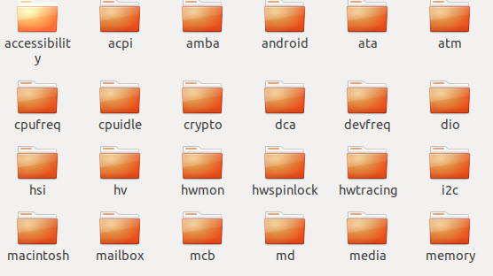

本章节，我们主要讲解Linux的设备模型，在旧版本的Linux代码中，内核无法知道：当前系统中存在什么设备、各个设备的电源管理方式、设备挂载在哪个总线上等信息。
为此，Linux2.6版本开始提出了Linux设备模型（Linux device model），该设备模型通过几个数据结构来反映当前系统中总线、设备以及驱动的工作状况，提出了以下几个重要概念：

- 设备(device)：挂载在某个总线的物理设备；
- 驱动(driver)：与特定设备相关的软件，负责初始化该设备以及提供一些操作该设备的操作方式；
- 总线（bus)：负责管理挂载对应总线的设备以及驱动；
- 类(class)：对于具有相同功能的设备，归结到一种类别，进行分类管理；

无论以后学习平台设备驱动、块设备驱动或者是其他总线设备，都跟Linux设备模型息息相关。此外，关于Linux设备模型与sysfs的关系，在讲解Linux文件目录结构时，提到过sysfs文件系统，该文件系统用于把内核的设备驱动导出到用户空间，用户便可通过访问sys目录及其下的文件，来查看甚至控制内核的一些驱动设备。
学完本章的内容，我们也可以将我们驱动的某个控制变量，导出到用户空间。

总线
~~~~
总线是连接处理器和设备之间的桥梁，我们接触到的设备大部分是依靠总线来进行通信的，它们之间的物理连接如图所示，对于野火开发板而言，触摸芯片是依赖于I2C，鼠标、键盘等HID设备，
则是依赖于USB。从功能上讲，这些设备都是将文字、字符、控制命令或采集的数据等信息输入到计算机。

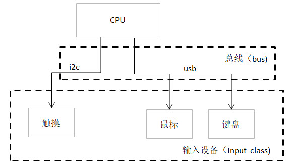

总线驱动则负责实现总线的各种行为，其管理着两个链表，分别是添加到该总线的设备链表以及注册到该总线的驱动链表。当你向总线添加（移除）一个设备（驱动）时，便会在对应的列表上添加新的节点，
同时对挂载在该总线的驱动以及设备进行匹配，在匹配过程中会忽略掉那些已经有驱动匹配的设备。

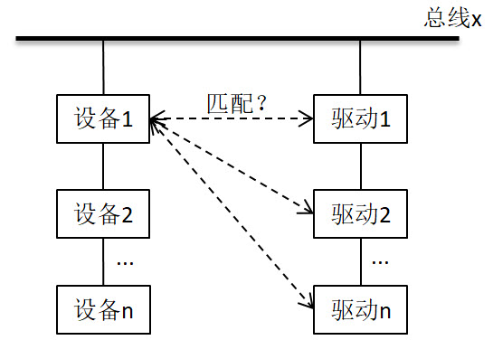

在内核中使用结构体bus_type来表示总线，如下所示：

.. code-block:: c 
    :caption: bus_type结构体（内核源码/include/linux/device.h）
    :linenos:

    struct bus_type {
	const char		*name;
	const struct attribute_group **bus_groups;
	const struct attribute_group **dev_groups;
	const struct attribute_group **drv_groups;

	int (*match)(struct device *dev, struct device_driver *drv);
	int (*uevent)(struct device *dev, struct kobj_uevent_env *env);
	int (*probe)(struct device *dev);
	int (*remove)(struct device *dev);

	int (*suspend)(struct device *dev, pm_message_t state);
	int (*resume)(struct device *dev);

	const struct dev_pm_ops *pm;

	struct subsys_private *p;

    };

- name : 指定总线的名称，当新注册一种总线类型时，会在/sys/bus目录创建一个新的目录，目录名就是该参数的值；
- drv_groups 、dev_groups 、bus_groups: 分别表示驱动、设备以及总线的属性。这些属性可以是内部变量、字符串等等。通常会对应的/sys目录下在以文件的形式存在，对于驱动而言，在目录/sys/bus/<bus-name>/driver/<driver-name>存放了设备的默认属性；设备则在目录/sys/bus/<bus-name>/devices/<driver-name>中。这些文件一般是可读写的，用户可以通过读写操作来获取和设置这些attribute的值。
- match : 当向总线注册一个新的设备或者是新的驱动时，会调用该回调函数。该回调函数主要负责判断是否有注册了的驱动适合新的设备，或者新的驱动能否驱动总线上已注册但没有驱动匹配的设备；
- uevent：总线上的设备发生添加、移除或者其它动作时，就会调用该函数，来通知驱动做出相应的对策。
- probe : 当总线将设备以及驱动相匹配之后，执行该回调函数,最终会调用驱动提供的probe函数。
- remove : 当设备从总线移除时，调用该回调函数；
- suspend、resume : 电源管理的相关函数，当总线进入睡眠模式时，会调用suspend回调函数；而resume回调函数则是在唤醒总线的状态下执行；
- pm : 电源管理的结构体，存放了一系列跟总线电源管理有关的函数，与device_driver结构体中的pm_ops有关；
- p：该结构体用于存放特定的私有数据，其成员klist_devices和klist_drivers记录了挂载在该总线的设备和驱动；

Linux内核已经为我们写好了大部分总线驱动，我们一般不会去注册一个新的总线，内核中提供了bus_register函数来注册总线，以及bus_unregister函数来注销总线，其函数原型如下：

.. code-block:: c 
    :caption: 注册/注销总线API（内核源码/drivers/base/bus.c）
    :linenos: 

    int bus_register(struct bus_type *bus);
    void bus_unregister(struct bus_type *bus);

当我们成功注册总线时，会在/sys/bus/目录下创建一个新目录，目录名为我们新注册的总线名。bus目录中包含了当前系统中已经注册了的所有总线，例如i2c，spi，platform等。我们看到每个总线目录都拥有两个子目录devices和drivers，
分别记录着挂载在该总线的所有设备以及驱动。

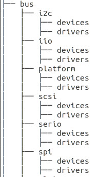

设备
~~~~
驱动开发的过程中，我们最关心的莫过于设备以及对应的驱动了。我们编写驱动的目的，最终就是为了使设备可以正常工作。在Linux中，一切都是以文件的形式存在，
设备也不例外。/sys/devices目录记录了系统中所有设备，实际上在sys目录下所有设备文件最终都会指向该目录对应的设备文件；此外还有另一个目录/sys/dev记录所有的设备节点，
但实际上都是些链接文件，同样指向了devices目录下的文件。

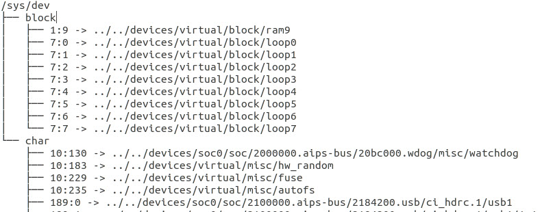

在内核使用device结构体来描述我们的物理设备，如下所示，

.. code-block:: c 
	:caption: device结构体(内核源码/include/linux/device.h）
	:linenos:

	struct device {
        const char *init_name;
		struct device		*parent;
		struct bus_type	*bus;		
		struct device_driver *driver;	
		void		*platform_data;	
		void		*driver_data;	
		struct device_node	*of_node; 
		dev_t			devt;	
		struct class		*class;
        void (*release)(struct device *dev);
		const struct attribute_group **groups;	/* optional groups */
	};	

- init_name：指定该设备的名称，总线匹配时，一般会根据比较名字，来进行配对；
- parent：表示该设备的父对象，前面提到过，旧版本的设备之间没有任何关联，引入Linux设备模型之后，设备之间呈树状结构，便于管理各种设备；
- bus：表示该设备依赖于哪个总线，当我们注册设备时，内核便会将该设备注册到对应的总线。
- of_node：存放设备树中匹配的设备节点。当内核使能设备树，总线负责将驱动的of_match_table以及设备树的compatible属性进行比较之后，将匹配的节点保存到该变量。
- platform_data：特定设备的私有数据，通常定义在板级文件中；
- driver_data：同上，驱动层可通过dev_set/get_drvdata函数来获取该成员；
- class：指向了该设备对应类，开篇我们提到的触摸，鼠标以及键盘等设备，对于计算机而言，他们都具有相同的功能，都归属于输入设备。我们可以在/sys/class目录下对应的类找到该设备，如input、leds、pwm等目录;
- dev：dev_t类型变量，字符设备章节提及过，它是用于标识设备的设备号，该变量主要用于向/sys目录中导出对应的设备。
- release：回调函数，当设备被注销时，会调用该函数。如果我们没定义该函数时，移除设备时，会提示“Device 'xxxx' does not have a release() function, it is broken and must be fixed”的错误。
- group：指向struct attribute_group类型的指针，指定该设备的属性；

内核也提供相关的API来注册和注销设备，如下所示：

.. code-block:: c 
    :caption: 内核注册/注销设备(内核源码/driver/base/core.c）
    :linenos: 

    int device_register(struct device *dev);
    void device_unregister(struct device *dev);

在讲解总线的时候，我们说过，当成功注册总线时，会在/sys/bus目录下创建对应总线的目录，该目录下有两个子目录，分别是drivers和devices，
我们使用device_register注册的设备从属于某个总线时，该总线的devices目录下便会存在该设备文件。

驱动
~~~~
前面两小节，已经大致介绍完总线以及设备。设备能否正常工作，取决于驱动。驱动需要告诉内核，
自己可以驱动哪些设备，如何初始化设备。在内核中，使用device_driver结构体来描述我们的驱动，如下所示：

.. code-block:: c 
	:caption: device_driver结构体(内核源码/include/linux/device.h）
	:linenos:

	struct device_driver {
		const char		*name;
		struct bus_type		*bus;

		struct module		*owner;
		const char		*mod_name;	/* used for built-in modules */

		bool suppress_bind_attrs;	/* disables bind/unbind via sysfs */

		const struct of_device_id	*of_match_table;
		const struct acpi_device_id	*acpi_match_table;

		int (*probe) (struct device *dev);
		int (*remove) (struct device *dev);

		const struct attribute_group **groups;
	};	

- name：指定驱动名称，总线进行匹配时，利用该成员与设备名进行比较；
- bus：表示该驱动依赖于哪个总线，内核需要保证在驱动执行之前，对应的总线能够正常工作；
- suppress_bind_attrs：布尔量，用于指定是否通过sysfs导出bind与unbind文件，bind与unbind文件是驱动用于绑定/解绑关联的设备。
- owner：表示该驱动的拥有者，一般设置为THIS_MODULE；
- of_match_table：指定该驱动支持的设备类型。当内核使能设备树时，会利用该成员与设备树中的compatible属性进行比较。
- remove：当设备从操作系统中拔出或者是系统重启时，会调用该回调函数；
- probe：当驱动以及设备匹配后，会执行该回调函数，对设备进行初始化。通常的代码，都是以main函数开始执行的，但是在内核的驱动代码，都是从probe函数开始的。
- group：指向struct attribute_group类型的指针，指定该驱动的属性；

内核提供了driver_register函数以及driver_unregister函数来注册/注销驱动，成功注册的驱动会记录在/sys/bus/<bus>/drivers目录，
函数原型如下所示：

.. code-block:: c 
    :caption: device_driver结构体(内核源码/include/linux/device.h）
    :linenos: 

    int driver_register(struct device_driver *drv);
    void driver_unregister(struct device_driver *drv);

attribute属性文件
~~~~~~~~~~~~
/sys目录有各种子目录以及文件，前面讲过当我们注册新的总线、设备或驱动时，内核会在对应的地方创建一个新的目录，目录名为各自结构体的name成员，
每个子目录下的文件，都是内核导出到用户空间，用于控制我们的设备的。内核中以attribute结构体来描述/sys目录下的文件，如下所示：

.. code-block:: c 
    :caption: struct attribute结构体（内核源码/include/linux/sysfs.h)
    :linenos:

    struct attribute {
        const char		*name;
        umode_t			mode;        
    };

- name：指定文件的文件名；
- mode：指定文件的权限，

bus_type、device、device_driver结构体中都包含了一种数据类型struct attribute_group，如下所示，它是多个attribute文件的集合，
利用它进行初始化，可以避免一个个注册attribute。

.. code-block:: c 
    :caption: struct attribute_group结构体（内核源码/include/linux/sysfs.h)
    :linenos:

    struct attribute_group {
        const char		*name;
        umode_t			(*is_visible)(struct kobject *,
                            struct attribute *, int);
        struct attribute	**attrs;
        struct bin_attribute	**bin_attrs;
    };

设备属性文件
------------
在开发单片机的时候，如果想要读取某个寄存器的值，你可能需要加入一些新的代码，并重新编译。但对于Linux内核来讲，每次都需要编译一遍源码，
实在太浪费时间和精力了。为此，Linux提供以下接口，来注册和注销一个设备属性文件。我们可以通过这些接口直接在用户层进行查询/修改，避免了重新编译内核的麻烦。

.. code-block:: c 
    :caption: 设备属性文件接口（内核源码/include/linux/device.h)
    :linenos:

    struct device_attribute {
        struct attribute	attr;
        ssize_t (*show)(struct device *dev, struct device_attribute *attr,
                char *buf);
        ssize_t (*store)(struct device *dev, struct device_attribute *attr,
                const char *buf, size_t count);
    };

    #define DEVICE_ATTR(_name, _mode, _show, _store) \
	    struct device_attribute dev_attr_##_name = __ATTR(_name, _mode, _show, _store)
    extern int device_create_file(struct device *device,
                    const struct device_attribute *entry);
    extern void device_remove_file(struct device *dev,
                    const struct device_attribute *attr);   

DEVICE_ATTR宏定义用于定义一个device_attribute类型的变量，##表示将##左右两边的标签拼接在一起，因此，我们得到变量的名称应该是带有dev_attr_前缀的。
该宏定义需要传入四个参数_name，_mode，_show，_store，分别代表了文件名，文件权限，show回调函数，store回调函数。show回调函数以及store回调函数分别对应着用户层的cat和echo命令，
当我们使用cat命令，来获取/sys目录下某个文件时，最终会执行show回调函数；使用echo命令，则会执行store回调函数。
参数_mode的值，可以使用S_IRUSR、S_IWUSR、S_IXUSR等宏定义，更多选项可以查看读写文件章节关于文件权限的内容。

device_create_file函数用于创建文件，它有两个参数成员，第一个参数表示的是设备，前面讲解device结构体时，其成员中有个bus_type变量，
用于指定设备挂载在某个总线上，并且会在总线的devices子目录创建一个属于该设备的目录，device参数可以理解为在哪个设备目录下，创建设备文件。
第二个参数则是我们自己定义的device_attribute类型变量。

device_remove_file函数用于删除文件，当我们的驱动注销时，对应目录以及文件都需要被移除。
其参数和device_create_file函数的参数是一样，这里就不进行解释。

驱动属性文件
------------
驱动属性文件，和设备属性文件的作用是一样，唯一的区别在于函数参数的不同，函数接口如下：

.. code-block:: c 
    :caption: 驱动属性文件接口（内核源码/include/linux/device.h)
    :linenos:

    struct driver_attribute {
        struct attribute attr;
        ssize_t (*show)(struct device_driver *driver, char *buf);
        ssize_t (*store)(struct device_driver *driver, const char *buf,
                size_t count);
    };

    #define DRIVER_ATTR_RW(_name) \
        struct driver_attribute driver_attr_##_name = __ATTR_RW(_name)
    #define DRIVER_ATTR_RO(_name) \
        struct driver_attribute driver_attr_##_name = __ATTR_RO(_name)
    #define DRIVER_ATTR_WO(_name) \
        struct driver_attribute driver_attr_##_name = __ATTR_WO(_name)
        
    extern int __must_check driver_create_file(struct device_driver *driver,
					const struct driver_attribute *attr);
    extern void driver_remove_file(struct device_driver *driver,
                    const struct driver_attribute *attr);

DRIVER_ATTR_RW、DRIVER_ATTR_RO以及DRIVER_ATTR_WO宏定义用于定义一个driver_attribute类型的变量，带有driver_attr_的前缀，区别在于文件权限不同，RW后缀表示文件可读写，RO后缀表示文件仅可读，
WO后缀表示文件仅可写。而且你会发现，DRIVER_ATTR类型的宏定义没有参数来设置show和store回调函数，那如何设置这两个参数呢？在写驱动代码时，只需要你提供xxx_store以及xxx_show这两个函数，
并确保两个函数的xxx和DRIVER_ATTR类型的宏定义中名字是一致的即可。

driver_create_file和driver_remove_file函数用于创建和移除文件，使用driver_create_file函数，会在/sys/bus/<bus-name>/drivers/<driver-name>/目录下创建文件。

总线属性文件
-----------
同样的，Linux也为总线通过了相应的函数接口，如下所示：

.. code-block:: c 
    :caption: 总线属性文件接口（内核源码/include/linux/device.h)
    :linenos:

    struct bus_attribute {
        struct attribute	attr;
        ssize_t (*show)(struct bus_type *bus, char *buf);
        ssize_t (*store)(struct bus_type *bus, const char *buf, size_t count);
    };
    #define BUS_ATTR(_name, _mode, _show, _store)	\
	    struct bus_attribute bus_attr_##_name = __ATTR(_name, _mode, _show, _store)
    extern int __must_check bus_create_file(struct bus_type *,
                        struct bus_attribute *);
    extern void bus_remove_file(struct bus_type *, struct bus_attribute *);

BUS_ATTR宏定义用于定义一个bus_attribute变量，使用bus_create_file函数，会在/sys/bus/<bus-name>下创建对应的文件。
bus_remove_file则用于移除该文件。

实验
~~~~~~~~
下面，我们利用前面学到的理论知识，来创建一个虚拟的总线xbus，分别挂载了驱动xdrv以及设备xdev。

Makefile
------
工欲善其事必先利其器，在开始写程序之前，我们需要先准备好我们的Makefile。针对当前开发板使用的是debian的镜像，那么我们便可以直接在开发板上进行编译，
前提是板子上已经安装了gcc以及make工具。

.. code-block:: makefile
    :caption: 定义bus_type结构体（xbus.c)
    :linenos:

	NATIVE ?= true

	ifeq ($(NATIVE), false)
		KERNEL_DIR = /home/embedfire/linux4.19
	else
		KERNEL_DIR = /lib/modules/$(shell uname -r)/build
	endif

	obj-m := xdev.o xbus.o xdrv.o

	all:modules
	modules clean:
		$(MAKE) -C $(KERNEL_DIR) M=$(shell pwd) $@

我们通过变量NATIVE来控制我们的编译环境，该Makefile默认设置是在开发板进行编译，对于想要在PC机进行交叉编译的读者，需要指定变量KERNEL_DIR为自己内核源码的路径，
再执行命令“make NATIVE=false”，完成编译。

总线
--------

定义新的总线
^^^^^^^^^^^^^^^^^^^^^

.. code-block:: c 
    :caption: 定义bus_type结构体（xbus.c)
    :linenos:

    int xbus_match(struct device *dev, struct device_driver *drv)
    {
        printk("%s-%s\n",__FILE__, __func__);
        if(!strncmp(dev_name(dev), drv->name, strlen(drv->name))){
            printk("dev & drv match\n");
            return 1;	
        }
        return 0;
    }

    static struct bus_type xbus = {
        .name = "xbus",
        .match = xbus_match,
    };
    EXPORT_SYMBOL(xbus);

代码中定义了一种新的总线，名为xbus，总线结构体中最重要的一个成员，便是match回调函数，这个函数负责总线下的设备以及驱动匹配，
没有这个函数，设备与驱动便不可以进行匹配。这里，我们使用字符串比较的方式，通过对比驱动以及设备的名字来确定是否匹配，如果相同，
则说明匹配成功，返回1；反之，则返回0。

导出总线属性文件
^^^^^^^^^^^^^^^^^^^^^
我们通过BUS_ATTR宏，将我们自定义的变量导出到/sys目录，方便用户查询。

.. code-block:: c 
    :caption: 定义bus_type结构体（xbus.c)
    :linenos:

    static char *bus_name = "xbus";

    ssize_t xbus_test_show(struct bus_type *bus, char *buf)
    {
        return sprintf(buf, "%s\n", bus_name);
    }

    BUS_ATTR(xbus_test, S_IRUSR, xbus_test_show, NULL);

代码中，定义了一个bus_name变量，存放了该总线的名字，并且提供show回调函数，这样用户便可以通过cat命令，
来查询总线的名称，并且设置该文件的文件权限为文件拥有者可读，组内成员以及其他成员不可操作。

注册总线
^^^^^^^^^^^^^^^^^^^^^
内核的驱动代码，都是基于内核模块，我们在模块初始化的函数中注册总线，在模块注销的函数中注销该总线。

.. code-block:: c 
    :caption: 模块初始化以及注销函数（xbus.c)
    :linenos:

    static __init int xbus_init(void)
    {
        printk("xbus init\n");
        
        bus_register(&xbus);
        bus_create_file(&xbus, &bus_attr_xbus_test);
        return 0;
    }
    module_init(xbus_init);

    static __exit void xbus_exit(void)
    {
        printk("xbus exit\n");
        bus_remove_file(&xbus, &bus_attr_xbus_test);
        bus_unregister(&xbus);
    }
    module_exit(xbus_exit);

    MODULE_AUTHOR("embedfire");
    MODULE_LICENSE("GPL");

这样的代码，就完成了总线的注册，当我们成功加载该内核模块时，内核便会出现一种新的总线xbus,如图所示：

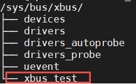

我们可以看到，总线的devices和drivers目录都是空的，并没有什么设备和驱动挂载在该总线下。红框处便是我们自定义的总线属性文件，当我们执行命令"cat    xbus_test"时，可以看到终端上会打印一行字符串：xbus。

设备
--------
Linux设备模型中，总线已经注册好了，还缺少设备和驱动。注册一个新的设备，主要完成这两个工作：一个是名字，
这是总相匹配的依据；另一个就是总线，该设备挂载在哪个总线上，不能张冠李戴。

这里，我们注册一个设备xdev，并且定义一个变量id，将该变量导出到用户空间，使得用户可以通过sysfs文件系统来修改该变量的值。

定义新的设备
^^^^^^^^^^^^^^^^^^^^^

.. code-block:: c 
    :caption: 定义device结构体（xdev.c)
    :linenos:

    extern struct bus_type xbus;

    void xdev_release(struct device *dev)
    {
        printk("%s-%s\n", __FILE__, __func__);
    }

    static struct device xdev = {
        .init_name = "xdev",
        .bus = &xbus,
        .release = xdev_release,
    };

代码中，定义了一个名为xdev的设备，其挂载在xbus上，这里写了一个release函数，防止卸载模块时会报错。相对于注册总线来说，
还是相对比较简单。

导出设备属性文件
^^^^^^^^^^^^^^^^^^^^^

.. code-block:: c 
    :caption: 定义设备属性文件（xdev.c)
    :linenos:

    unsigned long id = 0;
    ssize_t xdev_id_show(struct device *dev, struct device_attribute *attr,
                    char *buf)
    {
        return sprintf(buf, "%d\n", id);
    }

    ssize_t xdev_id_store(struct device *dev, struct device_attribute *attr,
                    const char *buf, size_t count)
    {
        kstrtoul(buf, 10, &id);
        return count;  	
    }

    DEVICE_ATTR(xdev_id, S_IRUSR|S_IWUSR, xdev_id_show, xdev_id_store);

使用DEVICE_ATTR宏定义定义了xdev_id，并且设置该文件的文件权限是文件拥有者可读可写，组内成员以及其他成员不可操作。
show回调函数中，直接将id的值通过sprintf函数拷贝至buf中。store回调函数则是利用kstrtoul函数，该函数有三个参数，其中第二个参数是采用几进制的方式，
这里我们传入的是10，意味着buf中的内容将转换为10进制的数传递给id，实现了通过sysfs修改驱动的目的。

注册设备
^^^^^^^^^^^^^^^^^^^^^
最后，只需要调用device_register函数以及device_create_file函数，将上面的设备结构体以及属性文件结构体注册到内核即可。

.. code-block:: c 
    :caption: 注册/注销设备（xdev.c)
    :linenos:

    static __init int xdev_init(void)
    {
        printk("xdev init\n");
        device_register(&xdev);
        device_create_file(&xdev, &dev_attr_xdev_id);
        return 0;
    }
    module_init(xdev_init);

    static __exit void xdev_exit(void)
    {
        printk("xdev exit\n");
        device_remove_file(&xdev, &dev_attr_xdev_id);
        device_unregister(&xdev);
    }
    module_exit(xdev_exit);

    MODULE_AUTHOR("embedfire");
    MODULE_LICENSE("GPL");

加载内核模块后，我们可以看到在/sys/bus/xbus/devices/中多了个设备xdev，它是个链接文件，最终指向了/sys/devices中的设备。

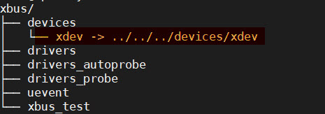

我们直接切换到xdev的目录下，可以看到，我们自定义的属性文件xdev_id。

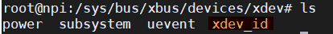

通过echo以及cat命令，可以进行修改和查询，如下所示：

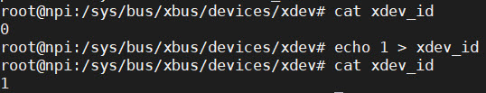

驱动
-------
关于驱动的部分，由于本章实验没有具体的物理设备，因此，没有涉及到设备初始化、设备的函数接口等内容。

定义新的驱动
^^^^^^^^^^^^^^^^^^^^^

.. code-block:: c 
    :caption: 定义device_driver结构体（xdrv.c)
    :linenos:

    extern struct bus_type xbus;

    int xdrv_probe(struct device *dev)
    {
        printk("%s-%s\n", __FILE__, __func__);
        return 0;
    }

    int xdrv_remove(struct device *dev)
    {
        printk("%s-%s\n", __FILE__, __func__);
        return 0;
    }

    static struct device_driver xdrv = {
        .name = "xdev",
        .bus = &xbus,
        .probe = xdrv_probe,
        .remove = xdrv_remove,
    };

代码中定义了一个驱动结构体xdrv，名字需要和设备的名字相同，否则就不能成功匹配。该驱动挂载在已经注册好的总线xbus下。
当驱动和设备匹配成功之后，便会执行驱动的probe函数，这里只是在终端上打印当前的文件以及函数名。
xdrv_remove函数，当注销驱动时，需要关闭物理设备的某些功能等，这里也只是打印出当前的文件名以及函数名。

导出驱动属性文件
^^^^^^^^^^^^^^^^^^^^^

.. code-block:: c 
    :caption: 定义device_driver结构体（xdrv.c)
    :linenos:

    char *name = "xdrv";
    ssize_t drvname_show(struct device_driver *drv, char *buf)
    {
        return sprintf(buf, "%s\n", name);
    }

    DRIVER_ATTR_RO(drvname);

在讲驱动属性文件时，我们讲到DRIVER_ATTR_RO定义驱动属性文件时，没有参数可以设置show和store回调函数，我们只要保证store和show函数的前缀与驱动属性文件一致即可。
如代码所示，定义了一个drvname属性文件，show回调函数的函数名则为drvname_show，这样便可以完成两者之间的关联。

注册驱动
^^^^^^^^^^^^^^^^^^^^^
最后，调用driver_register函数以及driver_create_file函数进行注册我们的驱动以及驱动属性文件。

.. code-block:: c 
    :caption: 模块注册/注销函数（xdrv.c)
    :linenos:

    static __init int xdrv_init(void)
    {
        printk("xdrv init\n");
        driver_register(&xdrv);
        driver_create_file(&xdrv, &driver_attr_drvname);
        return 0;
    }
    module_init(xdrv_init);

    static __exit void xdrv_exit(void)
    {
        printk("xdrv exit\n");
        driver_remove_file(&xdrv, &driver_attr_drvname);
        driver_unregister(&xdrv);
    }
    module_exit(xdrv_exit);

    MODULE_AUTHOR("embedfire");
    MODULE_LICENSE("GPL");

成功加载驱动后，可以看到/sys/bus/xbus/driver多了个驱动xdev目录，如图所示：在该目录下存在一个我们自定义的属性文件，
使用cat命令读该文件的内容，终端会打印字符串"xdrv"。

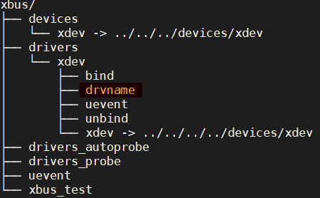

使用命令“demsg | tail”来查看模块加载过程的打印信息，当我们加载完设备和驱动之后，总线开始进行匹配，执行match函数，
发现这两个设备的名字是一致的，就将设备和驱动关联到一起，最后会执行驱动的probe函数。

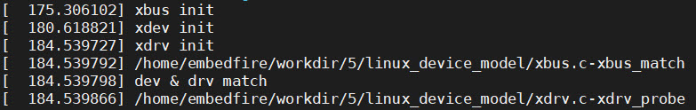
   

