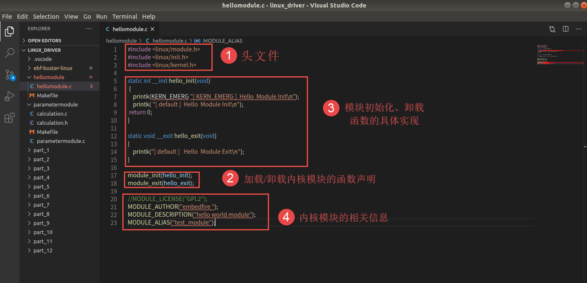
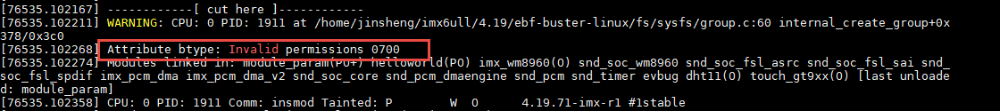

.. vim: syntax=rst

内核模块
==================

从本章开始，我们就要真真正正地步入Linux设备驱动的殿堂了。了解一样新事物，
无非就是围绕这“是什么”，“为什么”，“怎么用”这三个问题。

本章大致分为三个部分：

1. 内核模块的概念：内核模块是什么东西？为什么引入内核模块机制？

2. hellomodule实验： 理解内核模块的代码框架，写一个自己内核模块，以及怎么使用内核模块？

3. 内核模块传参实验： 理解内核模块的参数模式、符号共享、内核模块的自动加载。

内核模块以及机制引入
---------------------------------

内核
~~~~~~~~~~~~~~~~~~~~~~~~~~~~~~~~~

内核按照体系结构分为两类：微内核（Micro Kernel）和宏内核（Monolithic Kernel）。
在微内核架构中，内核只提供操作系统核心功能，如
实现进程管理、存储器管理、进程间通信、I/O设备管理等，
而其它的应用层IPC、文件系统功能、设备驱动模块 则不被包含到内核功能中，
属于微内核之外的模块，所以针对这些模块的修改不会影响到微内核的核心功能。
微内核具有动态扩展性强的优点。Windows操作系统、华为的鸿蒙操作系统就属于这类微内核架构。

而宏内核架构是将上述包括微内核以及微内核之外的应用层IPC、文件系统功能、
设备驱动模块都编译成一个整体，其优点是执行效率非常高，但缺点也是十分明显的，一旦我们想要修改、
增加内核某个功能时（如增加设备驱动程序）都需要重新编译一遍内核。
Linux操作系统正是采用了宏内核结构。为了解决这一缺点，linux中引入了内核模块这一机制。

.. image:: media/module001.png
   :align: center
   :alt: 微内核与宏内核的体系结构

内核模块机制的引入
~~~~~~~~~~~~~~~~~~

内核模块就是实现了某个功能的一段内核代码，在内核运行过程，可以加载这部分代码到内核中， 
从而动态地增加了内核的功能。基于这种特性，我们进行设备驱动开发时，以内核模块的形式编写设备驱动，
只需要编译相关的驱动代码即可，无需对整个内核进行编译。

内核模块的引入不仅提高了系统的灵活性，对于开发人员来说更是提供了极大的方便。
在设备驱动的开发过程中，我们可以随意将正在测试的驱动程序添加到内核中或者从内核中移除，
每次修改内核模块的代码不需要重新启动内核。
在开发板上，我们也不需要将内核模块程序，或者说设备驱动程序的可执行文件存放在开发板中，
免去占用不必要的存储空间。当需要加载内核模块的时候，可以通过挂载NFS服务器，
将存放在其他设备中的内核模块，加载到开发板上。
在某些特定的场合，我们可以按照需要加载/卸载系统的内核模块，从而更好的为当前环境提供服务。

hellomodule实验 编写自己的内核模块
------------------------------------------
本小节通过编写自己的内核模块，来亲身体验一下内核模块的应用。

实验环境
~~~~~~~~~~~~~~~~~~~~~~

1. 开发板烧录好Debian镜像
#. 启动开发板，搭建好nfs客户端，挂载共享文件夹
#. 获取Debian镜像的内核源码并编译

编译内核
~~~~~~~~~
1.我们可以从github或者gitee上克隆开发板的Debian镜像内核源码，国内推荐gitee，当然首先需要安装git工具。

github:
::

   git clone https://gitee.com/Embedfire/ebf-buster-linux.git

gitee:
::

   git clone https://gitee.com/Embedfire/ebf-buster-linux.git

2.获取源码之后，我们还需要在ubuntu上安装必要环境工具库，比如交叉编译工具链等。
::

   sudo apt install make gcc-arm-linux-gnueabihf gcc bison flex libssl-dev dpkg-dev lzop

3.切换到内核源码目录下，执行编译内核的脚本，脚本配置了内核编译位置，运行平台，环境变量，编译工具等一些参数。
::

   sudo ./make_deb.sh

4.获取编译出来的内核相关文件，存放位置由脚本中的ebf-buster-linux/make_deb.sh中 build_opts="${build_opts} O=build_image/build" 指定
::

   ebf-buster-linux/build_image/build

该内核版本即是开发板上运行的内核版本，想要我们自己编译的内核模块完美的运行，尽可能使用与开发板内核相同的内核源码来编译内核模块。
使用'uname -r'命令可以查看对应的内核版本。

.. image:: media/module002.png
   :align: center
   :alt: 内核模块信息

编译内核模块
~~~~~~~~~~~~~~~~~
1.获取内核模块示例源码，将配套代码 /base_code/linux_driver/module/hellomodule 解压到内核代码同级目录

github:
::

   git clone https://github.com/Embedfire-imx6/embed_linux_tutorial

gitee:
::

   git clone https://gitee.com/Embedfire-imx6/embed_linux_tutorial

2.内核模块对象所需的构建步骤和编译很复杂，它利用了linux内核构建系统的强大功能，
当然我们不需要深入了解这部分知识，利用简单的Make工具就能编译出我们想到内核模块。
::

   cd hellomodule
   make

注意该目录下的Makefile中 "KERNEL_DIR=../ebf-buster-linux/build_image/build"要与前面编译的内核所在目录一致。
查看文件夹，新增hellomodule.ko，这就是我们自己编写、编译的内核模块。
使用file hellomodule.ko查看当前编译的文件，32-bit ARM架构的ELF文件。
::

   file hellomodule.ko
   hellomodule.ko: ELF 32-bit LSB relocatable, ARM, EABI5 version 1 (SYSV),
   BuildID[sha1]=1a139278874b2e1a335f1834e755d2cf3f9a4bff, not stripped

hellomodule 内核模块使用
~~~~~~~~~~~~~~~~~~~~~~~~~~~~~~~
我们如愿编译了自己的内核模块，接下来就该了解如何使用这个内核模块了。常用的内核模块命令如下表所示。

表  内核模块相关命令

======================= ==============================================================================================
命令                    作用
======================= ==============================================================================================
lsmod                   用于显示所有已载入系统的内核模块
insmod                  用于加载内核模块，通常可载入的模块一般是设备驱动程序
rmmod                   用于卸载不需要的模块
modinfo                 用于显示内核模块的相关信息
depmod                  用于分析检测内核模块之间的依赖关系
modprobe                同样用于加载内核模块，与insmod不同，modprobe会根据depmod产生的依赖关系，加载依赖的的其他模块
======================= ==============================================================================================

将上一小节编译好的hellomodule.ko通过scp或NFS拷贝到开发板中，试试上面表格中的命令吧。

使用lsmod显示已载入系统的内核模块。

.. image:: media/module010.png
   :align: center
   :alt: 显示已载入的内核模块

通过insmod命令加载hellomodule.ko内存模块

.. image:: media/module011.png
   :align: center
   :alt: 加载hellomodule.ko的内核模块

加载该内存模块的时候，该内存模块会自动执行module_init()函数，进行初始化操作，该函数打印了 'hello module init'。
再次查看已载入系统的内核模块，我们就会在列表中发现hellomodule.ko的身影。

同样我们也可以通过rmmod命令卸载该内存模块，卸载时，内存模块会自动执行module_exit()函数，进行清理操作，
module_exit()函数同样打印了一行内容，但是控制台并没有显示，可以使用dmesg查看，之所以没有显示是与printk的打印等级有关，
后面关于printk函数有详细讲解。

.. image:: media/module012.png
   :align: center
   :alt: 卸载hellomodule.ko的内核模块

关于该模块的相关信息，我们可以通过modinfo来查看，我们从打印的输出信息中，可以了解到，该模块遵循的是GPL协议，
该模块的作者是embedfire，该模块的vermagic等等。而这些信息在模块代码中由相关内核模块信息声明函数声明

.. image:: media/module013.png
   :align: center
   :alt: 内核模块信息

hellomodule 内核模块代码分析
~~~~~~~~~~~~~~~~~~~~~~~~~~~~~~~~~~~~
内核模块编译运行都成功了，我们再花一点时间来理解一下helloworld这个内核模块的代码吧。

一.hellomodule.c

程序结构包含以下四个部分：

1. 头文件
#. 加载/卸载内核模块的函数声明
#. 模块初始化、卸载函数的具体实现
#. 内核模块的相关信息。

代码中包含了头文件<linux/init.h>和<linux/module.h>，这两个头文件是写内核模块必须要包含的。
模块初始化函数hello_init调用了printk函数，在内核模块运行的过程中，他不能依赖于C库函数，
因此用不了printf函数，需要使用单独的打印输出函数printk。该函数的用法与printf函数类似。
完成模块初始化函数之后，还需要调用宏module_init来告诉内核，使用hello_init函数来进行初始化。
模块卸载函数也用printk函数打印字符串，并用宏module_exit在内核注册该模块的卸载函数。
最后，必须声明该模块使用遵循的许可证，这里我们设置为GPL协议。下面是更为详细的代码解释。

内核模块头文件
~~~~~~~~~~~~~~
前面我们已经接触过了Linux的应用编程，了解到Linux的头文件都存放在/usr/include中。
编写内核模块所需要的头文件，并不在上述说到的目录，而是在Linux内核源码中的include文件夹。

- #include <linux/module.h>：包含内核模块信息声明的相关函数
- #include <linux/init.h>：  包含了 module_init()和 module_exit()函数的声明
- #include <linux/kernel.h>：包含内核提供的各种函数，如printk

.. image:: media/module004.png
   :align: center
   :alt: 内核源码的include目录

编写内核模块中经常要使用到的头文件有以下两个：<linux/init.h>和<linux/module.h>。
我们可以看到在头文件前面也带有一个文件夹的名字linux，对应了include下的linux文件夹，
我们到该文件夹下，查看这两个头文件都有什么内容。

.. code-block:: c
   :caption: init.h文件（位于内核源码 /include/linux）
   :linenos:

   /* These are for everybody (although not all archs will actually
   discard it in modules) */
   #define __init __section(.init.text) __cold notrace
   #define __initdata __section(.init.data)
   #define __initconst __constsection(.init.rodata)
   #define __exitdata __section(.exit.data)
   #define __exit_call __used __section(.exitcall.exit)
   /**
   * module_init() - driver initialization entry point
    * @x: function to be run at kernel boot time or module insertion
    *
    * module_init() will either be called during do_initcalls() (if
    * builtin) or at module insertion time (if a module).
    There can only
    * be one per module.
    */
    #define module_init(x) __initcall(x);
   
    /**
    * module_exit() - driver exit entry point
    * @x: function to be run when driver is removed
    *
    * module_exit() will wrap the driver clean-up code
    * with cleanup_module() when used with rmmod when
    * the driver is a module.
    the driver is statically
    * compiled into the kernel, module_exit() has no effect.
    * There can only be one per module.
    */
    #define module_exit(x) __exitcall(x);

Init.h头文件主要包含了内核模块的加载、卸载函数的声明，还有一些宏定义，
因此，只要我们涉及内核模块的编程，就需要加上该头文件。

.. code-block:: c
   :caption: module.h（位于内核源码/include/linux）
   :linenos:

   /* Generic info of form tag = "info" */
   #define MODULE_INFO(tag, info) __MODULE_INFO(tag, tag, info)
   /* For userspace: you can also call me...
   */
   #define MODULE_ALIAS(_alias) MODULE_INFO(alias, _alias)
   #define MODULE_LICENSE(_license) MODULE_INFO(license, _license)
   /*
    * Author(s), use "Name <email>" or just "Name", for multiple
    * authors use multiple MODULE_AUTHOR() statements/lines.
    */
    #define MODULE_AUTHOR(_author) MODULE_INFO(author, _author)

以上代码中，列举了module.h文件中的部分宏定义，这部分宏定义，
有的是可有可无的，但是MODULE_LICENSE这个是指定该内核模块的许可证，是必须要有的。

加载/卸载内核模块
~~~~~~~~~~~~~~~~~
加载/卸载内核模块包含下表中的两个函数，执行命令insmod 和 rmmod时，模块会分别调用这两个函数

表  内核模块相关函数

======================= ==============================================================================================
函数                    作用
======================= ==============================================================================================
module_init()           加载模块时该函数自动执行，进行初始化操作
module_exit()           卸载模块时函数自动执行，进行清理操作
======================= ==============================================================================================

内核模块加载函数module_init() 
''''''''''''''''''''''''''''''
回忆我们使用单片机时，假设我们要使用串口等外设时，是不是都需要调用一个初始化函数，
在这个函数里面，我们初始化了串口的GPIO，配置了串口的相关参数，如波特率，数据位，停止位等等参数。
func_init函数在内核模块中也是做与初始化相关的工作。

.. code-block:: c
   :caption: 内核模块加载函数
   :linenos:

   static int __init func_init(void)
   {
   }
   module_init(func_init);

我们可以看到func_init函数类型为int，该函数返回0，表示模块初始化成功，
并会在/sys/module下新建一个以模块名为名的目录，如下图中的红框处；
返回非0值，表示模块初始化失败。

.. image:: media/module005.png
   :align: center
   :alt:   加载模块成功

在C语言中，static关键字的作用如下：

1. static修饰的静态局部变量直到程序运行结束以后才释放，延长了局部变量的生命周期；
#. static的修饰全局变量只能在本文件中访问，不能在其它文件中访问；
#. static修饰的函数只能在本文件中调用，不能被其他文件调用。

内核模块的代码，实际上是内核代码的一部分，
假如内核模块定义的函数和内核源代码中的某个函数重复了，
编译器就会报错，导致编译失败，因此我们给内核模块的代码加上static修饰符的话，
那么就可以避免这种错误。

.. code-block:: c
   :caption: __init、__initdata宏定义（位于内核源码/linux/init.h）
   :linenos:

   #define __init __section(.init.text) __cold notrace
   #define __initdata __section(.init.data)

以上代码 __init、__initdata宏定义（位于内核源码/linux/init.h）中的__init用于修饰函数，
__initdata用于修饰变量。带有__init的修饰符，表示将该函数放到可执行文件的__init节区中，
该节区的内容只能用于模块的初始化阶段，初始化阶段执行完毕之后，这部分的内容就会被释放掉，真可谓是“针尖也要削点铁”。

.. code-block:: c
   :caption: module_init宏定义
   :linenos:

   #define module_init(x) __initcall(x);

宏定义module_init用于通知内核初始化模块的时候，
要使用哪个函数进行初始化。它会将函数地址加入到相应的节区section中，
这样的话，开机的时候就可以自动加载模块了。

内核模块卸载函数module_exit() 
'''''''''''''''''''''''''''''
理解了模块加载的内容之后，来学习模块卸载函数应该会比较简单。
与内核加载函数相反，内核模块卸载函数func_exit主要是用于释放初始化阶段分配的内存，
分配的设备号等，是初始化过程的逆过程。

.. code-block:: c
   :caption: 内核模块卸载函数
   :linenos:

   static void __exit func_exit(void)
   {
   }
   module_exit(func_exit);

与函数func_init区别在于，该函数的返回值是void类型，且修饰符也不一样，
这里使用的使用__exit，表示将该函数放在可执行文件的__exit节区，
当执行完模块卸载阶段之后，就会自动释放该区域的空间。

.. code-block:: c
   :caption: __exit、__exitdata宏定义
   :linenos:

   #define __exit __section(.exit.text) __exitused __cold notrace
   #define __exitdata __section(.exit.data)

类比于模块加载函数，__exit用于修饰函数，__exitdata用于修饰变量。
宏定义module_exit用于告诉内核，当卸载模块时，需要调用哪个函数。

内核打印函数 printk
''''''''''''''''''''''
- printf：glibc实现的打印函数，工作于用户空间
- printk：内核模块无法使用glibc库函数，内核自身实现的一个类printf函数，但是需要指定打印等级。

  - #define KERN_EMERG 	   "<0>" 通常是系统崩溃前的信息
  - #define KERN_ALERT     "<1>" 需要立即处理的消息
  - #define KERN_CRIT      "<2>" 严重情况
  - #define KERN_ERR       "<3>" 错误情况
  - #define KERN_WARNING   "<4>" 有问题的情况
  - #define KERN_NOTICE    "<5>" 注意信息
  - #define KERN_INFO      "<6>" 普通消息
  - #define KERN_DEBUG     "<7>" 调试信息

查看当前系统printk打印等级：`cat /proc/sys/kernel/printk`，
从左到右依次对应当前控制台日志级别、默认消息日志级别、最小的控制台级别、默认控制台日志级别。

.. image:: media/module006.png
   :align: center
   :alt: printk打印等级

打印内核所有打印信息：dmesg，注意内核log缓冲区大小有限制，缓冲区数据可能被覆盖掉。

内核模块的相关信息
~~~~~~~~~~~~~~~~~~~
表  内核模块信息声明函数

======================= ==============================================================================================
函数                    作用
======================= ==============================================================================================
MODULE_LICENSE()        表示模块代码接受的软件许可协议，Linux内核遵循GPL V2开源协议，内核模块与linux内核保持一致即可。
MODULE_AUTHOR()         描述模块的作者信息
MODULE_DESCRIPTION()    对模块的简单介绍
MODULE_ALIAS()          给模块设置一个别名
======================= ==============================================================================================

内核模块许可证
''''''''''''''''''''''
Linux是一款免费的操作系统，采用了GPL协议，允许用户可以任意修改其源代码。
GPL协议的主要内容是软件产品中即使使用了某个GPL协议产品提供的库，
衍生出一个新产品，该软件产品都必须采用GPL协议，即必须是开源和免费使用的，
可见GPL协议具有传染性。因此，我们可以在Linux使用各种各样的免费软件。
在以后学习Linux的过程中，可能会发现我们安装任何一款软件，从来没有30天试用期或者是要求输入激活码的。

.. code-block:: c
   :caption: 许可证
   :linenos:

   #define MODULE_LICENSE(_license) MODULE_INFO(license, _license)

内核模块许可证有 “GPL”，“GPL v2”，“GPL and additional rights”，“Dual SD/GPL”，“Dual MPL/GPL”，“Proprietary”。

内核模块的其他信息
''''''''''''''''''''''

下面，我们介绍一下关于内核模块程序结构的最后一部分内容。
这部分内容只是为了给使用该模块的读者一本“说明书”，属于可有可无的部分，
有则锦上添花，若没有也无伤大雅。

作者信息

.. code-block:: c
   :caption: 内核模块作者宏定义（位于内核源码/linux/module.h）
   :linenos:

   #define MODULE_AUTHOR(_author) MODULE_INFO(author, _author)

我们前面使用modinfo中打印出的模块信息中“author”信息便是来自于宏定义MODULE_AUTHOR。
该宏定义用于声明该模块的作者。

模块描述信息

.. code-block:: c
   :caption: 模块描述信息（位于内核源码/linux/module.h）
   :linenos:

   #define MODULE_DESCRIPTION(_description) MODULE_INFO(description, _description)

模块信息中“description”信息则来自宏MODULE_DESCRIPTION，该宏用于描述该模块的功能作用。

模块别名

.. code-block:: c
   :caption: 内核模块别名宏定义（位于内核源码/linux/module.h）
   :linenos:

   #define MODULE_ALIAS(_alias) MODULE_INFO(alias, _alias)

模块信息中“alias”信息来自于宏定义MODULE_ALIAS。该宏定义用于给内核模块起别名。
注意，在使用该模块的别名时，需要将该模块复制到/lib/modules/内核源码/下，
使用命令depmod更新模块的依赖关系，否则的话，Linux内核怎么知道这个模块还有另一个名字。

二.Makefile分析
~~~~~~~~~~~~~~~

对于内核模块而言，它是属于内核的一段代码，只不过它并不在内核源码中。
为此，我们在编译时需要到内核源码目录下进行编译。
编译内核模块使用的Makefile文件，和我们前面编译C代码使用的Makefile大致相同，
这得益于编译Linux内核所采用的Kbuild系统，因此在编译内核模块时，我们也需要指定环境变量ARCH和CROSS_COMPILE的值。

.. code-block:: makefile
   :caption: ../base_code/linux_driver/hellomodule/Makefile
   :linenos:

   KERNEL_DIR=/home/pi/build

   ARCH=arm
   CROSS_COMPILE=arm-linux-gnueabihf-
   export  ARCH  CROSS_COMPILE
   obj-m := hellomodule.o
   all:
	   $(MAKE) -C $(KERNEL_DIR) M=$(CURDIR) modules
   .PHONE:clean copy
   clean:
	   $(MAKE) -C $(KERNEL_DIR) M=$(CURDIR) clean	
   copy:
	   sudo  cp  *.ko  /home/embedfire/workdir

以上代码中提供了一个关于编译内核模块的Makefile。
该Makefile定义了变量KERNEL_DIR，来保存内核源码的目录。
变量obj-m保存着需要编译成模块的目标文件名。
'$(MAKE)modules'实际上是执行Linux顶层Makefile的伪目标modules。
通过选项'-C'，可以让make工具跳转到源码目录下读取顶层Makefile。
'M=$(CURDIR)'表明返回到当前目录，读取并执行当前目录的Makefile，开始编译内核模块。
CURDIR是make的内嵌变量，自动设置为当前目录。

执行 ``make`` 命令，最后生成内核模块hellomodule.ko。

.. image:: media/module008.jpg
   :align: center

.. image:: media/module009.jpg
   :align: center

内核模块传参实验 内核模块之间进行参数传递
--------------------------------------------
现在我们写了一个很简单的内核模块，了解其代码结构，接下来我们再深入了解下内核模块的参数传递和符号模式。

编译内核模块
~~~~~~~~~~~~
1.获取内核模块源码，将配套代码 /base_code/linux_driver/module/parametermodule 解压到内核代码同级目录
2.编译源码
::

   cd parametermodule
   make

注意该目录下的Makefile中 "KERNEL_DIR=../ebf-buster-linux/build_image/build"要与前面编译的内核所在目录一致
查看文件夹，新增calculation.ko和parametermodule.ko。

.. image:: media/module014.png
   :align: center
   :alt:   编译内核模块

模块参数
~~~~~~~~

内核模块参数
''''''''''''''
根据不同应用场合给内核模块传递不同参数，提高内核模块灵活性。
例如在程序中开启调试模式、设置详细输出模式以及制定与具体模块相关的选项，都可以接收参数，改变其行为。

.. code-block:: c
   :caption: 示例程序
   :linenos:

   
   static int itype=0;
   module_param(itype,int,0);

   static bool btype=0;
   module_param(btype,bool,0644);

   static char ctype=0;
   module_param(ctype,byte,0);

   static char  *stype=0;
   module_param(stype,charp,0644);

   static int __init param_init(void)
   {
      printk(KERN_ALERT "param init!\n");
      printk(KERN_ALERT "itype=%d\n",itype);
      printk(KERN_ALERT "btype=%d\n",btype);
      printk(KERN_ALERT "ctype=%d\n",ctype);
      printk(KERN_ALERT "stype=%s\n",stype);
      return 0;
   }

首先我们定义了四个常见变量
然后使用module_param宏函数来声明这四个参数，并在calculation_init中输出上述四个参数的值。

.. code-block:: c
   :caption: 内核模块参数宏定义（位于内核源 码/linux/moduleparam.h）
   :linenos:

   #define module_param(name, type, perm) \\
   module_param_named(name, name, type, perm)
   #define module_param_array(name, type, nump, perm) \\
   module_param_array_named(name, name, type, nump, perm)

以上代码中的module_param函数需要传入三个参数：

-  参数name——我们定义的变量名；
-  参数type——参数的类型，目前内核支持的参数类型有byte，short，
   ushort，int，uint，long，ulong，charp，bool，invbool。
   其中charp表示的是字符指针，bool是布尔类型，其值只能为0或者是1；
   invbool是反布尔类型，其值也是只能取0或者是1，但是true值表示0，false表示1。
   变量是char类型时，传参只能是byte，char * 时只能是charp。

   .. image:: media/module015.png
      :align: center
      :alt:   模块参数

   我们定义的四个模块参数，会在 ``/sys/module/模块名/parameters`` 下会存在以模块参数为名的文件。

-  参数perm表示的是该文件的权限，具体参数值见下表。

   表  文件权限

   ========== ========= ================================
   标志位      含义
   ========== ========= ================================
   当前用户    S_IRUSR     用户拥有读权限
   \           S_IWUSR     用户拥有写权限
   当前用户组   S_IRGRP     当前用户组的其他用户拥有读权限
   \           S_IWGRP     当前用户组的其他用户拥有写权限
   其他用户    S_IROTH     其他用户拥有读权限 
   \           S_IWOTH     其他用户拥有写权限
   ========== ========= ================================

   上述文件权限唯独没有关于可执行权限的设置，请注意，
   该文件不允许它具有可执行权限。如果强行给该参数赋予表示可执行权限的参数值S_IXUGO，
   那么最终生成的内核模块在加载时会提示错误，见下图。

通过NFS将编译好的module_param.ko拷贝到开发板中，加载module_param.ko并传参，
这时我们声明的四个变量的值，就是变成了我们赋的值。
::

   sudo insmod module_param.ko itype=123 btype=1 ctype=200 stype=abc

.. image:: media/module017.png
   :align: center
   :alt:   模块参数

符号共享
~~~~~~~~~~
内核模块导出符号
''''''''''''''''
内核模块导出符号，符号是什么东西？实际上，符号指的就是函数和变量。
当模块被装入内核后，它所导出的符号都会记录在内核符号表中。
在使用命令insmod加载模块后，模块就被连接到了内核，因此可以访问内核的共用符号。

.. code-block:: c
   :caption: 导出符号
   :linenos:

   #define EXPORT_SYMBOL(sym) \\
   __EXPORT_SYMBOL(sym, "")

EXPORT_SYMBOL宏用于向内核导出符号，这样的话，其他模块也可以使用我们导出的符号了。
下面通过一段代码，介绍如何使用某个模块导出符号。

.. code-block:: c
   :caption: parametermodule.c
   :linenos:

   ...省略代码...
   static int itype=0;
   module_param(itype,int,0);

   EXPORT_SYMBOL(itype);

   int my_add(int a, int b)
   {
      return a+b;
   }

   EXPORT_SYMBOL(my_add);

   int my_sub(int a, int b)
   {
      return a-b;
   }

   EXPORT_SYMBOL(my_sub);
   ...省略代码...

在parametermodule.c中定义了参数itype和my_add、my_sub函数，并通过EXPORT_SYMBOL宏导出。
以上代码中，省略了内核模块程序的其他内容，如头文件，加载/卸载函数等。

.. code-block:: c
   :caption: calculation.h
   :linenos:

   #ifndef __CALCULATION_H__
   #define __CALCULATION_H__

   extern int itype;

   int my_add(int a, int b);
   int my_sub(int a, int b);

   #endif

.. code-block:: c
   :caption: calculation.c
   :linenos:

   ...省略代码...
   #include "calculation.h"

   ...省略代码...
   static int __init calculation_init(void)
   {
      printk(KERN_ALERT "calculation  init!\n");
      printk(KERN_ALERT "itype+1 = %d, itype-1 = %d\n", my_add(itype,1), my_sub(itype,1));    
      return 0;
   }
   ...省略代码...

calculation.c中使用extern关键字声明的参数itype，调用my_add()、my_sub()函数进行计算。 

查看向内核导出的符号表 'cat /proc/kallsyms'

.. image:: media/module018.png
   :align: center
   :alt:   查看符号表

手动加载内核模块
''''''''''''''''
通过NFS将编译好的calculation.ko拷贝到开发板中，calculation.ko依赖parametermodule.ko中的参数和函数，
所以先手动加载parametermodule.ko，然后再加载calculation.ko。

.. image:: media/module019.png
   :align: center
   :alt:   模块参数

同样卸载的时，parametermodule.ko中的参数和函数被calculation.ko调用，必须先卸载calculation.ko
再卸载parametermodule.ko，否则会报错"ERROR: Module parametermodule is in use by: calculation"

.. image:: media/module020.png
   :align: center
   :alt:   模块卸载报错

模块的自动加载
''''''''''''''''
所有内核模块统一放到"/lib/modules/内核版本"目录下
::

   cp *.ko /lib/modules/内核版本

内核版本查询
::

   uname -r

建立模块依赖关系：
::

   depmod -a 

查看模块依赖关系
::

   cat /lib/modules/内核版本/modules.dep | grep calculation

加载模块及其依赖模块
::

   modprobe calculation

卸载模块及其依赖模块
::

   modprobe -r calculation

.. image:: media/module021.png
   :align: center
   :alt:   模块卸载报错

