Linux内核模块
^^^^^^^^^^^^^^^^

引言
---------------------------
从本章开始，我们就要真真正正地步入Linux设备驱动的殿堂了。
在Linux系统中，设备驱动会以内核模块的形式出现，学习Linux内核模块编程是驱动开发的先决条件。
第一次接触Linux内核模块，我们将围绕着“Linux内核模块是什么”，“Linux内核模块的工作原理”以及
“我们该怎么使用Linux内核模块”这样的思路一起走进Linux内核世界。

本章大致分为四个部分：

1. 内核模块的概念：内核模块是什么东西？为什么引入内核模块这一机制？

2. 内核模块的原理：内核模块在内核中的加载、卸载过程，深入剖析内核模块的参数传递、内核模块如何导出符号。

3. hellomodule实验： 理解内核模块的代码框架和原理，写一个属于自己的模块，模块的使用方法等。

4. 内核模块传参与符号共享实验： 理解内核模块的参数模式、符号共享，验证内核模块的运行机制。

内核模块的概念
---------------------------

内核
>>>>>>>>>>>>>>>>>>>>>>>>>>>
内核，是一个操作系统的核心。是基于硬件的第一层软件扩充，提供操作系统的最基本的功能，
是操作系统工作的基础，决定着整个操作系统的性能和稳定性。

内核按照体系结构分为两类：微内核（Micro Kernel）和宏内核（Monolithic Kernel）。
在微内核架构中，内核只提供操作系统核心功能，如
实现进程管理、存储器管理、进程间通信、I/O设备管理等，
而其它的应用层IPC、文件系统功能、设备驱动模块 则不被包含到内核功能中，
属于微内核之外的模块，所以针对这些模块的修改不会影响到微内核的核心功能。
微内核具有动态扩展性强的优点。Windows操作系统、华为的鸿蒙操作系统就属于这类微内核架构。

而宏内核架构是将上述包括微内核以及微内核之外的应用层IPC、文件系统功能、
设备驱动模块都编译成一个整体，其优点是执行效率非常高，但缺点也是十分明显的，一旦我们想要修改、
增加内核某个功能时（如增加设备驱动程序）都需要重新编译一遍内核。
Linux操作系统正是采用了宏内核结构。为了解决这一缺点，linux中引入了内核模块这一机制。

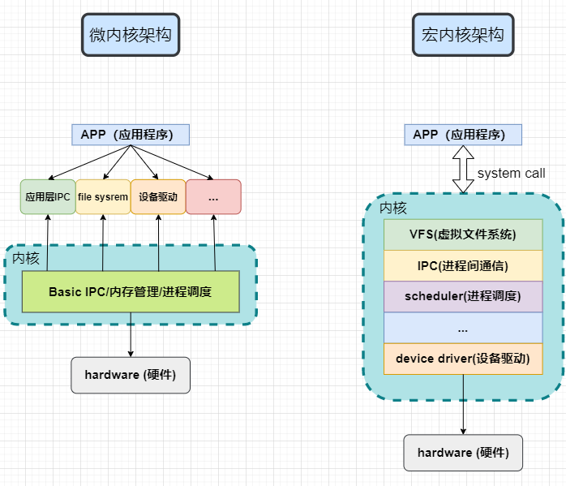

内核模块机制引入
>>>>>>>>>>>>>>>>>>>>>>>>>>>

内核模块引入原因
:::::::::::::::::::::::::::
Linux是一个跨平台的操作系统，支持众多的设备，在Linux内核源码中有超过50%的代码都与设备驱动相关。
Linux为宏内核架构，如果开启所有的功能，内核就会变得十分臃肿。
内核模块就是实现了某个功能的一段内核代码，在内核运行过程，可以加载这部分代码到内核中， 
从而动态地增加了内核的功能。基于这种特性，我们进行设备驱动开发时，以内核模块的形式编写设备驱动，
只需要编译相关的驱动代码即可，无需对整个内核进行编译。

内核模块引入好处
:::::::::::::::::::::::::::
内核模块的引入不仅提高了系统的灵活性，对于开发人员来说更是提供了极大的方便。
在设备驱动的开发过程中，我们可以随意将正在测试的驱动程序添加到内核中或者从内核中移除，
每次修改内核模块的代码不需要重新启动内核。
在开发板上，我们也不需要将内核模块程序，或者说设备驱动程序的ELF文件存放在开发板中，
免去占用不必要的存储空间。当需要加载内核模块的时候，可以通过挂载NFS服务器，
将存放在其他设备中的内核模块，加载到开发板上。
在某些特定的场合，我们可以按照需要加载/卸载系统的内核模块，从而更好的为当前环境提供服务。

内核模块的定义和特点
>>>>>>>>>>>>>>>>>>>>>>>>>>>

了解了内核模块引入以及带来的诸多好处，我们可以在头脑中建立起对内核模块的初步认识，
下面让我们给出内核模块的具体的定义：内核模块全称Loadable Kernel Module(LKM),
是一种在内核运行时加载一组目标代码来实现某个特定功能的机制。

模块是具有独立功能的程序，它可以被单独编译，但不能独立运行，
在运行时它被链接到内核作为内核的一部分在内核空间运行，这与运行在用户空间的进程是不一样的。
模块由一组函数和数据结构组成，用来实现一种文件系统、一个驱动程序和其他内核上层功能。
因此内核模块具备如下特点：

- 模块本身不被编译入内核映像，这控制了内核的大小。
- 模块一旦被加载，它就和内核中的其它部分完全一样。

有了内核模块的概念，下面我们一起深入了解内核模块的工作机制吧。

内核模块的工作机制
---------------------------
我们编写的内核模块，经过编译，最终形成.ko为后缀的ELF文件。我们可以使用file命令来查看它。

那么这样的文件是如何被内核一步一步拿到并且很好的工作的呢？
为了便于我们更好的理解内核模块的加载/卸载过程，可以先跟我一起学习ELF文件格式，了解ko究竟是怎么一回事儿。
再一同去看看内核源码，探究内核模块加载/卸载，以及符号导出的经过。

内核模块详细加载/卸载过程
>>>>>>>>>>>>>>>>>>>>>>>>>>>
ko文件的文件格式
:::::::::::::::::::::::::::
ko文件在数据组织形式上是ELF(Excutable And Linking Format)格式，是一种普通的可重定位目标文件。
这类文件包含了代码和数据，可以被用来链接成可执行文件或共享目标文件，静态链接库也可以归为这一类。

ELF 文件格式的可能布局如下图。

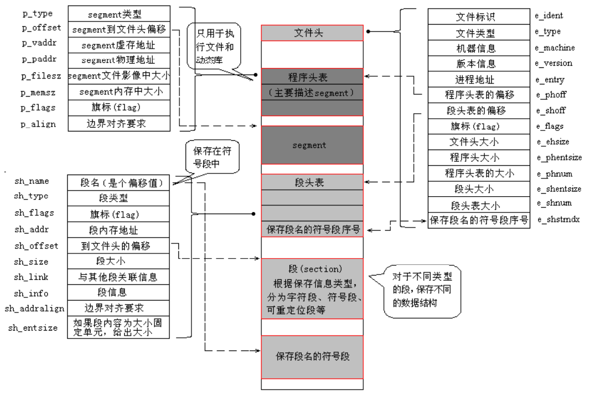

文件开始处是一个ELF头部(ELF Header)，用来描述整个文件的组织，这些信息独立于处理器，
也独立于文件中的其余内容

我们可以使用readelf工具查看elf文件的头部详细信息。

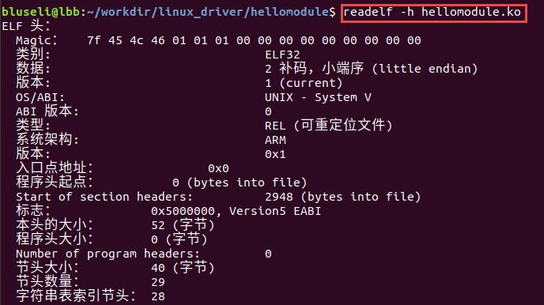

程序头部表(Program Header Table)是个数组结构，它的每一个元素的数据结构如下每个数组元素表示:

- 一个"段"
    - 包含一个或者多个"节区"
    - 程序头部仅对于可执行文件和共享目标文件有意义
- 或者"系统准备程序执行所必需的其它信息"

节区头部表/段表(Section Heade Table)
ELF文件中有很多各种各样的段，这个段表(Section Header Table)就是保存这些段的基本属性的结构，
ELF文件的段结构就是由段表决定的，编译器、链接器、装载器都是依靠段表来定位和访问各个段的属性的
包含了描述文件节区的信息，ELF头部中，e_shoff成员给出从文件头到节区头部表格的偏移字节数，
e_shnum给出表格中条目数目，e_shentsize 给出每个项目的字节数。
从这些信息中可以确切地定位节区的具体位置、长度和程序头部表一样，
每一项节区在节区头部表格中都存在着一项元素与它对应，因此可知，这个节区头部表格为一连续的空间，
每一项元素为一结构体(思考这节开头的那张节区和节区头部的示意图)

读取节区头部表的详细信息。

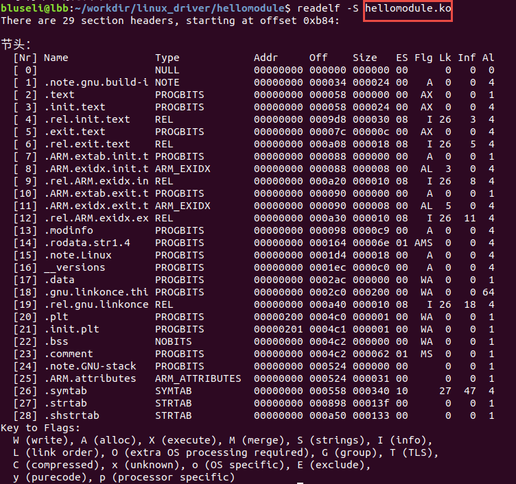

重定位表
重定位表(".rel.text")位于段表之后，它的类型为(sh_type)为"SHT_REL"，即重定位表(Relocation Table)
链接器在处理目标文件时，必须要对目标文件中某些部位进行重定位，即代码段和数据段中那些对绝对地址的引用的位置，
这些重定位信息都记录在ELF文件的重定位表里面，对于每个须要重定位的代码段或者数据段，都会有一个相应的重定位表
一个重定位表同时也是ELF的一个段，这个段的类型(sh_type)就是"SHT_REL"

读取重定位表。

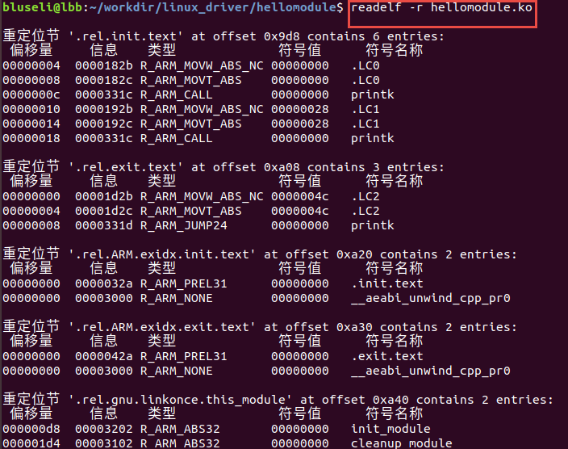

字符串表
ELF文件中用到了很多字符串，比如段名、变量名等。因为字符串的长度往往是不定的，
所以用固定的结构来表示比较困难，一种常见的做法是把字符串集中起来存放到一个表，然后使用字符串在表中的偏移来引用字符串。
一般字符串表在ELF文件中也以段的形式保存，常见的段名为".strtab"(String Table 字符串表)或者".shstrtab"(Section Header String Table 段字符串表)

读取节区字符串表。

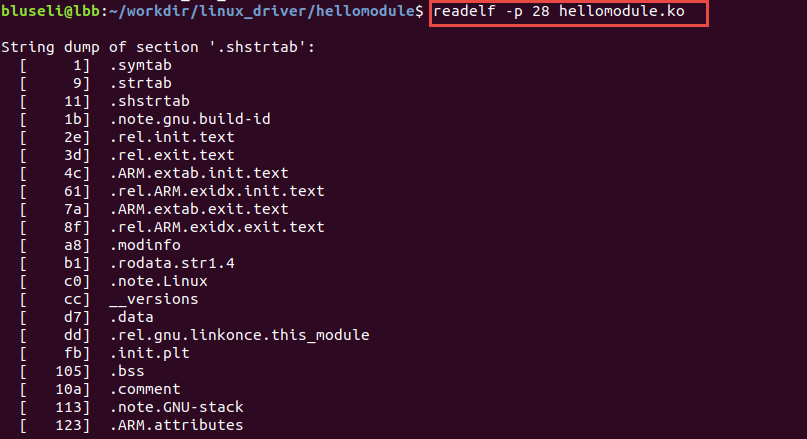

内核模块加载过程
:::::::::::::::::::::::::::
我们先了解整个过程，在带着整个框架去看代码。
首先insmod会通过文件系统将ko读到用户空间的一块内存中，
然后调用系统调用sys_init_module,
这时，内核在vmalloc区分配与ko文件大小相同的内存来暂存ko文件，
暂存好之后解析ko文件，将文件中的各个section分配到init 段和core 段，在modules区为init段和core段分配内存，
并把对应的section copy到modules区最终的运行地址，
经过relocate函数地址等操作后，就可以执行ko的init操作了，
这样一个ko的加载流程就结束了，同时，init段会被释放掉，仅留下core段来运行。

.. code-block:: c
   :caption: ebf-buster-linux\kernel\module.c
   :linenos:

   /** 
    * @brief  系统调用 sys_init_module 的参数定义
    * @param  umod  用户空间 ko 模块起始地址
    * @param  len  ko模块大小
    * @param  uargs  传给模块的参数在用户空间下的地址
    */
   SYSCALL_DEFINE3(init_module, void __user *, umod,
         unsigned long, len, const char __user *, uargs)
   {
      int err;
      struct load_info info = { };

      err = may_init_module();
      if (err)
         return err;

      pr_debug("init_module: umod=%p, len=%lu, uargs=%p\n",
            umod, len, uargs);

      /* 通过vmalloc在vmalloc区分配内存空间，将内核模块copy到此空间，info->hdr 直接指向此空间首地址，也就是ko的elf header */
      err = copy_module_from_user(umod, len, &info);
      if (err)
         return err;

      /*模块加载的核心处理方法,所有的操作都在这里完成*/
      return load_module(&info, uargs, 0);
   }

在函数copy_module_from_user()中，通过vmalloc在vmalloc区分配内存空间，
将内核模块copy到此空间，info->hdr 直接指向此空间首地址，也就是ko的elf header。
然后通过load_module()模块加载的核心处理，在这里完成了模块的搬移，重定向等艰苦的过程；
下面代码已经被我简化，源代码在ebf-buster-linux\kernel\module.c中load_module函数。

.. code-block:: c
   :caption: ebf-buster-linux\kernel\module.c
   :linenos:

   /* 分配并加载模块 */
   static int load_module(struct load_info *info, const char __user *uargs,
               int flags)
   {
      struct module *mod;
      long err = 0;
      char *after_dashes;
      ...
      err = setup_load_info(info, flags);
      ...
      mod = layout_and_allocate(info, flags);
      ...
   }

setup_load_info()加载struct load_info 和 struct module, rewrite_section_headers 
将每个section的sh_addr修改为当前镜像所在的内存地址， 
section 名称字符串表地址的获取方式是从ELF头中的e_shstrndx获取到节区头部字符串表的标号，
找到对应section在ELF文件中的偏移，再加上ELF文件起始地址就得到了字符串表在内存中的地址。

在layout_and_allocate()中，
layout_sections() 负责将section 归类为core和init这两大类,为ko的第二次搬移做准备。
move_module()把ko搬移到最终的运行地址。内核模块加载代码搬运过程到此就结束了，
内核模块要工作起来还得进行符号导出，后面一章有较为详细的讲解。

.. code-block:: c
   :caption: ebf-buster-linux\kernel\module.c
   :linenos:

   static struct module *layout_and_allocate(struct load_info *info, int flags)
   {
      struct module *mod;
      unsigned int ndx;
      int err;

      err = check_modinfo(info->mod, info, flags);
      if (err)
         return ERR_PTR(err);

      /* Allow arches to frob section contents and sizes.  */
      err = module_frob_arch_sections(info->hdr, info->sechdrs,
                  info->secstrings, info->mod);
      if (err < 0)
         return ERR_PTR(err);

      /* We will do a special allocation for per-cpu sections later. */
      info->sechdrs[info->index.pcpu].sh_flags &= ~(unsigned long)SHF_ALLOC;

      /*
      * Mark ro_after_init section with SHF_RO_AFTER_INIT so that
      * layout_sections() can put it in the right place.
      * Note: ro_after_init sections also have SHF_{WRITE,ALLOC} set.
      */
      ndx = find_sec(info, ".data..ro_after_init");
      if (ndx)
         info->sechdrs[ndx].sh_flags |= SHF_RO_AFTER_INIT;

      /* Determine total sizes, and put offsets in sh_entsize.  For now
         this is done generically; there doesn't appear to be any
         special cases for the architectures. */
      layout_sections(info->mod, info);
      layout_symtab(info->mod, info);

      /* Allocate and move to the final place */
      err = move_module(info->mod, info);
      if (err)
         return ERR_PTR(err);

      /* Module has been copied to its final place now: return it. */
      mod = (void *)info->sechdrs[info->index.mod].sh_addr;
      kmemleak_load_module(mod, info);
      return mod;
   }

内核模块卸载过程
:::::::::::::::::::::::::::
卸载过程相对加载比较简单，我们输入指令rmmod，最终在系统内核中需要调用sys_delete_module进行实现。
具体过程如下：先从用户空间传入需要卸载的模块名称，根据名称找到要卸载的模块指针，
确保我们要卸载的模块没有被其他模块依赖，然后找到模块本身的exit函数实现卸载。
如下面的代码，在ebf-buster-linux\kernel\module.c中的SYSCALL_DEFINE2()函数。

.. code-block:: c
    :caption: ebf-buster-linux\kernel\module.c
    :linenos:

   SYSCALL_DEFINE2(delete_module, const char __user *, name_user,
         unsigned int, flags)
   {
      struct module *mod;
      char name[MODULE_NAME_LEN];
      int ret, forced = 0;

      //确保有插入和删除模块不受限制的权利，并且模块没有被禁止插入或删除
      if (!capable(CAP_SYS_MODULE) || modules_disabled)
         return -EPERM;

      //获得模块名字
      if (strncpy_from_user(name, name_user, MODULE_NAME_LEN-1) < 0)
         return -EFAULT;
      name[MODULE_NAME_LEN-1] = '\0';

      audit_log_kern_module(name);

      if (mutex_lock_interruptible(&module_mutex) != 0)
         return -EINTR;

      //找到要卸载的模块指针
      mod = find_module(name);
      if (!mod) {
         ret = -ENOENT;
         goto out;
      }

      if (!list_empty(&mod->source_list)) {
         /* 有依赖的模块，需要先卸载它们 */
         ret = -EWOULDBLOCK;
         goto out;
      }

      /* Doing init or already dying? */
      if (mod->state != MODULE_STATE_LIVE) {
         /* FIXME: if (force), slam module count damn the torpedoes */
         pr_debug("%s already dying\n", mod->name);
         ret = -EBUSY;
         goto out;
      }

      /* 检查模块的退出函数 */
      if (mod->init && !mod->exit) {
         forced = try_force_unload(flags);
         if (!forced) {
            /* This module can't be removed */
            ret = -EBUSY;
            goto out;
         }
      }

      /* 停止机器，使参考计数不能移动并禁用模块*/
      ret = try_stop_module(mod, flags, &forced);
      if (ret != 0)
         goto out;

      mutex_unlock(&module_mutex);
      /* Final destruction now no one is using it. */
      if (mod->exit != NULL)
         mod->exit();
      //告诉通知链module_notify_list上的监听者，模块状态 变为 MODULE_STATE_GOING
      blocking_notifier_call_chain(&module_notify_list,
                  MODULE_STATE_GOING, mod);
      klp_module_going(mod);
      ftrace_release_mod(mod);

      //等待所有异步函数调用完成
      async_synchronize_full();

      /* Store the name of the last unloaded module for diagnostic purposes */
      strlcpy(last_unloaded_module, mod->name, sizeof(last_unloaded_module));

      free_module(mod);
      return 0;
   out:
      mutex_unlock(&module_mutex);
      return ret;
   }

内核是如何导出符号的
>>>>>>>>>>>>>>>>>>>>>>>>>>>
符号是什么东西？我们为什么需要导出符号呢？内核模块如何导出符号呢？
其他模块又是如何找到这些符号的呢？

这是这一小节讨论的知识，实际上，符号指的就是内核模块中使用EXPORT_SYMBOL 声明的函数和变量。
当模块被装入内核后，它所导出的符号都会记录在公共内核符号表中。
在使用命令insmod加载模块后，模块就被连接到了内核，因此可以访问内核的共用符号。

通常情况下我们无需导出任何符号，但是如果其他模块想要从我们这个模块中获取某些方便的时候，
就可以考虑使用导出符号为其提供服务。这被称为模块层叠技术。
例如msdos文件系统依赖于由fat模块导出的符号；USB输入设备模块层叠在usbcore和input模块之上。
也就是我们可以将模块分为多个层，通过简化每一层来实现复杂的项目。

modprobe是一个处理层叠模块的工具，它的功能相当于多次使用insmod，
除了装入指定模块外还同时装入指定模块所依赖的其他模块。

当我们要导出模块的时候，可以使用下面的宏
::

   EXPORT_SYMBOL(name)
   EXPORT_SYMBOL_GPL(name) //name为我们要导出的标志

符号必须在模块文件的全局部分导出，不能在函数中使用，_GPL使得导出的模块只能被GPL许可的模块使用。
编译我们的模块时，这两个宏会被拓展为一个特殊变量的声明，存放在ELF文件中。
具体也就是存放在ELF文件的符号表中：

   - st_name 是符号名称在符号名称字符串表中的索引值
   - st_value 是符号所在的内存地址
   - st_size 是符号大小
   - st_info 是符号类型和绑定信息
   - st_shndx表示符号所在section

当ELF的符号表被加载到内核后，会执行simplify_symbols来遍历整个ELF文件符号表。
根据st_shndx找到符号所在的section和st_value中符号在section中的偏移得到真正的内存地址。
并最终将符号内存地址，符号名称指针存储到内核符号表中。

.. code-block:: c
   :caption: ebf-buster-linux\kernel\module.c
   :linenos:

   /* 更改所有符号，使st_value直接对指针进行编码. */
   static int simplify_symbols(struct module *mod, const struct load_info *info)
   {
      /*内容已省略*/
   }

内核导出的符号表结构有两个字段，一个是符号在内存中的地址，一个是符号名称指针， 
符号名称被放在了__ksymtab_strings这个section中，
以EXPORT_SYMBOL举例，符号会被放到名为___ksymtab的section中。

.. code-block:: c
   :caption: ebf-buster-linux\include\linux\export.h
   :linenos:

   /* 这个结构体我们要注意，它构成的表是导出符号表而不是通常意义上的符号表 */
   struct kernel_symbol {
      unsigned long value;	// 符号在内存中的地址
      const char *name;    // 符号名称
   };
   #endif

   /* For every exported symbol, place a struct in the __ksymtab section */
   #define ___EXPORT_SYMBOL(sym, sec)					\
      extern typeof(sym) sym;						\
      __CRC_SYMBOL(sym, sec)						\
      static const char __kstrtab_##sym[]				\
      __attribute__((section("__ksymtab_strings"), used, aligned(1)))	\
      = #sym;								\
      __KSYMTAB_ENTRY(sym, sec)

   #if defined(__DISABLE_EXPORTS)

其他的内核模块在寻找符号的时候会调用resolve_symbol_wait去内核和其他模块中通过符号名称
寻址目标符号，resolve_symbol_wait会调用resolve_symbol，进而调用 find_symbol。
找到了符号之后，把符号的实际地址赋值给符号表 sym[i].st_value = ksym->value;

.. code-block:: c
   :caption: ebf-buster-linux\kernel\module.c
   :linenos:

   /* 找到一个符号并将其连同（可选）crc和（可选）拥有它的模块一起返回。
      需要禁用抢占或模块互斥。 */
   const struct kernel_symbol *find_symbol(const char *name,
                  struct module **owner,
                  const s32 **crc,
                  bool gplok,
                  bool warn)
   {
      struct find_symbol_arg fsa;

      fsa.name = name;
      fsa.gplok = gplok;
      fsa.warn = warn;

      if (each_symbol_section(find_symbol_in_section, &fsa)) {
         if (owner)
            *owner = fsa.owner;
         if (crc)
            *crc = fsa.crc;
         return fsa.sym;
      }

      pr_debug("Failed to find symbol %s\n", name);
      return NULL;
   }
   EXPORT_SYMBOL_GPL(find_symbol);

在each_symbol_section中，去查找了两个地方，一个是内核的导出符号表，
即我们在将内核符号是如何导出的时候定义的全局变量，一个是遍历已经加载的内核模块，
查找动作是在each_symbol_in_section中完成的。至此符号查找完毕，
最后将所有section借助ELF文件的重定向表进行重定向，就能使用该符号了。

到这里内核就完成了内核模块的加载/卸载以及符号导出，
感兴趣的读者可以查阅ebf-buster-linux\kernel\module.c中的内核源码。

hellomodule实验
---------------------------
从前面我们已经知道了内核模块的工作原理，这一小节就开始写代码了，
跟hello world一样，下面就展示一个最简单hello module框架。

.. code-block:: c
   :caption: 导出符号
   :linenos:

    #include <linux/module.h>
    #include <linux/init.h>
    #include <linux/kernel.h>

    static int __init hello_init(void)
    {
        printk(KERN_EMERG "[ KERN_EMERG ]  Hello  Module Init\n");
        printk( "[ default ]  Hello  Module Init\n");
    return 0;
    }

    static void __exit hello_exit(void)
    {
        printk("[ default ]   Hello  Module Exit\n");
    }

    module_init(hello_init);
    module_exit(hello_exit);

    MODULE_LICENSE("GPL2");
    MODULE_AUTHOR("embedfire ");
    MODULE_DESCRIPTION("hello module");
    MODULE_ALIAS("test_module");

类比hello world，接来下理解每一行代码的含义，
以及编译环境和编译步骤，并最终在Linux上运行这个模组，
验证我们前面的理论，为下一章驱动打下基础。

实验原理
>>>>>>>>>>>>>>>>>>>>>>>>>>>
内核模块的基本程序结构
:::::::::::::::::::::::::::
Linux内核模块的代码框架通常由下面几个部分组成：

-模块加载函数(必须)
    当通过insmod或modprobe命令加载内核模块时，模块的加载函数就会自动被内核执行，完成本模块相关的初始化工作。
-模块卸载函数(必须)
    当执行rmmod命令卸载模块时，模块卸载函数就会自动被内核自动执行，完成相关清理工作。
-模块许可证声明(必须)
    许可证声明描述内核模块的许可权限，如果模块不声明，模块被加载时，将会有内核被污染的警告。
-模块参数
    模块参数是模块被加载时，可以传值给模块中的参数。
-模块导出符号
    模块可以导出准备好的变量或函数作为符号，以便其他内核模块调用。
-模块的其他相关信息
    可以声明模块作者等信息。

上面示例的hello module程序只包含上面三个必要部分以及模块的其他信息声明
（模块参数和导出符号将在下一节实验出现），
头文件包含了<linux/init.h>和<linux/module.h>，这两个头文件是写内核模块必须要包含的。
模块初始化函数hello_init调用了printk函数，在内核模块运行的过程中，他不能依赖于C库函数，
因此用不了printf函数，需要使用单独的打印输出函数printk。该函数的用法与printf函数类似。
完成模块初始化函数之后，还需要调用宏module_init来告诉内核，使用hello_init函数来进行初始化。
模块卸载函数也用printk函数打印字符串，并用宏module_exit在内核注册该模块的卸载函数。
最后，必须声明该模块使用遵循的许可证，这里我们设置为GPL2协议。

头文件
:::::::::::::::::::::::::::
前面我们已经接触过了Linux的应用编程，了解到Linux的头文件都存放在/usr/include中。
编写内核模块所需要的头文件，并不在上述说到的目录，而是在Linux内核源码中的include文件夹。

- #include <linux/module.h>：包含内核模块信息声明的相关函数
- #include <linux/init.h>：  包含了 module_init()和 module_exit()函数的声明
- #include <linux/kernel.h>：包含内核提供的各种函数，如printk

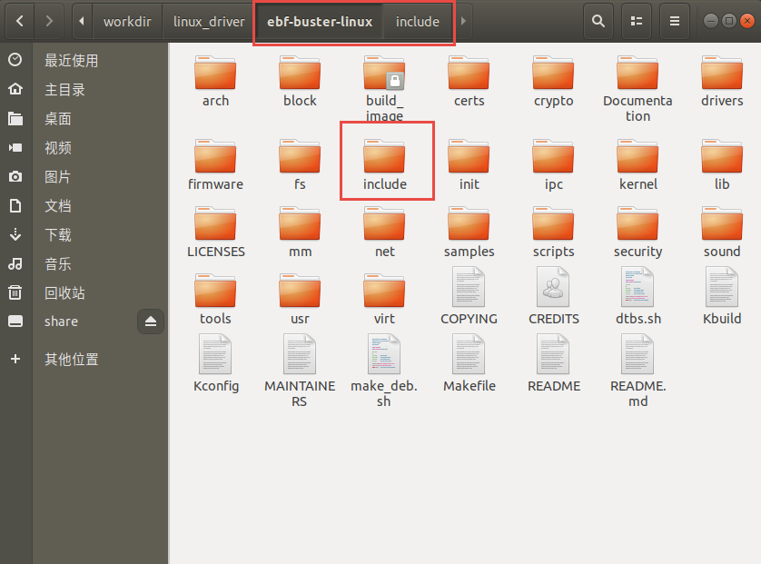

编写内核模块中经常要使用到的头文件有以下两个：<linux/init.h>和<linux/module.h>。
我们可以看到在头文件前面也带有一个文件夹的名字linux，对应了include下的linux文件夹，
我们到该文件夹下，查看这两个头文件都有什么内容。

.. code-block:: c
   :caption: init.h文件（位于内核源码 /include/linux）
   :linenos:

   /* These are for everybody (although not all archs will actually
   discard it in modules) */
   #define __init __section(.init.text) __cold notrace
   #define __initdata __section(.init.data)
   #define __initconst __constsection(.init.rodata)
   #define __exitdata __section(.exit.data)
   #define __exit_call __used __section(.exitcall.exit)
   /**
   * module_init() - driver initialization entry point
    * @x: function to be run at kernel boot time or module insertion
    *
    * module_init() will either be called during do_initcalls() (if
    * builtin) or at module insertion time (if a module).
    There can only
    * be one per module.
    */
    #define module_init(x) __initcall(x);
   
    /**
    * module_exit() - driver exit entry point
    * @x: function to be run when driver is removed
    *
    * module_exit() will wrap the driver clean-up code
    * with cleanup_module() when used with rmmod when
    * the driver is a module.
    the driver is statically
    * compiled into the kernel, module_exit() has no effect.
    * There can only be one per module.
    */
    #define module_exit(x) __exitcall(x);

Init.h头文件主要包含了内核模块的加载、卸载函数的声明，还有一些宏定义，
因此，只要我们涉及内核模块的编程，就需要加上该头文件。

.. code-block:: c
   :caption: module.h（位于内核源码/include/linux）
   :linenos:

   /* Generic info of form tag = "info" */
   #define MODULE_INFO(tag, info) __MODULE_INFO(tag, tag, info)
   /* For userspace: you can also call me...
   */
   #define MODULE_ALIAS(_alias) MODULE_INFO(alias, _alias)
   #define MODULE_LICENSE(_license) MODULE_INFO(license, _license)
   /*
    * Author(s), use "Name <email>" or just "Name", for multiple
    * authors use multiple MODULE_AUTHOR() statements/lines.
    */
    #define MODULE_AUTHOR(_author) MODULE_INFO(author, _author)

以上代码中，列举了module.h文件中的部分宏定义，这部分宏定义，
有的是可有可无的，但是MODULE_LICENSE这个是指定该内核模块的许可证，是必须要有的。

模块加载/卸载函数
:::::::::::::::::::::::::::
module_init
'''''''''''''''''''''''''''
回忆我们使用单片机时，假设我们要使用串口等外设时，是不是都需要调用一个初始化函数，
在这个函数里面，我们初始化了串口的GPIO，配置了串口的相关参数，如波特率，数据位，停止位等等参数。
func_init函数在内核模块中也是做与初始化相关的工作。

.. code-block:: c
   :caption: 内核模块加载函数
   :linenos:

   static int __init func_init(void)
   {
   }
   module_init(func_init);

我们可以看到func_init函数类型为int，该函数返回0，表示模块初始化成功，
并会在/sys/module下新建一个以模块名为名的目录，如下图中的红框处；
返回非0值，表示模块初始化失败。

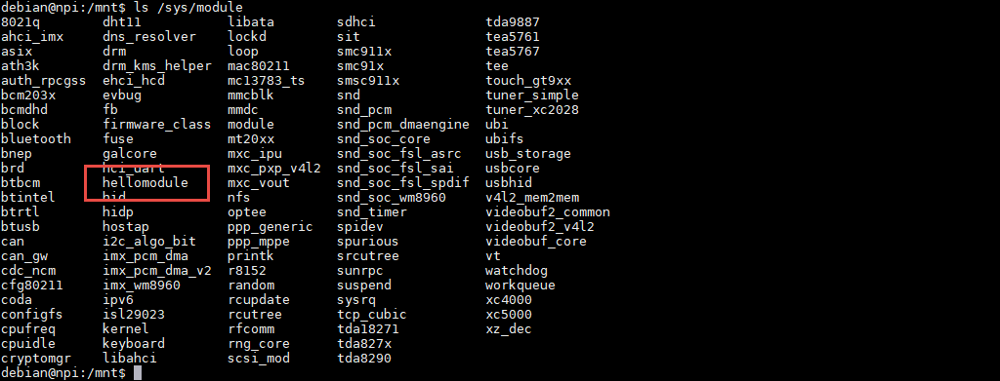

在C语言中，static关键字的作用如下：

1. static修饰的静态局部变量直到程序运行结束以后才释放，延长了局部变量的生命周期；
#. static的修饰全局变量只能在本文件中访问，不能在其它文件中访问；
#. static修饰的函数只能在本文件中调用，不能被其他文件调用。

内核模块的代码，实际上是内核代码的一部分，
假如内核模块定义的函数和内核源代码中的某个函数重复了，
编译器就会报错，导致编译失败，因此我们给内核模块的代码加上static修饰符的话，
那么就可以避免这种错误。

.. code-block:: c
   :caption: __init、__initdata宏定义（位于内核源码/linux/init.h）
   :linenos:

   #define __init __section(.init.text) __cold notrace
   #define __initdata __section(.init.data)

以上代码 __init、__initdata宏定义（位于内核源码/linux/init.h）中的__init用于修饰函数，
__initdata用于修饰变量。带有__init的修饰符，表示将该函数放到可执行文件的__init节区中，
该节区的内容只能用于模块的初始化阶段，初始化阶段执行完毕之后，这部分的内容就会被释放掉，真可谓是“针尖也要削点铁”。

.. code-block:: c
   :caption: module_init宏定义
   :linenos:

   #define module_init(x) __initcall(x);

宏定义module_init用于通知内核初始化模块的时候，
要使用哪个函数进行初始化。它会将函数地址加入到相应的节区section中，
这样的话，开机的时候就可以自动加载模块了。

module_exit
'''''''''''''''''''''''''''
理解了模块加载的内容之后，来学习模块卸载函数应该会比较简单。
与内核加载函数相反，内核模块卸载函数func_exit主要是用于释放初始化阶段分配的内存，
分配的设备号等，是初始化过程的逆过程。

.. code-block:: c
   :caption: 内核模块卸载函数
   :linenos:

   static void __exit func_exit(void)
   {
   }
   module_exit(func_exit);

与函数func_init区别在于，该函数的返回值是void类型，且修饰符也不一样，
这里使用的使用__exit，表示将该函数放在可执行文件的__exit节区，
当执行完模块卸载阶段之后，就会自动释放该区域的空间。

.. code-block:: c
   :caption: __exit、__exitdata宏定义
   :linenos:

   #define __exit __section(.exit.text) __exitused __cold notrace
   #define __exitdata __section(.exit.data)

类比于模块加载函数，__exit用于修饰函数，__exitdata用于修饰变量。
宏定义module_exit用于告诉内核，当卸载模块时，需要调用哪个函数。

printk函数
'''''''''''''''''''''''''''
- printf：glibc实现的打印函数，工作于用户空间
- printk：内核模块无法使用glibc库函数，内核自身实现的一个类printf函数，但是需要指定打印等级。

  - #define KERN_EMERG 	   "<0>" 通常是系统崩溃前的信息
  - #define KERN_ALERT     "<1>" 需要立即处理的消息
  - #define KERN_CRIT      "<2>" 严重情况
  - #define KERN_ERR       "<3>" 错误情况
  - #define KERN_WARNING   "<4>" 有问题的情况
  - #define KERN_NOTICE    "<5>" 注意信息
  - #define KERN_INFO      "<6>" 普通消息
  - #define KERN_DEBUG     "<7>" 调试信息

查看当前系统printk打印等级：`cat /proc/sys/kernel/printk`，
从左到右依次对应当前控制台日志级别、默认消息日志级别、最小的控制台级别、默认控制台日志级别。

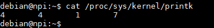

打印内核所有打印信息：dmesg，注意内核log缓冲区大小有限制，缓冲区数据可能被覆盖掉。

模块的声明和描述
:::::::::::::::::::::::::::

许可证
'''''''''''''''''''''''''''
Linux是一款免费的操作系统，采用了GPL协议，允许用户可以任意修改其源代码。
GPL协议的主要内容是软件产品中即使使用了某个GPL协议产品提供的库，
衍生出一个新产品，该软件产品都必须采用GPL协议，即必须是开源和免费使用的，
可见GPL协议具有传染性。因此，我们可以在Linux使用各种各样的免费软件。
在以后学习Linux的过程中，可能会发现我们安装任何一款软件，从来没有30天试用期或者是要求输入激活码的。

.. code-block:: c
   :caption: 许可证
   :linenos:

   #define MODULE_LICENSE(_license) MODULE_INFO(license, _license)

内核模块许可证有 “GPL”，“GPL v2”，“GPL and additional rights”，“Dual SD/GPL”，“Dual MPL/GPL”，“Proprietary”。

相关信息声明
'''''''''''''''''''''''''''
下面，我们介绍一下关于内核模块程序结构的最后一部分内容。
这部分内容只是为了给使用该模块的读者一本“说明书”，属于可有可无的部分，
有则锦上添花，若没有也无伤大雅。

表  内核模块信息声明函数

======================= ==============================================================================================
函数                    作用
======================= ==============================================================================================
MODULE_LICENSE()        表示模块代码接受的软件许可协议，Linux内核遵循GPL V2开源协议，内核模块与linux内核保持一致即可。
MODULE_AUTHOR()         描述模块的作者信息
MODULE_DESCRIPTION()    对模块的简单介绍
MODULE_ALIAS()          给模块设置一个别名
======================= ==============================================================================================

作者信息

.. code-block:: c
   :caption: 内核模块作者宏定义（位于内核源码/linux/module.h）
   :linenos:

   #define MODULE_AUTHOR(_author) MODULE_INFO(author, _author)

我们前面使用modinfo中打印出的模块信息中“author”信息便是来自于宏定义MODULE_AUTHOR。
该宏定义用于声明该模块的作者。

模块描述信息

.. code-block:: c
   :caption: 模块描述信息（位于内核源码/linux/module.h）
   :linenos:

   #define MODULE_DESCRIPTION(_description) MODULE_INFO(description, _description)

模块信息中“description”信息则来自宏MODULE_DESCRIPTION，该宏用于描述该模块的功能作用。

模块别名

.. code-block:: c
   :caption: 内核模块别名宏定义（位于内核源码/linux/module.h）
   :linenos:

   #define MODULE_ALIAS(_alias) MODULE_INFO(alias, _alias)

模块信息中“alias”信息来自于宏定义MODULE_ALIAS。该宏定义用于给内核模块起别名。
注意，在使用该模块的别名时，需要将该模块复制到/lib/modules/内核源码/下，
使用命令depmod更新模块的依赖关系，否则的话，Linux内核怎么知道这个模块还有另一个名字。

Makefile
:::::::::::::::::::::::::::
对于内核模块而言，它是属于内核的一段代码，只不过它并不在内核源码中。
为此，我们在编译时需要到内核源码目录下进行编译。
编译内核模块使用的Makefile文件，和我们前面编译C代码使用的Makefile大致相同，
这得益于编译Linux内核所采用的Kbuild系统，因此在编译内核模块时，我们也需要指定环境变量ARCH和CROSS_COMPILE的值。

.. code-block:: makefile
   :caption: ../base_code/linux_driver/hellomodule/Makefile
   :linenos:

   KERNEL_DIR=/home/pi/build

   ARCH=arm
   CROSS_COMPILE=arm-linux-gnueabihf-
   export  ARCH  CROSS_COMPILE
   obj-m := hellomodule.o
   all:
	   $(MAKE) -C $(KERNEL_DIR) M=$(CURDIR) modules
   .PHONE:clean copy
   clean:
	   $(MAKE) -C $(KERNEL_DIR) M=$(CURDIR) clean	
   copy:
	   sudo  cp  *.ko  /home/embedfire/workdir

以上代码中提供了一个关于编译内核模块的Makefile。
该Makefile定义了变量KERNEL_DIR，来保存内核源码的目录。
变量obj-m保存着需要编译成模块的目标文件名。
'$(MAKE)modules'实际上是执行Linux顶层Makefile的伪目标modules。
通过选项'-C'，可以让make工具跳转到源码目录下读取顶层Makefile。
'M=$(CURDIR)'表明返回到当前目录，读取并执行当前目录的Makefile，开始编译内核模块。
CURDIR是make的内嵌变量，自动设置为当前目录。

实验操作与现象
>>>>>>>>>>>>>>>>>>>>>>>>>>>
理清楚代码的基本结构，我们就要构建环境来运行我们的代码了，
如果想要我们写的内核模块在某个版本的内核上运行，那么就必须在该内核版本上编译它，
如果我们编译的内核与我们运行的内核具备不相同的特性，那么编译生成的内核模组就无法运行，
为了严谨起见，我们编译的内核模组要在开发板上运行，我们就需要知道开发板的内核版本，
使用'uname -r'命令可以查看对应的内核版本。

同时我们可以从github或者gitee上克隆开发板的Debian镜像内核源码，国内推荐使用gitee下载，当然首先需要安装git工具。
github:
::

   git clone https://gitee.com/Embedfire/ebf-buster-linux.git

gitee:
::

   git clone https://gitee.com/Embedfire/ebf-buster-linux.git

驱动进入内核有两种方式，编译成模块和直接编译进内核；
前面我们就了解到了模块是具有独立功能的程序，它可以被单独编译，但不能独立运行，
在运行时它被链接到内核作为内核的一部分在内核空间运行，而它在编译的时候也必须依赖
内核，所以我们有必要在编译内核模块之前先编译内核。

编译内核
:::::::::::::::::::::::::::
在编译源码之前我们需要先安装如下工具，执行后面的脚本即可：

   - gcc-arm-linux-gnueabihf  交叉编译器
   - bison 语法分析器
   - flex  词法分析器
   - libssl-dev OpenSSL通用库
   - lzop LZO压缩库的压缩软件

::

   sudo apt install make gcc-arm-linux-gnueabihf gcc bison flex libssl-dev dpkg-dev lzop

切换到内核源码目录下，我们可以找到make_deb.sh脚本，里面有我们配置好的参数，只需要执行便可编译内核。
编译出来的内核相关文件位置，由脚本中的ebf-buster-linux/make_deb.sh中build_opts="${build_opts} O=build_image/build" 指定。

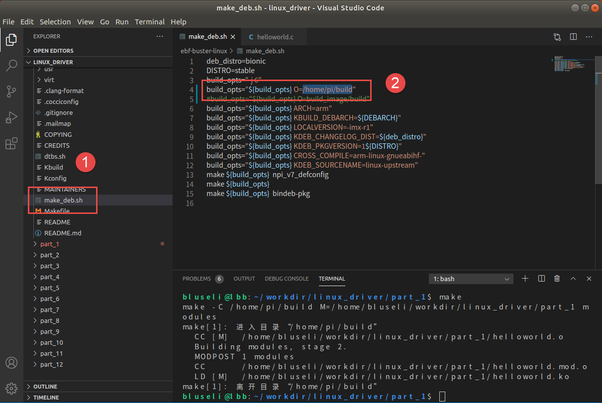

接下来我们不妨简单了解一些内核的构建原理。

内核的构建原理
'''''''''''''''''''''''''''
首先是make_deb.sh脚本

.. code:: bash

   deb_distro=bionic
   DISTRO=stable
   build_opts="-j 6"
   #指定编译好的内核放置位置
   build_opts="${build_opts} O=build_image/build"
   #编译出来的目标是针对ARM体系结构的内核
   build_opts="${build_opts} ARCH=arm"
   build_opts="${build_opts} KBUILD_DEBARCH=${DEBARCH}"
   build_opts="${build_opts} LOCALVERSION=-imx-r1"
   build_opts="${build_opts} KDEB_CHANGELOG_DIST=${deb_distro}"
   build_opts="${build_opts} KDEB_PKGVERSION=1${DISTRO}"
   #指定交叉编译器为arm-linux-gnueabihf-
   build_opts="${build_opts} CROSS_COMPILE=arm-linux-gnueabihf-" 
   build_opts="${build_opts} KDEB_SOURCENAME=linux-upstream"
   make ${build_opts}  npi_v7_defconfig
   make ${build_opts}  
   make ${build_opts}  bindeb-pkg

编译hellomodule
:::::::::::::::::::::::::::

在内核源码外编译
'''''''''''''''''''''''''''
1.获取内核模块示例源码，将配套代码 /base_code/linux_driver/module/hellomodule 解压到内核代码同级目录

github:
::

   git clone https://github.com/Embedfire-imx6/embed_linux_tutorial

gitee:
::

   git clone https://gitee.com/Embedfire-imx6/embed_linux_tutorial

2.内核模块对象所需的构建步骤和编译很复杂，它利用了linux内核构建系统的强大功能，
当然我们不需要深入了解这部分知识，利用简单的Make工具就能编译出我们想要的内核模块。
::

   cd hellomodule
   make

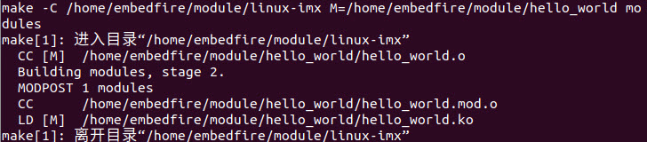

注意该目录下的Makefile中 "KERNEL_DIR=../ebf-buster-linux/build_image/build"要与前面编译的内核所在目录一致。
查看文件夹，新增hellomodule.ko，这就是我们自己编写、编译的内核模块。
使用file hellomodule.ko查看当前编译的文件，32-bit ARM架构的ELF文件。
::

   file hellomodule.ko
   hellomodule.ko: ELF 32-bit LSB relocatable, ARM, EABI5 version 1 (SYSV),
   BuildID[sha1]=1a139278874b2e1a335f1834e755d2cf3f9a4bff, not stripped

如何使用内核模块
:::::::::::::::::::::::::::
我们如愿编译了自己的内核模块，接下来就该了解如何使用这个内核模块了。
将hellomodule.ko通过scp或NFS拷贝到开发板中，我们来逐一讲解这些工具。

lsmod
'''''''''''''''''''''''''''
lsmod列出当前内核中的所有模块，格式化显示在终端，其原理就是将/proc/module中的信息调整一下格式输出。
lsmod输出列表有一列 Used by， 它表明此模块正在被其他模块使用，显示了模块之间的依赖关系。

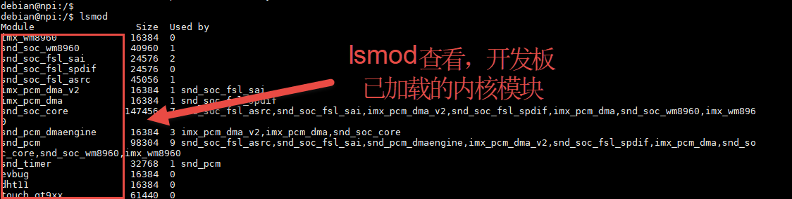

insmod
'''''''''''''''''''''''''''
如果要将一个模块加载到内核中，insmod是最简单的办法，
insmod+模块完整路径就能达到目的，前提是你的模块不依赖其他模块，还要注意需要sudo权限。
如果你不确定是否使用到其他模块的符号，你也可以尝试modprobe，后面会有它的详细用法。

通过insmod命令加载hellomodule.ko内存模块加载该内存模块的时候，
该内存模块会自动执行module_init()函数，进行初始化操作，该函数打印了 'hello module init'。
再次查看已载入系统的内核模块，我们就会在列表中发现hellomodule.ko的身影。

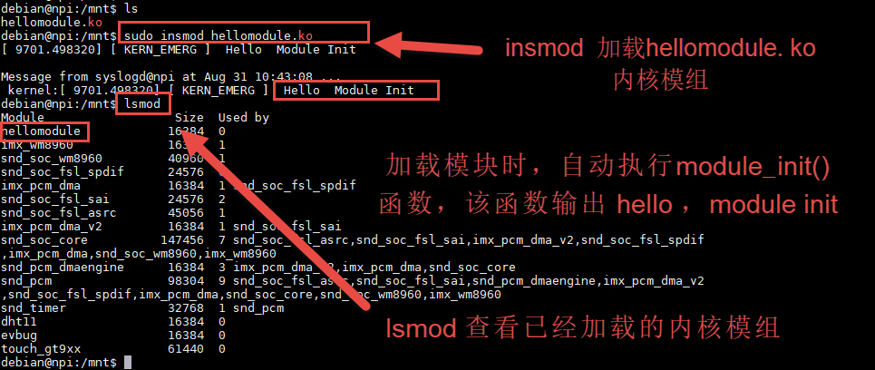

在我们内核模块传参与符号共享实验这一小节，calculation.ko和parametermodule.ko。
其中calculation.ko依赖parametermodule.ko中的参数和函数，
所以先手动加载parametermodule.ko，然后再加载calculation.ko。

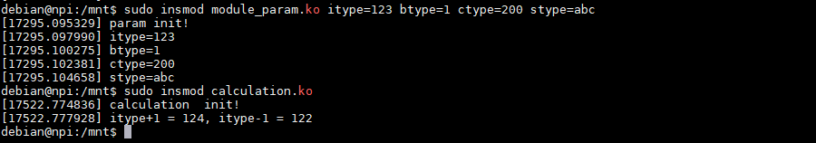

同样卸载的时，parametermodule.ko中的参数和函数被calculation.ko调用，必须先卸载calculation.ko
再卸载parametermodule.ko，否则会报错"ERROR: Module parametermodule is in use by: calculation"

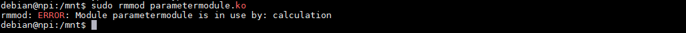

modprobe
'''''''''''''''''''''''''''
modprobe和insmod具备同样的功能，同样可以将模块加载到内核中，除此以外modprobe还能检查模块之间的依赖关系，
并且按照顺序加载这些依赖，可以理解为按照顺序多次执行insmod。

在内核模块传参与符号共享实验中，calculation.ko和parametermodule.ko需要按照先后次序依次加载，而使用modprobe工具，
可以直接加载parametermodule.ko，当然modprobe之前需要先用depmod -a建立模块之间的依赖关系。

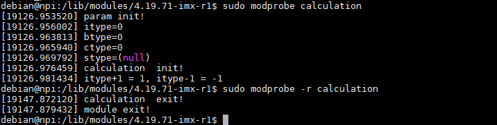

depmod
'''''''''''''''''''''''''''
modprobe是怎么知道一个给定模块所依赖的其他的模块呢？在这个过程中，depend起到了决定性作用，当执行modprobe时，
它会在模块的安装目录下搜索module.dep文件，这是depmod创建的模块依赖关系的文件。

rmmod
'''''''''''''''''''''''''''
rmod工具仅仅是将内核中运行的模块删除，只需要传给它路径就能实现。

rmmod命令卸载某个内存模块时，内存模块会自动执行*_exit()函数，进行清理操作，
我们的hellomodule中的*_exit()函数打印了一行内容，但是控制台并没有显示，可以使用dmesg查看，
之所以没有显示是与printk的打印等级有关，前面有关于printk函数有详细讲解。
rmmod不会卸载一个模块所依赖的模块，需要依次卸载，当然是用modprobe -r 可以一键卸载。

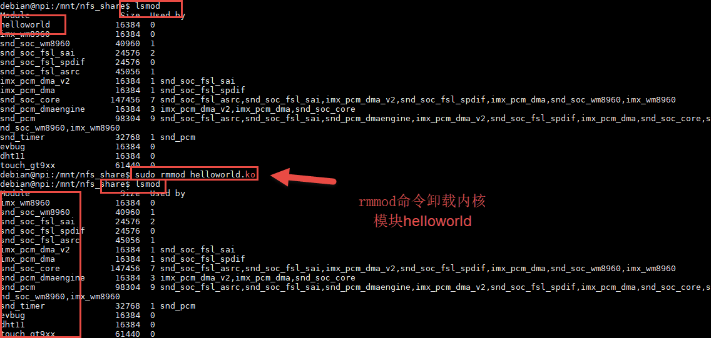

modinfo
'''''''''''''''''''''''''''
modinfo用来显示我们在内核模块中定义的几个宏。
我们可以通过modinfo来查看hellomodule，我们从打印的输出信息中，可以了解到，该模块遵循的是GPL协议，
该模块的作者是embedfire，该模块的vermagic等等。而这些信息在模块代码中由相关内核模块信息声明函数声明

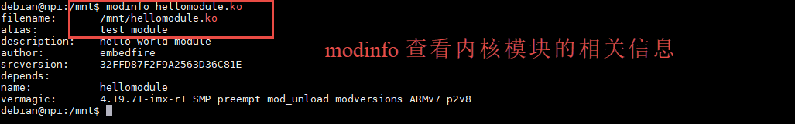

系统自动加载模块
:::::::::::::::::::::::::::
我们自己编写了一个模块，或者说怎样让它在板子开机自动加载呢？
这里就需要用到上述的depmod和modprobe工具了。

首先需要将我们想要自动加载的模块统一放到"/lib/modules/内核版本"目录下，内核版本使用'uname -r'查询；
其次使用depmod建立模块之间的依赖关系，命令' depmod -a'；
这个时候我们就可以在modules.dep中看到模块依赖关系，可以使用如下命令查看；
::

   cat /lib/modules/内核版本/modules.dep | grep calculation

最后在/etc/modules加上我们自己的模块，注意在该配置文件中，模块不写成.ko形式代表该模块与内核紧耦合，有些是系统必须要跟内核紧耦合，比如mm子系统，
一般写成.ko形式比较好，如果出现错误不会导致内核出现panic错误，如果集成到内核，出错了就会出现panic。

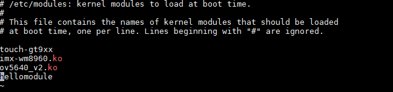

然后重启开发板，lsmod就能查看到我们的模块开机就被加载到内核里面了。

内核模块传参与符号共享实验
---------------------------

内核模块传参
>>>>>>>>>>>>>>>>>>>>>>>>>>>
内核模块作为一个可拓展的动态模块，为Linux内核提供了灵活性，但是有时我们需要根据不同的应用场景给内核传递不同的参数，
例如在程序中开启调试模式、设置详细输出模式以及制定与具体模块相关的选项，都可以通过参数的形式来改变模块的行为。

Linux内核提供一个宏来实现模块的参数传递

.. code-block:: c
   :caption: ebf_buster_linux\include\linux\moduleparam.h
   :linenos:

   #define module_param(name, type, perm) \\
   module_param_named(name, name, type, perm)
   #define module_param_array(name, type, nump, perm) \\
   module_param_array_named(name, name, type, nump, perm)

以上代码中的module_param函数需要传入三个参数：

-  参数name——我们定义的变量名；
-  参数type——参数的类型，目前内核支持的参数类型有byte，short，
   ushort，int，uint，long，ulong，charp，bool，invbool。
   其中charp表示的是字符指针，bool是布尔类型，其值只能为0或者是1；
   invbool是反布尔类型，其值也是只能取0或者是1，但是true值表示0，false表示1。
   变量是char类型时，传参只能是byte，char * 时只能是charp。

-  参数perm表示的是该文件的权限，具体参数值见下表。

   表  文件权限

   ========== ========= ================================
   标志位      含义
   ========== ========= ================================
   当前用户    S_IRUSR     用户拥有读权限
   \           S_IWUSR     用户拥有写权限
   当前用户组   S_IRGRP     当前用户组的其他用户拥有读权限
   \           S_IWGRP     当前用户组的其他用户拥有写权限
   其他用户    S_IROTH     其他用户拥有读权限 
   \           S_IWOTH     其他用户拥有写权限
   ========== ========= ================================

   上述文件权限唯独没有关于可执行权限的设置，请注意，
   该文件不允许它具有可执行权限。如果强行给该参数赋予表示可执行权限的参数值S_IXUGO，
   那么最终生成的内核模块在加载时会提示错误，见下图。

   .. image:: media/module016.png
      :align: center
      :alt:   参数不可赋予可执行权限

代码分析
:::::::::::::::::::::::::::
下面是我们一个例子，首先我们定义了四个常见变量然后使用module_param宏来声明这四个参数，
并在calculation_init中输出上述四个参数的值。

.. code-block:: c
   :caption: 示例程序
   :linenos:

   
   static int itype=0;
   module_param(itype,int,0);

   static bool btype=0;
   module_param(btype,bool,0644);

   static char ctype=0;
   module_param(ctype,byte,0);

   static char  *stype=0;
   module_param(stype,charp,0644);

   static int __init param_init(void)
   {
      printk(KERN_ALERT "param init!\n");
      printk(KERN_ALERT "itype=%d\n",itype);
      printk(KERN_ALERT "btype=%d\n",btype);
      printk(KERN_ALERT "ctype=%d\n",ctype);
      printk(KERN_ALERT "stype=%s\n",stype);
      return 0;
   }

我们定义的四个模块参数，会在 '/sys/module/模块名/parameters' 下会存在以模块参数为名的文件。
，由于itype和ctype的权限是0，所以我们没有权限查看该参数。

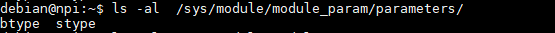

通过NFS将编译好的module_param.ko拷贝到开发板中，加载module_param.ko并传参，
这时我们声明的四个变量的值，就是变成了我们赋的值。
::

   sudo insmod module_param.ko itype=123 btype=1 ctype=200 stype=abc

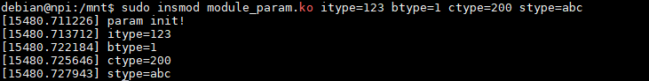

符号共享
>>>>>>>>>>>>>>>>>>>>>>>>>>>
在前面我们已经详细的分析了关于导出符号的内核源码，符号指的就是在内核模块中导出函数和变量，
在加载模块时被记录在公共内核符号表中，以供其他模块调用。
这个机制，允许我们使用分层的思想解决一些复杂的模块设计。我们在编写一个驱动的时候，
可以把驱动按照功能分成几个内核模块，借助符号共享去实现模块与模块之间的接口调用，变量共享。

.. code-block:: c
   :caption: 导出符号
   :linenos:

   #define EXPORT_SYMBOL(sym) \\
   __EXPORT_SYMBOL(sym, "")

EXPORT_SYMBOL宏用于向内核导出符号，这样的话，其他模块也可以使用我们导出的符号了。
下面通过一段代码，介绍如何使用某个模块导出符号。

.. code-block:: c
   :caption: parametermodule.c
   :linenos:

   ...省略代码...
   static int itype=0;
   module_param(itype,int,0);

   EXPORT_SYMBOL(itype);

   int my_add(int a, int b)
   {
      return a+b;
   }

   EXPORT_SYMBOL(my_add);

   int my_sub(int a, int b)
   {
      return a-b;
   }

   EXPORT_SYMBOL(my_sub);
   ...省略代码...

在parametermodule.c中定义了参数itype和my_add、my_sub函数，并通过EXPORT_SYMBOL宏导出。
以上代码中，省略了内核模块程序的其他内容，如头文件，加载/卸载函数等。

.. code-block:: c
   :caption: calculation.h
   :linenos:

   #ifndef __CALCULATION_H__
   #define __CALCULATION_H__

   extern int itype;

   int my_add(int a, int b);
   int my_sub(int a, int b);

   #endif

.. code-block:: c
   :caption: calculation.c
   :linenos:

   ...省略代码...
   #include "calculation.h"

   ...省略代码...
   static int __init calculation_init(void)
   {
      printk(KERN_ALERT "calculation  init!\n");
      printk(KERN_ALERT "itype+1 = %d, itype-1 = %d\n", my_add(itype,1), my_sub(itype,1));    
      return 0;
   }
   ...省略代码...

calculation.c中使用extern关键字声明的参数itype，调用my_add()、my_sub()函数进行计算。 

查看向内核导出的符号表 'cat /proc/kallsyms'

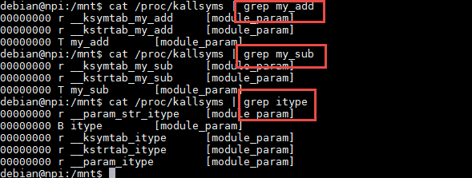

实验与现象
>>>>>>>>>>>>>>>>>>>>>>>>>>>
介绍了符号共享的原理，以及代码实现，最后我们来看看内核模块传参与符号共享实验的现象。
获取内核模块源码，将配套代码 /base_code/linux_driver/module/parametermodule 解压到内核代码同级目录，直接编译即可。
注意该目录下的Makefile中 "KERNEL_DIR=../ebf-buster-linux/build_image/build"要与前面编译的内核所在目录一致。
查看文件夹，新增calculation.ko和parametermodule.ko。

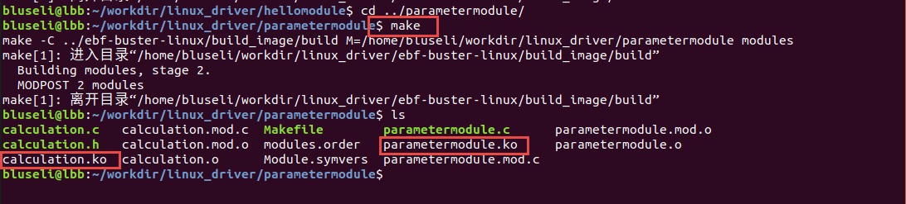

借助insmod，modprobe工具安装这两个模块吧。
