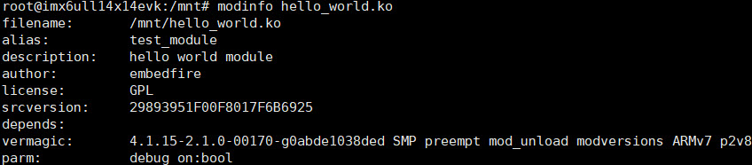
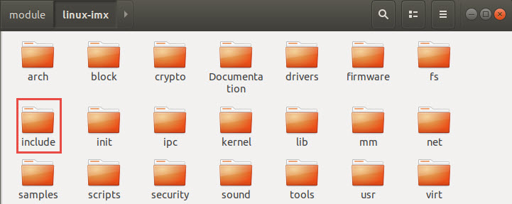
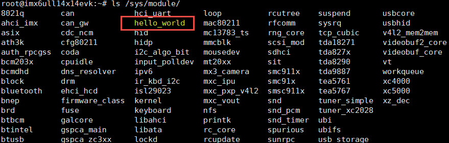
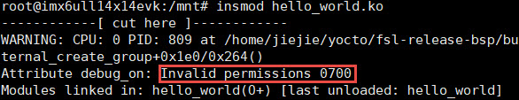
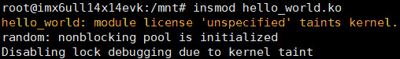
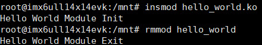
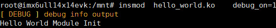

.. vim: syntax=rst

内核模块
----

本章节内容处于开发笔记状态，还待整理至最终版的教程。

本章节内容处于开发笔记状态，还待整理至最终版的教程。

从本章开始，我们就要真真正正地步入Linux设备驱动的殿堂了。了解一样新事物，无非就是围绕这“这东西是什么”，“这东西怎么用”，“能不能给我整一个”这三个问题。

本章大致分为三个部分：

1. 介绍内核模块：内核模块是什么东西？可以用来做什么？为什么需要它？这部分主要用于解决第一个问题；

2. 介绍内核模块相关的命令，这部分内容很明显是为了解决第二个问题；

3. 如何自己写一个简单的模块，学完本节内容就可以给自己整一个简单的内核模块。

为什么需要内核模块
~~~~~~~~~

内核按照体系结构分为两类：微内核（microkernel）和宏内核（macrokernel）。

Windows操作系统、华为的鸿蒙操作系统就属于微内核结构。微内核是提供操作系统核心功能的内核的精简版，实现进程管理、存储器管理、进程间通信、I/O设备管理等基本功能，其他功能模块则需要单独进行编译，具有动态扩展性的优点。

而Linux操作系统则是采用了宏内核结构。宏内核是将内核所有的功能都编译成一个整体，其优点是执行效率非常高，缺点也是十分明显的，一旦我们想要修改、增加内核某个功能时，都需要重新编译一遍内核。

为了解决这个问题，Linux引入了内核模块这一机制。内核模块就是实现了某个功能的一段内核代码，在内核运行过程，可以加载这部分代码到内核中， 从而动态地增加了内核的功能。基于这种特性，我们进行设备驱动开发时，以内核模块的形式编写设备驱动，只需要编译相关的驱动代码即可，无需对整个内核进行编译。

内核模块相关命令
~~~~~~~~

通过上一节的学习，我们知道了内核模块是什么东西，那么学完本小节的内容，我们就知道内核模块该如何使用。Linux提供了关于内核模块的一系列命令，见表格 56‑1 内核模块相关命令。

表格 56‑1 内核模块相关命令

======== ==============================================================================================
命令     作用
======== ==============================================================================================
lsmod    用于显示所有已载入系统的内核模块。
insmod   用于加载内核模块，通常可载入的模块一般是设备驱动程序
rmmod    用于卸载不需要的模块。
modinfo  用于显示内核模块的相关信息。
depmod   用于分析检测内核模块之间的依赖关系。
modprobe 同样用于加载内核模块，与insmod不同，modprobe会根据depmod产生的依赖关系，加载依赖的的其他模块。
======== ==============================================================================================

在本章的例程文件中，提供了一个hello_world.ko的内核模块。我们可以使用命令modinfo，来查看该模块的相关信息。

|module002|

图 56‑1 hello_world模块信息

我们从打印的输出信息中，可以得到该模块的相关说明，如该模块遵循的是GPL协议，该模块的作者是embedfire，该模块的vermagic等等。出于对安全的考虑，Linux内核会对加载的内核模块进行严格的版本检查，在加载模块时，模块加载器会比较所保存的内核vermagic与此模块的vermagic信息
是否一致，只有两者完全一致时，模块才能被成功加载，即便小版本号不一致也会导致加载失败。

内核模块程序结构
~~~~~~~~

内核模块程序的基本结构包括了以下几个部分：

1. 头文件；

2. 内核模块加载/卸载函数；

3. 内核模块的参数；

4. 内核模块导出符号；

5. 内核模块的许可证；

6. 内核模块的其他信息，如作者，模块的描述信息，模块的别名等；

本章将围绕上述的六个部分的内容，一步一步带大家写一个helloworld的内核模块。

代码清单 56‑1 内核模块的基本框架（伪代码）

1 头文件

2

3 内核模块参数

4

5 内核模块加载/卸载函数

6

7 内核模块许可证

8

9 内核模块导出符号

10

11内核模块的其他信息

头文件
^^^

前面我们已经接触过了Linux的应用编程，了解到Linux的头文件都存放在/usr/include中。编写内核模块所需要的头文件，并不在上述说到的目录，而是在Linux内核源码（资料位置——待补充）中的include文件夹。

|module003|

图 56‑2 头文件存放位置

编写内核模块中经常要使用到的头文件有以下两个：<linux/init.h>和<linux/module.h>。我们可以看到在头文件前面也带有一个文件夹的名字linux，对应了include下的linux文件夹，我们到该文件夹下，查看这两个头文件都有什么内容。

代码清单 56‑2 init.h文件（位于内核源码 /include/linux）

1 /\* These are for everybody (although not all archs will actually

2 discard it in modules) \*/

3 #define \__init \__section(.init.text) \__cold notrace

4 #define \__initdata \__section(.init.data)

5 #define \__initconst \__constsection(.init.rodata)

6 #define \__exitdata \__section(.exit.data)

7 #define \__exit_call \__used \__section(.exitcall.exit)

8 /*\*

9 \* module_init() - driver initialization entry point

10 \* @x: function to be run at kernel boot time or module insertion

11 \*

12 \* module_init() will either be called during do_initcalls() (if

13 \* builtin) or at module insertion time (if a module).
There can only

14 \* be one per module.

15 \*/

16 #define module_init(x) \__initcall(x);

17

18 /*\*

19 \* module_exit() - driver exit entry point

20 \* @x: function to be run when driver is removed

21 \*

22 \* module_exit() will wrap the driver clean-up code

23 \* with cleanup_module() when used with rmmod when

24 \* the driver is a module.
If the driver is statically

25 \* compiled into the kernel, module_exit() has no effect.

26 \* There can only be one per module.

27 \*/

28 #define module_exit(x) \__exitcall(x);

Init.h头文件主要包含了内核模块的加载、卸载函数的声明，还有一些宏定义，因此，只要我们涉及内核模块的编程，就需要加上该头文件。

代码清单 56‑3 module.h（位于内核源码/include/linux）

1 /\* Generic info of form tag = "info" \*/

2 #define MODULE_INFO(tag, info) \__MODULE_INFO(tag, tag, info)

3

4 /\* For userspace: you can also call me...
\*/

5 #define MODULE_ALIAS(_alias) MODULE_INFO(alias, \_alias)

6

7 #define MODULE_LICENSE(_license) MODULE_INFO(license, \_license)

8

9 /\*

10 \* Author(s), use "Name <email>" or just "Name", for multiple

11 \* authors use multiple MODULE_AUTHOR() statements/lines.

12 \*/

13 #define MODULE_AUTHOR(_author) MODULE_INFO(author, \_author)

代码清单 56‑3中，列举了module.h文件中的部分宏定义，这部分宏定义，有的是可有可无的，但是MODULE_LICENSE这个是指定该内核模块的许可证，是必须要有的。

加载和卸载内核
^^^^^^^

内核模块加载函数
''''''''

回忆我们学过的STM32，假设我们要使用串口，是不是有一个BSP_USART_INIT函数，在这个函数里面，我们初始化了串口的GPIO，配置了串口的相关参，如波特率，数据位，停止位等等参数。func_init函数通常也是负责这部分内容的。

代码清单 56‑4 内核模块卸载函数

1 static int \__init func_init(void)

2 {

3 }

4 module_init(func_init);

我们可以看到func_init函数类型为int，该函数返回0，表示模块初始化成功，并会在/sys/module下新建一个以模块名为名的目录，如图 56‑3中的红框处；返回非0值，表示模块初始化失败。

|module004|

图 56‑3 sys目录下module文件夹

在C语言中，static关键字的作用如下：1、static修饰的静态局部变量直到程序运行结束以后才释放，延长了局部变量的生命周期；2、static的修饰全局变量只能在本文件中访问，不能在其它文件中访问；3、static修饰的函数只能在本文件中调用，不能被其他文件调用。内核模块的代码，实际上是内核代码
的一部分，假如内核模块定义的函数和内核源代码中的某个函数重复了，编译器就会报错，导致编译失败，因此我们给内核模块的代码加上static修饰符的话，那么就可以避免这种错误。

代码清单 56‑5 \__init、__initdata宏定义（位于内核源码/linux/init.h）

1 #define \__init \__section(.init.text) \__cold notrace

2 #define \__initdata \__section(.init.data)

Linux内核的栈资源十分有限，可能只有一个4096字节大小的页，我们编写的函数与Linux内核共享同一个栈资源。可想而知，如果在我们的模块程序中定义了一个大的局部数组变量，那么有可能大致导致堆栈溢出，因此，如果需要很大的空间的变量，应该使用动态分配。

代码清单 56‑5 \__init、__initdata宏定义（位于内核源码/linux/init.h）中的__init用于修饰函数，__initdata用于修饰变量。带有__init的修饰符，表示将该函数放到可执行文件的__init节区中，该节区的内容只能用于模块的初始化阶段，初始化阶段执行完毕之
后，这部分的内容就会被释放掉，真可谓是“针尖也要削点铁”。

代码清单 56‑6 module_init宏定义

1 #define module_init(x) \__initcall(x);

宏定义module_init用于通知内核初始化模块的时候，要使用哪个函数进行初始化。它会将函数地址加入到相应的节区section中，这样的话，开机的时候就可以自动加载模块了。

内核模块卸载函数
''''''''

理解了模块加载的内容之后，来学习模块卸载函数应该会比较简单。与内核加载函数相反，内核模块卸载函数func_exit主要是用于释放初始化阶段分配的内存，分配的设备号等，是初始化过程的逆过程。

代码清单 56‑7 内核模块卸载函数

1 static void \__exit func_exit(void)

2 {

3 }

4 module_exit(func_exit);

与函数func_init区别在于，该函数的返回值是void类型，且修饰符也不一样，这里使用的使用__exit，表示将该函数放在可执行文件的__exit节区，当执行完模块卸载阶段之后，就会自动释放该区域的空间。

代码清单 56‑8 \__exit、__exitdata宏定义

1 #define \__exit \__section(.exit.text) \__exitused \__cold notrace

2 #define \__exitdata \__section(.exit.data)

类比于模块加载函数，__exit用于修饰函数，__exitdata用于修饰变量。宏定义module_exit用于告诉内核，当卸载模块时，需要调用哪个函数。

内核模块参数
^^^^^^

我们调试代码时，偶尔会需要串口来输出一些调试信息，方便我们找到问题的所在。但在正常运行的时候，我们是不需要串口输出信息的。为此，我们使用一个宏定义，来控制串口调试信息的输出，见代码清单 56‑9。

代码清单 56‑9 示例程序

1 #define GTP_DEBUG_ON 1

2 #define GTP_DEBUG_ARRAY_ON 1

3 #define GTP_DEBUG_FUNC_ON 0

4 // Log define

5 #define GTP_INFO(fmt,arg...) printf("<<-GTP-INFO->> "fmt"\n",##arg)

6 #define GTP_ERROR(fmt,arg...) printf("<<-GTP-ERROR->> "fmt"\n",##arg)

7 #define GTP_DEBUG(fmt,arg...) do{\\

8 if(GTP_DEBUG_ON)\\

9 printf("<<-GTP-DEBUG->> [%d]"fmt"\n",__LINE__, ##arg);\\

10 }while(0)

在调试内核模块的时候，我们可以使用module_param函数来定义一个变量，控制调试信息的输出。

代码清单 56‑10 内核模块参数宏定义（位于内核源码/linux/moduleparam.h）

1 #define module_param(name, type, perm) \\

2 module_param_named(name, name, type, perm)

3 #define module_param_array(name, type, nump, perm) \\

4 module_param_array_named(name, name, type, nump, perm)

代码清单 56‑10中的module_param函数需要传入三个参数：参数name——我们定义的变量名；参数type——参数的类型，目前内核支持的参数类型有byte，short， ushort，
int，uint，long，ulong，charp，bool，invbool。其中charp表示的是字符指针，bool是布尔类型，其值只能为0或者是1；invbool是反布尔类型，其值也是只能取0或者是1，但是true值表示0，false表示1。

|module005|

图 56‑4 模块参数对应的文件

如果我们定义了一个模块参数，则会在/sys/module/模块名/ parameters下会存在以模块参数为名的文件，图 56‑4中的debug_on是本章实验编写的内核模块hello_world中定义的模块参数，加载内核模块，可以通过“insmod
debug_on=1”来输出调试信息。参数perm表示的是该文件的权限，具体参数值见表格 56‑2。

表格 56‑2 文件权限

======== ======= ==============================
标志位   含义
======== ======= ==============================
当前用户 S_IRUSR 用户拥有读权限
\        S_IWUSR 用户拥有写权限
当前     S_IRGRP 当前用户组的其他用户拥有读权限

用户组           \        S_IWGRP 当前用户组的其他用户拥有写权限 其他用户 S_IROTH 其他用户拥有读权限 \        S_IWOTH 其他用户拥有写权限 ======== ======= ==============================

上述文件权限唯独没有关于可执行权限的设置，请注意，该文件不允许该文件具有可执行权限，如开发板使用的内核版本为4.1.15，设置该权限参数值为S_IXUGO，加载内核模块时会提示错误，见图 56‑5。

|module006|

图 56‑5 错误提示

内核模块导出符号
^^^^^^^^

内核模块导出符号，符号是什么东西？实际上，符号指的就是函数和变量。当模块被装入内核后，它所导出的符号都会记录在内核符号表中。在使用命令insmod加载模块后，模块就被连接到了内核，因此可以访问内核的共用符号。

代码清单 56‑11 导出符号

1 #define EXPORT_SYMBOL(sym) \\

2 \__EXPORT_SYMBOL(sym, "")

EXPORT_SYMBOL宏用于向内核导出符号，这样的话，其他模块也可以使用我们导出的符号了。下面通过一段代码，介绍如何使用某个模块导出符号。

代码清单 56‑12 file1.c

1 ...省略代码...

2 void func(void)

3 {

4

5 }

6 EXPORT_SYMBOL(func);

7 ...省略代码...

我们file1中定义了一个func函数，并通过EXPORT_SYMBOL宏将该函数导出。代码清单 56‑12中，省略了内核模块程序的其他内容，如头文件，加载/卸载函数等。

代码清单 56‑13 file2.c

1 ...省略代码...

2 extern void func1(void);

3 void func2(void)

4 {

5 func1();

6 }

7 ...省略代码...

file2.c中使用extern关键字声明函数func1，这样我们就可以使用file1.c文件中的func1了。

内核模块许可证
^^^^^^^

Linux是一款免费的操作系统，采用了GPL协议，允许用户可以任意修改其源代码。GPL协议的主要内容是软件产品中即使使用了某个GPL协议产品提供的库，衍生出一个新产品，该软件产品都必须采用GPL协议，即必须是开源和免费使用的，可见GPL协议具有传染性。因此，我们可以在Linux使用各种各样的免费软件
。在以后学习Linux的过程中，可能会发现我们安装任何一款软件，从来没有30天试用期或者是要求输入激活码的。

在Linux内核版本2.4.10之后，模块必须通过MODULE_LICENSE宏声明此模块的许可证，否则在加载此模块时，会提示内核被污染，见图 56‑6。

代码清单 56‑14 许可证

1 #define MODULE_LICENSE(_license) MODULE_INFO(license, \_license)

|module007|

图 56‑6 内核被污染

内核模块许可证有 “GPL”，“GPL v2”，“GPL and additional rights”，“Dual SD/GPL”，“Dual MPL/GPL”，“Proprietary”。

内核模块的其他信息
^^^^^^^^^

下面，我们介绍一下关于内核模块程序结构的最后一部分内容。这部分内容只是为了给使用该模块的读者一本“说明书”，属于可有可无的部分，有则锦上添花，无则也无伤大雅。

作者
''

代码清单 56‑15 内核模块作者宏定义（位于内核源码/linux/module.h）

1 #define MODULE_AUTHOR(_author) MODULE_INFO(author, \_author)

我们前面使用modinfo中打印出的模块信息中“author”信息便是来自于宏定义MODULE_AUTHOR。该宏定义用于声明该模块的作者。

模块描述信息
^^^^^^

代码清单 56‑16模块描述信息（位于内核源码/linux/module.h）

1 #define MODULE_DESCRIPTION(_description) MODULE_INFO(description, \_description)

模块信息中“description”信息则来自宏MODULE_DESCRIPTION，该宏用于描述该模块的功能作用。

模块别名
''''

代码清单 56‑17 内核模块别名宏定义（位于内核源码/linux/module.h）

1 #define MODULE_ALIAS(_alias) MODULE_INFO(alias, \_alias)

模块信息中“alias”信息来自于宏定义MODULE_ALIAS。该宏定义用于给内核模块起别名。注意，在使用该模块的别名时，需要将该模块复制到/lib/modules/内核源码/下，使用命令depmod更新模块的依赖关系，否则的话，Linux内核怎么知道这个模块还有另一个名字。

在开发主机上编译内核模块
~~~~~~~~~~~~

结合我们56.3 节的内容，我们便可以写出一个简单的内核模块程序。

源码分析
^^^^

代码清单 56‑18 hello_world.c文件

1 #include <linux/init.h>

2 #include <linux/module.h>

3

4 //默认不输出调试信息

5 //权限有限制

6 bool debug_on = 0;

7 module_param(debug_on, bool, S_IRWXU);

8

9

10

11 static int \__init hello_init(void)

12 {

13 if (debug)

14 printk("[ DEBUG ] debug info output\n");

15 printk("Hello World Module Init\n");

16 return 0;

17 }

18 module_init(hello_init);

19

20

21 static void \__exit hello_exit(void)

22 {

23 printk("Hello World Module Exit\n");

24 }

25 module_exit(hello_exit);

26

27

28 MODULE_LICENSE("GPL");

29 MODULE_AUTHOR("embedfire");

30 MODULE_DESCRIPTION("hello world module");

31 MODULE_ALIAS("test_module");

代码清单 56‑18包含了头文件<linux/init.h>和<linux/module.h>，这两个头文件是写内核模块必须要包含的。这里是我们定义了一个布尔类型的模块参数debug_on，用来打开debug消息的输出。

模块初始化函数hello_init调用了printk函数，在内核模块运行的过程中，他不能依赖于C库函数，因此用不了printf函数，需要使用单独的打印输出函数printk。该函数的用户与printf函数类似。完成模块初始化函数之后，还需要调用宏module_init来告诉内核，使用hello_ini
t函数来进行初始化。模块卸载函数也用printk函数打印字符串，并用宏module_exit在内核注册该模块的卸载函数。

最后，必须声明该模块使用遵循的许可证，这里我们设置为GPL协议。

Makefile分析
^^^^^^^^^^

对于内核模块而言，它是属于内核的一段代码，只不过它并不在内核源码中。为此，我们在编译时需要到内核源码目录下，进行编译。编译内核模块使用的Makefile文件，和我们前面编译C代码使用的Makefile大相径庭，这得益于编译Linux内核所采用的Kbuild系统。

代码清单 56‑19 Makefile

1 KERNEL_DIR=/home/embedfire/module/linux-imx

2 obj-m := hello_world.o

3 all:

4 $(MAKE) -C $(KERNEL_DIR) M=$(CURDIR) modules

5 clean:

6 $(MAKE) -C $(KERNEL_DIR) M=$(CURDIR) clean

7

代码清单 56‑19中提供了一个关于编译内核模块的Makefile。该Makefile定义了变量KERNEL_DIR，来保存内核源码的目录。变量obj-m保存着需要编译成模块的目标文件名。 “$(MAKE)
modules”实际上是执行Linux顶层Makefile的伪目标modules。通过选项“-C”，可以让make工具跳转到源码目录下读取顶层Makefile。M=$(CURDIR)
表明然后返回到当前目录，读取并执行当前目录的Makefile，开始编译内核模块。CURDIR是make的内嵌变量，自动设置为当前目录。

执行“make ARCH=arm CROSS_COMPILE=arm-linux-gnueabihf-”命令，可以看到图 56‑7的输出信息，最后生成内核模块hello_world.ko。

|module008|

图 56‑7 make过程

|module009|

图 56‑8 生成的内核模块

实验结果
^^^^

将生成的内核模块拷贝至开发板执行命令“insmod hello_world.ko”，可以看到终端会输出字符串“Hello World Module Init”，执行命令“rmmod hello_world”，终端会输出字符串“Hello World Module Exit”。

|module010|

图 56‑9 实验结果（不带debug信息）

执行“insmod hello_world.ko debug_on=1”，可以看到终端会输出调试信息。

|module011|

图 56‑10 实验结果（带debug信息）

.. |module004| image:: media/module004.jpg
   :width: 5.76806in
   :height: 1.83738in

.. |module008| image:: media/module008.jpg
   :width: 5.76806in
   :height: 1.26736in
.. |module009| image:: media/module009.jpg
   :width: 5.58333in
   :height: 0.91667in

