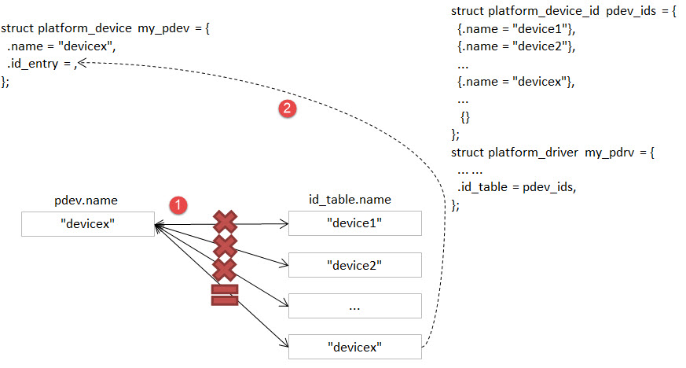
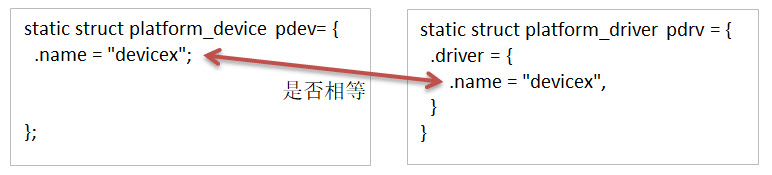
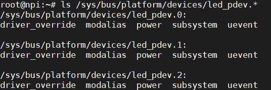
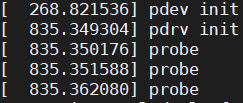

.. vim: syntax=rst

平台设备驱动
==================

在之前的字符设备程序中驱动程序，我们只要调用open()函数打开了相应的设备文件，就可以使用read()/write()函数，
通过file_operations这个文件操作接口来进行硬件的控制。这种驱动开发方式简单直观，但是从软件设计的角度看，却是一种十分糟糕的方式。

它有一个严重的问题，就是设备信息和驱动代码杂糅在一起，在我们驱动程序中各种硬件寄存器地址随处可见。
本质上，这种驱动开发方式与单片机的驱动开发并没有太大的区别，一旦硬件信息发生变化甚至设备已经不在了，就必须要修改驱动源码。
我们之前做的事情只不过是简单地给它套了一个文件操作接口的外壳。

Linux作为一个发展成熟、功能齐全、结构复杂的操作系统，它对于代码的可维护性、复用性非常看重。
如果它放任每位驱动开发人员任凭自己的个人喜好来进行驱动代码开发，最终必将导致内核充斥着大量冗余、无意义的驱动代码，
给linux内核的迭代开发带来巨大的维护成本。

为了解决这种驱动代码和设备信息耦合的问题，linux提出了设备驱动模型。前面章节我们已经对设备驱动模型进行了深入剖析，在设备驱动模型中，
引入总线的概念可以对驱动代码和设备信息进行分离。但是驱动中总线的概念是软件层面的一种抽象，与我们SOC中物理总线的概念并不严格相等：

- **物理总线**：芯片与各个功能外设之间传送信息的公共通信干线，其中又包括数据总线、地址总线和控制总线，以此来传输各种通信时序。

- **驱动总线**：负责管理设备和驱动。制定设备和驱动的匹配规则，一旦总线上注册了新的设备或者是新的驱动，总线将尝试为它们进行配对。

一般对于I2C、SPI、USB这些常见类型的物理总线来说，Linux内核会自动创建与之相应的驱动总线，因此I2C设备、SPI设备、
USB设备自然是注册挂载在相应的总线上。但是，实际项目开发中还有很多结构简单的设备，对它们进行控制并不需要特殊的时序。
它们也就没有相应的物理总线，比如led、rtc时钟、蜂鸣器、按键等等，Linux内核将不会为它们创建相应的驱动总线。

为了使这部分设备的驱动开发也能够遵循设备驱动模型，Linux内核引入了一种虚拟的总线——**平台总线（platform bus)**。
平台总线用于管理、挂载那些没有相应物理总线的设备，这些设备被称为平台设备，对应的设备驱动则被称为平台驱动。
平台设备驱动的核心依然是Linux设备驱动模型，平台设备使用platform_device结构体来进行表示，其继承了设备驱动模型中的device结构体。
而平台驱动使用platform_driver结构体来进行表示，其则是继承了设备驱动模型中的device_driver结构体。

平台总线
~~~~~~~~~~~~~~~~~~~~~~~~~~~

平台总线注册和匹配方式
>>>>>>>>>>>>>>>>

在Linux的设备驱动模型中，总线是最重要的一环。上一节中，我们提到过总线是负责匹配设备和驱动，
它维护着两个链表，里面记录着各个已经注册的平台设备和平台驱动。每当有新的设备或者是新的驱动加入到总线时，
总线便会调用platform_match函数对新增的设备或驱动，进行配对。内核中使用bus_type来抽象描述系统中的总线，平台总线结构体原型如下所示：

.. code-block:: c
    :caption: platform_bus_type结构体(内核源码/driver/base/platform.c)
    :linenos:

    struct bus_type platform_bus_type = {

        .name		= "platform",
        .dev_groups	= platform_dev_groups,
        .match		= platform_match,
        .uevent		= platform_uevent,
        .pm		= &platform_dev_pm_ops,

    };

    EXPORT_SYMBOL_GPL(platform_bus_type);

内核用platform_bus_type来描述平台总线，该总线在linux内核启动的时候自动进行注册。

.. code-block:: c
    :caption: platform_bus_init函数(内核源码/driver/base/platform.c)
    :linenos:

    int __init platform_bus_init(void)
    {
        int error;
        ...
        error =  bus_register(&platform_bus_type);
        ...
        return error;
    }

第5行：向linux内核注册platform平台总线

这里重点是platform总线的match函数指针，该函数指针指向的函数将负责实现平台总线和平台设备的匹配过程。对于每个驱动总线，
它都必须实例化该函数指针。platform_match的函数原型如下：

.. code-block:: c
    :caption: platform_match函数(内核源码/driver/base/platform.c)
    :linenos:

    static int platform_match(struct device *dev, struct device_driver *drv)
    {

        struct platform_device *pdev = to_platform_device(dev);
        struct platform_driver *pdrv = to_platform_driver(drv);

        /* When driver_override is set, only bind to the matching driver */
        if (pdev->driver_override)
            return !strcmp(pdev->driver_override, drv->name);

        /* Attempt an OF style match first */
        if (of_driver_match_device(dev, drv))
            return 1;

        /* Then try ACPI style match */
        if (acpi_driver_match_device(dev, drv))
            return 1;

        /* Then try to match against the id table */
        if (pdrv->id_table)
            return platform_match_id(pdrv->id_table, pdev) != NULL;

        /* fall-back to driver name match */
        return (strcmp(pdev->name, drv->name) == 0);

    }

- 第4-5行：这里调用了to_platform_device()和to_platform_driver()宏。这两个宏定义的原型如下：

.. code-block:: c
    :caption: to_platform_xxx宏定义(内核源码/include/linux/platform_device.h)
    :linenos:

    #define to_platform_device(x)     (container_of((x), struct platform_device, dev)
    #define to_platform_driver(drv)   (container_of((drv), struct platform_driver, driver))    

其中，to_platform_device和to_platform_driver实现了对container_of的封装，
dev、driver分别作为platform_device、platform_driver的成员变量，
通过container_of宏可以获取到正在进行匹配的platform_driver和platform_device。

- 第8-21行：platform总线提供了四种匹配方式，并且这四种方式存在着优先级：设备树机制>ACPI匹配模式>id_table方式>字符串比较。
  虽然匹配方式五花八门，但是并没有涉及到任何复杂的算法，都只是在匹配的过程中，比较一下设备和驱动提供的某个成员的字符串是否相同。
  设备树是一种描述硬件的数据结构，它用一个非C语言的脚本来描述这些硬件设备的信息。驱动和设备之间的匹配时通过比较compatible的值。
  acpi主要是用于电源管理，基本上用不到，这里就并不进行讲解了。关于设备树的匹配机制，会在设备树章节进行详细分析。

id_table匹配方式
>>>>>>>>>>>>>>>>

在这一章节，我们先来分析平台总线id_table匹配方式，在定义结构体platform_driver时，我们需要提供一个id_table的数组，该数组说明了当前的驱动能够支持的设备。当加载该驱动时，总线的match函数发现id_table非空，
则会比较id_table中的name成员和平台设备的name成员，若相同，则会返回匹配的条目，具体的实现过程如下：

.. code-block:: c
    :caption: platform_match_id函数(内核源码/drivers/base/platform.c)
    :linenos:

    static const struct platform_device_id *platform_match_id(
                const struct platform_device_id *id,
                struct platform_device *pdev)

    {
        while (id->name[0]) {
            if (strcmp(pdev->name, id->name) == 0) {
                pdev->id_entry = id;
                return id;
            }
            id++;
        }
        return NULL;
    }

大家可以看到这里的代码实现并不复杂，只是通过字符串进行配对。每当有新的驱动或者设备添加到总线时，总线便会调用match函数对新的设备或者驱动进行配对。
platform_match_id函数中第一个参数为驱动提供的id_table，第二个参数则是待匹配的平台设备。当待匹配的平台设备的name字段的值等于驱动提供的id_table中的值时，
会将当前匹配的项赋值给platform_device中的id_entry，返回一个非空指针。若没有成功匹配，则返回空指针。

倘若我们的驱动没有提供前三种方式的其中一种，那么总线进行匹配时，只能比较platform_device中的name字段以及嵌在platform_driver中的device_driver的name字段。

平台设备
~~~~~~~~~~~~~~~~~~~~~~~~~~~~~~~~~~~~~~~~~~~~~~~~~~

platform_device结构体
>>>>>>>>>>>>>>>>

内核使用platform_device结构体来描述平台设备，结构体原型如下：

.. code-block:: c
   :caption: platform_device结构体(内核源码/include/linux/platform_device.h)
   :linenos:

    struct platform_device {
        const char *name;
        int id;
        struct device dev;
        u32 num_resources;
        struct resource *resource;
        const struct platform_device_id *id_entry;
        /* 省略部分成员 */
    };

- **name：** 设备名称，总线进行匹配时，会比较设备和驱动的名称是否一致；
- **id：** 指定设备的编号，Linux支持同名的设备，而同名设备之间则是通过该编号进行区分；
- **dev：** Linux设备模型中的device结构体，linux内核大量使用了面向对象思想，platform_device通过继承该结构体可复用它的相关代码，方便内核管理平台设备；
- **num_resources：** 记录资源的个数，当结构体成员resource存放的是数组时，需要记录resource数组的个数，内核提供了宏定义ARRAY_SIZE用于计算数组的个数；
- **resource：** 平台设备提供给驱动的资源，如irq，dma，内存等等。该结构体会在接下来的内容进行讲解；
- **id_entry：** 平台总线提供的另一种匹配方式，原理依然是通过比较字符串，这部分内容会在平台总线小节中讲，这里的id_entry用于保存匹配的结果；

何为设备信息？
>>>>>>>>>>>>>>>>

平台设备的工作是为驱动程序提供设备信息,设备信息包括硬件信息和软件信息两部分。

- 硬件信息：驱动程序需要使用到什么寄存器，占用哪些中断号、内存资源、IO口等等

- 软件信息：以太网卡设备中的MAC地址、I2C设备中的设备地址、SPI设备的片选信号线等等

对于硬件信息，使用结构体struct resource来保存设备所提供的资源，比如设备使用的中断编号，寄存器物理地址等，结构体原型如下：

.. code-block:: c
    :caption: resource结构体(内核源码/include/linux/ioport.h)
    :linenos:

    /*
    * Resources are tree-like, allowing
    * nesting etc..
    */

    struct resource {
        resource_size_t start;
        resource_size_t end;
        const char *name;
        unsigned long flags;
        /* 省略部分成员 */
    };

- **name：** 指定资源的名字，可以设置为NULL；
- **start、end：** 指定资源的起始地址以及结束地址
- **flags：** 用于指定该资源的类型，在Linux中，资源包括I/O、Memory、Register、IRQ、DMA、Bus等多种类型，最常见的有以下几种：

.. csv-table::  
    :header: "资源宏定义", "描述"
    :widths: 15, 30

    "IORESOURCE_IO", "用于IO地址空间，对应于IO端口映射方式"
    "IORESOURCE_MEM", "用于外设的可直接寻址的地址空间"
    "IORESOURCE_IRQ", "用于指定该设备使用某个中断"
    "IORESOURCE_DMA", "用于指定使用的DMA通道"

设备驱动程序的主要目的是操作设备的寄存器。不同架构的计算机提供不同的操作接口，主要有IO端口映射和IO內存映射两种方式。
对应于IO端口映射方式，只能通过专门的接口函数（如inb、outb）才能访问；
采用IO内存映射的方式，可以像访问内存一样，去读写寄存器。在嵌入式中，基本上没有IO地址空间，所以通常使用IORESOURCE_MEM。

在资源的起始地址和结束地址中，对于IORESOURCE_IO或者是IORESOURCE_MEM，他们表示要使用的内存的起始位置以及结束位置；
若是只用一个中断引脚或者是一个通道，则它们的start和end成员值必须是相等的。

而对于软件信息，这种特殊信息需要我们以私有数据的形式进行封装保存，我们注意到platform_device结构体中，有个device结构体类型的成员dev。在前面章节，我们提到过Linux设备模型使用device结构体来抽象物理设备，
该结构体的成员platform_data可用于保存设备的私有数据。platform_data是void *类型的万能指针，无论你想要提供的是什么内容，只需要把数据的地址赋值给platform_data即可，还是以GPIO引脚号为例，示例代码如下：

.. code-block:: c
    :caption: 示例代码
    :linenos: 

    unsigned int pin = 10;

    struct platform_device pdev = {
        .dev = {
            .platform_data = &pin;
        }
    }

将保存了GPIO引脚号的变量pin地址赋值给platform_data指针，在驱动程序中通过调用平台设备总线中的核心函数，可以获取到我们需要的引脚号。

注册/注销平台设备
>>>>>>>>>>>>>>>>
当我们定义并初始化好platform_device结构体后，需要把它注册、挂载到平台设备总线上。注册平台设备需要使用platform_device_register()函数，该函数原型如下：

.. code-block:: c
    :caption: platform_device_register函数(内核源码/drivers/base/platform.c)
    :linenos:

    int platform_device_register(struct platform_device *pdev)

函数参数和返回值如下：

**参数：** **pdev:** platform_device类型结构体指针

**返回值：**

- **成功：** 0
- **失败：** 负数

同样，当需要注销、移除某个平台设备时，我们需要使用platform_device_unregister函数，来通知平台设备总线去移除该设备。

.. code-block:: c 
    :caption: platform_device_unregister函数(内核源码/drivers/base/platform.c)
    :linenos:

    void platform_device_unregister(struct platform_device *pdev)

函数参数和返回值如下：

**参数：** **pdev:** platform_device类型结构体指针

**返回值：** **无**

到这里，平台设备的知识已经讲解完毕，平台设备的主要内容是将硬件部分的代码与驱动部分的代码分开，注册到平台设备总线中。平台设备总线为设备和驱动之间搭建
了一座桥——统一的数据结构以及函数接口，设备和驱动的数据交互直接在“这座桥上”进行。

平台驱动
~~~~~~~~~~~~~~~~~~~~~~~~~~~~~~~~~

platform_driver结构体
>>>>>>>>>>>>>>>>
内核中使用platform_driver结构体来描述平台驱动，结构体原型如下所示：

.. code-block:: c
    :caption: platform_driver结构体(内核源码/include/platform_device.h)
    :linenos:

    struct platform_driver {

        int (*probe)(struct platform_device *);
        int (*remove)(struct platform_device *);
        struct device_driver driver;
        const struct platform_device_id *id_table;

    };

- **probe：** 函数指针，驱动开发人员需要在驱动程序中初始化该函数指针，当总线为设备和驱动匹配上之后，会回调执行该函数。我们一般通过该函数，对设备进行一系列的初始化。
- **remove：** 函数指针，驱动开发人员需要在驱动程序中初始化该函数指针，当我们移除某个平台设备时，会回调执行该函数指针，该函数实现的操作，通常是probe函数实现操作的逆过程。
- **driver：** Linux设备模型中用于抽象驱动的device_driver结构体，platform_driver继承该结构体，也就获取了设备模型驱动对象的特性；
- **id_table：** 表示该驱动能够兼容的设备类型。

platform_device_id结构体原型如下所示:

.. code-block:: c
    :caption: id_table结构体(内核源码/include/linux/mod_devicetable.h)
    :linenos:

    struct platform_device_id {
        char name[PLATFORM_NAME_SIZE];
        kernel_ulong_t driver_data;

    };

在platform_device_id这个结构体中，有两个成员，第一个是数组用于指定驱动的名称，总线进行匹配时，会依据该结构体的name成员与platform_device中的变量name进行比较匹配，
另一个成员变量driver_data，则是用于来保存设备的配置。我们知道在同系列的设备中，往往只是某些寄存器的配置不一样，为了减少代码的冗余，
尽量做到一个驱动可以匹配多个设备的目的。接下来以imx的串口为例，具体看下这个结构体的作用：

.. code-block:: c
    :caption: 示例代码(内核源码/drivers/tty/serial/imx.c)
    :linenos:

    static struct imx_uart_data imx_uart_devdata[] = {

        [IMX1_UART] = {
            .uts_reg = IMX1_UTS,
            .devtype = IMX1_UART,
        },

        [IMX21_UART] = {
            .uts_reg = IMX21_UTS,
            .devtype = IMX21_UART,
        },

        [IMX6Q_UART] = {
            .uts_reg = IMX21_UTS,
            .devtype = IMX6Q_UART,
        },

    };

    static struct platform_device_id imx_uart_devtype[] = {

        {
            .name = "imx1-uart",
            .driver_data = (kernel_ulong_t) &imx_uart_devdata[IMX1_UART],
        }, 

        {
            .name = "imx21-uart",
            .driver_data = (kernel_ulong_t) &imx_uart_devdata[IMX21_UART],
        }, 

        {
            .name = "imx6q-uart",
            .driver_data = (kernel_ulong_t) &imx_uart_devdata[IMX6Q_UART],

        }, 
        
        {
            /* sentinel */

        }

    };

- 第1-18行:声明了一个结构体数组，用来表示不同平台的串口类型。
- 第20-42行:使用platform_device_id结构体中的driver_data成员来储存上面的串口信息

在上面的代码中，支持三种设备的串口，支持imx1、imx21、imx6q三种不同系列芯片，他们之间区别在于串口的test寄存器地址不同。
当总线成功配对平台驱动以及平台设备时，会将对应的id_table条目赋值给平台设备的id_entry成员，而平台驱动的probe函数是以平台设备为参数，
这样的话，就可以拿到当前设备串口的test寄存器地址了。

注册/注销平台驱动
>>>>>>>>>>>>>>>>

当我们初始化了platform_driver之后，通过platform_driver_register()函数来注册我们的平台驱动，该函数原型如下：

.. code-block:: c 
    :caption: platform_driver_register函数
    :linenos:

    int platform_driver_register(struct platform_driver *drv);

函数参数和返回值如下：

**参数：** **drv:** platform_driver类型结构体指针

**返回值：**

- **成功：** 0
- **失败：** 负数

由于platform_driver继承了driver结构体，结合Linux设备模型的知识，
当成功注册了一个平台驱动后，就会在/sys/bus/platform/driver目录下生成一个新的目录项。

当卸载的驱动模块时，需要注销掉已注册的平台驱动，platform_driver_unregister()函数用于注销已注册的平台驱动，该函数原型如下：

.. code-block:: c 
    :caption: platform_driver_unregister函数(内核源码/drivers/base/platform.c)
    :linenos:

    void platform_driver_unregister(struct platform_driver *drv);

**参数：** **drv:** platform_driver类型结构体指针

**返回值：** **无**

上面所讲的内容是最基本的平台驱动框架，只需要实现probe函数、remove函数，初始化platform_driver结构体，并调用platform_driver_register进行注册即可。

平台驱动获取设备信息
>>>>>>>>>>>>>>>>>>>>>

在学习平台设备的时候，我们知道平台设备使用结构体resource来抽象表示硬件信息，而软件信息则可以利用设备结构体device中的成员platform_data来保存。
先看一下如何获取平台设备中结构体resource提供的资源。

platform_get_resource()函数通常会在驱动的probe函数中执行，用于获取平台设备提供的资源结构体，最终会返回一个struct resource类型的指针，该函数原型如下：

.. code-block:: c
    :caption: platform_get_resource函数
    :linenos:

    struct resource *platform_get_resource(struct platform_device *dev, unsigned int type, unsigned int num);

**参数：**

- **dev：** 指定要获取哪个平台设备的资源；
- **type：** 指定获取资源的类型，如IORESOURCE_MEM、IORESOURCE_IO等；
- **num：** 指定要获取的资源编号。每个设备所需要资源的个数是不一定的，为此内核对这些资源进行了编号，对于不同的资源，编号之间是相互独立的。

**返回值：**

- **成功：** struct resource结构体类型指针
- **失败：** NULL

假若资源类型为IORESOURCE_IRQ，平台设备驱动还提供以下函数接口，来获取中断引脚，

.. code-block:: c 
    :caption: platform_get_irq函数
    :linenos:

    int platform_get_irq(struct platform_device *pdev, unsigned int num)

**参数：**

- **pdev：** 指定要获取哪个平台设备的资源；
- **num：** 指定要获取的资源编号。

**返回值：**

- **成功：** 可用的中断号
- **失败：** 负数

对于存放在device结构体中成员platform_data的软件信息，我们可以使用dev_get_platdata函数来获取，函数原型如下所示：

.. code-block:: c 
    :caption: dev_get_platdata函数
    :linenos:

    static inline void *dev_get_platdata(const struct device *dev)
    {
        return dev->platform_data;
    }

**参数：**

- **dev：** struct device结构体类型指针

**返回值：** device结构体中成员platform_data指针

以上几个函数接口就是如何从平台设备中获取资源的常用的几个函数接口，到这里平台驱动部分差不多就结束了。总结一下平台驱动需要
实现probe函数，当平台总线成功匹配驱动和设备时，则会调用驱动的probe函数，在该函数中使用上述的函数接口来获取资源，
以初始化设备，最后填充结构体platform_driver，调用platform_driver_register进行注册。

平台设备实验说明
~~~~~~~~~~~~~

硬件介绍
>>>>>>>>>>>>>>>>>>>>>

本节实验使用到 EBF6ULL-PRO 开发板上的 RGB 彩灯

硬件原理图分析
>>>>>>>>>>>>>>>>>>>>>

参考"字符设备驱动--点亮LED灯"章节

实验代码讲解
~~~~~~~~~~~~~

**本章的示例代码目录为：base_code/linux_driver/platform_driver**

本节将会把平台设备驱动应用到LED字符设备驱动的代码中，实现硬件与软件代码相分离，巩固平台设备驱动的学习。

编程思路
>>>>>>>>>>>>>>>>>>>>>

1. 编写第一个内核模块led_pdev.c
2. 在内核模块中定义一个平台设备，并填充RGB灯相关设备信息
3. 在该模块入口函数，注册/挂载这个平台设备
4. 编写第二个内核模块led_pdrv.c
5. 在内核模块中定义一个平台驱动，在probe函数中完成字符设备驱动的创建
6. 在该模块入口函数，注册/挂载这个平台驱动

在平台设备总线上，注册/挂载平台设备和平台驱动时，会自动进行配对。配对成功后，回调执行平台驱动的probe函数，
从而完成字符设备驱动的创建。

代码分析
>>>>>>>>>>>>>>>>>>>>>

定义平台设备
---------------

我们需要将字符设备中的硬件信息提取出来，独立成一份代码，将其作为平台设备，注册到内核中。点亮LED灯，需要控制与LED灯相关的寄存器，
包括GPIO时钟寄存器，IO配置寄存器，IO数据寄存器等，这里的资源，实际上就是寄存器地址，可以使用IORESOURCE_MEM进行处理；
除了这些之外，还需要提供一些寄存器的偏移量，我们可以利用平台设备的私有数据进行管理。

.. code-block:: c
    :caption: 寄存器宏定义(位于../base_code/linux_driver/platform_driver/led_pdev.c)
    :linenos:

    #define CCM_CCGR1                               0x020C406C	//时钟控制寄存器
    #define IOMUXC_SW_MUX_CTL_PAD_GPIO1_IO04        0x020E006C	//GPIO1_04复用功能选择寄存器
    #define IOMUXC_SW_PAD_CTL_PAD_GPIO1_IO04        0x020E02F8	//PAD属性设置寄存器
    #define GPIO1_GDIR                              0x0209C004	//GPIO方向设置寄存器（输入或输出）
    #define GPIO1_DR                                0x0209C000	//GPIO输出状态寄存器

    #define CCM_CCGR3                               0x020C4074
    #define GPIO4_GDIR                              0x020A8004
    #define GPIO4_DR                                0x020A8000

    #define IOMUXC_SW_MUX_CTL_PAD_GPIO4_IO020       0x020E01E0
    #define IOMUXC_SW_PAD_CTL_PAD_GPIO4_IO020       0x020E046C

    #define IOMUXC_SW_MUX_CTL_PAD_GPIO4_IO019       0x020E01DC
    #define IOMUXC_SW_PAD_CTL_PAD_GPIO4_IO019       0x020E0468

- 使用宏定义来对GPIO引脚的寄存器进行封装，具体每个寄存器的作用，可以参考《IMX6ULRM》用户手册。

定义一个resource结构体，用于存放上述的寄存器地址，提供给驱动使用，如下所示：

.. code-block:: c
    :caption: 定义资源数组(位于../base_code/linux_driver/platform_driver/led_pdev.c)
    :linenos: 

    static struct resource rled_resource[] = {
        [0] = DEFINE_RES_MEM(GPIO1_DR, 4),
        [1] = DEFINE_RES_MEM(GPIO1_GDIR, 4),
        [2] = DEFINE_RES_MEM(IOMUXC_SW_MUX_CTL_PAD_GPIO1_IO04, 4),
        [3] = DEFINE_RES_MEM(CCM_CCGR1, 4),
        [4] = DEFINE_RES_MEM(IOMUXC_SW_PAD_CTL_PAD_GPIO1_IO04, 4),
    };

- 在内核源码/include/linux/ioport.h中，提供了宏定义DEFINE_RES_MEM、DEFINE_RES_IO、DEFINE_RES_IRQ和DEFINE_RES_DMA，用来定义所需要的资源类型。
  DEFINE_RES_MEM用于定义IORESOURCE_MEM类型的资源，我们只需要传入两个参数，一个是寄存器地址，另一个是大小。从手册上看，可以得知一个寄存器都是32位的，因此，
  这里我们选择需要4个字节大小的空间。rled_resource资源数组中，我们将所有的MEM资源进行了编号，0对应了GPIO1_DR，1对应了GPIO1_GDIR，驱动到时候就可以根据这些编号获得对应的寄存器地址。

.. code-block:: c
    :caption: 定义平台设备的私有数据(位于../base_code/linux_driver/platform_driver/led_pdev.c)
    :linenos: 

    unsigned int rled_hwinfo[2] = { 4, 26 };

- 使用一个数组rled_hwinfo，来记录寄存器的偏移量，填充平台私有数据时，只需要把数组的首地址赋给platform_data即可。

关于设备的硬件信息，我们已经全部完成了，接下来只需要定义一个platform_device类型的变量，填充相关信息。

.. code-block:: c
    :caption: 定义平台设备(位于../base_code/linux_driver/platform_driver/led_pdev.c)
    :linenos: 

    static int led_cdev_release(struct inode *inode, struct file *filp)
    {
        return 0;
    }

    /* red led device */ 
    static struct platform_device rled_pdev = {
        .name = "led_pdev",
        .id = 0,
        .num_resources = ARRAY_SIZE(rled_resource),
        .resource = rled_resource,
        .dev = {
            .release = led_release,
            .platform_data = rled_hwinfo,
            },

    };

- 第1-4行：声明了led_cdev_release函数，目的为了防止卸载模块，内核提示报错。
- 第7-9行：定义了一个设备名为“led_pdev”的设备，这里的名字确保要和驱动的名称保持一致，否则就会导致匹配失败。id编号设置为0，驱动会利用该编号来注册设备。
- 第10-11行：将上面实现好的rled_resource数组赋值给resource成员，同时，我们还需要指定资源的数量，内核提供了宏定义ARRAY_SIZE，用于计算数组长度，
  因此，num_resources直接赋值为ARRAY_SIZE(rled_resource)。
- 第12-15行：对dev中的成员进行赋值，将rled_hwinfo存储到platform_data中。

最后，只需要在模块加载的函数中调用platform_device_register函数，这样，当加载该内核模块时，新的平台设备就会被注册到内核中去，实现方式如下：

.. code-block:: c
    :caption: 模块初始化(位于../base_code/linux_driver/platform_driver/led_pdev.c)
    :linenos:

    static __init int led_pdev_init(void)
    {
        printk("pdev init\n");
        platform_device_register(&rled_pdev);
        return 0;

    }
    module_init(led_pdev_init);

    static __exit void led_pdev_exit(void)
    {
        printk("pdev exit\n");
        platform_device_unregister(&rled_pdev);

    }
    module_exit(led_pdev_exit);

    MODULE_AUTHOR("Embedfire");
    MODULE_LICENSE("GPL");
    MODULE_DESCRIPTION("the example for platform driver");

- 第1-8行：实现模块的入口函数，打印信息并注册平台设备
- 第10-16行：实现模块的出口函数，打印信息并注销设备
- 第18-20行：模块遵守协议以及一些模块信息

这样，我们就实现了一个新的设备，只需要在开发板上加载该模块，平台总线下就会挂载我们LED灯的平台设备。

定义平台驱动
-------------------

我们已经注册了一个新的平台设备，驱动只需要提取该设备提供的资源，并提供相应的操作方式即可。这里我们仍然采用字符设备来控制我们的LED灯，
想必大家对于LED灯字符设备的代码已经很熟悉了，对于这块的代码就不做详细介绍了，让我们把重点放在平台驱动上。

我们驱动提供id_table的方式，来匹配设备。我们定义一个platform_device_id类型的变量led_pdev_ids，说明驱动支持哪些设备，
这里我们只支持一个设备，名称为led_pdev，要与平台设备提供的名称保持一致。

.. code-block:: c
    :caption: id_table(位于../base_code/linux_driver/platform_driver/led_pdrv.c)
    :linenos: 

    static struct platform_device_id led_pdev_ids[] = {
        {.name = "led_pdev"},
        {}
    };
    MODULE_DEVICE_TABLE(platform, led_pdev_ids);

- 这块代码提供了驱动支持哪些设备

这仅仅完成了第一个内容，这是总线进行匹配时所需要的内容。而在匹配成功之后，驱动需要去提取设备的资源，
这部分工作都是在probe函数中完成。由于我们采用字符设备的框架，因此，在probe过程，还需要完成字符设备的注册等工作，具体实现的代码如下：

.. code-block:: c
    :caption: led_pdrv_probe函数(位于../base_code/linux_driver/platform_driver/led_pdrv.c)
    :linenos: 

    struct led_data {
        unsigned int led_pin;
        unsigned int clk_regshift;

        unsigned int __iomem *va_dr;
        unsigned int __iomem *va_gdir;
        unsigned int __iomem *va_iomuxc_mux;
        unsigned int __iomem *va_ccm_ccgrx;
        unsigned int __iomem *va_iomux_pad;	

        struct cdev led_cdev;
    };    

    static int led_pdrv_probe(struct platform_device *pdev)
    {
        struct led_data *cur_led;
        unsigned int *led_hwinfo;

        
        struct resource *mem_dr;
        struct resource *mem_gdir;
        struct resource *mem_iomuxc_mux;
        struct resource *mem_ccm_ccgrx;
        struct resource *mem_iomux_pad; 	

        dev_t cur_dev;
        int ret = 0;

        printk("led platform driver probe\n");

        //第一步：提取平台设备提供的资源
        cur_led = devm_kzalloc(&pdev->dev, sizeof(struct led_data), GFP_KERNEL);
        if(!cur_led)
            return -ENOMEM;

        led_hwinfo = devm_kzalloc(&pdev->dev, sizeof(unsigned int)*2, GFP_KERNEL);
        if(!led_hwinfo)
            return -ENOMEM;

        /* get the pin for led and the reg's shift */
        led_hwinfo = dev_get_platdata(&pdev->dev);
        cur_led->led_pin = led_hwinfo[0];
        cur_led->clk_regshift = led_hwinfo[1];

        /* get platform resource */
        mem_dr = platform_get_resource(pdev, IORESOURCE_MEM, 0);
        mem_gdir = platform_get_resource(pdev, IORESOURCE_MEM, 1);
        mem_iomuxc_mux = platform_get_resource(pdev, IORESOURCE_MEM, 2);
        mem_ccm_ccgrx = platform_get_resource(pdev, IORESOURCE_MEM, 3);
        mem_iomux_pad = platform_get_resource(pdev, IORESOURCE_MEM, 4);

        cur_led->va_dr =
            devm_ioremap(&pdev->dev, mem_dr->start, resource_size(mem_dr));

        cur_led->va_gdir =
            devm_ioremap(&pdev->dev, mem_gdir->start, resource_size(mem_gdir));

        cur_led->va_iomuxc_mux =
            devm_ioremap(&pdev->dev, mem_iomuxc_mux->start,resource_size(mem_iomuxc_mux));

        cur_led->va_ccm_ccgrx =
            devm_ioremap(&pdev->dev, mem_ccm_ccgrx->start,
                resource_size(mem_ccm_ccgrx));

        cur_led->va_iomux_pad =
            devm_ioremap(&pdev->dev, mem_iomux_pad->start,resource_size(mem_iomux_pad));

        //第二步：注册字符设备
        cur_dev = MKDEV(DEV_MAJOR, pdev->id);

        register_chrdev_region(cur_dev, 1, "led_cdev");
        cdev_init(&cur_led->led_cdev, &led_cdev_fops);

        ret = cdev_add(&cur_led->led_cdev, cur_dev, 1);
        if(ret < 0)
        {
            printk("fail to add cdev\n");
            goto add_err;
        }

        device_create(my_led_class, NULL, cur_dev, NULL, DEV_NAME "%d", pdev->id);

        /* save as drvdata */ 
        platform_set_drvdata(pdev, cur_led);
        return 0;

    add_err:
        unregister_chrdev_region(cur_dev, 1);
        return ret;

    }

- 第1-12行：仍然使用结构体led_data来管理我们LED灯的硬件信息。
- 第31-38行：使用devm_kzalloc函数申请cur_led和led_hwinfo结构体内存大小。
- 第41-43行：使用dev_get_platdata函数获取私有数据，得到LED灯的寄存器偏移量，并赋值给cur_led->led_pin和cur_led->clk_regshift。
- 第46-50行：利用函数platform_get_resource可以获取到各个寄存器的地址。
- 第52-66行：在内核中，这些地址并不能够直接使用，使用devm_ioremap将获取到的寄存器地址转化为虚拟地址，到这里我们就完成了提取资源的工作了。
- 第69-81行：就需要注册一个LED字符设备了。开发板上板载了三个LED灯，在rled_pdev结构体中，我们指定了红灯的ID号为0，我们可以利用该id号，
  来作为字符设备的次设备号，用于区分不同的LED灯。使用MKDEV宏定义来创建一个设备编号，再调用register_chrdev_region、cdev_init、cdev_add等函数来注册字符设备。
- 第84行：使用platform_set_drvdata函数，将LED数据信息存入在平台驱动结构体中pdev->dev->driver_data中。

当驱动的内核模块被卸载时，我们需要将注册的驱动注销，相应的字符设备也同样需要注销，具体的实现代码如下：

.. code-block:: c
    :caption: led_pdrv_remove函数(位于../base_code/linux_driver/platform_driver/led_pdrv.c)
    :linenos: 

    static int led_pdrv_remove(struct platform_device *pdev)
    {
        dev_t cur_dev; 
        struct led_data *cur_data = platform_get_drvdata(pdev);

        printk("led platform driver remove\n");

        cur_dev = MKDEV(DEV_MAJOR, pdev->id);
        cdev_del(&cur_data->led_cdev);
        device_destroy(my_led_class, cur_dev);
        unregister_chrdev_region(cur_dev, 1);

        return 0;

    }

- 第4行：在probe函数中调用了platform_set_drvdata，将当前的LED灯数据结构体保存到pdev的driver_data成员中，
  在这里调用platform_get_drvdata，获取当前LED灯对应的结构体，该结构体中包含了字符设备。
- 第8-11行：，调用cdev_del删除对应的字符设备，删除/dev目录下的设备，则调用函数device_destroy，最后使用函数unregister_chrdev_region，
  注销掉当前的字符设备编号。

关于操作LED灯字符设备的方式，实现方式如下，这里只做简单介绍，具体介绍可以参阅LED灯字符设备章节的内容。

.. code-block:: c
    :caption: led灯的字符设备框架(位于../base_code/linux_driver/platform_driver/led_pdrv.c)
    :linenos: 

    static int led_cdev_open(struct inode *inode, struct file *filp)
    {
        printk("%s\n", __func__);

        struct led_data *cur_led = container_of(inode->i_cdev, struct led_data, led_cdev);
        unsigned int val = 0;

        val = readl(cur_led->va_ccm_ccgrx);
        val &= ~(3 << cur_led->clk_regshift);
        val |= (3 << cur_led->clk_regshift);
        writel(val, cur_led->va_ccm_ccgrx);

        writel(5, cur_led->va_iomuxc_mux);
        writel(0x1F838, cur_led->va_iomux_pad);

        val = readl(cur_led->va_gdir);
        val &= ~(1 << cur_led->led_pin);
        val |= (1 << cur_led->led_pin);
        writel(val, cur_led->va_gdir);

        val = readl(cur_led->va_dr);
        val |= (0x01 << cur_led->led_pin);
        writel(val, cur_led->va_dr);

        filp->private_data = cur_led;

        return 0;

    }

    static int led_cdev_release(struct inode *inode, struct file *filp)
    {
        return 0;
    }

    static ssize_t led_cdev_write(struct file *filp, const char __user * buf,
                    size_t count, loff_t * ppos)
    {
        unsigned long val = 0;
        unsigned long ret = 0;
        int tmp = count;

        struct led_data *cur_led = (struct led_data *)filp->private_data;
        kstrtoul_from_user(buf, tmp, 10, &ret);
        val = readl(cur_led->va_dr);

        if (ret == 0)
            val &= ~(0x01 << cur_led->led_pin);
        else
            val |= (0x01 << cur_led->led_pin);

        writel(val, cur_led->va_dr);
        *ppos += tmp;
        return tmp;

    }

    static struct file_operations led_cdev_fops = {
        .open = led_cdev_open,
        .release = led_cdev_release,
        .write = led_cdev_write,

    };

- 第1-29行是led_cdev_open函数的内容主要就是对硬件进行初始化。
- 第31-34行的led_cdev_release函数的作用是为了防止警告产生。
- 第36-54行对GPIO引脚进行置位控制
- 第58-63行，对file_operations结构体进行填充

最后，我们只需要将我们实现好的内容，填充到platform_driver类型的结构体，并使用platform_driver_register函数注册即可。

.. code-block:: c
    :caption: 注册平台驱动(位于../base_code/linux_driver/platform_driver/led_pdrv.c)
    :linenos: 

    static struct platform_driver led_pdrv = {    
        .probe = led_pdrv_probe,
        .remove = led_pdrv_remove,
        .driver.name = "led_pdev",
        .id_table = led_pdev_ids,
    };

    static __init int led_pdrv_init(void)
    {

        printk("led platform driver init\n");

        my_led_class = class_create(THIS_MODULE, "my_leds");
        platform_driver_register(&led_pdrv);

        return 0;
    }
    module_init(led_pdrv_init);

    static __exit void led_pdrv_exit(void)
    {
        printk("led platform driver exit\n");	

        platform_driver_unregister(&led_pdrv);
        class_destroy(my_led_class);
    }
    module_exit(led_pdrv_exit);

    MODULE_AUTHOR("Embedfire");
    MODULE_LICENSE("GPL");
    MODULE_DESCRIPTION("the example for platform driver");

- 第1-6行，在led_pdrv中定义了两种匹配模式，在平台总线匹配过程中，只会根据id_table中的name值进行匹配，若和平台设备的name值相等，则表示匹配成功；
  反之，则匹配不成功，表明当前内核没有该驱动能够支持的设备。
- 第8-18行，调用函数class_create，来创建一个led类，并且调用函数platform_driver_register，注册我们的平台驱动结构体，这样当加载该内核模块时，
  就会有新的平台驱动加入到内核中。
- 第20-27行，注销函数led_pdrv_exit，则是初始化函数的逆过程。

实验准备
~~~~~~~~~~~~~

编译驱动程序
>>>>>>>>>>>>

makefile修改说明
-----------------

本节实验使用的Makefile如下所示，编写该Makefile时，只需要根据实际情况修改变量KERNEL_DIR和obj-m即可。

.. code-block:: makefile
   :caption: Makefile(位于../base_code/linux_driver/platform_driver/Makefile)
   :linenos:  

    KERNEL_DIR = /home/embedfire/linux4.19
    ARCH=arm
    CROSS_COMPILE=arm-linux-gnueabihf-
    export  ARCH  CROSS_COMPILE
    obj-m := led_pdev.o led_pdrv.o

    all:modules
    modules clean:
        $(MAKE) -C $(KERNEL_DIR) M=$(shell pwd) $@

编译命令说明
-----------------

在实验目录下输入如下命令来编译驱动模块：

.. code:: bash

    make

编译成功后，实验目录下会生成两个名为“led_pdev.ko"、"led_pdrv.ko”的驱动模块文件

编译应用程序
>>>>>>>>>>>>

本节实验使用linux系统自带的"echo"应用程序进行测试，无需额外编译应用程序

拷贝驱动程序、应用程序到共享文件夹
>>>>>>>>>>>>>>>>>>>>>>>>>>>>>>>>

.. code:: bash

    #在Ubuntu上执行
    #拷贝驱动程序、应用程序到共享文件夹中
    cp *.ko  /home/Embedfire/workdir

    #在开发板上执行
    #将共享文件夹挂载到开发板上，将192.168.0.35:/home/Embedfire/workdir的共享文件夹路径替换成自己的
    sudo mount -t nfs 192.168.0.35:/home/Embedfire/workdir /mnt

    #将共享文件中的.ok文件拷贝到自己的板子目录下防止加载出错，这里直接拷贝到/home目录下
    cp /mnt/*.ko  /home

程序运行结果
~~~~~~~~~~~~~~~~

开发板加载第一个驱动模块
>>>>>>>>>>>>>>>>>>>>>>>>>>>>>>>>

教程中为了节省篇幅，只列举了一个led灯，配套的例程中提供了三个LED的代码。当我们运行命令“insmod led_pdev.ko”后，
可以在/sys/bus/platform/devices下看到我们注册的LED灯设备，共有三个，后面的数字0、1、2对应了平台设备结构体的id编号。

开发板加载第二个驱动模块
>>>>>>>>>>>>>>>>>>>>>>>>>>>>>>>>

执行命令“insmod led_pdrv.ko”，加载LED的平台驱动。在运行命令“dmesg|tail"来查看内核打印信息，可以看到打印了三次probe，分别对应了三个LED灯设备。

开发板运行应用程序
>>>>>>>>>>>>>>>>>>>>>>>>>>>>>>>>

通过驱动代码，最后会在/dev下创建三个LED灯设备，分别为led0、led1、led2，可以使用echo命令来测试我们的LED驱动是否正常。
以红灯（/dev/led0）为例，我们使用命令“echo 0 > /dev/led0”可控制红灯亮，命令“echo 1 > /dev/led0”可控制红灯亮，

