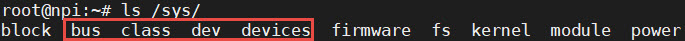
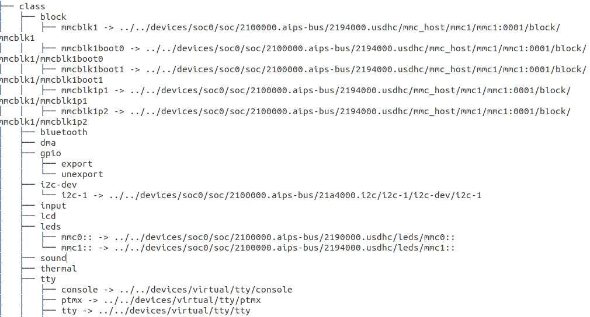

.. vim: syntax=rst

平台设备驱动
======
前面讲解Linux文件目录时，提到过sysfs文件系统，该文件系统用于把内核的设备驱动导出到用户空间，用户便可通过访问sys目录及其下的文件，来查看甚至控制内核的一些驱动设备。

本章的内容重点在于图片中红框处的几个目录：bus、class、dev、devices。bus目录中包含了当前系统中已经注册了的所有总线，例如i2c，spi，platform等。我们看到每个总线目录都拥有两个子目录devices和drivers，分别记录着挂载在该总线的所有设备以及驱动。

.. image:: ./media/bus.jpg
   :align: center
   :alt: /sys/bus目录

class目录则是将系统中现有的设备根据类别进行分类管理，如输入设备（input）有触摸屏，鼠标以及键盘，块设备（block）有SD卡，NAND FLASH。

devices目录记录了系统中所有设备的拓扑结构，在sys目录下所有设备文件最终都会指向该目录对应的设备文件；dev目录下中记录所有的设备节点（非拓扑结构），但实际上都是些链接文件，同样指向了devices目录下的文件。

Linux的设备模型
~~~~
在旧版本的Linux代码中，设备之间没有任何联系，大部分代码是可以通用的，为了解决重用性差的问题，Linux2.6版本开始提出了Linux的设备模型（Linux device model），以减少冗余的代码。

在嵌入式中，我们接触到的某个设备大部分是依靠总线来进行通信的，对于野火开发板而言，触摸芯片是依赖于I2C，鼠标、键盘等HID设备，则是依赖于USB。从功能上讲，这些设备都是将文字、字符、控制命令或采集的数据等信息输入到计算机。于是，Linux设备模型将共性的部分进行归纳，提出了三个重要概念：总线（bus）、类（class）以及设备（device），
并抽象出一套标准的数据结构和接口，使得开发设备驱动只需要填充特定的数据结构。

.. image:: ./media/LDM.jpg
   :align: center
   :alt: Linux设备模型

总线
----
总线是连接处理器和设备之间的桥梁，总线驱动则负责实现总线的各种行为，其管理两个链表，分别是添加到该总线的设备链表以及注册到该总线的驱动链表。当你向总线添加（移除）一个设备（驱动）时，便会在对应的列表上添加新的节点，
同时对挂载在该总线的驱动以及设备进行匹配，匹配过程中会忽略掉那些已经有驱动匹配的设备。

内核使用结构体bus_type来表示总线，如下所示：

.. code-block:: c 
    :caption: bus_type结构体（内核源码/include/linux/device.h）
    :linenos:

    struct bus_type {
	const char		*name;
	const char		*dev_name;
	struct device		*dev_root;
	struct device_attribute	*dev_attrs;	/* use dev_groups instead */
	const struct attribute_group **bus_groups;
	const struct attribute_group **dev_groups;
	const struct attribute_group **drv_groups;

	int (*match)(struct device *dev, struct device_driver *drv);
	int (*uevent)(struct device *dev, struct kobj_uevent_env *env);
	int (*probe)(struct device *dev);
	int (*remove)(struct device *dev);
	void (*shutdown)(struct device *dev);

	int (*online)(struct device *dev);
	int (*offline)(struct device *dev);

	int (*suspend)(struct device *dev, pm_message_t state);
	int (*resume)(struct device *dev);

	const struct dev_pm_ops *pm;

	const struct iommu_ops *iommu_ops;

	struct subsys_private *p;
	struct lock_class_key lock_key;
    };

- match : 当向总线注册一个新的设备或者是新的驱动时，会调用该回调函数。该回调函数主要负责判断是否有注册了的驱动适合新的设备，新的驱动能否驱动总线上已注册但没有驱动匹配的设备；
- probe : 当总线将设备以及驱动相匹配之后，执行该回调函数,最终会调用驱动提供的probe函数。
- remove : 当设备从总线移除时，调用该回调函数；
- suspend、resume : 电源管理的相关函数，当总线进入睡眠模式时，会调用suspend回调函数；而resume回调函数则是在唤醒总线的状态下执行；
- pm : 电源管理的结构体，存放了一系列跟总线电源管理有关的函数，与device_driver结构体中的pm_ops有关；
- drv_groups 、dev_groups 、bus_groups: 分别表示驱动、设备以及总线的默认属性。对于驱动而言，在目录/sys/bus/<bus-name>/driver/<driver-name>存放了设备的默认属性；设备则在目录/sys/bus/<bus-name>/devices/<driver-name>中。

When a new device is added, the bus’s list of drivers is iterated over to find one that supports it. In order to determine that, the device ID of the device must match one of the device IDs that the driver supports. The format and semantics for comparing IDs is bus-specific. Instead of trying to derive a complex state machine and matching algorithm, it is up to the bus driver to provide a callback to compare a device against the IDs of a driver. The bus returns 1 if a match was found; 0 otherwise.

int match(struct device * dev, struct device_driver * drv);

If a match is found, the device’s driver field is set to the driver and the driver’s probe callback is called. This gives the driver a chance to verify that it really does support the hardware, and that it’s in a working state.

设备
----
内核使用device结构体来抽象我们的硬件设备，该结构通常会嵌入到特定总线平台的数据结构中，如下所示：

.. code-block:: c
    :caption: i2c_client结构体
    :linenos:

    待补充

.. code-block:: c 
	:caption: device结构体(内核源码/include/linux/device.h）
	:linenos:

	struct device {
		struct device		*parent;

		struct device_private	*p;

		struct kobject kobj;
		const char		*init_name; /* initial name of the device */
		const struct device_type *type;

		struct mutex		mutex;	/* mutex to synchronize calls to
						* its driver.
						*/

		struct bus_type	*bus;		/* type of bus device is on */
		struct device_driver *driver;	/* which driver has allocated this
						device */
		void		*platform_data;	/* Platform specific data, device
						core doesn't touch it */
		void		*driver_data;	/* Driver data, set and get with
						dev_set/get_drvdata */
		struct dev_pm_info	power;
		struct dev_pm_domain	*pm_domain;

	#ifdef CONFIG_PINCTRL
		struct dev_pin_info	*pins;
	#endif

	#ifdef CONFIG_NUMA
		int		numa_node;	/* NUMA node this device is close to */
	#endif
		u64		*dma_mask;	/* dma mask (if dma'able device) */
		u64		coherent_dma_mask;/* Like dma_mask, but for
							alloc_coherent mappings as
							not all hardware supports
							64 bit addresses for consistent
							allocations such descriptors. */
		unsigned long	dma_pfn_offset;

		struct device_dma_parameters *dma_parms;

		struct list_head	dma_pools;	/* dma pools (if dma'ble) */

		struct dma_coherent_mem	*dma_mem; /* internal for coherent mem
							override */
	#ifdef CONFIG_DMA_CMA
		struct cma *cma_area;		/* contiguous memory area for dma
						allocations */
	#endif
		/* arch specific additions */
		struct dev_archdata	archdata;

		struct device_node	*of_node; /* associated device tree node */
		struct fwnode_handle	*fwnode; /* firmware device node */

		dev_t			devt;	/* dev_t, creates the sysfs "dev" */
		u32			id;	/* device instance */

		spinlock_t		devres_lock;
		struct list_head	devres_head;

		struct klist_node	knode_class;
		struct class		*class;
		const struct attribute_group **groups;	/* optional groups */

		void	(*release)(struct device *dev);
		struct iommu_group	*iommu_group;

		bool			offline_disabled:1;
		bool			offline:1;
	};	

- parent：表示该设备的父对象，若设备依赖于某个总线，则该成员需要指向该总线对应的控制器;
- bus：表示该驱动依赖于哪个总线；
- type：表示该设备的类型，
- kobj：
- of_node：存放设备树中匹配的设备节点。当内核使能设备树，总线负责将驱动的of_match_table以及设备树的compatible属性进行比较之后，将匹配的节点保存到该变量。
- platform_data：特定设备的私有数据，通常定义在板级文件中；
- driver_data：
- class：指向了该设备对应类
- group：指向struct attribute_group类型的指针，指定该设备的默认参数；
- release：当设备的引用个数为0时，会调用该函数。

驱动
----

.. code-block:: c 
	:caption: device_driver结构体(内核源码/include/linux/device.h）
	:linenos:

	struct device_driver {
		const char		*name;
		struct bus_type		*bus;

		struct module		*owner;
		const char		*mod_name;	/* used for built-in modules */

		bool suppress_bind_attrs;	/* disables bind/unbind via sysfs */

		const struct of_device_id	*of_match_table;
		const struct acpi_device_id	*acpi_match_table;

		int (*probe) (struct device *dev);
		int (*remove) (struct device *dev);
		void (*shutdown) (struct device *dev);
		int (*suspend) (struct device *dev, pm_message_t state);
		int (*resume) (struct device *dev);
		const struct attribute_group **groups;

		const struct dev_pm_ops *pm;

		struct driver_private *p;
	};	

- name：指定驱动名称，总线进行匹配时，利用该成员与设备名进行比较；
- suppress_bind_attrs： 布尔量，用于指定是否通过sysfs导出bind与unbind文件，bind与unbind文件是驱动用于绑定/解绑关联的设备。
- bus：表示该驱动依赖于哪个总线，内核需要保证在驱动执行之前，对应的总线能够正常工作；
- owner：表示该驱动的拥有者，一般设置为THIS_MODULE；
- of_match_table：指定该驱动支持的设备类型。当内核使能设备树时，会利用该成员与设备树中的compatible属性进行比较。
- suspend、resume：电源管理函数；
- remove：当设备从操作系统中拔出或者是系统重启时，会调用该回调函数；
- probe：
- group：指向struct attribute_group类型的指针，指定该驱动的默认参数；

对于USB，I2S，I2C，UART，SPI等物理总线，我们都并不陌生。而像i2c设备、usb设备、spi设备等等，
都是直接挂在对应的总线下，与cpu进行数据交互的。但是在嵌入式系统当中，并不是所有的设备都能有对应
的总线。为了让这些没有总线可依靠的设备，能够满足“总线-设备-驱动”的驱动模型，Linux设备驱动模型虚
构出一条总线——平台总线，它用于挂载那些不依赖于物理总线的设备。我们经常接触到i.MX6的SPI、
I2C、UART并不是实际的物理总线，而是叫SPI控制器、I2C控制器、UART控制器，也是属
于一种硬件设备，对于Linux内核而言，属于平台设备，并挂载在平台总线下。

平台总线
~~~~~

在Linux的设备驱动模型中，总线是最重要的一环。在设备驱动模型章节中，我们提到过总线是负责匹配设备和驱动，

它维护了一个链表，里面记录着各个已经注册的平台设备和平台驱动。每当有新的设备或者是新的驱动加入到总线时，
总线便会调用platform_match函数对新增的设备或驱动，进行配对。它的匹配方式是通过比较字符串是否一致。

.. code-block:: c
    :caption: platform_match函数(内核源码/driver/base/platform.c)
    :linenos:

    static int platform_match(struct device *dev, struct device_driver *drv)
    {
        struct platform_device *pdev = to_platform_device(dev);
        struct platform_driver *pdrv = to_platform_driver(drv);

        /* When driver_override is set, only bind to the matching driver */
        if (pdev->driver_override)
            return !strcmp(pdev->driver_override, drv->name);

        /* Attempt an OF style match first */
        if (of_driver_match_device(dev, drv))
            return 1;

        /* Then try ACPI style match */
        if (acpi_driver_match_device(dev, drv))
            return 1;

        /* Then try to match against the id table */
        if (pdrv->id_table)
            return platform_match_id(pdrv->id_table, pdev) != NULL;

        /* fall-back to driver name match */
        return (strcmp(pdev->name, drv->name) == 0);
    }

平台设备
~~~~~

结构体
----
内核使用struct platform_device来表示平台设备，如下所示（删掉了一些成员变量）：

.. code-block:: c
    :caption: platform_device结构体(内核源码/include/linux/platform_device.h)
    :linenos:

    struct platform_device {
	const char	*name;
	int		id;
	struct device	dev;
	u32		num_resources;
	struct resource	*resource;
    };

- name：设备的名称，总线进行匹配时，是通过比较设备和驱动的名称，因此必须保证设备和驱动的名称是完全一致的。
- id：
- dev：
- num_resources：记录资源的个数，当结构体成员resource存放的是数组时，需要记录resource数组的个数，内核提供了宏定义ARRAY_SIZE用于计算数组的个数。
- resource：平台设备提供给内核驱动的资源，如irq，dma，内存等等。该结构体会在接下来的内容进行讲解。

注册/移除平台设备
----
当我们完成了上述结构体的初始化时，需要告诉内核，我们定义了一个平台设备。为此，需要使用下面的API，来注册平台设备。

.. code-block:: c
    :caption: platform_device_register函数(内核源码/drivers/base/platform.c)
    :linenos:

    int platform_device_register(struct platform_device *pdev)
    {
        device_initialize(&pdev->dev);
        arch_setup_pdev_archdata(pdev);
        return platform_device_add(pdev);
    }
    EXPORT_SYMBOL_GPL(platform_device_register);

同样，当我们想要移除我们的平台设备时，我们需要使用platform_device_unregister函数，来通知内核去移除该设备。

.. code-block:: c 
    :caption: platform_device_unregister函数(内核源码/drivers/base/platform.c)
    :linenos:

    void platform_device_unregister(struct platform_device *pdev)
    {
        platform_device_del(pdev);
        platform_device_put(pdev);
    }
    EXPORT_SYMBOL_GPL(platform_device_unregister);

资源
----

对于平台设备而言，内核对于该设备一无所知。为此，在我们定义平台设备时，
往往需要提供一些资源，比如这个设备使用的中断编号，寄存器的内存地址等等，这样的话，内核驱动就知道，如何使这个设备正常工作了。
平台设备向设备驱动提供资源的方式有两种：一、通过内核提供的资源类型，共有六种；二、我们自定义的数据类型，即私有数据。

内核提供的资源
^^^^^^^^^^
接触过单片机的读者，应该都知道：想要设备能够正常工作，需要对设备的寄存器以及中断信号进行设置。对于Linux而言，也不外如此。
Linux用资源来描述一个设备正常工作所需要的元素，比如IRQ，MEM，DMA等。内核提供了六种类型资源：

.. code-block:: c
    :caption: 资源宏定义(内核源码/include/linux/ioport.h)
    :linenos:

    #define IORESOURCE_IO		0x00000100	/* PCI/ISA I/O ports */
    #define IORESOURCE_MEM		0x00000200
    #define IORESOURCE_REG		0x00000300	/* Register offsets */
    #define IORESOURCE_IRQ		0x00000400
    #define IORESOURCE_DMA		0x00000800
    #define IORESOURCE_BUS		0x00001000

私有数据
^^^^^^
Linux只提供了六种资源类型，很明显，当我们所需要数据，如某个GPIO，并不包含在上述六种中，为此，诞生了私有数据。在platform_device结构体中，嵌入了device结构体，
该结构体有个变量platform_data，可以用于保存自定义数据。

我们在platform_device结构体中提到过资源，在内核中采用struct resource来表示，如下所示：

.. code-block:: c
    :caption: resource结构体(内核源码/include/linux/ioport.h)
    :linenos:

    /*
    * Resources are tree-like, allowing
    * nesting etc..
    */
    struct resource {
        resource_size_t start;
        resource_size_t end;
        const char *name;
        unsigned long flags;
    };

删除了一些成员变量

平台驱动
~~~~~~

如何注册平台驱动
------

结构体
^^^^^

.. code-block:: c
    :caption: platform_driver结构体(内核源码/include/platform_device.h)
    :linenos:

    struct platform_driver {
        int (*probe)(struct platform_device *);
        int (*remove)(struct platform_device *);
        struct device_driver driver;
        const struct platform_device_id *id_table;
    };

- probe：函数指针类型，指向我们的probe函数，当总线为设备和驱动匹配上之后，会执行驱动的probe函数。我们通常在该函数中，对设备进行一系列的初始化。
- remove:函数指针类型，指向我们的remove函数，当我们移除我们的平台设备时，会调用该函数，该函数实现的操作，通常是probe函数的逆过程。
- driver:
- id_table：表示该驱动能够兼容的设备类型，总线进行匹配时，也会依据该结构体的name成员进行对比。

.. code-block:: c
    :caption: id_table结构体(内核源码/include/linux/mod_devicetable.h)
    :linenos:

    struct platform_device_id {
        char name[PLATFORM_NAME_SIZE];
        kernel_ulong_t driver_data;
    };

我们可以看到，platform_device_id中还有另一个成员driver_data。对于某些设备，他们之间的区别往往可能只是在某个寄存器的地址或者配置不同，我们可以利用成员来区分不同的设备，
这样就可以实现一个驱动可以匹配多个设备的功能。

初始化/移除平台驱动

.. code-block:: c 
    :caption: platform_driver_register函数
    :linenos:

    int platform_driver_register(struct platform_driver *drv);

.. code-block:: c 
    :caption: platform_driver_unregister函数(内核源码/drivers/base/platform.c)
    :linenos:

    void platform_driver_unregister(struct platform_driver *drv);

获取资源API
^^^^^

.. code-block:: c
    :caption: platform_get_resource函数
    :linenos:

    struct resource *platform_get_resource(struct platform_device *dev, unsigned int type, unsigned int num);

.. code-block:: c 
    :caption: platform_get_irq函数
    :linenos:

    int platform_get_irq(struct platform_device *pdev, unsigned int num)

实验
~~~~~~

注册平台设备
------

resource结构体
^^^^

我们定义了两种类型的资源，分别是IORESOURCE_MEM，其起始地址为0x1000,结束地址为0x2000,大小为4096个字节；另一个
则是IORESOURCE_IRQ，它使用的中断编号为1。

.. code-block:: c
    :caption: my_pdev_res结构体数组(文件my_pdev.c) 
    :linenos:

    static struct resource my_pdev_res[] = {
        [0] = {
            .name = "mem",
            .start = 0x1000,
            .end = 0x2000,
            .flags = IORESOURCE_MEM,
            },
        [1] = {
            .name = "irq",
            .start = 0x1,
            .end = 0x1,
            .flags = IORESOURCE_IRQ,
            },
    };

platform_device结构体
^^^^^

在注册平台设备之前，我们还需要实现platform_device结构体。

.. code-block:: c 
    :caption: my_pdev结构体
    :linenos:

    static int my_pdev_id = 0x1D;

    static void my_pdev_release(struct device *dev)
    {
        return;
    }

    static struct platform_device my_pdev = {
        .id = 0,
        .name = "my_pdev",
        .resource = my_pdev_res,
        .num_resources = ARRAY_SIZE(my_pdev_res),
        .dev = {
            .platform_data = &my_pdev_id,
            .release = my_pdev_release,
            },
    };

我们定义了一个名为my_pdev的平台设备。我们注意到我们定义了一个空的my_pdev_release函数，这是因为一旦我们没定义该函数时，移除平台设备时，会提示“
Device 'xxxx' does not have a release() function, it is broken and must be fixed”的错误。此外，我们的私有数据设置为my_pdev_id变量的地址。

注册平台设备
^^^^^

.. code-block:: c 
    :caption: my_pdev_init函数(文件my_pdev.c)
    :linenos:

    static __init int my_pdev_init(void)
    {
        printk("my_pdev module loaded\n");

        platform_device_register(&my_pdev);

        return 0;
    }

    module_init(my_pdev_init);

移除平台设备
^^^^^

.. code-block:: c 
    :caption: my_pdev_exit函数(文件my_pdev.c)
    :linenos:

    static __exit void my_pdev_exit(void)
    {
        printk("my_pdev module unloaded\n");

        platform_device_unregister(&my_pdev);
    }

    module_exit(my_pdev_exit);

注册平台设备
------

platform_device_id结构体
^^^^^

.. code-block:: c 
    :caption: my_pdev_ids结构体(文件my_pdrv.c)
    :linenos:
    static int index0 = 0;
    static int index1 = 1;

    static struct platform_device_id my_pdev_ids[] = {
        {.name = "my_pdev",.driver_data = &index0},
        {.name = "my_test",.driver_data = &index1},
        {}
    };

    MODULE_DEVICE_TABLE(platform, my_pdev_ids);

probe函数
^^^^^

.. code-block:: c 
    :caption: my_pdrv_probe函数(文件my_pdrv.c)
    :linenos:

    static int my_pdrv_probe(struct platform_device *pdev)
    {
        struct resource *mem = NULL;
        int irq;
        struct platform_device_id *id_match = pdev->id_entry;
        int *pdev_id = NULL;
        name = id_match->name;
        index = id_match->driver_data;
        printk("Hello! %s probed!The index is : %d\n", name, *index);

        mem = platform_get_resource(pdev, IORESOURCE_MEM, 0);
        if (!mem) {
            printk("Resource not available\n");
            return -1;
        }
        printk("The name : %s, The start : %d, The end : %d\n", mem->name,
            mem->start, mem->end);
        irq = platform_get_irq(pdev, 0);
        printk("The irq : %d\n", irq);

        pdev_id = dev_get_platdata(&pdev->dev);
        printk("The device id : 0x%x\n", *pdev_id);
        return 0;
    }

remove函数
^^^^^

由于我们的驱动比较简单，在probe函数并没有申请什么内存，因此，remove函数也就不需要进行资源的释放。

.. code-block:: c 
    :caption: my_pdrv_remove函数(文件my_pdrv.c)
    :linenos:

    static int my_pdrv_remove(struct platform_device *pdev)
    {
        printk("Hello! %s removed!The index is : %d\n", name, *index);
        return 0;
    }

platform_device结构体
^^^^^

.. code-block:: c 
    :caption: my_pdrv结构体
    :linenos:

    static struct platform_driver my_pdrv = {
        .probe = my_pdrv_probe,
        .remove = my_pdrv_remove,
        .driver = {
            .name = "my_pdev",
            .owner = THIS_MODULE,
            },
        .id_table = my_pdev_ids,
    };

注册平台驱动
^^^^

.. code-block:: c 
    :caption: my_pdrv_init函数
    :linenos:

    static __init int my_pdrv_init(void)
    {
        printk("my_pdrv module loaded\n");

        platform_driver_register(&my_pdrv);

        return 0;
    }

    module_init(my_pdrv_init);

移除平台驱动
^^^

.. code-block:: c 
    :caption: my_pdrv_exit函数
    :linenos:

    static __exit void my_pdrv_exit(void)
    {
        printk("my_pdrv module unloaded\n");

        platform_driver_unregister(&my_pdrv);

    }

    module_exit(my_pdrv_exit);   

Makefile
------

.. code-block:: c 
    :caption: Makefile
    :linenos:

    KERNEL_DIR = /home/wind/ebf_6ull_linux

    obj-m := my_pdev.o my_pdrv.o

    all:modules
    modules clean:
        $(MAKE) -C $(KERNEL_DIR) M=$(shell pwd) $@

实验结果
-----

