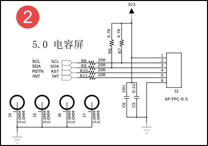

.. vim: syntax=rst

电容触摸驱动实验
--------

有关电容触摸的基础知识内容可以参考野火STM32相关教程，这里只介绍电容触摸驱动的相关内容。

本章配套源码、设备树以及更新固件位于“~/embed_linux_tutorial/base_code/touch_scream_GTxxx”目录下。

触摸面板通过双面胶粘在显示屏上，他们在硬件上没有关联，通常情况下我们会设置触摸面板的“分辨率”与显示屏的分辨率一致。电容触摸面板通过触摸芯片采集、处理触摸信息，我们要做的就是配置触摸芯片、读取触点坐标。

常见的触摸接口原理图如下所示。

触摸芯片有四个引脚连接到了单片机，其中scl、sda是IIC通信引脚。RSTN是触摸的复位引脚，配置触摸芯片时也会用到。INT是中断引脚，默认高电平。发生触摸后该引脚会发送一个低电平的脉冲信号。

从硬件连接我们可以大致得知电容触摸驱动要用到IIC设备驱动、中断驱动。由于电容触摸驱动要向应用层提交触摸消息所以还会用到输入子系统。

IIC设备驱动、中断驱动和输入子系统在之前章节已经介绍，我们现在可以自己从零写一个触摸驱动，但是我们不这样做，因为大多情况下触摸芯片厂商已经编写好了触摸驱动，我们只需要稍加修改就可以使用。

我们使用的触摸芯片型号如下，4.3寸使用的GT5688，5寸使用的是GT917S或GT9157,7寸屏使用的是GT911。它们都属于GOODIX公司生产的触摸芯片，厂商已经写好了触摸驱动并且添加默认添加到了内核中。源码位于“~/drivers/input/touchscreen/goodix.c”这
个驱动程序并不能完全适配我们使用的这些触摸型号，所以我们需要稍加修改才能使用。下面我们结合源码简单介绍驱动实现原理以及如何根据实际需要修改驱动。

添加设备树节点
~~~~~~~

设备树节点有两个任务，第一，添加触摸使用的引脚，第二，添加IIC设备节点。介绍如下。

根据之前讲解，触摸芯片共占用4个IO口。这四个IO如下所示。

================= ===================================================
引脚              功能
================= ===================================================
SNVS_TAMPER9引脚  复用为GPIO5_IO09用作触摸芯片的irq引脚，接收触摸中断
LCD_RESET引脚     复用为GPIO3_IO04用作触摸芯片的复位引脚
UART4_TX_DATA引脚 复用为I2C1_SCL，用作IIC1的SCL引脚
UART4_RX_DATA引脚 复用为I2C1_SDA，用作IIC1的 SDA引脚
================= ===================================================

知道了各个引脚的复用功能，在设备树中把它们追加到iomuxc就很容易了，需要注意的是SNVS_TAMPER9引脚被复用为GPIO5_IO09，需要追加到iomuxc_snvs节点，以“SNVS”开头的引脚与普通引脚使用的驱动不同，特别注意要分开。源码如下：

.. code-block:: c 
    :caption: 在设备树中添加引脚信息
    :linenos:

    &iomuxc {
        /*-----------其他内容省略-----------*/
    	pinctrl_uart1: uart1grp {
    		fsl,pins = <
    			MX6UL_PAD_UART1_TX_DATA__UART1_DCE_TX 0x1b0b1
    			MX6UL_PAD_UART1_RX_DATA__UART1_DCE_RX 0x1b0b1
    		>;
    	};
    
    	pinctrl_tsc_reset: tscresetgrp {
    	    fsl,pins = <
    	        /* used for tsc reset */
    	        MX6UL_PAD_LCD_RESET__GPIO3_IO04		0x10b0
    	    >;
    	};
    };
    
    
    &iomuxc_snvs {
    	pinctrl_tsc_irq: tsc_irq {
    	    fsl,pins = <
    	        MX6ULL_PAD_SNVS_TAMPER9__GPIO5_IO09        0x4001b8b0   
    	    >;
    	};
    };

触摸驱动作为一个IIC设备挂载在IIC1总线上，它和我们之前讲解的iic接口的OLED驱动一样，需要在IIC1设备节点下追加相应的子节点，不同的是这里用到的两个GPIO和一个中断，设备节点如下所示。

.. code-block:: c 
    :caption: 在iic1节点追加
    :linenos:

    &i2c1 {
        /*--------------第一部分--------------*/
    	clock-frequency = <100000>;
    	pinctrl-names = "default";
    	pinctrl-0 = <&pinctrl_i2c1>;
    	status = "okay";
         
    	gtxx_tsc@5d {
    		compatible = "fire,gt9xx_test";
    
            /*--------------第二部分--------------*/
    		pinctrl-0 = <&pinctrl_tsc_reset>;
    		pinctrl-1 = <&pinctrl_tsc_irq>;
    		reg = <0x5d>;       -----------------①
    		status = "okay";
    
            /*--------------第三部分--------------*/
    		/*gpio*/
    		reset-gpios = <&gpio3 4 GPIO_ACTIVE_LOW>;
    		irq-gpios = <&gpio5 9 GPIO_ACTIVE_HIGH>;
    
            /*--------------第四部分--------------*/
    		/*中断*/
    		interrupt-parent = <&gpio5>;
    		interrupts = <9 IRQ_TYPE_EDGE_FALLING>;
    		irq-flags = <2>;		/*1:rising 2: falling*/	   
    	};
    };

结合以上内容简单介绍如下：

第一部分，定义IIC166的一些基本属性，主要包括 IIC1使用的引脚以及IIC1的scl的时钟频率，时钟频率的范围要参考触摸芯片手册，不能超出芯片最大支持的频率。我们使用的GTxxx触摸芯片最大支持400KHz，这里将频率设置为100KHz,满足要求。

第二部分，这里是添加的触摸驱动要使用的中断引脚以及复位引脚。标号①处是触摸芯片在IIC1总线上的地址。

第三部分，添加使用的GPIO，这里使用GPIO子系统将触摸芯片使用的irq引脚、rest引脚复用为GPIO.

第四部分，添加中断相关内容，这里将触发方式设置为上升和下降沿触发，具体内容可参考中断章节，这里不再赘述。

goodix官方触摸驱动讲解
~~~~~~~~~~~~~~

由于goodix官方触摸驱动稍复杂，这里只讲解实现方法，以及如何简单修改驱动以适配多种触摸芯片，阅读本小节时推荐打开“~/drivers/input/touchscreen/goodix.c”源码。

修改设备树匹配信息
^^^^^^^^^

和其他驱动类似，打开官方驱动后首先要找到“设备树匹配”相关内容。如下所示。

.. code-block:: c 
    :caption: 在iic1节点追加
    :linenos:

    static const struct of_device_id goodix_of_match[] = {
    	{ .compatible = "goodix,gt1151" },
    	{ .compatible = "goodix,gt911" },
    	{ .compatible = "goodix,gt9110" },
    	{ .compatible = "goodix,gt912" },
    	{ .compatible = "goodix,gt927" },
    	{ .compatible = "goodix,gt9271" },
    	{ .compatible = "goodix,gt928" },
    	{ .compatible = "goodix,gt967" },---------------①
    	{ }
    };
    MODULE_DEVICE_TABLE(of, goodix_of_match);
    #endif
    
    static struct i2c_driver goodix_ts_driver = {   -----②
    	.probe = goodix_ts_probe,
    	.remove = goodix_ts_remove,
    	// .id_table = goodix_ts_id, --------------------③
    	.driver = {
    		.name = "Goodix-TS",
    		.acpi_match_table = ACPI_PTR(goodix_acpi_match),
    		.of_match_table = of_match_ptr(goodix_of_match),
    		.pm = &goodix_pm_ops,
    	},
    };

结合以上代码介绍如下。标号①，这里就是用于和设备树节点匹配的匹配值，我们将前面编写的设备树节点添加进去即可。标号②，这个就是i2c设备驱
动结构体，它代表了一个I2C设备。标号③处是传统的匹配配方式，我们不用可以屏蔽掉。

prob函数实现
^^^^^^^^

.prob函数完成初始化工作，代码如下：

.. code-block:: c 
    :caption: .prob函数
    :linenos:

    static int goodix_ts_probe(struct i2c_client *client,
    			   const struct i2c_device_id *id)
    {
    	struct goodix_ts_data *ts;
    	int error;
    
        /*------------------第一部分---------------*/
    	dev_dbg(&client->dev, "I2C Address: 0x%02x\n", client->addr); ------①
    
    	if (!i2c_check_functionality(client->adapter, I2C_FUNC_I2C)) {  -----②
    		dev_err(&client->dev, "I2C check functionality failed.\n");
    		return -ENXIO;
    	}
    
        /*------------------第二部分---------------*/
    	ts = devm_kzalloc(&client->dev, sizeof(*ts), GFP_KERNEL); 
    	if (!ts)
    		return -ENOMEM;
    
    	ts->client = client;
    	i2c_set_clientdata(client, ts);
    	init_completion(&ts->firmware_loading_complete);
    
        /*------------------第三部分---------------*/
    	error = goodix_get_gpio_config(ts);  -------------③
    	if (error)
    		return error;
    
    	if (ts->gpiod_int && ts->gpiod_rst) {
    		/* reset the controller */
    		error = goodix_reset(ts);--------------------④
    		if (error) {
    			dev_err(&client->dev, "Controller reset failed.\n");
    			return error;
    		}
    	}
    	error = goodix_i2c_test(client);----------------⑤
    	if (error) {
    		dev_err(&client->dev, "I2C communication failure: %d\n", error);
    		return error;
    	}
    
    	error = goodix_read_version(ts);----------------⑥
    	if (error) {
    		dev_err(&client->dev, "Read version failed.\n");
    		return error;
    	}
    
    	ts->chip = goodix_get_chip_data(ts->id);--------⑦
    	dev_err(&client->dev, " goodix_get_chip_data \n");
    
        /*------------------第四部分---------------*/
    	if (ts->gpiod_int && ts->gpiod_rst) {
    		/* update device config */
    		ts->cfg_name = devm_kasprintf(&client->dev, GFP_KERNEL,
    					      "goodix_%d_cfg.bin", ts->id); --------⑧
    		if (!ts->cfg_name)
    			return -ENOMEM;
    
    		error = request_firmware_nowait(THIS_MODULE, true, ts->cfg_name,
    						&client->dev, GFP_KERNEL, ts,
    						goodix_config_cb);--------------------⑨
    		if (error) {
    			dev_err(&client->dev,
    				"Failed to invoke firmware loader: %d\n",
    				error);
    			return error;
    		}
    
    		return 0;
    	} 
    	else 
    	{
    		error = goodix_configure_dev(ts);
    		if (error)
    			return error;
    	}
    
    	return 0;
    }

prob函数较长，但是理解起来很简单，也没有什么需要修改的地方，结合源码简单介绍如下：

第一部分，进入.prob函数后做了一些简单的检查，比如，标号①处打印触摸设备的i2c地址。这个地址是在触摸的设备节点中设置的。标号②处检查是否支持IIC功能。

第二部分，为goodix_ts_data类型的结构体变量ts申请空间并初始化，在驱动中使用goodix_ts_data结构体保存触摸驱动信息。结构体原型如下。

.. code-block:: c 
    :caption: .goodix_ts_data结构体
    :linenos:

    struct goodix_ts_data {
    	struct i2c_client *client;  //i2c 从设备结构体
    	struct input_dev *input_dev; //输入设备结构体
    	const struct goodix_chip_data *chip;  //goodix相关内容
    	struct touchscreen_properties prop;   //未知内容
    	unsigned int max_touch_num;     //做大支持的触摸点
    	unsigned int int_trigger_type;  //触摸类型
    	struct gpio_desc *gpiod_int;    //触摸中断引脚
    	struct gpio_desc *gpiod_rst;    //触摸芯片复位引脚
    	u16 id;					        //触摸芯片
    	u16 version;                    //版本
    	const char *cfg_name;           //名字
    	struct completion firmware_loading_complete;  //固件加载完成标志
    	unsigned long irq_flags;        //中断标记
    };
    

后面的初始化将会使用这个结构体。结构体成员含义见注释，这里不再赘述。接着回到.prob函数。

第三部分，完成一些基本的初始化。这部分内容调用一些以“goodix_”开头的函数，这些函数是goodix官方实现的一些函数，定义在改文件内，从函数名我们可以大致知道函数的功能，简单说明如下，标号③，获取触摸芯片rst和int使用的GPIO。标号④,复位触摸芯片。标号⑤，测试IIC，尝试与触摸芯片通信
。标号⑥，读取触摸芯片版本，后边会根据触摸芯片版本来初始化触摸芯片。标号⑦，根据标号⑥获取的触摸芯片型号指定触摸的一些配置参数。函数原型如下所示。

.. code-block:: c 
    :caption:  goodix_get_chip_data函数
    :linenos:

	/*------------------第一部分------------------*/
    static const struct goodix_chip_data *goodix_get_chip_data(u16 id)
    {
    	switch (id) {
    	case 1151:
    		return &gt1x_chip_data;
    	case 911:
    	case 9271:
    	case 9110:
    	case 927:
    	case 928:
    		return &gt911_chip_data;
    	
    	case 912:
    	case 9157:         // fire 新增 
    		return &gt9x_chip_data;
    	case 917:         // fire 新增 
    		return &gt917_chip_data;
    	case 5688:         // fire 新增 
    		return &gt5688_chip_data;	
    	case 967:
    		return &gt967_chip_data;
    
    	default:
    		return &gt9x_chip_data;
    	}
    }
    
    /*------------------第二部分------------------*/
    
    
    /*结构体原型*/
    struct goodix_chip_data {
    	u16 config_addr;
    	int config_len;
    	int (*check_config)(struct goodix_ts_data *, const struct firmware *);
    };
    
    static const struct goodix_chip_data gt9x_chip_data = {
    	.config_addr		= GOODIX_GT9X_REG_CONFIG_DATA,------①
    	.config_len		= GOODIX_CONFIG_MAX_LENGTH,-------------②
    	.check_config		= goodix_check_cfg_8,  -------------③
    };
    
    /*fire 新增 ----*/
    static const struct goodix_chip_data gt917_chip_data = {
    	.config_addr		= GOODIX_GT917_REG_CONFIG_DATA,
    	.config_len		= GOODIX_CONFIG_917_LENGTH,
    	.check_config		= goodix_check_cfg_16,
    };
    
    /*fire 新增 ----*/
    static const struct goodix_chip_data gt5688_chip_data = {
    	.config_addr		= GOODIX_GT917_REG_CONFIG_DATA,
    	.config_len		= GOODIX_CONFIG_5688_LENGTH,
    	.check_config		= goodix_check_cfg_16,
    };
    
    
    /*------------------第三部分------------------*/
    #define GOODIX_CONFIG_917_LENGTH	242    //fire 新增
    #define GOODIX_CONFIG_5688_LENGTH	242    //fire 新增
    
    #define GOODIX_GT5688_REG_CONFIG_DATA	0x8050  //fire 新增
    #define GOODIX_GT917_REG_CONFIG_DATA	0x8050  //fire 新增

结合源码介绍如下。

第一部分，goodix_get_chip_data函数实现，它很简单，仅仅根据芯片ID返回不同的goodix_chip_data结构体地址。goodix_chip_data结构体原型以及初始化实例如第二部分所示，该结构体共有三个参数，第一个用于指定触摸芯片的配置寄存器地址，这个地址是触摸芯片的内部地
址，不同触摸芯片有所不同，查找触摸手册即可，如第三部分所示。第二个参数用于指定配置信息的最大长度，不同触摸芯片配置信息长度是不同的，根据手册设置即可，这里也通过宏定义指出，如第三部分所示。第三个参数是一个函数指针，用于指定“校验”配置信息的函数。再想触摸芯片写入配置信息之前要校验配置信息。根据触摸芯
片的不同分为8位校验和16位校验。稍后会详细讲解校验函数。接着回到.prob函数。

第四部分，这部分内容是驱动程序的重点。从以上三部分可知，到目前为止我们初始化了触摸芯片使用的引脚并且能够与触摸芯片通信了。这部分呢内容完成后续的中断的申请、输入设备的注册、触摸配置信息的读取与更新、触摸事件的上报工作。不过不必担心这部分呢内容几乎不需要我们去修改。

标号⑧处使用devm_kasprintf函数根据触摸芯片的ID合成触摸配置文件的文件名（以下简称为固件）。例如我们使用的GT911，它的ID为911，则触摸更新固件名为“goodix_911_cfg.bin”。

有关更新固件这里简单说明如下。通常情况下我们从供应商那里买到的触摸板已经正确配置了固件，如果你是卖的我们的屏幕（带触摸）默认也是配置好了触摸固件，无需进行修改。如果是公司用户批量生产通常情况下也可以和触摸屏供应商沟通让供应商按照你的要求提前烧写好固件。

标号⑨处使用request_firmware_nowait函数从用户空间获取固件。它的最后一个参数是一个函数指针，用于指定获取成功后的回调函数，回调函数原型如下所示：

.. code-block:: c 
    :caption: firmware回调函数goodix_config_cb
    :linenos:

   static void goodix_config_cb(const struct firmware *cfg, void *ctx)
    {
    	struct goodix_ts_data *ts = ctx;
    	int error;
    	if (cfg) {
    		/* send device configuration to the firmware */
            /*------------------第一部分------------------*/
    		error = goodix_send_cfg(ts, cfg);
    		
    		if (error)
    			goto err_release_cfg;
    	}
         /*------------------第二部分------------------*/
    	goodix_configure_dev(ts);
    
    
    err_release_cfg:
    	release_firmware(cfg);
    	complete_all(&ts->firmware_loading_complete);
    }

从以上代码可以看出，正常情况下该函数只会执行两个以“goodix_”开头的函数，这两个函数完成了后续的初始化。goodix_send_cfg函数完成触摸芯片更新固件的读取、校验、写入工作。goodix_configure_dev函数完成中断的申请、注册，输入设备的注册、设置上报事件等等工作。最终的触
摸事件上报由中断服务函数完成。由于这部分内容较长，我们将这两个函数独立出来讲解，如下所示。

goodix_send_cfg函数实现
^^^^^^^^^^^^^^^^^^^

函数原型如下所示：

.. code-block:: c 
    :caption: goodix_send_cfg函数实现
    :linenos:

    static int  goodix_send_cfg(struct goodix_ts_data *ts,
    			   const struct firmware *cfg)
    {
    	int error;
    /*------------------第一部分------------------*/
    	error = goodix_check_cfg(ts, cfg);
    	if (error)
    		return error;
    
    /*------------------第二部分------------------*/
    	error = goodix_i2c_write(ts->client, ts->chip->config_addr, cfg->data,
    				 cfg->size);
    	if (error) {
    		dev_err(&ts->client->dev, "Failed to write config data: %d",
    			error);
    		return error;
    	}
    	dev_dbg(&ts->client->dev, "Config sent successfully.");
    /*------------------第三部分------------------*/
    	/* Let the firmware reconfigure itself, so sleep for 10ms */
    	usleep_range(10000, 11000);
    
    	return 0;
    }

以上函数功能是校验从应用空间读取得到的触摸更新固件，如果校验通过则调用第二部分的代码将固件写入触摸芯片，我们重点看第一部分的校验函数。函数实现如下所示。

.. code-block:: c 
    :caption: 固件校验函数
    :linenos:

    static int goodix_check_cfg(struct goodix_ts_data *ts,
    			    const struct firmware *cfg)
    {
        /*------------------第一部分------------------*/
    	if (cfg->size > GOODIX_CONFIG_MAX_LENGTH) {
    		dev_err(&ts->client->dev,
    			"The length of the config fw is not correct");
    		return -EINVAL;
    	}
    
        /*------------------第二部分------------------*/
    	return ts->chip->check_config(ts, cfg);
    }

第一部分，校验固件长度是否大于最大支持的固件长度。官方驱动中这里设置为240由于GT917S和GT5688的固件会超过这个最大值，这里要按照GT917S和GT5688的最大值来计算。最终结果是我们要将“GOODIX_CONFIG_MAX_LENGTH”宏定义的值重新定义为242。

第二部分，调用校验函数。在讲解.prob函数的第三部分，我们根据触摸ID指定了校验函数和地址信息。以GT911为例，如下所示。

.. code-block:: c 
    :caption: gt911的goodix_chip_data结构体
    :linenos:

    static const struct goodix_chip_data gt911_chip_data = {
    	.config_addr		= GOODIX_GT9X_REG_CONFIG_DATA,
    	.config_len		= GOODIX_CONFIG_911_LENGTH,
    	.check_config		= goodix_check_cfg_8,
    };

可以看到“check_config”是一个函数指针，它指向了“goodix_check_cfg_8”函数，下面将会调用goodix_check_cfg_8函数完成GT911固件的校验工作，函数实现如下所示。

.. code-block:: c 
    :caption: 固件校验函数
    :linenos:

    static int goodix_check_cfg_8(struct goodix_ts_data *ts,
    			const struct firmware *cfg)
    {
    	int i, raw_cfg_len = cfg->size - 2;
    	u8 check_sum = 0;
    
        /*---------------第一部分---------------*/
    	for (i = 0; i < raw_cfg_len; i++)
    		check_sum += cfg->data[i];
    
    	check_sum = (~check_sum) + 1;
    
        /*---------------第二部分---------------*/
    	if (check_sum != cfg->data[raw_cfg_len]) {
    		dev_err(&ts->client->dev,
    			"The checksum of the config fw is not correct");
    		return -EINVAL;
    	}
    
        /*---------------第三部分---------------*/
    	if (cfg->data[raw_cfg_len + 1] != 1) {
    		dev_err(&ts->client->dev,
    			"Config fw must have Config_Fresh register set");
    		return -EINVAL;
    	}
    	return 0;
    }

校验过程比较简单，与stm32稍有差别。在stm32中我们是计算出配置信息的校验和然后追加到配置信息，然后在最后面添加更新标志。这里读取出来的固件已经加上了校验和并且在固件的最后添加了更新标志，所以这里只需要重新计算校验和并比较是否一致即可代码的第三部分是检测是否有更新标志。

goodix_configure_dev函数实现
^^^^^^^^^^^^^^^^^^^^^^^^

在prob函数的最后会调用两个函数一个是我们上面讲解的固件跟新函数10.2.3 goodix_send_cfg，另外一个是我们这小节要讲解的goodix_configure_dev函数。

总的来说，以上代码是一个IIC设备驱动，它实现了通过IIC1与触摸芯片的通信，但我们最终目标是检测到“按下”或“抬起”事件后通过输入子系统上报给应用层。goodix_configure_dev函数就是用作完成这些后续工作，实现代码如下所示。

.. code-block:: c 
    :caption: 完成设备初始化函数
    :linenos:

    static int goodix_configure_dev(struct goodix_ts_data *ts)
    {
    	int error;
        /*---------------第一部分---------------*/
    	ts->int_trigger_type = GOODIX_INT_TRIGGER;
    	ts->max_touch_num = GOODIX_MAX_CONTACTS;
    
    	ts->input_dev = devm_input_allocate_device(&ts->client->dev);
    	if (!ts->input_dev) {
    		dev_err(&ts->client->dev, "Failed to allocate input device.");
    		return -ENOMEM;
    	}
    
    	ts->input_dev->name = "Goodix Capacitive TouchScreen";
    	ts->input_dev->phys = "input/ts";
    	ts->input_dev->id.bustype = BUS_I2C;
    	ts->input_dev->id.vendor = 0x0416;
    	ts->input_dev->id.product = ts->id;
    	ts->input_dev->id.version = ts->version;
    
        /*---------------第二部分---------------*/
    	/* Capacitive Windows/Home button on some devices */
    	input_set_capability(ts->input_dev, EV_KEY, KEY_LEFTMETA);
    
    	input_set_capability(ts->input_dev, EV_ABS, ABS_MT_POSITION_X);
    	input_set_capability(ts->input_dev, EV_ABS, ABS_MT_POSITION_Y);
    	input_set_abs_params(ts->input_dev, ABS_MT_WIDTH_MAJOR, 0, 255, 0, 0);
    	input_set_abs_params(ts->input_dev, ABS_MT_TOUCH_MAJOR, 0, 255, 0, 0);
    
    	/* Read configuration and apply touchscreen parameters */
    	goodix_read_config(ts);
    
    	/* Try overriding touchscreen parameters via device properties */
    	touchscreen_parse_properties(ts->input_dev, true, &ts->prop);
    
        /*---------------第三部分---------------*/
    	if (!ts->prop.max_x || !ts->prop.max_y || !ts->max_touch_num) {
    		dev_err(&ts->client->dev, "Invalid config, using defaults\n");
    		ts->prop.max_x = GOODIX_MAX_WIDTH - 1;
    		ts->prop.max_y = GOODIX_MAX_HEIGHT - 1;
    		ts->max_touch_num = GOODIX_MAX_CONTACTS;
    		input_abs_set_max(ts->input_dev,
    				  ABS_MT_POSITION_X, ts->prop.max_x);
    		input_abs_set_max(ts->input_dev,
    				  ABS_MT_POSITION_Y, ts->prop.max_y);
    	}
    
    
    	if (dmi_check_system(rotated_screen)) {
    		ts->prop.invert_x = true;
    		ts->prop.invert_y = true;
    		dev_dbg(&ts->client->dev,
    			"Applying '180 degrees rotated screen' quirk\n");
    	}
    
        /*---------------第四部分---------------*/
    	error = input_mt_init_slots(ts->input_dev, ts->max_touch_num,
    				    INPUT_MT_DIRECT | INPUT_MT_DROP_UNUSED);
    	if (error) {
    		dev_err(&ts->client->dev,
    			"Failed to initialize MT slots: %d", error);
    		return error;
    	}
    
    	error = input_register_device(ts->input_dev);
    	if (error) {
    		dev_err(&ts->client->dev,
    			"Failed to register input device: %d", error);
    		return error;
    	}
        /*---------------第五部分---------------*/
    	ts->irq_flags = goodix_irq_flags[ts->int_trigger_type] | IRQF_ONESHOT;
    	error = goodix_request_irq(ts);
    	if (error) {
    		dev_err(&ts->client->dev, "request IRQ failed: %d\n", error);
    		return error;
    	}
    	return 0;
    }

函数内容较多，但是这部分内容不需要我们修改，结合源码介绍如下：

第一部分，根据现有参数初始化输出设备结构体input_dev，一个输入设备结构体代表了一输入设备，再注册它之前需要初始化它的一些参数。

第二部分，同样是初始化输入设备结构体，这部分内容用于设置输出设备能够上报的事件类型以及上报事件。从这里部分代码可以看到上报事件类型有EV_KEY按键事件、绝对坐标事件EV_ABS，绝对坐标事件的键值又分为X坐标值和Y坐标值。

函数goodix_read_config 用于从触摸芯片中读取触摸配置信息并用这些配置信息初始化输入设备。

第三部分，检查主要参数是否出错，如果出错则只用默认的参数配置输入设备。

第四部分，输入设备结构体初始化完成后调用input_register_device函数注册输入设备，注册成功后我们就可以向应用层上报输入触摸事件了。

第五部分，调用goodix_request_irq函数完成中断的申请，函数实现如下所示。

.. code-block:: c 
    :caption: 中断申请函数
    :linenos:

    static int goodix_request_irq(struct goodix_ts_data *ts)
    {
    	return devm_request_threaded_irq(&ts->client->dev, ts->client->irq,
    					 NULL, goodix_ts_irq_handler,
    					 ts->irq_flags, ts->client->name, ts);
    }

申请函数使用了devm_request_threaded_irq函数，在驱动中我们会经常看到“devm_”开头的函数，这些函数大多用于注册、申请工作，使用这一类函数注册、申请的内容无需我们手动注销，驱动退出之前系统会自动完成注销。这里我们重点关注中断的处理函数goodix_ts_irq_handle
r，触摸中断发生有将会在中断服务函数中上报触摸事件。

中断服务函数如下所示：

.. code-block:: c 
    :caption: 中断服务函数
    :linenos:

    static irqreturn_t goodix_ts_irq_handler(int irq, void *dev_id)
    {
    	struct goodix_ts_data *ts = dev_id;
    
    	goodix_process_events(ts); -------------------①
    
    	if (goodix_i2c_write_u8(ts->client, GOODIX_READ_COOR_ADDR, 0) < 0)
    		dev_err(&ts->client->dev, "I2C write end_cmd error\n");
    
    	return IRQ_HANDLED;
    }

标号②处的函数用于处理触摸事件，具体的处理过程这里不再介绍，读者可参考输入子系统章节自行阅读。至此，我么可以知道，当触摸中断发生后将会在中断服务函数中上报输入事件，而应用程序只需要从“/dev/input”目录下对应的节点读取状态即可。

驱动测试
~~~~

.. |touchs002| image:: media\touchs002.png
   :width: 2.80694in
   :height: 1.97986in

