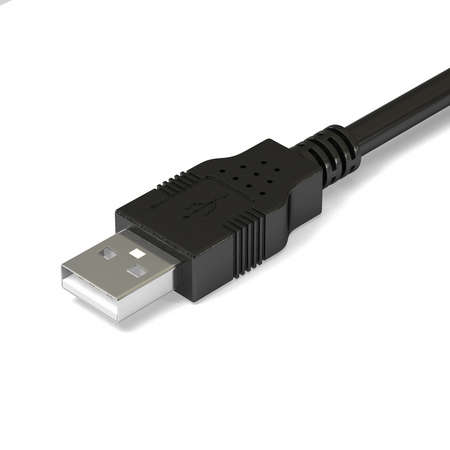
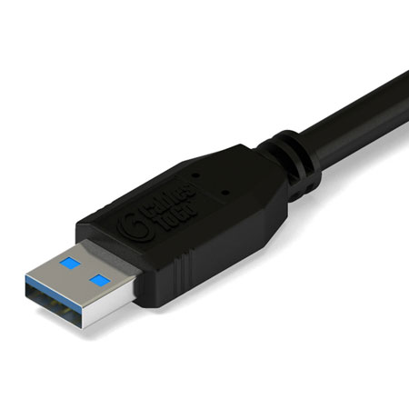
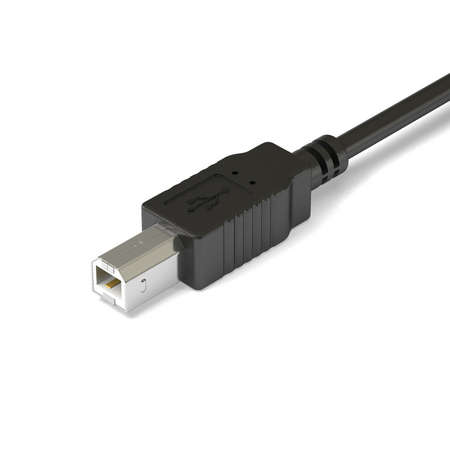
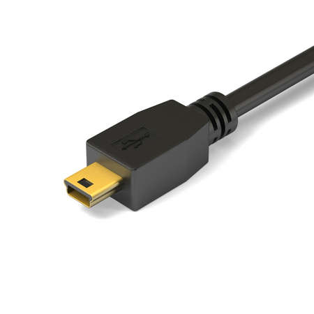
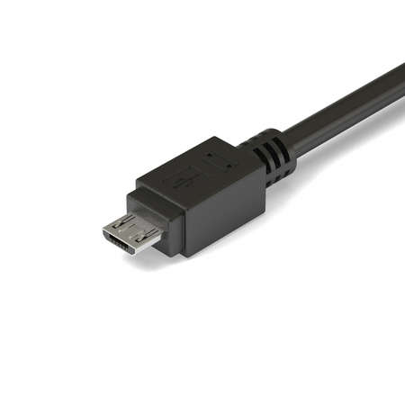
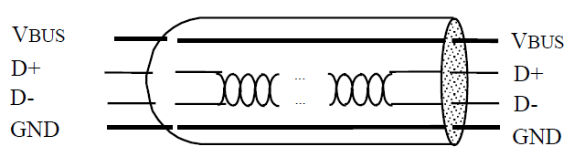
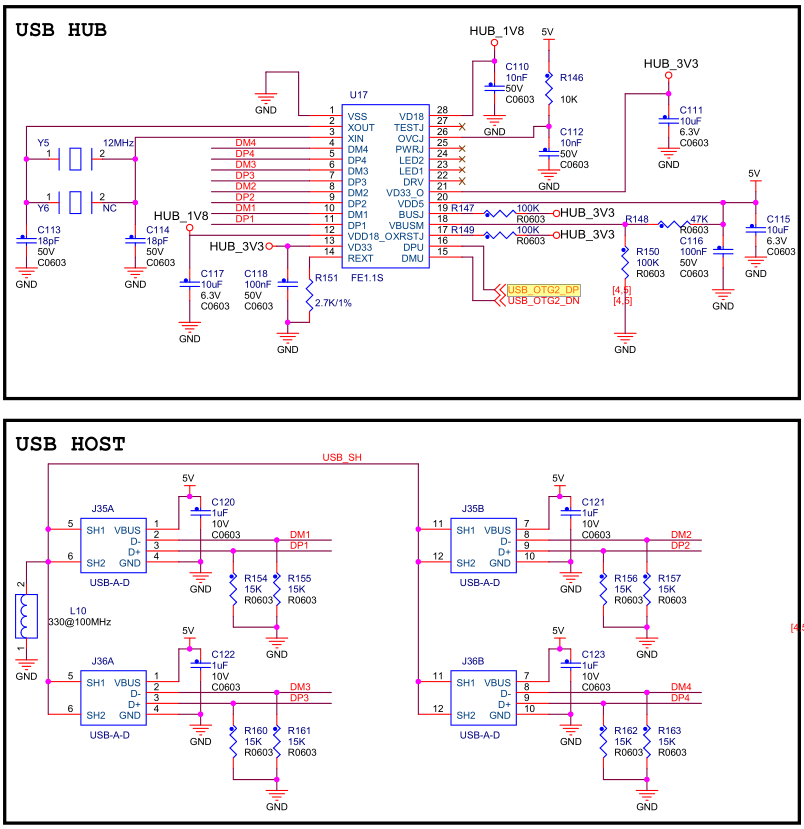
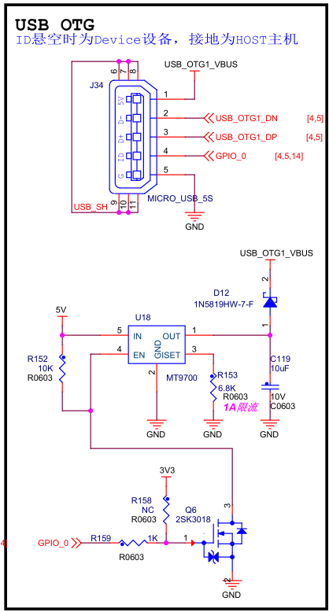

.. vim: syntax=rst

USB host驱动
-----

USB 是使用非常广泛的接口，无论在日常开发，还是在实际生活中，我们都需要频繁使用它。
本章以linux内核自带的USB鼠标驱动为例，给大家讲解如何开发USB设备驱动。

usb接口简介
~~~~~~~

USB的英文全称为Universal Serial Bus,中文含义是通用串行总线。在上个世纪90年代， IBM,Intel,微软,DEC,NEC,Compaq和Nortel等七家公司合力推出了USB的概念。
之后，这些公司一起成立了非赢利组织USB-IF(USB Implementers Forum)， 来维护USB协议。它是一种快速的，双向的，同步传输的廉价的并可以进行热拔插的串行接口。
USB接口使用方便，它可以连接多个不同的设备，而过去的串口和并口只能接一个设备。

USB的一个核心设计理念就是，为PC机上各种各样的接口提供一种统一的解决方案。在早期的PC机上，有串口、并口，就连鼠标键盘、 游戏手柄都有特定的接口。
而且这些接口都不支持热插拔，必须在PC机开机之前插入设备才可以正常使用。 此外，这些不同的接口还需要占用宝贵的CPU资源(比如硬件中断、DMA通道等)。
已经普及的USB协议淘汰了传统计算机上的串口、并口， 也为各种外设提供了一种支持热插拔的接口方式，是目前计算机最常用的外设扩展方式之一，
它也成为了目前键盘鼠标手柄的默认连接方式。

速度快是USB技术的突出特点之一。全速USB接口的最高传输率可达12Mb/s,比串口快了整整100倍，而执行USB2.0标准的高速USB接口速率更是达到了480Mb/s，
最新的USB3.1支持高达10Gb/s的传输速率。

usb的接口类型有非常多，常见的有以下这些接口：

标准USB2.0 A型接头

标准USB3.0 A型接头

标准USB B型接头

mini型USB B接头

micro型USB B接头

USB电气标准
~~~~~~~
标准的USB2.0接口和线缆都是4线的，其中VBUS和GND分别是电源线和地线，用于给一些USB设备供电。 
VBUS通常提供的是5V的电压。D+和D-则是一对差分双绞线，用于传送数据，这与485串口通信相类似， 
只是线上的电压不一样。如下图：

从物理上的逻辑结构来说，USB设备包含了主机host端和设备device端。其中，主机Host端有对应的硬件的USB的主机控制器Host Controller，
而设备端，连接的是对应的USB设备。常规的USB设备通常只能单独作为主机host或者设备device，随着USB技术不断发展，
后来产生了既能当主机host，又能当设备device的USB设备，那就是USB OTG设备。

针对USB OTG设备，人们又提出了mini型接头和macro型接头，线缆和接头也从原来的四线变成了五线。
多出来的线被标记为ID信号线，用于区分设备的身份。ID线接地，表示设备初始身份为host，为A类设备；若悬空或者接高，
则标识着设备初始身份为device，为B类设备。本章节讨论的内容主要是host设备。

USB技术发展到今天已经很成熟了，它不仅传输速率快，而且支持热拔插。就拿我们常用的笔记本电脑来说，
USB设备插在每个USB端口上时，D+和D-差分信号线都被一个1.5K的电阻下拉到地了。而在USB设备上，
D+或者D-信号线上有一个1.5k的上拉电阻。低速设备上拉电阻接到D-上，全速和高速设备则接到D+上。

当设备插入端口上时，USB设备接有上拉电阻的信号线由USB端口下拉电阻进行分压，那USB端口就捕捉到一个高电平信号。 
从而产生外部中断，笔记本cpu就检测到了设备插入。接着，USB子系统根据D+或者D-上的电平来确定新插入设备的通信速率。
对于高速设备则先判定为全速设备，然后通过与设备的协商切换到高速模式下进行数据通信。

USB控制器规格
~~~~~~~

由于USB漫长的历史原因，导致USB的主机控制器，出现了多种不同的类型，即OHCI和UHCI，EHCI，和xHCI。不论是那种USB主机控制器，简称主控，都是符合对应的USB的规范的，
都是实现了对应的USB规范中所规定的USB主控所要的那些事情的。只不过不同的USB主控的类型，有着不同的特点。

下面对这些不同类型的USB主控制器，进行简要的解释：

OHCI和UHCI
^^^^^^^^^^^^^^^^^^^^

不论是OHCI还是UHCI都是对应于USB 1.1的标准的，都是完全符合USB协议标准的，只是各自的实现方式有些略微不同而已。
虽然都是实现了USB1.1协议规范，但是在功能划分上，OHCI更多地把要做的事情用硬件来实现。

所以实现OHCI的USB控制器的软件驱动工作，相对要容易些，软件要做的事情相对较少。在嵌入式领域中，cpu资源紧张，
早期很多常见的很多开发板中的USB的控制器，几乎都是OHCI的。

而UHCI把更多的功能留给了软件，相对来说，软件的负担要重些。但是UHCI类型USB控制器，价格稍微便宜一些。

EHCI
^^^^^^^^^^^^^^^^^^^^

EHCI定义了USB 2.0的主机控制器的规范，定义了USB 2.0的主控需要包括哪些硬件实现，需要实现哪些功能等等，
甚至提供了寄存器级别的定义，这部分规范是USB驱动开发人员必须非常熟悉的内容。
I.MX6ULL 的两个 USB 控制器都是 2.0 的，因此兼容 EHCI 标准。不过EHCI 仅提供USB2.0 的高速功能，
至于全速和低速功能就由 OHCI 或 UHCI 来提供。

xHCI
^^^^^^^^^^^^^^^^^^^^

xHCI与EHCI相类似，它是针对的USB 3.0规范，在速度、能耗方面比前三个都有较大的提高。
而且它支持所有速度种类的 USB 设备。

硬件原理图分析
~~~~~~~

I.MX6ULL 内部集成了两个独立的 USB 控制器，这两个 USB 控制器都支持OTG功能。
下面我们来分析一下野火EBF6ULL PRO开发板的USB原理图。

USB HUB原理图
^^^^^^^^^^^^^^^^^^^^

EBF6ULL PRO开发板使用FE1.1S芯片将I.MX6ULL处理器上的 USB OTG2接口扩展成了4路USB HOST接口，如下图所示：

图中U17为FE1.1S芯片，它是一款高性能、低功耗、高性价的USB2.0 HUB主控IC，
支持一拖四，可以将1路USB扩展为4路USB HOST接口。

其中，USB_OTG2_DP和USB_OTG2_DN线，用于连接I.MX6ULL处理器上的 USB OTG2接口。
DPx和DMX(1~4),用于连接4路的USB HOST接口。、

USB OTG原理图
^^^^^^^^^^^^^^^^^^^^

EBF6ULL PRO开发板上的USB OTG接口的ID线，默认拉高，因此只能做USB device模式，如下图：

可以看到，USB OTG接口的ID线由GPIO_0控制，该引脚默认为高电平。
其中，USB_OTG1_DN和USB_OTG1_DP线，用于连接I.MX6ULL处理器上的 USB OTG1接口。

USB协议简介
~~~~~~~
