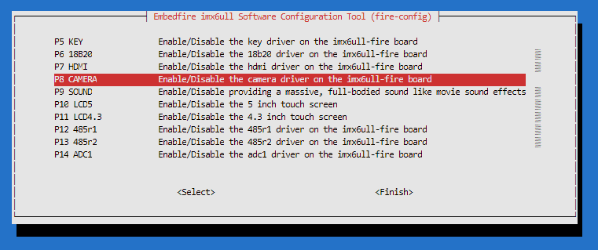
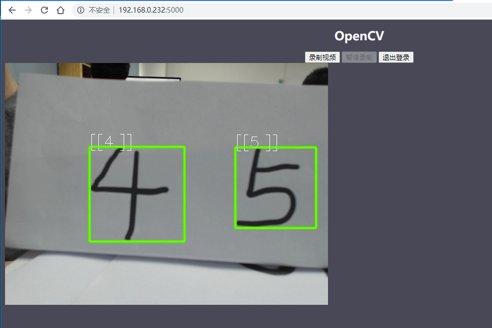

在Debian系统中运行OpenCV数字识别
================================

-  平台：野火imx6ull开发板
-  系统：Debian
-  Python版本：Python3.7
-  OpenCV版本：3.4.6.27

    注意：此处的操作是在野火imx6ull开发板上（运行的是Debian系统），而非虚拟机。

Opencv介绍
----------

Opencv 的全称是Open Source Computer Vision
Library，即计算机视觉开源库。它是基于C++语言的，当然也可在其他平台使用，如Java，Python，并且可在Windows、Linux、OS
X、Android和iOS等不同平台上使用，这个库是用在计算机视觉领域的，同时是开源的，也就是我们可以获得它的源代码，并且可以按我们自己的需求进行修改。

野火为什么选择python作为OpenCV的开发语言？因为 Python
作为一种高效简洁的直译式语言非常适合我们用来解决日常工作的问题，而且它简单易学，初学者几个小时就可以基本入门，对于没有接触过的开发者也是非常易于上手，而且基于野火Debian系统，采用
Python
的开发极其方便，直接写完代码即可验证现象，而不需要交叉编译的过程；同时
OpenCV 也提供了完善的 Python 接口，非常便于调用。

本章的目标
----------

本章书的目标是，在野火开发板中验证OpenCV的功能，做一个数字的识别。

在开发板中通过摄像头捕获图像，并且通过OpenCV的功能识别到数字，这个过程听起来貌似很简单，但是需要使用诸多OpenCV的功能，比如图像的颜色转换、灰度处理、边沿检测、阈值分割、轮廓提取、绘制轮廓、取轮廓的最小外接矩形、滤除其他异常的轮廓区域、裁剪轮廓区域的图片、重置区域大小、二值化处理，接着是加载训练好的模型数据，通过KNN识别数字、最后将其显示出来。

所以功能很多，但不会深入讲解，我们仅验证这些功能的可用性，在专业的视觉处理领域，相信大家可以做的更好。

搭建 Python 开发环境
--------------------

其实在很多Debian系统中都预装了Python3或者Python2，但是野火提供的镜像是并未预装Python3的，我们可以手动安装，为了确保我们的版本是最新版本，让我们使用apt命令更新本地apt包索引和升级系统：

.. code:: bahs

    sudo apt-get update
    sudo apt-get -y upgrade

-y 标志将确认我们同意所有要安装的项目。

手动安装Python3
~~~~~~~~~~~~~~~

.. code:: bahs

    sudo apt-get -y install python3

在安装完成后，校验是否安装成功：

.. code:: bash

     python3 -V

当出现以下内容时表示Python3安装成功：

.. code:: bash

    Python 3.7.3

安装pip包管理工具
~~~~~~~~~~~~~~~~~

接下来我们就讲解怎么去安装对应的包。

pip是一个Python的包管理系统，允许用户安装Python包。使用pip，你可以从Python包索引（PyPI）和其他存储库安装对应的包。

安装python3-pip：

.. code:: bash

    sudo apt-get -y install python3-pip

在安装完成后验证一下：

.. code:: bash

    pip3 --version

    # 出现以下内容表示安装成功
    pip 18.1 from /usr/lib/python3/dist-packages/pip (python 3.7)

安装相关的依赖
--------------

build-essential软件包的作用是提供编译程序必须的软件包列表信息，因为在使用pip安装过程中会进行相关的编译操作。

.. code:: bash

    sudo apt-get install -y build-essential

cmake是一个简单的构建配置工具。

.. code:: bash

    sudo apt-get install -y cmake

pkg-config
软件包包含一个在配置和make文件运行时把include路径和库路径传递给编译工具的工具。

.. code:: bash

    sudo apt-get install -y pkg-config

libilmbase23与libilmbase-dev是ILM发布并由OpenEXR使用的一组实用程序库，是OpenCV的依赖库。

.. code:: bash

    sudo apt-get install -y libilmbase23

.. code:: bash

    sudo apt-get install -y libilmbase-dev

libopenexr23是运行时文件OpenEXR图像库，被OpenCV使用。

.. code:: bash

    sudo apt-get install -y libopenexr23

GStreamer是一种流媒体框架，基于对媒体数据进行操作的过滤器图。使用该库的应用程序可以执行从实时声音处理到播放视频的所有操作，以及几乎所有与媒体相关的操作。其基于插件的体系结构意味着只需安装新的插件即可添加新的数据类型或处理功能，我们后续使用到摄像头的时候会依赖这个库。libgstreamer1.0-0软件包包含核心库和元素。

.. code:: bash

    sudo apt-get install -y libgstreamer1.0-0

libjpeg-dev是jpeg图像处理相关的软件包。

.. code:: bash

    sudo apt-get install -y libjpeg-dev

libtiff是一个提供对标记图像文件格式（TIFF）的支持的库，这种图像格式是一种广泛使用的用于存储图像数据的格式，是OpenCV的依赖库。

.. code:: bash

    sudo apt-get install -y libtiff5-dev

libpng-dev是png图像处理相关的软件包，同样是OpenCV的依赖库。

.. code:: bash

    sudo apt-get install -y libpng-dev

libavcodec58软件包带有音频/视频编解码器解码器的FFmpeg库，它提供了通用的编码/解码框架，并包含用于音频，视频和字幕流的多个解码器和编码器，总之是图像处理需要依赖的库。

.. code:: bash

    sudo apt-get install -y libavcodec58

libavformat58软件包带有解复用器的FFmpeg库，用于多媒体容器，它提供了用于音频，视频和字幕流的多路复用和多路分解（复用和解复用）的通用框架，包含用于多媒体容器格式的多个复用器和解复用器，还支持几种输入和输出协议，以访问媒体资源。

.. code:: bash

    sudo apt-get install -y libavformat58

libswscale5包含了FFmpeg库，用于图像缩放和各种转换，它执行高度优化的图像缩放以及色彩空间和像素格式转换等操作，是OpenCV必要的依赖库。

.. code:: bash

    sudo apt-get install -y libswscale5

git软件包是通过git命令拉取github或者gitee必备的软件包，在后续需要拉取git仓库。

.. code:: bash

    sudo apt-get install -y git

wget软件包是一个通过命令可以下载网络的资源的软件包。

.. code:: bash

    sudo apt-get install -y wget

libjasper-dev软件包也是一个图像处理的依赖库，但是这个软件包在默认的Debian（arm平台）上并没有找到，因此野火特地制作了这个软件包，并且放置在野火的镜像源中，大家直接安装即可。

.. code:: bash

    sudo apt-get install -y libjasper-dev

如果安装libjasper-dev不成功，提示了\ ``Unable to locate package libjasper-dev``\ 错误，可以参考以下操作进行更换软件源：

1. 打开 /etc/apt/sources.list 文件

   .. code:: bash

       sudo nano /etc/apt/sources.list

2. 找到下面内容并注释它，也可能并不是这个软件源，但是关于野火的软件源都注释掉就对了（名字可能是embedfire、Wildfilreteam之类的）：

   .. code:: bash

       deb [arch=armhf] https://Wildfilreteam.gitee.io/ buster main

3. 添加新的软件源

   .. code:: bash

       deb [arch=armhf] https://cloud.embedfire.com/mirrors/ebf-debian buster main

4. 更新软件源

   .. code:: bash

       sudo apt update

5. 重新安装libjasper-dev软件包。

   .. code:: bash

       sudo apt-get install -y libjasper-dev

拉取git仓库
-----------

flask-video-streaming-recorder是开源的家庭监控系统，野火基于它之上进行了修改，家庭监控系统是将摄像头采集到的数据显示到网页上，而野火做的修改是融入了OpenCV的处理，将图像处理并识别，然后再显示到网页上。

从github拉取
~~~~~~~~~~~~

.. code:: bash

    git clone https://github.com/Embedfire/flask-video-streaming-recorder.git

从gitee拉取
~~~~~~~~~~~

.. code:: bash

    git clone https://gitee.com/Embedfire/flask-video-streaming-recorder.git

安装必要的Python软件包
----------------------

安装Flask
~~~~~~~~~

Flask是一个轻量级的Web框架，我们后续的操作是将摄像头采集到的图片通过网络在浏览器页面中显示，更加直观。

.. code:: bash

    pip3 install flask==0.10.1

安装numpy
~~~~~~~~~

numpy是用Python进行科学计算的基础软件包，必须要安装，OpenCV的Python版本会使用到它。

.. code:: bash

    wget https://cloud.embedfire.com/software/packages/numpy-1.18.5.zip

.. code:: bash

    pip3 install numpy-1.18.5.zip

等待安装完成，可能需要1-2小时。

安装opencv-python
~~~~~~~~~~~~~~~~~

此处是安装OpenCV的Python版本软件包，指定版本号是 3.4.6.27 。

由于国内访问国外网站的网络状况不太好，所以我们将软件包下载了并且放置在阿里云平台，直接通过wget获取并安装即可。

.. code:: bash

    wget https://cloud.embedfire.com/software/packages/opencv_python-3.4.6.27-cp37-cp37m-linux_armv7l.whl

.. code:: bash

    pip3 install opencv_python-3.4.6.27-cp37-cp37m-linux_armv7l.whl

当然，你也可以通过pip命令去安装，没有任何问题，只不过时间略久罢了：

.. code:: bash

    pip3 install opencv-python==3.4.6.27 -i https://www.piwheels.org/simple

使用OpenCV
----------

使能摄像头设备
~~~~~~~~~~~~~~

首先在开发板插入网线，然后插入免驱的USB摄像头，或者在fire-config中打开摄像头插件，然后插入野火的ov5640摄像头，重启开发板。

.. code:: bash

    sudo fire-config

   opencv001.png
   
在重启开发板后，查看/dev目录下是否存在video1，如果存在则表示有摄像头。

.. code:: bash

    ➜  ~ ls /dev | grep video1
    video1

使用OpenCV
~~~~~~~~~~

进入flask-video-streaming-recorder目录下

.. code:: bash

    cd flask-video-streaming-recorder

运行：

.. code:: bash

    python3 main.py

在浏览器打开：[你的IP地址]:5000，比如现在我的IP地址是192.168.0.232，那么就在浏览器输入：

.. code:: bash

    192.168.0.232:5000

会出现登陆的界面，默认的账号密码如下：

-  账号：admin
-  密码：admin

登陆后即可看到显示的内容摄像头内容，如果此时手写一些数字在纸张上，那么OpenCV就会识别到这些数字，具体见：

   opencv002.png

毕竟野火不是专业做视觉的，识别的效果并不太好，大家如果想要更好的识别效果，请自行训练，此处就不必教大家如何训练了，毕竟专业的人才会做专业的事情，而此文仅做验证，验证OpenCV可以在野火开发板上使用，仅此足以。

其他的错误处理
--------------

如果程序无法运行，则尝试安装一下以下软件包：

.. code:: bash

    sudo apt-get install -y libqtgui4 libqt4-dev libatlas-base-dev

