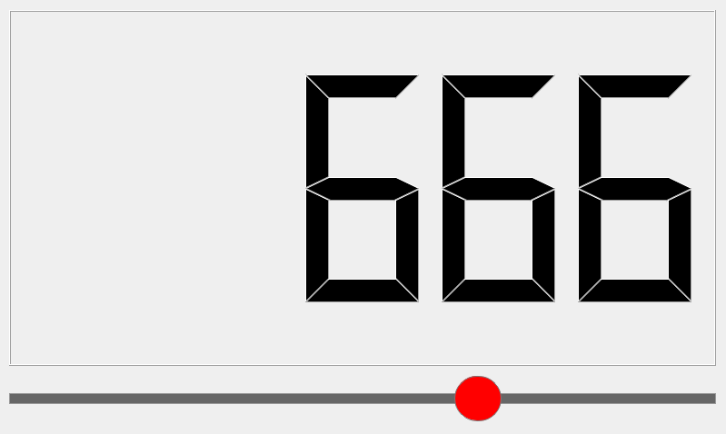

Debian搭建PyQt5环境
===================

-  平台：野火imx6ull开发板
-  系统：Debian
-  Python版本：Python3.7
-  PyQt版本：PyQt5

PyQt是Qt应用框架与Python的结合，同时支持Python2.x和Python3.x版本，本教程使用的是Python3.7版本，PyQt5版本。

PyQt5是由一系列Python模块组成，超过620个类，6000函数和方法。能在诸如Unix、Windows和Mac
OS等主流操作系统上运行，而且由于Python语言的开发方便性，在编写代码时比C++更为方便，美中不足的是Python语言的执行效率会比C++慢。

首先烧录好Debian镜像，为了确保我们的版本是最新版本，让我们使用apt命令更新本地apt包索引和升级系统：

.. code:: bash

        sudo apt-get update && sudo apt-get -y upgrade
        

手动安装Python3，强烈建议参考上一章的Python环境搭建:

.. code:: bash

        sudo apt-get -y install python3-pip python3

然后安装PyQt5：

.. code:: bash

        sudo apt-get -y install python3-pyqt5

最后安装一些依赖的deb包，它主要是用于提供tslib触摸等功能：

.. code:: bash

        sudo apt-get -y install libts-bin 

.. code:: bash

        sudo apt-get -y install devscan 

.. code:: bash

        sudo apt-get -y install ebf-tslibplugin

然后运行：

.. code:: bash

    sudo depmod -a

最后重启开发板：

::

        sudo reboot

这样子环境就搭建完成。

接下来我们测试一下PyQt5在开发板上的运行：

首先编写一个名字为pyqt5_demo.py的PyQt5应用程序，它主要是用于测试显示、触摸、信号、槽函数、以及PyQt5的部分组件如：QWidget、QLCDNumber、QSlider、QVBoxLayout等的简单使用，虽然是很简单的程序，但足以满足我们的测试，这样子就能说明野火开发板的Debian系统是可以运行PyQt5的，并且可以通过它看出PyQt5的执行效率，目前我的测试还是可以非常快响应的。

pyqt5_demo.py代码如下:

.. code:: py

    import sys
    from PyQt5.QtWidgets import QWidget,QLCDNumber,QSlider,QVBoxLayout,QApplication
    from PyQt5.QtCore import Qt

    class WinForm(QWidget):
        def __init__(self):
            super().__init__()   
            self.initUI()

        def initUI(self):
            #1 先创建滑块和 LCD 部件
            lcd = QLCDNumber(self)
            slider = QSlider(Qt.Horizontal, self)
            
            slider.setMaximum(1000)
            lcd.display(666)
            slider.setValue(666)

            #2 通过QVboxLayout来设置布局
            vBox = QVBoxLayout()
            vBox.addWidget(lcd)
            vBox.addWidget(slider)

            self.setLayout(vBox)
            #3 valueChanged()是Qslider的一个信号函数，只要slider的值发生改变，它就会发射一个信号，然后通过connect连接信号的接收部件，也就是lcd。
            slider.valueChanged.connect(lcd.display)
           
            slider.setMinimumWidth(200) 
            slider.setFixedHeight(60)
            
            style = "QSlider::groove:horizontal {border:1px solid #999999;height:10px;" \
                    "background-color:#666666;margin:2px 0;}" \
                    "QSlider::handle:horizontal {background-color:#ff0000;border:1px solid #797979;" \
                    "width:50px;margin:-20px;border-radius:25px;}" \
                                
            slider.setStyleSheet(style);
            
            #self.setGeometry(0,0,800,480)
            self.setWindowTitle("拖动滑块LCD显示")

    if __name__ == '__main__':
        app = QApplication(sys.argv)
        form = WinForm()
        form.resize(800, 480)
        form.show()                      
        sys.exit(app.exec_())

然后创建一个run.sh脚本，通过它来运行我们的pyqt5_demo.py，为什么需要一个脚本呢，是因为我们需要导出相关的环境变量，比如显示、触摸等环境变量，这个脚本需要使用sudo权限运行。

run.sh脚本内容如下:

.. code:: bash

    #! /bin/sh

    type devscan

    if [ $? -eq 0 ]; then
        eventx=$(devscan "goodix-ts")
        echo "eventx=$eventx"
        if [ "$eventx " != " " ]; then
            if [ ! -f "/etc/pointercal" ]; then
                type ts_calibrate
                if [ $? -eq 0 ]; then
                    ts_calibrate
                fi
            fi
        else 
            echo "eventx is null"
        fi
    else
        echo "please install devscan"
        echo
        echo "sudo apt-get install devscan"
        exit
    fi

    export TSLIB_TSDEVICE=/dev/input/$eventx
    export QT_QPA_PLATFORM=linuxfb:fb=/dev/fb0
    export TSLIB_CONFFILE=/etc/ts.conf
    export TSLIB_CALIBFILE=/etc/pointercal
    export QT_QPA_GENERIC_PLUGINS=tslib:/dev/input/$eventx
    export QT_QPA_EVDEV_TOUCHSCREEN_PARAMETERS=/dev/input/$eventx

    echo "start pyqt pyqt5_demo..."
    python3 pyqt5_demo.py

赋予脚本可执行权限：

.. code:: bash

    chmod +x run.sh

运行：

.. code:: bash

    sudo ./run.sh

效果：

   pyqt5_001

