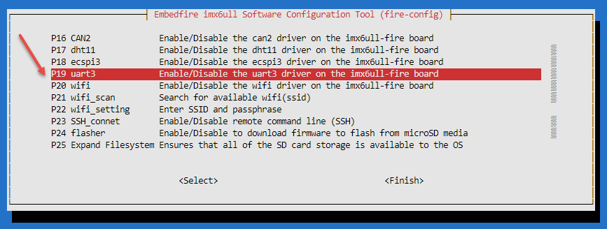
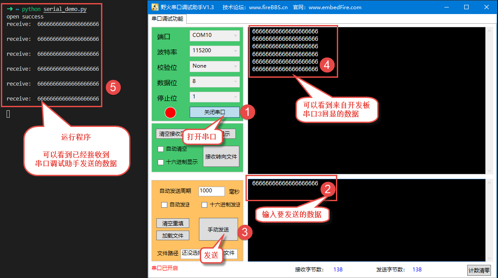

在Debian中通过Python控制串口
============================

-  平台：野火imx6ull开发板
-  系统：Debian
-  目标Python版本：Python3.7

    注意：此处的操作是在野火imx6ull开发板上（运行的是Debian系统），而非虚拟机。

更新
----

其实在很多Debian系统中都预装了Python3或者Python2，但是野火提供的镜像是并未预装Python3的，我们可以手动安装，为了确保我们的版本是最新版本，让我们使用apt命令更新本地apt包索引和升级系统：

.. code:: bash

    sudo apt-get update
    sudo apt-get -y upgrade

-y 标志将确认我们同意所有要安装的项目。

手动安装Python3
---------------

.. code:: bash

    sudo apt-get -y install python3

可以看到Python3有很多依赖的deb包：

::

    Reading package lists... Done
    Building dependency tree
    Reading state information... Done
    The following additional packages will be installed:
      libmpdec2 libpython3-stdlib libpython3.7-minimal libpython3.7-stdlib
      python3-minimal python3.7 python3.7-minimal
    Suggested packages:
      python3-doc python3-tk python3-venv python3.7-venv python3.7-doc binutils
      binfmt-support
    The following NEW packages will be installed:
      libmpdec2 libpython3-stdlib libpython3.7-minimal libpython3.7-stdlib python3
      python3-minimal python3.7 python3.7-minimal
    0 upgraded, 8 newly installed, 0 to remove and 0 not upgraded.
    Need to get 4224 kB of archives.
    After this operation, 19.6 MB of additional disk space will be used.

当然啦，这些依赖的deb包是不需要我们手动安装的，Debian会自动安装。

在安装完成后，校验是否安装成功：

.. code:: bash

     python3 -V

当出现以下内容时表示Python3安装成功：

.. code:: bash

    Python 3.7.3

设置Debian系统的默认Python版本
------------------------------

如果你是运行以下命令校验Python的版本：

.. code:: bash

    python -V

并且当你的系统存在Python2的话，那么版本可能就是 ``Python 2.7.16`` ，那么与我们想要安装的Python3版本并不符合，因此我们要设置Python3位默认版本：

.. code:: bash

    cd /usr/bin
    sudo rm python
    sudo ln -s python3.7 python
    cd ~

再次校验Python版本时，发现系统默认的Python版本就是python3.7了：

.. code:: bash

    python3 -V

    # 版本
    Python 3.7.3

安装pip包管理工具
-----------------

接下来我们就讲解怎么去安装对应的包。

pip是一个Python的包管理系统，允许用户安装Python包。使用pip可以从Python包索引（PyPI）和其他存储库安装对应的包。

我们首先还是更新一下apt的索引：

.. code:: bash

    sudo apt-get update

然后安装python3-pip：

.. code:: bash

    sudo apt-get -y install python3-pip

在安装完成后验证一下：

.. code:: bash

    pip3 --version

    # 出现以下内容表示安装成功
    pip 18.1 from /usr/lib/python3/dist-packages/pip (python 3.7)

安装pyserial模块
----------------

使用pip3安装 ``pyserial模块`` ，它封装了对串口的访问，提供了在Windows，OSX，Linux，BSD（任何POSIX兼容系统）上运行的Python的后端模块，它会选择合适的串口进行数据的输入输出操作，使得我们通过Python操作串口变得非常简单。

.. code:: bash

    pip3 install -i https://pypi.tuna.tsinghua.edu.cn/simple pyserial

pyserial模块介绍
----------------

本章仅简单介绍一下模块的类，更多信息大家可以去看官方的介绍： https://pythonhosted.org/pyserial/

本章仅简单介绍一下pyserial模块的类 ``class serial.Serial`` ，这是我们写代码要用到的。

初始化参数：
~~~~~~~~~~~~

.. code:: py

    __init__(port=None, baudrate=9600, bytesize=EIGHTBITS, parity=PARITY_NONE, stopbits=STOPBITS_ONE, timeout=None, xonxoff=False, rtscts=False, write_timeout=None, dsrdtr=False, inter_byte_timeout=None)

参数说明： 

- port：指定端口设备名称，取决于操作系统，例如在Linux上为/dev/ttyXXX，在Windows上为COMXXX。

- baudrate：波特率，可以是以下标准值之一：50、75、110、134、150、200、300、600、1200、1800、2400、4800、9600、19200、38400、57600、115200等等。

- bytesize：数据位数。可取的值：5位，6位，7位，8位。 

- parity：启用奇偶校验。可取的值：PARITY_NONE，PARITY_EVEN，PARITY_ODD，PARITY_MARK，PARITY_SPACE。

- stopbits：停止位数。可取的值：STOPBITS_ONE，STOPBITS_ONE_POINT_FIVE，STOPBITS_TWO。

- timeout：设置读取超时值，是浮点类型，表示当没有数据时读取阻塞的时间；如果设置为None，则永远等待，直到接收到请求的字节数；如果设置为0，则表不阻塞，在任何情况下立即返回读取到的数据内容。

- xonxoff：启用软件流控制。 - rtscts：启用硬件（RTS / CTS）流控制。 

- dsrdtr：启用硬件（DSR / DTR）流控制。 

- write_timeout：设置写超时值，默认情况下write()处于阻塞状态。 

- inter_byte_timeout：字符间超时，无则禁用（默认）。

    ps：这些参数基本都有默认值，但port是必须填写的。

读数据
~~~~~~

从串口读取指定长度的字节数据，读取数据时根据初始化参数中指定的超时时间进行判断是否超时。

.. code:: py

    read(size=1)

参数： - size：要读取的字节数。 - 返回：从端口读取到的数据

写数据
~~~~~~

将指定的数据写入串口，但Unicode字符串必须经过编码，例如 ``'hello'.encode('utf-8')`` 。

参数： - data：要写入的数据。 -
返回：写入的字节数，如果为端口配置了写超时并且超过了时间，则抛出异常SerialTimeoutException。

编写例程代码
------------

简单了解之后可以直接使用它，比如我们创建一个 ``serial_demo.py`` 文件，并编写相关的代码，代码文件可以在 https://github.com/Embedfire/embed_linux_tutorial/blob/master/base_code/linux_env/serial_demo.py 路径下得到，具体代码如下：

.. code:: py

    import serial
    from time import sleep

    def recv(serial):
        while True:
            data = serial.read_all()
            if data != b'' :
                break
            
        return data.decode()

    if __name__ == '__main__':
        serial = serial.Serial('/dev/ttymxc2', 115200)  # /dev/ttymxc2
        if serial.isOpen() :
            print("open success")
        else :
            print("open failed")

        while True:
            data =recv(serial)
            if data != '' :
                print("receive:",data)
                serial.write(data.encode()) # 数据回显

实验
----

1. 首先使用USB转串口接上开发板的USART3，如果没有USB转串口可以在野火官方淘宝店上购买: `野火
   USB转TTL
   CH340模块 <https://detail.tmall.com/item.htm?spm=a230r.1.14.6.bc3e6fffIjse95&id=600554874281&cm_id=140105335569ed55e27b&abbucket=9>`__ 。

.. figure:: media/python_serial001.png
   :alt: python_serial001.png

   python_serial001.png

2. 然后在 ``fire-config`` 中打开串口3：

.. code:: bash

    sudo fire-config

   python_serial002.png

3. 重启开发板。

4. 查看 ``/dev`` 目录下是否存在串口3设备 ``ttymxc2``

.. code:: bash

    ls /dev | grep ttymxc2

5. 打开野火串口调试助手。

6. 在Debian系统中运行 ``serial_demo.py`` 文件

.. code:: bash

    python serial_demo.py

7. 程序运行的现象如下：

   python_serial003.png

