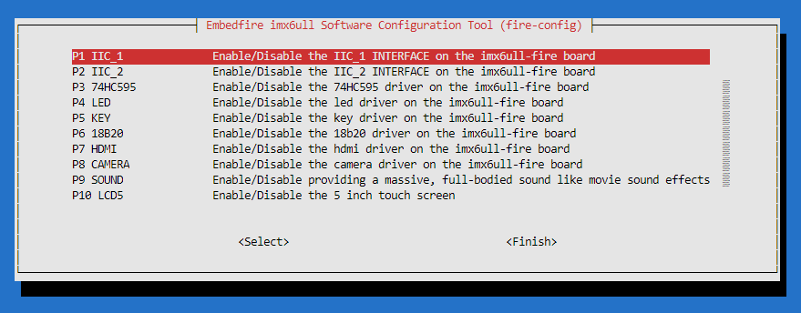
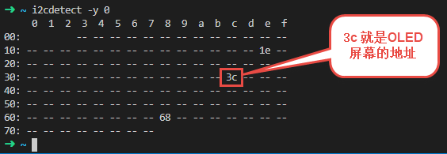
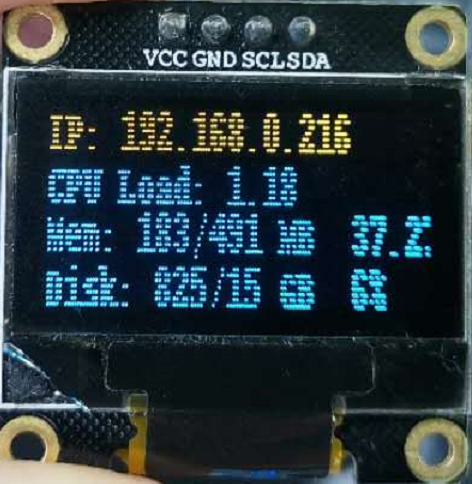
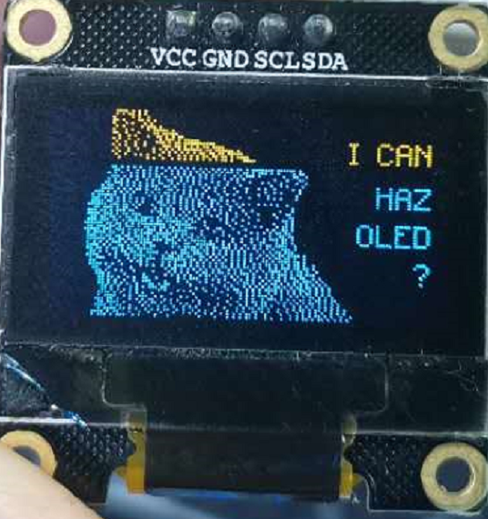
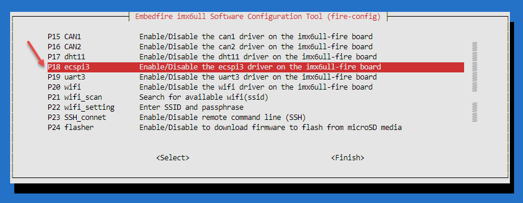

Debian搭建Python控制OLED开发环境
================================

-  平台：野火imx6ull开发板
-  系统：Debian
-  Python版本：Python3.7

更新
----

其实在很多Debian系统中都预装了Python3或者Python2，但是野火提供的镜像是并未预装Python3的，我们可以手动安装，为了确保我们的版本是最新版本，让我们使用apt命令更新本地apt包索引和升级系统：

.. code:: bash

    sudo apt-get update
    sudo apt-get -y upgrade

-y 标志将确认我们同意所有要安装的项目。

手动安装Python3
---------------

.. code:: bash

    sudo apt-get -y install python3

在安装完成后，校验是否安装成功：

.. code:: bash

     python3 -V

当出现以下内容时表示Python3安装成功：

.. code:: bash

    Python 3.7.3

设置Debian系统的默认Python版本
------------------------------

如果你是运行以下命令校验Python的版本：

.. code:: bash

    python -V

并且当你的系统存在Python2的话，那么版本可能就是 ``Python 2.7.16`` ，那么与我们想要安装的Python3版本并不符合，因此我们要设置Python3位默认版本：

.. code:: bash

    cd /usr/bin
    sudo rm python
    sudo ln -s python3.7 python
    cd ~

再次校验Python版本时，发现系统默认的Python版本就是python3.7了：

.. code:: bash

    python3 -V

    # 版本
    Python 3.7.3

安装Python相关的依赖库
----------------------

-  python3-smbus：主要是是读写i2c总线相关操作的依赖库
-  python3-setuptools：Python的setupt工具。
-  libjpeg-dev、zlib1g-dev：图片相关的依赖库，因为本章的例程中需要依赖图片相关的内容。
-  Pillow：Pillow 是一个对 PIL 友好的分支，作者是 Alex Clark。而 PIL
   是一个 Python 图像处理库。

.. code:: bash

    sudo apt-get install -y python3-smbus

    sudo apt-get install -y python3-setuptools

    sudo apt-get install -y libjpeg-dev zlib1g-dev

安装 Pillow：

.. code:: bash

    python3 -m pip install -i https://pypi.tuna.tsinghua.edu.cn/simple Pillow

安装野火提供的gpiod库
---------------------

因为本教程中的python代码会依赖gpiod模块，但是由于直接通过pip安装会导致很多问题，因此野火特地制作了ebf-gpiod软件包，解决了很多依赖及各种，我们直接安装即可。

.. code:: bash

    sudo apt-get install -y ebf-gpiod

安装git
-------

我们需要从github或者gitee拉取对应的代码，所以必须使用git去拉取，当然啦，这些代码体积非常小，拉取是非常快的。

.. code:: bash

    sudo apt-get install -y git

安装i2c-tools
-------------

因为我们用到了OLED中的i2c作为通信接口，因此安装一个i2c工具，以便检查校验i2c是否正常工作。

.. code:: bash

    sudo apt-get install -y i2c-tools

拉取代码
--------

**说明：无论从github还是gitee拉取代码，都是一样的，选择其中一处拉取即可。**

Adafruit_CircuitPython_SSD1306是一个开源的库代码，里面含有SSD1306（野火的OLED
屏幕所使用的型号）的Python例子。

-  从gitee拉取：

.. code:: bash

    git clone https://gitee.com/Embedfire-pythonlib/Adafruit_CircuitPython_SSD1306.git

Adafruit_Blinka是与硬件打交道的，根据硬件信息选择对应的库。

.. code:: bash

    git clone https://gitee.com/Embedfire-pythonlib/Adafruit_Blinka.git

Adafruit_Python_PlatformDetect是平台层依赖，它主要是配置芯片及开发板接口的。

.. code:: bash

    git clone https://gitee.com/Embedfire-pythonlib/Adafruit_Python_PlatformDetect.git

-  从github拉取：

.. code:: bash

    git clone https://github.com/Embedfire-pythonlib/Adafruit_CircuitPython_SSD1306.git

.. code:: bash

    git clone https://github.com/Embedfire-pythonlib/Adafruit_Blinka.git

.. code:: bash

    git clone https://github.com/Embedfire-pythonlib/Adafruit_Python_PlatformDetect.git

拉取完成后可以看到当前文件夹存在3个文件夹：

.. code:: bash

    ➜ ls
    Adafruit_Blinka  Adafruit_CircuitPython_SSD1306  Adafruit_Python_PlatformDetect

进入Adafruit_CircuitPython_SSD1306目录下，安装对应的库：

.. code:: bash

    cd Adafruit_CircuitPython_SSD1306 

    sudo python setup.py install

然后进入Adafruit_Blinka目录下安装对应的库：

.. code:: bash

    cd Adafruit_Blinka

    sudo python setup.py install

最后进入Adafruit_Python_PlatformDetect目录下安装对应的库：

.. code:: bash

    cd Adafruit_Python_PlatformDetect

    sudo python setup.py install

**注意，一定要按照顺序去执行这些安装的操作。**

开发板接线
----------

将野火OLED模块与开发板接好，接线IO如表所示：

+-------------+-----------------+
| OLED 屏幕   | imx6ull开发板   |
+=============+=================+
| VCC         | 3.3V            |
+-------------+-----------------+
| GND         | GND             |
+-------------+-----------------+
| SCL         | IO1_28          |
+-------------+-----------------+
| SDA         | IO1_29          |
+-------------+-----------------+

可以参考野火硬件原理图进行接线： https://ebf-6ull-hardware.readthedocs.io/zh/latest/

打开I2C总线
-----------

在fire-config打开I2C_1总线，目前作者使用的是最新的fire-config工具，如果你的不是最新的，也是无所谓的，因为该总线是默认打开的。

   python_ssd1306_001.png

使用I2C工具
-----------

在打开总线后，会提示需要重启，那么在重启后，使用i2c工具查看系统是否可以找到OLED
屏幕的地址，命令如下：

.. code:: bash

    i2cdetect -y 0

如果出现以下结果，说明开发板与OLED 屏幕的i2c总线通信是正常的。

   python_ssd1306_002.png

使用示例
--------

我们可以进入刚刚从github、gitee拉取的代码中运行它本身的demo，进入 ``Adafruit_CircuitPython_SSD1306/examples`` 目录下：

::

    cd Adafruit_CircuitPython_SSD1306/examples

运行ssd1306_stats.py这个demo，它会将系统的IP地址，CPU的使用情况、内存信息、磁盘信息等显示到OLED
屏幕中。

.. code:: bash

    python ssd1306_stats.py

可以看到此时的OLED 屏幕已经出现了一些与系统状态相关的信息：

   python_ssd1306_003.png

源代码也是比较简单的：

.. code:: python

    import time
    import subprocess

    from board import SCL, SDA, DC, RST, SS0
    import busio
    import board
    import digitalio
    from PIL import Image, ImageDraw, ImageFont
    import adafruit_ssd1306

    # Create the SSD1306 OLED class.
    # The first two parameters are the pixel width and pixel height.  Change these
    # to the right size for your display!

    # Create the I2C interface.
    i2c = busio.I2C(SCL, SDA)
    disp = adafruit_ssd1306.SSD1306_I2C(128, 32, i2c)

    # Create the SPI interface.
    # spi = board.SPI()
    # oled_cs = digitalio.DigitalInOut(SS0)
    # oled_dc = digitalio.DigitalInOut(DC)
    # oled_reset = None
    # disp = adafruit_ssd1306.SSD1306_SPI(128, 64, spi, oled_dc, oled_reset, oled_cs)

    # Clear display.
    disp.fill(0)
    disp.show()

    # Create blank image for drawing.
    # Make sure to create image with mode '1' for 1-bit color.
    width = disp.width
    height = disp.height
    image = Image.new('1', (width, height))

    # Get drawing object to draw on image.
    draw = ImageDraw.Draw(image)

    # Draw a black filled box to clear the image.
    draw.rectangle((0, 0, width, height), outline=0, fill=0)

    # Draw some shapes.
    # First define some constants to allow easy resizing of shapes.
    padding = -2
    top = padding
    bottom = height-padding
    # Move left to right keeping track of the current x position for drawing shapes.
    x = 0

    # Load default font.
    font = ImageFont.load_default()

    # Alternatively load a TTF font.  Make sure the .ttf font file is in the
    # same directory as the python script!
    # Some other nice fonts to try: http://www.dafont.com/bitmap.php
    #font = ImageFont.truetype('/usr/share/fonts/truetype/dejavu/DejaVuSans.ttf', 9)

    while True:

        # Draw a black filled box to clear the image.
        draw.rectangle((0, 0, width, height), outline=0, fill=0)

        # Shell scripts for system monitoring from here:
        # https://unix.stackexchange.com/questions/119126/command-to-display-memory-usage-disk-usage-and-cpu-load
        cmd = "hostname -I | cut -d\' \' -f1"
        IP = subprocess.check_output(cmd, shell=True).decode("utf-8")
        cmd = "top -bn1 | grep load | awk '{printf \"CPU Load: %.2f\", $(NF-2)}'"
        CPU = subprocess.check_output(cmd, shell=True).decode("utf-8")
        cmd = "free -m | awk 'NR==2{printf \"Mem: %s/%s MB  %.2f%%\", $3,$2,$3*100/$2 }'"
        MemUsage = subprocess.check_output(cmd, shell=True).decode("utf-8")
        cmd = "df -h | awk '$NF==\"/\"{printf \"Disk: %d/%d GB  %s\", $3,$2,$5}'"
        Disk = subprocess.check_output(cmd, shell=True).decode("utf-8")

        # Write four lines of text.

        draw.text((x, top+0), "IP: "+IP, font=font, fill=255)
        draw.text((x, top+8), CPU, font=font, fill=255)
        draw.text((x, top+16), MemUsage, font=font, fill=255)
        draw.text((x, top+25), Disk, font=font, fill=255)

        # Display image.
        disp.image(image)
        disp.show()
        time.sleep(.1)

我们也可以显示一个很好看的图案：

.. code:: bash

    python ssd1306_pillow_images.py 

效果如下：

   python_ssd1306_004.png

修改平台层
----------

如果我想用其他IO怎么办呢，其实非常简单，直接在 ``Adafruit_Blinka/src/adafruit_blinka/microcontroller/nxp_imx6ull/`` 路径下的 ``pin.py`` 文件修改对应的引脚，并且打开对应的I2C总线即可，当然我们不建议修改其他引脚。

可以支持以下两种方式：

-  方式1：

.. code:: python

    I2C1_SCL = Pin((0, 28)) # GPIO1_IO28
    I2C1_SDA = Pin((0, 29)) # GPIO1_IO29

-  方式2：

.. code:: python

    I2C2_SCL = Pin(0) # GPIO1_IO0
    I2C2_SDA = Pin(1) # GPIO1_IO1

那么这种引脚是怎么计算的呢？公式如下：

.. code:: bash

    数字 = (IO组号 - 1)  * 32 + 8

比如假设需要打开 ``IO4_15`` 这个IO，那么通过计算可以知道数字是 104：

.. code:: bash

    数字 = (4 - 1) * 32 + 8

那么在 ``pin.py`` 文件就可以这样子配置：

.. code:: py

    I2C1_SCL = Pin((3, 15)) # IO4_15

    # 或者：

    I2C1_SCL = Pin(104) # IO4_15

使用SPI方式控制OLED屏幕
-----------------------

如果你没有i2c接口的屏幕，那么也可以在这个库中使用SPI的方式去控制OLED屏幕，修改也是非常简单的，步骤如下：

1. 将野火OLED屏幕与开发板连接，接线表如下：

+----------------------------+-----------------+
| OLED 屏幕                  | imx6ull开发板   |
+============================+=================+
| VCC                        | 3.3V            |
+----------------------------+-----------------+
| GND                        | GND             |
+----------------------------+-----------------+
| CLK                        | IO1_21          |
+----------------------------+-----------------+
| MISO（如果没有则不用接）   | IO1_23          |
+----------------------------+-----------------+
| MOSI                       | IO1_22          |
+----------------------------+-----------------+
| CS                         | IO1_20          |
+----------------------------+-----------------+
| DC                         | IO1_18          |
+----------------------------+-----------------+

可以参考野火硬件原理图进行接线： https://ebf-6ull-hardware.readthedocs.io/zh/latest/

1. 打开SPI总线与SPI设备，比如我们的开发板引出了SPI3接口，那么就打开它：

   python_ssd1306_005.png

3. 然后修改 ``/boot/uEnv.txt`` 文件，将 ``dtoverlay=/lib/firmware/imx-fire-spidev-overlay.dtbo`` 设备树插件打开（将前面的“#”去掉），其他插件打不打开无所谓，但是 ``dtoverlay=/lib/firmware/imx-fire-uart2-overlay.dtbo`` 串口2设备树插件不能打开。

.. code:: bash

    #overlay_start

    # dtoverlay=/lib/firmware/imx-fire-i2c1-overlay.dtbo
    #dtoverlay=/lib/firmware/imx-fire-i2c2-overlay.dtbo
    #dtoverlay=/lib/firmware/imx-fire-74hc595-overlay.dtbo
    #dtoverlay=/lib/firmware/imx-fire-485r1-overlay.dtbo
    #dtoverlay=/lib/firmware/imx-fire-485r2-overlay.dtbo
    #dtoverlay=/lib/firmware/imx-fire-adc1-overlay.dtbo
    #dtoverlay=/lib/firmware/imx-fire-btwifi-overlay.dtbo
    #dtoverlay=/lib/firmware/imx-fire-cam-overlay.dtbo
    #dtoverlay=/lib/firmware/imx-fire-can1-overlay.dtbo
    #dtoverlay=/lib/firmware/imx-fire-can2-overlay.dtbo
    #dtoverlay=/lib/firmware/imx-fire-dht11-overlay.dtbo
    dtoverlay=/lib/firmware/imx-fire-ecspi3-overlay.dtbo
    #dtoverlay=/lib/firmware/imx-fire-hdmi-overlay.dtbo
    #dtoverlay=/lib/firmware/imx-fire-key-overlay.dtbo
    #dtoverlay=/lib/firmware/imx-fire-lcd5-overlay.dtbo
    #dtoverlay=/lib/firmware/imx-fire-lcd43-overlay.dtbo
    #dtoverlay=/lib/firmware/imx-fire-led-overlay.dtbo
    #dtoverlay=/lib/firmware/imx-fire-sound-overlay.dtbo
    dtoverlay=/lib/firmware/imx-fire-spidev-overlay.dtbo
    #dtoverlay=/lib/firmware/imx-fire-uart2-overlay.dtbo
    #dtoverlay=/lib/firmware/imx-fire-uart3-overlay.dtbo

    #overlay_end

3. 重启开发板即可。

4. 通过 ``ls /dev`` 命令可以看到已经有了spi3设备了，名字叫 ``spidev2.0`` ，此时我们可以使用SPI3总线了。

5. 修改例程中的接口对象，打开具体的某个例程，比如 ``Adafruit_CircuitPython_SSD1306/examples/ssd1306_stats.py`` ，将该文件的i2c接口对象注释掉，打开spi接口对象，具体代码如下：

.. code:: python

    # Create the I2C interface.    注释掉这两行
    # i2c = busio.I2C(SCL, SDA)
    # disp = adafruit_ssd1306.SSD1306_I2C(128, 32, i2c)

    # Create the SPI interface.     打开spi设备对象
    spi = board.SPI()
    oled_cs = digitalio.DigitalInOut(SS0)
    oled_dc = digitalio.DigitalInOut(DC)
    oled_reset = None
    disp = adafruit_ssd1306.SSD1306_SPI(128, 64, spi, oled_dc, oled_reset, oled_cs)

同理其他例程也是这样子操作。

6. 运行例程：运行ssd1306_stats.py这个demo，它会将系统的IP地址，CPU的使用情况、内存信息、磁盘信息等显示到OLED
   屏幕中。

.. code:: bash

    python ssd1306_stats.py

可以看到此时的OLED 屏幕已经出现了一些与系统状态相关的信息：

7. 如果你是其他接口，可以在 ``Adafruit_Blinka/src/adafruit_blinka/microcontroller/nxp_imx6ull/`` 路径下的 ``pin.py`` 文件修改对应的引脚，野火不保证你修改的引脚是正确的，如非特别需要，请直接使用野火的配置:

.. code:: python

    ECSPI3_MISO = Pin(23) # IO1_23
    ECSPI3_MOSI = Pin(22) # IO1_22 
    ECSPI3_SCLK = Pin(21) # IO1_21
    ECSPI3_SS0 = Pin(20)  # IO1_20 
    ECSPI3_DC = Pin(18) # IO1_18
    ECSPI3_RST = Pin(17)  # IO1_17

    # ordered as spiId, sckId, mosiId, misoId
    spiPorts = ( (2, ECSPI3_SCLK, ECSPI3_MOSI, ECSPI3_MISO), )

至此，本章的教程也完结了，因为是开源库，大家可以自行去深入研究，本章的目的是告诉大家可以通过Python控制硬件。
