Qt交叉编译环境搭建
==================

主机：Ubuntu18.04

    本交叉编译环境使用5.11.3版本的Qt源码，编译出来的Qt
    App可以直接运行在野火发布的 Debian 系统上。

安装arm-linux-gnueabihf-gcc 8.3.0
---------------------------------

首先安装教程编译器：arm-linux-gnueabihf-gcc 8.3.0
版本，为什么要选择那么高的版本呢，因为作者测试时使用4.9.3版本编译器编译出来的Qt
App在Debian系统上运行时会报一个错误：

.. code:: bash

    relocation error: /home/debian/qt-app/abc: symbol _ZTVN10__cxxabiv120__si_class_type_infoE version Qt_5 not defined in file libQt5Core.so.5 with link time reference

经过Google搜索答案，大致是说编译器版本不同导致的错误，我查看了Debian
系统中的 libQt5Core.so.5.11.3
库的信息，发现它的编译器版本是比较高的，所以为了一致性，我也使用了
arm-linux-gnueabihf-gcc 8.3.0 版本的编译器。

.. code:: bash

    # strings libQt5Core.so.5.11.3 |grep GCC

    GCC_3.4
    GCC_3.5
    Qt 5.11.3 (arm-little_endian-ilp32-eabi-hardfloat shared (dynamic) release build; by GCC 8.3.0)
    This is the QtCore library version Qt 5.11.3 (arm-little_endian-ilp32-eabi-hardfloat shared (dynamic) release build; by GCC 8.3.0)

**野火提供 build-gcc.sh 脚本一键安装 arm-linux-gnueabihf-gcc 8.3.0
版本编译器** ：

build-gcc.sh 脚本内容如下：

.. code:: bash

    #!/bin/sh

    HOST=arm-linux-gnueabihf
    SCRIPT_PATH=$(pwd)

    #修改源码包解压后的名称
    MAJOR_NAME=gcc-arm-linux-gnueabihf

    #修改需要下载的源码版本前缀和后缀
    OPENSRC_VER_PREFIX=8.3
    OPENSRC_VER_SUFFIX=.0

    PACKAGE_NAME=${MAJOR_NAME}-${OPENSRC_VER_PREFIX}${OPENSRC_VER_SUFFIX}

    #定义压缩包名称
    COMPRESS_PACKAGE=gcc-arm-8.3-2019.03-x86_64-arm-linux-gnueabihf.tar.xz

    #定义编译后安装--生成的文件,文件夹位置路径
    INSTALL_PATH=/opt/${PACKAGE_NAME}

    #无需修改--下载地址
    DOWNLOAD_LINK=https://developer.arm.com/-/media/Files/downloads/gnu-a/8.3-2019.03/binrel/${COMPRESS_PACKAGE}

    #下载源码包
    do_download_src () {
       echo "\033[1;33mstart download ${COMPRESS_PACKAGE}...\033[0m"
       if [ ! -f "${COMPRESS_PACKAGE}" ];then
          if [ ! -d "${PACKAGE_NAME}" ];then
            wget -c ${DOWNLOAD_LINK}
          fi
       fi
       echo "\033[1;33mdone...\033[0m"
    }

    #解压源码包
    do_tar_package () {
       echo "\033[1;33mstart unpacking the ${PACKAGE_NAME} package ...\033[0m"
       
       mkdir -p ${INSTALL_PATH}

       if [ ! -d "${PACKAGE_NAME}" ];then
          tar -xf ${COMPRESS_PACKAGE} -C ${INSTALL_PATH} --strip-components=1 
       fi
       echo "\033[1;33mdone...\033[0m"
    }

    #删除下载的文件
    do_delete_file () {
       cd ${SCRIPT_PATH}
       if [ -f "${PACKAGE_NAME}" ];then
          sudo rm -f ${PACKAGE_NAME}
       fi
    }

    do_download_src
    do_tar_package
    # do_delete_file

    exit $?

整个脚本的核心就是使用wget命令将arm-linux-gnueabihf-gcc
v8.3.0的文件下载到本地，然后通过tar解压到指定的安装目录（/opt/${PACKAGE_NAME}，实际上就是/opt/gcc-arm-linux-gnueabihf-8.3.0目录下）。

我们直接运行脚本即可下载并安装arm-linux-gnueabihf-gcc 8.3.0
版本的交叉编译器，后续的编译都是要该编译器进行。

**执行脚本的过程：**

.. code:: bash

    # sudo ./build-gcc.sh

    start download gcc-arm-8.3-2019.03-x86_64-arm-linux-gnueabihf.tar.xz...
    --2020-03-18 11:04:11--  https://developer.arm.com/-/media/Files/downloads/gnu-a/8.3-2019.03/binrel/gcc-arm-8.3-2019.03-x86_64-arm-linux-gnueabihf.tar.xz
    正在解析主机 developer.arm.com (developer.arm.com)... 23.41.45.203
    正在连接 developer.arm.com (developer.arm.com)|23.41.45.203|:443... 已连接。
    已发出 HTTP 请求，正在等待回应... 302 Moved Temporarily
    位置：https://armkeil.blob.core.windows.net/developer/Files/downloads/gnu-a/8.3-2019.03/binrel/gcc-arm-8.3-2019.03-x86_64-arm-linux-gnueabihf.tar.xz [跟随至新的 URL]
    --2020-03-18 11:04:12--  https://armkeil.blob.core.windows.net/developer/Files/downloads/gnu-a/8.3-2019.03/binrel/gcc-arm-8.3-2019.03-x86_64-arm-linux-gnueabihf.tar.xz
    正在解析主机 armkeil.blob.core.windows.net (armkeil.blob.core.windows.net)... 52.239.137.100
    正在连接 armkeil.blob.core.windows.net (armkeil.blob.core.windows.net)|52.239.137.100|:443... 已连接。
    已发出 HTTP 请求，正在等待回应... 200 OK
    长度： 256094408 (244M) [application/octet-stream]
    正在保存至: “gcc-arm-8.3-2019.03-x86_64-arm-linux-gnueabihf.tar.xz”

    gcc-arm-8.3-2019.0   0%[                    ] 167.51K  22.5KB/s    剩余 3h 5m ^C

    start unpacking the arm-linux-gnueabihf-8.3.0 package ...
    done...

    # ls /opt
    gcc-arm-linux-gnueabihf-8.3.0

如果你的系统本身存在多个gcc-arm-linux-gnueabihf编译器的话，也不用管它，因为gcc-arm-linux-gnueabihf-8.3.0只是用来编译Qt，
如果想要使用gcc-arm-linux-gnueabihf-8.3.0，可以导出环境变量，具体操作如下：

导出gcc-arm-linux-gnueabihf-8.3.0交叉编译的环境变量
~~~~~~~~~~~~~~~~~~~~~~~~~~~~~~~~~~~~~~~~~~~~~~~~~~~

.. code:: bash

    export PATH=/opt/gcc-arm-linux-gnueabihf-8.3.0/bin:$PATH

输入命令验证版本
~~~~~~~~~~~~~~~~~

.. code:: bash

    arm-linux-gnueabihf-gcc -v 

若环境变量设置正确，则会出现以下信息

.. code:: bash

    ➜  ~ arm-linux-gnueabihf-gcc -v                              
    使用内建 specs。
    COLLECT_GCC=arm-linux-gnueabihf-gcc
    COLLECT_LTO_WRAPPER=/opt/gcc-arm-linux-gnueabihf-8.3.0/bin/../libexec/gcc/arm-linux-gnueabihf/8.3.0/lto-wrapper
    目标：arm-linux-gnueabihf
    配置为：/tmp/dgboter/bbs/rhev-vm8--rhe6x86_64/buildbot/rhe6x86_64--arm-linux-gnueabihf/build/src/gcc/configure --target=arm-linux-gnueabihf --prefix= --with-sysroot=/arm-linux-gnueabihf/libc --with-build-sysroot=/tmp/dgboter/bbs/rhev-vm8--rhe6x86_64/buildbot/rhe6x86_64--arm-linux-gnueabihf/build/build-arm-linux-gnueabihf/install//arm-linux-gnueabihf/libc --with-bugurl=https://bugs.linaro.org/ --enable-gnu-indirect-function --enable-shared --disable-libssp --disable-libmudflap --enable-checking=release --enable-languages=c,c++,fortran --with-gmp=/tmp/dgboter/bbs/rhev-vm8--rhe6x86_64/buildbot/rhe6x86_64--arm-linux-gnueabihf/build/build-arm-linux-gnueabihf/host-tools --with-mpfr=/tmp/dgboter/bbs/rhev-vm8--rhe6x86_64/buildbot/rhe6x86_64--arm-linux-gnueabihf/build/build-arm-linux-gnueabihf/host-tools --with-mpc=/tmp/dgboter/bbs/rhev-vm8--rhe6x86_64/buildbot/rhe6x86_64--arm-linux-gnueabihf/build/build-arm-linux-gnueabihf/host-tools --with-isl=/tmp/dgboter/bbs/rhev-vm8--rhe6x86_64/buildbot/rhe6x86_64--arm-linux-gnueabihf/build/build-arm-linux-gnueabihf/host-tools --with-arch=armv7-a --with-fpu=neon --with-float=hard --with-arch=armv7-a --with-pkgversion='GNU Toolchain for the A-profile Architecture 8.3-2019.03 (arm-rel-8.36)'
    线程模型：posix
    gcc 版本 8.3.0 (GNU Toolchain for the A-profile Architecture 8.3-2019.03 (arm-rel-8.36)) 

以上是验证SDK安装是否成功！！

交叉编译tslib
-------------

tslib
是一个用于触摸屏设备的开源函数库，能够为触摸屏驱动获得的采样提供诸如滤波、去抖、校准等功能，通常作为触摸屏驱动的适配层，为上层的应用提供了一个统一的接口，比如Qt就是上层应用，数据通过tslib传入Qt应用程序，Qt应用程序就知道哪里被触摸了，然后进行正确的响应。而且通过这样一个函数库，可以将编程者从繁琐的数据处理中解脱出来，因为触摸屏的坐标和液晶显示屏
之间的坐标并不是一一对应的，所以，要让从触摸屏上得到的坐标正确转换为液晶显示屏上的坐标，需要经过一个转换过程，而tslib就是完成这个功能的。因此在这里预先编译安装tslib，这样在后面编译Qt的时候才能将tslib打包编译进去。

**野火提供 build-tslib.sh 脚本一键下载、配置、编译及安装 tslib** ：

build-tslib.sh 脚本内容如下：

.. code:: bash

    #!/bin/sh

    # set -v 

    HOST=arm-linux-gnueabihf
    SCRIPT_PATH=$(pwd)

    #添加交叉编译工具链路径
    # CROSS_CHAIN_PREFIX=/opt/arm-gcc/bin/arm-linux-gnueabihf
    CROSS_CHAIN_PREFIX=/opt/gcc-arm-linux-gnueabihf-8.3.0/bin/arm-linux-gnueabihf

    #修改源码包解压后的名称
    MAJOR_NAME=tslib

    #修改需要下载的源码前缀和后缀
    OPENSRC_VER_PREFIX=1
    OPENSRC_VER_SUFFIX=.21

    PACKAGE_NAME=${MAJOR_NAME}-${OPENSRC_VER_PREFIX}${OPENSRC_VER_SUFFIX}

    #定义压缩包名称
    COMPRESS_PACKAGE=${PACKAGE_NAME}.tar.bz2

    #定义编译后安装--生成的文件,文件夹位置路径
    INSTALL_PATH=/opt/${PACKAGE_NAME}

    #无需修改--下载地址
    DOWNLOAD_LINK=https://github.com/libts/${MAJOR_NAME}/releases/download/${OPENSRC_VER_PREFIX}${OPENSRC_VER_SUFFIX}/${COMPRESS_PACKAGE}

    #下载源码包
    do_download_src () {
       echo "\033[1;33mstart download ${PACKAGE_NAME}...\033[0m"

       if [ ! -f "${COMPRESS_PACKAGE}" ];then
          if [ ! -d "${PACKAGE_NAME}" ];then
             wget -c ${DOWNLOAD_LINK}
          fi
       fi

       echo "\033[1;33mdone...\033[0m"
    }

    #解压源码包
    do_tar_package () {
       echo "\033[1;33mstart unpacking the ${PACKAGE_NAME} package ...\033[0m"
       if [ ! -d "${PACKAGE_NAME}" ];then
          tar -xf ${COMPRESS_PACKAGE}
       fi
       echo "\033[1;33mdone...\033[0m"
       cd ${PACKAGE_NAME}
    }

    #配置选项
    do_configure () {
       echo "\033[1;33mstart configure ${PACKAGE_NAME}...\033[0m"

       export CC=${CROSS_CHAIN_PREFIX}-gcc 
       
       ./configure \
       --prefix=${INSTALL_PATH} \
       --host=${HOST} \

       echo "\033[1;33mdone...\033[0m"
    }

    #编译并且安装
    do_make_install () {
       echo "\033[1;33mstart make and install ${PACKAGE_NAME} ...\033[0m"
       make && make install
       echo "\033[1;33mdone...\033[0m"
    }

    #删除下载的文件
    do_delete_file () {
       cd ${SCRIPT_PATH}
       if [ -f "${PACKAGE_NAME}" ];then
          sudo rm -f ${PACKAGE_NAME}
       fi
    }

    do_download_src
    do_tar_package
    do_configure
    do_make_install
    # do_delete_file

    exit $?

-  野火此处选用的tslib版本也是比较新的，是2019年发布的版本tslib-1.21，更多版本大家可以在官方发布的github网站上选择： https://github.com/libts/tslib/releases ，然后只需要修改版本对应的前缀
   OPENSRC_VER_PREFIX 与后缀 OPENSRC_VER_SUFFIX 即可。

   qt_cross_compiling001.png

-  交叉编译器选择刚刚安装的编译器：CROSS_CHAIN_PREFIX=/opt/gcc-arm-linux-gnueabihf-8.3.0/bin/arm-linux-gnueabihf。

-  安装的路径是：INSTALL_PATH=/opt/${PACKAGE_NAME}，即 /opt/tslib-1.21

整个脚本的执行顺序如下：

1. 下载tslib源码
2. 解压tslib源码文件
3. 配置tslib源码，配置的内容主要是指定编译器： ``export CC=${CROSS_CHAIN_PREFIX}-gcc``
   ；指定安装路径 ``--prefix=${INSTALL_PATH}`` ，即/opt/tslib-1.21
   ；指定平台： ``--host=${HOST}`` 。
4. 编译并且安装： ``make && make install`` 。

**需要使用 sudo
权限执行脚本** ，因为在/opt/目录下必须要有超级用户权限才可以正常安装。

.. code:: bash

    sudo ./build-tslib.sh

交叉编译alsa
------------

高级Linux声音体系（英语：Advanced Linux Sound
Architecture，缩写为ALSA），在Linux内核中，ALSA为声卡提供的驱动组件。ALSA支持声卡的自动配置，以及可以完美的处理系统中的多个声卡设备，所以可能会使用到ALSA，此时就预先将ALSA交叉编译完成，以便在交叉编译Qt时将ALSA包含编译进去。

**野火提供 build-alsa.sh 脚本一键下载、配置、编译及安装 alsa** ：

.. code:: bash

    #!/bin/sh

    HOST=arm-linux-gnueabihf
    SCRIPT_PATH=$(pwd)

    #修改源码包解压后的名称
    MAJOR_NAME=alsa-lib

    #修改需要下载的源码前缀和后缀
    OPENSRC_VER_PREFIX=1.2
    OPENSRC_VER_SUFFIX=.2

    PACKAGE_NAME=${MAJOR_NAME}-${OPENSRC_VER_PREFIX}${OPENSRC_VER_SUFFIX}

    #定义压缩包名称
    COMPRESS_PACKAGE=${PACKAGE_NAME}.tar.bz2

    #定义编译后安装--生成的文件,文件夹位置路径
    INSTALL_PATH=/opt/${PACKAGE_NAME}

    #添加交叉编译工具链路径
    # CROSS_CHAIN_PREFIX=/opt/arm-gcc/bin/arm-linux-gnueabihf
    CROSS_CHAIN_PREFIX=/opt/gcc-arm-linux-gnueabihf-8.3.0/bin/arm-linux-gnueabihf

    #无需修改--下载地址
    DOWNLOAD_LINK=ftp://ftp.alsa-project.org/pub/lib/${COMPRESS_PACKAGE}

    #下载源码包
    do_download_src () {
       echo "\033[1;33mstart download ${PACKAGE_NAME}...\033[0m"
       
       if [ ! -f "${COMPRESS_PACKAGE}" ];then
          if [ ! -d "${PACKAGE_NAME}" ];then
             wget -c ${DOWNLOAD_LINK}
          fi
       fi

       echo "\033[1;33mdone...\033[0m"
    }

    #解压源码包
    do_tar_package () {
       echo "\033[1;33mstart unpacking the ${PACKAGE_NAME} package ...\033[0m"
       if [ ! -d "${PACKAGE_NAME}" ];then
          tar -xf ${COMPRESS_PACKAGE}
       fi
       echo "\033[1;33mdone...\033[0m"
       cd ${PACKAGE_NAME}
    }

    #配置选项
    do_configure () {
       echo "\033[1;33mstart configure ${PACKAGE_NAME}...\033[0m"

       mkdir -p ${INSTALL_PATH}/config
       mkdir -p ${INSTALL_PATH}/plugin

       export CC=${CROSS_CHAIN_PREFIX}-gcc 
       
       ./configure \
       --prefix=${INSTALL_PATH} \
       --host=${HOST} \
       # --enable-static \
       --enable-shared \
       --disable-python \
       --with-configdir=${INSTALL_PATH}/config \
       --with-plugindir=${INSTALL_PATH}/plugin

       echo "\033[1;33mdone...\033[0m"
    }

    #编译并且安装
    do_make_install () {
       echo "\033[1;33mstart make and install ${PACKAGE_NAME} ...\033[0m"
       make && make install
       echo "\033[1;33mdone...\033[0m"
    }

    #删除下载的文件
    do_delete_file () {
       cd ${SCRIPT_PATH}
       if [ -f "${PACKAGE_NAME}" ];then
          sudo rm -f ${PACKAGE_NAME}
       fi
    }

    do_download_src
    do_tar_package
    do_configure
    do_make_install
    # do_delete_file

    exit $?

-  野火此处选用的alsa版本也是比较新的，是2020年发布的版本alsa-1.2.2，更多版本大家可以在官方发布源码的网站上选择： ftp://ftp.alsa-project.org/pub/lib ，只需要修改版本对应的前缀
   OPENSRC_VER_PREFIX 与后缀 OPENSRC_VER_SUFFIX 即可。

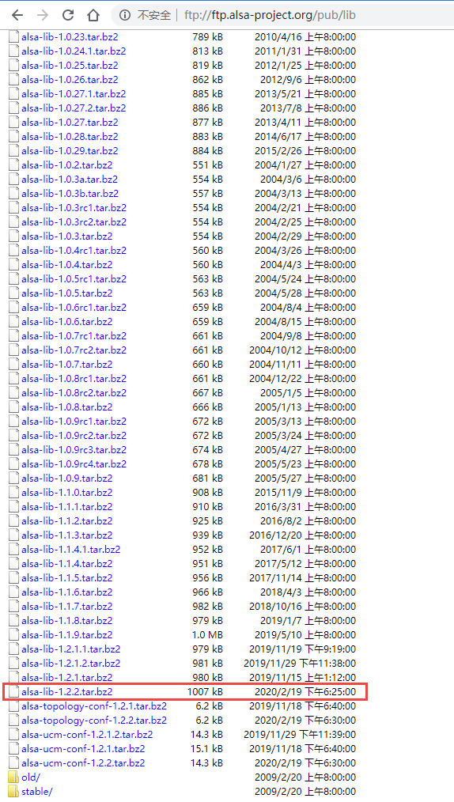

   qt_cross_compiling002.png

-  交叉编译器选择刚刚安装的编译器：CROSS_CHAIN_PREFIX=/opt/gcc-arm-linux-gnueabihf-8.3.0/bin/arm-linux-gnueabihf。

-  安装的路径是：INSTALL_PATH=/opt/${PACKAGE_NAME}，即 /opt/alsa-1.2.2

整个脚本的执行顺序如下：

1. 下载 alsa 源码
2. 解压 alsa 源码文件
3. 配置 alsa
   源码，配置的内容主要是指定编译器： ``export CC=${CROSS_CHAIN_PREFIX}-gcc``
   ；指定安装路径 ``--prefix=${INSTALL_PATH}`` ，即/opt/alsa-1.2.2
   ；指定平台： ``--host=${HOST}`` ，除此之外还是要动态库的方式连接： ``--enable-shared``
   ；不使能Python： ``--disable-python`` ；
   然后指定配置文件的路径： ``--with-configdir=${INSTALL_PATH}/config`` ；指定插件的路径： ``--with-plugindir=${INSTALL_PATH}/plugin`` 。
4. 编译并且安装： ``make && make install`` 。

**需要使用 sudo
权限执行脚本** ，因为在/opt/目录下必须要有超级用户权限才可以正常安装。

.. code:: bash

    sudo ./build-alsa.sh

如果大家想要自己去配置alsa的内容，可以进入到源码目录下，运行以下命令进行查看支持的配置：

.. code:: bash

    #  ./configure -h

    [....省略大部分的配置内容]

    Optional Features:
      --disable-option-checking  ignore unrecognized --enable/--with options
      --disable-FEATURE       do not include FEATURE (same as --enable-FEATURE=no)
      --enable-FEATURE[=ARG]  include FEATURE [ARG=yes]
      --enable-silent-rules   less verbose build output (undo: "make V=1")
      --disable-silent-rules  verbose build output (undo: "make V=0")
      --disable-maintainer-mode
                              disable make rules and dependencies not useful (and
                              sometimes confusing) to the casual installer
      --enable-dependency-tracking
                              do not reject slow dependency extractors
      --disable-dependency-tracking
                              speeds up one-time build
      --enable-static[=PKGS]  build static libraries [default=no]
      --enable-shared[=PKGS]  build shared libraries [default=yes]
      --enable-fast-install[=PKGS]
                              optimize for fast installation [default=yes]
      --disable-libtool-lock  avoid locking (might break parallel builds)
      --enable-symbolic-functions
                              use -Bsymbolic-functions option if available
                              (optmization for size and speed)
      --enable-debug          enable assert call at the default error message
                              handler
      --enable-resmgr         support resmgr (optional)
      --disable-aload         disable reading /dev/aload*
      --disable-mixer         disable the mixer component

    [....省略大部分的配置内容]

交叉编译Qt
----------

本次交叉编译Qt源码的版本选择5.11.3版本，我们可以在Qt官网可以看到对应的源码是最新的版本：

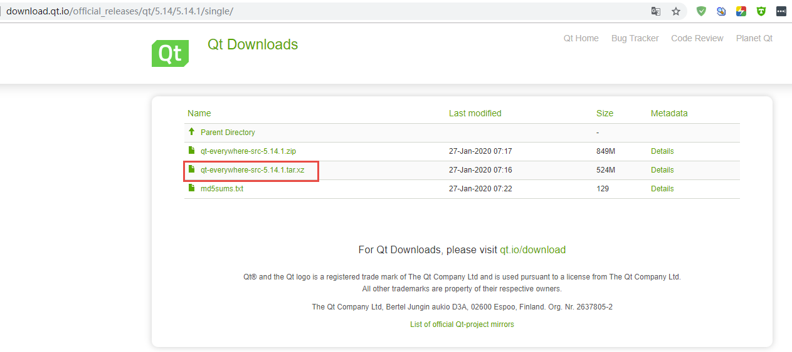

   qt_cross_compiling003.png

**野火提供 build-qt.sh 脚本一键下载、配置、安装依赖、编译及安装 qt** ：

build-qt.sh 脚本内容如下：

.. code:: bash

   #!/bin/sh

   # set -v 

   PLATFORM=my-linux-arm-qt
   SCRIPT_PATH=$(pwd)

   #修改源码包解压后的名称
   MAJOR_NAME=qt-everywhere-src

   #修改需要下载的源码前缀和后缀
   OPENSRC_VER_PREFIX=5.11
   OPENSRC_VER_SUFFIX=.3

   #添加tslib交叉编译的动态库文件和头文件路径
   TSLIB_LIB=/opt/tslib-1.21/lib
   TSLIB_INC=/opt/tslib-1.21/include

   #添加alsa交叉编译的动态库文件和头文件路径
   ALSA_LIB=/opt/alsa-lib-1.2.2/lib
   ALSA_INC=/opt/alsa-lib-1.2.2/include

   #修改源码包解压后的名称
   PACKAGE_NAME=${MAJOR_NAME}-${OPENSRC_VER_PREFIX}${OPENSRC_VER_SUFFIX}

   #定义编译后安装--生成的文件,文件夹位置路径
   INSTALL_PATH=/opt/${PACKAGE_NAME}

   #添加交叉编译工具链路径
   # CROSS_CHAIN_PREFIX=/opt/arm-gcc/bin/arm-linux-gnueabihf
   CROSS_CHAIN_PREFIX=/opt/gcc-arm-linux-gnueabihf-8.3.0/bin/arm-linux-gnueabihf

   #定义压缩包名称
   COMPRESS_PACKAGE=${PACKAGE_NAME}.tar.xz

   #无需修改--自动组合下载地址
   OPENSRC_VER=${OPENSRC_VER_PREFIX}${OPENSRC_VER_SUFFIX}

   case ${OPENSRC_VER_PREFIX} in
         5.9 | 5.12 | 5.13 | 5.14 |5.15 )
         DOWNLOAD_LINK=http://download.qt.io/official_releases/qt/${OPENSRC_VER_PREFIX}/${OPENSRC_VER}/single/${COMPRESS_PACKAGE} 
         ;;
      *)
         DOWNLOAD_LINK=http://download.qt.io/new_archive/qt/${OPENSRC_VER_PREFIX}/${OPENSRC_VER}/single/${COMPRESS_PACKAGE} 
         ;;
   esac

   #无需修改--自动组合平台路径
   CONFIG_PATH=${SCRIPT_PATH}/${PACKAGE_NAME}/qtbase/mkspecs/${PLATFORM}

   #无需修改--自动组合配置平台路径文件
   CONFIG_FILE=${CONFIG_PATH}/qmake.conf

   #下载源码包
   do_download_src () {
      echo "\033[1;33mstart download ${PACKAGE_NAME}...\033[0m"

      if [ ! -f "${COMPRESS_PACKAGE}" ];then
         if [ ! -d "${PACKAGE_NAME}" ];then
            wget -c ${DOWNLOAD_LINK}
         fi
      fi

      echo "\033[1;33mdone...\033[0m"
   }

   #解压源码包
   do_tar_package () {
      echo "\033[1;33mstart unpacking the ${PACKAGE_NAME} package ...\033[0m"
      if [ ! -d "${PACKAGE_NAME}" ];then
         tar -xf ${COMPRESS_PACKAGE}
      fi
      echo "\033[1;33mdone...\033[0m"
      cd ${PACKAGE_NAME}

      # 修复5.11.3 版本的bug
      if [ ${OPENSRC_VER_PREFIX}=="5.11" -a ${OPENSRC_VER_SUFFIX}==".3" ]; then
         sed 's/asm volatile /asm /' -i qtscript/src/3rdparty/javascriptcore/JavaScriptCore/jit/JITStubs.cpp
      fi
   }

   #安装依赖项
   do_install_config_dependent () {
      sudo apt install g++ make qt3d5-dev-tools -y
      sudo apt install qml-module-qtquick-xmllistmodel -y
      sudo apt install qml-module-qtquick-virtualkeyboard qml-module-qtquick-privatewidgets qml-module-qtquick-dialogs qml -y
      sudo apt install libqt53dquickscene2d5 libqt53dquickrender5 libqt53dquickinput5 libqt53dquickextras5 libqt53dquickanimation5 libqt53dquick5 -y
      sudo apt install qtdeclarative5-dev qml-module-qtwebengine qml-module-qtwebchannel qml-module-qtmultimedia qml-module-qtaudioengine -y
   }

   #修改配置平台
   do_config_before () {
      echo "\033[1;33mstart configure platform...\033[0m"

   if [ ! -d "${CONFIG_PATH}" ];then
      cp -a ${SCRIPT_PATH}/${PACKAGE_NAME}/qtbase/mkspecs/linux-arm-gnueabi-g++ ${CONFIG_PATH}
   fi

      echo "#" > ${CONFIG_FILE}
      echo "# qmake configuration for building with arm-linux-gnueabi-g++" >> ${CONFIG_FILE}
      echo "#" >> ${CONFIG_FILE}
      echo "" >> ${CONFIG_FILE}
      echo "MAKEFILE_GENERATOR      = UNIX" >> ${CONFIG_FILE}
      echo "CONFIG                 += incremental" >> ${CONFIG_FILE}
      echo "QMAKE_INCREMENTAL_STYLE = sublib" >> ${CONFIG_FILE}
      echo "" >> ${CONFIG_FILE}
      echo "include(../common/linux.conf)" >> ${CONFIG_FILE}
      echo "include(../common/gcc-base-unix.conf)" >> ${CONFIG_FILE}
      echo "include(../common/g++-unix.conf)" >> ${CONFIG_FILE}
      echo "" >> ${CONFIG_FILE}
      echo "# modifications to g++.conf" >> ${CONFIG_FILE}
      echo "QMAKE_CC                = ${CROSS_CHAIN_PREFIX}-gcc -lts" >> ${CONFIG_FILE}
      echo "QMAKE_CXX               = ${CROSS_CHAIN_PREFIX}-g++ -lts" >> ${CONFIG_FILE}
      echo "QMAKE_LINK              = ${CROSS_CHAIN_PREFIX}-g++ -lts" >> ${CONFIG_FILE}
      echo "QMAKE_LINK_SHLIB        = ${CROSS_CHAIN_PREFIX}-g++ -lts" >> ${CONFIG_FILE}
      echo "" >> ${CONFIG_FILE}
      echo "# modifications to linux.conf" >> ${CONFIG_FILE}
      echo "QMAKE_AR                = ${CROSS_CHAIN_PREFIX}-ar cqs" >> ${CONFIG_FILE}
      echo "QMAKE_OBJCOPY           = ${CROSS_CHAIN_PREFIX}-objcopy" >> ${CONFIG_FILE}
      echo "QMAKE_NM                = ${CROSS_CHAIN_PREFIX}-nm -P" >> ${CONFIG_FILE}
      echo "QMAKE_STRIP             = ${CROSS_CHAIN_PREFIX}-strip" >> ${CONFIG_FILE}
      echo "load(qt_config)" >> ${CONFIG_FILE}
      echo "" >> ${CONFIG_FILE}
      echo "QMAKE_INCDIR=${TSLIB_INC}" >> ${CONFIG_FILE}
      echo "QMAKE_LIBDIR=${TSLIB_LIB}" >> ${CONFIG_FILE}

      cat ${CONFIG_FILE}
      echo "\033[1;33mdone...\033[0m"
   }

   #配置选项
   do_configure () {
      echo "\033[1;33mstart configure ${PACKAGE_NAME}...\033[0m"

      export CC="${CROSS_CHAIN_PREFIX}-gcc"
      export CXX="${CROSS_CHAIN_PREFIX}-g++" 

      ./configure \
      -prefix ${INSTALL_PATH} \
      -xplatform ${PLATFORM} \
      -release \
      -opensource \
      -confirm-license \
      -no-openssl \
      -no-opengl \
      -no-xcb \
      -no-eglfs \
      -no-compile-examples \
      -no-pkg-config \
      -skip qtquickcontrols \
      -skip qtquickcontrols2 \
      -skip qtsensors \
      -skip qtdoc \
      -skip qtwayland \
      -skip qt3d \
      -skip qtcanvas3d \
      -skip qtpurchasing \
      -skip qtcharts \
      -skip qtdeclarative \
      -no-iconv \
      -no-glib \
      -tslib \
      -I"${TSLIB_INC}" \
      -L"${TSLIB_LIB}" \
      -alsa \
      -I"${ALSA_INC}" \
      -L"${ALSA_LIB}" \

      echo "\033[1;33mdone...\033[0m"
   }

   #编译并且安装
   do_make_install () {
      echo "\033[1;33mstart make and install ${PACKAGE_NAME} ...\033[0m"
      make && make install
      echo "\033[1;33mdone...\033[0m"
   }

   #删除下载的文件
   do_delete_file () {
      cd ${SCRIPT_PATH}
      if [ -f "${COMPRESS_PACKAGE}" ];then
         sudo rm -f ${COMPRESS_PACKAGE}
      fi
   }

   do_download_src
   do_tar_package
   do_install_config_dependent
   do_config_before
   do_configure
   do_make_install
   # do_delete_file

   exit $?

简单介绍一下脚本的内容：

1. 使用wget命令下载qt源码.
2. 解压下载完的源码包。
3. 进入源码目录中，进行配置，为了不污染源码本身，
   重新拷贝一份 ``qtbase/mkspecs/linux-arm-gnueabi-g++`` 中的配置，
   并且命名为 ``my-linux-arm-qt`` ，然后修改qmake.conf文件的内容，
   主要是指定编译Qt的编译器： ``/opt/gcc-arm-linux-gnueabihf-8.3.0/bin/arm-linux-gnueabihf-gcc``。
   当然，这部分操作均在脚本中完成的。

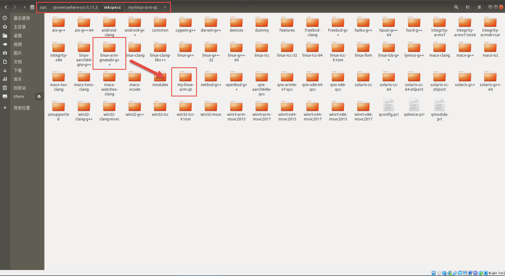

   qt_cross_compiling004.png
.. figure:: media/qt_cross_compiling005.png
   :alt: qt_cross_compiling005.png

   qt_cross_compiling005.png

4. 安装一些对应的依赖。
5. 编译Qt并安装到指定目录下： ``/opt/qt-everywhere-src-5.11.3`` 。

安装Qt Creator
--------------

在官网下载Qt Creator，大家可以仅安装Qt Creator IDE，也可以安装Qt CreatorIDE与 PC上的Qt5.14.1版本的编译环境，
前者没有Qt编译环境，而后者可以在PC上编译Qt应用程序并且可以在PC上运行与调试。
独立的QtCreatorIDE可以在官网中下载： http://download.qt.io/official_releases/qtcreator/4.11/4.11.1/ 。

此处的Qt Creator 5.14与前面安装的交叉编译环境qt-everywhere 5.11稍有差别，选择Qt Creator 5.14是因为它直接提供了现成的安装包，
而开发板的环境要求为qt-everywhere 5.11，当我们安装好Qt Creator后使用添加开发板所需的5.11版本编译链即可。

为了方便起见，我们既安装IDE也安装PC上的Qt编译环境，注意此处的编译环境是PC上的而非交叉编译环境。
我们在Qt官网下载IED与编译环境集成的可执行文件： http://download.qt.io/official_releases/qt/5.14/5.14.1/ ，如下图所示：

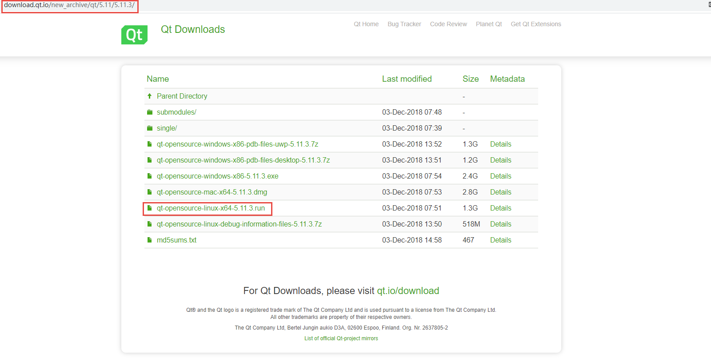

   install_qt_creator000

当然我们也能在终端通过wget命令下载：

.. code:: bash

    ➜  ~ wget http://download.qt.io/official_releases/qt/5.14/5.14.1/qt-opensource-linux-x64-5.14.1.run
    --2020-03-19 11:10:45--  http://download.qt.io/official_releases/qt/5.14/5.14.1/qt-opensource-linux-x64-5.14.1.run
    正在解析主机 download.qt.io (download.qt.io)... 77.86.229.90
    正在连接 download.qt.io (download.qt.io)|77.86.229.90|:80... 已连接。
    已发出 HTTP 请求，正在等待回应... 302 Found
    位置：http://mirrors.ustc.edu.cn/qtproject/archive/qt/5.14/5.14.1/qt-opensource-linux-x64-5.14.1.run [跟随至新的 URL]
    --2020-03-19 11:11:24--  http://mirrors.ustc.edu.cn/qtproject/archive/qt/5.14/5.14.1/qt-opensource-linux-x64-5.14.1.run
    正在解析主机 mirrors.ustc.edu.cn (mirrors.ustc.edu.cn)... 202.38.95.110, 202.141.176.110, 2001:da8:d800:95::110
    正在连接 mirrors.ustc.edu.cn (mirrors.ustc.edu.cn)|202.38.95.110|:80... 已连接。
    已发出 HTTP 请求，正在等待回应... 200 OK
    长度： 1320027012 (1.2G) [application/x-makeself]
    正在保存至: “qt-opensource-linux-x64-5.14.1.run”

    qt-opensource-linux-x64-5 100%[==================================>]   1.23G  4.82MB/s    用时 2m 7s 

    2020-03-19 11:13:31 (9.90 MB/s) - 已保存 “qt-opensource-linux-x64-5.14.1.run” [1320027012/1320027012])

在下载完毕后赋予它可执行权限：

.. code:: bash

    sudo chmod +x qt-opensource-linux-x64-5.14.1.run

然后运行即可安装：

.. code:: bash

    ./qt-opensource-linux-x64-5.14.1.run

安装过程如下，基本上一路Next下去即可：

   install_qt_creator001

因为安装的时候要登陆Qt的账号密码，如果还没有账号密码的同学可以去Qt官网进行注册一个：

   install_qt_creator002

同意Qt的开源协议。

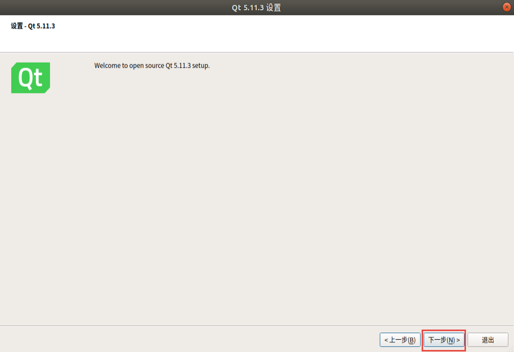

   install_qt_creator003

选择安装的目录，默认情况下会在当前目录下安装，有需要的可以选择其他目录。

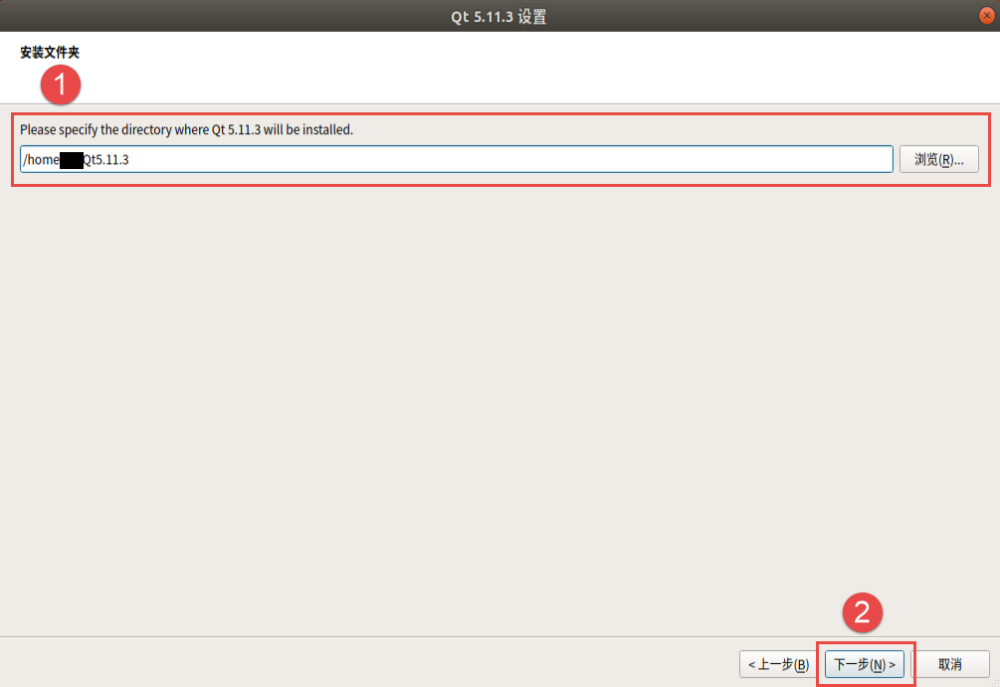

   install_qt_creator004

选择安装的PC上的Qt编译环境，为了避免缺失，全选就行了。

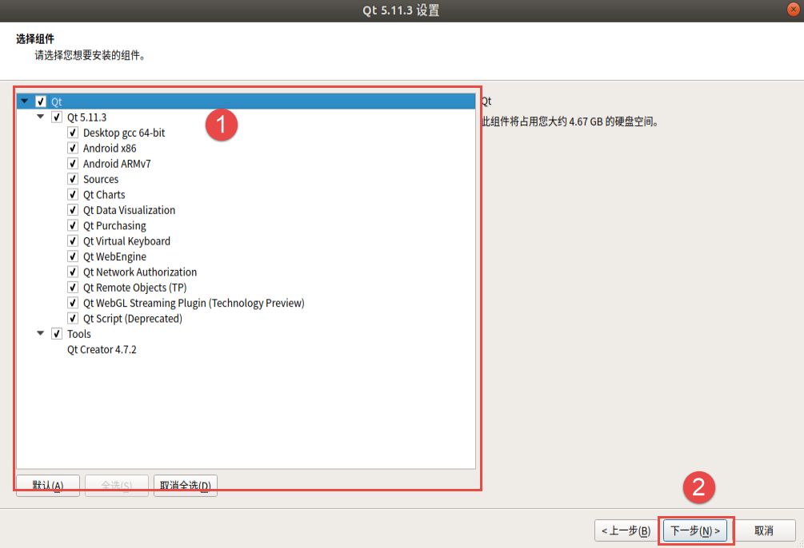

   install_qt_creator005

同意Qt的协议，因为不同意的话是无法安装的，对于商用的同学就要认真看看协议的内容了，而仅是学习的话，基本不用理会它。

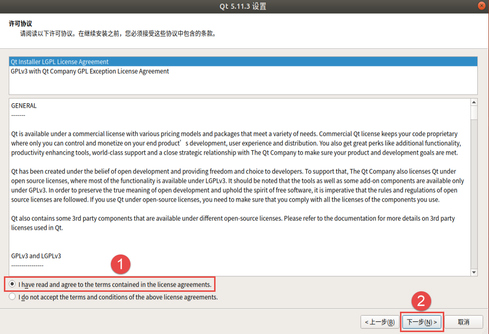

   install_qt_creator006

正在安装中。

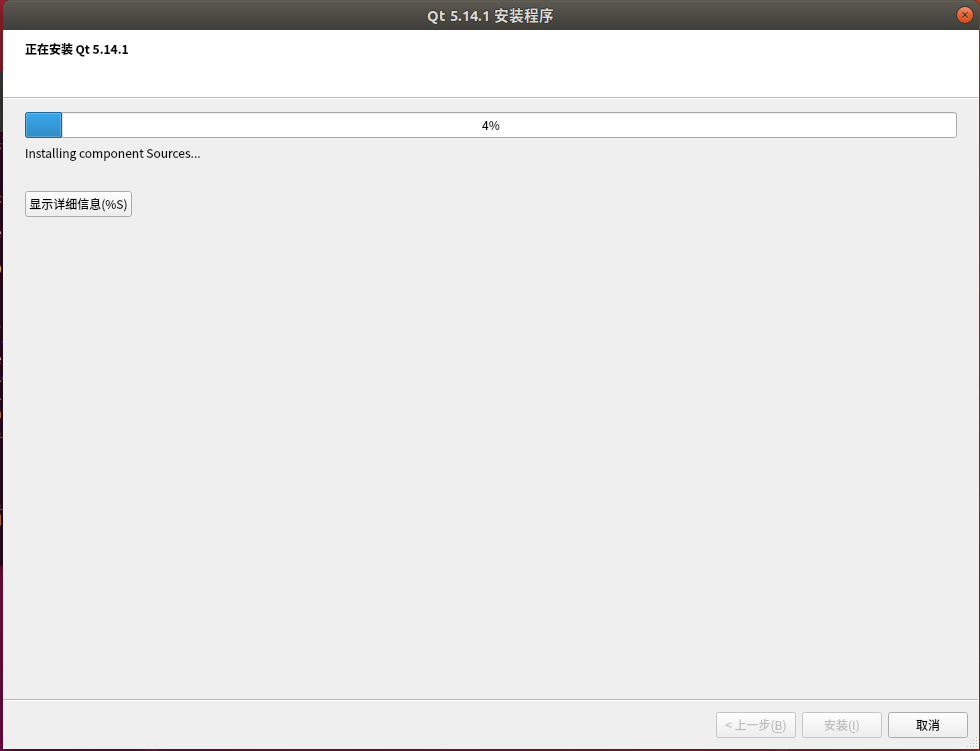

   install_qt_creator007

安装完成。

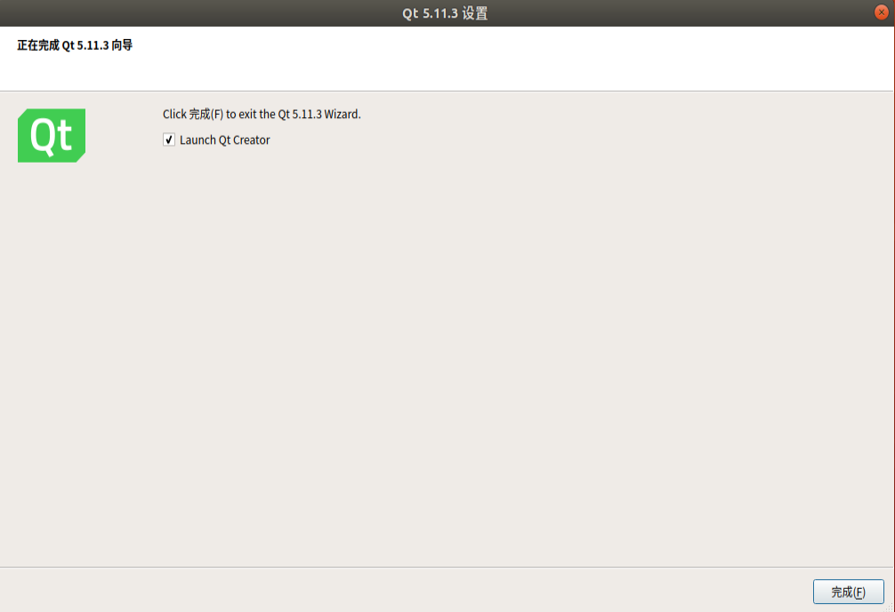

   install_qt_creator008

开始使用Qt Creator
------------------

在ubuntu打开Qt Creator：

.. figure:: media/install_qt_creator009.png
   :alt: install_qt_creator009

   install_qt_creator009

进入Qt Creator后，可以在示例中看到很多自带的例程我们可以选择一个时钟的例程，名字是analogclock，它所在的目录是 ``Qt5.14.1/Examples/Qt-5.14.1/widgets/widgets/`` 。

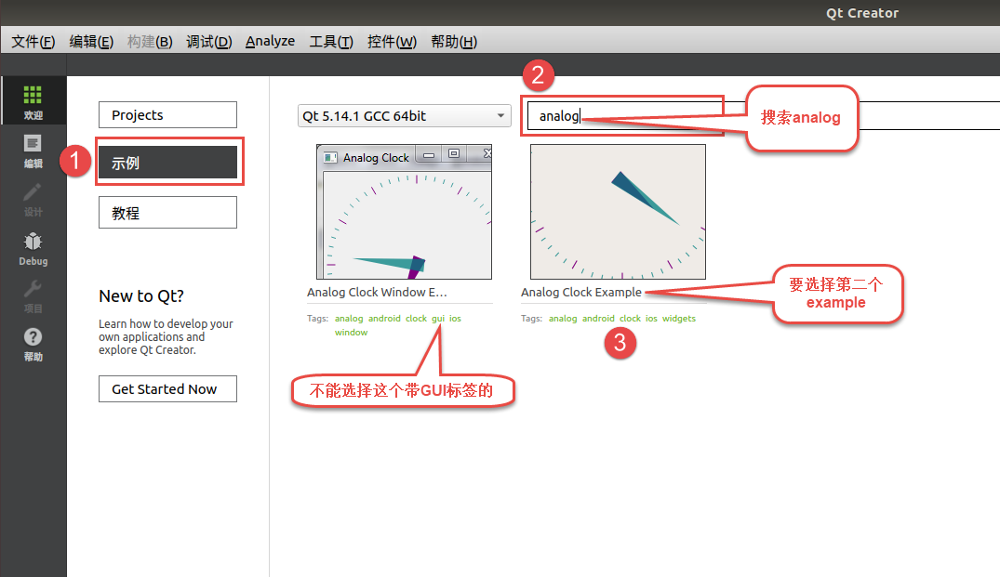

   install_qt_creator010

我们打开这个例程后，点击构建，将这个例程编译完成，然后我们可以点击运行：

.. figure:: media/install_qt_creator011.png
   :alt: install_qt_creator011

   install_qt_creator011

此时PC上已经显示出这个例程的运行效果，如图所示：

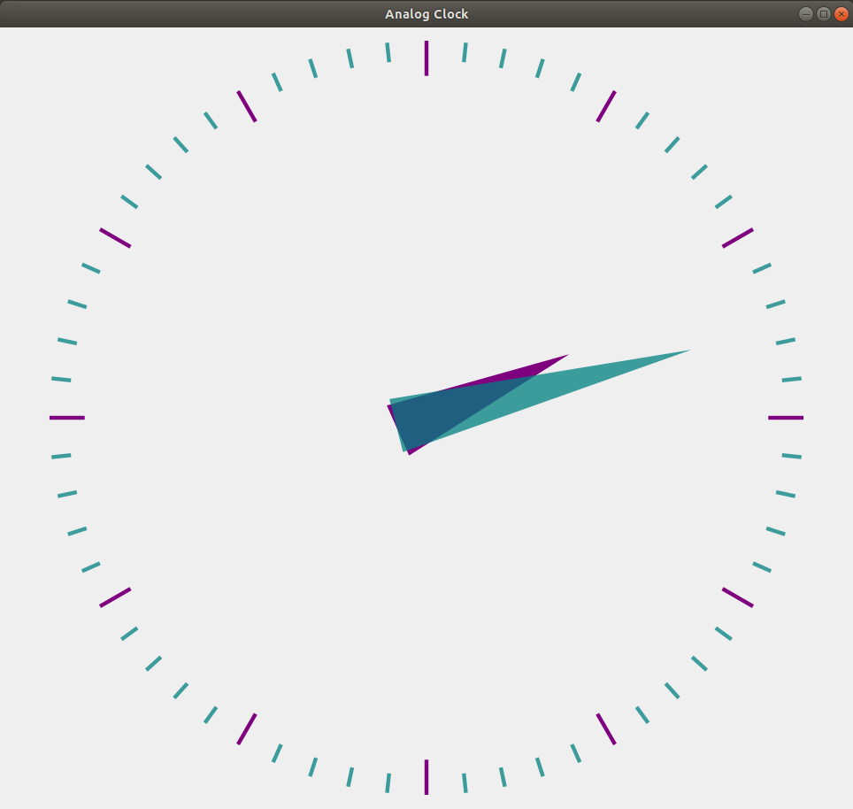

   install_qt_creator012

除此之外还有非常多的教程，这些教程对初学者都是非常友好的，大家可以去学习一下。

   install_qt_creator013

在Qt Creator使用交叉编译环境
----------------------------

至此，上面所讲的都是在PC环境下使用的，它编译出来的应用程序并不能在开发板上运行，因此我们需要在Qt
Creator使用交叉编译环境，然后进行交叉编译，再将程序放到开发板上运行。
首先选择 【工具】 -> 【选项】

.. figure:: media/install_qt_creator014.png
   :alt: install_qt_creator014

   install_qt_creator014

在弹出来的选项配置界面中选择【Kits】->【编译器】，点击【添加】按钮选择添加【GCC】 ->【C++】类型，
自己定义一个名字，然后将我们之前安装的``arm-linux-gnueabihf-gcc 8.3.0`` 版本的交叉编译器添加进来，
注意要选择 ``/opt/gcc-arm-linux-gnueabihf-8.3.0/bin/arm-linux-gnueabihf-g++`` ，点击【Apply】完成应用。

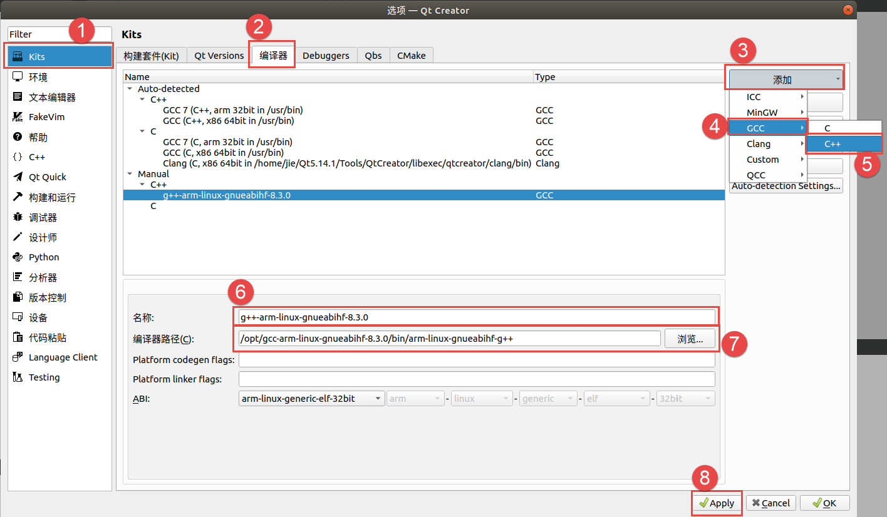

   install_qt_creator015

同理将 ``/opt/gcc-arm-linux-gnueabihf-8.3.0/bin/arm-linux-gnueabihf-gcc`` 编译器添加进来。

.. figure:: media/install_qt_creator016.png
   :alt: install_qt_creator016

   install_qt_creator016

然后选择Qt的版本，我们在前面已经交叉编译并安装了Qt5.11.3版本，那么在这里只需要将qmake添加进来即可，
具体操作如下：在选项配置界面中选择【Kits】->【Qt Versions】，然后点击【添加】按钮，在Qt的安装目录
下选择qmake： ``/opt/qt-everywhere-src-5.11.3/bin`` ，然后添加完成后点击【Apply】完成应用。

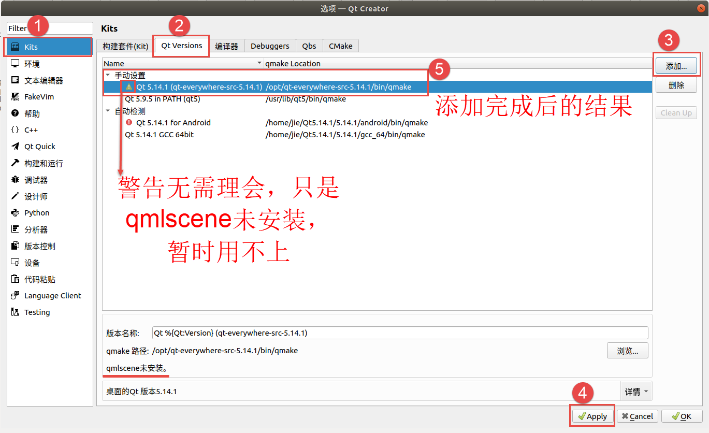

   install_qt_creator017

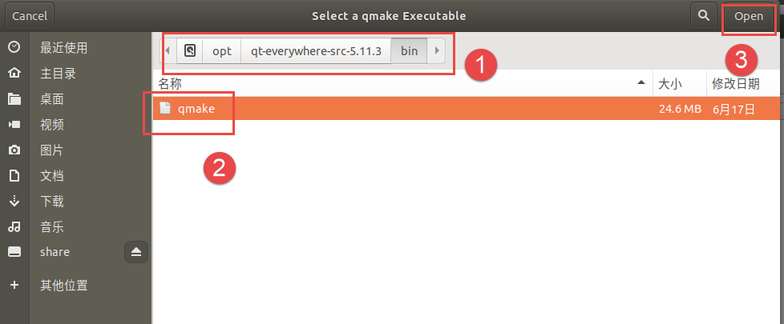

   install_qt_creator018

最后要添加构建套件，在选项配置界面中选择【Kits】->
【构建套件(Kit)】，点击【添加】，然后设置名称，此处我的名称设置为“ebf_imx6ull”，接着选择设备的类型，我选择了通用的Linux设备（Generic
Linux
Device），因为这是为开发板构建的环境，然后选择编译器，此处使用我们刚刚添加的交叉编译器即可，最后选择Qt的版本，此处也是选择我们刚刚添加的交叉编译安装的版本，最后点击【Apply】完成应用。

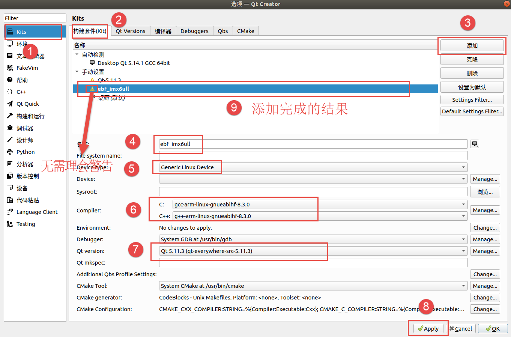

   install_qt_creator019

交叉编译Qt自带的例程
--------------------

首先点击例程的项目配置，选择使用交叉编译环境编译，选择构建套件为刚刚添加的交叉编译套件 ``ebf_imx6ull`` ，在编译时可以根据自己需求决定选择Debug或者Release版本：

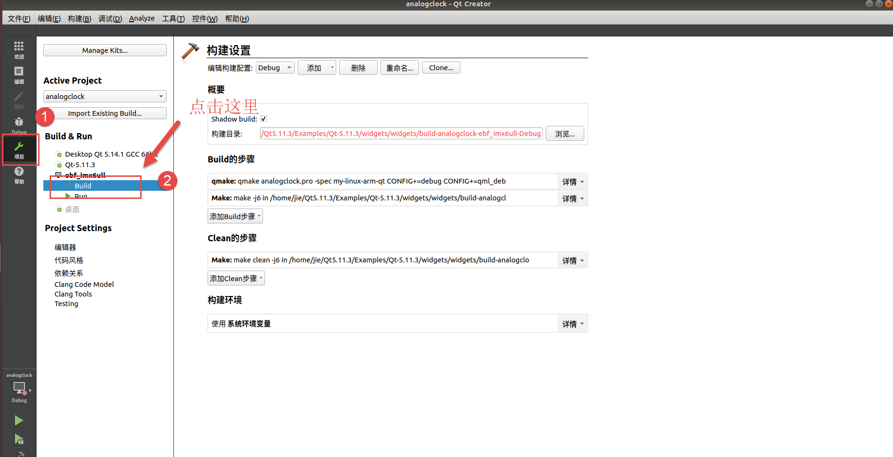

   install_qt_creator020

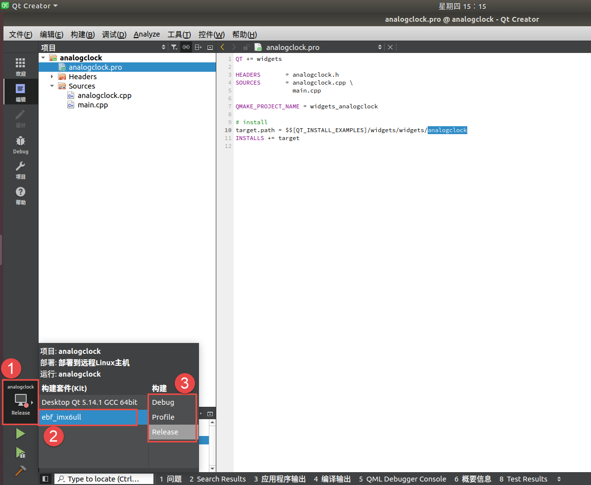

   install_qt_creator021

点击“锤子”构建应用程序：

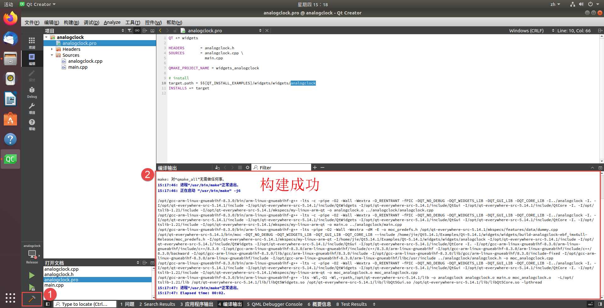

   install_qt_creator022

在构建完成后，可以在 ``Qt5.14.1/Examples/Qt-5.14.1/widgets/widgets/build-analogclock-ebf_imx6ull-Release`` 目录下看到对应的可执行文件analogclock：

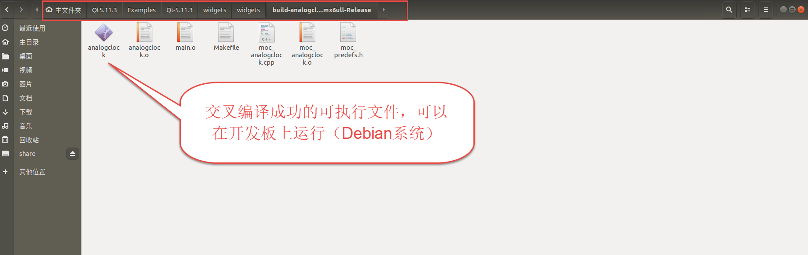

   install_qt_creator023

我们可以使用file查看文件的类型，可以发现它确实是32位的程序，是ARM类型的可执行文件。

.. figure:: media/install_qt_creator024.png
   :alt: install_qt_creator024

   install_qt_creator024

开发板的环境处理
----------------

首先要使用已经发布的Debian系统，可以选择纯净版的Debian镜像 ``Debian Buster Lite`` ，也可以选择动态版本的Qt镜像 ``Full Feature QT_App`` ，但是注意 **不要选择其他版本** 。

Debian Buster Lite版本
~~~~~~~~~~~~~~~~~~~~~~

如果你选择的是纯净版的Debian镜像 ``Debian Buster Lite`` ，我们要安装动态版本的qt-app，直接使用以下指令安装即可：

.. code:: bash

    sudo apt-get install qt-app

如果没有发现 ``qt-app`` 安装包，可以使用以下命令更新一下apt命令的软件包缓存再安装：

.. code:: bash

    sudo apt-get update

在安装完成后，可以发现 ``/home/debian`` 目录下多了qt-app文件夹，这里就是我们出厂提供的Qt应用程序，可以直接使用以下命令运行它，野火提供了run.sh运行Qt应用程序的脚本，这样子就不需要我们配置环境变量：

.. code:: bash

    # 进入qt-app目录
    cd qt-app

    # 运行
    sudo ./run.sh

如果能成功运行，则可以 **将我们编译例程的可执行文件analogclock放到qt-app目录下** ，然后编辑run.sh脚本，主要是修改脚本中的最后一行，将运行官方的App改为自己的Qt例程analogclock。（编辑可以使用nano编辑器进行编辑）

.. code:: bash

    #! /bin/sh

    type devscan

    if [ $? -eq 0 ]; then
        eventx=$(devscan "goodix-ts")
        echo "eventx=$eventx"
        if [ ! -f "/etc/pointercal" ]; then
            type devscan
            if [ $? -eq 0 ]; then
                ts_calibrate
            fi
        fi
    else
        echo "please install devscan"
        echo
        echo "sudo apt-get install devscan"
        exit
    fi

    export APP_DIR=/home/debian/qt-app
    export QT_QPA_PLATFORM_PLUGIN_PATH=/usr/lib/arm-linux-gnueabihf/qt5/plugins/
    export LD_LIBRARY_PATH=$LD_LIBRARY_PATH:$APP_DIR/libskin:$APP_DIR/libqui:$APP_DIR/libffmpeg:/usr/lib:/lib
    export QT_QPA_FONTDIR=/usr/share/fonts/SourceHanSans
    export PATH=$PATH:$QT_DIR/libexec
    export QT_QPA_PLATFORM=linuxfb:fb=/dev/fb0
    export TSLIB_CONFFILE=/etc/ts.conf
    export TSLIB_CALIBFILE=/etc/pointercal
    export QT_QPA_GENERIC_PLUGINS=tslib:/dev/input/$eventx
    export QWS_MOUSE_PROTO=tslib
    export QT_QPA_EVDEV_TOUCHSCREEN_PARAMETERS=/dev/input/$eventx:rotate=180:invertx

    # start app...
    # $APP_DIR/App

    # 这里是要运行的Qt程序
    $APP_DIR/analogclock

保存并且运行：

.. code:: bash

    # 运行
    sudo ./run.sh

此时我们的开发板上运行的就是Qt的例程，效果如下：

.. figure:: media/install_qt_creator025.png
   :alt: install_qt_creator025

   install_qt_creator025

Full Feature QT_App版本
~~~~~~~~~~~~~~~~~~~~~~~~

而如果你选择的是动态版本的Qt镜像 ``Full Feature QT_App`` ，则无需安装qt-app，因为在系统中就已经存在了qt相关的环境，并且在 ``/home/debian`` 路径下就也存在了qt-app应用程序。

**将我们编译例程的可执行文件analogclock放到qt-app目录下** ，然后编辑run.sh脚本，主要是修改脚本中的最后一行，将运行官方的App改为自己的Qt例程analogclock。（编辑可以使用nano编辑器进行编辑）

.. code:: bash

    #! /bin/sh

    type devscan

    if [ $? -eq 0 ]; then
        eventx=$(devscan "goodix-ts")
        echo "eventx=$eventx"
        if [ ! -f "/etc/pointercal" ]; then
            type devscan
            if [ $? -eq 0 ]; then
                ts_calibrate
            fi
        fi
    else
        echo "please install devscan"
        echo
        echo "sudo apt-get install devscan"
        exit
    fi

    export APP_DIR=/home/debian/qt-app
    export QT_QPA_PLATFORM_PLUGIN_PATH=/usr/lib/arm-linux-gnueabihf/qt5/plugins/
    export LD_LIBRARY_PATH=$LD_LIBRARY_PATH:$APP_DIR/libskin:$APP_DIR/libqui:$APP_DIR/libffmpeg:/usr/lib:/lib
    export QT_QPA_FONTDIR=/usr/share/fonts/SourceHanSans
    export PATH=$PATH:$QT_DIR/libexec
    export QT_QPA_PLATFORM=linuxfb:fb=/dev/fb0
    export TSLIB_CONFFILE=/etc/ts.conf
    export TSLIB_CALIBFILE=/etc/pointercal
    export QT_QPA_GENERIC_PLUGINS=tslib:/dev/input/$eventx
    export QWS_MOUSE_PROTO=tslib
    export QT_QPA_EVDEV_TOUCHSCREEN_PARAMETERS=/dev/input/$eventx:rotate=180:invertx

    # start app...
    # $APP_DIR/App

    # 这里是要运行的Qt程序
    $APP_DIR/analogclock

保存并且运行：

.. code:: bash

    # 运行
    sudo ./run.sh

效果也是一样的。

.. figure:: media/install_qt_creator025.png
   :alt: install_qt_creator025

   install_qt_creator025

编译野火提供的Debian Qt Demo
----------------------------

因为本次实验是使用Qt
5.11.3去编译demo，demo略微有改动，我们可以从github或者gitee上拉取对应的仓库到本地，然后使用Qt
Creator去编译：

从github拉取：

.. code:: bash

    git clone https://github.com/Embedfire/ebf_debian_qt_demo.git

从gitee拉取：

.. code:: bash

    git clone https://gitee.com/Embedfire/ebf_debian_qt_demo.git

打开Qt Creator，添加QtUi进行单独的编译，通过Qt Creator界面的【文件】 ->
【添加文件或项目】，选择 ``ebf_debian_qt_demo/QtUi`` 目录下的QtUi.pro工程添加到Qt
Creator中。

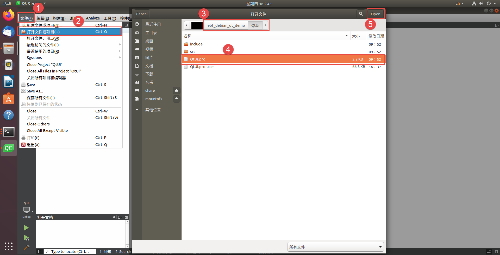

   install_qt_creator026

在添加工程的时候会让你选择构建套件，我们全选就好了，这取决于你系统中有多少中构建套件，而交叉编译套件则是我们之前安装的 ``ebf_imx6ull`` ，这个套件必须存在，否则无法交叉编译。

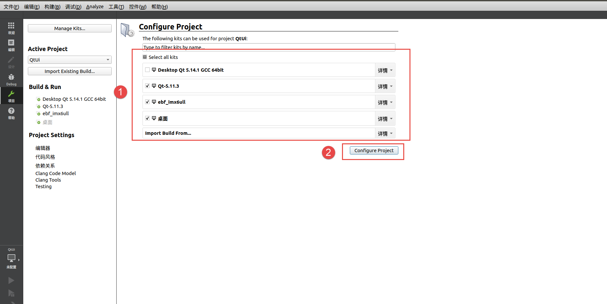

   install_qt_creator027

最后选择对应的构建套件并且进行构建。

.. figure:: media/install_qt_creator028.png
   :alt: install_qt_creator028

   install_qt_creator028

同理我们将Skin工程添加到Qt Creator中，然后进行构建：

.. figure:: media/install_qt_creator029.png
   :alt: install_qt_creator029

   install_qt_creator029

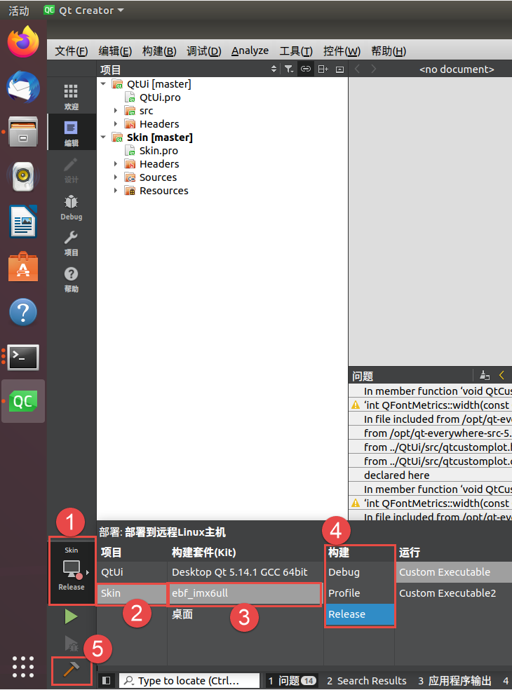

   install_qt_creator030

最后将我们要编译的Demo工程添加到Qt Creator中，并且进行构建：

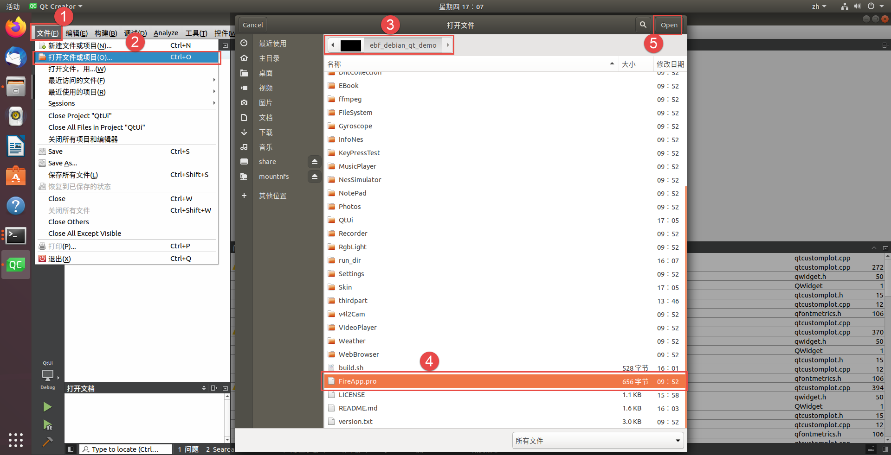

   install_qt_creator031

.. figure:: media/install_qt_creator032.png
   :alt: install_qt_creator032

   install_qt_creator032

在构建完成后，可以看到 ``ebf_debian_qt_demo/app_bin`` 目录下存在App可执行程序，我们使用file查看该可执行程序会发现它是32位的，可以在ARM开发板上运行，如图所示：

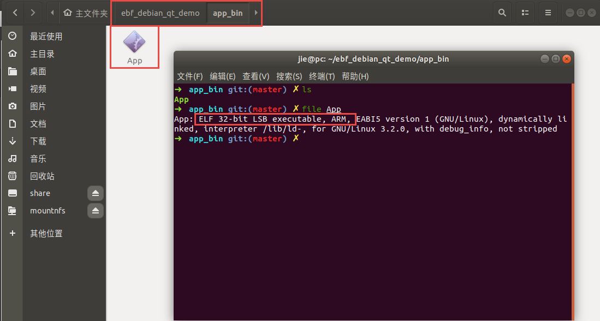

   install_qt_creator033

我们将它放到野火提供的Debian系统qt-app目录下，然后编辑run.sh脚本，主要是修改脚本中的最后一行，将运行官方的App改为自己的Qt应用程序xxx（最好是重命名一下我们编译的App，比如我重命名为mydemo）。

.. code:: bash

    #! /bin/sh

    type devscan

    if [ $? -eq 0 ]; then
        eventx=$(devscan "goodix-ts")
        echo "eventx=$eventx"
        if [ ! -f "/etc/pointercal" ]; then
            type devscan
            if [ $? -eq 0 ]; then
                ts_calibrate
            fi
        fi
    else
        echo "please install devscan"
        echo
        echo "sudo apt-get install devscan"
        exit
    fi

    export APP_DIR=/home/debian/qt-app
    export QT_QPA_PLATFORM_PLUGIN_PATH=/usr/lib/arm-linux-gnueabihf/qt5/plugins/
    export LD_LIBRARY_PATH=$LD_LIBRARY_PATH:$APP_DIR/libskin:$APP_DIR/libqui:$APP_DIR/libffmpeg:/usr/lib:/lib
    export QT_QPA_FONTDIR=/usr/share/fonts/SourceHanSans
    export PATH=$PATH:$QT_DIR/libexec
    export QT_QPA_PLATFORM=linuxfb:fb=/dev/fb0
    export TSLIB_CONFFILE=/etc/ts.conf
    export TSLIB_CALIBFILE=/etc/pointercal
    export QT_QPA_GENERIC_PLUGINS=tslib:/dev/input/$eventx
    export QWS_MOUSE_PROTO=tslib
    export QT_QPA_EVDEV_TOUCHSCREEN_PARAMETERS=/dev/input/$eventx:rotate=180:invertx

    # start app...
    # $APP_DIR/App

    # 这里是要运行的Qt程序
    $APP_DIR/mydemo

然后运行：

.. code:: bash

    sudo ./run.sh

运行的效果如下：

.. figure:: media/install_qt_creator034.png
   :alt: install_qt_creator034

   install_qt_creator034

在PC上运行野火提供的Debian Qt Demo
----------------------------------

有同学又想在PC上运行野火提供的Debian Qt
Demo，其实非常简单，我们只需要选择不同的构建套件即可，比如我们将QtUi、Skin、FireApp等工程的构建套件选择为 ``Desktop Qt 5.14.1 GCC 64bit`` 即可，这个构建套件是我们在安装的时候自动选择的，具体见：

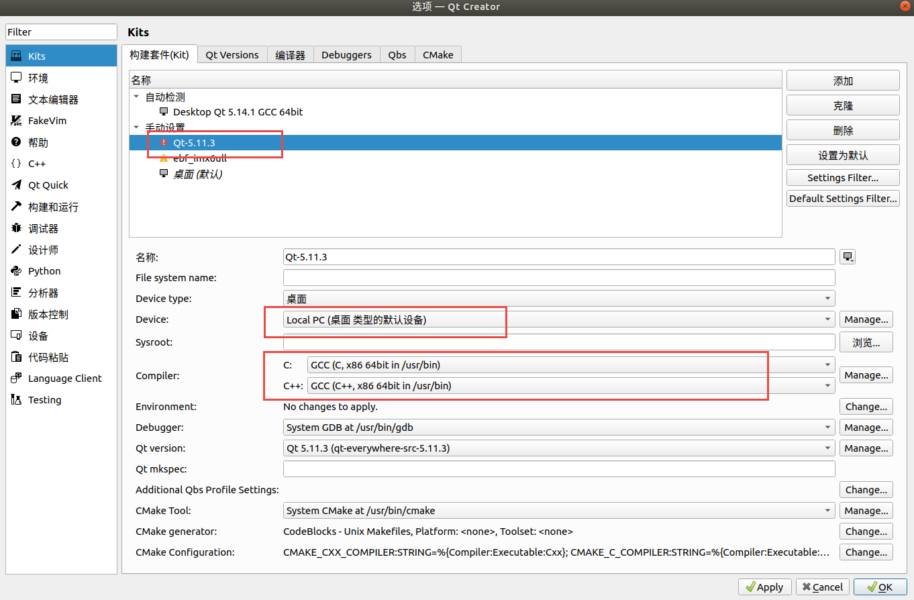

   install_qt_creator035

然后我们将所有工程都选择为 ``Desktop Qt 5.14.1 GCC 64bit`` 套件构建：

Skin工程构建：

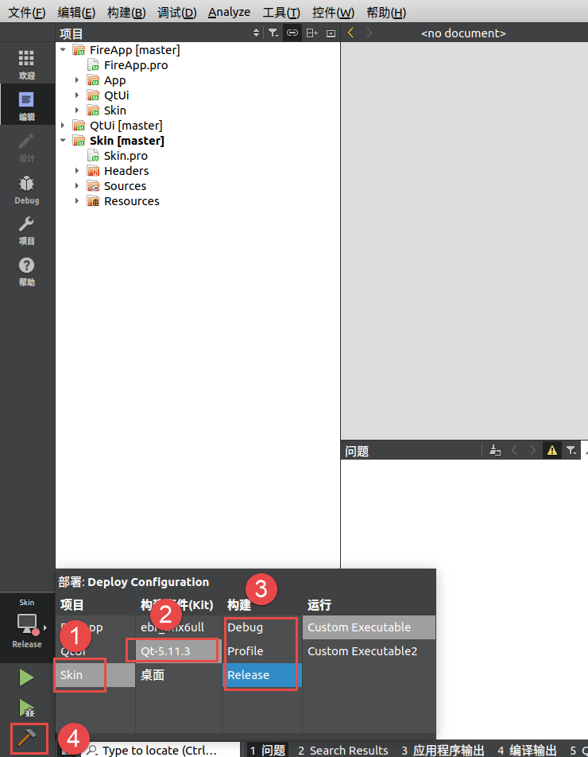

   install_qt_creator036

QtUi工程构建：

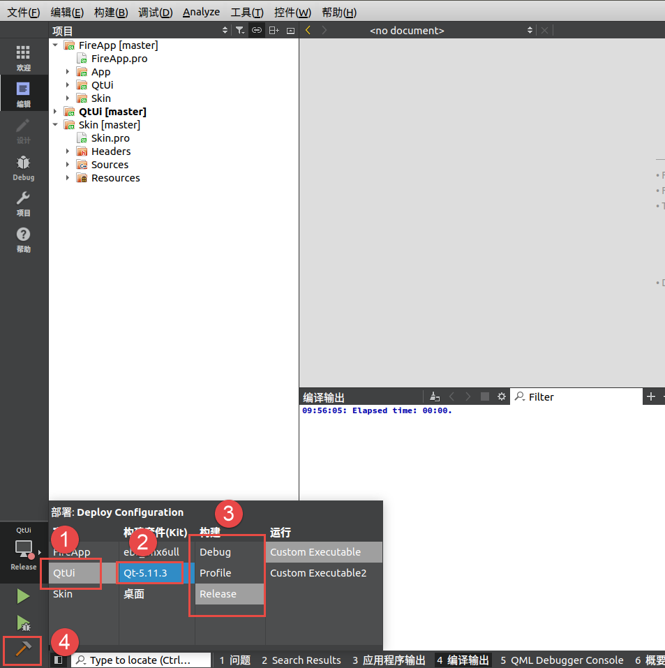

   install_qt_creator037

FireApp工程构建后运行：

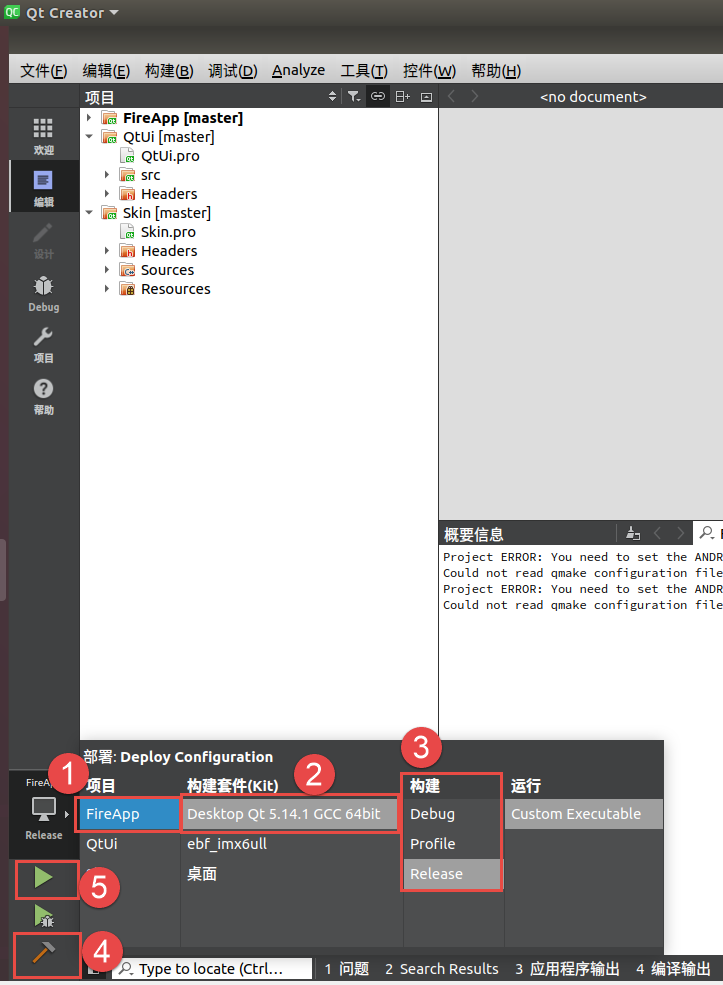

   install_qt_creator038

运行的效果：

   install_qt_creator039

错误处理
~~~~~~~~

1. 如果因为之前交叉编译产生不能链接的32位的文件，那么我们可以清除，然后再重新构建即可：

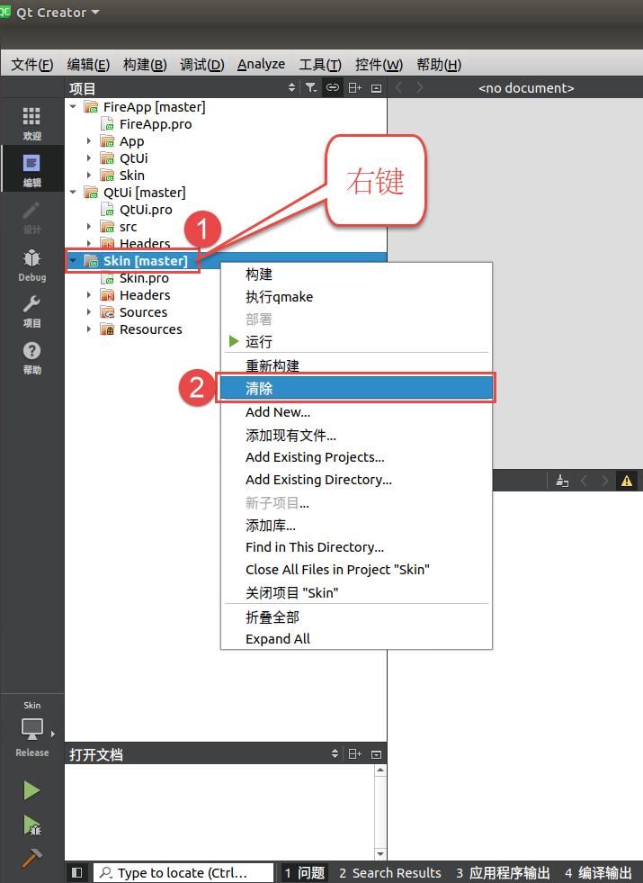

   install_qt_creator040

如果出现无法找到App应用程序的错误，我们可以重新设置一下项目运行的选项，运行配置选择App即可。

.. figure:: media/install_qt_creator041.png
   :alt: install_qt_creator041

   install_qt_creator041

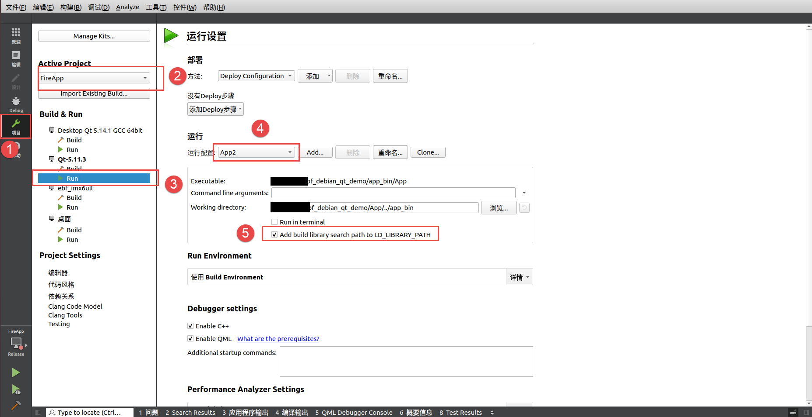

   install_qt_creator042

使用命令行编译
--------------

导出Qt交叉编译的环境变量
~~~~~~~~~~~~~~~~~~~~~~~~

.. code:: bash

    export PATH=/opt/qt-everywhere-src-5.11.3/bin:$PATH

输入命令验证Qt版本
~~~~~~~~~~~~~~~~~~

.. code:: bash

    qmake -v 

若环境变量设置正确，则会出现以下信息

.. code:: bash

    QMake version 3.1
    Using Qt version 5.11.3 in /opt/qt-everywhere-src-5.11.3/lib

    以上是验证SDK安装是否成功！！

下载qt源码
~~~~~~~~~~

**github**

.. code:: bash

    git clone https://github.com/Embedfire/ebf_debian_qt_demo.git

**gitee**

.. code:: bash

    git clone https://gitee.com/Embedfire/ebf_debian_qt_demo.git

编译
~~~~

.. code:: bash

    ./build.sh

如果 ``build.sh`` 不是可执行文件，可以使用以下命令添加可执行权限

.. code:: bash

    chmod +x build.sh

输出
~~~~

在当前目录下会创建一个 ``run_dir`` 目录，存在 ``App  libqui  libskin`` 文件，App是可以直接在开发板上运行的！
与此同时，还会打包一个 ``fire-app-xxxx.tar.bz2`` 文件，大家可以拷贝到对应的目录下解压替换掉旧的 ``App`` 。

清除相关内容
~~~~~~~~~~~~

.. code:: bash

    make distclean

