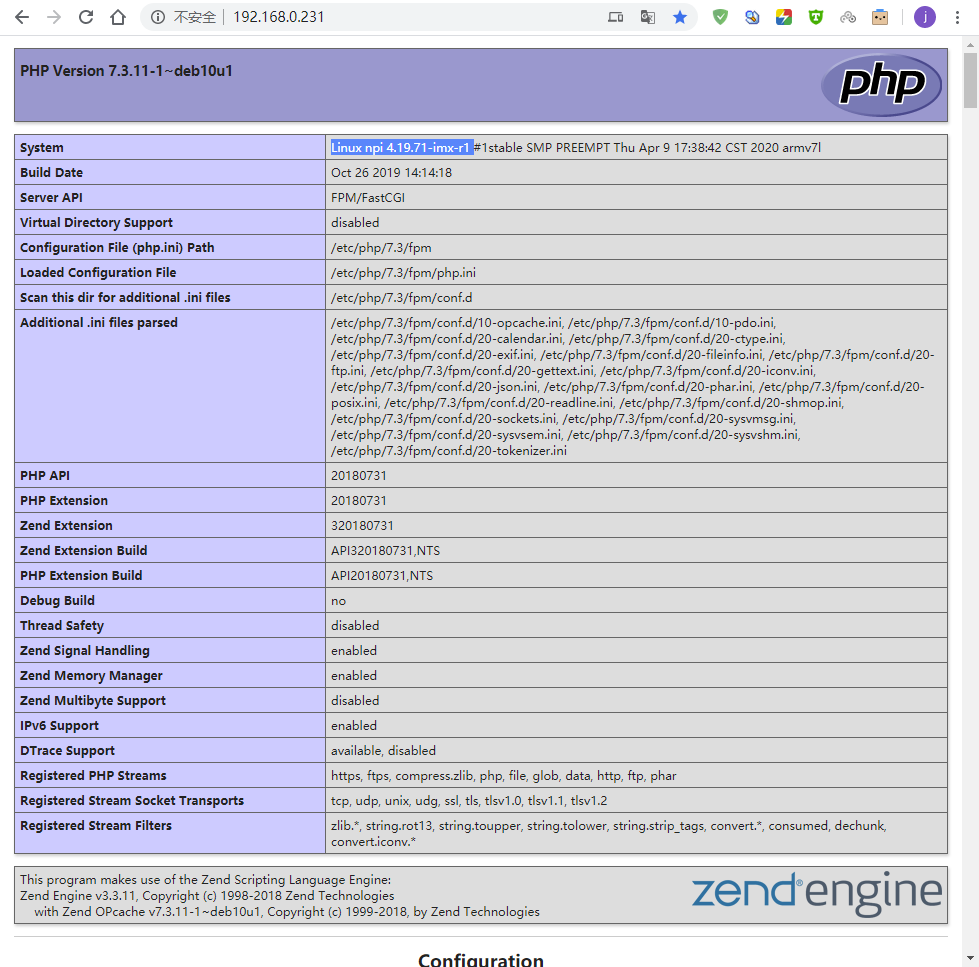

在Debian上部署web服务器
=======================

-  平台：野火imx6ull开发板
-  系统：Debian
-  使用工具：Nginx、PHP

实现在Debian上通过Nginx与PHP搭建Web服务器，验证Nginx与PHP可以在开发板上使用。

Nginx
-----

Nginx是一个高性能的HTTP和反向代理web服务器，同时也提供了IMAP/POP3/SMTP服务。它具有非常好的稳定性，拥有丰富的功能集，以及对系统资源的消耗极低。

PHP
---

PHP即
“超文本预处理器”，是一种通用开源脚本语言。PHP是在服务器端执行的脚本语言，与C语言类似，是常用的网站编程语言。PHP独特的语法混合了C、Java、Perl以及
PHP 自创的语法，利于学习，使用广泛，主要适用于Web开发领域。

安装
----

更新软件源
~~~~~~~~~~

此步骤不一定是要做的，如果你是新刷的系统，那么就需要更新一下，如果你在之前的操作都更新过了，那么这也不需要去更新它。

.. code:: bash

    sudo apt-get update
    sudo apt-get upgrade

安装Nginx
~~~~~~~~~

.. code:: bash

    sudo apt-get -y install nginx

安装PHP
~~~~~~~

此处安装的版本是7.3版本。

.. code:: bash

    sudo apt-get -y install php7.3-fpm

启动Nginx
---------

在安装完成后可以去启动它。

.. code:: bash

    sudo systemctl start nginx

配置Nginx使用PHP
----------------

``/etc/nginx/sites-enabled/default`` 文件是Nginx的配置文件，在安装完成后就已经存在的，并且有默认的配置，而且PHP相关的配置也是默认在里面的，只不过被注释了，只需要打开即可：

.. code:: bash

    sudo nano /etc/nginx/sites-enabled/default

配置完成的代码如下，如果不知道改哪一句，就直接复制粘贴过去替换掉就好了：

.. code:: bash

    server {
        listen 80 default_server;
        listen [::]:80 default_server;

        # SSL configuration
        #
        # listen 443 ssl default_server;
        # listen [::]:443 ssl default_server;
        #
        # Note: You should disable gzip for SSL traffic.
        # See: https://bugs.debian.org/773332
        #
        # Read up on ssl_ciphers to ensure a secure configuration.
        # See: https://bugs.debian.org/765782
        #
        # Self signed certs generated by the ssl-cert package
        # Don't use them in a production server!
        #
        # include snippets/snakeoil.conf;

        root /var/www/html;

        # Add index.php to the list if you are using PHP
        index index.html index.htm index.nginx-debian.html;

        server_name _;

        location / {
            # First attempt to serve request as file, then
            # as directory, then fall back to displaying a 404.
            #try_files $uri $uri/ =404;
            try_files $uri /index.php$is_args$args;
        }

        # pass PHP scripts to FastCGI server
        # 主要修改这下面的代码
        #
        location ~ \.php$ {
            include snippets/fastcgi-php.conf;
        #
        #   # With php-fpm (or other unix sockets):
            fastcgi_pass unix:/run/php/php7.3-fpm.sock;
        #   # With php-cgi (or other tcp sockets):
        #   fastcgi_pass 127.0.0.1:9000;
        }

        # deny access to .htaccess files, if Apache's document root
        # concurs with nginx's one
        #
        location ~ /\.ht {
            deny all;
        }
    }

创建index.php
-------------

简单编写一个PHP文件，放在 ``/var/www/html/`` 目录下，这个目录是Nginx部署的的网站默认路径，通过Nginx的配置文件可以修改成其他目录，但每次修改配置后都要重新加载Nginx。

index.php文件内容如下：

.. code:: php

    <?php
        phpinfo();
    ?>

它主要是调用了 ``phpinfo()`` 这个函数，它会列举出来很多有关自己系统的有用信息，例如系统相关的属性、名称、预定义变量、已经加载的
PHP 模块和配置信息。

重新加载Nginx
-------------

每次修改配置后都要重新加载Nginx，才能生效，如果配置文件的配置不正确，或者语法出现错误，则会加载失败，就需要去检查配置文件的代码是否正确。

.. code:: bash

    sudo systemctl reload nginx

访问web服务器
-------------

首先开发板要插入网线或者连接到wifi，使用 ``ifconfig`` 命令查看开发板当前的IP地址，比如我的IP地址就是 ``192.168.0.231`` 。

.. code:: bash

    ifconfig

    eth1: flags=4163<UP,BROADCAST,RUNNING,MULTICAST>  mtu 1500
            inet 192.168.0.231  netmask 255.255.255.0  broadcast 192.168.0.255
            inet6 fe80::8813:d1ff:fec4:d5b6  prefixlen 64  scopeid 0x20<link>
            ether 8a:13:d1:c4:d5:b6  txqueuelen 1000  (Ethernet)
            RX packets 2820772  bytes 271315620 (258.7 MiB)
            RX errors 1  dropped 0  overruns 0  frame 1
            TX packets 372530  bytes 75563693 (72.0 MiB)
            TX errors 0  dropped 0 overruns 0  carrier 0  collisions 0

打开浏览器，输入你自己的IP地址 ``192.168.0.231`` ，然后回车，就可以看到一个网页了，这里面显示的就是我们的web服务器的内容，比如开发板的系统、名字、PHP相关的信息等：

   using_php001

