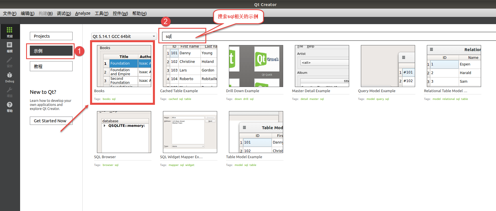
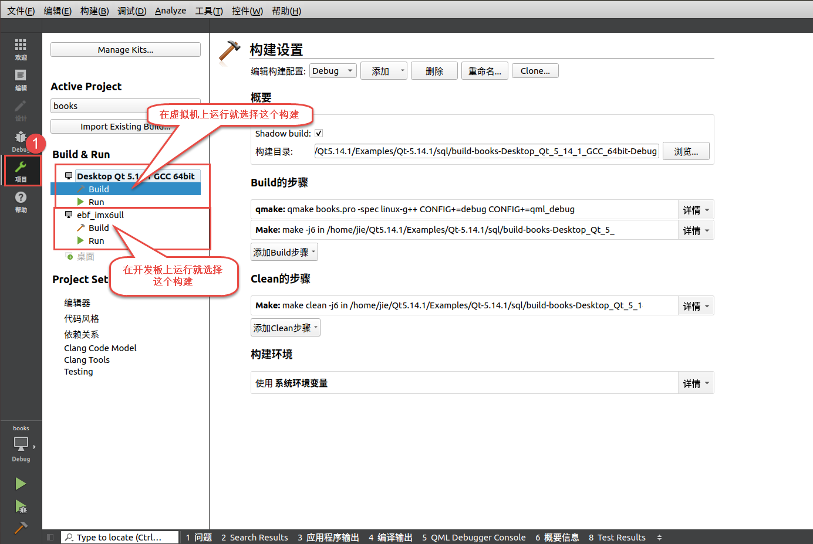
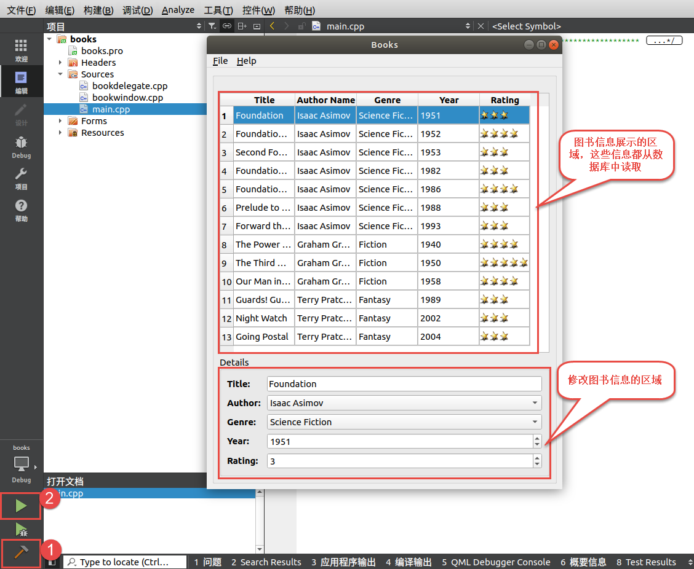
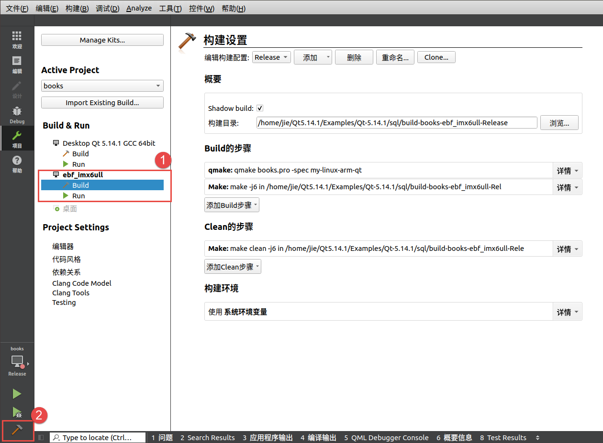
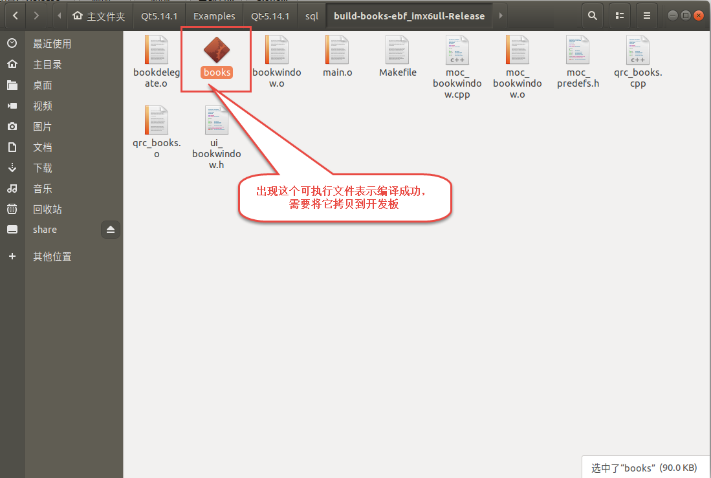

Qt使用SQLite
============

-  平台：野火imx6ull开发板
-  系统：Debian
-  Qt的SQLite插件：libqt5sql5

在上一章节的时候我们简单说了Debian开发板使用SQLite相关的内容，而且Qt中还是会使用到SQLite作为数据库的，在qt里面称之为sql。

我们简单说说在Debian开发板上，Qt使用SQLite。

在虚拟机上运行demo
------------------

如果你没有搭建好Qt的交叉编译环境，那么请参考
`Qt交叉编译环境搭建 <https://tutorial.linux.doc.embedfire.com/zh_CN/latest/linux_env/qt_cross_compiling.html>`__

搭建好Qt的交叉编译环境后，打开qt
creator，选择一个sql相关的demo，这里面的demo有很多，我们选择books这个demo，

这个Books示例展示了如何将Qt的SQL类与模型/视图框架一起使用，以创建丰富的用户界面来存储数据库中的信息。

   using_qtsql001
首先我们先在虚拟机上测试能否正常运行，选择对应的构建套件：

   using_qtsql002
在选择完毕后，点击构建，编译是不会出错的，因为这是qt官方的demo，接着点击运行按钮，此时在虚拟机上出现了books这个应用程序的界面，它的上半部分是数据的显示区域，它主要是从数据库中读取数据并显示出来，下半部分则是数据修改的区域。

有关书籍集合的信息保存在数据库中，这些书按作者、标题、体裁和出版年份分类，所有的书籍使用系统分配评级，每本系统都被分配星级。
一本书的星星越多，它的评级越好。完美可以通过手动去修改这些数据，然后显示出来。

   using_qtsql003
编译开发板上运行的demo
----------------------

既然在虚拟机上运行这个demo通过了，我们可以在开发板上运行它，首先选择在开发板上的构建套件，然后编译：

   using_qtsql004
在编译完成后，可以打开这个demo对应的目录，可以看到一个books可执行文件：

   using_qtsql005
通过file命令去查看它的文件类型，它是32位的：

.. code:: bash

    file books

    books: ELF 32-bit LSB executable, ARM, EABI5 version 1 (SYSV), dynamically linked, interpreter /lib/ld-, for GNU/Linux 3.2.0, with debug_info, not stripped

开发板的环境处理
----------------

首先要使用已经发布的Debian系统，可以选择纯净版的Debian镜像 ``Debian Buster Lite`` ，也可以选择动态版本的Qt镜像 ``Full Feature QT_App`` ，但是注意 **不要选择其他版本** 。

Debian Buster Lite版本
~~~~~~~~~~~~~~~~~~~~~~

如果你选择的是纯净版的Debian镜像 ``Debian Buster Lite`` ，我们要安装动态版本的qt-app，直接使用以下指令安装即可：

.. code:: bash

    sudo apt-get install qt-app

安装Qt的sql插件：

.. code:: bash

    sudo apt-get -y install libqt5sql5

如果没有发现 ``qt-app`` 安装包，可以使用以下命令更新一下apt命令的软件包缓存再安装：

.. code:: bash

    sudo apt-get update

在安装完成后，可以发现 ``/home/debian`` 目录下多了qt-app文件夹，这里就是我们出厂提供的Qt应用程序，可以直接使用以下命令运行它，野火提供了run.sh运行Qt应用程序的脚本，这样子就不需要我们配置环境变量：

.. code:: bash

    # 进入qt-app目录
    cd qt-app

    # 运行
    sudo ./run.sh

如果能成功运行，则可以 **将我们编译例程的可执行文件books放到qt-app目录下** ，然后编辑run.sh脚本，主要是修改脚本中的最后一行，将运行官方的App改为自己的Qt例程books。（编辑可以使用nano编辑器进行编辑）

.. code:: bash

    #! /bin/sh

    type devscan

    if [ $? -eq 0 ]; then
        eventx=$(devscan "goodix-ts")
        echo "eventx=$eventx"
        if [ ! -f "/etc/pointercal" ]; then
            type devscan
            if [ $? -eq 0 ]; then
                ts_calibrate
            fi
        fi
    else
        echo "please install devscan"
        echo
        echo "sudo apt-get install devscan"
        exit
    fi

    export APP_DIR=/home/debian/qt-app
    export QT_QPA_PLATFORM_PLUGIN_PATH=/usr/lib/arm-linux-gnueabihf/qt5/plugins/
    export LD_LIBRARY_PATH=$LD_LIBRARY_PATH:$APP_DIR/libskin:$APP_DIR/libqui:$APP_DIR/libffmpeg:/usr/lib:/lib
    export QT_QPA_FONTDIR=/usr/share/fonts/SourceHanSans
    export PATH=$PATH:$QT_DIR/libexec
    export QT_QPA_PLATFORM=linuxfb:fb=/dev/fb0
    export TSLIB_CONFFILE=/etc/ts.conf
    export TSLIB_CALIBFILE=/etc/pointercal
    export QT_QPA_GENERIC_PLUGINS=tslib:/dev/input/$eventx
    export QWS_MOUSE_PROTO=tslib
    export QT_QPA_EVDEV_TOUCHSCREEN_PARAMETERS=/dev/input/$eventx:rotate=180:invertx

    # start app...
    # $APP_DIR/App

    # 这里是要运行的Qt程序
    $APP_DIR/books

保存并且运行：

.. code:: bash

    # 运行
    sudo ./run.sh

此时我们的开发板上运行的就是Qt的例程，效果如下：

.. figure:: media/using_qtsql006.png
   :alt: using_qtsql006

   using_qtsql006
Full Feature QT_App版本
~~~~~~~~~~~~~~~~~~~~~~~~

而如果你选择的是动态版本的Qt镜像 ``Full Feature QT_App`` ，则无需安装qt-app，因为在系统中就已经存在了qt相关的环境，并且在 ``/home/debian`` 路径下就也存在了qt-app应用程序。

需要安装Qt的sql插件：

.. code:: bash

    sudo apt-get -y install libqt5sql5

如果不能安装成功，可以使用以下命令更新一下apt命令的软件包缓存再安装：

.. code:: bash

    sudo apt-get update

**将我们编译例程的可执行文件books放到qt-app目录下** ，然后编辑run.sh脚本，主要是修改脚本中的最后一行，将运行官方的App改为自己的Qt例程books。（编辑可以使用nano编辑器进行编辑）

.. code:: bash

    #! /bin/sh

    type devscan

    if [ $? -eq 0 ]; then
        eventx=$(devscan "goodix-ts")
        echo "eventx=$eventx"
        if [ ! -f "/etc/pointercal" ]; then
            type devscan
            if [ $? -eq 0 ]; then
                ts_calibrate
            fi
        fi
    else
        echo "please install devscan"
        echo
        echo "sudo apt-get install devscan"
        exit
    fi

    export APP_DIR=/home/debian/qt-app
    export QT_QPA_PLATFORM_PLUGIN_PATH=/usr/lib/arm-linux-gnueabihf/qt5/plugins/
    export LD_LIBRARY_PATH=$LD_LIBRARY_PATH:$APP_DIR/libskin:$APP_DIR/libqui:$APP_DIR/libffmpeg:/usr/lib:/lib
    export QT_QPA_FONTDIR=/usr/share/fonts/SourceHanSans
    export PATH=$PATH:$QT_DIR/libexec
    export QT_QPA_PLATFORM=linuxfb:fb=/dev/fb0
    export TSLIB_CONFFILE=/etc/ts.conf
    export TSLIB_CALIBFILE=/etc/pointercal
    export QT_QPA_GENERIC_PLUGINS=tslib:/dev/input/$eventx
    export QWS_MOUSE_PROTO=tslib
    export QT_QPA_EVDEV_TOUCHSCREEN_PARAMETERS=/dev/input/$eventx:rotate=180:invertx

    # start app...
    # $APP_DIR/App

    # 这里是要运行的Qt程序
    $APP_DIR/books

保存并且运行：

.. code:: bash

    # 运行
    sudo ./run.sh

效果也是一样的。

.. figure:: media/using_qtsql006.png
   :alt: using_qtsql006

   using_qtsql006

