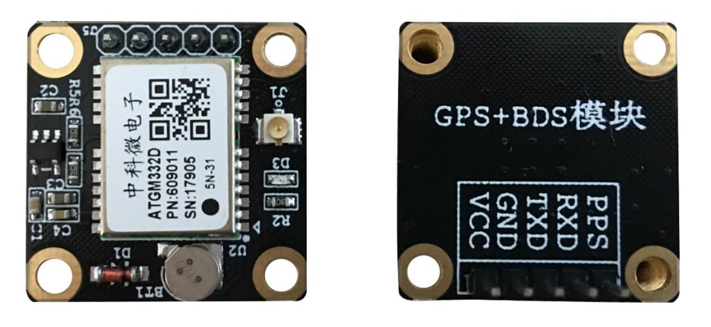
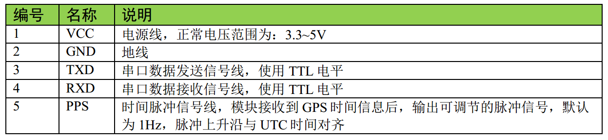
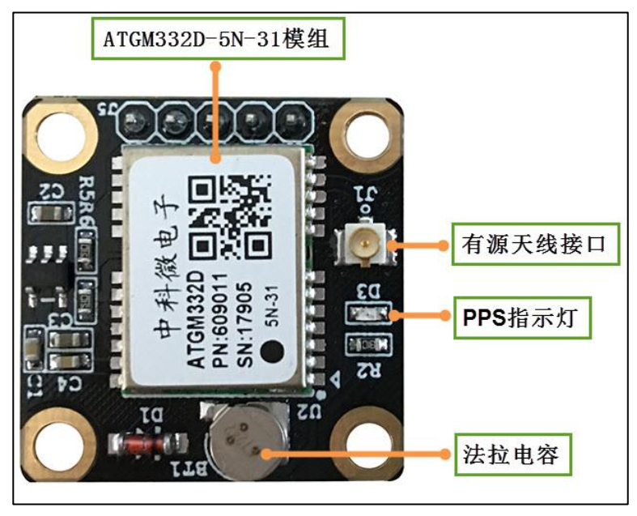
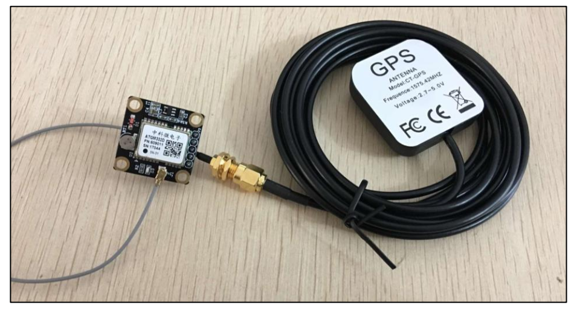
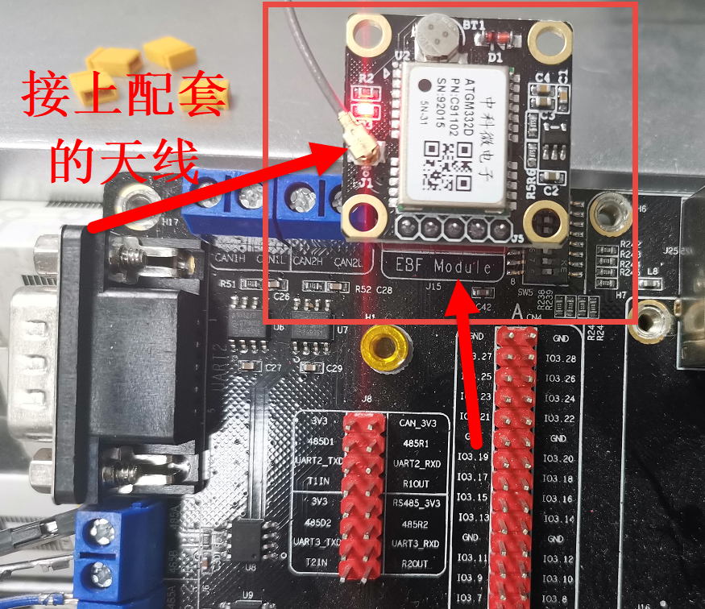
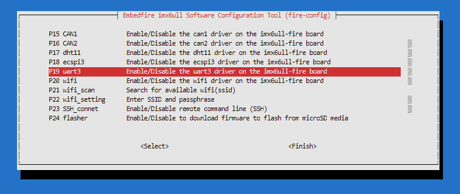
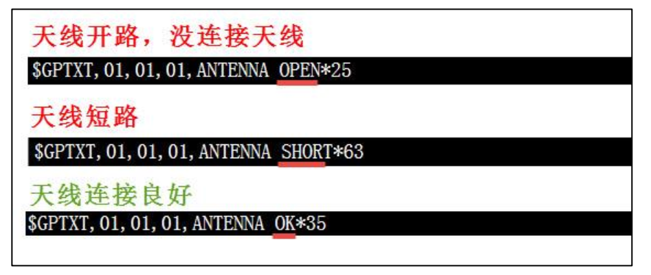
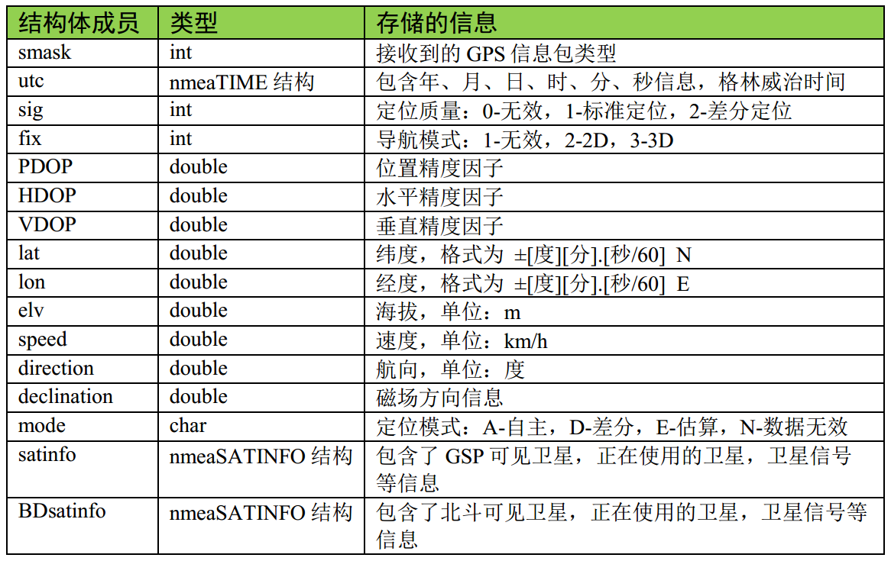

Debian使用BH-ATGM332D
=====================

本章旨在帮助用户正确构建 BH-ATGM332D
模块的使用环境，引导用户快速使用该模块。

BH-ATGM332D 简介
----------------

BH-ATGM332D 是野火设计的高性能、低功耗 GPS、
北斗双模定位模块。它采用中科微电子公司的 ATGM332D-5N-31
模组方案，可以通过串口向单片机系统和电脑输出 GPS
及北斗定位信息，使用简单方便，其外观见图。

   ATGM332D001

BH-ATGM332D 模块引脚说明如下：

   ATGM332D002

BH-ATGM332D 模块的资源如下：

   ATGM332D003

BH-ATGM332D 模块及其配套的有源天线如下：

   ATGM332D004

测试 BH-ATGM332D
----------------

硬件接线
~~~~~~~~

BH-ATGM332D
模块的硬件资源介绍完毕了，可以在Debian上使用它，我们开发板的左上角有预留了EBF
Module 模块接口，直接将 BH-ATGM332D
插在模块接口上即可（需要注意引脚位置）。

如图所示：

   ATGM332D005

fire-config打开USART3
~~~~~~~~~~~~~~~~~~~~~

1. 我们要验证一下我们板子上的串口3是可以正常工作的，运行以下命令，在fire-config工具打开串口3设备。

.. code:: bash

    sudo fire-config

   ATGM332D006

2. 重启开发板。

3. 重启之后查看dev目录下是否存在串口3设备：

.. code:: bash

    ls /dev/ttymxc2

当存在/dev/ttymxc2的时候表示已经打开串口3设备。

验证模块是否工作
~~~~~~~~~~~~~~~~

实现要验证模块是否工作了，我们在将模块插入开发板的 EBF Module
模块接口后，BH-ATGM332D
模块的LED灯会闪烁，如果没有则检查是否正常供电了。

然后在linux的终端中运行以下命令：

.. code:: bash

    cat /dev/ttymxc2

输出了以下内容则表示模块正常工作：

.. code:: bash

    $GPTXT,01,01,01,ANTENNA OK*35

    $GNGGA,034101.000,2253.72536,N,11350.70190,E,1,22,0.7,48.8,M,0.0,M,,*4C

    $GNGLL,2253.72536,N,11350.70190,E,034101.000,A,A*4A

    $GPGSA,A,3,01,04,07,08,09,11,16,22,27,30,33,34,1.1,0.7,0.8*38

    $BDGSA,A,3,03,06,08,10,11,12,13,16,,,,,1.1,0.7,0.8*26

    $GPGSV,4,1,16,01,60,154,43,04,12,190,23,07,63,308,21,08,41,026,20*74

    $GPGSV,4,2,16,09,21,224,15,11,75,044,31,16,12,089,21,17,09,242,*7F

    $GPGSV,4,3,16,22,12,139,16,23,,,16,27,13,044,24,28,09,300,*41

    $GPGSV,4,4,16,30,30,318,23,33,12,150,13,34,64,095,39,35,63,049,35*7B

    $BDGSV,2,1,08,03,62,188,37,06,19,189,20,08,55,161,37,10,52,337,21*65

    $BDGSV,2,2,08,11,70,264,18,12,46,028,21,13,35,187,38,16,21,195,39*64

    $GNRMC,034101.000,A,2253.72536,N,11350.70190,E,0.00,315.42,220520,,,A*7B

    $GNVTG,315.42,T,,M,0.00,N,0.00,K,A*22

    $GNZDA,034101.000,22,05,2020,00,00*4A

注意看输入的内容 “$GPTXT,01,01,01,ANTENNA OK\*35”
，它表示模块正常运行，当然也可能是其他情况，比如：

   ATGM332D007

图中的三种状态分别为开路（OPEN） 、 SHORT（短路） 及 OK（正常） ，
测试时请确保天线处于 OK 状态

注意：如果模块上电后输出的数据长期处于第一种状态（天线开路或者没连接天线），则应考虑转移一下定位模块天线的位置，一般在室内卫星信号会比较差，可到室外空旷的地方测试(如楼顶、阳台、窗边)。

NMEA-0183
---------

NMEA-0183 协议简介
~~~~~~~~~~~~~~~~~~

BH-ATGM332D 模块通过 TTL 串口输出定位数据信息，这些信息默认采用
NMEA-0183 4.0 协议， 输出的信息如前面的日志所示。

NMEA 是美国国家海洋电子协会（National Marine Electronics Association
）为海用电子设备制定的标准格式，目前已经成为了 GPS 导航设备统一的 RTCM
标准协议， 本模块使用的 NMEA 4.0 版本协议支持
GPS、北斗、海格纳斯等定位系统。NMEA-0183
是一套定义接收机输出的标准信息，有几种不同的格式，每种都是独立相关的
ASCII 格式， 使用逗号隔开数据，数据流长度从 30-100
字符不等，通常以每秒间隔选择输出，最常用的格式为"GGA"，它包含了定位时间，纬度，经度，高度，定位所用的卫星数，
DOP 值， 差分状态和校正时段等，其他的有速度，跟踪，日期等。 NMEA
实际上已成为所有的定位接收机中最通用的数据输出格式。

NMEA 解码库
~~~~~~~~~~~

了解了 NMEA 格式有之后，我们就可以编写相应的解码程序了，而程序员
Tim(xtimor@gmail.com)提供了一个非常完善的 NMEA
解码库，在以下网址可以下载到：http://nmea.sourceforge.net/
，直接使用该解码库，可以避免重复发明轮子的工作。 在野火提供的 GPS
模块资料的“NMEA0183 解码库源码”文件夹中也包含了该解码库的源码，
野火提供的 STM32 程序就是使用该库来解码 NMEA 语句的。

该解码库目前最新为 0.5.3 版本，它使用纯 C 语言编写，支持 windows、 winCE
、UNIX 平台，支持解析 GPGGA， GPGSA,GPGSV,GPRMC,GPVTG
这五种语句(这五种语句已经提供足够多的 GPS 信息)，解析得的 GPS
数据信息以结构体存储，附加了地理学相关功能，可支持导航等数据工作，除了解析
NMEA 语句，它还可以根据随机数产生 NMEA语句，方便模拟。 在该解码库之上，
野火扩展了其对 NMEA-0183 4.0 版本的支持。

在 Debian 上使用 BH-ATGM332D 模块
---------------------------------

更新软件源
~~~~~~~~~~

为了确保我们的软件包版本是最新版本，让我们使用apt命令更新本地apt包索引和升级系统：

.. code:: bahs

    sudo apt-get update

手动安装相关的依赖包
~~~~~~~~~~~~~~~~~~~~

首先安装git make相关的依赖

.. code:: bash

    sudo apt-get -y install git make

.. code:: bash

    sudo apt-get -y install make

拉取 nmealib 仓库
~~~~~~~~~~~~~~~~~

nmealib 仓库已经发布在github与gitee上，野火对改库进行了修改，以支持解析
NMEA-0183 4.0 协议，

在github拉取 nmealib 仓库

.. code:: bash

    git clone https://github.com/Embedfire/nmealib.git

当然也可以从野火的gitee仓库拉取。

.. code:: bash

    git clone https://gitee.com/Embedfire/nmealib.git

示例
~~~~

野火发布的 nmealib
仓库已经提供了相关的demo例程，在samples目录下有5个文件夹，分别是：generate
、 generator 、 math 、parse 、
parse_ebf_module。他们都对应不同的例程：

-  generate/generator ：这两个demo是产生随机 NMEA-0183
   标准信息的，可以用来做调试使用。

-  math：数学库，用来将这些 NMEA-0183
   标准信息转换为数学相关的数据，比如经纬度、方位角等。

-  parse：解析 NMEA-0183 标准信息的demo，这些 NMEA-0183
   标准信息信息写在一个数组中。

-  parse_ebf_module ：解析野火北斗定位模块的 NMEA-0183
   标准信息的demo，它通过读取串口3设备得到 BH-ATGM332D
   的数据，然后调用nmealib库去解析它。

编译 & 运行
~~~~~~~~~~~

我们进入nmealib目录下，直接运行make命令去编译：

.. code:: bash

    ➜  nmealib git:(master) ✗ make

    mkdir -p build/nmea_gcc
    gcc  -I include  -c src/generate.c -o build/nmea_gcc/generate.o
    gcc  -I include  -c src/generator.c -o build/nmea_gcc/generator.o
    gcc  -I include  -c src/parse.c -o build/nmea_gcc/parse.o
    gcc  -I include  -c src/parser.c -o build/nmea_gcc/parser.o
    gcc  -I include  -c src/tok.c -o build/nmea_gcc/tok.o
    gcc  -I include  -c src/context.c -o build/nmea_gcc/context.o
    gcc  -I include  -c src/time.c -o build/nmea_gcc/time.o
    gcc  -I include  -c src/info.c -o build/nmea_gcc/info.o
    gcc  -I include  -c src/gmath.c -o build/nmea_gcc/gmath.o
    gcc  -I include  -c src/sentence.c -o build/nmea_gcc/sentence.o
    ar rsc lib/libnmea.a build/nmea_gcc/generate.o build/nmea_gcc/generator.o build/nmea_gcc/parse.o build/nmea_gcc/parser.o build/nmea_gcc/tok.o build/nmea_gcc/context.o build/nmea_gcc/time.o build/nmea_gcc/info.o build/nmea_gcc/gmath.o build/nmea_gcc/sentence.o
    ranlib lib/libnmea.a
    gcc  -I include  -c samples/generate/main.c -o samples/generate/main.o
    gcc  samples/generate/main.o -lm -Llib -lnmea -o build/samples_generate
    gcc  -I include  -c samples/generator/main.c -o samples/generator/main.o
    gcc  samples/generator/main.o -lm -Llib -lnmea -o build/samples_generator
    gcc  -I include  -c samples/parse/main.c -o samples/parse/main.o
    gcc  samples/parse/main.o -lm -Llib -lnmea -o build/samples_parse
    gcc  -I include  -c samples/parse_ebf_module/main.c -o samples/parse_ebf_module/main.o
    gcc  samples/parse_ebf_module/main.o -lm -Llib -lnmea -o build/samples_parse_ebf_module
    gcc  -I include  -c samples/math/main.c -o samples/math/main.o
    gcc  samples/math/main.o -lm -Llib -lnmea -o build/samples_math
    rm samples/math/main.o samples/parse_ebf_module/main.o samples/generator/main.o samples/parse/main.o samples/generate/main.o

可以看到编译生成了libnmea.a库文件，并且将所有的samples都编译了，输出的结果在
build/ 目录下，生成了对应的可执行文件，我们直接运行
build/samples_parse_ebf_module 试一试：

.. code:: bash

    ➜  nmealib git:(master) ✗ ./build/samples_parse_ebf_module

    时间：2020-05-22，14:50:31

    纬度：22.895420,经度113.845100

    海拔高度：49.200000 米 
    速度：0.000000 km/h 
    航向：315.420000 度
    正在使用的GPS卫星：11,可见GPS卫星：15
    正在使用的北斗卫星：11,可见北斗卫星：15
    PDOP：1.400000,HDOP：0.700000，VDOP：1.200000

可以看到已经输出了北斗定位相关的信息。

示例代码
~~~~~~~~

实例的代码比较简单，主要流程是从 串口3
设备读取数据，读取数据的流程基本如下：open打开设备，配置读取信息的参数，如波特率、停止位、校验位等，然后read读取数据，缓存到一个buff中；然后调用
nmea_parse() 函数去解析数据，并将其打印出来。

.. code:: c

    #include <nmea/nmea.h>

    #include <string.h>
    #include <stdio.h>
    #include <unistd.h>
    #include <sys/types.h>
    #include <sys/stat.h>
    #include <fcntl.h>
    #include <stdlib.h>
    #include <stdint.h>
    #include <termios.h>
    #include <sys/ioctl.h>

    void GMTconvert(nmeaTIME *SourceTime, nmeaTIME *ConvertTime, uint8_t GMT,uint8_t AREA);

    void error(const char *str, int str_size)
    {
        printf("Error: ");
        write(1, str, str_size);
        printf("\n");
    }

    int main()
    {
        int fd;
        int len;

        nmeaINFO info;
        nmeaPARSER parser;
        nmeaTIME beiJingTime;    //北京时间
        double deg_lat;//转换成[degree].[degree]格式的纬度
        double deg_lon;//转换成[degree].[degree]格式的经度

        char tmp_buf[200];
        char buff[4096];

        int size, it = 0;
        nmeaPOS dpos;

        fd = open("/dev/ttymxc2", O_RDONLY);

        printf("fopen %d\n", fd);

        if(!fd)
            return -1;

        // nmea_property()->trace_func = &trace;
        nmea_property()->error_func = &error;

        nmea_zero_INFO(&info);
        nmea_parser_init(&parser);

        struct termios opt;

        //清空串口接收缓冲区
        tcflush(fd, TCIOFLUSH);
        // 获取串口参数opt
        tcgetattr(fd, &opt);

        //设置串口输出波特率
        cfsetospeed(&opt, B9600);
        //设置串口输入波特率
        cfsetispeed(&opt, B9600);
        //设置数据位数
        opt.c_cflag &= ~CSIZE;
        opt.c_cflag |= CS8;
        //校验位
        opt.c_cflag &= ~PARENB;
        opt.c_iflag &= ~INPCK;
        //设置停止位
        opt.c_cflag &= ~CSTOPB;

        //更新配置
        tcsetattr(fd, TCSANOW, &opt);

        while(1)
        {
            memset(buff, 0, 4096);
            size = 0;
            len = 0;
            nmea_zero_INFO(&info);
            nmea_parser_init(&parser);
            for(it = 0; it < 32; it++) {
                memset(tmp_buf, 0, 100);
                size = (int)read(fd, tmp_buf, 100);
                if (size > 1) {
                    memcpy(buff + len, tmp_buf, size);
                    len += size;
                    memcpy(buff + len - 1, "\r\n", 2);
                    len += 1;
                }
                
            }

            nmea_parse(&parser, buff, len, &info);

             // info.lat lon中的格式为[degree][min].[sec/60]，使用以下函数转换成[degree].[degree]格式
            deg_lat = nmea_ndeg2degree(info.lat);
            deg_lon = nmea_ndeg2degree(info.lon);

            GMTconvert(&info.utc,&beiJingTime,8,1);

            // // /* 输出解码得到的信息 */
            printf("\r\n时间：%d-%02d-%02d，%d:%d:%d\r\n", beiJingTime.year+1900, beiJingTime.mon,beiJingTime.day,beiJingTime.hour,beiJingTime.min,beiJingTime.sec);

            printf("\r\n纬度：%f,经度%f\r\n",deg_lat,deg_lon);
            printf("\r\n海拔高度：%f 米 ", info.elv);
            printf("\r\n速度：%f km/h ", info.speed);
            printf("\r\n航向：%f 度", info.direction);
            
            printf("\r\n正在使用的GPS卫星：%d,可见GPS卫星：%d",info.satinfo.inuse,info.satinfo.inview);

            printf("\r\n正在使用的北斗卫星：%d,可见北斗卫星：%d",info.satinfo.inuse,info.satinfo.inview);
            printf("\r\nPDOP：%f,HDOP：%f，VDOP：%f\n",info.PDOP,info.HDOP,info.VDOP);
        }

        nmea_parser_destroy(&parser);
        close(fd);

        return 0;
    }

nmea库的简单介绍
----------------

上面的代码用到了nmea库的很多数据结构，所以要介绍一下相关的知识：

结构体 nmeaPARSER 和 nmeaINFO
~~~~~~~~~~~~~~~~~~~~~~~~~~~~~

上述参数中的 parser 及 info 变量的数据类型 nmeaPARSER 和 nmeaINFO 则是
NMEA解码库特有的数据结构，具体如下：

-  nmeaPARSER

.. code:: c

    typedef struct _nmeaPARSER
    {
        void *top_node;
        void *end_node;
        unsigned char *buffer;
        int buff_size;
        int buff_use;

    } nmeaPARSER;

可以看到， nmeaPARSER 是一个链表，在解码时， NMEA 库会把输入的 GPS
原始数据压入到 nmeaPARSER
结构的链表中，便于对数据管理及解码。在使用该结构前， 需要调用了
nmea_parser_init() 函数分配动态空间，而解码结束时，调用了
nmea_parser_destroy() 函数释放分配的空间。

-  nmeaINFO则是 NMEA
   解码库良好的封装特性使我们无需关注更深入的内部实现，只需要再了解一下nmeaINFO
   数据结构即可，所有 GPS
   解码得到的结果都存储在这个结构中，其结构体定义如下：

.. code:: c

    typedef struct _nmeaINFO
    {
        int     smask;      /**< Mask specifying types of packages from which data have been obtained */

        nmeaTIME utc;       /**< UTC of position */

        int     sig;        /**< GPS quality indicator (0 = Invalid; 1 = Fix; 2 = Differential, 3 = Sensitive) */
        int     fix;        /**< Operating mode, used for navigation (1 = Fix not available; 2 = 2D; 3 = 3D) */

        double  PDOP;       /**< Position Dilution Of Precision */
        double  HDOP;       /**< Horizontal Dilution Of Precision */
        double  VDOP;       /**< Vertical Dilution Of Precision */
       
        double  lat;        /**< Latitude in NDEG - +/-[degree][min].[sec/60] */
        double  lon;        /**< Longitude in NDEG - +/-[degree][min].[sec/60] */
        double  elv;        /**< Antenna altitude above/below mean sea level (geoid) in meters */
        double  sog;        /**< 数值 对地速度，单位为节 */
        double  speed;      /**< Speed over the ground in kilometers/hour */
        double  direction;  /**< Track angle in degrees True */
        double  declination; /**< Magnetic variation degrees (Easterly var. subtracts from true course) */
        char    mode;       /**< 字符 定位模式标志 (A = 自主模式, D = 差分模式, E = 估算模式, N = 数据无效) */
        nmeaSATINFO satinfo; /**< Satellites information */
        nmeaSATINFO BDsatinfo; /**北斗卫星信息*/
            
            int txt_level;
            char *txt;
            
    } nmeaINFO;

这些结构体的说明如下：

   ATGM332D008

在调用了 nmea_parse() 函数解析完成之后，直接查询 nmeaINFO
结构的数据即可得到解码的结果。
