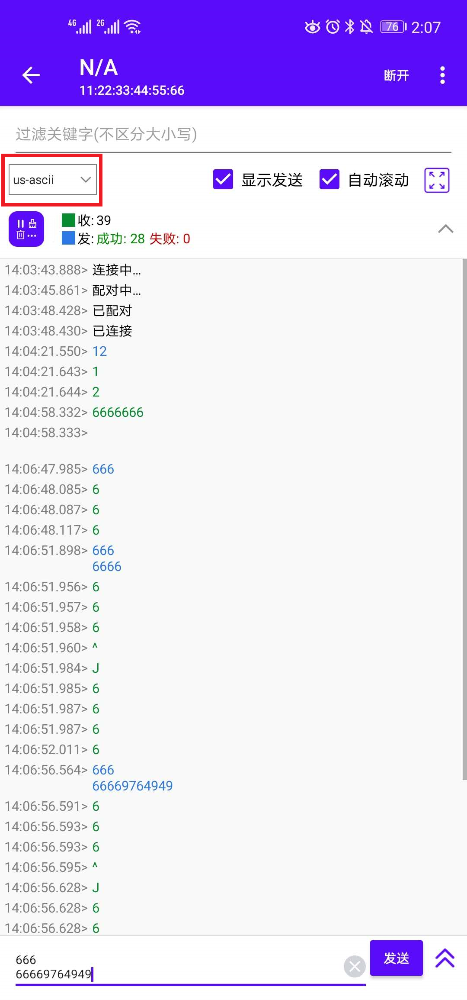
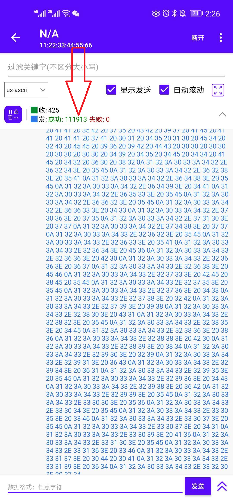

Debian使用蓝牙
==============

本章旨在帮助用户正确使用蓝牙连接音箱，引导用户快速验证相关的功能模块。

-  开发板：野火imx6ull开发板
-  系统版本：Debian系统
-  需要使用的模块/设备：免驱USB蓝牙、蓝牙音箱

注意，此处使用的是\ **免驱USB蓝牙**\ ，注意一定要免驱的，否则开发板识别不了，大家可以自行在淘宝上购买。为什么不使用板载蓝牙呢，因为在测试中发现，蓝牙速率不够，略有卡顿。

开发板本身带有两个音频输出方案：板载外接扬声器和3.5mm耳机接口。而现在各种蓝牙耳机和音箱也越来越多，大多数智能音箱也支持蓝牙连接，将开发板与这些无线音频输出设备进行连接变得流行起来了。本文简单介绍一种方法将蓝牙音箱与开发板连接起来。

方案简介
--------

在进行正式的配置之前，有必要简单介绍一下各个软件包的作用和原理。

ALSA(Advanced Linux Sound
Architechture)是Linux上的主流音频框架，是linux内核的一部分，它是最底层的音频接口，一般只有声卡驱动厂商需要与其对接，普通用户不需要了解这一部分，只要使用即可。后面使用的aplay命令就是ALSA相关的软件包（alsa-utils）提供的。

Bluez是一个linux蓝牙协议栈，简单说就是linux上所有蓝牙相关的底层功能都是由它提供的，没有他蓝牙就无法工作，Bluez主要提供蓝牙基础设施、和最基本的蓝牙管理工具，后面用到的bluetoothctl命令就是Bluez软件包里面的。

PulseAudio是一个跨平台的、可通过网络工作的声音服务，它可以从一个或多个音源（进程或输入设备）接受声音输入
然后重定向声音到一个或多个槽（声卡，远程网络PulseAudio服务，或其他进程），是目前linux环境下的一个主流高级音频解决方案，与ALSA不同的是，PulseAudio不与底层声卡直接打交道（因为这是ALSA的工作），PulseAudio是介于音频播放软件(如omxplayer,
mplayer等)和ALSA之间，它的功能主要集中在与各种音频播放软件对接、多路音频混合、音频转发（到不同的声卡或者网卡）等，有了它我们就能轻松实现给不同的音频源设置不同的音量，音频流媒体等高级功能。

有了这些东西，我们就可以通过它们来使用蓝牙播放音乐了。

前期准备
--------

使用ssh连接开发板
~~~~~~~~~~~~~~~~~

为了更方便后续的其他操作，我们可以通过ssh登陆开发板，这样子就可以打开多个终端，具体的操作参考：\ https://tutorial.linux.doc.embedfire.com/zh_CN/latest/linux_basis/fire-config_brief.html?highlight=ssh#fire-configssh

插入免驱USB蓝牙
~~~~~~~~~~~~~~~

插入\ **免驱USB蓝牙**\ 到开发板的USB接口，然后运行以下命令，可以看到蓝牙插入了：

.. code:: bash

    dmesg

    [  493.457504] usb 1-1.3: new full-speed USB device number 3 using ci_hdrc

如果在dmesg的最后出现了上述内容，那么表示此时开发板已经识别到USB蓝牙设备了，此时可以接下来的后续操作，如果没能识别，则检查USB蓝牙设备是否为免驱的，如果不是免驱的则需要你自己移植驱动了，此处不过多讲解。

当然也可以用hciconfig命令验证，通过hciconif可以查看蓝牙设备的具体信息，此时可以看到系统已经识别到这个是USB蓝牙设备了：

.. code:: bash

    ➜  ~ hciconfig

    hci0:   Type: Primary  Bus: USB
            BD Address: 00:1A:7D:DA:71:13  ACL MTU: 310:10  SCO MTU: 64:8
            UP RUNNING 
            RX bytes:1220 acl:0 sco:0 events:72 errors:0
            TX bytes:2788 acl:0 sco:0 commands:72 errors:0

更新
~~~~

为了确保我们安装的软件包的版本是最新版本，让我们使用apt命令更新本地apt包索引和升级系统：

.. code:: bash

    sudo apt-get update
    sudo apt-get -y upgrade

手动安装相关的依赖包
~~~~~~~~~~~~~~~~~~~~

这些依赖包是这次测试libmodbus必须的，要安装一下。

-  安装蓝牙协议栈相关的软件包。

.. code:: bash

    sudo apt-get -y install bluez

.. code:: bash

    sudo apt-get -y install blueman

-  安装声音服务相关的软件包pulseaudio。

.. code:: bash

    sudo apt-get -y install pulseaudio

.. code:: bash

    sudo apt install pulseaudio-module-bluetooth 

-  安装bluealsa，它是BlueZ与ALSA直接集成的结果。由于BlueZ版本 >=
   5，已删除内置集成，而支持第三方音频应用程序。从现在开始，BlueZ就充当实现蓝牙音频配置文件的音频应用程序和蓝牙音频设备之间的中间件。使用bluealsa可以实现与PulseAudio相同的目标，但依赖性更少，bluealsa在BlueZ中注册了所有已知的蓝牙音频配置文件，因此理论上每个蓝牙设备（具有音频功能）都可以播放音频。由于Debian软件包并没有bluealsa这个软件包，我们只能从官方发布的软件包中去下载，因此安装wget去获取bluealsa\_0.13\_armhf.deb软件包，然后通过dpkg命令去安装它。

.. code:: bash

    sudo apt-get -y install wget

.. code:: bash

    wget https://archive.raspberrypi.org/debian/pool/main/b/bluealsa/bluealsa_0.13_armhf.deb

    sudo dpkg -i bluealsa_0.13_armhf.deb

-  安装alsa工具。

.. code:: bash

    sudo apt-get -y install alsa-utils

上面的软件包安装完成后，将当前用户添加到蓝牙组：

.. code:: bash

    sudo usermod -G bluetooth -a $USER

重启开发板
~~~~~~~~~~

操作完成后，重启开发板。

连接蓝牙音箱
------------

在重启了开发板后，启动蓝牙功能。

.. code:: bash

    sudo hciconfig hci0 up

在进行音频播放前，需要通过bluetoothctl命令搜索到目标蓝牙音频设备，并与其进行配对连接。进入bluetoothctl命令行操作环境，bluetoothctl是一个非常强大的蓝牙工具，通过它可以搜索到周边的蓝牙设备，并与指定的蓝牙设备建立连接、断开连接，直接运行bluetoothctl即可进入它的命令行操作环境。

.. code:: bash

    ➜  ~ bluetoothctl

    Agent registered
    [bluetooth]# power on
    Changing power on succeeded
    [bluetooth]# agent on
    Agent is already registered
    [bluetooth]# default-agent
    Default agent request successful
    [bluetooth]# scan on
    Discovery started
    [CHG] Controller 00:1A:7D:DA:71:13 Discovering: yes
    [NEW] Device F4:60:E2:6D:FF:AB 小米手机
    [NEW] Device 00:BB:C1:3E:40:F7 TS9100 seri
    [NEW] Device E0:DC:FF:F9:DE:4C mi9pro5g
    [NEW] Device F0:13:C3:AB:A4:F3 HUAWEI AM08
    [bluetooth]# connect F0:13:C3:AB:A4:F3 
    Attempting to connect to F0:13:C3:AB:A4:F3
    [CHG] Device F0:13:C3:AB:A4:F3 Connected: yes
    [CHG] Device F0:13:C3:AB:A4:F3 UUIDs: 00001108-0000-1000-8000-00805f9b34fb
    [CHG] Device F0:13:C3:AB:A4:F3 UUIDs: 0000110b-0000-1000-8000-00805f9b34fb
    [CHG] Device F0:13:C3:AB:A4:F3 UUIDs: 0000110c-0000-1000-8000-00805f9b34fb
    [CHG] Device F0:13:C3:AB:A4:F3 UUIDs: 0000110e-0000-1000-8000-00805f9b34fb
    [CHG] Device F0:13:C3:AB:A4:F3 UUIDs: 0000111e-0000-1000-8000-00805f9b34fb
    [CHG] Device F0:13:C3:AB:A4:F3 ServicesResolved: yes
    [CHG] Device F0:13:C3:AB:A4:F3 Paired: yes
    Connection successful
    [HUAWEI AM08]# quit

从上面的内容（看#号后面的），可以看到我只输入了以下的命令，它们分别对应的功能说明如下：

.. code:: bash

    power on        -- 启动蓝牙模块
    agent on        -- 蓝牙模块agent 打开
    default-agent   -- 设置agent为默认模式
    scan on         -- 扫描周边设备

当我们扫描的时候，它会列出当前可用的蓝牙设备，我们只需要使用connect命令去连接它即可，指定连接蓝牙设备的MAC地址，最后可用听到蓝牙音箱提示连接成功，而在bluetoothctl命令行操作环境也可以看到提示连接成功Connection
successful。

.. code:: bash

    # 发现了蓝牙音箱，MAC地址是 F0:13:C3:AB:A4:F3
    [NEW] Device F0:13:C3:AB:A4:F3 HUAWEI AM08

    connect [MAC]   -- 连接指定的MAC地址设备

当然更多的功能也可以在bluetoothctl命令行操作环境通过help去了解到，此处就不一一列举了。

播放音乐
--------

首先在开发板中放入一个音频文件，我就直接通过wget去下载比较方便一点。

.. code:: bash

    wget -O example.wav https://cloud.embedfire.com/software/packages/example.wav

可以看到在下载完成后，当前目录下出现了一个example.wav音频测试文件，我们就播放它即可。

播放音乐的命令如下，F0:13:C3:AB:A4:F3则是指定蓝牙设备的MAC地址，也就是我们前面提到的连接蓝牙设备的MAC地址。

.. code:: bash

    aplay -D bluealsa:SRV=org.bluealsa,DEV=F0:13:C3:AB:A4:F3,PROFILE=a2dp example.wav

此时可以听到蓝牙音箱已经可以播放音乐了。

使用开发板板载蓝牙模块
----------------------

如果你想使用开发板的板载蓝牙模块连接蓝牙耳机去播放音乐的话，可能会有卡顿，这是因为蓝牙模块是使用串口的，速率不高，但也是能实现，而且操作几乎与前文一致，但是为了文章完整性，我依旧将整个过程写下。

手动安装相关的依赖包
~~~~~~~~~~~~~~~~~~~~

这些依赖包是这次测试libmodbus必须的，要安装一下。

-  安装蓝牙协议栈相关的软件包。

.. code:: bash

    sudo apt-get -y install bluez

.. code:: bash

    sudo apt-get -y install blueman

-  安装声音服务相关的软件包pulseaudio。

.. code:: bash

    sudo apt-get -y install pulseaudio

.. code:: bash

    sudo apt install pulseaudio-module-bluetooth 

-  安装bluealsa，它是BlueZ与ALSA直接集成的结果。由于BlueZ版本 >=
   5，已删除内置集成，而支持第三方音频应用程序。从现在开始，BlueZ就充当实现蓝牙音频配置文件的音频应用程序和蓝牙音频设备之间的中间件。使用bluealsa可以实现与PulseAudio相同的目标，但依赖性更少，bluealsa在BlueZ中注册了所有已知的蓝牙音频配置文件，因此理论上每个蓝牙设备（具有音频功能）都可以播放音频。由于Debian软件包并没有bluealsa这个软件包，我们只能从官方发布的软件包中去下载，因此安装wget去获取bluealsa\_0.13\_armhf.deb软件包，然后通过dpkg命令去安装它。

.. code:: bash

    sudo apt-get -y install wget

.. code:: bash

    wget https://archive.raspberrypi.org/debian/pool/main/b/bluealsa/bluealsa_0.13_armhf.deb

    sudo dpkg -i bluealsa_0.13_armhf.deb

-  安装alsa工具。

.. code:: bash

    sudo apt-get -y install alsa-utils

上面的软件包安装完成后，将当前用户添加到蓝牙组：

.. code:: bash

    sudo usermod -G bluetooth -a $USER

加载uart2、btwifi设备树插件
~~~~~~~~~~~~~~~~~~~~~~~~~~~

首先使用nano编辑器修改/boot/uEnv.txt文件，打开imx-fire-uart2-overlay.dtbo与imx-fire-btwifi-overlay.dtbo设备树插件：

.. code:: bash

    sudo nano /boot/uEnv.txt

    # 把下列语句前的 '#' 号去掉即可，'#' 号是注释
    dtoverlay=/lib/firmware/imx-fire-uart2-overlay.dtbo
    dtoverlay=/lib/firmware/imx-fire-btwifi-overlay.dtbo

操作完成后，重启开发板。

蓝牙复位引脚拉高
~~~~~~~~~~~~~~~~

下面这两句命令需要切换到root用户，才有权限运行，root用户的密码是：root

.. code:: bash

    su root

.. code:: bash

    sudo echo 507 > /sys/class/gpio/export
    sudo echo 1 > /sys/class/gpio/gpio507/value

运行完毕后，切换回debian用户。

.. code:: bash

    su debian

烧录蓝牙固件
~~~~~~~~~~~~

.. code:: bash

    sudo ./brcm_patchram_plus -d --enable_hci --no2bytes --tosleep 200000 --use_baudrate_for_download --baudrate 230400 --bd_addr "11:22:33:44:55:66" --patchram /lib/firmware/bcm/AP6236/BT/BCM4343B0.hcd /dev/ttymxc1 &

注意：配置成功时，可以看到终端会打印

.. code:: bash

    Done setting line discpline

不成功时，请执行

.. code:: bash

    kill $!

再重复以上烧录命令。

关闭低功耗
~~~~~~~~~~

.. code:: bash

    rfkill list

查看蓝牙信息
~~~~~~~~~~~~

此时已经出现蓝牙设备的信息了。

.. code:: bash

    ➜  debian hciconfig -a
    hci0:   Type: Primary  Bus: UART
            BD Address: 11:22:33:44:55:66  ACL MTU: 1021:7  SCO MTU: 64:1
            UP RUNNING PSCAN 
            RX bytes:842 acl:0 sco:0 events:57 errors:0
            TX bytes:3018 acl:0 sco:0 commands:57 errors:0
            Features: 0xbf 0xfe 0xcf 0xfe 0xdb 0xff 0x7b 0x87
            Packet type: DM1 DM3 DM5 DH1 DH3 DH5 HV1 HV2 HV3 
            Link policy: RSWITCH SNIFF 
            Link mode: SLAVE ACCEPT 
            Name: 'npi'
            Class: 0x480000
            Service Classes: Capturing, Telephony
            Device Class: Miscellaneous, 
            HCI Version: 4.2 (0x8)  Revision: 0x4d
            LMP Version: 4.2 (0x8)  Subversion: 0x410c
            Manufacturer: Broadcom Corporation (15)

启动蓝牙
~~~~~~~~

.. code:: bash

    sudo hciconfig hci0 up

将蓝牙连接蓝牙音箱
~~~~~~~~~~~~~~~~~~

在进行音频播放前，需要通过bluetoothctl命令搜索到目标蓝牙音频设备，并与其进行配对连接。进入bluetoothctl命令行操作环境，bluetoothctl是一个非常强大的蓝牙工具，通过它可以搜索到周边的蓝牙设备，并与指定的蓝牙设备建立连接、断开连接，直接运行bluetoothctl即可进入它的命令行操作环境。

.. code:: bash

    ➜  ~ bluetoothctl

    Agent registered
    [bluetooth]# power on
    Changing power on succeeded
    [bluetooth]# agent on
    Agent is already registered
    [bluetooth]# default-agent
    Default agent request successful
    [bluetooth]# scan on
    Discovery started
    [CHG] Controller 00:1A:7D:DA:71:13 Discovering: yes
    [NEW] Device F4:60:E2:6D:FF:AB 小米手机
    [NEW] Device 00:BB:C1:3E:40:F7 TS9100 seri
    [NEW] Device E0:DC:FF:F9:DE:4C mi9pro5g
    [NEW] Device F0:13:C3:AB:A4:F3 HUAWEI AM08
    [bluetooth]# connect F0:13:C3:AB:A4:F3 
    Attempting to connect to F0:13:C3:AB:A4:F3
    [CHG] Device F0:13:C3:AB:A4:F3 Connected: yes
    [CHG] Device F0:13:C3:AB:A4:F3 UUIDs: 00001108-0000-1000-8000-00805f9b34fb
    [CHG] Device F0:13:C3:AB:A4:F3 UUIDs: 0000110b-0000-1000-8000-00805f9b34fb
    [CHG] Device F0:13:C3:AB:A4:F3 UUIDs: 0000110c-0000-1000-8000-00805f9b34fb
    [CHG] Device F0:13:C3:AB:A4:F3 UUIDs: 0000110e-0000-1000-8000-00805f9b34fb
    [CHG] Device F0:13:C3:AB:A4:F3 UUIDs: 0000111e-0000-1000-8000-00805f9b34fb
    [CHG] Device F0:13:C3:AB:A4:F3 ServicesResolved: yes
    [CHG] Device F0:13:C3:AB:A4:F3 Paired: yes
    Connection successful
    [HUAWEI AM08]# quit

从上面的内容（看#号后面的），可以看到我只输入了以下的命令，它们分别对应的功能说明如下：

.. code:: bash

    power on        -- 启动蓝牙模块
    agent on        -- 蓝牙模块agent 打开
    default-agent   -- 设置agent为默认模式
    scan on         -- 扫描周边设备

当我们扫描的时候，它会列出当前可用的蓝牙设备，我们只需要使用connect命令去连接它即可，指定连接蓝牙设备的MAC地址，最后可用听到蓝牙音箱提示连接成功，而在bluetoothctl命令行操作环境也可以看到提示连接成功Connection
successful。

.. code:: bash

    # 发现了蓝牙音箱，MAC地址是 F0:13:C3:AB:A4:F3
    [NEW] Device F0:13:C3:AB:A4:F3 HUAWEI AM08

    connect [MAC]   -- 连接指定的MAC地址设备

当然更多的功能也可以在bluetoothctl命令行操作环境通过help去了解到，此处就不一一列举了。

播放音乐
--------

首先在开发板中放入一个测试音频文件，我就直接通过wget去下载比较方便一点。

.. code:: bash

    wget -O example.wav https://cloud.embedfire.com/software/packages/example.wav

可以看到在下载完成后，当前目录下出现了一个example.wav音频测试文件，我们就播放它即可。

播放音乐的命令如下，F0:13:C3:AB:A4:F3则是指定蓝牙设备的MAC地址，也就是我们前面提到的连接蓝牙设备的MAC地址。

.. code:: bash

    aplay -D bluealsa:SRV=org.bluealsa,DEV=F0:13:C3:AB:A4:F3,PROFILE=a2dp example.wav

此时可以听到蓝牙音箱已经可以播放音乐了，但是略有卡顿，本章的介绍就到此结束。

使用蓝牙作为从机
----------------

前面的操作我们已经知道如何打开蓝牙设备了，无论是USB免驱蓝牙还是板载蓝牙，都是差不多的，但是为了实验的完整性，我依然将所有步骤都写上，如果此时存在蓝牙设备，那么它可以作为蓝牙从机，等待手机或者其他设备连接。

为了避免蓝牙已经被使用了，我们重启开发板（如果你没有进行前面的实验，就不需要重启）。

加载uart2、btwifi设备树插件
~~~~~~~~~~~~~~~~~~~~~~~~~~~

首先使用nano编辑器修改/boot/uEnv.txt文件，打开imx-fire-uart2-overlay.dtbo与imx-fire-btwifi-overlay.dtbo设备树插件：

.. code:: bash

    sudo nano /boot/uEnv.txt

    # 把下列语句前的 '#' 号去掉即可，'#' 号是注释
    dtoverlay=/lib/firmware/imx-fire-uart2-overlay.dtbo
    dtoverlay=/lib/firmware/imx-fire-btwifi-overlay.dtbo

操作完成后，重启开发板。

蓝牙复位引脚拉高
~~~~~~~~~~~~~~~~

下面这两句命令需要切换到root用户，才有权限运行，root用户的密码是：root

.. code:: bash

    su root

.. code:: bash

    sudo echo 507 > /sys/class/gpio/export
    sudo echo 1 > /sys/class/gpio/gpio507/value

运行完毕后，切换回debian用户。

.. code:: bash

    su debian

烧录蓝牙固件
~~~~~~~~~~~~

实现下载蓝牙固件：

.. code:: bash

    wget -O brcm_patchram_plus https://cloud.embedfire.com/software/packages/brcm_patchram_plus

赋予可执行权限：

.. code:: bash

    chmod +x brcm_patchram_plus

.. code:: bash

    sudo ./brcm_patchram_plus -d --enable_hci --no2bytes --tosleep 200000 --use_baudrate_for_download --baudrate 115200 --bd_addr "11:22:33:44:55:66" --patchram /lib/firmware/bcm/AP6236/BT/BCM4343B0.hcd /dev/ttymxc1 &

注意：配置成功时，可以看到终端会打印

.. code:: bash

    Done setting line discpline

不成功时，请执行

.. code:: bash

    kill $!

再重复以上烧录命令。

关闭低功耗
~~~~~~~~~~

此处切换回Debian用户

.. code:: bash

    rfkill list

查看蓝牙信息
~~~~~~~~~~~~

此时已经出现蓝牙设备的信息了。

.. code:: bash

    ➜ hciconfig -a
    hci0:   Type: Primary  Bus: UART
            BD Address: 11:22:33:44:55:66  ACL MTU: 1021:7  SCO MTU: 64:1
            UP RUNNING PSCAN 
            RX bytes:842 acl:0 sco:0 events:57 errors:0
            TX bytes:3018 acl:0 sco:0 commands:57 errors:0
            Features: 0xbf 0xfe 0xcf 0xfe 0xdb 0xff 0x7b 0x87
            Packet type: DM1 DM3 DM5 DH1 DH3 DH5 HV1 HV2 HV3 
            Link policy: RSWITCH SNIFF 
            Link mode: SLAVE ACCEPT 
            Name: 'npi'
            Class: 0x480000
            Service Classes: Capturing, Telephony
            Device Class: Miscellaneous, 
            HCI Version: 4.2 (0x8)  Revision: 0x4d
            LMP Version: 4.2 (0x8)  Subversion: 0x410c
            Manufacturer: Broadcom Corporation (15)

启动蓝牙
~~~~~~~~

.. code:: bash

    sudo hciconfig hci0 up

安装相关的依赖包
~~~~~~~~~~~~~~~~

为了确保我们安装的软件包的版本是最新版本，让我们使用apt命令更新本地apt包索引和升级系统：

.. code:: bash

    sudo apt-get update
    sudo apt-get -y upgrade

.. code:: bash

    sudo apt-get install -y bluez

.. code:: bash

    sudo apt-get install -y util-linux

修改配置文件
~~~~~~~~~~~~

修改配置文件/etc/systemd/system/dbus-org.bluez.service，

.. code:: bash

    sudo nano /etc/systemd/system/dbus-org.bluez.service

在ExecStart=/usr/lib/bluetooth/bluetoothd行尾添加 -C

修改内容如下，

.. code:: bash

    ExecStart=/usr/lib/bluetooth/bluetoothd -C

保存退出。

重启蓝牙服务
~~~~~~~~~~~~

.. code:: bash

    ➜  ~ sudo /etc/init.d/bluetooth restart

    [ ok ] Restarting bluetooth (via systemctl): bluetooth.service.

配置蓝牙可以被发现
~~~~~~~~~~~~~~~~~~

.. code:: bash

    sudo hciconfig hci0 piscan

在前面使用hciconfig
-a命令可以看到蓝牙的名字叫npi，我们打开手机上的蓝牙软件，比如我使用的就是——蓝牙调试宝，在安卓手机的应用商店应该有的，而苹果手机的话大家可以自行找一个蓝牙的调试工具。

然后打开软件，可以搜索到蓝牙设备，然后进行连接，连接成功后就可以发送一些数据了。

而此时/dev目录下也有一个rfcomm0设备，我们可以通过下面命令查看：

.. code:: bash

    ➜  ~ ls /dev/rfcomm0

    /dev/rfcomm0

然后我们可以通过下面命令发送一些数据到手机的蓝牙调试工具上：

.. code:: bash

    echo "6666666" > /dev/rfcomm0

可以看到手机的蓝牙调试工具上已经收到了相关的数据，

当然手机也可以发送数据到开发板上，比如我们发送一些ASCII码字符串到开发板上，然后在终端通过cat命令去读取这些数据，可以看到通信是正常的：

.. code:: bash

    ➜  ~ cat /dev/rfcomm0

    12666666
    6666666
    66669764949

   bluetooth001.png

导入我们也能发送一些文件，比如一个txt文件：

在开发板上运行以下命令接收文件：

.. code:: bash

    cat /dev/rfcomm0 > test.txt

在蓝牙调试宝软件的右上角选择传送文件即可发送文件，为了演示方便，我们直接发送文本文件（这个文本文件是笔者将蓝牙调试宝的调试日志信息保存生成的文件，大家可以传送其他文本文件），这样子可以通过cat命令直接读取这些内容并且保存到开发板上：

   bluetooth002.png

当发送完成后，此时当前目录下已经存在一个test.txt文件了，我们可以打开文件的内容，发现

.. code:: bash

    ➜  ~ ls test.txt 
    test.txt

查看收到文件的内容，就是我们刚刚的调试信息：

.. code:: bash

    ➜  ~ cat test.txt 

    666
    66669764949666
    66669764949
    12:03:23.241> 7A 66 85 DE 7A B3 D7 E8 23 BC EC 6F 11 66 BC 7F 31 89 F5 14 86 8F F9 4A 28 70 40 AD 46 9F E0 45 1F 42 8D 1E 49 8C AA EF 83 49 25 81 95 1A 3D 8B 1C F5 0E 86 1A BD D5 D3 17 66 DF C0 A4 D5 D2 17 C5 D5 21 EE 5F C7 3B 81 01 5A D0 8A 75 FA 90 C0 6E 90 E7 16 22 A5 97 99 5F E0 1D 2C A7 2E 0A C5 0D 88 77 30 6A 14 38 A4 7E 07 5B 02 2C FD CE 3B 58 4B 5D 04 56 BF 83 2D 85 D7 AB F5 0E 86 9B 17 E5 DF 79 07 63 EA 6A 6A 77 30 6A ED 3B 58 48 5B FC 9D 77 30 CF 27 FE FF C0 98 C0 46 9D BE DC C1 72 02 CB 49 8C E0 22 C4 3C C7 3B 18 95 EF 60 5C 1F 6A 06 B0 00 2E 09 73 BC 83 B5 0A 3D E6 70 07 5B BD 42 8F 02 47 05 17 E6 7C 07 EB 15 7A 26 AF FC 32 B3 9D 77 30 AE 0F 59 E0 C0 1D 0C A9 2B BD 0B 06 68 FD E7 0E 56 DF 05 5B FE 32 F3 87 7F B3 77 87 46 00 02 51 0C 05 3B A2 4C DA 86 6F 91 CC E5 72 66 45 6A 78 13 B5 BD 80 7D 63 C5 03 E3 81 F1 C0 78 60 3C 30 1E D8 1F 0F EC 3E F5 C0 26 54 09 0F 8C 07 C6 03 E3 81 F1 C0 78 60 3C B0 59 2B 60 D7 C3 03 E3 81 F1 C0 78 60 3C 30 1E 58 C8 03 2B 06 8C 07 C6 03 E3 81 F1 C0 78 60 3C B0 BC 07 56 08 18 0F 8C 07 C6 03 E3 81 F1 C0 78 60 79 0F AC 14 30 1E 18 0F 8C 07 C6 03 E3 81 F1 C0 02 1E 58 3F 60 3C 30 1E 18 0F 8C 07 C6 03 E3 81 45 3D B0 42 C0 F2 1E 18 0F 8C 07 C6 03 E3 81 F1 C0 78 60 85 80 05 3D 30 1E 18 0F 8C 07 C6 03 E3 81 F1 C0 3A 01 DB E7 81 F1 C0 78 60 3C 30 1E 18 0F 8C 07 56 08 D8 A2 07 C6 03 7B D9 3B 07 27 57 9A 2E 8C FF 15 5F F9 7B 6D 5C DB B6 6D DB 36 D7 B6 6D F3 DA 56 EE 5E DB B6 ED 3D E7 ED 4D 4F 55 A7 7B B2 99 CC 66 66 16 95 AE 7A EA 9C 51 7A D3 A9 DA 27 A7 7B 32 BF B8 C9 08 9B 83 10 4E 6E 40 B8 7B 0E 61 6D 4B 63 78 60 01 BD 10 76 44 30 85 F4 AF 9E 3C B0 15 E4 BD 26 8D 47 28 C9 41 D8 15 EE E4 81 95 29 B4 03 C2 C1 18 49 B1 74 5B 0D 0F CC AB 16 BB FE 10 51 F6 64 27 0F CC 16 0F CC 83 8C 7D E1 34 84 6B 3B 11 82 6A 19 CB 03 F3 20 EF 2D A5 07 82 FB FF 6A 24 0F 4C 37 03 AB 34 1E 98 5B 77 84 D4 C5 B6 79 60 6B 3B 22 78 F6 94 D4 03 C1 A3 07 17 69 DE DD 1C 99 BA F3 F2 2A 53 0F 22 8B 6D 8F 6E DA F3 C0 8E 16 A0 65 03 53 BE 31 3C B0 8C F9 7C BF 79 2B AA 1F 0F CC BD 09 C2 C7 37 EC 3D 00 20 C4 0C 75 F2 C0 D2 C7 A3 65 23 DB EA 78 60 C1 2D F9 EB 4B 52 CB E3 81 39 79 60 5B 96 21 7C 7A CB C6 EA 64 86 B1 3C B0 02 FA 59 C3 C7 D7 08 E7 0B 10 E2 DA D4 2C 1E 18 6F 60 D5 9C 07 E6 DD 0F E1 CD 33 FA 81 6D 0A 2B BF 12 BB 73 0E F5 68 F0 F9 83 F6 3C 30 BF 5E 7C 1F A5 DF 10 5C 5A E9 CF 03 93 1B 58 F5 E4 81 95 64 F3 EF E3 D9 2D 84 E5 BF 6A CB 03 0B 68 87 70 20 9E 28 CE 3E 1D 14 73 3E D2 3C D6 22 D2 9C 44 65 85 76 50 9E 3E 4C 9F 20 1A 98 3A 1E 58 70 2B D1 C0 1C E3 81 85 B4 44 38 14 ED 98 0E B3 48 73 3E 5A 57 94 85 A4 ED C8 D6 DA F2 C0 92 7B F3 63 05 A5 A4 8F E6 C6 F1 C0 AE EF E6 FB DF BC 00 A1 68 32 D1 24 5E C5 7C 94 E7 B6 34 91 C5 F4 9E 15 E2 81 39 79 60 8B 1A 4B E6 C5 1A 1C CA 43 98 5B 4B FC 0D 98 9E 06 66 9B 07 B6 B4 3E 82 4B 3B 26 D7 B2 D8 96 8F AE 6D A5 DC 42 B7 4F F3 FD EC 8C 26 FB CB BE 49 B5 95 22 91 B4 CD 72 4B B5 46 70 69 A1 8E 07 96 B1 40 B9 02 5B 59 C7 6C 74 90 49 C4 A2 94 0B CA B2 DC 9E 47 45 F6 D1 28 6C 7B B7 D3 8E 07 E6 D6 90 7D 03 96 1A 14 AE D0 96 07 96 30 12 AB 4A 83 B4 09 CA 3C 30 79 05 A6 8E 07 26 AF C0 1C E3 81 25 0F

至此，本章所讲解的蓝牙内容就结束了。
