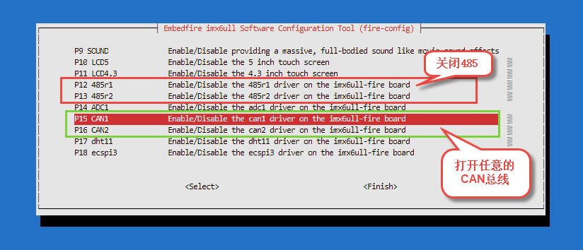
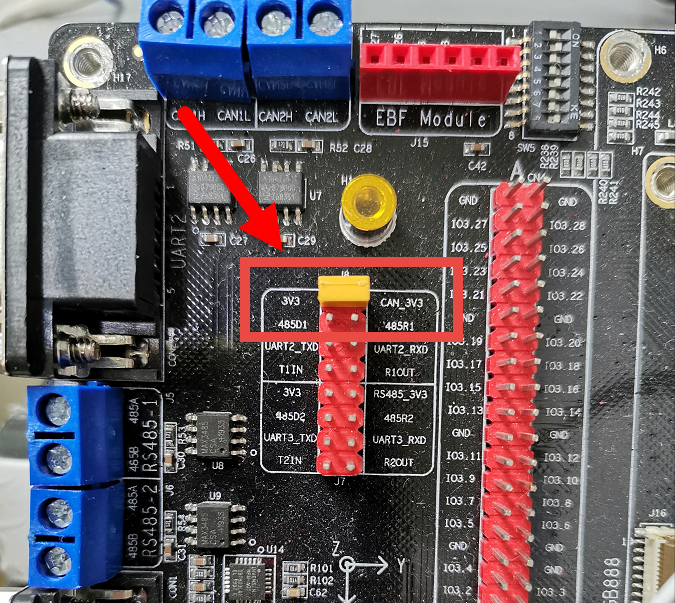

CANopen学习
===========

必看说明
--------

本章的实验是基于 **2个** 野火开发板做的，目的仅为了验证野火开发板可以正常运行CANopen协议，如果你已经有多个开发板或者有了CANopen协议分析的工具，又或者你可以通过CANopen控制某个设备，那么你可以接着往下看，并跟着操作。

CANopen简介
-----------

CANopen 协议是在 20 世纪 90 年代末在 CAL（CAN Application
Layer）的基础上发展而来的，由CiA301（或EN
50325-4）标准指定，是用于嵌入式控制系统的国际标准化的基于CAN的高层协议，在学习本章之前，你应该对CAN总线有清晰的了解。

CANopen本身不是典型的主/从协议。它更像生产者/消费者协议。也可以在没有主机的情况下运行CANopen网络。例如，预配置的过程数据对象（PDO）从生产者发送。每个PDO可能被多个节点消耗。每个CANopen设备的其他有用的CANopen功能还包括：心跳生产者和消费者，紧急生产者，同步生产者或消费者，时间生产者或消费者，SDO服务器（服务数据对象-服务于对象字典中的变量），NMT从设备（网络管理-启动）或停止部分通讯），LSS从站（节点ID和比特率的配置）。

CANopen网络通常具有一台具有主要功能的设备，用于网络配置。它可能具有其他CANopen功能，例如：NMT主站，LSS主站，SDO客户端，紧急用户。CANopenNode中的主功能是根据标准CiA309-3用Ascii命令行界面实现的。

CANopen 协议通常分为用户应用层、对象字典以及通信三个部分：

-  其中最为核心的是对象字典，描述了应用对象和 CANopen 报文之间的关系。

-  CANopen 通信是本文关键部分，其定义了 CANopen 协议通信规则以及与 CAN
   控制器驱动之间对应关系，熟悉这部分对全面掌握 CANopen 协议至关重要。

-  用户应用层是用户根据实际的需求编写的应用对象。

CANopenNode
-----------

CANopen是一个标准的协议，有很多代码可以实现这个标准协议，其中就有CANopenNode，它CANopenNode是免费的开源CANopen协议栈，遵循Apache
2.0开源协议，这意味着你可以使用他进行商用，闭源等，当然更具体的协议约束得具体看改协议的内容，CANopenNode可以在任何Linux机器上运行，我们开发板就选择它来验证CANopen协议，代码仓库位于 https://github.com/CANopenNode/CANopenNode 。

除此之外CANopenNode以面向对象的方式用ANSI
C语言编写，它可以作为独立应用程序或与RTOS在不同的微控制器上运行。

简单介绍一下CANopenNode实现的流程图，大家看一看就好了：

.. figure:: ./media/canopen001.png
   :alt: canopen001.png

   canopen001.png

简单测试CANopen
---------------

更新
~~~~

为了确保我们安装的软件包的版本是最新版本，让我们使用apt命令更新本地apt包索引和升级系统：

.. code:: bash

    sudo apt-get update
    sudo apt-get -y upgrade

手动安装相关的依赖包
~~~~~~~~~~~~~~~~~~~~

这些依赖包是这次测试CANopen必须的，要安装一下。

.. code:: bash

    sudo apt-get -y install git

.. code:: bash

    sudo apt-get -y install make

.. code:: bash

    sudo apt-get -y install gcc

.. code:: bash

    sudo apt-get -y install can-utils

简单测试CAN总线功能
~~~~~~~~~~~~~~~~~~~

我们要验证一下我们板子上的CAN总线是可以正常工作的，

1. 首先使用下面命令将485总线关闭，打开CAN总线，比如我选择的是打开CAN1与CAN2：

.. code:: bash

    sudo fire-config

   canopen002.png

2. 重启开发板。

3. 将开发板中CAN总线的跳帽连接上（在开发板的左上角区域）。

   canopen003.png

4. 使用以下命令查看是否存在CAN总线设备（打开CAN1实际上是CAN0设备，CAN2实际上是CAN1设备，此处我打开了两个）。

.. code:: bash

    ifconfig -a

    can0: flags=193<UP,RUNNING,NOARP>  mtu 16
            unspec 00-00-00-00-00-00-00-00-00-00-00-00-00-00-00-00  txqueuelen 10  (UNSPEC)
            RX packets 23017  bytes 23407 (22.8 KiB)
            RX errors 0  dropped 0  overruns 0  frame 0
            TX packets 17392  bytes 17551 (17.1 KiB)
            TX errors 0  dropped 0 overruns 0  carrier 0  collisions 0
            device interrupt 25  

    can1: flags=128<NOARP>  mtu 16
            unspec 00-00-00-00-00-00-00-00-00-00-00-00-00-00-00-00  txqueuelen 10  (UNSPEC)
            RX packets 0  bytes 0 (0.0 B)
            RX errors 0  dropped 0  overruns 0  frame 0
            TX packets 0  bytes 0 (0.0 B)
            TX errors 0  dropped 0 overruns 0  carrier 0  collisions 0
            device interrupt 26  

5. 运行以下命令，设置can0总线设备的波特率等信息，并且使能can0总线设备。

.. code:: bash

    sudo ip link set can0 type can bitrate 1000000;sudoip link set can0 up

6. 在另一个开发板上也是这样子操作一遍。

7. 选择其中一个开发板做数据的发送，一个做数据的接收，接收数据的开发板上运行以下命令：

.. code:: bash

    candump can0

8. 发送数据的开发板上运行以下命令：

.. code:: bash

    cansend can0 123#abcdabcd

你会发现在接收的开发板上收到了以下内容，这样子就表示CAN总线是能正常工作了，我们才能接着下一步操作——使用CANopen协议。

.. code:: bash

    ➜  ~ candump can0

      can0  123   [4]  AB CD AB CD

**注意，以上这些操作需要在两个开发板上操作的** 。

拉取CANopenNode仓库
~~~~~~~~~~~~~~~~~~~

接着到github拉取这个仓库，仓库非常小，下载下来是很快的，注意，这里也需要拉取到两个开发板上。

.. code:: bash

    git clone https://github.com/CANopenNode/CANopenNode.git

当然也可以从野火的gitee仓库下载。

.. code:: bash

    git clone https://gitee.com/Embedfire/CANopenNode.git

拉取下来后看到本地有CANopenNode文件夹，我们点进去，可以看到CANopen源码相关的文件与文件夹，我们简单介绍一下：

**301文件夹下的内容：主要是CANopen应用层和通信配置文件。**

-  CO_config.h ：CANopenNode的配置宏。

-  CO_driver.h ：CAN硬件和CANopenNode之间的接口。

-  CO_Emergency.h 、 CO_Emergency.c ：CANopen紧急协议。

-  CO_HBconsumer.h 、 CO_HBconsumer.c ：CANopen心跳消费者协议。

-  CO_NMT_Heartbeat.h 、 CO_NMT_Heartbeat.c ：CANopen网络管理和心跳生成器协议。

-  CO_PDO.h 、 CO_PDO.c ：CANopen过程数据对象协议。

-  CO_SDOclient.h、 CO_SDOclient.c ：CANopen服务数据对象-客户端协议（主功能）。

-  CO_SDOserver.h 、 CO_SDOserver.c ：CANopen服务数据对象-服务器协议。

-  CO_SYNC.h 、 CO_SYNC.c ：CANopen同步协议（生产者和使用者）。

-  CO_TIME.h 、 CO_TIME.c：CANopen时间戳协议。

-  CO_fifo.h 、 CO_fifo.c：用于SDO和网关数据传输的Fifo缓冲区。

-  crc16-ccitt.h 、 crc16-ccitt.c：CRC 16 CCITT多项式的计算。

**example目录下的文件：**

-  CO_driver_target.h ：CANopenNode的示例硬件定义。

-  CO_driver_blank.c ：CANopenNode的示例空白接口。

-  CO_OD.h 、CO_OD.c ：CANopen对象字典。自动生成的文件。

-  main_blank.c：主线和其他线程。

-  Makefile：编译规则描述文件。

-  IO.eds：标准CANopen EDS文件，可从CANopen配置工具中使用。自动生成的文件。

-  _project.xml ：XML文件包含CANopen对象字典的所有数据。它是通过使用对象字典编辑器

-  应用程序，它产生的其他文件。

-  _project.html ：对象字典编辑器启动。

**socketCAN目录下的文件内容，主要是Linux socketCAN接口相关的文件。**

-  CO_driver_target.h ：针对Linuxopen的CANopenNode定义。

-  CO_driver.c ：Linux socketCAN和CANopenNode之间的接口。

-  CO_error.h 、 CO_error.c ：Linux socketCAN错误处理对象。

-  CO_error_msgs.h：错误定义字符串和记录功能。

-  CO_Linux_threads.h 、 CO_Linux_threads.c
   ：用于在Linux中实现CANopen线程的辅助函数。

-  CO_OD_storage.h 、 CO_OD_storage.c ：Linux
   SocketCAN的对象字典存储对象。

-  CO_main_basic.c socketCAN的主线程（基本用法）。

**其他的一些目录就暂时不做介绍了，感兴趣的可以了解一下**

使用ssh连接开发板
~~~~~~~~~~~~~~~~~

为了更方便后续的其他操作，我们可以通过ssh登陆开发板，这样子就可以打开多个终端，具体的操作参考： https://tutorial.linux.doc.embedfire.com/zh_CN/latest/linux_basis/fire-config_brief.html?highlight=ssh#fire-configssh

编译 & 运行
~~~~~~~~~~~

我们进入CANopenNode目录下，然后运行 ``make`` 命令即可编译。

.. code:: bash

    make

    # 编译输出的内容
    ···
    cc -Wall -g -IsocketCAN -I. -Iexample -IsocketCAN -c example/CO_OD.c -o example/CO_OD.o
    cc -Wall -g -IsocketCAN -I. -Iexample -IsocketCAN -c socketCAN/CO_main_basic.c -o socketCAN/CO_main_basic.o
    cc -pthread socketCAN/CO_driver.o socketCAN/CO_error.o socketCAN/CO_Linux_threads.o socketCAN/CO_OD_storage.o 301/CO_SDOserver.o 301/CO_Emergency.o 301/CO_NMT_Heartbeat.o 301/CO_HBconsumer.o 301/CO_SYNC.o 301/CO_PDO.o 301/CO_TIME.o 301/CO_SDOclient.o 301/crc16-ccitt.o 301/CO_fifo.o 305/CO_LSSslave.o 305/CO_LSSmaster.o 309/CO_gateway_ascii.o extra/CO_trace.o CANopen.o example/CO_OD.o socketCAN/CO_main_basic.o -o canopend

**可以看到在当前目录下生成了canopend可执行文件。**

接着我们在接收端的开发板上运行以下命令：

.. code:: bash

    candump can0

在发送端的开发板运行以下命令:

.. code:: bash

    ./canopend can0 -i 4 -s od4_storage -a od4_storage_auto

你会看到接收端的开发板收到了很多数据，其中包括心跳以及CANopen协议的其他数据内容。

.. code:: bash

    ➜  ~ candump can0

      can0  704   [1]  00
      can0  704   [1]  7F
      can0  084   [8]  00 50 01 2F F3 FF FF FF
      can0  704   [1]  7F
      can0  704   [1]  7F
      can0  704   [1]  7F
      can0  704   [1]  7F
      can0  704   [1]  7F
      can0  704   [1]  7F
      can0  704   [1]  7F

验证其他的相关操作
~~~~~~~~~~~~~~~~~~

在通过SSH连接开发板后，我们可以打开第二个终端，然后在CANopenNode目录下运行以下命令：

.. code:: bash

    ./canopend can0 -i 3 -c "stdio"

这句命令表示了使用 NodeID = 3 启动canopend的第二个实例。使用默认的od_storage文件并在标准IO（终端）上启用命令界面。

你可以在另一个开发板上（接收can数据的开发板上）看到两个CANopen设备，每个设备以一秒钟的间隔发送心跳。其中一个的节点
ID = 4，另一个的节点 ID =3。两个都是可操作的设备。

.. code:: bash

      can0  703   [1]  7F
      can0  704   [1]  7F
      can0  703   [1]  7F
      can0  704   [1]  7F
      can0  703   [1]  7F
      can0  704   [1]  7F

接着你可以输入 ``help`` 查看它的用法，或者输入以下内容:

.. code:: bash

    3 read 0x1017 0 i16

在 ID = 3的 CANopen 设备上读取 Heartbeat 生产者参数。参数位于索引
0x1017，子索引0，它是16位整数，可以看到回应是1000，表示心跳包的时间间隔是1000ms。

回应的内容：

.. code:: bash

    [0] 1000

接着你可以在 ID = 3 的 CANopen 设备上写入 Heartbeat
心跳包的时间间隔，让其以指定的时间间隔发送心跳包，比如5000ms：

.. code:: bash

    3 write 0x1017 0 u16 5000

回应的内容是：

.. code:: bash

    [0] OK

表示已经设置成功，我们可以在另一个开发板上（接收can数据的开发板上）看到两个CANopen设备，节点
ID = 4 的 CANopen 设备的心跳包是1000ms一次，另一个的节点 ID =3 的
CANopen 设备的心跳包是5000ms一次。

.. code:: bash

      can0  703   [1]  7F
      can0  704   [1]  7F
      can0  704   [1]  7F
      can0  704   [1]  7F
      can0  704   [1]  7F
      can0  704   [1]  7F
      can0  703   [1]  7F
      can0  704   [1]  7F
      can0  704   [1]  7F

其他更丰富的CANopen协议的应用，可以参考源码进行编写，此处仅验证野火开发板是可以使用CANopen协议的。

当然，你也可以在另一个板子上跑这个CANopen协议~

**本章完。**
