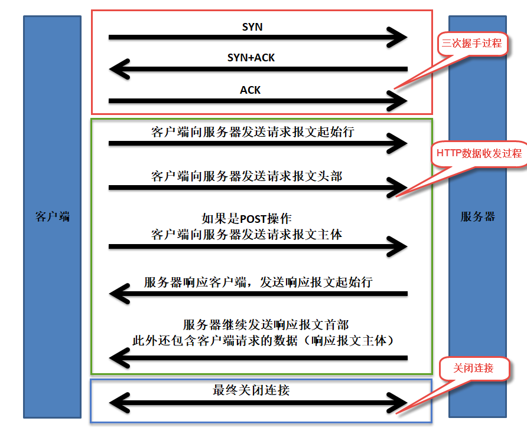
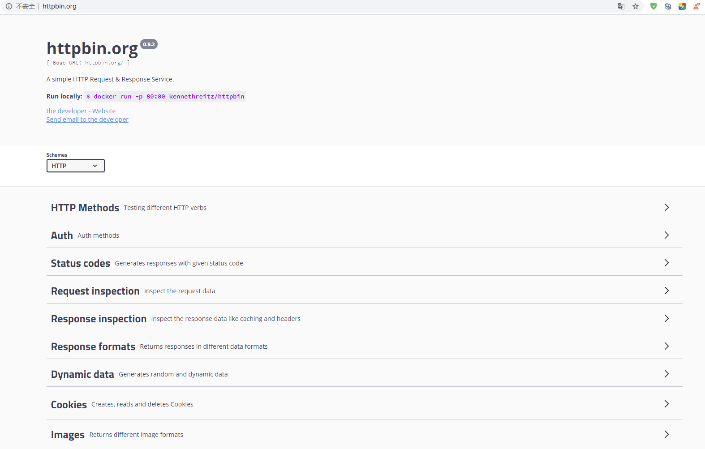
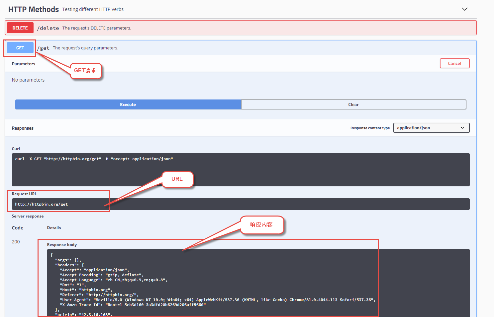

实现http客户端
==============

``HTTP`` 协议是一个基于文本的协议，因此用 ``C`` 语言实现一个简易的 ``HTTP`` 客户端就不是什么难事。但如果对这个不熟悉，要想一下子实现一个 ``HTTP GET`` 方法取获取一个网页这么简单的功能恐怕也未必是两三分钟能搞定的事。其关键是要理解 ``HTTP`` 协议的工作原理，详细阅读上一篇文章。

完整的http请求过程
------------------

一般来说http请求大体分为以下几个过程：

1. 客户端三次握手与服务器建立连接。
2. 客户端发起HTTP请求。
3. 客户端发送HTTP请求报文首部，如果是POST操作还会包含HTTP报文主体部分。
4. HTTP服务器响应客户端的请求。
5. HTTP服务器发送响应报文首部与主体部分。
6. 关闭连接。

   http001

c语言代码实现
-------------

明确了http请求的过程我们就可以开始着手写代码了，我们定个小目标，我们最终的http客户端可以通过url去获取数据，并且将返回的数据写到一个文件中。

需要的知识点是基本的 **网络编程知识，字符串的处理，文件的操作** 。

代码的存放位置是 ``https://github.com/Embedfire/embed_linux_tutorial/base_code/linux_iot/http_client/httpclient.c`` ，代码内容如下，有比较详细的注释信息：

.. code:: c

    /******* http客户端程序 httpclient.c ************/
    #include <stdio.h>
    #include <stdlib.h>
    #include <string.h>
    #include <sys/socket.h>
    #include <errno.h>
    #include <unistd.h>
    #include <netdb.h>
    #include <ctype.h>

    /********************************************
    功能：搜索字符串右边起的第一个匹配字符
    ********************************************/
    char *right_strchr(char * s, char x)
    {
        int i = strlen(s);
        if (!(*s)) 
            return 0;
        while (s[i-1]) {
            if (strchr(s + (i - 1), x)) {
                return (s + (i - 1));
            } else {
                i--;
            }
        }
        return 0;
    }

    /********************************************
    功能：把字符串转换为全小写
    ********************************************/
    void str_to_lower(char * s)
    {
        while (s && *s) {
            *s=tolower(*s);
            s++;
        }
    }

    /**************************************************************
    功能：从字符串src中分析出网站地址和端口，并得到用户要下载的文件
    ***************************************************************/
    void get_connect_info(char * src, char * host, char * file, int * port)
    {
        char *p1;
        char *p2;

        memset(host, 0, sizeof(host));
        memset(file, 0, sizeof(file));

        *port = 0;

        if (!(*src)) 
            return;

        p1 = src;

        if (!strncmp(p1, "http://", strlen("http://"))) 
            p1 = src + strlen("http://");
        else if (!strncmp(p1, "https://", strlen("https://"))) 
            p1 = src + strlen("https://");
        
        p2 = strchr(p1, '/');

        if (p2) {
            memcpy(host, p1, strlen(p1) - strlen(p2));
            if (p2+1) {
                memcpy(file, p2 + 1, strlen(p2) - 1);
                file[strlen(p2) - 1] = 0;
            }
        } else {
            memcpy(host, p1, strlen(p1));
        }
        
        if (p2) 
            host[strlen(p1) - strlen(p2)] = 0;
        else 
            host[strlen(p1)] = 0;
        
        p1 = strchr(host, ':');

        if (p1) 
            *port = atoi(p1 + 1);
        else 
            *port = 80;     /* 只支持http协议 */
    }

    int main(int argc, char *argv[])
    {
        int sockfd;
        char buffer[1024];
        struct sockaddr_in server_addr;
        struct hostent *host;
        int port,nbytes;
        char host_addr[256];
        char host_file[1024];
        char local_file[256];
        FILE * fp;
        char request[1024];
        int send, totalsend;
        int i = 0;
        char * pt;

        if (argc!=2) {
            fprintf(stderr,"Usage:%s host-address\r\n",argv[0]);
            exit(1);
        }

        str_to_lower(argv[1]);/*将参数转换为全小写*/

        get_connect_info(argv[1], host_addr, host_file, &port);  /*分析网址、端口、文件名等*/

        // printf("host:%s\n", host_addr);
        // printf("hostfile:%s\n", host_file);
        // printf("port:%d\n\n", port);

        if ((host=gethostbyname(host_addr))==NULL) { /*取得主机IP地址*/
            fprintf(stderr,"Gethostname error, %s\n", strerror(errno));
            exit(1);
        }

        /* 客户程序开始建立 sockfd描述符 */
        if ((sockfd=socket(AF_INET,SOCK_STREAM,0))==-1) { /*建立SOCKET连接*/
            fprintf(stderr,"Socket Error:%s\r\n",strerror(errno));
            exit(1);
        }

        /* 客户程序填充服务端的资料 */
        bzero(&server_addr,sizeof(server_addr));
        server_addr.sin_family=AF_INET;
        server_addr.sin_port=htons(port);
        server_addr.sin_addr=*((struct in_addr *)host->h_addr);

        /* 客户程序发起连接请求 */
        if (connect(sockfd,(struct sockaddr *)(&server_addr),sizeof(struct sockaddr))==-1) { /*连接网站*/
            fprintf(stderr,"Connect Error:%s\r\n",strerror(errno));
            exit(1);
        }

        /*准备 request 报文，将要发送给主机*/
        sprintf(request, "GET /%s HTTP/1.1\r\n"
                         "Accept: */*\r\n"
                         "Accept-Language: zh-cn\r\n"
                         "User-Agent: Mozilla/5.0\r\n"
                         "Host: %s:%d\r\n"
                         "Connection: Close\r\n\r\n", host_file, host_addr, port);

        /* 打印请求报文 */
        printf("%s", request);

        /*取得真实的文件名*/
        if (host_file && *host_file) 
            pt = right_strchr(host_file, '/');
        else 
            pt = 0;

        memset(local_file, 0, sizeof(local_file));

        if (pt && *pt) {
            if ((pt + 1) && *(pt+1)) 
                strcpy(local_file, pt + 1);
            else
                memcpy(local_file, host_file, strlen(host_file) - 1);

        } else if (host_file && *host_file) {
            strcpy(local_file, host_file);
            
        } else {
            strcpy(local_file, "index.html");
        }

        // printf("local filename to write:%s\n\n", local_file);

        /*发送http请求request*/
        send = 0;
        totalsend = 0;
        nbytes=strlen(request);

        while (totalsend < nbytes) {
            send = write(sockfd, request + totalsend, nbytes - totalsend);
            if (send==-1) {
                printf("send error!%s\n", strerror(errno));
                exit(0);
            }

            totalsend += send;
            // printf("%d bytes send OK!\n", totalsend);
        }

        fp = fopen(local_file, "w");
        if (!fp) {
            printf("create file error! %s\n", strerror(errno));
            return 0;
        }

        /* 连接成功了，接收http响应，response */
        while ((nbytes = read(sockfd, buffer, 1)) == 1) {

            /* 报文首部与主体之间有 \r\n\r\n */
            if (i < 4) {

                if (buffer[0] == '\r' || buffer[0] == '\n')
                    i++;
                else 
                    i = 0;
                /* 打印响应头部 */
                printf("%c", buffer[0]);
            } else {
                printf("%c", buffer[0]);
                fwrite(buffer, 1, 1, fp);/*将http主体信息写入文件*/
                i++;
                if (i%1024 == 0) 
                    fflush(fp); /*每1K时存盘一次*/
            }
        }

        fclose(fp);
        /* 结束通讯 */
        close(sockfd);
        exit(0);
    }

编译 & 运行
-----------

编写一个Makefile文件，内容如下：

.. code:: bash

    CC=gcc
    SRC = $(wildcard *.c */*.c)
    OBJS = $(patsubst %.c, %.o, $(SRC))
    DEP_FILES := $(patsubst %, .%.d,$(OBJS))
    DEP_FILES := $(wildcard $(DEP_FILES))
    FLAG = -g -Werror -I. -Iinclude -lpthread
    TARGET = targets

    $(TARGET):$(OBJS)
        $(CC) -o $@ $^ $(FLAG)

    ifneq ($(DEP_FILES),)
    include $(DEP_FILES)
    endif

    %.o:%.c
        $(CC) -o $@ -c $(FLAG) $< -g -MD -MF .$@.d

    clean:
        rm -rf $(TARGET) $(OBJS)

    distclean:
        rm -rf $(DEP_FILES)

    .PHONY:clean

如果你是在虚拟机上编译这段代码，那么不需要修改Makefile文件，如果你想在开发板编译并运行，那么只需要将Makefile的第一行 ``CC=gcc`` 改为交叉编译器即可， ``CC=arm-linux-gnueabihf-gcc`` 。

在编译完成后，会生成一个名字为 ``targets`` 的可执行文件，直接运行以下命令即可：

.. code:: bash

    ./targets http://httpbin.org/get

    # 输出的内容
    GET /get HTTP/1.1
    Accept: */*
    Accept-Language: zh-cn
    User-Agent: Mozilla/5.0
    Host: httpbin.org:80
    Connection: Close

    HTTP/1.1 200 OK
    Date: Thu, 07 May 2020 09:03:19 GMT
    Content-Type: application/json
    Content-Length: 285
    Connection: close
    Server: gunicorn/19.9.0
    Access-Control-Allow-Origin: *
    Access-Control-Allow-Credentials: true

    {
      "args": {}, 
      "headers": {
        "Accept": "*/*", 
        "Accept-Language": "zh-cn", 
        "Host": "httpbin.org", 
        "User-Agent": "Mozilla/5.0", 
        "X-Amzn-Trace-Id": "Root=1-5eb3ced7-db780bb478fc34e035aad324"
      }, 
      "origin": "42.3.16.168", 
      "url": "http://httpbin.org/get"
    }

补充介绍
--------

我们来介绍一下一个http测试的网站： http://httpbin.org/ ，它是一个 HTTP
请求与应答的服务器，你可以向他发送请求，然后他会按照指定的规则将你的请求返回，这个有点类似于 ``echo`` 服务器，但是功能又比它要更强大一些。
它支持 ``HTTP/HTTPS`` ，支持所有的HTTP方法，能模拟重定向，还可以返回一个HTML文件或一个XML文件或一个图片文件（还支持指定返回图片的格式）。实在是HTTP协议调试的居家必备的良器！

   http002

比如我们刚刚运行的命令中，输入了URL，就是从这里得到的，用于测试请求操作。

   http003

Python实现http请求
------------------

我们在Python环境搭建的章节也演示过一个获取天气信息的例程，它就是通过 ``requests`` 包去请求一个 ``url`` 资源，并且返回相关的天气信息，代码如下：

.. code:: py

    # 导入json、requests包
    import json, requests

    #输入地点
    weather_place = "东莞"

    #日期
    date = []
    #最高温与最低温
    high_temp = []
    low_temp = []
    #天气
    weather = []

    # 请求天气信息
    weather_url = "http://wthrcdn.etouch.cn/weather_mini?city=%s" % (weather_place)

    response = requests.get(weather_url)
    try:
        response.raise_for_status()
    except:
        print("请求信息出错")
        
    #将json文件格式导入成python的格式
    weather_data = json.loads(response.text)

    # 打印原始数据
    # print(weather_data)
     
    w = weather_data['data']

    print("地点：%s" % w['city'])

    #进行五天的天气遍历，并格式化输出
    for i in range(len(w['forecast'])):
        date.append(w['forecast'][i]['date'])
        high_temp.append(w['forecast'][i]['high'])
        low_temp.append(w['forecast'][i]['low'])
        weather.append(w['forecast'][i]['type'])
        
        #输出
        print("日期：" + date[i])
        print("\t温度：最" + low_temp[i] + "\t最" + high_temp[i])
        print("\t天气：" + weather[i] + "\n")
        
    print("\n今日着装：" + w['ganmao'])
    print("当前温度：" + w['wendu'])

然后尝试运行：

.. code:: bash

    python weather.py

    # 输出
    Traceback (most recent call last):
      File "weather.py", line 1, in <module>
        import json, requests
    ModuleNotFoundError: No module named 'requests'

运行weather.py程序，运行的效果如下：

.. code:: bash

    python weather.py

    # 输出
    地点：东莞
    日期：27日星期五
            温度：最低温 21℃        最高温 28℃
            天气：阵雨

    日期：28日星期六
            温度：最低温 18℃        最高温 23℃
            天气：中到大雨

    日期：29日星期天
            温度：最低温 17℃        最高温 24℃
            天气：阴

    日期：30日星期一
            温度：最低温 21℃        最高温 26℃
            天气：阴

    日期：31日星期二
            温度：最低温 20℃        最高温 28℃
            天气：阵雨

    今日着装：天气转凉，空气湿度较大，较易发生感冒，体质较弱的朋友请注意适当防护。
    当前温度：27

