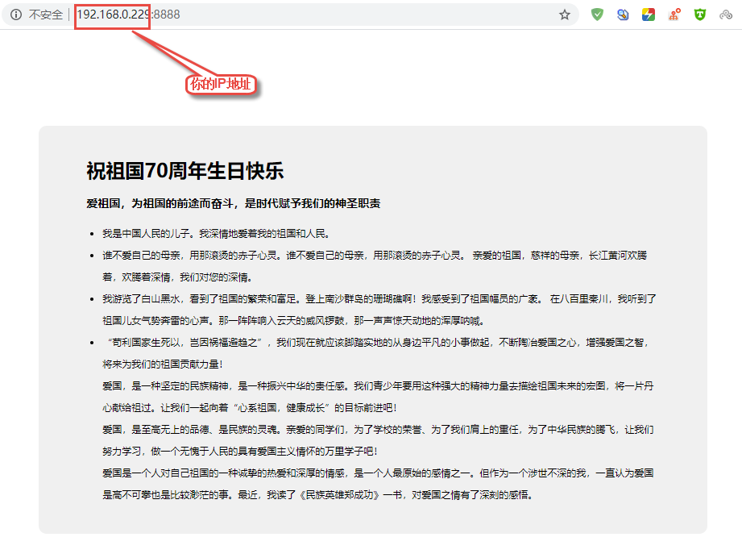
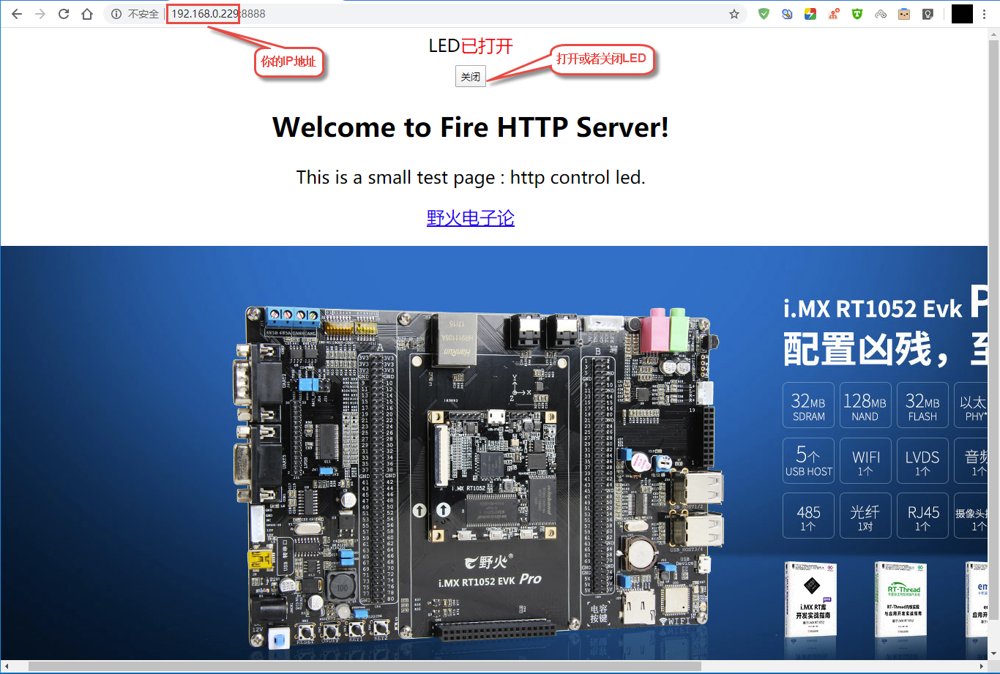

http服务器
==========

http服务器的处理过程
--------------------

在前面我们实现了http客户端，现在来实现一个http服务器，首先看看他的处理过程（使用socket
api实现）：

1. 首先调用socket()创建一个服务端的套接字

2. 然后使用bind()将套接字绑定在一个指定的端口上。

3. 调用listen()将套接字转换到LISTEN状态。

4. 调用accept()处理来自客户端的连接。

5. 通过HTTP协议进行数据的收发操作。

一般客户端会发送HTTP请求报文报文，我们去简单解析即可，我们选择HTTP请求报文的起始行作为解析的地方，当它的请求是GET方法的时候，我们返回指定的数据内容，如果是POST方法，我们解析后再返回指定的内容。

在这里有几个注意事项，因为浏览器访问我们的服务器，其实是通过“GET”操作命令获取我们开发板/电脑的资源，那么我们在接收到这个命令后，返回我们的资源数据给浏览器，而浏览器显示是通过
HTML 代码来标记这些资源的，那么我们在开发板/电脑中就需要定义好相关的
HTML
数据，比如这个使用一个HTML格式的文件记录这些数据，因为在linux平台下，对文件的读写操作是非常简单的，那么在客户端请求资源的时候，我们将这些数据读取出来，然后再发送给客户端。

http客户端的示例
----------------

1. 首先创建一个index.html文件，保存返回给客户端的数据内容。

文件的位置在：https://github.com/Embedfire/embed_linux_tutorial/tree/master/base_code/linux_iot/http_server

.. code:: html

    <!doctype html>
    <html>
    <head>
        <meta charset="utf-8">
        <title>富强、民主、和谐</title>
        
    </head>
    <body>
        

            <h1>祝祖国70周年生日快乐</h1>
            <h3>爱祖国，为祖国的前途而奋斗，是时代赋予我们的神圣职责</h3>
            <ul>
              <li>我是中国人民的儿子。我深情地爱着我的祖国和人民。</li>
              <li>谁不爱自己的母亲，用那滚烫的赤子心灵。谁不爱自己的母亲，用那滚烫的赤子心灵。
                  亲爱的祖国，慈祥的母亲，长江黄河欢腾着，欢腾着深情，我们对您的深情。</li>
              <li>我游览了白山黑水，看到了祖国的繁荣和富足。登上南沙群岛的珊瑚礁啊！我感受到了祖国幅员的广袤。
                  在八百里秦川，我听到了祖国儿女气势奔雷的心声。那一阵阵响入云天的威风锣鼓，那一声声惊天动地的浑厚呐喊。</li>
              <li>“苟利国家生死以，岂因祸福避趋之”，我们现在就应该脚踏实地的从身边平凡的小事做起，不断陶冶爱国之心，增强爱国之智，将来为我们的祖国贡献力量！ 
                  爱国，是一种坚定的民族精神，是一种振兴中华的责任感。我们青少年要用这种强大的精神力量去描绘祖国未来的宏图，将一片丹心献给祖过。让我们一起向着“心系祖国，健康成长”的目标前进吧！ 
                  爱国，是至高无上的品德、是民族的灵魂。亲爱的同学们，为了学校的荣誉、为了我们肩上的重任，为了中华民族的腾飞，让我们努力学习，做一个无愧于人民的具有爱国主义情怀的万里学子吧！ 
                  爱国是一个人对自己祖国的一种诚挚的热爱和深厚的情感，是一个人最原始的感情之一。但作为一个涉世不深的我，一直认为爱国是高不可攀也是比较渺茫的事。最近，我读了《民族英雄郑成功》一书，对爱国之情有了深刻的感悟。</li>
            </ul>
        

    </body>
    </html>

2. 编写对应的c代码，代码的执行过程是根据前文所述的HTTP服务器出来过程编写的，有很详细的注释，具体见：

.. code:: c

    #include <stdio.h>
    #include <netinet/in.h>
    #include <sys/socket.h> // socket
    #include <sys/types.h>  // 基本数据类型
    #include <unistd.h> // read write
    #include <string.h>
    #include <stdlib.h>
    #include <fcntl.h> // open close
    #include <sys/shm.h>
    #include <netinet/in.h>
    #include <arpa/inet.h>
    #include <signal.h>
    #include <sys/stat.h>

    #define PORT        8888
    #define SERVER      "0.0.0.0"
    #define BACKLOG     20
    #define BUFF_SIZE   (1024 * 50)

    #define INDEX_FILE  "./index.html"

    int sockfd;

    // 发送给客户端的信息
    char *http_res_tmpl = "HTTP/1.1 200 OK\r\n"
            "Server: Cleey's Server V1.0\r\n"
            "Accept-Ranges: bytes\r\n"
            "Content-Length: %d\r\n"
            "Connection: close\r\n"
            "Content-Type: %s\r\n\r\n";

    // 字符串的匹配，用于匹配http请求报文的内容
    int http_str_nmatch(const char *str1, const char *str2, int n)
    {
        int i = 0;
        int c1, c2;
        do {
            c1 = *str1++;
            c2 = *str2++;
            i++;
        } while(((c1 == c2) && c1) && (i < n));

        return c1 - c2;
    }

    // http 发送数据
    void http_send(int sock_client, char *str) 
    {
        char header[BUFF_SIZE], body[BUFF_SIZE];

        int len = strlen(str);

        sprintf(header, http_res_tmpl, len,"text/html");

        len = sprintf(body,"%s%s", header, str);

        send(sock_client, body, len, 0);
    }

    void handle_signal(int sign) 
    {
        fputs("\nSIGNAL INTERRUPT \nBye Cleey! \nSAFE EXIT\n",stdout);
        close(sockfd);
        exit(0);
    }

    // 根据指定的文件名读取文件的内容
    int read_file(char *filename, int *len, char **data)
    {
        int file = open(filename, O_RDONLY);
        if ( file == -1 )
            return -1;

        int i = 0;
        while ( 1 )
        {
            // 分配内存空间
            *data = realloc(*data, (BUFF_SIZE * (i + 1)));
            if ( data == NULL )
            {
                close( file );
                return -1;
            }

            // 读取文件内容
            int cur_len = read(file, *data+(BUFF_SIZE * i), BUFF_SIZE);
            if ( cur_len == 0 )
                break;
            else
                *len += cur_len;

            i++;
        }

        close( file );

        return 0;
    }

    int main(void)
    {
        signal(SIGINT,handle_signal);
        int len = 0;
        char *pdata = NULL;
        int count = 0; // 计数

        // 申请 socket
        sockfd = socket(AF_INET,SOCK_STREAM,0);

        // 定义 sockaddr_in
        struct sockaddr_in skaddr;
        skaddr.sin_family = AF_INET;            // ipv4
        skaddr.sin_port   = htons(PORT);
        skaddr.sin_addr.s_addr = inet_addr(SERVER);

        // bind，绑定 socket 和 sockaddr_in
        if (bind(sockfd,(struct sockaddr *)&skaddr,sizeof(skaddr)) == -1 ) {
            perror("bind error");
            exit(1);
        }

        // listen监听端口号
        if (listen(sockfd, BACKLOG) == -1 ) {
            perror("listen error");
            exit(1);
        }

        // 客户端信息
        char buff[BUFF_SIZE];
        struct sockaddr_in claddr;
        socklen_t length = sizeof(claddr);

        while(1) {
            // 出来连接
            int sock_client = accept(sockfd,(struct sockaddr *)&claddr, &length);
            if (sock_client <0) {
                perror("accept error");
                exit(1);
            }

            memset(buff,0,sizeof(buff));

            // 接收来自客户端的请求
            int len = recv(sock_client, buff, sizeof(buff), 0);

            // 匹配是否为get方法
            if (http_str_nmatch(buff, "GET /index", 10) == 0) {

                read_file(INDEX_FILE, &len, &pdata);
                http_send(sock_client, pdata);

            } else if (http_str_nmatch(buff, "GET /", 5) == 0) {

                read_file(INDEX_FILE, &len, &pdata);
                http_send(sock_client, pdata);
            } else {

                http_send(sock_client,"Hello World!");
            }

            // 关闭连接
            close(sock_client);
        }

        fputs("Bye Cleey",stdout);
        close(sockfd);
        return 0;
    }

3. 编译与运行，使用make命令去编译该源码，然后运行生成的可执行文件即可，然后在你的电脑上打开浏览器，输入http://[你开发板的IP地址]:8888，即可看到实现现象，具体见：

   http004

网页控制LED灯
-------------

这个实验是基于上个实验的再次开发，我们的开发板作为服务器，电脑浏览器访问服务器，然后通过网页上的控制按钮来控制我们开发板上的
LED
灯，那是什么原理呢？首先我们从上一节知道，浏览器是通过“GET”命令来获取开发板上的数据（资源），同样的，浏览器也可以通过“POST”命令来设置开发板上的资源，当然，我们在服务器端（开发板）需要对“POST”命令产生应答并且处理才可以，因此我们需要对服务器进行改写，而且将开发板上
LED 等的状态实时显示在网页上。

1. 实现创建两个html资源文件，名字分别为led_on.html，led_off.html，用于保存开灯与关灯时候返回给客户端的数据内容，这两个文件的内容是差不多的，具体见：

文件的位置在：https://github.com/Embedfire/embed_linux_tutorial/tree/master/base_code/linux_iot/http_control_led

-  led_on.html

.. code:: html

    </html>
        <head><title>HTTP LED Control</title></head> 
        
 
            
 
            LED已打开 
            <form method=post action="off" name="ledform"> 
            <input type="submit" value="关闭" style="width:80px;height:30px;"></form> 
        
 

        <head><title>Congrats!</title></head>
        <body><h2 align="center">Welcome to Fire HTTP Server!</h2>
            
This is a small test page : http control led.

            
<a href="https://www.firebbs.cn/forum.php/">  野火电子论  </a>

            
        </body>

    </html>

-  led_off.html

.. code:: html

    </html>
        <head><title>HTTP LED Control</title></head> 
        
 
            
 
            LED已关闭 
            <form method=post action="on" name="ledform"> 
            <input type="submit" value="打开" style="width:80px;height:30px;"></form> 
        
 

        <head><title>Congrats!</title></head>
        <body><h2 align="center">Welcome to Fire HTTP Server!</h2>
            
This is a small test page : http control led.

            
<a href="https://www.firebbs.cn/forum.php/">  野火电子论  </a>

            
        </body>

    </html>

2. 接着编写代码，在上一个实验的代码之上修改，具体见：

.. code:: c

    #include <stdio.h>
    #include <netinet/in.h>
    #include <sys/socket.h> // socket
    #include <sys/types.h>  // 基本数据类型
    #include <unistd.h> // read write
    #include <string.h>
    #include <stdlib.h>
    #include <fcntl.h> // open close
    #include <sys/shm.h>
    #include <netinet/in.h>
    #include <arpa/inet.h>
    #include <signal.h>
    #include <sys/stat.h>

    #define PORT        8888
    #define SERVER      "0.0.0.0"
    #define BACKLOG     20
    #define BUFF_SIZE   (1024 * 500)

    #define LED_ON      "./led_on.html"
    #define LED_OFF     "./led_off.html"

    int sockfd;
    char *http_res_tmpl = "HTTP/1.1 200 OK\r\n"
            "Server: Cleey's Server V1.0\r\n"
            "Accept-Ranges: bytes\r\n"
            "Content-Length: %d\r\n"
            "Connection: close\r\n"
            "Content-Type: %s\r\n\r\n";
      
    int http_str_nmatch(const char *str1, const char *str2, int n)
    {
        int i = 0;
        int c1, c2;
        do {
            c1 = *str1++;
            c2 = *str2++;
            i++;
        } while(((c1 == c2) && c1) && (i < n));

        return c1 - c2;
    }

    void http_send(int sock_client, char *str) 
    {
        char header[BUFF_SIZE], body[BUFF_SIZE];

        int len = strlen(str);

        sprintf(header, http_res_tmpl, len,"text/html");

        len = sprintf(body,"%s%s", header, str);

        send(sock_client, body, len, 0);
    }

    void handle_signal(int sign) 
    {
        fputs("\nSIGNAL INTERRUPT \nBye Cleey! \nSAFE EXIT\n",stdout);
        close(sockfd);
        exit(0);
    }

    int read_file(char *filename, int *len, char **data)
    {
        int file = open(filename, O_RDONLY);
        if ( file == -1 )
            return -1;

        int i = 0;
        while ( 1 )
        {
            *data = realloc(*data, (BUFF_SIZE * (i + 1)));
            if ( data == NULL )
            {
                close( file );
                return -1;
            }

            int cur_len = read(file, *data+(BUFF_SIZE * i), BUFF_SIZE);
            if ( cur_len == 0 )
                break;
            else
                *len += cur_len;

            i++;
        }

        close( file );

        return 0;
    }

    int main(void)
    {
        signal(SIGINT,handle_signal);
        int len = 0;
        char *pdata = NULL;
        int count = 0; // 计数
        // 定义 socket
        sockfd = socket(AF_INET,SOCK_STREAM,0);
        // 定义 sockaddr_in
        struct sockaddr_in skaddr;
        skaddr.sin_family = AF_INET;            // ipv4
        skaddr.sin_port   = htons(PORT);
        skaddr.sin_addr.s_addr = inet_addr(SERVER);
        // bind，绑定 socket 和 sockaddr_in
        if (bind(sockfd,(struct sockaddr *)&skaddr,sizeof(skaddr)) == -1 ) {
            perror("bind error");
            exit(1);
        }

        // listen，开始添加端口
        if (listen(sockfd, BACKLOG) == -1 ) {
            perror("listen error");
            exit(1);
        }

        // 客户端信息
        char buff[BUFF_SIZE];
        struct sockaddr_in claddr;
        socklen_t length = sizeof(claddr);

        while(1) {
            int sock_client = accept(sockfd,(struct sockaddr *)&claddr, &length);
            if (sock_client <0) {
                perror("accept error");
                exit(1);
            }

            memset(buff,0,sizeof(buff));

            int len = recv(sock_client, buff, sizeof(buff), 0);

            if (http_str_nmatch(buff, "GET /", 5) == 0) {

                read_file(LED_ON, &len, &pdata);
                http_send(sock_client, pdata);

            } else if (http_str_nmatch(buff, "POST /on", 8) == 0) {

                read_file(LED_ON, &len, &pdata);
                http_send(sock_client, pdata);

                // led 打开
                printf("led on\n");

            } else if (http_str_nmatch(buff, "POST /off", 8) == 0) {

                read_file(LED_OFF, &len, &pdata);
                http_send(sock_client, pdata);

                // led 关闭
                printf("led off\n");
            } else {
                http_send(sock_client,"Hello World!");
            }

            // fputs(buff,stdout);
            close(sock_client);
        }
        fputs("Bye Cleey",stdout);
        close(sockfd);
        return 0;
    }

3. 编译与运行，使用make命令去编译该源码，然后运行生成的可执行文件即可，然后在你的电脑上打开浏览器，输入http://[你开发板的IP地址]:8888，即可看到实现现象，具体见：

   http005

当你点击打开或者关闭按钮时，你的终端会打印以下数据，表示LED打开或者关闭：

.. code:: bash

    ➜  http_control_led git:(dev_jie) ✗ ./targets 
    led off
    led on
    led off
    led on
    led off
    led on
    led off
    led on

