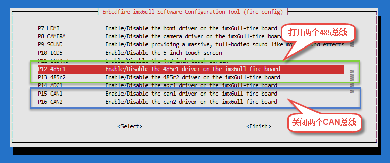
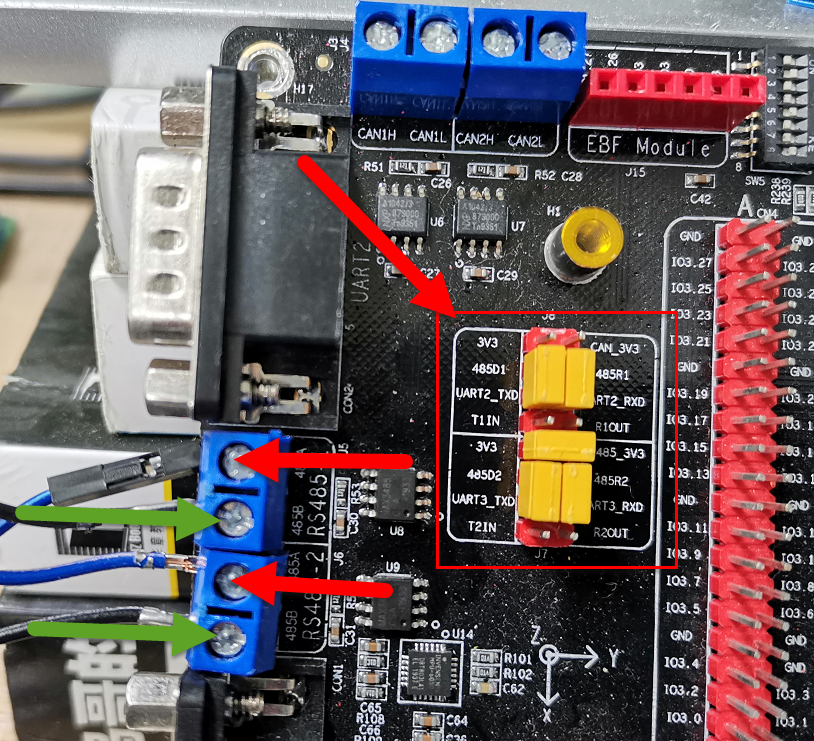

在Debian上使用modbus协议
========================

-  平台：野火imx6ull开发板
-  系统：Debian
-  modbus协议库：libmodbus

modbus协议简介
--------------

modbus协议是应用于电子控制器上的一种通用协议，通过modbus，控制器相互之间可以相互通信，此外控制器还可以通过网络、总线和其它设备之间可以通信。自1979年以来，modbus已成为一种通用工业标准协议了，在工业的产品上，大多都会使用很多modbus协议去通信，它是一个应用程序层消息传递协议，它提供了在不同类型的总线或网络上连接的设备之间的 **从机/主机模型** 的通信。

modbus定义了一个控制器能认识使用的消息结构，而不管它们是经过何种网络进行通信的。它描述了一个控制器请求访问其它设备的过程，如何回应来自其它设备的请求，以及怎样侦测错误并记录。它制定了消息域格局和内容的公共格式。当在同一modbus网络上通信时，modbus决定了每个控制器需要知道它们的设备地址，识别按地址发来的消息，决定要产生何种行动。如果需要回应，控制器将生成反馈信息并用modbus协议发出。在其它网络上，包含了modbus协议的消息转换为在此网络上使用的帧或包结构。这种转换也扩展了根据具体的网络解决节地址、路由路径及错误检测的方法。

modbus协议支持传统的RS-232、RS-422、RS-485和以太网设备。许多工业设备，包括PLC，DCS，智能仪表等都在使用modbus协议作为他们之间的通信标准。

更多modbus协议的介绍我们可以去官网提供的协议文档
http://www.modbus.org/specs.php 了解一下。

libmodbus简介
-------------

libmodbus是一个与使用modbus协议的设备进行数据 **发送/接收** 的库，它包含各种后端（backends）通过不同网络进行通信（例如，RTU模式下的串口、485总线或TCP
/
IPv6中的以太网）。libmodbus还提供了较低通信层的抽象，并在所有支持的平台上提供相同的API。

libmodbus是开源的，它遵循 **LGPL
v2.1** 开源协议，这个协议没有GPL协议那么严格，简单来说，只要你不修改libmodbus库里面的东西（只调用、链接该库），你是可以闭源你的代码的，你也可以用于商业用途，这是非常好的。

更多libmodbus相关的结束可以在github上查看：https://github.com/stephane/libmodbus。

测试485总线
-----------

使用ssh连接开发板
~~~~~~~~~~~~~~~~~

为了更方便后续的其他操作，我们可以通过ssh登陆开发板，这样子就可以打开多个终端，具体的操作参考： https://tutorial.linux.doc.embedfire.com/zh_CN/latest/linux_basis/fire-config_brief.html?highlight=ssh#fire-configssh

更新
~~~~

为了确保我们安装的软件包的版本是最新版本，让我们使用apt命令更新本地apt包索引和升级系统：

.. code:: bash

    sudo apt-get update
    sudo apt-get -y upgrade

手动安装相关的依赖包
~~~~~~~~~~~~~~~~~~~~

这些依赖包是这次测试libmodbus必须的，要安装一下。

.. code:: bash

    sudo apt-get -y install git

.. code:: bash

    sudo apt-get -y install make

.. code:: bash

    sudo apt-get -y install gcc

.. code:: bash

    sudo apt-get -y install autoconf

.. code:: bash

    sudo apt-get -y install libtool

简单测试485总线功能
~~~~~~~~~~~~~~~~~~~

我们要验证一下我们板子上的485总线是可以正常工作的，因为在后续我们会使用485总线去验证libmodbus工作是否正常，毕竟磨刀不误砍柴工，现在验证好了，后续出现问题就排除硬件的问题了。

1. 验证内核的版本，确保是最新的内核版本，输入以下命令，保证固件的版本是3.5以上的版本，如果不是则更新野火最新发布的镜像。

.. code:: bash

    ➜  ~ dmesg | grep sdma

    [    1.167359] imx-sdma 20ec000.sdma: loaded firmware 3.5

2. 首先使用下面命令将CAN总线关闭，打开两个485总线，打开CAN1与CAN2：

.. code:: bash

    sudo fire-config

   modbus001.png

3. 将开发板中484总线的跳帽连接上（在开发板的左上角区域），接着将485接口安卓下图所示的方法对接，485-1的A端与485-2的A端对接，485-1的B端与485-2的B端对接。

   modbus002.png

4. 重启开发板。

5. 使用以下命令查看是否存在485总线设备，如果存在ttymxc1和ttymxc2则表示打开总线成功。

.. code:: bash

    ➜  ~ ls /dev | grep ttymxc

    ttymxc0
    ttymxc1
    ttymxc2

6. 测试使用485，首先打开一个终端，输入以下命令，它是去读取485-1设备的输入内容：

.. code:: bash

    cat /dev/ttymxc1

7. 再次打开另一个终端，输入以下命令，往485-2设备发送一些数据，看看485-1设备能否接收到，如果接收到，则会在485-1设备的终端打印出来，注意要打开新的终端。

.. code:: bash

    ececho "66666666666666" > /dev/ttymxc2

如果你的485-1设备的终端打印处接收到的数据，那么表示测试成功，如果没有则表示测试失败，无法进行后续的实验，请升级Debian镜像。

在Debian上使用libmodbus
-----------------------

拉取libmodbus仓库
~~~~~~~~~~~~~~~~~

接着到github拉取这个仓库，仓库非常小，下载下来是很快的，注意，这里也需要拉取到两个开发板上。

.. code:: bash

    git clone https://github.com/Embedfire/libmodbus.git

当然也可以从野火的gitee仓库下载。

.. code:: bash

    git clone https://gitee.com/Embedfire/libmodbus.git

编译
~~~~

1. 拉取下来后看到本地有libmodbus文件夹，我们进去libmodbus目录下，运行它提供的脚本，它主要是自动生成一些用于配置的文件：

.. code:: bash

    ./autogen.sh 

2. 等运行完毕后，接着运行configure去配置编译相关的信息，直接运行即可。

.. code:: bash

    ./configure 

    # 最后产生的一些配置相关的信息
            libmodbus 3.1.6
            ===============

            prefix:                 /usr/local
            sysconfdir:             ${prefix}/etc
            libdir:                 ${exec_prefix}/lib
            includedir:             ${prefix}/include

            compiler:               gcc
            cflags:                 -g -O2
            ldflags:                

            documentation:          no
            tests:                  yes

3. 在上一步运行完毕后，你会发现当前目录下有Makefile文件，我们使用make命令编译即可：

.. code:: bash

    make

4. 在编译完成后，进入test目录下你会发现有很多可执行的文件，比如我们稍后要运行的程序unit-test-server、unit-test-client：

.. code:: bash

    ➜  libmodbus git:(master) cd tests 
    ➜  tests git:(master) ls
    LICENSE             bandwidth-client.o          random-test-client    unit-test-client    unit-test.h.in
    Makefile            bandwidth-server-many-up    random-test-client.c  unit-test-client.c  unit-tests.sh
    Makefile.am         bandwidth-server-many-up.c  random-test-client.o  unit-test-client.o  version
    Makefile.in         bandwidth-server-many-up.o  random-test-server    unit-test-server    version.c
    README.md           bandwidth-server-one        random-test-server.c  unit-test-server.c  version.o
    bandwidth-client    bandwidth-server-one.c      random-test-server.o  unit-test-server.o
    bandwidth-client.c  bandwidth-server-one.o      stamp-h2              unit-test.h

运行
~~~~

1. 我们在一个终端中运行以下命令：

.. code:: bash

    ./unit-test-server rtu

2. 然后在另一个终端运行下面命令：

.. code:: bash

    ./unit-test-client rtu

可以看到libmodbus是能正常运行的，而rtu是什么我们在后续讲解，客户端的现象如下：

.. code:: bash

    Opening /dev/ttymxc2 at 115200 bauds (N, 8, 1)
    ** UNIT TESTING **
    1/1 No response timeout modification on connect: OK

    TEST WRITE/READ:
    [11][05][01][30][FF][00][8F][59]
    Waiting for a confirmation...
    <11><05><01><30><FF><00><8F><59>
    1/2 modbus_write_bit: OK
    [11][01][01][30][00][01][FE][A9]
    Waiting for a confirmation...
    <11><01><01><01><94><88>
    2/2 modbus_read_bits: OK
    OK
    [11][0F][01][30][00][25][05][CD][6B][B2][0E][1B][CC][C1]
    Waiting for a confirmation...
    <11><0F><01><30><00><25><97><73>
    1/2 modbus_write_bits: OK
    [11][01][01][30][00][25][FE][B2]
    Waiting for a confirmation...
    <11><01><05><CD><6B><B2><0E><1B><45><E6>
    2/2 modbus_read_bits: OK
    OK
    OK
    OK
    OK
    OK
    OK
    [11][02][01][C4][00][16][BB][55]
    Waiting for a confirmation...
    <11><02><03><AC><DB><35><20><18>
    1/1 modbus_read_input_bits: OK
    OK
    OK
    OK
    OK
    ···
    ···

简单介绍一下代码
----------------

我们打开unit-test-client.c代码文件，该文件在test目录下，由于太长我就不放出来了，简单介绍一下相关的代码即可。

初始化modbus结构
~~~~~~~~~~~~~~~~

实现在main函数中，大约在85行的位置，它有2个比较重要的函数，分别是modbus_new_tcp、modbus_new_rtu，他们是用于初始化modbus环境的，在后续的所有的操作都会通过它们创建出来的modbus结构，具体如下：

.. code:: c

        if (use_backend == TCP) {
            ctx = modbus_new_tcp("127.0.0.1", 1502);
        } else if (use_backend == TCP_PI) {
            ctx = modbus_new_tcp_pi("::1", "1502");
        } else {
            ctx = modbus_new_rtu("/dev/ttymxc2", 115200, 'N', 8, 1);
        }

modbus_new_tcp函数表示创建一个libmodbus的实例，它的后端通过TCP/IPv4网络进行通信，指定了IP地址与端口号。

那么它的后端操作函数如下：

.. code:: c

    const modbus_backend_t _modbus_tcp_backend = {
        _MODBUS_BACKEND_TYPE_TCP,
        _MODBUS_TCP_HEADER_LENGTH,
        _MODBUS_TCP_CHECKSUM_LENGTH,
        MODBUS_TCP_MAX_ADU_LENGTH,
        _modbus_set_slave,
        _modbus_tcp_build_request_basis,
        _modbus_tcp_build_response_basis,
        _modbus_tcp_prepare_response_tid,
        _modbus_tcp_send_msg_pre,
        _modbus_tcp_send,
        _modbus_tcp_receive,
        _modbus_tcp_recv,
        _modbus_tcp_check_integrity,
        _modbus_tcp_pre_check_confirmation,
        _modbus_tcp_connect,
        _modbus_tcp_close,
        _modbus_tcp_flush,
        _modbus_tcp_select,
        _modbus_tcp_free
    };

modbus_new_rtu函数表示创建一个libmodbus的实例，会生成并初始化一个modbus的结构体来在串行线路中使用RTU模式进行通讯。它的后端通过串口（可以是485、/232等）进行通信，指定了串口设备、波特率、是否有奇偶校验、指定数据的位数、停止位等。

它的后端操作函数如下：

.. code:: c

    const modbus_backend_t _modbus_rtu_backend = {
        _MODBUS_BACKEND_TYPE_RTU,
        _MODBUS_RTU_HEADER_LENGTH,
        _MODBUS_RTU_CHECKSUM_LENGTH,
        MODBUS_RTU_MAX_ADU_LENGTH,
        _modbus_set_slave,
        _modbus_rtu_build_request_basis,
        _modbus_rtu_build_response_basis,
        _modbus_rtu_prepare_response_tid,
        _modbus_rtu_send_msg_pre,
        _modbus_rtu_send,
        _modbus_rtu_receive,
        _modbus_rtu_recv,
        _modbus_rtu_check_integrity,
        _modbus_rtu_pre_check_confirmation,
        _modbus_rtu_connect,
        _modbus_rtu_close,
        _modbus_rtu_flush,
        _modbus_rtu_select,
        _modbus_rtu_free
    };

设置串口模式
~~~~~~~~~~~~

一般来说可以通过以下函数设置串口的模式。

.. code:: c

    int modbus_rtu_set_serial_mode(modbus_t *ctx, int mode);

mode: 填入 MODBUS_RTU_RS232 或 MODBUS_RTU_RS485

返回值：如果成功, 函数应返回0。否则, 它将返回 -1 并设置 errno 。

这个函数的内部会调用 ioctl ()。

设置RTS模式
~~~~~~~~~~~

设置发送请求模式用于在RS485串行总线上进行通讯，默认模式为MODBUS_RTU_RTS_NONE，在把数据写入线路之前不会有信号发出。如果你指定为485模式的话，那么可能会设置一下RST模式，它会对485芯片做读写的控制，默认的控制函数是
*modbus* rtu_ioctl_rts()，
用户也可以手动指定它，当然啦，野火底层驱动已经实现了在读写的时候自动控制了，不需要设置也可以。

.. code:: c

    int modbus_rtu_set_rts(modbus_t *ctx, int mode);

要启用RTS模式, 必须使用 MODBUS_RTU_RTS_UP 或 MODBUS_RTU_RTS_DOWN,
这些模式启用 RTS 模式并同时设置极性。使用MODBUS_RTU_RTS_UP时, 将RTS
标志位置为使能并进行 ioctl 调用, 然后在1毫秒的延迟后在总线上写入数据,
然后将 RTS 标志位置为非使能进行另一个 ioctl 调用,
并再次延迟1毫秒。MODBUS_RTU_RTS_DOWN模式与之类似, 但使用相反的 RTS
标志位。

如果成功, 函数应返回0。否则,它将返回 -1 设置 errno 。

自定义RTS实现
~~~~~~~~~~~~~

设置传输前后设置RST
PIN要调用的自定义函数，默认情况下，默认情况下，设置为使用 ioctl
调用切换RTS PIN的内部函数。

前面就说了RST默认的控制函数是
*modbus* rtu_ioctl_rts()，用户也可以手动指定它，就是通过以下函数去实现的，它运行的位置是与驱动打交道的，所以要配合驱动去处理。

注意，该函数遵循RTS模式，必须使用值MODBUS_RTU_RTS_UP或MODBUS_RTU_RTS_DOWN来调用该函数。

.. code:: c

    int modbus_rtu_set_custom_rts(modbus_t *ctx, void (set_rts) (modbus_t ctx, int on));

建立连接
~~~~~~~~

使用参数给定的modbus信息，建立与主机、网络或总线的连接，主要是通过modbus结构的后端的connect处理，默认调用的是_modbus_rtu_connect函数。

.. code:: c

    int modbus_connect(modbus_t *ctx);

关闭连接
~~~~~~~~

关闭已经建立的连接。

.. code:: c

    int modbus_close(modbus_t *ctx);

写一位数据
~~~~~~~~~~

向设备写ON或者OFF状态，就是一位数据，addr指定了（远程）设备的地址。

.. code:: c

    int modbus_write_bit(modbus_t *ctx, int addr, int status);

读一位数据
~~~~~~~~~~

与写相反，就是读了。

.. code:: c

    int modbus_read_bits(modbus_t *ctx, int addr, int nb, uint8_t *dest);

写多位数据
~~~~~~~~~~

它的命名很有意思，多了个s，它将指定 nb
位的数据写到远程设备中，src数组必须包含要写入的字节。

.. code:: c

    int modbus_write_bits(modbus_t *ctx, int addr, int nb, const uint8_t *src);

读多位数据
~~~~~~~~~~

.. code:: c

    int modbus_read_bits(modbus_t *ctx, int addr, int nb, uint8_t *dest)

写多个寄存器
~~~~~~~~~~~~

用于将src数组中的内容写到远程设备addr地址处的一组nb个寄存器。

.. code:: c

    int modbus_write_registers(modbus_t *ctx, int addr, int nb, const uint16_t *src)

读多个寄存器
~~~~~~~~~~~~

读取远程设备的保持寄存器，并将数据放入dest数组。

.. code:: c

    int modbus_read_registers(modbus_t *ctx, int addr, int nb, uint16_t *dest)

读写操作寄存器
~~~~~~~~~~~~~~

从src数组向远程设备写入多个寄存器，以及从远程设备向dest阵列读取多个寄存器并存储到dest数组。

.. code:: c

    int modbus_write_and_read_registers(modbus_t *ctx,
                                        int write_addr, int write_nb,
                                        const uint16_t *src,
                                        int read_addr, int read_nb,
                                        uint16_t *dest)

发送原始请求
~~~~~~~~~~~~

通过在ctx环境下的描述符（串口设备或者是socket）发送请求，此函数只用于调试，这个函数只会添加到消息、所选后端的报头或者CRC，,
因此raw_req必须启动并包含至少一个从站/单元的ID和一个函数代码。此函数可用于发送未由库处理的请求。

.. code:: c

    int modbus_send_raw_request(modbus_t *ctx, uint8_t *raw_req, int raw_req_length);

收到确认请求
~~~~~~~~~~~~

这个函数与modbus_send_raw_request是对应的，也是用来调试的，发出去的信息要看看对方有没有收到，将确认请求存储于rsp中，并在成功是返回响应长度，如果忽略指示请求，返回的请求长度可以是0（例如，在RTU模式下对另一个从机slave的查询）。否则返回-1并设置errno。

.. code:: c

    int modbus_receive_confirmation(modbus_t *ctx, uint8_t *rsp);

更多相关的信息请看对应的源代码。

本章完
